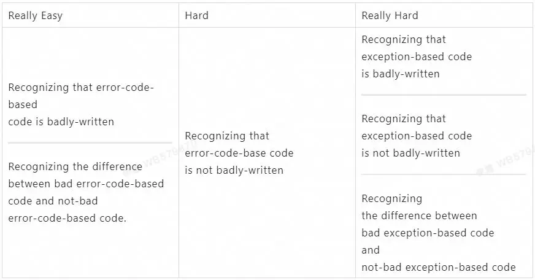

<!-- toc -->
[TOC]
## Could Not Recover
### 1. 哪些可以 Recover


Go 有Defer, Panic, and Recover。其中 defer 一般用在资源释放或者捕获 panic。而 panic 是中止正常的执行流程，执行所有的 defer，返回调用函数继续 panic；主动调用 panic 函数，还有些运行时错误都会进入 panic 过程。最后 recover 是在 panic 时获取控制权，进入正常的执行逻辑。


注意 recover 只有在 defer 函数中才有用，在 defer 的函数调用的函数中 recover 不起作用，如下实例代码不会 recover：


```go
package main

import "fmt"

func main() {
    f := func() {
        if r := recover(); r != nil {
            fmt.Println(r)
        }
    }

    defer func() {
        f()
    } ()

    panic("ok")
}
```

执行时依旧会 panic，结果如下：


```go
$ go run t.go 
panic: ok

goroutine 1 [running]:
main.main()
    /Users/winlin/temp/t.go:16 +0x6b
exit status 2
```

有些情况是不可以被捕获，程序会自动退出，这种都是无法正常 recover。当然，一般的 panic 都是能捕获的，比如 Slice 越界、nil 指针、除零、写关闭的 chan。


下面是 Slice 越界的例子，recover 可以捕获到：


```go
package main

import (
  "fmt"
)

func main() {
  defer func() {
    if r := recover(); r != nil {
      fmt.Println(r)
    }
  }()

  b := []int{0, 1}
  fmt.Println("Hello, playground", b[2])
}
```

下面是 nil 指针被引用的例子，recover 可以捕获到：


```go
package main

import (
  "bytes"
  "fmt"
)

func main() {
  defer func() {
    if r := recover(); r != nil {
      fmt.Println(r)
    }
  }()

  var b *bytes.Buffer
  fmt.Println("Hello, playground", b.Bytes())
}
```

下面是除零的例子，recover 可以捕获到：


```go
package main

import (
  "fmt"
)

func main() {
  defer func() {
    if r := recover(); r != nil {
      fmt.Println(r)
    }
  }()

  var v int
  fmt.Println("Hello, playground", 1/v)
}
```

下面是写关闭的 chan 的例子，recover 可以捕获到：


```go
package main

import (
  "fmt"
)

func main() {
  defer func() {
    if r := recover(); r != nil {
      fmt.Println(r)
    }
  }()

  c := make(chan bool)
  close(c)
  c <- true
}
```

### 2. Recover 最佳实践


一般 recover 后会判断是否 err，有可能需要处理特殊的 error，一般也需要打印日志或者告警，给一个 recover 的例子：

```go

package main

import (
    "fmt"
)

type Handler interface {
    Filter(err error, r interface{}) error
}

type Logger interface {
    Ef(format string, a ...interface{})
}

// Handle panic by hdr, which filter the error.
// Finally log err with logger.
func HandlePanic(hdr Handler, logger Logger) error {
    return handlePanic(recover(), hdr, logger)
}

type hdrFunc func(err error, r interface{}) error

func (v hdrFunc) Filter(err error, r interface{}) error {
    return v(err, r)
}

type loggerFunc func(format string, a ...interface{})

func (v loggerFunc) Ef(format string, a ...interface{}) {
    v(format, a...)
}

// Handle panic by hdr, which filter the error.
// Finally log err with logger.
func HandlePanicFunc(hdr func(err error, r interface{}) error,
    logger func(format string, a ...interface{}),
) error {
    var f Handler
    if hdr != nil {
        f = hdrFunc(hdr)
    }

    var l Logger
    if logger != nil {
        l = loggerFunc(logger)
    }

    return handlePanic(recover(), f, l)
}

func handlePanic(r interface{}, hdr Handler, logger Logger) error {
    if r != nil {
        err, ok := r.(error)
        if !ok {
            err = fmt.Errorf("r is %v", r)
        }

        if hdr != nil {
            err = hdr.Filter(err, r)
        }

        if err != nil && logger != nil {
            logger.Ef("panic err %+v", err)
        }

        return err
    }

    return nil
}

func main() {
    func() {
        defer HandlePanicFunc(nil, func(format string, a ...interface{}) {
            fmt.Println(fmt.Sprintf(format, a...))
        })

        panic("ok")
    }()

    logger := func(format string, a ...interface{}) {
        fmt.Println(fmt.Sprintf(format, a...))
    }
    func() {
        defer HandlePanicFunc(nil, logger)

        panic("ok")
    }()
}
```

对于库如果需要启动 goroutine，如何 recover 呢？


- 如果不可能出现 panic，可以不用 recover，比如 tls.go 中的一个 goroutine：errChannel <- conn.Handshake() ；


- 如果可能出现 panic，也比较明确的可以 recover，可以调用用户回调，或者让用户设置 logger，比如 http/server.go 处理请求的 goroutine：if err := recover(); err != nil && err != ErrAbortHandler { ；


- 如果完全不知道如何处理 recover，比如一个 cache 库，丢弃数据可能会造成问题，那么就应该由用户来启动 goroutine，返回异常数据和错误，用户决定如何 recover、如何重试；


- 如果完全知道如何 recover，比如忽略 panic 继续跑，或者能使用 logger 打印日志，那就按照正常的 panic-recover 逻辑处理。


### 3. 哪些不能 Recover


下面看看一些情况是无法捕获的，包括（不限于）：


Thread Limit，超过了系统的线程限制，详细参考下面的说明；

Concurrent Map Writers，竞争条件，同时写 map，参考下面的例子。推荐使用标准库的 sync.Map 解决这个问题。


Map 竞争写导致 panic 的实例代码如下：


```go
package main

import (
    "fmt"
    "time"
)

func main() {
    m := map[string]int{}
    p := func() {
        defer func() {
            if r := recover(); r != nil {
                fmt.Println(r)
            }
        }()
        for {
            m["t"] = 0
        }
    }

    go p()
    go p()
    time.Sleep(1 * time.Second)
}
```

> 注意：如果编译时加了 -race，其他竞争条件也会退出，一般用于死锁检测，但这会导致严重的性能问题，使用需要谨慎。


> 备注：一般标准库中通过 throw 抛出的错误都是无法 recover 的，搜索了下 Go1.11 一共有 690 个地方有调用 throw。


Go1.2 引入了能使用的最多线程数限制ThreadLimit，如果超过了就 panic，这个 panic 是无法 recover 的。


```go
fatal error: thread exhaustion

runtime stack:
runtime.throw(0x10b60fd, 0x11)
    /usr/local/Cellar/go/1.8.3/libexec/src/runtime/panic.go:596 +0x95
runtime.mstart()
    /usr/local/Cellar/go/1.8.3/libexec/src/runtime/proc.go:1132
```

默认是 1 万个物理线程，我们可以调用 runtime 的debug.SetMaxThreads 设置最大线程数。


> SetMaxThreads sets the maximum number of operating system threads that the Go program can use. If it attempts to use more than this many, the program crashes. SetMaxThreads returns the previous setting. The initial setting is 10,000 threads.


用这个函数设置程序能使用的最大系统线程数，如果超过了程序就 crash，返回的是之前设置的值，默认是 1 万个线程。


> The limit controls the number of operating system threads, not the number of goroutines. A Go program creates a new thread only when a goroutine is ready to run but all the existing threads are blocked in system calls, cgo calls, or are locked to other goroutines due to use of runtime.LockOSThread.


注意限制的并不是 goroutine 的数目，而是使用的系统线程的限制。goroutine 启动时，并不总是新开系统线程，只有当目前所有的物理线程都阻塞在系统调用、cgo 调用，或者显示有调用 runtime.LockOSThread 时。


> SetMaxThreads is useful mainly for limiting the damage done by programs that create an unbounded number of threads. The idea is to take down the program before it takes down the operating system.


这个是最后的防御措施，可以在程序干死系统前把有问题的程序干掉。


举一个简单的例子，限制使用 10 个线程，然后用 runtime.LockOSThread 来绑定 goroutine 到系统线程，可以看到没有创建 10 个 goroutine 就退出了（runtime 也需要使用线程）。参考下面的例子 Playground: ThreadLimit：


```go
package main

import (
  "fmt"
  "runtime"
  "runtime/debug"
  "sync"
  "time"
)

func main() {
  nv := 10
  ov := debug.SetMaxThreads(nv)
  fmt.Println(fmt.Sprintf("Change max threads %d=>%d", ov, nv))

  var wg sync.WaitGroup
  c := make(chan bool, 0)
  for i := 0; i < 10; i++ {
    fmt.Println(fmt.Sprintf("Start goroutine #%v", i))

    wg.Add(1)
    go func() {
      c <- true
      defer wg.Done()
      runtime.LockOSThread()
      time.Sleep(10 * time.Second)
      fmt.Println("Goroutine quit")
    }()

    <- c
    fmt.Println(fmt.Sprintf("Start goroutine #%v ok", i))
  }

  fmt.Println("Wait for all goroutines about 10s...")
  wg.Wait()

  fmt.Println("All goroutines done")
}
```

运行结果如下：


```go
Change max threads 10000=>10
Start goroutine #0
Start goroutine #0 ok
......
Start goroutine #6
Start goroutine #6 ok
Start goroutine #7
runtime: program exceeds 10-thread limit
fatal error: thread exhaustion

runtime stack:
runtime.throw(0xffdef, 0x11)
    /usr/local/go/src/runtime/panic.go:616 +0x100
runtime.checkmcount()
    /usr/local/go/src/runtime/proc.go:542 +0x100
......
    /usr/local/go/src/runtime/proc.go:1830 +0x40
runtime.startm(0x1040e000, 0x1040e000)
    /usr/local/go/src/runtime/proc.go:2002 +0x180
```

从这次运行可以看出，限制可用的物理线程为 10 个，其中系统占用了 3 个物理线程，user-level 可运行 7 个线程，开启第 8 个线程时就崩溃了。


> 注意这个运行结果在不同的 go 版本是不同的，比如 Go1.8 有时候启动 4 到 5 个 goroutine 就会崩溃。


而且加 recover 也无法恢复，参考下面的实例代码。


可见这个机制是最后的防御，不能突破的底线。我们在线上服务时，曾经因为 block 的 goroutine 过多，导致触发了这个机制。


```go
package main

import (
  "fmt"
  "runtime"
  "runtime/debug"
  "sync"
  "time"
)

func main() {
  defer func() {
    if r := recover(); r != nil {
      fmt.Println("main recover is", r)
    }
  } ()

  nv := 10
  ov := debug.SetMaxThreads(nv)
  fmt.Println(fmt.Sprintf("Change max threads %d=>%d", ov, nv))

  var wg sync.WaitGroup
  c := make(chan bool, 0)
  for i := 0; i < 10; i++ {
    fmt.Println(fmt.Sprintf("Start goroutine #%v", i))

    wg.Add(1)
    go func() {
      c <- true

      defer func() {
        if r := recover(); r != nil {
          fmt.Println("main recover is", r)
        }
      } ()

      defer wg.Done()
      runtime.LockOSThread()
      time.Sleep(10 * time.Second)
      fmt.Println("Goroutine quit")
    }()

    <- c
    fmt.Println(fmt.Sprintf("Start goroutine #%v ok", i))
  }

  fmt.Println("Wait for all goroutines about 10s...")
  wg.Wait()

  fmt.Println("All goroutines done")
}
```

如何避免程序超过线程限制被干掉？一般可能阻塞在 system call，那么什么时候会阻塞？还有，GOMAXPROCS 又有什么作用呢？


> The GOMAXPROCS variable limits the number of operating system threads that can execute user-level Go code simultaneously. There is no limit to the number of threads that can be blocked in system calls on behalf of Go code; those do not count against the GOMAXPROCS limit. This package's GOMAXPROCS function queries and changes the limit.


> GOMAXPROCS sets the maximum number of CPUs that can be executing simultaneously and returns the previous setting. If n < 1, it does not change the current setting. The number of logical CPUs on the local machine can be queried with NumCPU. This call will go away when the scheduler improves.


可见 GOMAXPROCS 只是设置 user-level 并行执行的线程数，也就是真正执行的线程数 。实际上如果物理线程阻塞在 system calls，会开启更多的物理线程。关于这个参数的说明，文章《Number of threads used by goroutine》解释得很清楚：


> There is no direct correlation. Threads used by your app may be less than, equal to or more than 10.


> So if your application does not start any new goroutines, threads count will be less than 10.


> If your app starts many goroutines (>10) where none is blocking (e.g. in system calls), 10 operating system threads will execute your goroutines simultaneously.


> If your app starts many goroutines where many (>10) are blocked in system calls, more than 10 OS threads will be spawned (but only at most 10 will be executing user-level Go code).


设置 GOMAXPROCS 为 10：如果开启的 goroutine 小于 10 个，那么物理线程也小于 10 个。如果有很多 goroutines，但是没有阻塞在 system calls，那么只有 10 个线程会并行执行。如果有很多 goroutines 同时超过 10 个阻塞在 system calls，那么超过 10 个物理线程会被创建，但是只有 10 个活跃的线程执行 user-level 代码。


那么什么时候会阻塞在 system blocking 呢？例子《Why does it not create many threads when many goroutines are blocked in writing》解释很清楚，虽然设置了 GOMAXPROCS 为 1，但实际上还是开启了 12 个线程，每个 goroutine 一个物理线程，具体执行下面的代码 Writing Large Block：


```go
package main

import (
  "io/ioutil"
  "os"
  "runtime"
  "strconv"
  "sync"
)

func main() {
  runtime.GOMAXPROCS(1)
  data := make([]byte, 128*1024*1024)

  var wg sync.WaitGroup
  for i := 0; i < 10; i++ {
    wg.Add(1)
    go func(n int) {
      defer wg.Done()
      for {
        ioutil.WriteFile("testxxx"+strconv.Itoa(n), []byte(data), os.ModePerm)
      }
    }(i)
  }

  wg.Wait()
}
```

运行结果如下：


```go
Mac chengli.ycl$ time go run t.go
real    1m44.679s
user    0m0.230s
sys    0m53.474s
```

> 虽然 GOMAXPROCS 设置为 1，实际上创建了 12 个物理线程。
> 有大量的时间是在 sys 上面，也就是 system calls。

> So I think the syscalls were exiting too quickly in your original test to show the effect you were expecting.


Effective Go 中的解释:


> Goroutines are multiplexed onto multiple OS threads so if one should block, such as while waiting for I/O, others continue to run. Their design hides many of the complexities of thread creation and management.


由此可见，如果程序出现因为超过线程限制而崩溃，那么可以在出现瓶颈时，用 linux 工具查看系统调用的统计，看哪些系统调用导致创建了过多的线程。


## Errors


错误处理是现实中经常碰到的、难以处理好的问题，下面会从下面几个方面探讨错误处理：


- 为什么 Go 没有选择异常，而是返回错误码(error)？ 因为异常模型很难看出有没有写对，错误码方式也不容易，相对会简单点；


- Go 的 error 有什么问题，为何 Go2 草案这么大篇幅说 error 改进？ 因为 Go 虽然是错误码但还不够好，问题在于啰嗦、繁杂、缺失关键信息；


- 有哪些好用的 error 库，如何和日志配合使用？ 推荐用库 pkg/errors；另外，避免日志和错误混淆；


- Go 的错误处理最佳实践是什么？ 配合日志使用错误。错误需要带上上下文、堆栈等信息。


### 1. 错误和异常


我们总会遇到非预期的非正常情况，有一种是符合预期的，比如函数返回 error 并处理，这种叫做可以预见到的错误，还有一种是预见不到的比如除零、空指针、数组越界等叫做 panic，panic 的处理主要参考Defer, Panic, and Recover。


错误处理的模型一般有两种，一般是错误码模型比如 C/C++ 和 Go，还有异常模型比如 Java 和 C#。Go 没有选择异常模型，因为错误码比异常更有优势，参考文章《Cleaner, more elegant, and wrong》以及《Cleaner, more elegant, and harder to recognize》。


看下面的代码：


```go
try {
  AccessDatabase accessDb = new AccessDatabase();
  accessDb.GenerateDatabase();
} catch (Exception e) {
  // Inspect caught exception
}

public void GenerateDatabase()
{
  CreatePhysicalDatabase();
  CreateTables();
  CreateIndexes();
}
```

这段代码的错误处理有很多问题，比如如果 CreateIndexes 抛出异常，会导致数据库和表不会删除，造成脏数据。从代码编写者和维护者的角度看这两个模型，会比较清楚：


Really Easy |  Hard | Really Hard
--|--|--
Writing bad error-code-based code<br/>Writing bad exception-based code |Writing good <br/> error-code-based code |Writing good <br/>exception-based code


> 错误处理不容易做好，要说容易那说明做错了；要把错误处理写对了，基于错误码模型虽然很难，但比异常模型简单。





> 如果使用错误码模型，非常容易就能看出错误处理没有写对，也能很容易知道做得好不好；要知道是否做得非常好，错误码模型也不太容易。
> 如果使用异常模型，无论做的好不好都很难知道，而且也很难知道怎么做好。


### 2. Errors in Go


Go 官方的 error 介绍，简单一句话就是返回错误对象的方式，参考《Error handling and Go》，解释了 error 是什么？如何判断具体的错误？以及显式返回错误的好处。


文中举的例子就是打开文件错误：


```
func Open(name string) (file *File, err error)
```

Go 可以返回多个值，最后一个一般是 error，我们需要检查和处理这个错误，这就是 Go 的错误处理的官方介绍：


```
if err := Open("src.txt"); err != nil {
    // Handle err
}
```

看起来非常简单的错误处理，有什么难的呢？稍等，在 Go2 的草案中，提到的三个点Error Handling、Error Values 和Generics 泛型，两个点都是错误处理的，这说明了 Go1 中对于错误是有改进的地方。


再详细看下 Go2 的草案，错误处理：Error Handling 中，主要描述了发生错误时的重复代码，以及不能便捷处理错误的情况。比如草案中举的这个例子 No Error Handling: CopyFile，没有做任何错误处理：


```go
package main

import (
  "fmt"
  "io"
  "os"
)

func CopyFile(src, dst string) error {
  r, _ := os.Open(src)
  defer r.Close()

  w, _ := os.Create(dst)
  io.Copy(w, r)
  w.Close()

  return nil
}

func main() {
  fmt.Println(CopyFile("src.txt", "dst.txt"))
}
```

还有草案中这个例子 Not Nice and still Wrong: CopyFile，错误处理是特别啰嗦，而且比较明显有问题：


```go
package main

import (
  "fmt"
  "io"
  "os"
)

func CopyFile(src, dst string) error {
  r, err := os.Open(src)
  if err != nil {
    return err
  }
  defer r.Close()

  w, err := os.Create(dst)
  if err != nil {
    return err
  }
  defer w.Close()

  if _, err := io.Copy(w, r); err != nil {
    return err
  }
  if err := w.Close(); err != nil {
    return err
  }
  return nil
}

func main() {
  fmt.Println(CopyFile("src.txt", "dst.txt"))
}
```

当 io.Copy 或 w.Close 出现错误时，目标文件实际上是有问题，那应该需要删除 dst 文件的。而且需要给出错误时的信息，比如是哪个文件，不能直接返回 err。所以 Go 中正确的错误处理，应该是这个例子 Good: CopyFile，虽然啰嗦繁琐不简洁：


```go
package main

import (
  "fmt"
  "io"
  "os"
)

func CopyFile(src, dst string) error {
  r, err := os.Open(src)
  if err != nil {
    return fmt.Errorf("copy %s %s: %v", src, dst, err)
  }
  defer r.Close()

  w, err := os.Create(dst)
  if err != nil {
    return fmt.Errorf("copy %s %s: %v", src, dst, err)
  }

  if _, err := io.Copy(w, r); err != nil {
    w.Close()
    os.Remove(dst)
    return fmt.Errorf("copy %s %s: %v", src, dst, err)
  }

  if err := w.Close(); err != nil {
    os.Remove(dst)
    return fmt.Errorf("copy %s %s: %v", src, dst, err)
  }
  return nil
}

func main() {
  fmt.Println(CopyFile("src.txt", "dst.txt"))
}
```

具体应该如何简洁的处理错误，可以读Error Handling，大致是引入关键字 handle 和 check，由于本文重点侧重 Go1 如何错误处理，就不展开分享了。


明显上面每次都返回的 fmt.Errorf 信息也是不够的，所以 Go2 还对于错误的值有提案，参考Error Values。大规模程序应该面向错误编程和测试，同时错误应该包含足够的信息。


Go1 中判断 error 具体是什么错误，有以下几种办法：

- 直接比较，比如返回的是 io.EOF 这个全局变量，那么可以直接比较是否是这个错误；

- 可以用类型转换 type 或 switch，尝试来转换成具体的错误类型，看是哪种错误；

- 提供某些函数来判断是否是某个错误，比如 os.IsNotExist 判断是否是指定错误；

- 当多个错误被糅合到一起时，只能用 error.Error() 返回的字符串匹配，看是否是某个错误。


在复杂程序中，有用的错误需要包含调用链的信息。例如，考虑一次数据库写，可能调用了 RPC，RPC 调用了域名解析，最终是没有权限读 /etc/resolve.conf 文件，那么给出下面的调用链会非常有用：

```
write users database: call myserver.Method: \
    dial myserver:3333: open /etc/resolv.conf: permission denied

```

### 3. Errors Solutions


由于 Go1 的错误值没有完整的解决这个问题，才导致出现非常多的错误处理的库，比如：


- 2017 年 12 月, upspin.io/errors，带逻辑调用堆栈的错误库，而不是执行的堆栈，引入了 errors.Is、errors.As 和 errors.Match；

- 2015 年 12 月, github.com/pkg/errors，带堆栈的错误，引入了 %+v 来格式化错误的额外信息比如堆栈；

- 2014 年 10 月, github.com/hashicorp/errwrap，可以 wrap 多个错误，引入了错误树，提供 Walk 函数遍历所有的错误；

- 2014 年 2 月, github.com/juju/errgo，Wrap 时可以选择是否隐藏底层错误。和 pkg/errors 的 Cause 返回最底层的错误不同，它只反馈错误链的下一个错误；

- 2013 年 7 月, github.com/spacemonkeygo/errors，是来源于一个大型 Python 项目，有错误的 hierarchies，自动记录日志和堆栈，还可以带额外的信息。打印错误的消息比较固定，不能自己定义；

- 2019 年 9 月，Go1.13 标准库扩展了 error，支持了 Unwrap、As 和 Is，但没有支持堆栈信息。


Go1.13 改进了 errors，参考如下实例代码：


```go
package main

import (
    "errors"
    "fmt"
    "io"
)

func foo() error {
    return fmt.Errorf("read err: %w", io.EOF)
}

func bar() error {
    if err := foo(); err != nil {
        return fmt.Errorf("foo err: %w", err)
    }
    return nil
}

func main() {
    if err := bar(); err != nil {
        fmt.Printf("err: %+v\n", err)
        fmt.Printf("unwrap: %+v\n", errors.Unwrap(err))
        fmt.Printf("unwrap of unwrap: %+v\n", errors.Unwrap(errors.Unwrap(err)))
        fmt.Printf("err is io.EOF? %v\n", errors.Is(err, io.EOF))
    }
}
```

运行结果如下：


```
err: foo err: read err: EOF
unwrap: read err: EOF
unwrap of unwrap: EOF
err is io.EOF? true
```

从上面的例子可以看出：

- 没有堆栈信息，主要是想通过 Wrap 的日志来标识堆栈，如果全部 Wrap 一层和堆栈差不多，不过对于没有 Wrap 的错误还是无法知道调用堆栈；

- Unwrap 只会展开第一个嵌套的 error，如果错误有多层嵌套，取不到最里面的那个 error，需要多次 Unwrap 才行；

- 用 errors.Is 能判断出是否是最里面的那个 error。


另外，错误处理往往和 log 是容易混为一谈的，因为遇到错误一般会打日志，特别是在 C/C 中返回错误码一般都会打日志记录下，有时候还会记录一个全局的错误码比如 linux 的 errno，而这种习惯，导致 error 和 log 混淆造成比较大的困扰。


考虑以前写了一个 C 的服务器，出现错误时会在每一层打印日志，所以就会形成堆栈式的错误日志，便于排查问题，如果只有一个错误，不知道调用上下文，排查会很困难：


```
avc decode avc_packet_type failed. ret=3001
Codec parse video failed, ret=3001
origin hub error, ret=3001
```

这种比只打印一条日志 origin hub error, ret=3001 要好，但是还不够好：

- 和 Go 的错误一样，比较啰嗦，有重复的信息。如果能提供堆栈信息，可以省去很多需要手动写的信息；

- 对于应用程序可以打日志，但是对于库，信息都应该包含在 error 中，不应该直接打印日志。如果底层的库都要打印日志，将会导致底层库都要依赖日志库，这时很多库都有日志打印函数供调用者重写；

- 对于多线程，看不到线程信息，或者看不到业务层 ID 的信息。对于服务器来说，有时候需要知道这个错误是哪个连接的，从而查询这个连接之前的上下文信息。


改进后的错误日志变成了在底层返回，而不在底层打印在调用层打印，有调用链和堆栈，有线程切换的 ID 信息，也有文件的行数：


```
Error processing video, code=3001 : origin hub : codec parser : avc decoder
[100] video_avc_demux() at [srs_kernel_codec.cpp:676]
[100] on_video() at [srs_app_source.cpp:1076]
[101] on_video_imp() at [srs_app_source:2357]
```

从 Go2 的描述来说，实际上这个错误处理也还没有考虑完备。从实际开发来说，已经比较实用了。


总结下 Go 的 error，错误处理应该注意以下几点：

- 凡是有返回错误码的函数，必须显式的处理错误，如果要忽略错误，也应该显式的忽略和写注释；

- 错误必须带丰富的错误信息，比如堆栈、发生错误时的参数、调用链给的描述等等。特别要强调变量，我看过太多日志描述了一对常量，比如 "Verify the nonce, timestamp and token of specified appid failed"，而这个消息一般会提到工单中，然后就是再问用户，哪个 session 或 request 甚至时间点？这么一大堆常量有啥用呢，关键是变量呐；尽量避免重复的信息，提高错误处

- 理的开发体验，糟糕的体验会导致无效的错误处理代码，比如拷贝和漏掉关键信息；

- 分离错误和日志，发生错误时返回带完整信息的错误，在调用的顶层决定是将错误用日志打印，还是发送到监控系统，还是转换错误，或者忽略。


### 4. Best Practice


推荐用github.com/pkg/errors 这个错误处理的库，基本上是够用的，参考 Refine: CopyFile，可以看到 CopyFile 中低级重复的代码已经比较少了：

```go
package main

import (
  "fmt"
  "github.com/pkg/errors"
  "io"
  "os"
)

func CopyFile(src, dst string) error {
  r, err := os.Open(src)
  if err != nil {
    return errors.Wrap(err, "open source")
  }
  defer r.Close()

  w, err := os.Create(dst)
  if err != nil {
    return errors.Wrap(err, "create dest")
  }

  nn, err := io.Copy(w, r)
  if err != nil {
    w.Close()
    os.Remove(dst)
    return errors.Wrap(err, "copy body")
  }

  if err := w.Close(); err != nil {
    os.Remove(dst)
    return errors.Wrapf(err, "close dest, nn=%v", nn)
  }

  return nil
}

func LoadSystem() error {
  src, dst := "src.txt", "dst.txt"
  if err := CopyFile(src, dst); err != nil {
    return errors.WithMessage(err, fmt.Sprintf("load src=%v, dst=%v", src, dst))
  }

  // Do other jobs.

  return nil
}

func main() {
  if err := LoadSystem(); err != nil {
    fmt.Printf("err %+v\n", err)
  }
}
```

> 改写的函数中，用 errors.Wrap 和 errors.Wrapf 代替了 fmt.Errorf，我们不记录 src 和 dst 的值，因为在上层会记录这个值（参考下面的代码），而只记录我们这个函数产生的数据，比如 nn。


```go
import "github.com/pkg/errors"

func LoadSystem() error {
    src, dst := "src.txt", "dst.txt"
    if err := CopyFile(src, dst); err != nil {
        return errors.WithMessage(err, fmt.Sprintf("load src=%v, dst=%v", src, dst))
    }

    // Do other jobs.

    return nil
}
```

> 在这个上层函数中，我们用的是 errors.WithMessage 添加了这一层的错误信息，包括 src 和 dst，所以 CopyFile 里面就不用重复记录这两个数据了。同时我们也没有打印日志，只是返回了带完整信息的错误。


```go
func main() {
    if err := LoadSystem(); err != nil {
        fmt.Printf("err %+v\n", err)
    }
}
```

> 在顶层调用时，我们拿到错误，可以决定是打印还是忽略还是送监控系统。


比如我们在调用层打印错误，使用 %+v 打印详细的错误，有完整的信息：


```go
err open src.txt: no such file or directory
open source
main.CopyFile
    /Users/winlin/t.go:13
main.LoadSystem
    /Users/winlin/t.go:39
main.main
    /Users/winlin/t.go:49
runtime.main
    /usr/local/Cellar/go/1.8.3/libexec/src/runtime/proc.go:185
runtime.goexit
    /usr/local/Cellar/go/1.8.3/libexec/src/runtime/asm_amd64.s:2197
load src=src.txt, dst=dst.txt
```

但是这个库也有些小毛病：

- CopyFile 中还是有可能会有重复的信息，还是 Go2 的 handle 和 check 方案是最终解决；

- 有时候需要用户调用 Wrap，有时候是调用 WithMessage（不需要加堆栈时），这个真是非常不好用的地方(这个我们已经修改了库，可以全部使用 Wrap 不用 WithMessage，会去掉重复的堆栈)。

## Logger


一直在码代码，对日志的理解总是不断在变，大致分为几个阶段：

- 日志是给人看的，是用来查问题的。出现问题后根据某些条件，去查不同进程或服务的日志。日志的关键是不能漏掉信息，漏了关键日志，可能就断了关键的线索；

- 日志必须要被关联起来，上下文的日志比单个日志更重要。长连接需要根据会话关联日志；不同业务模型有不同的上下文，比如服务器管理把服务器作为关键信息，查询这个服务器的相关日志；全链路跨机器和服务的日志跟踪，需要定义可追踪的逻辑 ID；

- 海量日志是给机器看的，是结构化的，能主动报告问题，能从日志中分析潜在的问题。日志的关键是要被不同消费者消费，要输出不同主题的日志，不同的粒度的日志。日志可以用于排查问题，可以用于告警，可以用于分析业务情况。


> Note: 推荐阅读 Kafka 对于 Log 的定义，广义日志是可以理解的消息，The Log: What every software engineer should know about real-time data's unifying abstraction。


### 1. 完善信息查问题


考虑一个服务，处理不同的连接请求：


```go
package main

import (
    "context"
    "fmt"
    "log"
    "math/rand"
    "os"
    "time"
)

type Connection struct {
    url    string
    logger *log.Logger
}

func (v *Connection) Process(ctx context.Context) {
    go checkRequest(ctx, v.url)

    duration := time.Duration(rand.Int()%1500) * time.Millisecond
    time.Sleep(duration)
    v.logger.Println("Process connection ok")
}

func checkRequest(ctx context.Context, url string) {
    duration := time.Duration(rand.Int()%1500) * time.Millisecond
    time.Sleep(duration)
    logger.Println("Check request ok")
}

var logger *log.Logger

func main() {
    ctx := context.Background()

    rand.Seed(time.Now().UnixNano())
    logger = log.New(os.Stdout, "", log.LstdFlags)

    for i := 0; i < 5; i++ {
        go func(url string) {
            connecton := &Connection{}
            connecton.url = url
            connecton.logger = logger
            connecton.Process(ctx)
        }(fmt.Sprintf("url #%v", i))
    }

    time.Sleep(3 * time.Second)
}
```

这个日志的主要问题，就是有了和没有差不多，啥也看不出来，常量太多变量太少，缺失了太多的信息。看起来这是个简单问题，却经常容易犯这种问题，需要我们在打印每个日志时，需要思考这个日志比较完善的信息是什么。


上面程序输出的日志如下：


```go
2019/11/21 17:08:04 Check request ok
2019/11/21 17:08:04 Check request ok
2019/11/21 17:08:04 Check request ok
2019/11/21 17:08:04 Process connection ok
2019/11/21 17:08:05 Process connection ok
2019/11/21 17:08:05 Check request ok
2019/11/21 17:08:05 Process connection ok
2019/11/21 17:08:05 Check request ok
2019/11/21 17:08:05 Process connection ok
2019/11/21 17:08:05 Process connection ok
```

如果完善下上下文信息，代码可以改成这样：


```go
type Connection struct {
    url    string
    logger *log.Logger
}

func (v *Connection) Process(ctx context.Context) {
    go checkRequest(ctx, v.url)

    duration := time.Duration(rand.Int()%1500) * time.Millisecond
    time.Sleep(duration)
    v.logger.Println(fmt.Sprintf("Process connection ok, url=%v, duration=%v", v.url, duration))
}

func checkRequest(ctx context.Context, url string) {
    duration := time.Duration(rand.Int()%1500) * time.Millisecond
    time.Sleep(duration)
    logger.Println(fmt.Sprintf("Check request ok, url=%v, duration=%v", url, duration))
}
```

输出的日志如下：


```go
2019/11/21 17:11:35 Check request ok, url=url #3, duration=32ms
2019/11/21 17:11:35 Check request ok, url=url #0, duration=226ms
2019/11/21 17:11:35 Process connection ok, url=url #0, duration=255ms
2019/11/21 17:11:35 Check request ok, url=url #4, duration=396ms
2019/11/21 17:11:35 Check request ok, url=url #2, duration=449ms
2019/11/21 17:11:35 Process connection ok, url=url #2, duration=780ms
2019/11/21 17:11:35 Check request ok, url=url #1, duration=1.01s
2019/11/21 17:11:36 Process connection ok, url=url #4, duration=1.099s
2019/11/21 17:11:36 Process connection ok, url=url #3, duration=1.207s
2019/11/21 17:11:36 Process connection ok, url=url #1, duration=1.257s
```

### 2. 上下文关联


完善日志信息后，对于服务器特有的一个问题，就是如何关联上下文，常见的上下文包括：

- 如果是短连接，一条日志就能描述，那可能要将多个服务的日志关联起来，将全链路的日志作为上下文；

- 如果是长连接，一般长连接一定会有定时信息，比如每隔 5 秒输出这个链接的码率和包数，这样每个链接就无法使用一条日志描述了，链接本身就是一个上下文；

- 进程内的逻辑上下文，比如代理的上下游就是一个上下文，合并回源，故障上下文，客户端重试等。


以上面的代码为例，可以用请求 URL 来作为上下文。


```go
package main

import (
    "context"
    "fmt"
    "log"
    "math/rand"
    "os"
    "time"
)

type Connection struct {
    url    string
    logger *log.Logger
}

func (v *Connection) Process(ctx context.Context) {
    go checkRequest(ctx, v.url)

    duration := time.Duration(rand.Int()%1500) * time.Millisecond
    time.Sleep(duration)
    v.logger.Println(fmt.Sprintf("Process connection ok, duration=%v", duration))
}

func checkRequest(ctx context.Context, url string) {
    duration := time.Duration(rand.Int()%1500) * time.Millisecond
    time.Sleep(duration)
    logger.Println(fmt.Sprintf("Check request ok, url=%v, duration=%v", url, duration))
}

var logger *log.Logger

func main() {
    ctx := context.Background()

    rand.Seed(time.Now().UnixNano())
    logger = log.New(os.Stdout, "", log.LstdFlags)

    for i := 0; i < 5; i++ {
        go func(url string) {
            connecton := &Connection{}
            connecton.url = url
            connecton.logger = log.New(os.Stdout, fmt.Sprintf("[CONN %v] ", url), log.LstdFlags)
            connecton.Process(ctx)
        }(fmt.Sprintf("url #%v", i))
    }

    time.Sleep(3 * time.Second)
}
```

运行结果如下所示：


```go
[CONN url #2] 2019/11/21 17:19:28 Process connection ok, duration=39ms
2019/11/21 17:19:28 Check request ok, url=url #0, duration=149ms
2019/11/21 17:19:28 Check request ok, url=url #1, duration=255ms
[CONN url #3] 2019/11/21 17:19:28 Process connection ok, duration=409ms
2019/11/21 17:19:28 Check request ok, url=url #2, duration=408ms
[CONN url #1] 2019/11/21 17:19:29 Process connection ok, duration=594ms
2019/11/21 17:19:29 Check request ok, url=url #4, duration=615ms
[CONN url #0] 2019/11/21 17:19:29 Process connection ok, duration=727ms
2019/11/21 17:19:29 Check request ok, url=url #3, duration=1.105s
[CONN url #4] 2019/11/21 17:19:29 Process connection ok, duration=1.289s
```

如果需要查连接 2 的日志，可以 grep 这个 url #2 关键字：


```go
Mac:gogogo chengli.ycl$ grep 'url #2' t.log
[CONN url #2] 2019/11/21 17:21:43 Process connection ok, duration=682ms
2019/11/21 17:21:43 Check request ok, url=url #2, duration=998ms
```

然鹅，还是发现有不少问题：

- 如何实现隐式标识，调用时如何简单些，不用没打一条日志都需要传一堆参数？

- 一般 logger 是公共函数（或者是每个类一个 logger），而上下文的生命周期会比 logger 长，比如 checkRequest 是个全局函数，标识信息必须依靠人打印，这往往是不可行的；

- 如何实现日志的 logrotate(切割和轮转)，如何收集多个服务器日志。


解决办法包括：


- 用 Context 的 WithValue 来将上下文相关的 ID 保存，在打印日志时将 ID 取出来；

- 如果有业务特征，比如可以取 SessionID 的 hash 的前 8 个字符形成 ID，虽然容易碰撞，但是在一定范围内不容易碰撞；

- 可以变成 json 格式的日志，这样可以将 level、id、tag、file、err 都变成可以程序分析的数据，送到 SLS 中处理；

- 对于切割和轮转，推荐使用lumberjack 这个库，程序的 logger 只要提供 SetOutput(io.Writer) 将日志送给它处理就可以了。


> 当然，这要求函数传参时需要带 context.Context，一般在自己的应用程序中可以要求这么做，凡是打日志的地方要带 context。对于库，一般可以不打日志，而返回带堆栈的复杂错误的方式，参考 Errors 错误处理部分。