<!-- toc -->
[TOC]
# Golang 笔记之深入浮点数

## 引言
下面的一段简单程序 0.3 + 0.6 结果是什么？
```
var f1 float64 = 0.3
var f2 float64 = 0.6
fmt.Println(f1 + f2)
```

有人会天真的认为是0.9，但实际输出却是0.8999999999999999（go 1.13.5）
问题在于大多数小数表示成二进制之后是近似且无限的。
以0.1为例。它可能是你能想到的最简单的十进制之一，但是二进制看起来却非常复杂：0.0001100110011001100…
其是一串连续循环无限的数字（涉及到10进制转换为2进制，暂不介绍）。
结果的荒诞性告诉我们，必须深入理解浮点数在计算机中的存储方式及其性质，才能正确处理数字的计算。
golang 与其他很多语言（C、C++、Python…）一样，使用了IEEE-754标准存储浮点数。

## IEEE-754 如何存储浮点数
IEEE-754规范使用特殊的以2为基数的科学表示法表示浮点数。

基本的10进制数字 | 科学计数法表示 | 指数表示 | 系数 | 底数 | 指数 | 小数
---|---|---|---|---|---|---|---
700 | 7e+2 |7 * 10^2 | 7 | 10|2|0
4,900,000,000|4.9e+9|4.9 * 10^9 |4.9|10|9|.9
5362.63|5.36263e+3|5.36263 * 10^3|5.36263 |10|3|.36263
-0.00345|3.45e-3|3.45 * 10^-3|3.45|10|-3|.45
0.085 |1.36e-4|1.36*2^-4 |1.36|2|-4|.36

32位的单精度浮点数 与 64位的双精度浮点数的差异
精度 |符号位| 指数位|小数位|偏移量
---|---|---|---|---
Single(32 Bits) |1[31] |8[30-23]|23[22-00]|127
Double(64 Bits)|1[63]|11[62-52]|52[51-00]|1023

符号位：1 为 负数， 0 为正数。
指数位：存储 指数加上偏移量，偏移量是为了表达负数而设计的。
小数位：存储系数的小数位的准确或者最接近的值。

以 数字 0.085 为例。
符号位 |指数位(123)|小数位(.36)
---|---|---
0| 0111 1011|010 1110 0001 0100 0111 1011 

## 小位数的表达方式
以0.36 为例:
010 1110 0001 0100 0111 1011 = 0.36 (第一位数字代表1/2,第二位数字是1/4…，0.36 是所有位相加)
分解后的计算步骤为:

第n位 | 2的幂 |分数 |10进制|求和
---|---|---|---|---
2|4|1/4|0.25|0.25
4|16|1/16|0.0625|0.3125
5|32|1/32|0.03125|0.34375
6|64|1/64|0.015625|0.359375
11|2048|1/2048|0.00048828125|0.35986328125
13|8192|1/8192|0.0001220703125|0.3599853515625
17|131072|1/131072|0.00000762939453|0.35999298095703
18|262144|1/262144|0.00000381469727|0.3599967956543
19|524288|1/524288|0.00000190734863|0.35999870300293
20|1048576|1/1048576|0.00000095367432|0.35999965667725
22|4194304|1/4194304|0.00000023841858|0.35999989509583
23|8388608|1/8388608|0.00000011920929|0.36000001430512

## go语言显示浮点数 - 验证之前的理论

接下来用一个案例有助于我们理解并验证IEEE-754 浮点数的表示方式。

math.Float32bits 可以为我们打印出32位数据的二进制表示。(注：math.Float64bits可以打印64位数据的二进制)

下面的go代码将输出0.085的浮点数二进制表达，并且为了验证之前理论的正确性，根据二进制表示反向推导出其所表示的原始十进制0.085

```go
var number float32 = 0.085
// 打印出32位数据的二进制表示。
bits := math.Float32bits(number)
binary := fmt.Sprintf("%.32b", bits)
 // 打印浮点数的符号位、指数位 、小数位
fmt.Printf("Bit Pattern: %s | %s %s | %s %s %s %s %s %s\n\n",
  binary[0:1],
  binary[1:5], binary[5:9],
  binary[9:12], binary[12:16], binary[16:20],
  binary[20:24], binary[24:28], binary[28:32])
 // 偏移量
bias := 127
 // 获取符号位
sign := bits & (1 << 31)
exponentRaw := int(bits >> 23)
 // 获取指数位
exponent := exponentRaw - bias

var mantissa float64
 // 小数位求和
for index, bit := range binary[9:32] {
  if bit == 49 {
    position := index + 1
    bitValue := math.Pow(2, float64(position))
    fractional := 1 / bitValue
    mantissa = mantissa + fractional
  }
}
 // 反向求出最终10进制表示
value := (1 + mantissa) * math.Pow(2, float64(exponent))

fmt.Printf("Sign: %d Exponent: %d (%d) Mantissa: %f Value: %f\n\n",
  sign,
  exponentRaw,
  exponent,
  mantissa,
  value)
```

输出:
```
Starting Number: 0.085000
Bit Pattern: 0 | 0111 1011 | 010 1110 0001 0100 0111 1011
Sign: 0 Exponent: 123 (-4) Mantissa: 0.360000 Value: 0.085000
```
表明我们对于浮点数的理解正确。


## 经典问题：如何判断一个浮点数其实存储的是整数

下面是一个有趣的问题，如何判断一个浮点数其实存储的是整数？


下面是一段判断浮点数是否为整数的go代码实现，我们接下来逐行分析函数。
它可以加深对于浮点数的理解

```go
func IsInt(bits uint32, bias int) {
    exponent := int(bits >> 23) - bias - 23
    coefficient := (bits & ((1 << 23) - 1)) | (1 << 23)
    intTest := (coefficient & (1 << uint32(-exponent) - 1))

    fmt.Printf("\nExponent: %d Coefficient: %d IntTest: %d\n",
        exponent,
        coefficient,
        intTest)

    if exponent < -23 {
        fmt.Printf("NOT INTEGER\n")
        return
    }

    if exponent < 0 && intTest != 0 {
        fmt.Printf("NOT INTEGER\n")
        return
    }

    fmt.Printf("INTEGER\n")
}
```

1、要保证是整数，一个重要的条件是必须要指数位大于127，如果指数位为127，代表指数为0. 指数位大于127，代表指数大于0， 反之小于0.

下面我们以数字234523为例子：
```
Starting Number: 234523.000000
Bit Pattern: 0 | 1001 0000 | 110 0101 0000 0110 1100 0000
Sign: 0 Exponent: 144 (17) Mantissa: 0.789268 Value: 234523.000000
Exponent: -6 Coefficient: 15009472 IntTest: 0
INTEGER
```
第一步,计算指数。由于 多减去了23，所以在第一个判断中 判断条件为 exponent < -23
exponent := int(bits >> 23) - bias - 23

第二步，
(bits & ((1 << 23) - 1)) 计算小数位。
```
coefficient := (bits & ((1 << 23) - 1)) | (1 << 23)

Bits:                   01001000011001010000011011000000
(1 << 23) - 1:          00000000011111111111111111111111
bits & ((1 << 23) - 1): 00000000011001010000011011000000
```
| (1 << 23) 代表 将1加在前方。
1 + 小数 = 系数。
```

bits & ((1 << 23) - 1): 00000000011001010000011011000000
(1 << 23):              00000000100000000000000000000000
coefficient:            00000000111001010000011011000000
```
第三步，计算intTest 只有当指数的倍数可以弥补最小的小数位的时候，才是一个整数。
如下，指数是17位，其不能够弥补最后6位的小数。即不能弥补1/2^18 的小数。
由于2^18位之后为0.所以是整数。
```
exponent:                     (144 - 127 - 23) = -6
1 << uint32(-exponent):       000000
(1 << uint32(-exponent)) - 1: 111111

coefficient:                 00000000111001010000011011000000
1 << uint32(-exponent)) - 1: 00000000000000000000000000111111
intTest:                     00000000000000000000000000000000
```

## golang decimal 包详解
要理解decimal包，首先需要知道两个重要的概念，Normal number、denormal (or subnormal) number 以及精度。
### 1.概念：Normal number and denormal (or subnormal) number
wiki的解释是：
```
In computing, a normal number is a non-zero number in a floating-point representation which is within the balanced range supported by a given floating-point format: it is a floating point number that can be represented without leading zeros in its significand.
```
什么意思呢？在IEEE-754中指数位有一个偏移量，偏移量是为了表达负数而设计的。比如单精度中的0.085，实际的指数是 -3， 存储到指数位是123。
所以表达的负数就是有上限的。这个上限就是2^-126。如果比这个负数还要小，例如2^-127,这个时候应该表达为0.1 * 2 ^ -126. 这时系数变为了不是1为前导的数，这个数就叫做denormal (or subnormal) number。
正常的系数是以1为前导的数就叫做Normal number。

### 2.概念：精度
精度是一个非常复杂的概念，在这里笔者讨论的是2进制浮点数的10进制精度。
精度为d表示的是在一个范围内，如果我们将d位10进制（按照科学计数法表达）转换为二进制。再将二进制转换为d位10进制。数据不损失意味着在此范围内是有d精度的。
精度的原因在于，数据在进制之间相互转换时，是不能够精准匹配的，而是匹配到一个最近的数。如图所示：

精度转换
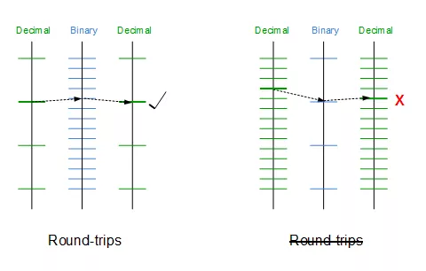

在这里暂时不深入探讨，而是给出结论：（注：精度是动态变化的，不同的范围可能有不同的精度。这是由于 2的幂 与 10的幂之间的交错是不同的。）

float32的精度为6-8位，

float64的精度为15-17位

目前使用比较多的精准操作浮点数的decimal包是shopspring/decimal。链接:https://github.com/shopspring/decimal

decimal包使用math/big包存储大整数并进行大整数的计算。

比如对于字符串 “123.45” 我们可以将其转换为12345这个大整数，以及-2代表指数。参考decimal结构体：
```

type Decimal struct {
  value *big.Int
  exp int32
}
```
在本文中，笔者不会探讨math/big是如何进行大整数运算的，而是探讨decimal包一个非常重要的函数：

NewFromFloat(value float64) Decimal

其主要调用了下面的函数：

```go
func newFromFloat(val float64, bits uint64, flt *floatInfo) Decimal {
  if math.IsNaN(val) || math.IsInf(val, 0) {
    panic(fmt.Sprintf("Cannot create a Decimal from %v", val))
  }
  exp := int(bits>>flt.mantbits) & (1<<flt.expbits - 1)
  mant := bits & (uint64(1)<<flt.mantbits - 1)
  switch exp {
  case 0:
    exp++
  default:
    mant |= uint64(1) << flt.mantbits
  }
  exp += flt.bias
  var d decimal
  d.Assign(mant)
  d.Shift(exp - int(flt.mantbits))
  d.neg = bits>>(flt.expbits+flt.mantbits) != 0
  roundShortest(&d, mant, exp, flt)
  if d.nd < 19 {
    tmp := int64(0)
    m := int64(1)
    for i := d.nd - 1; i >= 0; i-- {
      tmp += m * int64(d.d[i]-'0')
      m *= 10
    }
    if d.neg {
      tmp *= -1
    }
    return Decimal{value: big.NewInt(tmp), exp: int32(d.dp) - int32(d.nd)}
  }
  dValue := new(big.Int)
  dValue, ok := dValue.SetString(string(d.d[:d.nd]), 10)
  if ok {
    return Decimal{value: dValue, exp: int32(d.dp) - int32(d.nd)}
  }
  return NewFromFloatWithExponent(val, int32(d.dp)-int32(d.nd))
}
```
此函数会将浮点数转换为Decimal结构。
读者想象一下这个问题：如果存储到浮点数中的值（例如0.1）本身就是一个近似值，为什么decimal包能够解决计算的准确性？
原因在于，deciimal包可以精准的将一个浮点数转换为10进制。这就是NewFromFloat为我们做的事情。
下面我将对此函数做逐行分析。

```

//2-4行判断浮点数有效性，不能为NAN或INF
   if math.IsNaN(val) || math.IsInf(val, 0) {
  panic(fmt.Sprintf("Cannot create a Decimal from %v", val))
}
```
第5行：剥离出IEEE浮点数的指数位
exp := int(bits>>flt.mantbits) & (1<<flt.expbits - 1)

第6行：剥离出浮点数的系数的小数位
mant := bits & (uint64(1)<<flt.mantbits - 1)

第7行：如果是指数位为0，代表浮点数是denormal (or subnormal) number；
默认情况下会在mant之前加上1，因为mant只是系数的小数，在前面加上1后，代表真正的小数位。
现在 mant = IEEE浮点数系数 * 2^53

第13行：加上偏移量，exp现在代表真正的指数。
第14行：引入了一个中间结构decimal

```go

type decimal struct {
  d     [800]byte
  nd    int
  dp    int
  neg   bool
  trunc bool
}
```
第15行：调用d.Assign(mant) , 将mant作为10进制数，存起来。
10进制数的每一位都作为一个字符存储到 decimal的byte数组中
```go

func (a *decimal) Assign(v uint64) {
  var buf [24]byte

  // Write reversed decimal in buf.
  n := 0
  for v > 0 {
    v1 := v / 10
    v -= 10 * v1
    buf[n] = byte(v + '0')
    n++
    v = v1
  }

  // Reverse again to produce forward decimal in a.d.
  a.nd = 0
  for n--; n >= 0; n-- {
    a.d[a.nd] = buf[n]
    a.nd++
  }
  a.dp = a.nd
  trim(a)
}
```
第16行：调用shift函数，这个函数非常难理解。
```go
func (a *decimal) Shift(k int) {
  switch {
  case a.nd == 0:
  case k > 0:
    for k > maxShift {
      leftShift(a, maxShift)
      k -= maxShift
    }
    leftShift(a, uint(k))
  case k < 0:
    for k < -maxShift {
      rightShift(a, maxShift)
      k += maxShift
    }
    rightShift(a, uint(-k))
  }
}
```
此函数的功能是为了获取此浮点数代表的10进制数据的整数位个数以及小数位个数，此函数的完整证明附后。（注1)
exp是真实的指数，其也是能够覆盖小数部分2进制位的个数。（参考前面如何判断浮点数是整数）
exp - int(flt.mantbits)代表不能被exp覆盖的2进制位的个数
如果exp - int(flt.mantbits) > 0 代表exp能够完全覆盖小数位 因此 浮点数是一个非常大的整数，这时会调用leftShift(a, uint(k))。否则将调用rightShift(a, uint(-k)), 常规rightShift会调用得更多。因此我们来看看rightShift函数的实现。

第5行：此for循环将计算浮点数10进制表示的小数部分的有效位为 r-1 。
n >> k 是一个重要的衡量指标，代表了小数部分与整数部分的分割。此函数的完整证明附后。（注1)

第21行：此时整数部分所占的有效位数为a.dp -=（r-1）
第24行：这两个循环做了2件事情：
1、计算10进制表示的有效位数
2、将10进制表示存入bytes数组中。例如对于浮点数64.125，现在byte数组存储的前5位就是64125
```go
func rightShift(a *decimal, k uint) {
  r := 0
  w := 0
  var n uint
  for ; n>>k == 0; r++ {
    if r >= a.nd {
      if n == 0 {
        a.nd = 0
        return
      }
      for n>>k == 0 {
        n = n * 10
        r++
      }
      break
    }
    c := uint(a.d[r])
    n = n*10 + c - '0'
  }
  // 整数部分的有效位数
  a.dp -= r - 1

  var mask uint = (1 << k) - 1
    // 整数部分
  for ; r < a.nd; r++ {
    c := uint(a.d[r])
    dig := n >> k
    n &= mask
    a.d[w] = byte(dig + '0')
    w++
    n = n*10 + c - '0'
  }
    // 小数部分
  for n > 0 {
    dig := n >> k
    n &= mask
    if w < len(a.d) {
      a.d[w] = byte(dig + '0')
      w++
    } else if dig > 0 {
      a.trunc = true
    }
    n = n * 10
  }
    // 有效位
  a.nd = w
  trim(a)
}
```
继续回到newFromFloat函数，第18行，调用了roundShortest函数，
此函数非常关键。其会将浮点数转换为离其最近的十进制数。
这是为什么decimal.NewFromFloat(0.1)能够精准表达0.1的原因。

参考上面的精度，此函数主要考察了2的幂与10的幂之间的交错关系。四舍五入到最接近的10进制值。
此函数实质实现的是Grisu3 算法,有想深入了解的可以去看看论文。笔者在这里提示几点：
1、2^exp <= d < 10^dp。
2、10进制数之间至少相聚10^(dp-nd)
3、2的幂之间的最小间距至少为2^(exp-mantbits)
4、什么时候d就是最接近2进制的10进制数？
如果10^(dp-nd) > 2^(exp-mantbits)，表明 当十进制下降一个最小位数时，匹配到的是更小的数字value - 2^(exp-mantbits)，所以d就是最接近浮点数的10进制数。
```go
func roundShortest(d *decimal, mant uint64, exp int, flt *floatInfo) {
    if mant == 0 {
      d.nd = 0
      return
    }
        // d 是否就是最接近的2进制数。
    minexp := flt.bias + 1 // minimum possible exponent
    if exp > minexp && 332*(d.dp-d.nd) >= 100*(exp-int(flt.mantbits)) {
      // The number is already shortest.
      return
    }
        // 计算最接近的大于d的10进制数
    upper := new(decimal)
    upper.Assign(mant*2 + 1)
    upper.Shift(exp - int(flt.mantbits) - 1)

    var mantlo uint64
    var explo int
    if mant > 1<<flt.mantbits || exp == minexp {
      mantlo = mant - 1
      explo = exp
    } else {
      mantlo = mant*2 - 1
      explo = exp - 1
    }
        // 计算最接近的小于d的10进制数
    lower := new(decimal)
    lower.Assign(mantlo*2 + 1)
    lower.Shift(explo - int(flt.mantbits) - 1)

    inclusive := mant%2 == 0

    //进行四舍五入
    ...
    }
  }
}
```
继续回到newFromFloat函数，第19行 如果精度小于19，是位于int64范围内的，可以使用快速路径，否则使用math/big包进行赋值操作，效率稍微要慢一些。
第36行，正常情况几乎不会发生。如果setstring在异常的情况下会调用NewFromFloatWithExponent 指定精度进行四舍五入截断。

## 注一：快速的获取一个浮点数代表的十进制
以典型的数字64.125 为例 ， 它可以被浮点数二进制精准表达为：
Bit Patterns: 0 | 10000000101 | 0000000010000000000000000000000000000000000000000000
Sign: 0 | Exponent: 1029 (6) | Mantissa: 0.001953

即 64.125 = 1.001953125 * 2^6
注意观察浮点数的小数位在第九位有1, 代表2^-9 即 0.001953125.

我们在浮点数的小数位前 附上数字1，10000000010000000000000000000000000000000000000000000 代表其为1 / 2^0 .

此时我们可以认为这个数代表的是1.001953125. 那么这样长的二进制数变为10进制又是多少呢:4512395720392704。

即 1.001953125 = 4512395720392704 * 2^(-52)

所以64.125 = 4512395720392704 * 2^(-52) * 2^6 = 4512395720392704 * 2^(-46)
在这里，有一种重要的等式。即 (2 ^ -46) 等价于向左移动了46位。并且移动后剩下的部分即为64,而舍弃的部分其实是小数部分0.125。
这个等式看似复杂其实很好证明，即第46位其实代表的是2^45。其除以2^46后是一个小数。依次类推…

因此对于数字 4512395720392704 ， 我们可以用4，45，451，4512 … 依次除以 2 ^ 46. 一直到找到数451239572039270 其除以2^46不为0。这个不为0的数一定为6。
接着我们保留后46位，其实是保留了小数位。

假设 4512395720392704 / 2^46 = (6 + num)
64.125 =(6 + num) * 10 + C = 60 + 10* num + C

当我们将通过位运算保留后46位，设为A, 则 A / 2^46 = num
所以 (A * 10 + C) / 2 ^46 =(num * 10 +C) = 4.125
此我们又可以把4提取出来。实在精彩。
10进制小数位的提取是一样的，留给读者自己探索。

## 总结

1、本文介绍了go语言使用的IEEE-754标准存储浮点数的具体存储方式。

2、本文通过实际代码片段和一个脑筋急转弯帮助读者理解浮点数的存储方式。

3、本文介绍了normal number 以及精度这两个重要概念。

4、本文详细介绍了shopspring/decimal的实现方式，即借助了big.int，以及进制的巧妙精准转换。

5、shopspring/decimal其实在精度的巧妙转换方面参考了go源码ftoa函数的实现。读者可以参考go源码

6、shopspring/decimal目前roundShortest函数有一个bug，笔者已经提交了pr，此bug已在go源码中得到了修复。

7、big.int计算存在效率问题，如果遇到特殊的快速大量计算的场景可能不太适合。

8、还有一些decimal的实现，例如tibd/decimal,代码实在不忍淬读。

9、浮点数计算，除了要解决进制的转换外，还需要解决重要的溢出问题，例如相乘常常要超过int64的范围，这就是为什么shopspring/decimal使用了big.int,而tibd/decimal将数据转换为了很多的word（int32），导致其计算非常复杂。


# IEEE 754浮点数标准详解

在计算机系统的发展过程中，业界曾经提出过许多种实数的表达方法，比较典型的有相对于浮点数（Floating Point Number）的定点数（Fixed Point Number）。在定点数表达法中，其小数点固定地位于实数所有数字中间的某个位置。例如，货币的表达就可以采用这种表达方式，如 55.00 或者 00.55 可以用于表达具有 4 位精度，小数点后有两位的货币值。由于小数点位置固定，所以可以直接用 4 位数值来表达相应的数值。

但我们不难发现，定点数表达法的缺点就在于其形式过于僵硬，固定的小数点位置决定了固定位数的整数部分和小数部分，不利于同时表达特别大的数或者特别小的数。因此，最终绝大多数现代的计算机系统都采纳了所谓的浮点数表达法。

浮点数表达法采用了科学计数法来表达实数，即用一个有效数字。一个基数（Base）、一个指数（Exponent）以及一个表示正负的符号来表达实数。比如，666.66 用十进制科学计数法可以表达为 6.6666×102（其中，6.6666 为有效数字，10 为基数，2 为指数）。浮点数利用指数达到了浮动小数点的效果，从而可以灵活地表达更大范围的实数。

当然，对实数的浮点表示仅作如上的规定是不够的，因为同一实数的浮点表示还不是唯一的。例如，上面例子中的 666.66 可以表达为 0.66666×10<sup>3</sup>、6.6666×10<sup>2</sup> 或者 66.666×10<sup>1</sup> 三种方式。因为这种表达的多样性，因此有必要对其加以规范化以达到统一表达的目标。规范的浮点数表达方式具有如下形式：

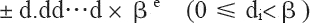
其中，d.dd…d 为有效数字，β 为基数，e 为指数。

有效数字中数字的个数称为精度，我们可以用 p 来表示，即可称为 p 位有效数字精度。每个数字 d 介于 0 和基数 β 之间，包括 0。更精确地说，±d0.d1d2…dp-1×β<sup>e</sup> 表示以下数：
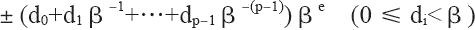

其中，对十进制的浮点数，即基数 β 等于 10 的浮点数而言，上面的表达式非常容易理解。如 12.34，我们可以根据上面的表达式表达为：1×10<sup>1</sup>+2×10<sup>0</sup>+3×10<sup>-1</sup>+4×10<sup>-2</sup>，其规范浮点数表达为1.234×10<sup>1</sup>。

但对二进制来说，上面的表达式同样可以简单地表达。唯一不同之处在于：二进制的 β 等于 2，而每个数字 d 只能在 0 和 1 之间取值。如二进制数 1001.101，我们可以根据上面的表达式表达为：1×2<sup>3</sup>+0×2<sup>2</sup>+0×2<sup>1</sup>+1×2<sup>0</sup>+1×2<sup>-1</sup>+0×2<sup>-2</sup>+1×2<sup>-3</sup>，其规范浮点数表达为 1.001101×2<sup>3</sup>。

现在，我们就可以这样简单地把二进制转换为十进制，如二进制数 1001.101 转换成十进制为：
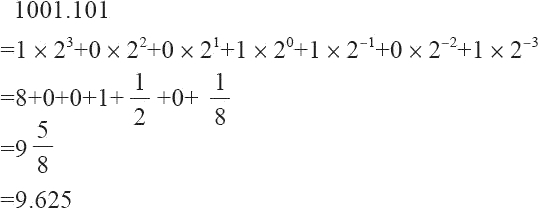

由上面的等式，我们可以得出：向左移动二进制小数点一位相当于这个数除以 2，而向右移动二进制小数点一位相当于这个数乘以 2。如 101.11=3/4，而 10.111=7/8。除此之外，我们还可以得到这样一个基本规律：一个十进制小数要能用浮点数精确地表示，最后一位必须是 5（当然这是必要条件，并非充分条件）。规律推演如下面的示例所示：


我们也可以使用一段 go 程序来验证：
```go
func main() {
	var f1 float64 = 34.6
	var f2 float64 = 34.5
	var f3 float64 = 34.0
	fmt.Println("34.6-34.0=", f1-f3)
	fmt.Println("34.5-34.0=", f2-f3)
}
```

输出

```
34.6-34.0= 0.6000000000000014
34.5-34.0= 0.5
```

之所以“34.6-34.0=0.6000000000000014”，产生这个误差的原因是 34.6 无法精确地表达为相应的浮点数，而只能保存为经过舍入的近似值。而这个近似值与 34.0 之间的运算自然无法产生精确的结果。

上面阐述了二进制数转换十进制数，如果你要将十进制数转换成二进制数，则需要把整数部分和小数部分分别转换。其中，整数部分除以 2，取余数；小数部分乘以 2，取整数位。如将 13.125 转换成二进制数如下：
1、首先转换整数部分（13），除以 2，取余数，所得结果为 1101。

2、其次转换小数部分（0.125），乘以 2，取整数位。转换过程如下：
```
0.125×2=0.25 取整数位0
0.25×2=0.5 取整数位0
0.5×2=1 取整数位1
```
3、小数部分所得结果为 001，即 13.125=1101.001，用规范浮点数表达为 1.101001×23。

除此之外，与浮点表示法相关联的其他两个参数是“最大允许指数”和“最小允许指数”，即 e<sup>max</sup> 和 e<sup>min</sup>。由于存在 βp 个可能的有效数字，以及 e<sup>max</sup>-e<sup>min</sup>+1 个可能的指数，因此浮点数可以按 [log<sub>2</sub>(e<sup>max</sup>-e<sup>min</sup>+1)]+[log<sub>2</sub>(β<sup>p</sup>)]+1 位编码，其中最后的 +1 用于符号位。

## 浮点数表示法

直到 20 世纪 80 年代（即在没有制定 IEEE 754 标准之前），业界还没有一个统一的浮点数标准。相反，很多计算机制造商根据自己的需要来设计自己的浮点数表示规则，以及浮点数的执行运算细节。另外，他们常常并不太关注运算的精确性，而把实现的速度和简易性看得比数字的精确性更重要，而这就给代码的可移植性造成了重大的障碍。

直到 1976 年，Intel 公司打算为其 8086 微处理器引进一种浮点数协处理器时，意识到作为芯片设计者的电子工程师和固体物理学家也许并不能通过数值分析来选择最合理的浮点数二进制格式。于是，他们邀请加州大学伯克利分校的 William Kahan 教授（当时最优秀的数值分析家）来为 8087 浮点处理器（FPU）设计浮点数格式。而这时，William Kahan 教授又找来两个专家协助他，于是就有了 KCS 组合（Kahn、Coonan和Stone），并共同完成了 Intel 公司的浮点数格式设计。

由于 Intel 公司的 KCS 浮点数格式完成得如此出色，以致 IEEE（Institute of Electrical and Electronics Engineers，电子电气工程师协会）决定采用一个非常接近 KCS 的方案作为 IEEE 的标准浮点格式。于是，IEEE 于 1985 年制订了二进制浮点运算标准 IEEE 754（IEEE Standard for Binary Floating-Point Arithmetic，ANSI/IEEE Std 754-1985），该标准限定指数的底为 2，并于同年被美国引用为 ANSI 标准。目前，几乎所有的计算机都支持 IEEE 754 标准，它大大地改善了科学应用程序的可移植性。

考虑到 IBM System/370 的影响，IEEE 于 1987 年推出了与底数无关的二进制浮点运算标准 IEEE 854，并于同年被美国引用为 ANSI 标准。1989 年，国际标准组织 IEC 批准 IEEE 754/854 为国际标准 IEC 559：1989。后来经修订后，标准号改为 IEC 60559。现在，几乎所有的浮点处理器完全或基本支持 IEC 60559。同时，C99 的浮点运算也支持 IEC 60559。

IEEE 浮点数标准是从逻辑上用三元组{S，E，M}来表示一个数 V 的，即 V=（-1）S×M×2E，如下 所示。

S(符号位) |E(指数位) |M(有效数字位)
---|---|---

其中：
符号位 s（Sign）决定数是正数（s＝0）还是负数（s＝1），而对于数值 0 的符号位解释则作为特殊情况处理。

有效数字位 M（Significand）是二进制小数，它的取值范围为 1~2<sup>-ε</sup>，或者为 0~1<sup>-ε</sup>。它也被称为尾数位（Mantissa）、系数位（Coefficient），甚至还被称作“小数”。

指数位 E（Exponent）是 2 的幂（可能是负数），它的作用是对浮点数加权。

浮点数格式是一种数据结构，它规定了构成浮点数的各个字段、这些字段的布局及算术解释。IEEE 754 浮点数的数据位被划分为三个段，从而对以上这些值进行编码。其中，一个单独的符号位 s 直接编码符号 s；k 位的指数段 exp=e<sup>k-1</sup>…e<sup>1</sup>e<sup>0</sup>，编码指数 E；n 位的小数段 frac=f<sup>n-1</sup>…f<sup>1</sup>f<sup>0</sup>，编码有效数字 M，但是被编码的值也依赖于指数域的值是否等于 0。

根据 exp 的值，被编码的值可以分为如下几种不同的情况。

### 1) 格式化值
当指数段 exp 的位模式既不全为 0（即数值 0），也不全为 1（即单精度数值为 255，以单精度数为例， 8 位的指数为可以表达 0~255 的 255 个指数值；双精度数值为 2047）的时候，就属于这类情况。如下所示。
S |≠0&≠255| f
---|---|---

我们知道，指数可以为正数，也可以为负数。为了处理负指数的情况，实际的指数值按要求需要加上一个偏置（Bias）值作为保存在指数段中的值。因此，这种情况下的指数段被解释为以偏置形式表示的有符号整数。即指数的值为：E=e<sup>-Bias</sup>

其中，e 是无符号数，其位表示为 e<sup>k-1</sup>…e<sup>1</sup>e<sup>0</sup>，而 Bias 是一个等于 2<sup>k-1</sup>-1（单精度是 127，双精度是 1023）的偏置值。由此产生指数的取值范围是：单精度为 -126~+127，双精度为 -1022~+1023。

对小数段 frac，可解释为描述小数值 f，其中 0≤f<1，其二进制表示为 0.f<sub>n-1</sub>…f<sub>1</sub>f<sub>0</sub>，也就是二进制小数点在最高有效位的左边。有效数字定义为 M=1+f。有时候，这种方式也叫作隐含的以 1 开头的表示法，因为我们可以把 M 看成一个二进制表达式为 1.f<sub>n-1</sub>f<sub>n-2</sub>…f<sub>0</sub> 的数字。既然我们总是能够调整指数 E，使得有效数字 M 的范围为 1≤M<2（假设没有溢出），那么这种表示方法是一种轻松获得一个额外精度位的技巧。同时，由于第一位总是等于 1，因此我们就不需要显式地表示它。拿单精度数为例，按照上面所介绍的知识，实际上可以用 23 位长的有效数字来表达 24 位的有效数字。比如，对单精度数而言，二进制的 1001.101（即十进制的 9.625）可以表达为 1.001101×2<sup>3</sup>，所以实际保存在有效数字位中的值为：
```
00110100000000000000000
```
即去掉小数点左侧的 1，并用 0 在右侧补齐。

根据上面所阐述的规则，下面以实数 -9.625 为例，来看看如何将其表达为单精度的浮点数格式。具体转换步骤如下：

1、首先，需要将 -9.625 用二进制浮点数表达出来，然后变换为相应的浮点数格式。即 -9.625 的二进制为 1001.101，用规范的浮点数表达应为 1.001101×2<sup>3</sup>。

2、其次，因为 -9.625 是负数，所以符号段为 1。而这里的指数为 3，所以指数段为 3+127=130，即二进制的 10000010。有效数字省略掉小数点左侧的 1 之后为 001101，然后在右侧用零补齐。因此所得的最终结果为：

1 |1000 0010 |001 1010 0000 0000 0000 0000
---|---|---

3、最后，我们还可以将浮点数形式表示为十六进制的数据，如下所示：
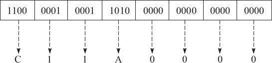

即最终的十六进制结果为 0xC11A0000。

### 2) 特殊数值

IEEE 标准指定了以下特殊值：±0、反向规格化的数、±∞ 和 NaN（如下表所示）。这些特殊值都是使用 e<sub>max+1</sub> 或 e<sub>min-1</sub> 的指数进行编码的。
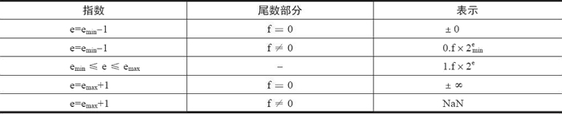

NaN：当指数段 exp 全为 1 时，小数段为非零时，结果值就被称为“NaN”（Not any Number），如下所示。
S|1|1|1|1|1|1|1|1|≠0
---|---|--|---|---|--|---|---|--|---

一般情况下，我们将 0/0 或:
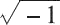
视为导致计算终止的不可恢复错误。但是，一些示例表明在这样的情况下继续进行计算是有意义的。这时候就可以通过引入特殊值 NaN，并指定诸如 0/0 或


之类的表达式计算来生成 NaN 而不是停止计算，从而避免此问题。下表中列出了一些可以导致 NaN 的情况。

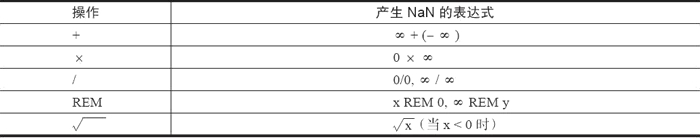

无穷：当指数段 exp 全为 1，小数段全为 0 时，得到的值表示无穷。当 s=0 时是 +∞，或者当 s=1 时是 -∞。如下所示。

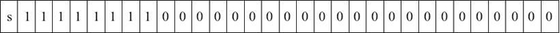

无穷用于表达计算中产生的上溢问题。比如两个极大的数相乘时，尽管两个操作数本身可以保存为浮点数，但其结果可能大到无法保存为浮点数，必须进行舍入操作。根据IEEE标准，此时不能将结果舍入为可以保存的最大浮点数（因为这个数可能与实际的结果相差太远而毫无意义），而应将其舍入为无穷。对于结果为负数的情况也是如此，只不过此时会舍入为负无穷，也就是说符号域为1的无穷。

### 3) 非格式化值

当指数段 exp 全为 0 时，所表示的数就是非规格化形式，如图 5 所示。
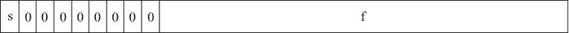

在这种情况下，指数值 E=1-Bias，而有效数字的值 M=f，也就是说它是小数段的值，不包含隐含的开头的 1。

非规格化值有两个用途：

第一，它提供了一种表示数值 0 的方法。因为规格化数必须得使有效数字 M 在范围 1≤M<2 之中，即 M≥1，因此它就不能表示 0。实际上，+0.0 的浮点表示的位模式为全 0（即符号位是 0，指数段全为 0，而小数段也全为 0），这就得到 M=f=0。令人奇怪的是，当符号位为 1，而其他段全为 0 时，就会得到值 -0.0。根据 IEEE 的浮点格式来看，值 +0.0 和 -0.0 在某些方面是不同的。

第二，它表示那些非常接近于 0.0 的数。它们提供了一种属性，称为逐渐下溢出。其中，可能的数值分布均匀地接近于 0.0。

下面的单精度浮点数就是一个非格式化的示例。

它被转换成十进制表示大约等于 1.4×10<sup>-45</sup>，实际上它就是单精度浮点数所能表达的最小非格式化数。以此类推，格式化值和非格式化值所能表达的非负数值范围如下表所示。

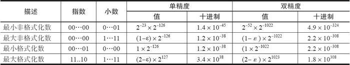

## 标准浮点格式

IEEE 754标准准确地定义了单精度和双精度浮点格式，并为这两种基本格式分别定义了扩展格式，如下所示：
- 单精度浮点格式（32 位）。
- 双精度浮点格式（64 位）。
- 扩展单精度浮点格式（≥43 位，不常用）。
- 扩展双精度浮点格式（≥79 位，一般情况下，Intel x86 结构的计算机采用的是 80 位，而 SPARC 结构的计算机采用的是 128 位）。

其中，只有 32 位单精度浮点数是本标准强烈要求支持的，其他都是可选部分。下面就来对单精度浮点与双精度浮点的存储格式做一些简要的阐述。

### 1) 单精度浮点格式
单精度浮点格式共 32 位，其中，s、exp 和 frac 段分别为 1 位、k=8 位和 n=23 位，如图 6 所示。

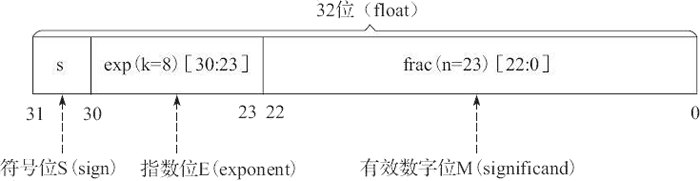

其中，32 位中的第 0 位存放小数段 frac 的最低有效位 LSB（least significant bit），第 22 位存放小数段 frac 的最高有效位 MSB（most significant bit）；第 23 位存放指数段 exp 的最低有效位 LSB，第 30 位存放指数段 exp 的最高有效位 MSB；最高位，即第 31 位存放符号 s。例如，单精度数 8.25 的存储方式如图 7 所示。

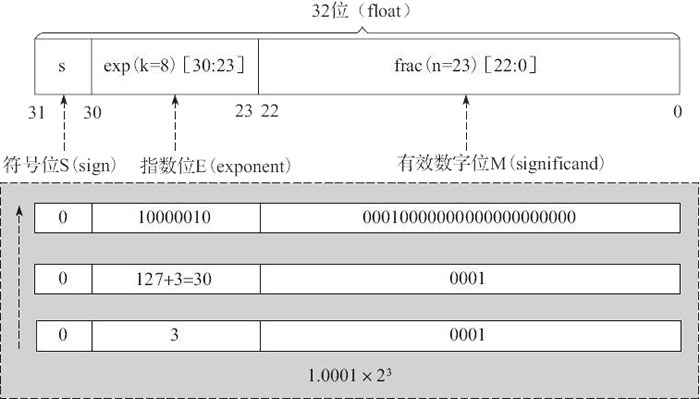

### 2) 双精度浮点格式
双精度浮点格式共 64 位，其中，s、exp 和 frac 段分别为 1 位、k=11 位和 n=52 位，如图 8 所示。
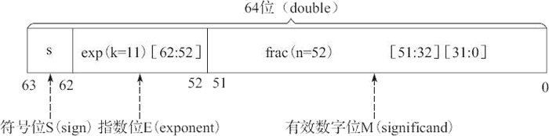
其中，frac[31：0] 存放小数段的低 32 位（即第 0 位存放整个小数段的最低有效位 LSB，第 31 位存放小数段低 32 位的最高有效位 MSB）；frac[51：32] 存放小数段的高 20 位（即第 32 位存放高 20 位的最低有效位 LSB，第 51 位存放整个小数段的最高有效位 MSB）；第 52 位存放指数段 exp 的最低有效位 LSB，第 62 位存放指数段 exp 的最高有效位 MSB；最高位，即第 63 位存放符号 s。

在 Intel x86 结构的计算机中，数据存放采用的是小端法（Little Endian），故较低地址的 32 位的字中存放小数段的 frac[31：0] 位。而在 SPARC 结构的计算机中，因其数据存放采用的是大端法（Big Endian），故较高地址的 32 位字中存放小数段的 frac[31：0] 位。

前面主要讨论了 IEEE 754 的单精度与双精度浮点格式，下表对浮点数的相关参数进行了总结，有兴趣的读者可以根据此表对其他浮点格式进行深入解读。
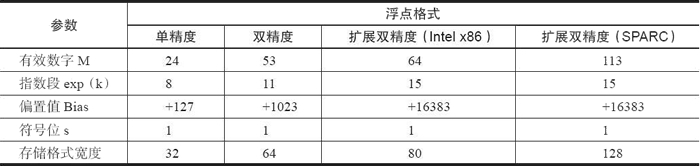

## 舍入误差
舍入误差是指运算得到的近似值和精确值之间的差异。大家知道，由于计算机的字长有限，因此在进行数值计算的过程中，对计算得到的中间结果数据要使用相关的舍入规则来取近似值，而这导致计算结果产生误差。

在浮点数的舍入问题上，IEEE 浮点格式定义了 4 种不同的舍入方式，如下表所示。其中，默认的舍入方法是向偶数舍入，而其他三种可用于计算上界和下界。

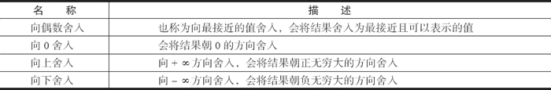

下表是 4 种舍入方式的应用举例。这里需要特别说明的是，向偶数舍入（向最接近的值舍入）方式会试图找到一个最接近的匹配值。因此，它将 1.4 舍入成 1，将 1.6 舍入成 2，而将 1.5 和 2.5 都舍入成 2。
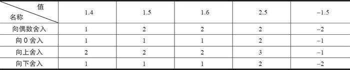
或许看了上面的内容你会问：为什么要采用向偶数舍入这样的舍入策略，而不直接使用我们已经习惯的“四舍五入”呢？

其原因我们可以这样来理解：在进行舍入的时候，最后一位数字从 1 到 9，舍去的有 1、2、3、4；它正好可以和进位的 9、8、7、6 相对应，而 5 却被单独留下。如果我们采用四舍五入每次都将 5 进位的话，在进行一些大量数据的统计时，就会累积比较大的偏差。而如果采用向偶数舍入的策略，在大多数情况下，5 舍去还是进位概率是差不多的，统计时产生的偏差也就相应要小一些。

同样，针对浮点数据，向偶数舍入方式只需要简单地考虑最低有效数字是奇数还是偶数即可。例如，假设我们想将十进制数舍入到最接近的百分位。不管用哪种舍入方式，我们都将把 1.2349999 舍入到 1.23，而将 1.2350001 舍入到 1.24，因为它们不是在 1.23 和 1.24 的正中间。另一方面我们将把两个数 1.2350000 和 1.2450000 都舍入到 1.24，因为 4 是偶数。

由IEEE浮点格式定义的舍入方式可知，不论使用哪种舍入方式，都会产生舍入误差。如果在一系列运算中的一步或几步产生了舍入误差，在某些情况下，这个误差将会随着运算次数的增加而积累得很大，最终会得出没有意义的运算结果。因此，建议不要将浮点数用于精确计算。

当然，理论上增加数字位数可以减少可能会产生的舍入误差。但是，位数是有限的，在表示无限浮点数时仍然会产生误差。在用常规方法表示浮点数的情况下，这种误差是不可避免的，但是可以通过设置警戒位来减小。

除此之外，IEEE 754 还提出 5 种类型的浮点异常，即上溢、下溢、除以零、无效运算和不精确。其中，每类异常都有单独的状态标志。鉴于篇幅有限，本节就不再详细介绍。

# IEEE754浮点数
## 前言
Go语言之父Rob Pike大神曾吐槽：不能掌握正则表达式或浮点数就不配当码农！
> You should not be permitted to write production code if you do not have an journeyman license in regular expressions or floating point math.

## 什么是浮点数
电气和电子工程师协会IEEE对于计算机浮点数的存储、运算、表示等推出了IEEE754标准！
标准中规定：
- float32位单精度浮点数在机器中表示用 1 位表示数字的符号，用 8 位表示指数，用 23 位表示尾数。
- double64位双精度浮点数，用 1 位表示符号，用 11 位表示指数，52 位表示尾数。

其中指数域也称为阶码。浮点数存储字节定义如图：


## 浮点数正规化
尾数不为0时，尾数域的最高有效位为1，这称为规格化。否则，以修改阶码同时左右移动小数点位置的办法，使其成为规格化数的形式。

浮点数x真值表示：
x=(−1)<sup>S</sup>×(1.M)×2<sup>e</sup>
float：　　　　e=E−127
double：　　   e=E−1023　
- S  符号位　　  0表示正 1表示负
- e  指数位  　　阶码E减去移码
- M 尾数位  　　二进制形式移码

## 移码
移码是真值补码的符号位取反，一般用作浮点数的阶码，目的是便于浮点数运算时的对阶操作。

对于定点整数，计算机一般采用补码的来存储。

正整数的符号位为0，反码和补码等同于原码。

负整数符号位都为1，原码，反码和补码的表示都不相同，由负数原码表示法变成反码和补码有如下规则：
（1）原码符号位为1不变，整数的每一位二进制数位求反得反码；
（2）反码符号位为1不变，反码数值位最低位加1得补码。

比如，以一个字节来表示-3，那么[−3]原=10000011 [−3]反=11111100 [−3] 补=11111101  [−3]移=01111101
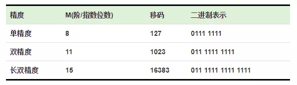

## 举个栗子
【3.14的单精度浮点数表示】

首先将3.14转成二进制:

整数部分3的二进制是11

小数部分0.14的二进制是：0.0010001111010111000010[10001111.....]（方括号中表示小数点后第23位及之后）

这样，3.14的二进制代码就是：11.0010001111010111000010[10001111....]×2<sup>0</sup>

那么用正规化表示就是：1.10010001111010111000010[10001111....]×2<sup>1</sup>

方括号表示的超出23位之后的二进制部分，由于单精度浮点数尾数只有23位，所以需要舍入（舍入方法见后）

由于第24位为1，且之后 不全为 0，所以需要向第23位进1完成上舍入：1.10010001111010111000011×2<sup>1</sup>

而其指数是1，需要加上移码127，即128，也就是1000 0000

它又是正数，所以符号为0

综上所述，3.14的单精度浮点数表示为：
0 1000-0000 1001-0001-1110-1011-1000-011

S符号位    0 

e指数位　1000-0000

M尾数位  1001-0001-1110-1011-1000-011

十六进制代码为：0x4048F5C3

## 误差
通过栗子可知，3.14的单精度浮点数表示是0 1000-0000 1001-0001-1110-1011-1000-011。现在我们来还原，看看它的误差：
指数是128，那么还原回去（减去移码），实际指数就是1
尾数还原也就是：10010001111010111000011，所以正规化形式是：1.10010001111010111000011×2<sup>1</sup>
也就是11.0010001111010111000011利用二进制转十进制，可得它对应的十进制数是：3.1400001049041748046875  不等于3.14,这就是为什么浮点数运算结果在业务代码中总是不可确切预期的原因！！！！

## 机器ε

机器ε表示1与大于1的最小浮点数之差。例如双精度表示1和表示大于1的最小浮点数
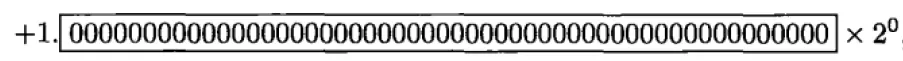
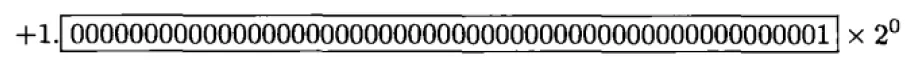

双精度浮点数的机器ε = 2-52 ≈ 2.220446049250313e-16

同理，单精度的机器ε = 2-23 ≈ 1.1920928955078125e-7

在舍入规则中，相对舍入误差不能大于机器ε的一半。


## 非正规化

单精度浮点数为例
（1）0的表示
对于阶码为0或255的情况，IEEE754标准有特别的规定：
如果 阶码E=0并且尾数M是0，则这个数的真值为±0（正负号和数符位有关）。
+0的机器码为：0 00000000 000 0000 0000 0000 0000 0000
-0的机器码为：1 00000000 000 0000 0000 0000 0000 0000
需要注意一点，浮点数不能精确表示0，而是以很小的数来近似表示0。因为浮点数的真值等于
x=(−1)S×(1.M)×2e 
e=E−127
那么
+0的机器码真值为  1.0×2−127 
-0机器码真值为  −1.0×2−127

（2）无穷的表示
如果阶码E=255 并且尾数M全是0，则这个数的真值为±∞（同样和符号位有关）。
因此
+∞的机器码为：0 11111111 000 0000 0000 0000 0000 0000
-∞的机器吗为：1 11111111 000 0000 0000 0000 0000 0000

（3）NaN（Not a Number）
如果 E = 255 并且 M 不全是0，则这不是一个数（NaN）。

## 舍入规则
以23位尾数位的单精度浮点数为例，舍入时需要重点参考第24位

若第24位为1，且第24位之后全部为0。此时就要使第23位为0：若第23位本来就是0则不管，若第23位为1，则第24位就要向第23位进一位，这样第23位就可以为0

若第24位为1，且第24位之后不全为0，则第24位就要向第23位进一完成上舍入。

若第24位为0，此时直接舍去不进位，称为下舍入。

## 再来个栗子

JavaScript console 双精度浮点数

```
>>9.4 - 9 - 0.4 === 0
<<false
>>(9.4-9-0.4).toFixed(20)
<<"0.00000000000000033307"
```

9.4-9-0.4不严格等于0，其运算结果误差。

因为按照上面的浮点数知识可知

9.4在机器内被表示为：9.4+0.2×2<sup>-49</sup>

0.4被表示为：0.4+0.1×2<sup>-52</sup>

当9.4-9时（因为9是整数是可以精确存储的）得0.4+0.2×2<sup>-49</sup>，再减去0.4+0.1×2<sup>-52</sup>得3×2<sup>-53</sup>，约等于"0.00000000000000033307"。

 

详细解释：

9的二进制是1001，而0.4的二进制是0.0110-0110-0110-……无限循环的。从而9.4的二进制是1001.0110-0110……，正规化以后就变成 1.001-0110-0110-……×2^3，

因为双精度浮点数是52位尾数，所以小数部分保留0.001-0110-0110-……-0110-0 [110-0110-0110-……]。即001后跟12个0110循环节，然后第52位是0，中括号表示从

第53位起开始舍弃的部分。根据我提到的舍入规则，第53位1且后面不全为0，要向第52位完成上舍入，所以小数部分就变成 0.001-0110-0110-……-0110-1。至此我们

可以看到，这个数较之9.4，由于小数部分第52位由0变为1，所以多加了2<sup>-52</sup>，但是因为从小数部分第53位开始舍弃了，舍弃部分是 0.1100-1100-…×2<sup>-52</sup> = 0.8×2<sup>-52</sup>。

所以我们多加了2<sup>-52</sup>，但是少了0.8×2<sup>-52</sup>，这就意味着，但考虑尾数部分，这个数比9.4多了 2<sup>-52</sup> - 0.8×2<sup>-52</sup> = 0.2×2<sup>-52</sup>，别忘记之前还有一个2^3，所以整

体多了0.2×2<sup>-52</sup>×2<sup>^3</sup> = 0.2×2<sup>-49</sup>

这就是为什么9.4在机器内被表示为：9.4+0.2×2<sup>-49</sup>

同理，0.4在机器内被表示为：0.4+0.1×2<sup>-52</sup>


## BigDecimal是如何解决这个问题的
BigDecimal的解决方案就是，不使用二进制，而是使用十进制（BigInteger）+小数点位置(scale)来表示小数，
```java
public static void main(String[] args) {
      BigDecimal bd = new BigDecimal("100.001");
      System.out.println(bd.scale());
      System.out.println(bd.unscaledValue());
}

output:
3
100001
```
也就是100.001 = 100001 * 0.1^3。这种表示方式下，避免了小数的出现，当然也就不会有精度问题了。十进制，也就是整数部分使用了BigInteger来表示，小数点位置只需要一个整数scale来表示就OK了。
当使用BigDecimal来进行运算时，也就可以分解成两部分，BigInteger间的运算，以及小数点位置scale的更新，下面先看下运算过程中scale的更新。

### scale
加法运算时，根据下面的公式scale更新为两个BigDecimal中较大的那个scale即可。


X * 0.1 <sup>n</sup> + Y * 0.1<sup>m</sup> == X * 0.1<sup>n</sup> + (Y * 0.1 <sup>m-n</sup>) * 0.1<sup>n</sup> == (X + Y * 0.1 <sup>m-n</sup>) * 0.1<sup>n</sup>
其中n>m

相应的代码如下

```java
/**
     * Returns a {@code BigDecimal} whose value is {@code (this +
     * augend)}, and whose scale is {@code max(this.scale(),
     * augend.scale())}.
     *
     * @param  augend value to be added to this {@code BigDecimal}.
     * @return {@code this + augend}
     */
    public BigDecimal add(BigDecimal augend) {
        long xs = this.intCompact;
        long ys = augend.intCompact;
        BigInteger fst = (xs != INFLATED) ? null : this.intVal;
        BigInteger snd = (ys != INFLATED) ? null : augend.intVal;
        int rscale = this.scale;

        long sdiff = (long)rscale - augend.scale;
        if (sdiff != 0) {
            if (sdiff < 0) {
                int raise = checkScale(-sdiff);
                rscale = augend.scale;
                if (xs == INFLATED ||
                    (xs = longMultiplyPowerTen(xs, raise)) == INFLATED)
                    fst = bigMultiplyPowerTen(raise);
            } else {
                int raise = augend.checkScale(sdiff);
                if (ys == INFLATED ||
                    (ys = longMultiplyPowerTen(ys, raise)) == INFLATED)
                    snd = augend.bigMultiplyPowerTen(raise);
            }
        }
        if (xs != INFLATED && ys != INFLATED) {
            long sum = xs + ys;
            // See "Hacker's Delight" section 2-12 for explanation of
            // the overflow test.
            if ( (((sum ^ xs) & (sum ^ ys))) >= 0L) // not overflowed
                return BigDecimal.valueOf(sum, rscale);
        }
        if (fst == null)
            fst = BigInteger.valueOf(xs);
        if (snd == null)
            snd = BigInteger.valueOf(ys);
        BigInteger sum = fst.add(snd);
        return (fst.signum == snd.signum) ?
            new BigDecimal(sum, INFLATED, rscale, 0) :
            new BigDecimal(sum, rscale);
    }
```
乘法运算根据下面的公式也可以确定scale更新为两个scale之和。

X * 0.1<sup>n</sup> * Y * 0.1<sup>m</sup> == (X * Y) * 0.1<sup>n+m</sup>

相应的代码
```java
/**
     * Returns a {@code BigDecimal} whose value is <tt>(this &times;
     * multiplicand)</tt>, and whose scale is {@code (this.scale() +
     * multiplicand.scale())}.
     *
     * @param  multiplicand value to be multiplied by this {@code BigDecimal}.
     * @return {@code this * multiplicand}
     */
    public BigDecimal multiply(BigDecimal multiplicand) {
        long x = this.intCompact;
        long y = multiplicand.intCompact;
        int productScale = checkScale((long)scale + multiplicand.scale);

        // Might be able to do a more clever check incorporating the
        // inflated check into the overflow computation.
        if (x != INFLATED && y != INFLATED) {
            /*
             * If the product is not an overflowed value, continue
             * to use the compact representation.  if either of x or y
             * is INFLATED, the product should also be regarded as
             * an overflow. Before using the overflow test suggested in
             * "Hacker's Delight" section 2-12, we perform quick checks
             * using the precision information to see whether the overflow
             * would occur since division is expensive on most CPUs.
             */
            long product = x * y;
            long prec = this.precision() + multiplicand.precision();
            if (prec < 19 || (prec < 21 && (y == 0 || product / y == x)))
                return BigDecimal.valueOf(product, productScale);
            return new BigDecimal(BigInteger.valueOf(x).multiply(y), INFLATED,
                                  productScale, 0);
        }
        BigInteger rb;
        if (x == INFLATED && y == INFLATED)
            rb = this.intVal.multiply(multiplicand.intVal);
        else if (x != INFLATED)
            rb = multiplicand.intVal.multiply(x);
        else
            rb = this.intVal.multiply(y);
        return new BigDecimal(rb, INFLATED, productScale, 0);
    }
```

### BigInteger
BigInteger可以表示任意精度的整数。当你使用long类型进行运算，可能会产生溢出时就要考虑使用BigInteger了。BigDecimal就使用了BigInteger作为backend。
那么BigInteger是如何做到可以表示任意精度的整数的？答案是使用数组来表示，看下面这个栗子就很直观了
```java
public static void main(String[] args) {
        byte[] mag = {
                2, 1 // 10 00000001 == 513
        };
        System.out.println(new BigInteger(mag));
    }
```
通过byte[]来当作底层的二进制表示，例如栗子中的[2, 1]，也就是[00000010B, 00000001B]，就是表示二进制的10 00000001B这个数，也就是513了。
BigInteger内部会将这个`byte[]`转换成`int[]`保存，代码在[stripLeadingZeroBytes](http://hg.openjdk.java.net/jdk7u/jdk7u/jdk/file/70e3553d9d6e/src/share/classes/java/math/BigInteger.java#l2832)方法

```java
/**
     * Translates a byte array containing the two's-complement binary
     * representation of a BigInteger into a BigInteger.  The input array is
     * assumed to be in <i>big-endian</i> byte-order: the most significant
     * byte is in the zeroth element.
     *
     * @param  val big-endian two's-complement binary representation of
     *         BigInteger.
     * @throws NumberFormatException {@code val} is zero bytes long.
     */
    public BigInteger(byte[] val) {
        if (val.length == 0)
            throw new NumberFormatException("Zero length BigInteger");

        if (val[0] < 0) {
            mag = makePositive(val);
            signum = -1;
        } else {
            mag = stripLeadingZeroBytes(val);
            signum = (mag.length == 0 ? 0 : 1);
        }
    }

     /**
     * Returns a copy of the input array stripped of any leading zero bytes.
     */
    private static int[] stripLeadingZeroBytes(byte a[]) {
        int byteLength = a.length;
        int keep;

        // Find first nonzero byte
        for (keep = 0; keep < byteLength && a[keep]==0; keep++)
            ;

        // Allocate new array and copy relevant part of input array
        int intLength = ((byteLength - keep) + 3) >>> 2;
        int[] result = new int[intLength];
        int b = byteLength - 1;
        for (int i = intLength-1; i >= 0; i--) {
            result[i] = a[b--] & 0xff;
            int bytesRemaining = b - keep + 1;
            int bytesToTransfer = Math.min(3, bytesRemaining);
            for (int j=8; j <= (bytesToTransfer << 3); j += 8)
                result[i] |= ((a[b--] & 0xff) << j);
        }
        return result;
    }
```

上面也可以看到这个byte[]应该是big-endian two's-complement binary representation。
那么为什么构造函数不直接让我们扔一个int[]进去就得了呢，还要这么转换一下？答案是因为Java的整数都是有符号整数，举个栗子，int类型没办法表示2<sup>32</sup> -1，也就是32位上全都是1这个数的，这时候用byte[]得这么写，(byte)255,(byte)255,(byte)255,(byte)255，这样才能表示32个1。

最后来看看BigInteger间的加法与乘法运算。

#### add
```java
private static int[] add(int[] x, int[] y) {
        // If x is shorter, swap the two arrays
        if (x.length < y.length) {
            int[] tmp = x;
            x = y;
            y = tmp;
        }

        int xIndex = x.length;
        int yIndex = y.length;
        int result[] = new int[xIndex];
        long sum = 0;

        // Add common parts of both numbers
        while(yIndex > 0) {
            // 最低位对齐再开始加
            sum = (x[--xIndex] & LONG_MASK) +
                  (y[--yIndex] & LONG_MASK) + (sum >>> 32); // sum>>>32 是高32位，也就是进位
            result[xIndex] = (int)sum; // 低32位直接保存
        }

        // Copy remainder of longer number while carry propagation is required
        boolean carry = (sum >>> 32 != 0);
        while (xIndex > 0 && carry) // x比y长，且最后还有进位
            carry = ((result[--xIndex] = x[xIndex] + 1) == 0); // 一位一位往前进位，直到没有产生进位

        // Copy remainder of longer number
        while (xIndex > 0)
            result[--xIndex] = x[xIndex];

        // Grow result if necessary
        if (carry) {
            int bigger[] = new int[result.length + 1];
            System.arraycopy(result, 0, bigger, 1, result.length);
            bigger[0] = 0x01;
            return bigger;
        }
        return result;
    }
```
加法运算比较简单，就是模拟十进制加法运算的过程，从两个加数的最低位开始加，如果有进位就进位。
#### multiply
```java
private int[] multiplyToLen(int[] x, int xlen, int[] y, int ylen, int[] z) {
        int xstart = xlen - 1;
        int ystart = ylen - 1;

        if (z == null || z.length < (xlen+ ylen))
            z = new int[xlen+ylen];

        long carry = 0;
        for (int j=ystart, k=ystart+1+xstart; j>=0; j--, k--) {
            long product = (y[j] & LONG_MASK) *
                           (x[xstart] & LONG_MASK) + carry;
            z[k] = (int)product;
            carry = product >>> 32;
        }
        z[xstart] = (int)carry;

        for (int i = xstart-1; i >= 0; i--) {
            carry = 0;
            for (int j=ystart, k=ystart+1+i; j>=0; j--, k--) {
                long product = (y[j] & LONG_MASK) *
                               (x[i] & LONG_MASK) +
                               (z[k] & LONG_MASK) + carry;
                z[k] = (int)product;
                carry = product >>> 32;
            }
            z[i] = (int)carry;
        }
        return z;
    }
```
乘法运算要复杂一点，不过也一样是模拟十进制乘法运算，也就是一个乘数的每一位与另一个乘数的每一位相乘再相加（乘法运算可以拆成加法运算），所以才有那个双重的for循环。
最后的最后，想说的一点是，其实BigInteger可以看成是2<sup>32</sup>进制的计数表示，这样就比较容易理解上面的加法跟乘法运算了。