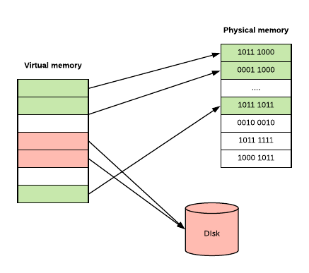

<!-- toc -->
[TOC]


# Golang 的内存管理
Golang 的内存管理基于 tcmalloc，可以说起点挺高的。但是 Golang 在实现的时候还做了很多优化，我们下面通过源码来看一下 Golang 的内存管理实现。下面的源码分析基于go1.8rc3。

## 1. tcmalloc 介绍

关于 tcmalloc 可以参考这篇文章 [tcmalloc 介绍](http://legendtkl.com/2015/12/11/go-memory/)，原始论文可以参考 TCMalloc : [Thread-Caching Malloc](http://goog-perftools.sourceforge.net/doc/tcmalloc.html) or [Thread-Caching Malloc](https://gperftools.github.io/gperftools/tcmalloc.html)。

## 2. Golang 内存管理
### 0. 准备知识
这里先简单介绍一下 Golang 运行调度。在 Golang 里面有三个基本的概念：G, M, P。

- G: Goroutine 执行的上下文环境。
- M: 操作系统线程。
- P: Processer。进程调度的关键，调度器，也可以认为约等于 CPU。

一个 Goroutine 的运行需要 G + P + M 三部分结合起来。好，先简单介绍到这里，更详细的放在后面的文章里面来说。

### 1. 逃逸分析（escape analysis）
对于手动管理内存的语言，比如 C/C++，我们使用 malloc 或者 new 申请的变量会被分配到堆上。但是 Golang 并不是这样，虽然 Golang 语言里面也有 new。Golang 编译器会进行逃逸分析来判断变量应该分配到什么地方。下面是一个简单的例子。
```go
package main
import ()
func foo() *int {  
  var x int
  return &x
}
func bar() int {
  x := new(int)
  *x = 1
  return *x
}
func main() {}
```
将上面文件保存为 escape.go，执行下面命令
```
$ go run -gcflags '-m -l' escape.go
./escape.go:6: moved to heap: x
./escape.go:7: &x escape to heap
./escape.go:11: bar new(int) does not escape
```
go1.13
```
go run -gcflags "-m -l" cmd.go


.\cmd.go:6:6: moved to heap: x
.\cmd.go:10:10: bar new(int) does not escape
```
上面的意思是 foo() 中的 x 最后在堆上分配，而 bar() 中的 x 最后分配在了栈上（尽管是通过 new 分配的）。在官网 (golang.org) FAQ 上有一个关于变量分配的问题如下：
**How do I know whether a variable is allocated on the heap or the stack?**
> From a correctness standpoint, you don’t need to know. Each variable in Go exists as long as there are references to it. The storage location chosen by the implementation is irrelevant to the semantics of the language.
>
> The storage location does have an effect on writing efficient programs. When possible, the Go compilers will allocate variables that are local to a function in that function’s stack frame. However, if the compiler cannot prove that the variable is not referenced after the function returns, then the compiler must allocate the variable on the garbage-collected heap to avoid dangling pointer errors. Also, if a local variable is very large, it might make more sense to store it on the heap rather than the stack.
>
>In the current compilers, if a variable has its address taken, that variable is a candidate for allocation on the heap. However, a basic escape analysis recognizes some cases when such variables will not live past the return from the function and can reside on the stack.

**如何得知变量是分配在栈（stack）上还是堆（heap）上？**

> 准确地说，你并不需要知道。Golang 中的变量只要被引用就一直会存活，存储在堆上还是栈上由内部实现决定而和具体的语法没有关系。
> 
> 知道变量的存储位置确实和效率编程有关系。如果可能，Golang 编译器会将函数的局部变量分配到函数栈帧（stack frame）上。然而，如果编译器不能确保变量在函数 return 之后不再被引用，编译器就会将变量分配到堆上。而且，如果一个局部变量非常大，那么它也应该被分配到堆上而不是栈上。
>
> 当前情况下，如果一个变量被取地址，那么它就有可能被分配到堆上。然而，还要对这些变量做逃逸分析，如果函数 return 之后，变量不再被引用，则将其分配到栈上。

### 2. 关键数据结构
几个关键的地方：
- mcache: per-P cache，可以认为是 local cache。
- mcentral: 全局 cache，mcache 不够用的时候向 mcentral 申请。
- mheap: 当 mcentral 也不够用的时候，通过 mheap 向操作系统申请。

可以将其看成多级内存分配器。简单的分配过程可以描述如下，具体的之后下面的再说。

- 先向 mcache 申请。
- mcache 不足的话向 mcentral 申请填充。
- mcentral 不足则向 mheap 申请填充。
- mheap 不足的话，则想操作系统申请。

#### 2.1 mcache
我们知道每个 Gorontine 的运行都是绑定到一个 P 上面，mcache 是每个 P 的 cache。这么做的好处是分配内存时不需要加锁。mcache 结构如下。
`runtime/mcache.go`
```go
// Per-thread (in Go, per-P) cache for small objects.
// No locking needed because it is per-thread (per-P).
//
// mcaches are allocated from non-GC'd memory, so any heap pointers
// must be specially handled.
//
//go:notinheap
type mcache struct {
	// The following members are accessed on every malloc,
	// so they are grouped here for better caching.
	next_sample uintptr // trigger heap sample after allocating this many bytes
	local_scan  uintptr // bytes of scannable heap allocated

	// Allocator cache for tiny objects w/o pointers.
	// See "Tiny allocator" comment in malloc.go.

	// tiny points to the beginning of the current tiny block, or
	// nil if there is no current tiny block.
	//
	// tiny is a heap pointer. Since mcache is in non-GC'd memory,
	// we handle it by clearing it in releaseAll during mark
	// termination.
	tiny             uintptr
	tinyoffset       uintptr
	local_tinyallocs uintptr // number of tiny allocs not counted in other stats

	// The rest is not accessed on every malloc.

	alloc [numSpanClasses]*mspan // spans to allocate from, indexed by spanClass

	stackcache [_NumStackOrders]stackfreelist

	// Local allocator stats, flushed during GC.
	local_largefree  uintptr                  // bytes freed for large objects (>maxsmallsize)
	local_nlargefree uintptr                  // number of frees for large objects (>maxsmallsize)
	local_nsmallfree [_NumSizeClasses]uintptr // number of frees for small objects (<=maxsmallsize)

	// flushGen indicates the sweepgen during which this mcache
	// was last flushed. If flushGen != mheap_.sweepgen, the spans
	// in this mcache are stale and need to the flushed so they
	// can be swept. This is done in acquirep.
	flushGen uint32
}
```
我们可以暂时只关注 alloc [_NumSizeClasses]*mspan，这是一个大小为 67 的指针（指针指向 mspan ）数组（_NumSizeClasses = 67），每个数组元素也就是 mspan，被切分成特定大小的块。当要分配内存时，为 object 在 alloc 数组中选择合适的元素来分配。67 种块大小为  0，8 byte, 16 byte, … ，这个和 tcmalloc 稍有区别。
```go
//file: sizeclasses.go
var class_to_size = [_NumSizeClasses]uint16{0, 8, 16, 32, 48, 64, 80, 96, 112, 128, 144, 160, 176, 192, 208, 224, 240, 256, 288, 320, 352, 384, 416, 448, 480, 512, 576, 640, 704, 768, 896, 1024, 1152, 1280, 1408, 1536, 1792, 2048, 2304, 2688, 3072, 3200, 3456, 4096, 4864, 5376, 6144, 6528, 6784, 6912, 8192, 9472, 9728, 10240, 10880, 12288, 13568, 14336, 16384, 18432, 19072, 20480, 21760, 24576, 27264, 28672, 32768}
```
这里仔细想有个小问题，上面的 alloc 类似内存池的 freelist 数组或者链表，正常实现每个数组元素是一个链表，链表由特定大小的块串起来。但是这里统一使用了 mspan 结构，那么只有一种可能，就是 mspan 中记录了需要分配的块大小。我们来看一下 mspan 的结构。

#### 2.2 mspan
span 在 tcmalloc 中作为一种管理内存的基本单位而存在。Golang 的 mspan 的结构如下，省略了部分内容。
```go
// runtime/mheap.go
//go:notinheap
type mspan struct {
	next *mspan     // next span in list, or nil if none
	prev *mspan     // previous span in list, or nil if none
	list *mSpanList // For debugging. TODO: Remove.

	startAddr uintptr // address of first byte of span aka s.base()
	npages    uintptr // number of pages in span

	manualFreeList gclinkptr // list of free objects in mSpanManual spans

	// freeindex is the slot index between 0 and nelems at which to begin scanning
	// for the next free object in this span.
	// Each allocation scans allocBits starting at freeindex until it encounters a 0
	// indicating a free object. freeindex is then adjusted so that subsequent scans begin
	// just past the newly discovered free object.
	//
	// If freeindex == nelem, this span has no free objects.
	//
	// allocBits is a bitmap of objects in this span.
	// If n >= freeindex and allocBits[n/8] & (1<<(n%8)) is 0
	// then object n is free;
	// otherwise, object n is allocated. Bits starting at nelem are
	// undefined and should never be referenced.
	//
	// Object n starts at address n*elemsize + (start << pageShift).
	freeindex uintptr
	// TODO: Look up nelems from sizeclass and remove this field if it
	// helps performance.
	nelems uintptr // number of object in the span.

	// Cache of the allocBits at freeindex. allocCache is shifted
	// such that the lowest bit corresponds to the bit freeindex.
	// allocCache holds the complement of allocBits, thus allowing
	// ctz (count trailing zero) to use it directly.
	// allocCache may contain bits beyond s.nelems; the caller must ignore
	// these.
	allocCache uint64// 用位图来管理可用的 free object，1 表示可用

	// allocBits and gcmarkBits hold pointers to a span's mark and
	// allocation bits. The pointers are 8 byte aligned.
	// There are three arenas where this data is held.
	// free: Dirty arenas that are no longer accessed
	//       and can be reused.
	// next: Holds information to be used in the next GC cycle.
	// current: Information being used during this GC cycle.
	// previous: Information being used during the last GC cycle.
	// A new GC cycle starts with the call to finishsweep_m.
	// finishsweep_m moves the previous arena to the free arena,
	// the current arena to the previous arena, and
	// the next arena to the current arena.
	// The next arena is populated as the spans request
	// memory to hold gcmarkBits for the next GC cycle as well
	// as allocBits for newly allocated spans.
	//
	// The pointer arithmetic is done "by hand" instead of using
	// arrays to avoid bounds checks along critical performance
	// paths.
	// The sweep will free the old allocBits and set allocBits to the
	// gcmarkBits. The gcmarkBits are replaced with a fresh zeroed
	// out memory.
	allocBits  *gcBits
	gcmarkBits *gcBits

	// sweep generation:
	// if sweepgen == h->sweepgen - 2, the span needs sweeping
	// if sweepgen == h->sweepgen - 1, the span is currently being swept
	// if sweepgen == h->sweepgen, the span is swept and ready to use
	// if sweepgen == h->sweepgen + 1, the span was cached before sweep began and is still cached, and needs sweeping
	// if sweepgen == h->sweepgen + 3, the span was swept and then cached and is still cached
	// h->sweepgen is incremented by 2 after every GC

	sweepgen    uint32
	divMul      uint16     // for divide by elemsize - divMagic.mul
	baseMask    uint16     // if non-0, elemsize is a power of 2, & this will get object allocation base
	allocCount  uint16     // number of allocated objects
	spanclass   spanClass  // size class and noscan (uint8)
	state       mSpanState // mspaninuse etc
	needzero    uint8      // needs to be zeroed before allocation
	divShift    uint8      // for divide by elemsize - divMagic.shift
	divShift2   uint8      // for divide by elemsize - divMagic.shift2
	scavenged   bool       // whether this span has had its pages released to the OS
	elemsize    uintptr    // computed from sizeclass or from npages
	limit       uintptr    // end of data in span
	speciallock mutex      // guards specials list
	specials    *special   // linked list of special records sorted by offset.
}
```
从上面的结构可以看出：

- next, prev: 指针域， mspan 一般都是以链表形式使用。
- npages: mspan 的大小为 page 大小的整数倍。
- sizeclass: 0 ~ _NumSizeClasses 之间的一个值，这个解释了我们的疑问。比如，sizeclass = 3，那么这个 mspan 被分割成 32 byte 的块。
- elemsize: 通过 sizeclass 或者 npages 可以计算出来。比如 sizeclass = 3, elemsize = 32 byte。对于大于 32Kb 的内存分配，都是分配整数页，elemsize = page_size * npages。
- nelems: span 中包块的总数目。
- freeindex: 0 ~ nelemes-1，表示分配到第几个块。

#### 2.3 mcentral
上面说到当 mcache 不够用的时候，会从 mcentral 申请。那我们下面就来介绍一下 mcentral。

```go
// runtime/mheap.go
//go:notinheap
type mSpanList struct {
	first *mspan // first span in list, or nil if none
	last  *mspan // last span in list, or nil if none
}
```
```go
// runtime/mcentral.go
// Central list of free objects of a given size.
//
//go:notinheap
type mcentral struct {
	lock      mutex
	spanclass spanClass
	nonempty  mSpanList // list of spans with a free object, ie a nonempty free list
	empty     mSpanList // list of spans with no free objects (or cached in an mcache)

	// nmalloc is the cumulative count of objects allocated from
	// this mcentral, assuming all spans in mcaches are
	// fully-allocated. Written atomically, read under STW.
	nmalloc uint64
}
```

mcentral 分析：

- sizeclass: 也有成员 sizeclass，那么 mcentral 是不是也有 67 个呢？是的。
- lock: 因为会有多个 P 过来竞争。
- nonempty:  mspan 的双向链表，当前 mcentral 中可用的 mspan list。
- empty: 已经被使用的，可以认为是一种对所有 mspan 的 track。

问题来了，mcentral 存在于什么地方？虽然在上面我们将 mcentral 和 mheap 作为两个部分来讲，但是作为全局的结构，这两部分是可以定义在一起的。实际上也是这样，mcentral 包含在 mheap 中。

#### 2.4 mheap
```go
// runtime/mheap.go

// minPhysPageSize is a lower-bound on the physical page size. The
// true physical page size may be larger than this. In contrast,
// sys.PhysPageSize is an upper-bound on the physical page size.
const minPhysPageSize = 4096

// Main malloc heap.
// The heap itself is the "free" and "scav" treaps,
// but all the other global data is here too.
//
// mheap must not be heap-allocated because it contains mSpanLists,
// which must not be heap-allocated.
//
//go:notinheap
type mheap struct {
	// lock must only be acquired on the system stack, otherwise a g
	// could self-deadlock if its stack grows with the lock held.
	lock      mutex
	free      mTreap // free spans
	sweepgen  uint32 // sweep generation, see comment in mspan
	sweepdone uint32 // all spans are swept
	sweepers  uint32 // number of active sweepone calls

	// allspans is a slice of all mspans ever created. Each mspan
	// appears exactly once.
	//
	// The memory for allspans is manually managed and can be
	// reallocated and move as the heap grows.
	//
	// In general, allspans is protected by mheap_.lock, which
	// prevents concurrent access as well as freeing the backing
	// store. Accesses during STW might not hold the lock, but
	// must ensure that allocation cannot happen around the
	// access (since that may free the backing store).
	allspans []*mspan // all spans out there

	// sweepSpans contains two mspan stacks: one of swept in-use
	// spans, and one of unswept in-use spans. These two trade
	// roles on each GC cycle. Since the sweepgen increases by 2
	// on each cycle, this means the swept spans are in
	// sweepSpans[sweepgen/2%2] and the unswept spans are in
	// sweepSpans[1-sweepgen/2%2]. Sweeping pops spans from the
	// unswept stack and pushes spans that are still in-use on the
	// swept stack. Likewise, allocating an in-use span pushes it
	// on the swept stack.
	sweepSpans [2]gcSweepBuf

	_ uint32 // align uint64 fields on 32-bit for atomics

	// Proportional sweep
	//
	// These parameters represent a linear function from heap_live
	// to page sweep count. The proportional sweep system works to
	// stay in the black by keeping the current page sweep count
	// above this line at the current heap_live.
	//
	// The line has slope sweepPagesPerByte and passes through a
	// basis point at (sweepHeapLiveBasis, pagesSweptBasis). At
	// any given time, the system is at (memstats.heap_live,
	// pagesSwept) in this space.
	//
	// It's important that the line pass through a point we
	// control rather than simply starting at a (0,0) origin
	// because that lets us adjust sweep pacing at any time while
	// accounting for current progress. If we could only adjust
	// the slope, it would create a discontinuity in debt if any
	// progress has already been made.
	pagesInUse         uint64  // pages of spans in stats mSpanInUse; R/W with mheap.lock
	pagesSwept         uint64  // pages swept this cycle; updated atomically
	pagesSweptBasis    uint64  // pagesSwept to use as the origin of the sweep ratio; updated atomically
	sweepHeapLiveBasis uint64  // value of heap_live to use as the origin of sweep ratio; written with lock, read without
	sweepPagesPerByte  float64 // proportional sweep ratio; written with lock, read without
	// TODO(austin): pagesInUse should be a uintptr, but the 386
	// compiler can't 8-byte align fields.

	// Scavenger pacing parameters
	//
	// The two basis parameters and the scavenge ratio parallel the proportional
	// sweeping implementation, the primary differences being that:
	//  * Scavenging concerns itself with RSS, estimated as heapRetained()
	//  * Rather than pacing the scavenger to the GC, it is paced to a
	//    time-based rate computed in gcPaceScavenger.
	//
	// scavengeRetainedGoal represents our goal RSS.
	//
	// All fields must be accessed with lock.
	//
	// TODO(mknyszek): Consider abstracting the basis fields and the scavenge ratio
	// into its own type so that this logic may be shared with proportional sweeping.
	scavengeTimeBasis     int64
	scavengeRetainedBasis uint64
	scavengeBytesPerNS    float64
	scavengeRetainedGoal  uint64
	scavengeGen           uint64 // incremented on each pacing update

	// Page reclaimer state

	// reclaimIndex is the page index in allArenas of next page to
	// reclaim. Specifically, it refers to page (i %
	// pagesPerArena) of arena allArenas[i / pagesPerArena].
	//
	// If this is >= 1<<63, the page reclaimer is done scanning
	// the page marks.
	//
	// This is accessed atomically.
	reclaimIndex uint64
	// reclaimCredit is spare credit for extra pages swept. Since
	// the page reclaimer works in large chunks, it may reclaim
	// more than requested. Any spare pages released go to this
	// credit pool.
	//
	// This is accessed atomically.
	reclaimCredit uintptr

	// Malloc stats.
	largealloc  uint64                  // bytes allocated for large objects
	nlargealloc uint64                  // number of large object allocations
	largefree   uint64                  // bytes freed for large objects (>maxsmallsize)
	nlargefree  uint64                  // number of frees for large objects (>maxsmallsize)
	nsmallfree  [_NumSizeClasses]uint64 // number of frees for small objects (<=maxsmallsize)

	// arenas is the heap arena map. It points to the metadata for
	// the heap for every arena frame of the entire usable virtual
	// address space.
	//
	// Use arenaIndex to compute indexes into this array.
	//
	// For regions of the address space that are not backed by the
	// Go heap, the arena map contains nil.
	//
	// Modifications are protected by mheap_.lock. Reads can be
	// performed without locking; however, a given entry can
	// transition from nil to non-nil at any time when the lock
	// isn't held. (Entries never transitions back to nil.)
	//
	// In general, this is a two-level mapping consisting of an L1
	// map and possibly many L2 maps. This saves space when there
	// are a huge number of arena frames. However, on many
	// platforms (even 64-bit), arenaL1Bits is 0, making this
	// effectively a single-level map. In this case, arenas[0]
	// will never be nil.
	arenas [1 << arenaL1Bits]*[1 << arenaL2Bits]*heapArena

	// heapArenaAlloc is pre-reserved space for allocating heapArena
	// objects. This is only used on 32-bit, where we pre-reserve
	// this space to avoid interleaving it with the heap itself.
	heapArenaAlloc linearAlloc

	// arenaHints is a list of addresses at which to attempt to
	// add more heap arenas. This is initially populated with a
	// set of general hint addresses, and grown with the bounds of
	// actual heap arena ranges.
	arenaHints *arenaHint

	// arena is a pre-reserved space for allocating heap arenas
	// (the actual arenas). This is only used on 32-bit.
	arena linearAlloc

	// allArenas is the arenaIndex of every mapped arena. This can
	// be used to iterate through the address space.
	//
	// Access is protected by mheap_.lock. However, since this is
	// append-only and old backing arrays are never freed, it is
	// safe to acquire mheap_.lock, copy the slice header, and
	// then release mheap_.lock.
	allArenas []arenaIdx

	// sweepArenas is a snapshot of allArenas taken at the
	// beginning of the sweep cycle. This can be read safely by
	// simply blocking GC (by disabling preemption).
	sweepArenas []arenaIdx

	// curArena is the arena that the heap is currently growing
	// into. This should always be physPageSize-aligned.
	curArena struct {
		base, end uintptr
	}

	_ uint32 // ensure 64-bit alignment of central

	// central free lists for small size classes.
	// the padding makes sure that the mcentrals are
	// spaced CacheLinePadSize bytes apart, so that each mcentral.lock
	// gets its own cache line.
	// central is indexed by spanClass.
	central [numSpanClasses]struct {
		mcentral mcentral
		pad      [cpu.CacheLinePadSize - unsafe.Sizeof(mcentral{})%cpu.CacheLinePadSize]byte
	}

	spanalloc             fixalloc // allocator for span*
	cachealloc            fixalloc // allocator for mcache*
	treapalloc            fixalloc // allocator for treapNodes*
	specialfinalizeralloc fixalloc // allocator for specialfinalizer*
	specialprofilealloc   fixalloc // allocator for specialprofile*
	speciallock           mutex    // lock for special record allocators.
	arenaHintAlloc        fixalloc // allocator for arenaHints

	unused *specialfinalizer // never set, just here to force the specialfinalizer type into DWARF
}

var mheap_ mheap
```
mheap_ 是一个全局变量，会在系统初始化的时候初始化（在函数 mallocinit() 中）。我们先看一下 mheap 具体结构。
- allspans []*mspan: 所有的 spans 都是通过 mheap_ 申请，所有申请过的 mspan 都会记录在 allspans。结构体中的 lock 就是用来保证并发安全的。注释中有关于 STW 的说明，这个之后会在 Golang 的 GC 文章中细说。

- central [_NumSizeClasses]…:  这个就是之前介绍的 mcentral ，每种大小的块对应一个 mcentral。mcentral 上面介绍过了。pad 可以认为是一个字节填充，为了避免伪共享（false sharing）问题的。[False Sharing伪共享](https://www.cnblogs.com/cyfonly/p/5800758.html) 可以参考 False Sharing - wikipedia，这里就不细说了。

- sweepgen, sweepdone: GC 相关。（Golang 的 GC 策略是 Mark & Sweep, 这里是用来表示 sweep 的，这里就不再深入了。）

- free [_MaxMHeapList]mSpanList: 这是一个 SpanList 数组，每个 SpanList 里面的 mspan 由 1 ~ 127 (_MaxMHeapList - 1) 个 page 组成。比如 free[3] 是由包含 3 个 page 的 mspan 组成的链表。free 表示的是 free list，也就是未分配的。对应的还有 busy list。

- freelarge mSpanList: mspan 组成的链表，每个元素（也就是 mspan）的 page 个数大于 127。对应的还有 busylarge。

- spans []*mspan: 记录 arena 区域页号（page number）和 mspan 的映射关系。

- arena_start, arena_end, arena_used: 要解释这几个变量之前要解释一下 arena。arena 是 Golang 中用于分配内存的连续虚拟地址区域。由 mheap 管理，堆上申请的所有内存都来自 arena。那么如何标志内存可用呢？操作系统的常见做法用两种：一种是用链表将所有的可用内存都串起来；另一种是使用位图来标志内存块是否可用。结合上面一条 spans，内存的布局是下面这样的。

```
+-----------------------+---------------------+-----------------------+
|    spans              |    bitmap           |   arena               |
+-----------------------+---------------------+-----------------------+
```
- spanalloc, cachealloc fixalloc: fixalloc 是 free-list，用来分配特定大小的块。比如 cachealloc 分配 mcache 大小的块。

- 剩下的是一些统计信息和 GC 相关的信息，这里暂且按住不表，以后专门拿出来说。

### 3. 初始化
在系统初始化阶段，上面介绍的几个结构会被进行初始化，我们直接看一下初始化代码：mallocinit()。

```go
// runtime/malloc.go

// OS memory management abstraction layer
//
// Regions of the address space managed by the runtime may be in one of four
// states at any given time:
// 1) None - Unreserved and unmapped, the default state of any region.
// 2) Reserved - Owned by the runtime, but accessing it would cause a fault.
//               Does not count against the process' memory footprint.
// 3) Prepared - Reserved, intended not to be backed by physical memory (though
//               an OS may implement this lazily). Can transition efficiently to
//               Ready. Accessing memory in such a region is undefined (may
//               fault, may give back unexpected zeroes, etc.).
// 4) Ready - may be accessed safely.
//
// This set of states is more than is strictly necessary to support all the
// currently supported platforms. One could get by with just None, Reserved, and
// Ready. However, the Prepared state gives us flexibility for performance
// purposes. For example, on POSIX-y operating systems, Reserved is usually a
// private anonymous mmap'd region with PROT_NONE set, and to transition
// to Ready would require setting PROT_READ|PROT_WRITE. However the
// underspecification of Prepared lets us use just MADV_FREE to transition from
// Ready to Prepared. Thus with the Prepared state we can set the permission
// bits just once early on, we can efficiently tell the OS that it's free to
// take pages away from us when we don't strictly need them.
//
// For each OS there is a common set of helpers defined that transition
// memory regions between these states. The helpers are as follows:
//
// sysAlloc transitions an OS-chosen region of memory from None to Ready.
// More specifically, it obtains a large chunk of zeroed memory from the
// operating system, typically on the order of a hundred kilobytes
// or a megabyte. This memory is always immediately available for use.
//
// sysFree transitions a memory region from any state to None. Therefore, it
// returns memory unconditionally. It is used if an out-of-memory error has been
// detected midway through an allocation or to carve out an aligned section of
// the address space. It is okay if sysFree is a no-op only if sysReserve always
// returns a memory region aligned to the heap allocator's alignment
// restrictions.
//
// sysReserve transitions a memory region from None to Reserved. It reserves
// address space in such a way that it would cause a fatal fault upon access
// (either via permissions or not committing the memory). Such a reservation is
// thus never backed by physical memory.
// If the pointer passed to it is non-nil, the caller wants the
// reservation there, but sysReserve can still choose another
// location if that one is unavailable.
// NOTE: sysReserve returns OS-aligned memory, but the heap allocator
// may use larger alignment, so the caller must be careful to realign the
// memory obtained by sysReserve.
//
// sysMap transitions a memory region from Reserved to Prepared. It ensures the
// memory region can be efficiently transitioned to Ready.
//
// sysUsed transitions a memory region from Prepared to Ready. It notifies the
// operating system that the memory region is needed and ensures that the region
// may be safely accessed. This is typically a no-op on systems that don't have
// an explicit commit step and hard over-commit limits, but is critical on
// Windows, for example.
//
// sysUnused transitions a memory region from Ready to Prepared. It notifies the
// operating system that the physical pages backing this memory region are no
// longer needed and can be reused for other purposes. The contents of a
// sysUnused memory region are considered forfeit and the region must not be
// accessed again until sysUsed is called.
//
// sysFault transitions a memory region from Ready or Prepared to Reserved. It
// marks a region such that it will always fault if accessed. Used only for
// debugging the runtime.

func mallocinit() {
	if class_to_size[_TinySizeClass] != _TinySize {
		throw("bad TinySizeClass")
	}

	testdefersizes()

	if heapArenaBitmapBytes&(heapArenaBitmapBytes-1) != 0 {
		// heapBits expects modular arithmetic on bitmap
		// addresses to work.
		throw("heapArenaBitmapBytes not a power of 2")
	}

	// Copy class sizes out for statistics table.
	for i := range class_to_size {
		memstats.by_size[i].size = uint32(class_to_size[i])
	}

	// Check physPageSize.
	if physPageSize == 0 {
		// The OS init code failed to fetch the physical page size.
		throw("failed to get system page size")
	}
	if physPageSize < minPhysPageSize {
		print("system page size (", physPageSize, ") is smaller than minimum page size (", minPhysPageSize, ")\n")
		throw("bad system page size")
	}
	if physPageSize&(physPageSize-1) != 0 {
		print("system page size (", physPageSize, ") must be a power of 2\n")
		throw("bad system page size")
	}
	if physHugePageSize&(physHugePageSize-1) != 0 {
		print("system huge page size (", physHugePageSize, ") must be a power of 2\n")
		throw("bad system huge page size")
	}
	if physHugePageSize != 0 {
		// Since physHugePageSize is a power of 2, it suffices to increase
		// physHugePageShift until 1<<physHugePageShift == physHugePageSize.
		for 1<<physHugePageShift != physHugePageSize {
			physHugePageShift++
		}
	}

	// Initialize the heap.
	mheap_.init()
	_g_ := getg()
	_g_.m.mcache = allocmcache()
    //系统指针大小 PtrSize = 8，表示这是一个 64 位系统。
	// Create initial arena growth hints.
	if sys.PtrSize == 8 {
		// On a 64-bit machine, we pick the following hints
		// because:
		//
		// 1. Starting from the middle of the address space
		// makes it easier to grow out a contiguous range
		// without running in to some other mapping.
		//
		// 2. This makes Go heap addresses more easily
		// recognizable when debugging.
		//
		// 3. Stack scanning in gccgo is still conservative,
		// so it's important that addresses be distinguishable
		// from other data.
		//
		// Starting at 0x00c0 means that the valid memory addresses
		// will begin 0x00c0, 0x00c1, ...
		// In little-endian, that's c0 00, c1 00, ... None of those are valid
		// UTF-8 sequences, and they are otherwise as far away from
		// ff (likely a common byte) as possible. If that fails, we try other 0xXXc0
		// addresses. An earlier attempt to use 0x11f8 caused out of memory errors
		// on OS X during thread allocations.  0x00c0 causes conflicts with
		// AddressSanitizer which reserves all memory up to 0x0100.
		// These choices reduce the odds of a conservative garbage collector
		// not collecting memory because some non-pointer block of memory
		// had a bit pattern that matched a memory address.
		//
		// However, on arm64, we ignore all this advice above and slam the
		// allocation at 0x40 << 32 because when using 4k pages with 3-level
		// translation buffers, the user address space is limited to 39 bits
		// On darwin/arm64, the address space is even smaller.
		// On AIX, mmaps starts at 0x0A00000000000000 for 64-bit.
		// processes.
		for i := 0x7f; i >= 0; i-- {
			var p uintptr
			switch {
			case GOARCH == "arm64" && GOOS == "darwin":
				p = uintptr(i)<<40 | uintptrMask&(0x0013<<28)
			case GOARCH == "arm64":
				p = uintptr(i)<<40 | uintptrMask&(0x0040<<32)
			case GOOS == "aix":
				if i == 0 {
					// We don't use addresses directly after 0x0A00000000000000
					// to avoid collisions with others mmaps done by non-go programs.
					continue
				}
				p = uintptr(i)<<40 | uintptrMask&(0xa0<<52)
			case raceenabled:
				// The TSAN runtime requires the heap
				// to be in the range [0x00c000000000,
				// 0x00e000000000).
				p = uintptr(i)<<32 | uintptrMask&(0x00c0<<32)
				if p >= uintptrMask&0x00e000000000 {
					continue
				}
			default:
				p = uintptr(i)<<40 | uintptrMask&(0x00c0<<32)
            }
            // go1.10以前是申请连续虚拟空间
            // pSize = bitmapSize + spansSize + arenaSize + _PageSize  //向 OS 申请大小为 pSize 的连续的虚拟地址空间
            // p = uintptr(sysReserve(unsafe.Pointer(p), pSize, &reserved))            
            // if p != 0 {                
            //  break
            // }
			hint := (*arenaHint)(mheap_.arenaHintAlloc.alloc())
			hint.addr = p
			hint.next, mheap_.arenaHints = mheap_.arenaHints, hint
		}
	} else {//这里是 32 位系统代码对应的操作
		// On a 32-bit machine, we're much more concerned
		// about keeping the usable heap contiguous.
		// Hence:
		//
		// 1. We reserve space for all heapArenas up front so
		// they don't get interleaved with the heap. They're
		// ~258MB, so this isn't too bad. (We could reserve a
		// smaller amount of space up front if this is a
		// problem.)
		//
		// 2. We hint the heap to start right above the end of
		// the binary so we have the best chance of keeping it
		// contiguous.
		//
		// 3. We try to stake out a reasonably large initial
		// heap reservation.

		const arenaMetaSize = (1 << arenaBits) * unsafe.Sizeof(heapArena{})
		meta := uintptr(sysReserve(nil, arenaMetaSize))
		if meta != 0 {
			mheap_.heapArenaAlloc.init(meta, arenaMetaSize)
		}

		// We want to start the arena low, but if we're linked
		// against C code, it's possible global constructors
		// have called malloc and adjusted the process' brk.
		// Query the brk so we can avoid trying to map the
		// region over it (which will cause the kernel to put
		// the region somewhere else, likely at a high
		// address).
		procBrk := sbrk0()

		// If we ask for the end of the data segment but the
		// operating system requires a little more space
		// before we can start allocating, it will give out a
		// slightly higher pointer. Except QEMU, which is
		// buggy, as usual: it won't adjust the pointer
		// upward. So adjust it upward a little bit ourselves:
		// 1/4 MB to get away from the running binary image.
		p := firstmoduledata.end
		if p < procBrk {
			p = procBrk
		}
		if mheap_.heapArenaAlloc.next <= p && p < mheap_.heapArenaAlloc.end {
			p = mheap_.heapArenaAlloc.end
		}
		p = round(p+(256<<10), heapArenaBytes)
		// Because we're worried about fragmentation on
		// 32-bit, we try to make a large initial reservation.
		arenaSizes := []uintptr{
			512 << 20,
			256 << 20,
			128 << 20,
		}
		for _, arenaSize := range arenaSizes {
			a, size := sysReserveAligned(unsafe.Pointer(p), arenaSize, heapArenaBytes)
			if a != nil {
				mheap_.arena.init(uintptr(a), size)
				p = uintptr(a) + size // For hint below
				break
			}
		}
		hint := (*arenaHint)(mheap_.arenaHintAlloc.alloc())
		hint.addr = p
		hint.next, mheap_.arenaHints = mheap_.arenaHints, hint
	}
}
```
#### 3.1 arena 相关
arena 相关地址的大小初始化代码如下。

```go
// runtime/mheap.go
// Try to add at least npage pages of memory to the heap,
// returning whether it worked.
//
// h must be locked.
func (h *mheap) grow(npage uintptr) bool {
	ask := npage << _PageShift

	nBase := round(h.curArena.base+ask, physPageSize)
```
round 是一个对齐操作，向上取 _PageSize 的倍数。实现也很有意思，代码如下。
```go
// runtime/stubs.go
// round n up to a multiple of a.  a must be a power of 2.
func round(n, a uintptr) uintptr {
	return (n + a - 1) &^ (a - 1)
}
```

这里值得注意的是 Golang 的内存管理虚拟地址页大小为 8k
```go
// runtime/malloc.go
_PageSize = 1 << _PageShift
_PageShift = 13
```
go1.8的解析
```
arena 相关地址的大小初始化代码如下。

arenaSize := round(_MaxMem, _PageSize)
bitmapSize = arenaSize / (sys.PtrSize * 8 / 2)
spansSize = arenaSize / _PageSize * sys.PtrSize
spansSize = round(spansSize, _PageSize)

_MaxMem = uintptr(1<<_MHeapMap_TotalBits - 1)
首先解释一下变量 _MaxMem ，里面还有一个变量就不再列出来了。简单来说 _MaxMem 就是系统为 arena 区分配的大小：64 位系统分配 512 G；对于 Windows 64 位系统，arena 区分配 32 G。round 是一个对齐操作，向上取 _PageSize 的倍数。实现也很有意思，代码如下。

// round n up to a multiple of a.  a must be a power of 2.
func round(n, a uintptr) uintptr {    
   return (n + a - 1) &^ (a - 1)
}
bitmap 用两个 bit 表示一个字的可用状态，那么算下来 bitmap 的大小为 16 G。读过 Golang 源码的同学会发现其实这段代码的注释里写的 bitmap 的大小为 32 G。其实是这段注释很久没有更新了，之前是用 4 个 bit 来表示一个字的可用状态，这真是一个悲伤的故事啊。

spans 记录的 arena 区的块页号和对应的 mspan 指针的对应关系。比如 arena 区内存地址 x，对应的页号就是 page_num =  (x - arena_start) / page_size，那么 spans 就会记录 spans[page_num] = x。如果 arena 为 512 G的话，spans 区的大小为 512 G / 8K * 8 = 512 M。这里值得注意的是 Golang 的内存管理虚拟地址页大小为 8k。

_PageSize = 1 << _PageShift
_PageShift = 13
所以这一段连续的的虚拟内存布局（64 位）如下：

+-----------------------+---------------------+-----------------------+
|    spans 512M         |    bitmap 16G       |   arena 512           |
+-----------------------+---------------------+-----------------------+
```
#### 3.2 虚拟地址申请

go1.8的解析
```go
主要是下面这段代码。

//尝试从不同地址开始申请
for i := 0; i <= 0x7f; i++ {    
    switch {
    case GOARCH == "arm64" && GOOS == "darwin":
        p = uintptr(i)<<40 | uintptrMask&(0x0013<<28)
    case GOARCH == "arm64":
        p = uintptr(i)<<40 | uintptrMask&(0x0040<<32)    
    default:
        p = uintptr(i)<<40 | uintptrMask&(0x00c0<<32)
    }
    pSize = bitmapSize + spansSize + arenaSize + _PageSize
    //向 OS 申请大小为 pSize 的连续的虚拟地址空间
    p = uintptr(sysReserve(unsafe.Pointer(p), pSize, &reserved))    
    if p != 0 {        
        break
    }
}
初始化的时候，Golang 向操作系统申请一段连续的地址空间，就是上面的 spans + bitmap + arena。p 就是这段连续地址空间的开始地址，不同平台的 p 取值不一样。像 OS 申请的时候视不同的 OS 版本，调用不同的系统调用，比如 Unix 系统调用 mmap (mmap 想操作系统内核申请新的虚拟地址区间，可指定起始地址和长度)，Windows 系统调用 VirtualAlloc （类似 mmap）。

//bsd
func sysReserve(v unsafe.Pointer, n uintptr, reserved *bool) unsafe.Pointer {    
    if sys.PtrSize == 8 && uint64(n) > 1<<32 || sys.GoosNacl != 0 {
        *reserved = false
        return v
    }

    p := mmap(v, n, _PROT_NONE, _MAP_ANON|_MAP_PRIVATE, -1, 0)
    if uintptr(p) < 4096 {
       return nil
    }
    *reserved = true
    return p
}
//darwin
func sysReserve(v unsafe.Pointer, n uintptr, reserved *bool) unsafe.Pointer {
    *reserved = true
    p := mmap(v, n, _PROT_NONE, _MAP_ANON|_MAP_PRIVATE, -1, 0)    
    if uintptr(p) < 4096 {        
       return nil
    }   
    return p
}
//linux
func sysReserve(v unsafe.Pointer, n uintptr, reserved *bool) unsafe.Pointer {
    ...
    p := mmap(v, n, _PROT_NONE, _MAP_ANON|_MAP_PRIVATE, -1, 0)
    if uintptr(p) < 4096 {
       return nil
    }
    *reserved = true
    return p
}
//windows
func sysReserve(v unsafe.Pointer, n uintptr, reserved *bool) unsafe.Pointer {
    *reserved = true
    // v is just a hint.
    // First try at v.
    v = unsafe.Pointer(stdcall4(_VirtualAlloc, uintptr(v), n, _MEM_RESERVE, _PAGE_READWRITE))
    if v != nil {    
        return v
    }    // Next let the kernel choose the address.
    return unsafe.Pointer(stdcall4(_VirtualAlloc, 0, n, _MEM_RESERVE, _PAGE_READWRITE))
}
```
go1.13
```go
// linux
func sysReserve(v unsafe.Pointer, n uintptr) unsafe.Pointer {
	p, err := mmap(v, n, _PROT_NONE, _MAP_ANON|_MAP_PRIVATE, -1, 0)
	if err != 0 {
		return nil
	}
	return p
}
// windows
func sysReserve(v unsafe.Pointer, n uintptr) unsafe.Pointer {
	// v is just a hint.
	// First try at v.
	// This will fail if any of [v, v+n) is already reserved.
	v = unsafe.Pointer(stdcall4(_VirtualAlloc, uintptr(v), n, _MEM_RESERVE, _PAGE_READWRITE))
	if v != nil {
		return v
	}

	// Next let the kernel choose the address.
	return unsafe.Pointer(stdcall4(_VirtualAlloc, 0, n, _MEM_RESERVE, _PAGE_READWRITE))
}
```

#### 3.3 mheap 初始化
go1.8
```go
我们上面介绍 mheap 结构的时候知道 spans, bitmap, arena 都是存在于 mheap 中的，从操作系统申请完地址之后就是初始化 mheap 了。

func mallocinit() {
  ...
    p1 := round(p, _PageSize)

    spansStart := p1
    mheap_.bitmap = p1 + spansSize + bitmapSize
    if sys.PtrSize == 4 { 
        // Set arena_start such that we can accept memory
        // reservations located anywhere in the 4GB virtual space.
        mheap_.arena_start = 0
    } else {
        mheap_.arena_start = p1 + (spansSize + bitmapSize)
    }
    mheap_.arena_end = p + pSize
    mheap_.arena_used = p1 + (spansSize + bitmapSize)
    mheap_.arena_reserved = reserved
    if mheap_.arena_start&(_PageSize-1) != 0 {
        println("bad pagesize", hex(p), hex(p1), hex(spansSize), hex(bitmapSize), hex(_PageSize), "start", hex(mheap_.arena_start))
        throw("misrounded allocation in mallocinit")
    }    // Initialize the rest of the allocator.
    mheap_.init(spansStart, spansSize)  //获取当前 G
    _g_ := getg()  // 获取 G 上绑定的 M 的 mcache
    _g_.m.mcache = allocmcache()
}
p 是从连续虚拟地址的起始地址，先进行对齐，然后初始化 arena，bitmap，spans 地址。mheap_.init()会初始化 fixalloc 等相关的成员，还有 mcentral 的初始化。

func (h *mheap) init(spansStart, spansBytes uintptr) {
    h.spanalloc.init(unsafe.Sizeof(mspan{}), recordspan, unsafe.Pointer(h), &memstats.mspan_sys)
    h.cachealloc.init(unsafe.Sizeof(mcache{}), nil, nil, &memstats.mcache_sys)
    h.specialfinalizeralloc.init(unsafe.Sizeof(specialfinalizer{}), nil, nil, &memstats.other_sys)
    h.specialprofilealloc.init(unsafe.Sizeof(specialprofile{}), nil, nil, &memstats.other_sys)

    h.spanalloc.zero = false

    // h->mapcache needs no init
    for i := range h.free {
        h.free[i].init()
        h.busy[i].init()
    }

    h.freelarge.init()
    h.busylarge.init()
    for i := range h.central {
        h.central[i].mcentral.init(int32(i))
    }

    sp := (*slice)(unsafe.Pointer(&h.spans))
    sp.array = unsafe.Pointer(spansStart)
    sp.len = 0
    sp.cap = int(spansBytes / sys.PtrSize)
}
mheap 初始化之后，对当前的线程也就是 M 进行初始化。

//获取当前 G
_g_ := getg()
// 获取 G 上绑定的 M 的 mcache
_g_.m.mcache = allocmcache()
```
#### 3.4 per-P mcache 初始化
go1.8
```go
上面好像并没有说到针对 P 的 mcache 初始化，因为这个时候还没有初始化 P。我们看一下 bootstrap 的代码。

func schedinit() {
  ...
  mallocinit()
  ...  if procs > _MaxGomaxprocs {
  procs = _MaxGomaxprocs
  }  if procresize(procs) != nil {
  ...
  }
}
其中 mallocinit() 上面说过了。对 P 的初始化在函数 procresize() 中执行，我们下面只看内存相关的部分。

func procresize(nprocs int32) *p {
    ...    // initialize new P's
    for i := int32(0); i < nprocs; i++ {
        pp := allp[i]        if pp == nil {
            pp = new(p)
            pp.id = i
            pp.status = _Pgcstop
            pp.sudogcache = pp.sudogbuf[:0]
            for i := range pp.deferpool {
                pp.deferpool[i] = pp.deferpoolbuf[i][:0]
            }
            atomicstorep(unsafe.Pointer(&allp[i]), unsafe.Pointer(pp))
        }  // P mcache 初始化
        if pp.mcache == nil {
            if old == 0 && i == 0 {        
                if getg().m.mcache == nil {
                    throw("missing mcache?")
                }  // P[0] 分配给主 Goroutine
                pp.mcache = getg().m.mcache // bootstrap
            } else {  // P[0] 之外的 P 申请 mcache
                pp.mcache = allocmcache()
            }
        }
        ...
    }
  ...
}
所有的 P 都存放在一个全局数组 allp 中，procresize() 的目的就是将 allp 中用到的 P 进行初始化，同时对多余 P 的资源剥离。我们看一下 allocmcache。

func allocmcache() *mcache {
    lock(&mheap_.lock)
    c := (*mcache)(mheap_.cachealloc.alloc())
    unlock(&mheap_.lock)
    for i := 0; i < _NumSizeClasses; i++ {
        c.alloc[i] = &emptymspan
    }
    c.next_sample = nextSample()    return c
}
allocmcache 是调用 mheap 中特定分配器 cachealloc 来分配的。我们前面说过 fixalloc 是一个特定大小内存块的 free list。那么 cachealloc 就是 mcache 的 free list，每次分配也很简单，直接取 list 表头就可以了。mcache.alloc 现在并没有分配，是从 mcentral 中分配的。
```

### 4. 内存分配

先说一下给对象 object 分配内存的主要流程：

1. object size > 32K，则使用 mheap 直接分配。
2. object size < 16 byte，使用 mcache 的小对象分配器 tiny 直接分配。 （其实 tiny 就是一个指针，暂且这么说吧。）
3. object size > 16 byte && size <=32K byte 时，先使用 mcache 中对应的 size class 分配。
4. 如果 mcache 对应的 size class 的 span 已经没有可用的块，则向 mcentral 请求。
5. 如果 mcentral 也没有可用的块，则向 mheap 申请，并切分。
6. 如果 mheap 也没有合适的 span，则想操作系统申请。

我们看一下在堆上，也就是 arena 区分配内存的相关函数。

```go
package main
func foo() *int {
  x := 1
  return &x
}
func main() {
  x := foo()  println(*x)
}
```
根据之前介绍的逃逸分析，foo() 中的 x 会被分配到堆上。把上面代码保存为 test1.go 看一下汇编代码。
```
$ go build -gcflags '-l' -o test1 test1.go
$ go tool objdump -s "main\.foo" test1
TEXT main.foo(SB) /Users/didi/code/go/malloc_example/test2.go
    test2.go:3  0x2040  65488b0c25a0080000  GS MOVQ GS:0x8a0, CX
    test2.go:3  0x2049  483b6110        CMPQ 0x10(CX), SP
    test2.go:3  0x204d  762a            JBE 0x2079
    test2.go:3  0x204f  4883ec10        SUBQ $0x10, SP
    test2.go:4  0x2053  488d1d66460500      LEAQ 0x54666(IP), BX
    test2.go:4  0x205a  48891c24        MOVQ BX, 0(SP)
    test2.go:4  0x205e  e82d8f0000      CALL runtime.newobject(SB)
    test2.go:4  0x2063  488b442408      MOVQ 0x8(SP), AX
    test2.go:4  0x2068  48c70001000000      MOVQ $0x1, 0(AX)
    test2.go:5  0x206f  4889442418      MOVQ AX, 0x18(SP)
    test2.go:5  0x2074  4883c410        ADDQ $0x10, SP
    test2.go:5  0x2078  c3          RET
    test2.go:3  0x2079  e8a28d0400      CALL runtime.morestack_noctxt(SB)
    test2.go:3  0x207e  ebc0            JMP main.foo(SB)
```

堆上内存分配调用了 runtime 包的 newobject 函数。

```go 
// runtime/malloc.go
// Allocate an object of size bytes.
// Small objects are allocated from the per-P cache's free lists.
// Large objects (> 32 kB) are allocated straight from the heap.
func mallocgc(size uintptr, typ *_type, needzero bool) unsafe.Pointer {
	if gcphase == _GCmarktermination {
		throw("mallocgc called with gcphase == _GCmarktermination")
	}

	if size == 0 {
		return unsafe.Pointer(&zerobase)
	}

	if debug.sbrk != 0 {
		align := uintptr(16)
		if typ != nil {
			// TODO(austin): This should be just
			//   align = uintptr(typ.align)
			// but that's only 4 on 32-bit platforms,
			// even if there's a uint64 field in typ (see #599).
			// This causes 64-bit atomic accesses to panic.
			// Hence, we use stricter alignment that matches
			// the normal allocator better.
			if size&7 == 0 {
				align = 8
			} else if size&3 == 0 {
				align = 4
			} else if size&1 == 0 {
				align = 2
			} else {
				align = 1
			}
		}
		return persistentalloc(size, align, &memstats.other_sys)
	}

	// assistG is the G to charge for this allocation, or nil if
	// GC is not currently active.
	var assistG *g
	if gcBlackenEnabled != 0 {
		// Charge the current user G for this allocation.
		assistG = getg()
		if assistG.m.curg != nil {
			assistG = assistG.m.curg
		}
		// Charge the allocation against the G. We'll account
		// for internal fragmentation at the end of mallocgc.
		assistG.gcAssistBytes -= int64(size)

		if assistG.gcAssistBytes < 0 {
			// This G is in debt. Assist the GC to correct
			// this before allocating. This must happen
			// before disabling preemption.
			gcAssistAlloc(assistG)
		}
	}

	// Set mp.mallocing to keep from being preempted by GC.
	mp := acquirem()
	if mp.mallocing != 0 {
		throw("malloc deadlock")
	}
	if mp.gsignal == getg() {
		throw("malloc during signal")
	}
	mp.mallocing = 1

	shouldhelpgc := false
	dataSize := size
	c := gomcache()
	var x unsafe.Pointer
	noscan := typ == nil || typ.ptrdata == 0
	if size <= maxSmallSize {
		if noscan && size < maxTinySize { // 小于 16 byte 的小对象分配
			// Tiny allocator.
			//
			// Tiny allocator combines several tiny allocation requests
			// into a single memory block. The resulting memory block
			// is freed when all subobjects are unreachable. The subobjects
			// must be noscan (don't have pointers), this ensures that
			// the amount of potentially wasted memory is bounded.
			//
			// Size of the memory block used for combining (maxTinySize) is tunable.
			// Current setting is 16 bytes, which relates to 2x worst case memory
			// wastage (when all but one subobjects are unreachable).
			// 8 bytes would result in no wastage at all, but provides less
			// opportunities for combining.
			// 32 bytes provides more opportunities for combining,
			// but can lead to 4x worst case wastage.
			// The best case winning is 8x regardless of block size.
			//
			// Objects obtained from tiny allocator must not be freed explicitly.
			// So when an object will be freed explicitly, we ensure that
			// its size >= maxTinySize.
			//
			// SetFinalizer has a special case for objects potentially coming
			// from tiny allocator, it such case it allows to set finalizers
			// for an inner byte of a memory block.
			//
			// The main targets of tiny allocator are small strings and
			// standalone escaping variables. On a json benchmark
			// the allocator reduces number of allocations by ~12% and
			// reduces heap size by ~20%.
			off := c.tinyoffset // 地址对齐
			// Align tiny pointer for required (conservative) alignment.
			if size&7 == 0 {
				off = round(off, 8)
			} else if size&3 == 0 {
				off = round(off, 4)
			} else if size&1 == 0 {
				off = round(off, 2)
			}
			if off+size <= maxTinySize && c.tiny != 0 {// 分配
				// The object fits into existing tiny block.
				x = unsafe.Pointer(c.tiny + off)
				c.tinyoffset = off + size
				c.local_tinyallocs++
				mp.mallocing = 0
				releasem(mp)
				return x
            }
             // tiny 不够了，为其重新分配一个 16 byte 内存块
			// Allocate a new maxTinySize block.
			span := c.alloc[tinySpanClass]
			v := nextFreeFast(span)
			if v == 0 {
				v, _, shouldhelpgc = c.nextFree(tinySpanClass)
			}
			x = unsafe.Pointer(v)//将申请的内存块全置为 0
			(*[2]uint64)(x)[0] = 0
			(*[2]uint64)(x)[1] = 0
			// See if we need to replace the existing tiny block with the new one
            // based on amount of remaining free space.
            // 如果申请的内存块用不完，则将剩下的给 tiny，用 tinyoffset 记录分配了多少。
			if size < c.tinyoffset || c.tiny == 0 {
				c.tiny = uintptr(x)
				c.tinyoffset = size
			}
			size = maxTinySize
		} else {
			var sizeclass uint8//计算 sizeclass
			if size <= smallSizeMax-8 {
				sizeclass = size_to_class8[(size+smallSizeDiv-1)/smallSizeDiv]
			} else {
				sizeclass = size_to_class128[(size-smallSizeMax+largeSizeDiv-1)/largeSizeDiv]
			}
			size = uintptr(class_to_size[sizeclass])
			spc := makeSpanClass(sizeclass, noscan)
			span := c.alloc[spc]
			v := nextFreeFast(span)//从对应的 span 里面分配一个 object 
			if v == 0 {
				v, span, shouldhelpgc = c.nextFree(spc)
			}
			x = unsafe.Pointer(v)
			if needzero && span.needzero != 0 {
				memclrNoHeapPointers(unsafe.Pointer(v), size)
			}
		}
	} else {//object size > 32K byte
		var s *mspan
		shouldhelpgc = true
		systemstack(func() {
			s = largeAlloc(size, needzero, noscan)
		})
		s.freeindex = 1
		s.allocCount = 1
		x = unsafe.Pointer(s.base())
		size = s.elemsize
	}

	var scanSize uintptr
	if !noscan {
		// If allocating a defer+arg block, now that we've picked a malloc size
		// large enough to hold everything, cut the "asked for" size down to
		// just the defer header, so that the GC bitmap will record the arg block
		// as containing nothing at all (as if it were unused space at the end of
		// a malloc block caused by size rounding).
		// The defer arg areas are scanned as part of scanstack.
		if typ == deferType {
			dataSize = unsafe.Sizeof(_defer{})
		}
		heapBitsSetType(uintptr(x), size, dataSize, typ)
		if dataSize > typ.size {
			// Array allocation. If there are any
			// pointers, GC has to scan to the last
			// element.
			if typ.ptrdata != 0 {
				scanSize = dataSize - typ.size + typ.ptrdata
			}
		} else {
			scanSize = typ.ptrdata
		}
		c.local_scan += scanSize
	}

	// Ensure that the stores above that initialize x to
	// type-safe memory and set the heap bits occur before
	// the caller can make x observable to the garbage
	// collector. Otherwise, on weakly ordered machines,
	// the garbage collector could follow a pointer to x,
	// but see uninitialized memory or stale heap bits.
	publicationBarrier()

	// Allocate black during GC.
	// All slots hold nil so no scanning is needed.
	// This may be racing with GC so do it atomically if there can be
	// a race marking the bit.
	if gcphase != _GCoff {
		gcmarknewobject(uintptr(x), size, scanSize)
	}

	if raceenabled {
		racemalloc(x, size)
	}

	if msanenabled {
		msanmalloc(x, size)
	}

	mp.mallocing = 0
	releasem(mp)

	if debug.allocfreetrace != 0 {
		tracealloc(x, size, typ)
	}

	if rate := MemProfileRate; rate > 0 {
		if rate != 1 && size < c.next_sample {
			c.next_sample -= size
		} else {
			mp := acquirem()
			profilealloc(mp, x, size)
			releasem(mp)
		}
	}

	if assistG != nil {
		// Account for internal fragmentation in the assist
		// debt now that we know it.
		assistG.gcAssistBytes -= int64(size - dataSize)
	}

	if shouldhelpgc {
		if t := (gcTrigger{kind: gcTriggerHeap}); t.test() {
			gcStart(t)
		}
	}

	return x
}

func largeAlloc(size uintptr, needzero bool, noscan bool) *mspan {
	// print("largeAlloc size=", size, "\n")

	if size+_PageSize < size {
		throw("out of memory")
	}
	npages := size >> _PageShift
	if size&_PageMask != 0 {
		npages++
	}

	// Deduct credit for this span allocation and sweep if
	// necessary. mHeap_Alloc will also sweep npages, so this only
	// pays the debt down to npage pages.
	deductSweepCredit(npages*_PageSize, npages)

	s := mheap_.alloc(npages, makeSpanClass(0, noscan), true, needzero)
	if s == nil {
		throw("out of memory")
	}
	s.limit = s.base() + size
	heapBitsForAddr(s.base()).initSpan(s)
	return s
}

// implementation of new builtin
// compiler (both frontend and SSA backend) knows the signature
// of this function
func newobject(typ *_type) unsafe.Pointer {
	return mallocgc(typ.size, typ, true)
}
```
整个分配过程可以根据 object size 拆解成三部分：size < 16 byte,  16 byte <= size <= 32 K byte, size > 32 K byte。

#### 4.1  size 小于 16 byte
对于小于 16 byte 的内存块，mcache 有个专门的内存区域 tiny 用来分配，tiny 是指针，指向开始地址。
tinyoffset 表示 tiny 当前分配到什么地址了，之后的分配根据 tinyoffset 寻址。先根据要分配的对象大小进行地址对齐，比如 size 是 8 的倍数，tinyoffset 和 8 对齐。然后就是进行分配。如果 tiny 剩余的空间不够用，则重新申请一个 16 byte 的内存块，并分配给 object。如果有结余，则记录在 tiny 上。

#### 4.2 size 大于 32 K byte
对于大于 32 Kb 的内存分配，直接跳过 mcache 和 mcentral，通过 mheap 分配。
对于大于 32 K 的内存分配都是分配整数页，先右移然后低位与计算需要的页数。

#### 4.3 size 介于 16 和 32K
对于 size 介于 16 ~ 32K byte 的内存分配先计算应该分配的 sizeclass，然后去 mcache 里面 alloc[sizeclass]  申请，如果 mcache.alloc[sizeclass] 不足以申请，则 mcache 向 mcentral 申请，然后再分配。mcentral 给 mcache 分配完之后会判断自己需不需要扩充，如果需要则想 mheap 申请。

我们首先看一下如何计算 sizeclass 的，预先定义了两个数组：size_to_class8 和 size_to_class128。 数组 size_to_class8，其第 i 个值表示地址区间 ( (i-1)*8,  i*8 ] (smallSizeDiv = 8) 对应的 sizeclass，size_to_class128 类似。小于 1024 - 8 = 1016 （smallSizeMax=1024），使用 size_to_class8，否则使用数组 size_to_class128。看一下数组具体的值：0, 1, 2, 3, 3, 4, 4…。举个例子，比如要分配 17 byte 的内存 （16 byte 以下的使用 mcache.tiny 分配），sizeclass = size_to_calss8[(17+7)/8] = size_to_class8[3] = 3。不得不说这种用空间换时间的策略确实提高了运行效率。

计算出 sizeclass，那么就可以去 mcache.alloc[sizeclass] 分配了，注意这是一个 mspan 指针，真正的分配函数是 nextFreeFast() 函数。如下。

```go
// nextFreeFast returns the next free object if one is quickly available.
// Otherwise it returns 0.
func nextFreeFast(s *mspan) gclinkptr {
	theBit := sys.Ctz64(s.allocCache) // Is there a free object in the allocCache?
	if theBit < 64 {
		result := s.freeindex + uintptr(theBit)
		if result < s.nelems {
			freeidx := result + 1
			if freeidx%64 == 0 && freeidx != s.nelems {
				return 0
			}
			s.allocCache >>= uint(theBit + 1)
			s.freeindex = freeidx
			s.allocCount++
			return gclinkptr(result*s.elemsize + s.base())
		}
	}
	return 0
}
```
allocCache 这里是用位图表示内存是否可用，1 表示可用。然后通过 span 里面的 freeindex 和 elemsize 来计算地址即可。

如果 mcache.alloc[sizeclass] 已经不够用了，则从 mcentral 申请内存到 mcache。
```go
// nextFree returns the next free object from the cached span if one is available.
// Otherwise it refills the cache with a span with an available object and
// returns that object along with a flag indicating that this was a heavy
// weight allocation. If it is a heavy weight allocation the caller must
// determine whether a new GC cycle needs to be started or if the GC is active
// whether this goroutine needs to assist the GC.
//
// Must run in a non-preemptible context since otherwise the owner of
// c could change.
func (c *mcache) nextFree(spc spanClass) (v gclinkptr, s *mspan, shouldhelpgc bool) {
	s = c.alloc[spc]
	shouldhelpgc = false
	freeIndex := s.nextFreeIndex()
	if freeIndex == s.nelems {
		// The span is full.
		if uintptr(s.allocCount) != s.nelems {
			println("runtime: s.allocCount=", s.allocCount, "s.nelems=", s.nelems)
			throw("s.allocCount != s.nelems && freeIndex == s.nelems")
		}
		c.refill(spc)
		shouldhelpgc = true
		s = c.alloc[spc]

		freeIndex = s.nextFreeIndex()
	}

	if freeIndex >= s.nelems {
		throw("freeIndex is not valid")
	}

	v = gclinkptr(freeIndex*s.elemsize + s.base())
	s.allocCount++
	if uintptr(s.allocCount) > s.nelems {
		println("s.allocCount=", s.allocCount, "s.nelems=", s.nelems)
		throw("s.allocCount > s.nelems")
	}
	return
}
```

mcache 向 mcentral，如果 mcentral 不够，则向 mheap 申请。
```go
// refill acquires a new span of span class spc for c. This span will
// have at least one free object. The current span in c must be full.
//
// Must run in a non-preemptible context since otherwise the owner of
// c could change.
func (c *mcache) refill(spc spanClass) {
	// Return the current cached span to the central lists.
	s := c.alloc[spc]

	if uintptr(s.allocCount) != s.nelems {
		throw("refill of span with free space remaining")
	}
	if s != &emptymspan {
		// Mark this span as no longer cached.
		if s.sweepgen != mheap_.sweepgen+3 {
			throw("bad sweepgen in refill")
		}
		atomic.Store(&s.sweepgen, mheap_.sweepgen)
	}

	// Get a new cached span from the central lists.
	s = mheap_.central[spc].mcentral.cacheSpan()
	if s == nil {
		throw("out of memory")
	}

	if uintptr(s.allocCount) == s.nelems {
		throw("span has no free space")
	}

	// Indicate that this span is cached and prevent asynchronous
	// sweeping in the next sweep phase.
	s.sweepgen = mheap_.sweepgen + 3

	c.alloc[spc] = s
}
```

```go

// Allocate a span to use in an mcache.
func (c *mcentral) cacheSpan() *mspan {
	// Deduct credit for this span allocation and sweep if necessary.
	spanBytes := uintptr(class_to_allocnpages[c.spanclass.sizeclass()]) * _PageSize
	deductSweepCredit(spanBytes, 0)

	lock(&c.lock)
	traceDone := false
	if trace.enabled {
		traceGCSweepStart()
	}
	sg := mheap_.sweepgen
retry:
	var s *mspan
	for s = c.nonempty.first; s != nil; s = s.next {
		if s.sweepgen == sg-2 && atomic.Cas(&s.sweepgen, sg-2, sg-1) {
			c.nonempty.remove(s)
			c.empty.insertBack(s)
			unlock(&c.lock)
			s.sweep(true)
			goto havespan
		}
		if s.sweepgen == sg-1 {
			// the span is being swept by background sweeper, skip
			continue
		}
		// we have a nonempty span that does not require sweeping, allocate from it
		c.nonempty.remove(s)
		c.empty.insertBack(s)
		unlock(&c.lock)
		goto havespan
	}

	for s = c.empty.first; s != nil; s = s.next {
		if s.sweepgen == sg-2 && atomic.Cas(&s.sweepgen, sg-2, sg-1) {
			// we have an empty span that requires sweeping,
			// sweep it and see if we can free some space in it
			c.empty.remove(s)
			// swept spans are at the end of the list
			c.empty.insertBack(s)
			unlock(&c.lock)
			s.sweep(true)
			freeIndex := s.nextFreeIndex()
			if freeIndex != s.nelems {
				s.freeindex = freeIndex
				goto havespan
			}
			lock(&c.lock)
			// the span is still empty after sweep
			// it is already in the empty list, so just retry
			goto retry
		}
		if s.sweepgen == sg-1 {
			// the span is being swept by background sweeper, skip
			continue
		}
		// already swept empty span,
		// all subsequent ones must also be either swept or in process of sweeping
		break
	}
	if trace.enabled {
		traceGCSweepDone()
		traceDone = true
	}
	unlock(&c.lock)

	// Replenish central list if empty.
	s = c.grow()
	if s == nil {
		return nil
	}
	lock(&c.lock)
	c.empty.insertBack(s)
	unlock(&c.lock)

	// At this point s is a non-empty span, queued at the end of the empty list,
	// c is unlocked.
havespan:
	if trace.enabled && !traceDone {
		traceGCSweepDone()
	}
	n := int(s.nelems) - int(s.allocCount)
	if n == 0 || s.freeindex == s.nelems || uintptr(s.allocCount) == s.nelems {
		throw("span has no free objects")
	}
	// Assume all objects from this span will be allocated in the
	// mcache. If it gets uncached, we'll adjust this.
	atomic.Xadd64(&c.nmalloc, int64(n))
	usedBytes := uintptr(s.allocCount) * s.elemsize
	atomic.Xadd64(&memstats.heap_live, int64(spanBytes)-int64(usedBytes))
	if trace.enabled {
		// heap_live changed.
		traceHeapAlloc()
	}
	if gcBlackenEnabled != 0 {
		// heap_live changed.
		gcController.revise()
	}
	freeByteBase := s.freeindex &^ (64 - 1)
	whichByte := freeByteBase / 8
	// Init alloc bits cache.
	s.refillAllocCache(whichByte)

	// Adjust the allocCache so that s.freeindex corresponds to the low bit in
	// s.allocCache.
	s.allocCache >>= s.freeindex % 64

	return s
}

// Return span from an mcache.
func (c *mcentral) uncacheSpan(s *mspan) {
	if s.allocCount == 0 {
		throw("uncaching span but s.allocCount == 0")
	}

	sg := mheap_.sweepgen
	stale := s.sweepgen == sg+1
	if stale {
		// Span was cached before sweep began. It's our
		// responsibility to sweep it.
		//
		// Set sweepgen to indicate it's not cached but needs
		// sweeping and can't be allocated from. sweep will
		// set s.sweepgen to indicate s is swept.
		atomic.Store(&s.sweepgen, sg-1)
	} else {
		// Indicate that s is no longer cached.
		atomic.Store(&s.sweepgen, sg)
	}

	n := int(s.nelems) - int(s.allocCount)
	if n > 0 {
		// cacheSpan updated alloc assuming all objects on s
		// were going to be allocated. Adjust for any that
		// weren't. We must do this before potentially
		// sweeping the span.
		atomic.Xadd64(&c.nmalloc, -int64(n))

		lock(&c.lock)
		c.empty.remove(s)
		c.nonempty.insert(s)
		if !stale {
			// mCentral_CacheSpan conservatively counted
			// unallocated slots in heap_live. Undo this.
			//
			// If this span was cached before sweep, then
			// heap_live was totally recomputed since
			// caching this span, so we don't do this for
			// stale spans.
			atomic.Xadd64(&memstats.heap_live, -int64(n)*int64(s.elemsize))
		}
		unlock(&c.lock)
	}

	if stale {
		// Now that s is in the right mcentral list, we can
		// sweep it.
		s.sweep(false)
	}
}

// freeSpan updates c and s after sweeping s.
// It sets s's sweepgen to the latest generation,
// and, based on the number of free objects in s,
// moves s to the appropriate list of c or returns it
// to the heap.
// freeSpan reports whether s was returned to the heap.
// If preserve=true, it does not move s (the caller
// must take care of it).
func (c *mcentral) freeSpan(s *mspan, preserve bool, wasempty bool) bool {
	if sg := mheap_.sweepgen; s.sweepgen == sg+1 || s.sweepgen == sg+3 {
		throw("freeSpan given cached span")
	}
	s.needzero = 1

	if preserve {
		// preserve is set only when called from (un)cacheSpan above,
		// the span must be in the empty list.
		if !s.inList() {
			throw("can't preserve unlinked span")
		}
		atomic.Store(&s.sweepgen, mheap_.sweepgen)
		return false
	}

	lock(&c.lock)

	// Move to nonempty if necessary.
	if wasempty {
		c.empty.remove(s)
		c.nonempty.insert(s)
	}

	// delay updating sweepgen until here. This is the signal that
	// the span may be used in an mcache, so it must come after the
	// linked list operations above (actually, just after the
	// lock of c above.)
	atomic.Store(&s.sweepgen, mheap_.sweepgen)

	if s.allocCount != 0 {
		unlock(&c.lock)
		return false
	}

	c.nonempty.remove(s)
	unlock(&c.lock)
	mheap_.freeSpan(s, false)
	return true
}

// grow allocates a new empty span from the heap and initializes it for c's size class.
func (c *mcentral) grow() *mspan {
	npages := uintptr(class_to_allocnpages[c.spanclass.sizeclass()])
	size := uintptr(class_to_size[c.spanclass.sizeclass()])
    //这里想 mheap 申请
	s := mheap_.alloc(npages, c.spanclass, false, true)
	if s == nil {
		return nil
	}

	// Use division by multiplication and shifts to quickly compute:
	// n := (npages << _PageShift) / size
	n := (npages << _PageShift) >> s.divShift * uintptr(s.divMul) >> s.divShift2
	s.limit = s.base() + size*n
	heapBitsForAddr(s.base()).initSpan(s)
	return s
}
```
如果 mheap 不足，则想 OS 申请。接上面的代码 mheap_.alloc()

```go
// alloc allocates a new span of npage pages from the GC'd heap.
//
// Either large must be true or spanclass must indicates the span's
// size class and scannability.
//
// If needzero is true, the memory for the returned span will be zeroed.
func (h *mheap) alloc(npage uintptr, spanclass spanClass, large bool, needzero bool) *mspan {
	// Don't do any operations that lock the heap on the G stack.
	// It might trigger stack growth, and the stack growth code needs
	// to be able to allocate heap.
	var s *mspan
	systemstack(func() {
		s = h.alloc_m(npage, spanclass, large)
	})

	if s != nil {
		if needzero && s.needzero != 0 {
			memclrNoHeapPointers(unsafe.Pointer(s.base()), s.npages<<_PageShift)
		}
		s.needzero = 0
	}
	return s
}

// alloc_m is the internal implementation of mheap.alloc.
//
// alloc_m must run on the system stack because it locks the heap, so
// any stack growth during alloc_m would self-deadlock.
//
//go:systemstack
func (h *mheap) alloc_m(npage uintptr, spanclass spanClass, large bool) *mspan {
	_g_ := getg()

	// To prevent excessive heap growth, before allocating n pages
	// we need to sweep and reclaim at least n pages.
	if h.sweepdone == 0 {
		h.reclaim(npage)
	}

	lock(&h.lock)
	// transfer stats from cache to global
	memstats.heap_scan += uint64(_g_.m.mcache.local_scan)
	_g_.m.mcache.local_scan = 0
	memstats.tinyallocs += uint64(_g_.m.mcache.local_tinyallocs)
	_g_.m.mcache.local_tinyallocs = 0

	s := h.allocSpanLocked(npage, &memstats.heap_inuse)
	if s != nil {
		// Record span info, because gc needs to be
		// able to map interior pointer to containing span.
		atomic.Store(&s.sweepgen, h.sweepgen)
		h.sweepSpans[h.sweepgen/2%2].push(s) // Add to swept in-use list.
		s.state = mSpanInUse
		s.allocCount = 0
		s.spanclass = spanclass
		if sizeclass := spanclass.sizeclass(); sizeclass == 0 {
			s.elemsize = s.npages << _PageShift
			s.divShift = 0
			s.divMul = 0
			s.divShift2 = 0
			s.baseMask = 0
		} else {
			s.elemsize = uintptr(class_to_size[sizeclass])
			m := &class_to_divmagic[sizeclass]
			s.divShift = m.shift
			s.divMul = m.mul
			s.divShift2 = m.shift2
			s.baseMask = m.baseMask
		}

		// Mark in-use span in arena page bitmap.
		arena, pageIdx, pageMask := pageIndexOf(s.base())
		arena.pageInUse[pageIdx] |= pageMask

		// update stats, sweep lists
		h.pagesInUse += uint64(npage)
		if large {
			memstats.heap_objects++
			mheap_.largealloc += uint64(s.elemsize)
			mheap_.nlargealloc++
			atomic.Xadd64(&memstats.heap_live, int64(npage<<_PageShift))
		}
	}
	// heap_scan and heap_live were updated.
	if gcBlackenEnabled != 0 {
		gcController.revise()
	}

	if trace.enabled {
		traceHeapAlloc()
	}

	// h.spans is accessed concurrently without synchronization
	// from other threads. Hence, there must be a store/store
	// barrier here to ensure the writes to h.spans above happen
	// before the caller can publish a pointer p to an object
	// allocated from s. As soon as this happens, the garbage
	// collector running on another processor could read p and
	// look up s in h.spans. The unlock acts as the barrier to
	// order these writes. On the read side, the data dependency
	// between p and the index in h.spans orders the reads.
	unlock(&h.lock)
	return s
}

// Try to add at least npage pages of memory to the heap,
// returning whether it worked.
//
// h must be locked.
func (h *mheap) grow(npage uintptr) bool {
	ask := npage << _PageShift

	nBase := round(h.curArena.base+ask, physPageSize)
	if nBase > h.curArena.end {
		// Not enough room in the current arena. Allocate more
		// arena space. This may not be contiguous with the
		// current arena, so we have to request the full ask.
		av, asize := h.sysAlloc(ask)//sysAlloc 会调用系统调用（mmap 或者 VirtualAlloc，和初始化那部分有点类似）去向操作系统申请。
		if av == nil {
			print("runtime: out of memory: cannot allocate ", ask, "-byte block (", memstats.heap_sys, " in use)\n")
			return false
		}

		if uintptr(av) == h.curArena.end {
			// The new space is contiguous with the old
			// space, so just extend the current space.
			h.curArena.end = uintptr(av) + asize
		} else {
			// The new space is discontiguous. Track what
			// remains of the current space and switch to
			// the new space. This should be rare.
			if size := h.curArena.end - h.curArena.base; size != 0 {
				h.growAddSpan(unsafe.Pointer(h.curArena.base), size)
			}
			// Switch to the new space.
			h.curArena.base = uintptr(av)
			h.curArena.end = uintptr(av) + asize
		}

		// The memory just allocated counts as both released
		// and idle, even though it's not yet backed by spans.
		//
		// The allocation is always aligned to the heap arena
		// size which is always > physPageSize, so its safe to
		// just add directly to heap_released. Coalescing, if
		// possible, will also always be correct in terms of
		// accounting, because s.base() must be a physical
		// page boundary.
		memstats.heap_released += uint64(asize)
		memstats.heap_idle += uint64(asize)

		// Recalculate nBase
		nBase = round(h.curArena.base+ask, physPageSize)
	}

	// Grow into the current arena.
	v := h.curArena.base
	h.curArena.base = nBase
	h.growAddSpan(unsafe.Pointer(v), nBase-v)
	return true
}
```

整个函数调用链如上所示，最后 sysAlloc 会调用系统调用（mmap 或者 VirtualAlloc，和初始化那部分有点类似）去向操作系统申请。

### 5. 内存回收

#### 5.1 mcache 回收
mcache 回收可以分两部分：第一部分是将 alloc 中未用完的内存归还给对应的 mcentral。
```go
func freemcache(c *mcache) {
    systemstack(func() {
        c.releaseAll()
        ...

        lock(&mheap_.lock)
        purgecachedstats(c)
        mheap_.cachealloc.free(unsafe.Pointer(c))
        unlock(&mheap_.lock)
    })
}
func (c *mcache) releaseAll() {
    for i := 0; i < _NumSizeClasses; i++ {
        s := c.alloc[i]        if s != &emptymspan {
            mheap_.central[i].mcentral.uncacheSpan(s)
            c.alloc[i] = &emptymspan
        }
    }    // Clear tinyalloc pool.
    c.tiny = 0
    c.tinyoffset = 0}
```
函数 releaseAll() 负责将 mcache.alloc 中各个 sizeclass 中的 mspan 归还给 mcentral。这里需要注意的是归还给 mcentral 的时候需要加锁，因为 mcentral 是全局的。除此之外将剩下的 mcache （基本是个空壳）归还给 mheap.cachealloc，其实就是把 mcache 插入 free list 表头。

```go
func (f *fixalloc) free(p unsafe.Pointer) {
    f.inuse -= f.size
    v := (*mlink)(p)
    v.next = f.list
    f.list = v
}
```
#### 5.2 mcentral 回收
当 mspan 没有 free object 的时候，将 mspan 归还给 mheap。
```go
func (c *mcentral) freeSpan(s *mspan, preserve bool, wasempty bool) bool {
    ...
    lock(&c.lock)
    ...   
    if s.allocCount != 0 {
        unlock(&c.lock)        
         return false
    }

    c.nonempty.remove(s)
    unlock(&c.lock)
    mheap_.freeSpan(s, 0)
    return true
}
```
#### 5.3 mheap
mheap 并不向操作系统归还，但是会对 span 做一些操作，比如合并相邻的 span。

## 3. 总结
tcmalloc 是一种理论，运用到实践中还要考虑工程实现的问题。学习 Golang 源码的过程中，除了知道它是如何工作的之外，还可以学习到很多有趣的知识，比如使用变量填充 CacheLine 避免 False Sharing，利用 debruijn 序列求解 Trailing Zero（在函数中 sys.Ctz64 使用）等等。我想这就是读源码的意义所在吧。

## 参考
[Golang的内存管理(上篇)](https://chuansongme.com/n/1746409051016)
[Golang的内存管理(中篇)](https://chuansongme.com/n/1746409151015)
[Golang的内存管理(下篇)](https://chuansongme.com/n/1746409251015)

[Memory Allocation](http://www.c-faq.com/~scs/cclass/notes/sx11.html)

### Virtual Memory

[Virtual Memory.pdf](../files/go/Virtual-Memory-ch9-preview.pdf)
http://csapp.cs.cmu.edu/2e/ch9-preview.pdf




### 内存分配

内存分配的函数在go SDK内部，我们是不能用的，如果要用，请使用：
https://github.com/smasher164/mem

```go
package mem

import (
	"unsafe"

	"golang.org/x/sys/unix"
)

type slice struct {
	addr unsafe.Pointer
	len  int
	cap  int
}

func mmap(size uint) (unsafe.Pointer, error) {
	b, err := unix.Mmap(-1, 0, int(size), unix.PROT_READ|unix.PROT_WRITE, unix.MAP_PRIVATE|unix.MAP_ANONYMOUS)
	if err != nil {
		return nil, err
	}
	sl := (*slice)(unsafe.Pointer(&b))
	return sl.addr, nil
}

func munmap(p unsafe.Pointer) error {
	size := int(((*header)(p)).size + szheader)
	b := *(*[]byte)(unsafe.Pointer(&slice{p, size, size}))
	return unix.Munmap(b)
}
```
windows
```go
package mem

import (
	"unsafe"

	"golang.org/x/sys/windows"
)

func mmap(size uint) (unsafe.Pointer, error) {
	p, err := windows.VirtualAlloc(0, uintptr(size), windows.MEM_COMMIT|windows.MEM_RESERVE, windows.PAGE_READWRITE)
	if err != nil {
		return nil, err
	}
	return unsafe.Pointer(p), nil
}

func munmap(p unsafe.Pointer) error {
	return windows.VirtualFree(uintptr(p), 0, windows.MEM_RELEASE)
}
```