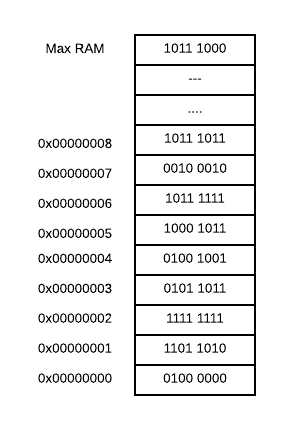
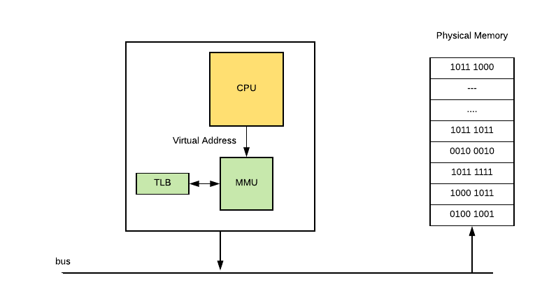
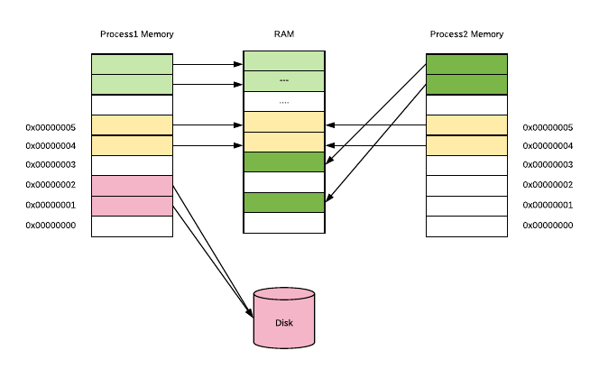
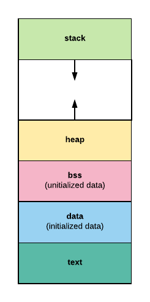
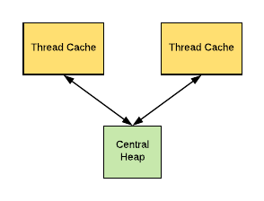
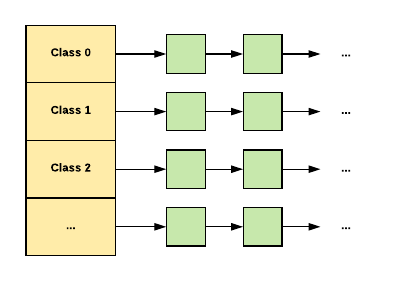
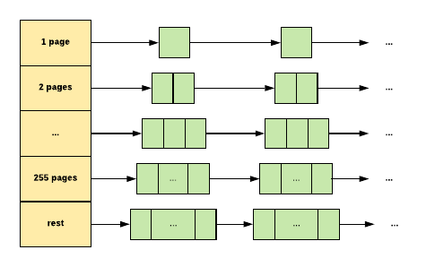
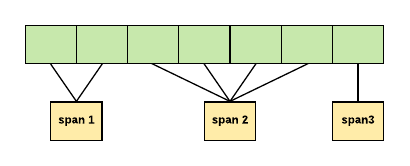

<!-- toc -->
[TOC]

# [GO MEMORY MANAGEMENT](https://povilasv.me/go-memory-management)

[GO MEMORY MANAGEMENT PART 2](https://povilasv.me/go-memory-management-part-2/)

[GO MEMORY MANAGEMENT PART 3](https://povilasv.me/go-memory-management-part-3/)

[GO SCHEDULER: MS, PS & GS](https://povilasv.me/go-scheduler/)

This is a blog post version of a talk I gave at [Vilnius Go Meetup](https://www.meetup.com/Vilnius-Golang/events/249897910/). If you’re ever in Vilnius and enjoy Go come join us and consider speaking 🙂

So, in this post we will explore Go memory management. Let’s begin with a following little program:

    func main() {
    http.HandleFunc("/bar", func(w http.ResponseWriter, r *http.Request) {
    fmt.Fprintf(w, "Hello, %q", html.EscapeString(r.URL.Path))
    })
    
    http.ListenAndServe(":8080", nil)
    }
    

Let’s compile and run it:

    go build main.go
    ./main
    

Now let’s find the running process via `ps`:

    ps -u --pid 16609
    USER PID %CPU %MEM VSZ RSS TTY STAT START TIME COMMAND
    povilasv 16609 0.0 0.0 388496 5236 pts/9 Sl+ 17:21 0:00 ./main
    

We can see that this program consumes 379.39 MiB of virtual memory and resident size is 5.11 mb. Wait what? Why ~380 MiB?

_A little reminder_:

**Virtual Memory Size(VSZ)** is all memory that the process can access, including memory that is swapped out, memory that is allocated, but not used, and memory that is from shared libraries. (_Edited_, good explanation in [stackoverflow](https://stackoverflow.com/a/21049737/112129).)

**Resident Set Size(RSS)** is number of memory pages the process has in real memory multiplied by pagesize. This excludes swapped out memory pages.

Before deep diving into this problem, let’s go thru some basics of computer architecture and memory management in computers.

## Memory Basics

[Wikipedia](https://en.wikipedia.org/wiki/Random-access_memory) defines RAM as:

> Random-access memory (RAM /ræm/) is a form of computer data storage that stores data and machine code currently being used.  
> A random-access memory device allows data items to be read or written in almost the same amount of time irrespective of the physical location of data inside the memory.

I view physical memory as this array of slots/units, where slot can hold 8 bits of information [1](#fn-1784-1). Each memory slot has an address and in your programs you tell CPU “_yo CPU, could you grab that byte of information out of memory at address 0_“, or “_yo CPU, could you put this byte of information at address 1_“.



As computers typically are running multiple tasks, reading and writing directly from/to physical memory is a bad idea. Imagine how easy is to write a program, which reads all the stuff (including your passwords) out of memory or a program, which would write at different program’s memory addresses. That would be wild wild west.

So, instead of doing things with Physical Memory we have a concept of **Virtual Memory**. When your program runs, it only sees it’s memory and it thinks that it’s the only one in here [2](#fn-1784-2). Also, not all of your program’s stored memory bytes could be in RAM. If you don’t access specific memory block often enough, Operating System can put some block of memory into slower storage (like disk) saving precious RAM. And OS won’t even admit to your application that OS did it. But we all know that OS did it.


Virtual memory can be implemented using _Segmentation_ or _Page tables_ based on your CPU architecture and OS. I’m not going to go into detail about Segmentation as Page tables are way more common, but you can read more about Segmentation in [3](#fn-1784-3).

In **Paged Virtual Memory**, we divide virtual memory into blocks, called **Pages**. Pages can vary in size based on hardware, but usually pages are _4-64 KB_, often with the capability to use huge pages from _2 MB to 1 GB_. The division into blocks is useful as it would require a lot more memory to manage each memory slot individually and would slow down performance of your computer.

In order to implement Paged Virtual Memory, there is a chip called **Memory Management Unit (MMU)** [4](#fn-1784-4), which sits between CPU and your memory. MMU holds mapping from virtual address to physical address in a table (which it stores in memory) called **Page Table**, containing one **Page Table Entry (PTE)** per page. Also MMU has a physical cache called **Translation Lookaside Buffer (TLB)**, which store recent translations from Virtual Memory to Physical. Schematically it looks like this:



So let’s say OS decides to put some virtual memory page into disk and your program tries to access it. This process looks like this:

1.  CPU issues a command to access the virtual address, MMU check’s it in it’s Page Table and prohibits access, because no Physical RAM has been allocated to that virtual page.
2.  Then MMU sends a Page Fault to the CPU.
3.  The Operating System then handles the Page fault, by finding a spare memory block of RAM (called frame) and setting up new PTE to map it.
4.  If no RAM is free, it may choose an existing page, using some replacement algorithm, and save it to disk (this process is called **paging**).
5.  With some Memory Management Units, there can also be a shortage of Page Table Entrys, in which case the OS will have to free one for the new mapping.

Operating systems usually manages multiple applications(processes) so the whole memory management bit looks like this:



Each process has one linear virtual address space, with addresses running from _0 to some huge maximum_. Virtual address space doesn’t need to be contiguous, so that not all of these virtual addresses are actually used to store data and they don’t consume space in RAM or disk. What’s really cool about this is that the same frame of real memory can back multiple virtual pages belonging to multiple processes. This is normally the case, with virtual memory occupied by GNU C Library code (libc), which is included by default if you compile with `go build`. You can compile go code without libc via ldflags setting [5](#fn-1784-5):

    go build -ldflags '-libgcc=none'
    

So this is a high level overview of what memory is and how it’s implemented using hardware and OS talking to each other. Now let’s take a look at what happens in OS, when you try to run your program and how programs can allocate memory.

Operating system
================

In order to run programs Operating System has a module, which loads programs and needed libraries, called program loader. In Linux you can call program loader from your program using `execve()` system call.

When loader runs it goes thru these steps [6](#fn-1784-6):

1.  validates the program image (permissions, memory requirements etc.);
2.  copies the program image from the disk into main memory;
3.  passes the command-line arguments on the stack;
4.  initializes registers (like the stack pointer);

Once loading is complete, the operating system starts the program by passing control to the loaded program code (executing a jump instruction to program’s entrypoint (`_start`)).

So what is a program anyway?
----------------------------

Usually you write programs in high-level languages like Go, which are compiled into either an executable machine code file or a non-executable machine-code object file (a library). These Object files, executable or not, are typically in a container format, such as [**Executable and Linkable Format (ELF)**](https://en.wikipedia.org/wiki/Executable_and_Linkable_Format) (typically in Linux), [**Portable Executable**](https://en.wikipedia.org/wiki/Portable_Executable) (typically in Windows). Sometimes you don’t have a luxury of writing everything in beloved Go. In that case, one option is to hand craft your own ELF binary and put machine code into correct ELF structure. Another option is to develop a program in assembly language, which remains human-readable while being more closely associated with machine code instructions.

Object files are binary representations of program intended to execute directly on to processor. Those object files contain not only machine code, but also carry metadata about application, like OS architecture, debug information. Also object files carry application data, like global variables or constants. Typically object files are structured into sections such as the **.text (executable code)**, **.data (global variables)**, and **.rodata (global constants)** [7](#fn-1784-7).

So I’m running Linux (Ubuntu) and my compiled programs (output file of `go build`) are in **ELF** [8](#fn-1784-8). In Go, we can easily write a program, which reads an ELF executable file, because Go has a `debug/elf` package in standard library. Here is an example:

    package main
    
    import (
    "debug/elf"
    "log"
    )
    
    func main() {
    f, err := elf.Open("main")
    
    if err != nil {
    log.Fatal(err)
    }
    
    for _, section := range f.Sections {
    log.Println(section)
    }
    }
    

And the output:
```
    2018/05/06 14:26:08 &{[ SHT_NULL 0x0 0 0 0 0 0 0 0 0} 0xc4200803f0 0xc4200803f0 0 0}
    2018/05/06 14:26:08 &{[.text SHT_PROGBITS SHF_ALLOC+SHF_EXECINSTR 4198400 4096 3373637 0 0 16 0 3373637} 0xc420080420 0xc420080420 0 0}
    2018/05/06 14:26:08 &{[.plt SHT_PROGBITS SHF_ALLOC+SHF_EXECINSTR 7572064 3377760 560 0 0 16 16 560} 0xc420080450 0xc420080450 0 0}
    2018/05/06 14:26:08 &{[.rodata SHT_PROGBITS SHF_ALLOC 7573504 3379200 1227675 0 0 32 0 1227675} 0xc420080480 0xc420080480 0 0}
    2018/05/06 14:26:08 &{[.rela SHT_RELA SHF_ALLOC 8801184 4606880 24 11 0 8 24 24} 0xc4200804b0 0xc4200804b0 0 0}
    2018/05/06 14:26:08 &{[.rela.plt SHT_RELA SHF_ALLOC 8801208 4606904 816 11 2 8 24 816} 0xc4200804e0 0xc4200804e0 0 0}
    2018/05/06 14:26:08 &{[.gnu.version SHT_GNU_VERSYM SHF_ALLOC 8802048 4607744 78 11 0 2 2 78} 0xc420080510 0xc420080510 0 0}
    2018/05/06 14:26:08 &{[.gnu.version_r SHT_GNU_VERNEED SHF_ALLOC 8802144 4607840 112 10 2 8 0 112} 0xc420080540 0xc420080540 0 0}
    2018/05/06 14:26:08 &{[.hash SHT_HASH SHF_ALLOC 8802272 4607968 192 11 0 8 4 192} 0xc420080570 0xc420080570 0 0}
    2018/05/06 14:26:08 &{[.shstrtab SHT_STRTAB 0x0 0 4608160 375 0 0 1 0 375} 0xc4200805a0 0xc4200805a0 0 0}
    2018/05/06 14:26:08 &{[.dynstr SHT_STRTAB SHF_ALLOC 8802848 4608544 594 0 0 1 0 594} 0xc4200805d0 0xc4200805d0 0 0}
    2018/05/06 14:26:08 &{[.dynsym SHT_DYNSYM SHF_ALLOC 8803456 4609152 936 10 0 8 24 936} 0xc420080600 0xc420080600 0 0}
    2018/05/06 14:26:08 &{[.typelink SHT_PROGBITS SHF_ALLOC 8804416 4610112 12904 0 0 32 0 12904} 0xc420080630 0xc420080630 0 0}
    2018/05/06 14:26:08 &{[.itablink SHT_PROGBITS SHF_ALLOC 8817320 4623016 3176 0 0 8 0 3176} 0xc420080660 0xc420080660 0 0}
    2018/05/06 14:26:08 &{[.gosymtab SHT_PROGBITS SHF_ALLOC 8820496 4626192 0 0 0 1 0 0} 0xc420080690 0xc420080690 0 0}
    2018/05/06 14:26:08 &{[.gopclntab SHT_PROGBITS SHF_ALLOC 8820512 4626208 1694491 0 0 32 0 1694491} 0xc4200806c0 0xc4200806c0 0 0}
    2018/05/06 14:26:08 &{[.got.plt SHT_PROGBITS SHF_WRITE+SHF_ALLOC 10518528 6324224 296 0 0 8 8 296} 0xc4200806f0 0xc4200806f0 0 0}
    ...
    2018/05/06 14:26:08 &{[.dynamic SHT_DYNAMIC SHF_WRITE+SHF_ALLOC 10518848 6324544 304 10 0 8 16 304} 0xc420080720 0xc420080720 0 0}
    2018/05/06 14:26:08 &{[.got SHT_PROGBITS SHF_WRITE+SHF_ALLOC 10519152 6324848 8 0 0 8 8 8} 0xc420080750 0xc420080750 0 0}
    2018/05/06 14:26:08 &{[.noptrdata SHT_PROGBITS SHF_WRITE+SHF_ALLOC 10519168 6324864 183489 0 0 32 0 183489} 0xc420080780 0xc420080780 0 0}
    2018/05/06 14:26:08 &{[.data SHT_PROGBITS SHF_WRITE+SHF_ALLOC 10702688 6508384 46736 0 0 32 0 46736} 0xc4200807b0 0xc4200807b0 0 0}
    2018/05/06 14:26:08 &{[.bss SHT_NOBITS SHF_WRITE+SHF_ALLOC 10749440 6555136 127016 0 0 32 0 127016} 0xc4200807e0 0xc4200807e0 0 0}
    2018/05/06 14:26:08 &{[.noptrbss SHT_NOBITS SHF_WRITE+SHF_ALLOC 10876480 6682176 12984 0 0 32 0 12984} 0xc420080810 0xc420080810 0 0}
    2018/05/06 14:26:08 &{[.tbss SHT_NOBITS SHF_WRITE+SHF_ALLOC+SHF_TLS 0 0 8 0 0 8 0 8} 0xc420080840 0xc420080840 0 0}
    2018/05/06 14:26:08 &{[.debug_abbrev SHT_PROGBITS 0x0 10891264 6557696 437 0 0 1 0 437} 0xc420080870 0xc420080870 0 0}
    2018/05/06 14:26:08 &{[.debug_line SHT_PROGBITS 0x0 10891701 6558133 350698 0 0 1 0 350698} 0xc4200808a0 0xc4200808a0 0 0}
    2018/05/06 14:26:08 &{[.debug_frame SHT_PROGBITS 0x0 11242399 6908831 381068 0 0 1 0 381068} 0xc4200808d0 0xc4200808d0 0 0}
    2018/05/06 14:26:08 &{[.debug_pubnames SHT_PROGBITS 0x0 11623467 7289899 121435 0 0 1 0 121435} 0xc420080900 0xc420080900 0 0}
    2018/05/06 14:26:08 &{[.debug_pubtypes SHT_PROGBITS 0x0 11744902 7411334 225106 0 0 1 0 225106} 0xc420080930 0xc420080930 0 0}
    2018/05/06 14:26:08 &{[.debug_gdb_scripts SHT_PROGBITS 0x0 11970008 7636440 53 0 0 1 0 53} 0xc420080960 0xc420080960 0 0}
    2018/05/06 14:26:08 &{[.debug_info SHT_PROGBITS 0x0 11970061 7636493 1847750 0 0 1 0 1847750} 0xc420080990 0xc420080990 0 0}
    2018/05/06 14:26:08 &{[.debug_ranges SHT_PROGBITS 0x0 13817811 9484243 167568 0 0 1 0 167568} 0xc4200809c0 0xc4200809c0 0 0}
    2018/05/06 14:26:08 &{[.interp SHT_PROGBITS SHF_ALLOC 4198372 4068 28 0 0 1 0 28} 0xc4200809f0 0xc4200809f0 0 0}
    2018/05/06 14:26:08 &{[.note.go.buildid SHT_NOTE SHF_ALLOC 4198272 3968 100 0 0 4 0 100} 0xc420080a20 0xc420080a20 0 0}
    2018/05/06 14:26:08 &{[.symtab SHT_SYMTAB 0x0 0 9654272 290112 35 377 8 24 290112} 0xc420080a50 0xc420080a50 0 0}
    2018/05/06 14:26:08 &{[.strtab SHT_STRTAB 0x0 0 9944384 446735 0 0 1 0 446735} 0xc420080a80 0xc420080a80 0 0}
 ```   

You can also inspect ELF files using Linux tools like: `size --format=sysv main` or `readelf -l main` (here `main` is the output binary).

As you can see that executable is just a file with some predefined format. Usually executable formats have segments, which are blocks of data memory mapped before running image. Here is a common view of segements, that a process has:



**The text segment** contains a program’s instructions and literals and static constants.

**The data segment** is working storage for the program. It can be preallocated and preloaded by `exec` and the process can extend or shrink it.

**The stack segment** contains a program stack. It grows as the stack grows, but doesn’t shrink when the stack shrinks.

The heap area commonly begins at the end of the **.bss** and **.data** segments and grows to larger addresses from there.

Let’s take look at how processes can allocate memory.

Libc manual says [9](#fn-1784-9), that programs can allocate in two major ways using `exec` family functions and programmatically. `exec` calls out program loader to launch a program, thus creating a virtual address space for a process, loading its program into it and running it. And the programmatic ways are:

*   **Static allocation** is what happens when you declare a global variable. Each global variable defines one block of space, of a fixed size. The space is allocated once, when your program is started (part of the exec operation), and is never freed.
*   **Automatic allocation** happens when you declare an automatic variable, such as a function argument or a local variable. The space for an automatic variable is allocated when the compound statement containing the declaration is entered, and is freed when that compound statement is exited.
*   **Dynamic Allocation** – is a technique in which programs determine as they are running where to store some information. You need dynamic allocation when the amount of memory you need, or how long you continue to need it, depends on factors that are not known before the program runs.

To dynamically allocate memory you have a couple of options. One of the options is to make a call to operating system (syscall or via libc). OS provides various functions like:

*   `mmap`/`munmap` – allocates/deallocates fixed block memory page.
*   `brk/sbrk` – changes/gets data segement size
*   `madvise` – gives advise to Operating System how to manage memory
*   `set_thread_area`/`get_thread_area` – works with thread local storage.

I think Go runtime only uses `mmap`, `madvise`, `munmap` and `sbrk` and it calls it directly to underlying OS via assembly or cgo, i.e. it’s not calling out to `libc` [10](#fn-1784-10). These memory allocation are low level and typically programers don’t use them. More common is to use libc’s **malloc** family functions, where you ask for _n_ bytes of memory and libc just returns it to you, and you need to call `free` to return it back.

Here is a basic `C` example of using `malloc`:

    #include /* printf, scanf, NULL */
    #include /* malloc, free, rand */
    int main (){
    int i,n;
    char * buffer;
    
    printf ("How long do you want the string? ");
    scanf ("%d", &i);
    
    buffer = (char*) malloc (i+1);
    if (buffer==NULL) exit (1);
    
    for (n=0; n<i; n++)
    buffer[n]=rand()%26+'a';
    buffer[i]='\0';
    
    printf ("Random string: %s\n",buffer);
    free (buffer);
    
    return 0;
    }
    

This example illustrates the need to dynamically allocate data, as we ask the user to enter string length, then allocate bytes based on that and generate random string. Also, note the explicit call to `free()`

## Memory Allocators

As Go doesn’t use `malloc` to get memory, but asks OS directly (via `mmap`), it has to implement memory allocation and deallocation on it’s own (like `malloc` does). Go’s memory allocator is originally based off [TCMalloc: Thread-Caching Malloc](http://goog-perftools.sourceforge.net/doc/tcmalloc.html).

Some interesting facts about **TCMalloc**:

*   **TCMalloc** is faster than the glibc 2.3 malloc (available as a separate library called `ptmalloc2`).
*   **ptmalloc2** takes approximately **300 nanoseconds** to execute a malloc.
*   The **TCMalloc** implementation takes approximately **50 nanoseconds** for the same operation pair.

**TCMalloc** also reduces lock contention for multi-threaded programs:

*   For small objects, there is virtually zero contention.
*   For large objects, TCMalloc tries to use fine grained and efficient spinlocks.

### TCMalloc

The secret behind TCMalloc performance is that it uses thread-local cache to store some preallocated memory “objects”, so that small allocations are satisfied from the thread-local cache [11](#fn-1784-11). Once thread-local cache is out of space, memory objects are moved from central data structures into thread-local cache.



TCMalloc treats small object (size <= _32K_) allocation differently from large. Large objects are allocated directly from the central heap using a page-level allocator. While, small objects are maped to one of approximately **170** allocatable size-classes.



So here is how it works for small objects:

**When allocating a small object:**

1.  We map its size to the corresponding size-class.
2.  Look in the corresponding free list in the thread cache for the current thread.
3.  If the free list is not empty, we remove the first object from the list and return it.

**If the free list is empty:**

1.  We fetch a bunch of objects from a central free list for this size-class (the central free list is shared by all threads).
2.  Place them in the thread-local free list.
3.  Return one of the newly fetched objects to the applications.

**If the central free list is also empty:**

1.  We allocate a run of pages from the central page allocator.
2.  Split the run into a set of objects of this size-class.
3.  Place the new objects on the central free list.
4.  As before, move some of these objects to the thread-local free list.

Large Objects (_size > 32K_) is rounded up to a page size (_4K_) and is handled by a central page heap. The central page heap is again an array of free lists:



For _i < 256_, the _k_th entry is a free list of runs that consist of _k_ pages. The _256_th entry is a free list of runs that have length >= _256_ pages.

So here is how it works for large objects:

**An allocation for _k_ pages is satisfied:**

1.  We look in the _k_-th free list.
2.  If that free list is empty, we look in the next free list, and so forth.
3.  Eventually, we look in the last free list if necessary.
4.  If that fails, we fetch memory from the system.
5.  If an allocation for _k_ pages is satisfied by a run of pages of length > _k_, the remainder of the run is re-inserted back into the appropriate free list in the page heap.

The memory is managed in term of runs of contiguous pages, which are called **Spans** (this is important as Go also manages memory in terms of Spans).

In TCMalloc a span can either be **allocated**, or **free**:

*   If free, the span is one of the entries in a page heap linked-list.
*   If allocated, it is either a large object that has been handed off to the application, or a run of pages that have been split up into a sequence of small objects.



In this example, _span 1_ occupies 2 pages, _span 2_ occupies 4 pages, _span 3_ occupies 1 page. A central array indexed by page number can be used to find the span to which a page belongs.

## Go Memory Allocator

Go allocator is similiar to TCMalloc, it works in runs of pages (spans / `mspan` objects), uses thread-local cache and divides allocations based on size. **Spans** are contiguous regions of memory of **8K** or larger. You can see Span for yourself in in `runtime/mheap.go` there is [mspan](https://github.com/golang/go/blob/master/src/runtime/mheap.go#L252) struct. There are 3 types of Spans:

1.  **idle** – span, that has no objects and can be released back to the OS, or reused for heap allocation, or reused for stack memory.
2.  **in use** – span, that has atleast one heap object and may have space for more.
3.  **stack** – span, which is used for goroutine stack. This span can live either in stack or in heap, but not in both.

When allocation happens we map objects into 3 size classes: **Tiny** class for objects _<16_ bytes, **Small** class for objects up to **32** kB and **Large** class for other objects. Small allocation sizes are rounded to one of about **70** size classes, each of which has its own free set of objects of exactly that size. I found some interesting comments in `runtime/malloc.go` about Tiny allocator, and why it was introduced: > The main targets of tiny allocator are small strings and standalone escaping variables.

> On a json benchmark the allocator reduces number of allocations by ~12% and reduces heap size by ~20%.  
> Tiny allocator combines several tiny allocation requests into a single memory block of 16 bytes.  
> The resulting memory block is freed when all subobjects are unreachable.  
> The subobjects can’t have pointers.

So here is how it works for Tiny objects:

**When allocating Tiny object:**

1.  Look in to corresponding **tiny** slot object in this P’s **mcache**.
2.  Round the size of existing subobject (if exists) into 8, 4 or 2 bytes based on the new object’s size.
3.  If the object fits together with existing subobjects, place it there.

**If it doesn’t fit in the tiny block**:

1.  Look in the corresponding **mspan** in this P’s **mcache**.
2.  Obtain a new **mspan** from **mcache**.
3.  Scan the **mspan**‘s free bitmap to find a free slot.
4.  If there is a free slot, allocate it and use it as a new **tiny** slot object. (This can all be done without acquiring a lock.)

**If the mspan has no free slots:**

1.  Obtain a new **mspan** from the **mcentral**‘s list of mspans of the required size class that have free space.
2.  Obtaining a whole span amortizes the cost of locking the **mcentral**.

**If the mspan’s list is empty:**

1.  Obtain a run of pages from the **mheap** to use for the **mspan**.

**If the mheap is empty or has no page runs large enough**:

1.  Allocate a new group of pages (at least 1MB) from the **OS**.
2.  Allocating a large run of pages amortizes the cost of talking to the **OS**.

For Small objects it’s very similiar, but we skip the first part:

**When allocating small object:**

1.  Round the size up to one of the small size classes.
2.  Look in the corresponding **mspan** in this P’s **mcache**.
3.  Scan the **mspan**‘s free bitmap to find a free slot.
4.  If there is a free slot, allocate it. (This can all be done without acquiring a lock.)

**If the mspan has no free slots:**

1.  Obtain a new **mspan** from the **mcentral**‘s list of mspans of the required size class that have free space.
2.  Obtaining a whole span amortizes the cost of locking the **mcentral**.

**If the mspan’s list is empty:**

1.  Obtain a run of pages from the **mheap** to use for the **mspan**.

**If the mheap is empty or has no page runs large enough**:

1.  Allocate a new group of pages (at least 1MB) from the **OS**.
2.  Allocating a large run of pages amortizes the cost of talking to the **OS**.

Allocating and freeing a large object uses the **mheap** directly, bypassing the **mcache** and **mcentral**. **mheap** is managed like in TCMalloc, where we have an array of free lists. Large objects are rounded up to page size (_8K_) and we look for _k_th entry in a free list, which consists of _k_ pages, if it’s empty we go down. Rinse and repeat, until the _128_ array entry. If we don’t find empty page in _127_, we look for a span in leftover large pages (`mspan.freelarge` field) and if that fails we take from OS.

So that’s all about Go Memory allocation, after digging thru this code [runtime.MemStats](https://golang.org/pkg/runtime/#MemStats) makes way more sense to me. You can see all the reporting for size classes, you can view how many bytes object’s that implement memory management (like `MCache`, `MSpan`) take, etc. You can read more about memstats in [exploring Prometheus Go metrics](https://povilasv.me/prometheus-go-metrics/).

## Getting back to the problem

So to remind you, we are investigating:

    func main() {
    http.HandleFunc("/bar", func(w http.ResponseWriter, r *http.Request) {
    fmt.Fprintf(w, "Hello, %q", html.EscapeString(r.URL.Path))
    })
    
    http.ListenAndServe(":8080", nil)
    }
    

    go build main.go
    ./main
    

    ps -u --pid 16609
    USER PID %CPU %MEM VSZ RSS TTY STAT START TIME COMMAND
    povilasv 16609 0.0 0.0 388496 5236 pts/9 Sl+ 17:21 0:00 ./main
    

Which gives us ~380 MiB of virtual memory size.

### So maybe it’s runtime?

Let’s read memstats:

    func main() {
    http.HandleFunc("/bar", func(w http.ResponseWriter, r *http.Request) {
    fmt.Fprintf(w, "Hello, %q", html.EscapeString(r.URL.Path))
    })
    
    go func() {
    for {
    var m runtime.MemStats
    runtime.ReadMemStats(&m)
    
    log.Println(float64(m.Sys) / 1024 / 1024)
    log.Println(float64(m.HeapAlloc) / 1024 / 1024)
    time.Sleep(10 * time.Second)
    }
    }()
    http.ListenAndServe(":8080", nil)
    }
    

Note:  
– **MemStats.Sys** is the total bytes of memory obtained from the OS. Sys measures the virtual address space reserved by the Go runtime for the heap, stacks, and other internal data structures.  
– **MemStats.HeapAlloc** is bytes of allocated for heap objects.

**Nope, it doesn’t look like it:**

    2018/05/08 18:00:34 4.064689636230469
    2018/05/08 18:00:34 0.5109481811523438
    

### Maybe it’s normal?

Let’s try this C program:

    #include /* printf, scanf, NULL */
    
    int main (){
    int i,n;
    printf ("Enter a number:");
    scanf ("%d", &i);
    
    return 0;
    }
    

    gcc main.c
    ./a.out
    

**Nope, ~10MiB:**

    ps -u --pid 25074
    
    USER PID %CPU %MEM VSZ RSS TTY STAT START TIME COMMAND
    povilasv 25074 0.0 0.0 10832 908 pts/6 S+ 17:48 0:00 ./a.out
    

### Let’s try looking into /proc

    cat /proc/30376/status
    

    Name: main
    State: S (sleeping)
    Pid: 30376
    ...
    FDSize: 64
    VmPeak: 386576 kB
    VmSize: 386576 kB
    VmLck: 0 kB
    VmPin: 0 kB
    VmHWM: 5116 kB
    VmRSS: 5116 kB
    RssAnon: 972 kB
    RssFile: 4144 kB
    RssShmem: 0 kB
    VmData: 44936 kB
    VmStk: 136 kB
    VmExe: 2104 kB
    VmLib: 2252 kB
    VmPTE: 132 kB
    VmSwap: 0 kB
    HugetlbPages: 0 kB
    CoreDumping: 0
    Threads: 6
    

**Doesn’t help as segment sizes are normal, only _VmSize_ is huge.**

### Let’s take a look at /proc/maps

    cat /proc/31086/maps
    

    00400000-0060e000 r-xp 00000000 fd:01 1217120 /main
    0060e000-007e5000 r--p 0020e000 fd:01 1217120 /main
    007e5000-0081b000 rw-p 003e5000 fd:01 1217120 /main
    0081b000-0083d000 rw-p 00000000 00:00 0
    0275d000-0277e000 rw-p 00000000 00:00 0 [heap]
    c000000000-c000001000 rw-p 00000000 00:00 0
    c41fff0000-c420200000 rw-p 00000000 00:00 0
    7face8000000-7face8021000 rw-p 00000000 00:00 0
    7face8021000-7facec000000 ---p 00000000 00:00 0
    7facec000000-7facec021000 rw-p 00000000 00:00 0
    ...
    7facf4021000-7facf8000000 ---p 00000000 00:00 0
    7facf8000000-7facf8021000 rw-p 00000000 00:00 0
    7facf8021000-7facfc000000 ---p 00000000 00:00 0
    7facfd323000-7facfd324000 ---p 00000000 00:00 0
    7facfd324000-7facfdb24000 rw-p 00000000 00:00 0
    7facfdb24000-7facfdb25000 ---p 00000000 00:00 0
    ...
    7facfeb27000-7facff327000 rw-p 00000000 00:00 0
    7facff327000-7facff328000 ---p 00000000 00:00 0
    7facff328000-7facffb28000 rw-p 00000000 00:00 0
    7fddc2798000-7fddc2f98000 rw-p 00000000 00:00 0
    ...
    7fddc2f98000-7fddc2f9b000 r-xp 00000000 fd:01 2363785 libdl-2.27.so
    ...
    7fddc319c000-7fddc3383000 r-xp 00000000 fd:01 2363779 libc-2.27.so
    ...
    7fddc3587000-7fddc3589000 rw-p 001eb000 fd:01 2363779 libc-2.27.so
    7fddc3589000-7fddc358d000 rw-p 00000000 00:00 0
    7fddc358d000-7fddc35a7000 r-xp 00000000 fd:01 2363826 libpthread-2.27.so
    ...
    7fddc37a8000-7fddc37ac000 rw-p 00000000 00:00 0
    7fddc37ac000-7fddc37b2000 r-xp 00000000 fd:01 724559 libgtk3-nocsd.so.0
    ...
    7fddc39b2000-7fddc39b3000 rw-p 00006000 fd:01 724559 libgtk3-nocsd.so.0
    7fddc39b3000-7fddc39da000 r-xp 00000000 fd:01 2363771 ld-2.27.so
    7fddc3af4000-7fddc3bb8000 rw-p 00000000 00:00 0
    7fddc3bda000-7fddc3bdb000 r--p 00027000 fd:01 2363771 ld-2.27.so
    ....
    7fddc3bdc000-7fddc3bdd000 rw-p 00000000 00:00 0
    7fff472e9000-7fff4730b000 rw-p 00000000 00:00 0 [stack]
    7fff473a7000-7fff473aa000 r--p 00000000 00:00 0 [vvar]
    7fff473aa000-7fff473ac000 r-xp 00000000 00:00 0 [vdso]
    ffffffffff600000-ffffffffff601000 r-xp 00000000 00:00 [vsyscall]
    

Summing all those addresses will probably leave me with the same ~380Mib. I am too lazy to sum it up. But it’s cool, scroll to the right you will see `libc` and other shared libraries mapped to your process.

### Let’s try a simpler program

    func main() {
    go func() {
    for {
    var m runtime.MemStats
    runtime.ReadMemStats(&m)
    
    log.Println(float64(m.Sys) / 1024 / 1024)
    log.Println(float64(m.HeapAlloc) / 1024 / 1024)
    time.Sleep(10 * time.Second)
    }
    }()
    
    fmt.Println("hello")
    time.Sleep(1 * time.Hour)
    }
    

    go build main.go
    ./main
    

    ps -u --pid 3642
    

    USER PID %CPU %MEM VSZ RSS TTY STAT START TIME COMMAND
    povilasv 3642 0.0 0.0 4900 948 pts/10 Sl+ 09:07 0:00 ./main
    

Hmm, that’s interesting, it’s only ~4Mib.

**To be continued …**

Thank you for reading this. As always I look forward to your comments. And please don’t spoil my search in the comments 😀

## 参考

*   https://samypesse.gitbooks.io/how-to-create-an-operating-system/content/Chapter-8/
*   https://chortle.ccsu.edu/AssemblyTutorial/Chapter-04/ass04_1.html
*   http://brokenthorn.com/Resources/OSDev18.html
*   Libc man pages on memory: https://www.gnu.org/software/libc/manual/html_node/Memory.html#Memory
*   TcMalloc: http://goog-perftools.sourceforge.net/doc/tcmalloc.html
*   https://mcuoneclipse.com/2013/04/14/text-data-and-bss-code-and-data-size-explained/
*   https://stackoverflow.com/questions/24973973/is-exe-made-of-pure-machine-code-only
*   http://brokenthorn.com/Resources/OSDev18.html
*   https://www.win.tue.nl/~aeb/linux/lk/lk.html
*   https://samypesse.gitbooks.io/how-to-create-an-operating-system/content/chapter9/
*   https://wiki.osdev.org/ELF_Tutorial
*   https://stackoverflow.com/questions/610682/do-bss-section-zero-initialized-variables-occupy-space-in-elf-file

1.  Actually saying that each memory slot holds 8 bits is not really true, as there are architectures, where you can store less or more than 8 bits, you can read more in https://www.reddit.com/r/askscience/comments/3b6lkz/why_is_it_that_the_de_facto_standard_for_the/ and in https://softwareengineering.stackexchange.com/questions/91230/addressable-memory-unit#91263 [↩](#fnref-1784-1)
2.  Actually there is a concept called shared memory, so that multiple applications can access the same memory. Read more in http://www.csl.mtu.edu/cs4411.ck/www/NOTES/process/shm/what-is-shm.html [↩](#fnref-1784-2)
3.  https://littleosbook.github.io/#a-short-introduction-to-virtual-memory and https://en.wikipedia.org/wiki/Virtual_memory (#fnref-1784-3)
4.  You can read more about it in https://en.wikipedia.org/wiki/Memory_management_unit and https://wiki.osdev.org/Paging [↩](#fnref-1784-4)
5.  Libc man pages are a really great read: http://www.gnu.org/software/libc/manual/html_node/Memory.html (#fnref-1784-5)
6.  The steps are for Linux, taken from https://en.wikipedia.org/wiki/Loader_(computing) [↩](#fnref-1784-6)
7.  You can read more about executable files in: https://en.wikipedia.org/wiki/Portable_Executable, https://wiki.osdev.org/ELF_Tutorial, https://www.quora.com/Where-does-elf-file-sits-inside-a-microcontroller (#fnref-1784-7)
8.  You can verify that your program is in ELF, by opening the binary in text editor and seeing text `ELF` string in the beginning (#fnref-1784-8)
9.  https://www.gnu.org/software/libc/manual/html_node/Memory-Concepts.html#Memory-Concepts (#fnref-1784-9)
10.  Function definitions are in https://github.com/golang/go/blob/master/src/runtime/mem_linux.go and assembly in https://github.com/golang/go/blob/master/src/runtime/sys_linux_amd64.s#L449. There is really cool post about a bug, which happened because Go does not use libc wrappers: https://marcan.st/2017/12/debugging-an-evil-go-runtime-bug/. (#fnref-1784-10)
11.  Read about tcmalloc design in http://goog-perftools.sourceforge.net/doc/tcmalloc.html [↩](#fnref-1784-11)

### 标签
*   [go](https://povilasv.me/tag/go/)
*   [Memory Management](https://povilasv.me/tag/memory-management/)


