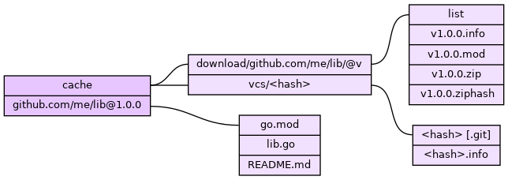
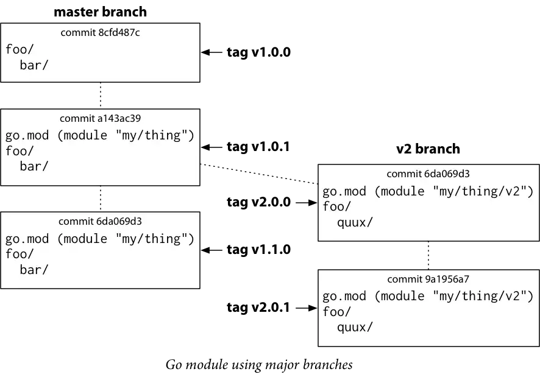
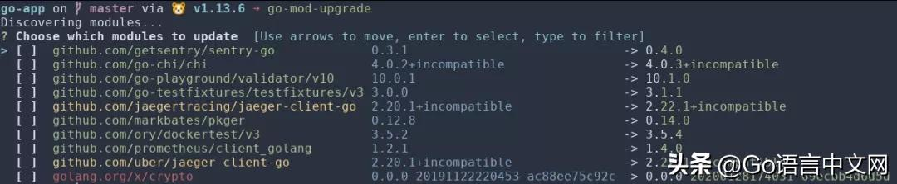

[TOC]
go mod 1.13

https://github.com/golang/go/wiki/Modules
https://github.com/golang/proposal/blob/master/design/24301-versioned-go.md
[goproxy.cn 现已推出首个 Go 模块代理统计数据 API](https://mp.weixin.qq.com/s/ZtQJE-Vv_Ke8SjhrzBoGcw)

## 核心文件：go.mod
```
module xx.com/x
go 1.12
require other/thing v1.0.2 // 这是注释
require new/thing/v2 v2.3.4 // indirect
require（
  new/thing v2.3.4
  old/thing v0.0.0-20190603091049-60506f45cf65
）
exclude old/thing v1.2.3
replace bad/thing v1.4.5 => good/thing v1.4.5
```
```
module
go
require
exclude
replace
```
indirect 注释标记了该模块不是被当前模块直接导入的，只是被间接导入。

replace my/example/pkg => ./pkg // 可以替换本地包

Go 命令行工具会自动处理 go.mod 中指定的模块版本。当源代码中 import 指向的模块不存在于 go.mod 文件中时，Go 命令行工具会自动搜索这个模块，并将最新版本（最后一个 tag 且非预发布的稳定版本）添加到 go.mod 文件中。

如果没有 tag，则使用伪版本（第 7 行），这是一种版本语法，专门用于标记没有 tag 的提交（一些 golang.org/x/ 下的包就是没有 tag 的）。如： v0.0.0-20190603091049-60506f45cf65 。

前面部分为语义化版本号，用于标记版本；中间部分为 UTC 的提交时间，用于比较两个伪版本以其确定先后顺序；后面部分是 commit 哈希的前缀，用于标记该版本位于哪个 commit。

所有前导动词的作用如下：

module：定义模块路径。
go：设置预期的语言版本。
require：要求给定版本或更高版本的特定模块。
exclude：排除特定版本模块的使用，不允许的模块版本被视为不可用，并且查询无法返回。
replace：使用不同的模块版本替换原有模块版本。

```
module github.com/example/project

require (
    github.com/SermoDigital/jose v0.0.0-20180104203859-803625baeddc
    github.com/google/uuid v1.1.0
)

exclude github.com/SermoDigital/jose v0.9.1

replace github.com/google/uuid v1.1.0 => git.coolaj86.com/coolaj86/uuid.go v1.1.1
```
exclude
In the case of the github.com/SermoDigital/jose package, it has a proper git tag for v0.9.1, but the current version is v1.1, which is NOT a proper git tag (missing the "patch" version).

By excluding the properly-versioned (but not working) code it causes go mod to fetch from master instead (which is not properly versioned, but has the working code).

## 版本管理文件：go.sum
每行由模块导入路径、模块的特定版本和预期哈希组成。
在每次缺少模块时，如果缓存中不存在，则需要下载并计算其哈希添加到 go.sum 中；如果缓存中存在，则需要匹配 go.sum 中的已有条目。
这样，构建软件的用户就可以使用哈希验证其构建是否跟你的构建相同（ go mod verify ），而无论他们怎样获取依赖项，都可以得到相同的版本。同时也保证了项目依赖不会发生预料之外的恶意修改和其他问题。这也是为什么要将 go.sum 文件加入版本管理（Git）的原因。


语义化版本号格式为： X.Y.Z （主版本号.次版本号.修订号），使用方法如下：
- 进行不向下兼容的修改时，递增主版本号。
- API 保持向下兼容的新增及修改时，递增次版本号。
- 修复问题但不影响 API 时，递增修订号。

## 常用命令
- go mod init ：创建一个新模块，初始化 go.mod 文件，参数为该模块的导入路径，推荐使用这种形式。如： go mod init github.com/linehk/example 。
- go get ：更改依赖项版本（或添加新的依赖项）。
- go build 、 go test 等命令：Go 命令行工具会根据需要添加新的依赖项。如： go test ./... ，测试当前模块。
- go list -m all ：打印当前模块依赖。
- go mod tidy ：移除无用依赖。
- go list -m -versions github.com/gin-gonic/gin ：列出该模块的所有版本。
- go mod verify ：验证哈希。

We do this by using our good old friend go get:
- run go get -u to use the latest minor or patch releases (i.e. it would update from 1.0.0 to, say, 1.0.1 or, if available, 1.1.0)
- run go get -u=patch to use the latest patch releases (i.e., would update to 1.0.1 but not to 1.1.0)
- run go get package@version to update to a specific version (say, github.com/robteix/testmod@v1.0.1)

version 1.0.1. go get -u will not get version 2.0.0.
## go get
`go get -d -v ./...`
`-d`标志只下载代码包，不执行安装命令；
`-v`打印详细日志和调试日志。这里加上这个标志会把每个下载的包都打印出来；
`./...`这个表示路径，代表当前目录下所有的文件。
`-u` 强制使用网络去更新包和它的依赖包

### go get 指定版本
```
go get github.com/kataras/iris/v12@master
go get github.com/kataras/iris/v12@v12.2.0-alpha2
```
### Go1.17 go get变化
go get 只用来下载普通的包,不做编译和安装（以前go get 有一个 flag -d，指示 go get 下载对应的包，但不做编译和安装。将来的版本，-d 会成为默认行为，这样会更快。此外，因为不编译，即使目标依赖在特定平台编译报错，go get 也能正常执行完。）

go install 安装可执行程序
`go install -v ./...`

废弃 -insecure；使用 GOINSECURE 环境变量

在模块外，不带 `@version` 是无法安装的!
如果你在模块目录中，并且你不带 `@version` 执行安装的话，只能安装 go.mod 中已经包含的版本。并且不能安装未出现在 go.mod 中的包。


## Workspace Mode（工作区模式）
https://mp.weixin.qq.com/s/S3I919YZb-bgaEnHgKq7fg

https://go.googlesource.com/proposal/+/master/design/45713-workspace.md

## Module dependencies


修改mod文件
```
# require a new dependency
go mod edit -require one/thing@version

# drop a requirement
go mod edit -droprequire one/thing

# exclude a dependency
go mod edit -exclude bad/thing@version

# drop an exclusion
go mod edit -dropexclude bad/thing@version

# replace a dependency
go mod edit -replace src/thing@version=dst/thing@version

# drop a replacement
go mod edit -dropreplace src/thing@version
```


#### go env
```
set GONOPROXY=
set GONOSUMDB=
set GOPRIVATE=
set GOPROXY=https://goproxy.cn,direct
set GOSUMDB=off
# export GOPROXY=https://gocenter.io
```

设置GOPROXY代理：
```
go env -w GOPROXY=https://goproxy.cn,direct
```
设置GOPRIVATE 会同事设置GONOPROXY GONOSUMDB
设置GOPRIVATE来跳过私有库，比如常用的Gitlab或Gitee，中间使用逗号分隔：
```
go env -w GOPRIVATE=*.gitlab.com,*.gitee.com
```
关闭验证包的有效性
```
go env -w GOSUMDB=off
```
还原设置
```
go env -u GOSUMDB
```
忽略http安全（也不会走sumdb）
```
go get -insecure modxxx
```


所以在使用 Go 命令行工具或 go.mod 文件时，就可以使用语义化版本号来进行 模块查询 ，具体规则如下：
- 默认值（ @latest ）：将匹配最新的可用标签版本或源码库的最新未标签版本。
- 完全指定版本（ @v1.2.3 ）：将匹配该指定版本。
- 版本前缀（ @v1 或 @v1.2 ）：将匹配具有该前缀的最新可用标签版本。
- 版本比较（ @<v1.2.3 或 @>=v1.5.6 ）：将匹配最接近比较目标的可用标签版本。 < 则为小于该版本的最- 新版本， > 则为大于该版本的最旧版本。当使用类 Unix 系统时，需用引号将字符串包裹起来以防止大于小于号被解释为重定向。如： go get 'github.com/gin-gonic/gin@<v1.2.3' 。
- 指定某个 commit（ @c856192 ）：将匹配该 commit 时的版本。
- 指定某个分支（ @master ）：将匹配该分支版本。


如上图所示，为了能让 Go Modules 的使用者能够从旧版本更方便地升级至新版本，Go 语言官方提出了两个重要的规则：
- 导入兼容性规则（import compatibility rule）：如果旧包和新包具有相同的导入路径，则新包必须向后兼容旧包。
- 语义化导入版本规则（semantic import versioning rule）：每个不同主版本（即不兼容的包 v1 或 v2）使用不同的导入路径，以主版本结尾，且每个主版本中最多一个。如：一个 rsc.io/quote、一个 rsc.io/quote/v2、一个 rsc.io/quote/v3。

```
module my-module/v2

require (
  some/pkg/v2 v2.0.0
  some/pkg/v2/mod1 v2.0.0
  my/pkg/v3 v3.0.1
)
```
格式总结为pkgpath/vN，其中N是大于1的主要版本号。在代码里导入时也需要附带上这个版本信息，如import "some/pkg/v2"。如此一来包的导入路径发生了变化，也不用担心名称相同的对象需要向后兼容的限制了，因为golang认为不同的导入路径意味着不同的包。

不过这里有几个例外可以不用参照这种写法：
1. 当使用gopkg.in格式时可以使用等价的require gopkg.in/some/pkg.v2 v2.0.0
2. 在版本信息后加上+incompatible就可以不需要指定/vN，例如：require some/pkg v2.0.0+incompatible
3. 使用go1.11时设置GO111MODULE=off将取消这种限制，当然go1.12里就不能这么干了
除此以外的情况如果直接使用v2+版本将会导致go mod报错。

v2+版本的包允许和其他不同大版本的包同时存在（前提是添加了/vN），它们将被当做不同的包来处理。

另外/vN并不会影响你的仓库，不需要创建一个v2对应的仓库，这只是go modules添加的一种附加信息而已。

当然如果你不想遵循这一规范或者需要兼容现有代码，那么指定+incompatible会是一个合理的选择。不过如其字面意思，go modules不推荐这种行为。

而与 Git 分支的集成如下：


vendor 目录
以前使用 vendor 目录有两个目的：
- 可以使用依赖项的确切版本用来构建。
- 即使原始副本消失，也能保证这些依赖项是可用的。

而模块现在有了更好的机制来实现这两个目的：
- 通过在 go.mod 文件中指定依赖项的确切版本。
- 可用性则由缓存代理（$GOPROXY）实现。

而且 vendor 目录也很难管理这些依赖项，久而久之就会陷入与 node_modules 黑洞一样的窘境。

node_modules 黑洞


所以，默认情况下使用 Go Modules 将完全忽略 vendor 的依赖项，但是为了平稳过度，可以使用 go mod vendor 命令可以创建 vendor 目录。

并在 Go 命令行工具使用 -mod=vendor 参数，如：go test -mod=vendor ./...；或设置环境变量 GOFLAGS 为 -mod=vendor，这样会假定 vendor 目录包含正确的依赖项副本，并忽略 go.mod 文件中的依赖项描述来构建。


## go-mod服务
proxy.golang.org-符合上提供的规范的模块镜像go help goproxy。

sum.golang.org-一个可审核的校验和数据库，go命令将使用该数据库对模块进行身份验证。有关更多详细信息，请查看“ 确保公共安全模块生态系统提案 ”。

index.golang.org-一个索引，用于提供新模块版本的供稿， proxy.golang.org可以使用这些新版本。可以在 https://index.golang.org/index 上查看提要。该提要以新行分隔的JSON形式提供，提供了模块路径（作为Path），模块版本（作为Version）以及proxy.golang.org首次缓存它的时间（作为Timestamp）。该列表按时间顺序排序。有两个可选参数：

- 'since'：返回列表中模块版本的最早允许时间戳（RFC3339格式）。默认为时间的开始，例如 https://index.golang.org/index?since=2019-04-10T19:08:52.997264Z
- 'limit'：返回列表的最大长度。默认值= 2000，最大值= 2000，例如 https://index.golang.org/index?limit=10


## go mod
go mod why
go mod why github.com/coreos/etcd
go mod graph 依赖输出

go mod graph|grep github.com/coreos/etcd

实际上，调试 go mod 问题最好的工具是 go get，加上 -x 选项后，更是屡试不爽。
go get-x github.com/coreos/etcd

> 出现：remote origin already exists. 解决方案：git config --global --unset remote.origin.push

### 冲突
https://github.com/cch123/gomod-conflict-detect

编译成gomod-conflict-detect文件
or
go install github.com/cch123/gomod-conflict-detect

执行
go mod graph | gomod-conflict-detect

## go mod相关工具
https://github.com/nikolaydubina/go-recipes?tab=readme-ov-file#dependencies
### go mod graph 可视化
安装 graphviz
choco install graphviz.portable

pcman安装 pacman -S mingw-w64-x86_64-graphviz

go install github.com/poloxue/modv

go mod graph | modv | dot -T svg -o graph.svg; start graph.svg

TIP: 当包多了不是人看的


### go-mod-upgrade 交互式更新依赖
https://github.com/oligot/go-mod-upgrade

[Go Wiki 在 如何升级和降级依赖关系](https://github.com/golang/go/wiki/Modules#how-to-upgrade-and-downgrade-dependencies) 中介绍了一个命令：
```
go list -u -f '{{if (and (not (or .Main .Indirect)) .Update)}}{{.Path}}: {{.Version}} -> {{.Update.Version}}{{end}}' -m all 2> /dev/null
```
它查看直接依赖项的可用升级。然而，过程不可控，即我们不能通过它方便的更新某些依赖项。

此工具旨在通过交互的方式，使更新多个依赖项变得更加容易。这类似于 yarn upgrade-interactive ，但适用于 Go。

安装go-mod-upgrade


### go依赖分析

https://github.com/topics/dependency-analysis?l=go
#### goda
https://github.com/loov/goda

```
go install github.com/loov/goda@latest

goda graph "github.com/loov/goda:mod" | dot -Tsvg -o graph.svg
```

