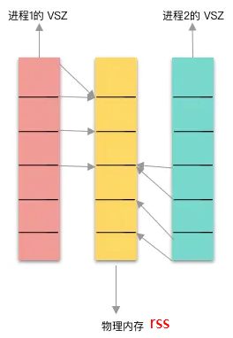
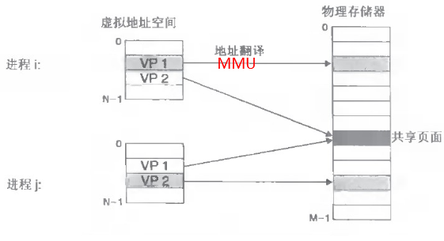
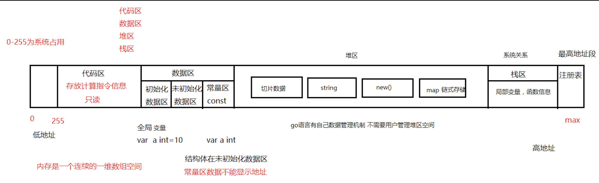
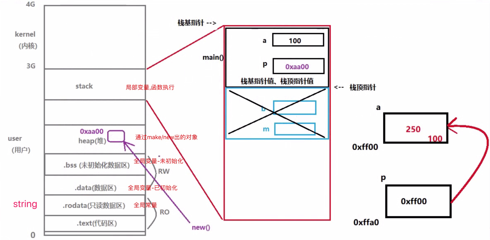

<!-- toc -->
[TOC]

# 虚拟内存地址空间划分

## 名词解释

### RSS（Resident Set Size）
RSS 是常驻内存集（Resident Set Size），表示该进程分配的内存大小。

RSS 不包括进入交换分区的内存。

RSS 包括共享库占用的内存（只要共享库在内存中）

RSS 包括所有分配的栈内存和堆内存。

### VSZ（Virtual Memory Size）

VSZ 表示进程分配的虚拟内存。

VSZ 包括进程可以访问的所有内存，包括进入交换分区的内容，以及共享库占用的内存。



### MMU（Memory Management Unit）
内存管理单元MMU的主要功能是虚拟地址到物理地址的转换

## 虚拟内存映射到物理内存

进程是操作系统进行资源分配的最小单位，而内存是进程运行必不可少的资源。

操作系统为每个进程分配独享的内存空间，这个独享的内存空间只是虚拟内存空间，
每次访问内存空间的某个地址 (虚拟地址)，都需要把地址翻译(mmu)成实际物理内存地址。

> 每一个进程都是运行在自己的内存沙盒里，程序被分配的地址都是 “虚拟内存”



> 物理内存可以被多个进程共享

### 查看进程的虚拟内存
```
$ ps aux

USER               PID   %CPU  %MEM      VSZ     RSS    TT  STAT   STARTED    TIME     COMMAND
xxxxx              3584  99.2  0.1     4380456  4376   s003  R+    8:33下午   0:05.81  ./myhttp


// VSZ: 是指虚拟地址，他是程序实际操作的内存。
        包含了分配还没有使用的内存。

// RSS: 是实际的物理内存，
        包含了栈内存与堆内存.
```

## go数据结构内存划分





1. 虚拟内存地址连续
2. 虚拟内存被划分为
    1. 栈区
        局部变量,函数信息.
    2. 堆区
        go自己gc管理堆空间
    3. 数据区
        .data   rw //全局变量(已初始化)
        .bss    rw //全局变量(未初始化)
        .rodata ro //全局常量, 常量区数据不能显示地址

    4. 代码区
        .text  ro

## go常用编译参数 

### go build常用参数
```
$ go build -h
usage: go build [-o output] [-i] [build flags] [packages]


-v      打印出那些被编译的代码包的名字
-p n    开启并发编译，默认情况下该值为 CPU 逻辑核数
-a      强制重新构建
-n      打印编译时会用到的所有命令，但不真正执行
-x      打印编译时会用到的所有命令
-race   开启竞态检测
-work   打印出编译时生成的临时工作目录的路径，并在编译结束时保留它。默认编译结束被删除.
```

### 查看编译过程 go build -n main.go

```
// 分三步
1. /usr/local/go/pkg/tool/linux_amd64/compile
2. /usr/local/go/pkg/tool/linux_amd64/buildid
3. /usr/local/go/pkg/tool/linux_amd64/link
```

### 查看编译后汇编代码 - 查看调用源码关系

```
go tool compile -S main.go               //输出的FUNCDATA 和 PCDATA 是编译器产生的, 用于保存一些和垃圾收集相关的信息,不用管.

go tool compile -S main.go|grep -i call
```

### 其他命令
```
// 禁止gc优化和内联 
go build -gcflags '-N -l'

-gcflags 用于指定需要传递给go tool compile命令的标记的列表。
-m       print optimization decisions
-N       disable optimizations(禁止编译优化)
-l       disable inlining(禁止内联,禁止内联也可以一定程度上减小可执行程序大小)

// 查看gcflags参数含义
go tool compile --help 

// 逃逸分析
go build -gcflags '-m -l' main.go
```