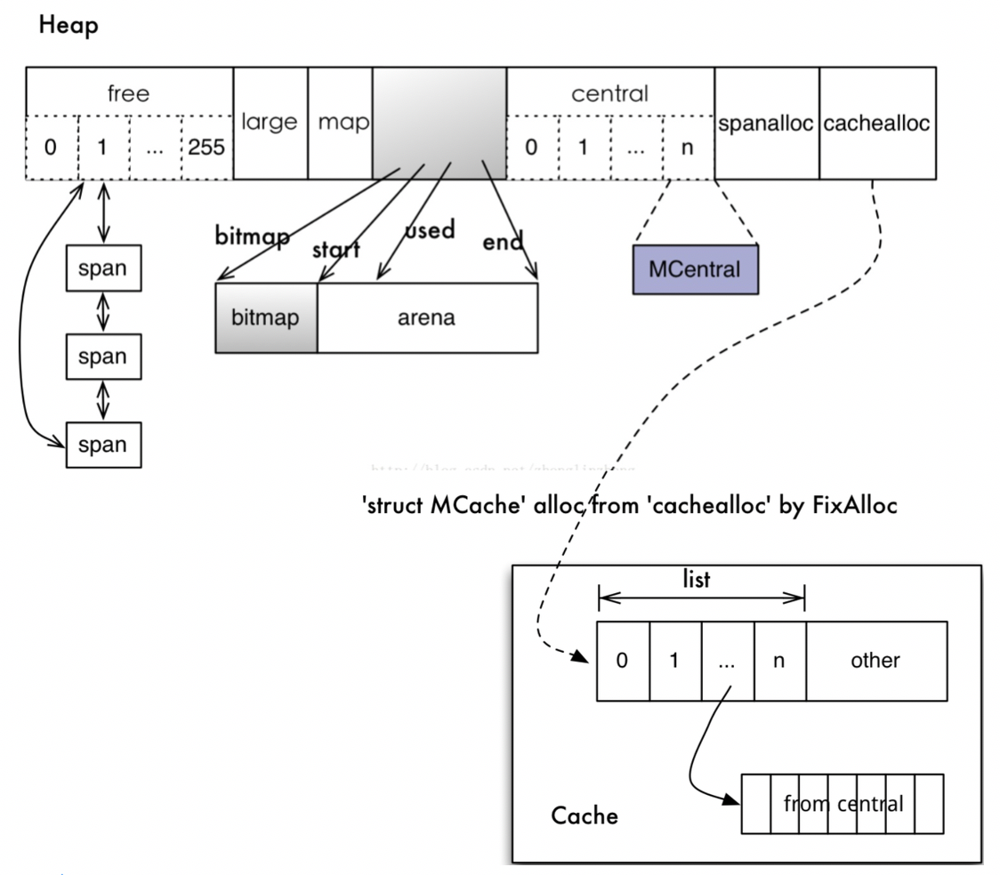
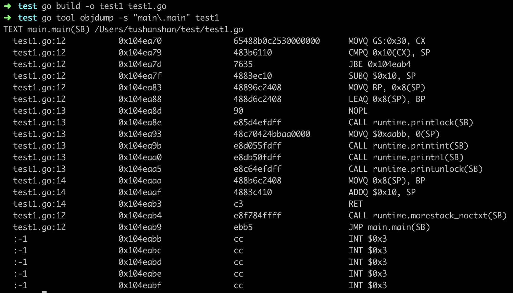

<!-- toc -->
[TOC]
# [golang内存分配](https://www.cnblogs.com/33debug/p/12068699.html)

　　Go语言内置运行时（就是runtime），不同于传统的内存分配方式，go为自主管理，最开始是基于tcmalloc架构，后面逐步迭新。自主管理可实现更好的内存使用模式，如内存池、预分配等，从而避免了系统调用所带来的性能问题。

## 1. 基本策略

*   每次从操作系统申请一大块内存，然后将其按特定大小分成小块，构成链表(组织方式是一个单链表数组，数组的每个元素是一个单链表，链表中的每个元素具有相同的大小。)；
*   为对象分配内存时从大小合适的链表提取一小块，避免每次都向操作系统申请内存，减少系统调用。
*   回收对象内存时将该小块重新归还到原链表，以便复用；若闲置内存过多，则归还部分内存到操作系统，降低整体开销。

### 1.1 内存块

　　span：即上面所说的操作系统分配的大块内存，由多个地址连续的页组成；

　　object：由span按特定大小切分的小块内存，每一个可存储一个对象；

　　按照用途，span面向内部管理，object面向对象分配。

#### 关于span

　　内存分配器按照页数来区分不同大小的span，如以页数为单位将span存放到管理数组中，且以页数作为索引；

　　span大小并非不变，在没有获取到合适大小的闲置span时，返回页数更多的span，然后进行剪裁，多余的页数构成新的span，放回管理数组；

　　分配器还可以将相邻的空闲span合并，以构建更大的内存块，减少碎片提供更灵活的分配策略。

#### 分配的内存块大小

　　在$GOROOT/src/runtime/malloc.go文件下可以找到相关信息。
```go 
 //malloc.go
 _PageShift = 13
 _PageSize  = 1<<  _PageShift  //8KB
```
　　用于存储对象的object，按8字节倍数分为n种。如，大小为24的object可存储范围在17~24字节的对象。在造成一些内存浪费的同时减少了小块内存的规格，优化了分配和复用的管理策略。

　　分配器还会将多个微小对象组合到一个object块内，以节约内存。
```go
//malloc.go
_NumSizeClasses = 67

```
```go
//mheap.go
type mspan struct {
    next *mspan   //双向链表 next span in list, or nil if none
    prev *mspan   //previous span in list, or nil if none
    list *mSpanList  //用于调试。TODO: Remove.

    //起始序号 = （address >> _PageShift）
    startAddr uintptr  //address of first byte of span aka s.base()
    npages    uintptr  //number of pages in span

    //待分配的object链表
    manualFreeList gclinkptr  //list of free objects in mSpanManual spans
}
```

　　分配器初始化时，会构建对照表存储大小和规格的对应关系，包括用来切分的span页数。

```go
//msize.go

 // Malloc small size classes.
 //
 // See malloc.go for overview.
 // See also mksizeclasses.go for how we decide what size classes to use.

 package runtime

 // 如果需要，返回mallocgc将分配的内存块的大小。
 func roundupsize(size uintptr) uintptr {
     if size < _MaxSmallSize {
         if size <= smallSizeMax-8 { 
             return uintptr(class_to_size[size_to_class8[(size+smallSizeDiv-1)/smallSizeDiv]])
         } else {       
             return uintptr(class_to_size[size_to_class128[(size-smallSizeMax+largeSizeDiv-1)/largeSizeDiv]])
        }                                                                                                                                                                                                                                                                                
    }
     if size+_PageSize < size {                                                                                                                                                                                                                                                           
         return size
     }                                                                                                                                                                                                                                                                                    
     return round(size, _PageSize)
}
```

 　　如果对象大小超出特定阈值限制，会被当做大对象（large object）特别对待。
```go
 //malloc.go
 _MaxSmallSize = 32 << 10   //32KB
```
　　这里的对象分类：

*   小对象（tiny）: size < 16byte;
*   普通对象： 16byte ~ 32K;
*   大对象（large）：size > 32K;

### 1.2 内存分配器

#### 分配器分为三个模块

　　cache：每个运行期工作线程都会绑定一个cache，用于无锁object分配(Central组件其实也是一个缓存，但它缓存的不是小对象内存块，而是一组一组的内存page(一个page占4k大小))。
```go
//mcache.go
type mcache struct{
     以spanClass为索引管理多个用于分配的span
    alloc [numSpanClasses]*mspan // spans to allocate from, indexed by spanClass  
}
```
　　central：为所有cache提供切分好的后备span资源。


```go
//mcentral.go
type mcentral struct{
    spanclass   spanClass             //规格
  //链表：尚有空闲object的span
    nonempty mSpanList // list of spans with a free object, ie a nonempty free list      
    // 链表：没有空闲object，或已被cache取走的span
    empty    mSpanList // list of spans with no free objects (or cached in an mcache)
}  
```

　　heap：管理闲置span，需要时间向操作系统申请新内存(堆分配器，以8192byte页进行管理)。

```go
type mheap struct{
    largealloc  uint64                  // bytes allocated for large objects 
    //页数大于127（>=127）的闲置span链表                                                                                                                     
    largefree   uint64                  // bytes freed for large objects (>maxsmallsize)    
    nlargefree  uint64                  // number of frees for large objects (>maxsmallsize) 
    //页数在127以内的闲置span链表数组                                                                                                                     
    nsmallfree  [_NumSizeClasses]uint64 // number of frees for small objects (<=maxsmallsize)
    //每个central对应一种sizeclass
    central [numSpanClasses]struct {
        mcentral mcentral
        pad      [cpu.CacheLinePadSize - unsafe.Sizeof(mcentral{})%cpu.CacheLinePadSize]byte
}
```

　　一个线程有一个cache对应，这个cache用来存放小对象。所有线程共享Central和Heap。 

#### 虚拟地址空间

　　内存分配和垃圾回收都依赖连续地址，所以系统预留虚拟地址空间，用于内存分配，申请内存时，系统承诺但不立即分配物理内存。虚拟地址分成三个区域：

*   页所属span指针数组                     spans 512MB              spans_mapped
*   GC标记位图                                bitmap 32GB              bit_map
*   用户内存分配区域                        arena  512GB              arena_start  arena_used  arena_end

　　三个数组组成一个高性能内存管理结构。使用arena地址向操作系统申请内存，其大小决定了可分配用户内存上限；bitmap为每个对象提供4bit 标记位，用以保存指针、GC标记等信息；创建span时，按页填充对应spans空间。这些区域的相关属性保存在heap里，其中包括递进的分配位置mapped/used。

各个模块关系图如下：



### 1.3 内存分配流程

#### 从对象的角度：

　　1、计算待分配对象规格大小（size class）;

　　2、cache.alloc数组中找到对应规格的apan；

　　3、span.freelist提取可用object，若该span.freelist为空从central获取新sapn；

　　4、若central.nonempty为空，从heap.free/freelarge获取，并切分成object 链表；

　　5、如heap没有大小合适的闲置span，向操作系统申请新内存块。

#### 释放流程：

　　1、将标记为可回收的object交还给所属span.freelist；

　　2、该span被放回central，可供任意cache重新获取使用；

　　3、如span已回收全部object，则将其交还给heap，以便重新切分复用；

　　4、定期扫描heap里长期闲置的span，释放其占用内存。

　　（注：以上不包括大对象，它直接从heap分配和回收）

 　　cache为每个工作线程私有且不被共享，是实现高性能无锁分配内存的核心。central是在多个cache中提高object的利用率，避免浪费。回收操作将span交还给central后，该span可被其他cache重新获取使用。将span归还给heap是为了在不同规格object间平衡。

## 2. 内存分配器初始化

　　初始化流程：


```go
 func mallocinit() {
    testdefersizes()

    if heapArenaBitmapBytes&(heapArenaBitmapBytes-1) != 0 {
        // heapBits需要位图上的模块化算法工作地址。
        throw("heapArenaBitmapBytes not a power of 2")
    }

    // //复制类大小以用于统计信息表。
    for i := range class_to_size {
        memstats.by_size[i].size = uint32(class_to_size[i])
    }

    // 检查 physPageSize.
    if physPageSize == 0 {
        // 操作系统初始化代码无法获取物理页面大小。
        throw("failed to get system page size")
    }
    if physPageSize < minPhysPageSize {
        print("system page size (", physPageSize, ") is smaller than minimum page size (", minPhysPageSize, ")\n")
        throw("bad system page size")
    }
    if physPageSize&(physPageSize-1) != 0 {
        print("system page size (", physPageSize, ") must be a power of 2\n")
        throw("bad system page size")
    }

    // 初始化堆。
    mheap_.init()
    //为当前对象绑定cache对象
    _g_ := getg()
    _g_.m.mcache = allocmcache()

    //创建初始 arena 增长提示。
    if sys.PtrSize == 8 && GOARCH != "wasm" {
        //在64位计算机上：
        // 1.从地址空间的中间开始，可以轻松扩展到连续范围，而无需运行其他映射。
        //
        // 2.这使Go堆地址调试时更容易识别。
        //
        // 3. gccgo中的堆栈扫描仍然很保守，因此将地址与其他数据区分开很重要。
        //
        //在AIX上，对于64位，mmaps从0x0A00000000000000开始设置保留地址，如果失败，则尝试0x1c00000000000000~0x7fc0000000000000。
        //  流程.
        for i := 0x7f; i >= 0; i-- {
            var p uintptr
            switch {
            case GOARCH == "arm64" && GOOS == "darwin":
                p = uintptr(i)<<40 | uintptrMask&(0x0013<<28)
            case GOARCH == "arm64":
                p = uintptr(i)<<40 | uintptrMask&(0x0040<<32)
            case GOOS == "aix":
                if i == 0 {
                    //我们不会直接在0x0A00000000000000之后使用地址，以避免与非执行程序所完成的其他mmap发生冲突。
                    continue
                }
                p = uintptr(i)<<40 | uintptrMask&(0xa0<<52)
            case raceenabled:
                // TSAN运行时要求堆的范围为[0x00c000000000，0x00e000000000）。
                p = uintptr(i)<<32 | uintptrMask&(0x00c0<<32)
                if p >= uintptrMask&0x00e000000000 {
                    continue
                }
            default:
                p = uintptr(i)<<40 | uintptrMask&(0x00c0<<32)
            }
            hint := (*arenaHint)(mheap_.arenaHintAlloc.alloc())
            hint.addr = p
            hint.next, mheap_.arenaHints = mheap_.arenaHints, hint
        }
    } else {
        //在32位计算机上，需要更加关注保持可用堆是连续的。
        //
        // 1.我们为所有的heapArenas保留空间，这样它们就不会与heap交错。它们约为258MB。
        //
        // 2. 我们建议堆从二进制文件的末尾开始，因此我们有最大的机会保持其连续性。
        //
        // 3. 我们尝试放出一个相当大的初始堆保留。

        const arenaMetaSize = (1 << arenaBits) * unsafe.Sizeof(heapArena{})
        meta := uintptr(sysReserve(nil, arenaMetaSize))
        if meta != 0 {
            mheap_.heapArenaAlloc.init(meta, arenaMetaSize)
        }

        procBrk := sbrk0()

        p := firstmoduledata.end
        if p < procBrk {
            p = procBrk
        }
        if mheap_.heapArenaAlloc.next <= p && p < mheap_.heapArenaAlloc.end {
            p = mheap_.heapArenaAlloc.end
        }
        p = round(p+(256<<10), heapArenaBytes)
        // // 因为我们担心32位上的碎片，所以我们尝试进行较大的初始保留。
        arenaSizes := []uintptr{
            512 << 20,
            256 << 20,
            128 << 20,
        }
        for _, arenaSize := range arenaSizes {
            a, size := sysReserveAligned(unsafe.Pointer(p), arenaSize, heapArenaBytes)
            if a != nil {
                mheap_.arena.init(uintptr(a), size)
                p = uintptr(a) + size // For hint below
                break
            }
        }
        hint := (*arenaHint)(mheap_.arenaHintAlloc.alloc())
        hint.addr = p
        hint.next, mheap_.arenaHints = mheap_.arenaHints, hint
    }
}
```

#### 大概流程：

　　1、创建对象规格大小对照表；

　　2、计算相关区域大小，并尝试从某个指定位置开始保留地址空间；

　　3、在heap里保存区域信息，包括起始位置和大小；

　　4、初始化heap其他属性。

　　看一下保留地址操作细节：


```go
 //mem_linux.go
func sysReserve(v unsafe.Pointer, n uintptr) unsafe.Pointer {
    p, err := mmap(v, n, _PROT_NONE, _MAP_ANON|_MAP_PRIVATE, -1, 0) //PORT_NONE: 页面无法访问；
    if err != 0 {
        return nil
    }
    return p
}

func sysMap(v unsafe.Pointer, n uintptr, sysStat *uint64) {
    mSysStatInc(sysStat, n)

    p, err := mmap(v, n, _PROT_READ|_PROT_WRITE, _MAP_ANON|_MAP_FIXED|_MAP_PRIVATE, -1, 0)  //_MAP_FIXED: 必须使用指定起始位置
    if err == _ENOMEM {
        throw("runtime: out of memory")
    }
    if p != v || err != 0 {
        throw("runtime: cannot map pages in arena address space")
    }
}
```

　　函数mmap()要求操作系统内核创建新的虚拟存储器区域，可指定起始位置和长度。

## 3. 内存分配

　　编译器有责任尽可能使用寄存器和栈来存储对象，有助于提升性能，减少垃圾回收器的压力。

　　以new函数为例看一下内存分配
```go
//test.go
package main 

import ()

func test() *int {
    x :=new(int)
    *x = 0xAABB
    return x
}

func main(){
    println(*test())
}
```

 　　在默认有内联优化的时候：                                                                                                          



　　**内联优化**是避免栈和抢占检查这些成本的经典优化方法。

　　在没有内联优化的时候new函数会调用newobject在堆上分配内存。要在两个栈帧间传递对象，因此会在堆上分配而不是返回一个失效栈帧里的数据。而当内联后它实际上就成了main栈帧内的局部变量，无须去堆上操作。

　　GO语言支持**逃逸分析**（eseape, analysis）, 它会在编译期通过构建调用图来分析局部变量是否会被外部调用，从而决定是否可以直接分配在栈上。

　　编译参数-gcflags "-m" 可输出编译优化信息，其中包括内联和逃逸分析。性能测试时使用go-test-benchemem参数可以输出堆分配次数统计。

### 3.1 newobject分配内存的过程

```go
//mcache.go

//小对象的线程（按Go，按P）缓存。 不需要锁定，因为它是每个线程的（每个P）。 mcache是从非GC的内存中分配的，因此任何堆指针都必须进行特殊处理。
//go:not in heap
type mcache struct {
    ...
    // Allocator cache for tiny objects w/o pointers.See "Tiny allocator" comm ent in malloc.go.
    // tiny指向当前微小块的开头，如果没有当前微小块，则为nil。
    //
    //  tiny是一个堆指针。 由于mcache位于非GC的内存中，因此我们通过在标记终止期间在releaseAll中将其清除来对其进行处理。
    tiny             uintptr
    tinyoffset       uintptr
    local_tinyallocs uintptr // 未计入其他统计信息的微小分配数

    // 其余的不是在每个malloc上访问的。
    alloc [numSpanClasses]*mspan // 要分配的范围，由spanClass索引
}
```

　　内置new函数的实现
```go
//malloc.go
// implementation of new builtin
// compiler (both frontend and SSA backend) knows the signature
// of this function
func newobject(typ *_type) unsafe.Pointer {
    return mallocgc(typ.size, typ, true)
}

// Allocate an object of size bytes.
// Small objects are allocated from the per-P cache's free lists.
// Large objects (> 32 kB) are allocated straight from the heap.
///分配一个大小为字节的对象。小对象是从per-P缓存的空闲列表中分配的。 大对象（> 32 kB）直接从堆中分配。
func mallocgc(size uintptr, typ *_type, needzero bool) unsafe.Pointer {
    if gcphase == _GCmarktermination { //垃圾回收有关
        throw("mallocgc called with gcphase == _GCmarktermination")
    }

    if size == 0 {
        return unsafe.Pointer(&zerobase)
    }
    if debug.sbrk != 0 {
        align := uintptr(16)
        if typ != nil {
            align = uintptr(typ.align)
        }
        return persistentalloc(size, align, &memstats.other_sys)  //围绕sysAlloc的包装程序，可以分配小块。没有相关的自由操作。用于功能/类型/调试相关的持久数据。如果align为0，则使用默认的align（当前为8）。返回的内存将被清零。考虑将持久分配的类型标记为go：notinheap。
    }

    // assistG是要为此分配收费的G，如果GC当前未激活，则为n。
    var assistG *g

     ...

    // Set mp.mallocing to keep from being preempted by GC.
    //加锁放防止GC被抢占。
    mp := acquirem()
    if mp.mallocing != 0 {
        throw("malloc deadlock")
    }
    if mp.gsignal == getg() {
        throw("malloc during signal")
    }
    mp.mallocing = 1

    shouldhelpgc := false
    dataSize := size

     //当前线程所绑定的cache
    c := gomcache()
    var x unsafe.Pointer
    // 判断分配的对象是否 是nil或非指针类型
    noscan := typ == nil || typ.kind&kindNoPointers != 0
    //微小对象
    if size <= maxSmallSize {
        //无须扫描非指针微小对象（16）
        if noscan && size < maxTinySize {
            // Tiny allocator.
            //微小的分配器将几个微小的分配请求组合到一个内存块中。当所有子对象均不可访问时，将释放结果存储块。子对象必须是noscan（没有指针），以确保限制可能浪费的内存量。
            //用于合并的存储块的大小（maxTinySize）是可调的。当前设置为16字节.
            //小分配器的主要目标是小字符串和独立的转义变量。在json基准上，分配器将分配数量减少了约12％，并将堆大小减少了约20％。
            off := c.tinyoffset
            // 对齐所需（保守）对齐的小指针。调整偏移量。
            if size&7 == 0 {
                off = round(off, 8)
            } else if size&3 == 0 {
                off = round(off, 4)
            } else if size&1 == 0 {
                off = round(off, 2)
            }
            //如果剩余空间足够.  当前mcache上绑定的tiny 块内存空间足够，直接分配，并返回
            if off+size <= maxTinySize && c.tiny != 0 {
                // 返回指针，调整偏移量为下次分配做好准备。
                x = unsafe.Pointer(c.tiny + off)
                c.tinyoffset = off + size
                c.local_tinyallocs++
                mp.mallocing = 0
                releasem(mp)
                return x
            }
            //当前mcache上的 tiny 块内存空间不足，分配新的maxTinySize块。就是从sizeclass=2的span.freelist获取一个16字节object。
            span := c.alloc[tinySpanClass]
            // 尝试从 allocCache 获取内存，获取不到返回0
            v := nextFreeFast(span)
            if v == 0 {
            // 没有从 allocCache 获取到内存，netxtFree函数 尝试从 mcentral获取一个新的对应规格的内存块（新span），替换原先内存空间不足的内存块，并分配内存，后面解析 nextFree 函数
                v, _, shouldhelpgc = c.nextFree(tinySpanClass)
            }
            x = unsafe.Pointer(v)
            (*[2]uint64)(x)[0] = 0
            (*[2]uint64)(x)[1] = 0
            // 对比新旧两个tiny块剩余空间，看看我们是否需要用剩余的自由空间来替换现有的微型块。新块分配后其tinyyoffset = size,因此比对偏移量即可
            if size < c.tinyoffset || c.tiny == 0 {
                //用新块替换
                c.tiny = uintptr(x)
                c.tinyoffset = size
            }
            //消费一个新的完整tiny块
            size = maxTinySize
        } else {
            // 这里开始 正常对象的 内存分配
            
            // 首先查表，以确定 sizeclass
            var sizeclass uint8
            if size <= smallSizeMax-8 {
                sizeclass = size_to_class8[(size+smallSizeDiv-1)/smallSizeDiv]
            } else {
                sizeclass = size_to_class128[(size-smallSizeMax+largeSizeDiv-1)/largeSizeDiv]
            }
            size = uintptr(class_to_size[sizeclass])
            spc := makeSpanClass(sizeclass, noscan)
            //找到对应规格的span.freelist，从中提取object
            span := c.alloc[spc]
            // 同小对象分配一样，尝试从 allocCache 获取内存，获取不到返回0
            v := nextFreeFast(span)
            
            //没有可用的object。从central获取新的span。
            if v == 0 {
                v, span, shouldhelpgc = c.nextFree(spc)
            }
            x = unsafe.Pointer(v)
            if needzero && span.needzero != 0 {
                memclrNoHeapPointers(unsafe.Pointer(v), size)
            }
        }
    } else {
        // 这里开始大对象的分配

        // 大对象的分配与 小对象 和普通对象 的分配有点不一样，大对象直接从 mheap 上分配
        var s *mspan
        shouldhelpgc = true
        systemstack(func() {
            s = largeAlloc(size, needzero, noscan)
        })
        s.freeindex = 1
        s.allocCount = 1
        //span.start实际由address >> pageshift生成。
        x = unsafe.Pointer(s.base())
        size = s.elemsize
    }

    // bitmap标记...
    // 检查出发条件，启动垃圾回收 ...

    return x
}
```

代码基本思路：

　　1. 判定对象是大对象、小对象还是微小对象。

　　2. 如果是微小对象：

　　　　直接从 mcache 的alloc 找到对应 classsize 的 mspan；

　　　　若当前mspan有足够空间，分配并修改mspan的相关属性（nextFreeFast函数中实现）；

　　　　若当前mspan的空间不足，则从 mcentral重新获取一块 对应 classsize的 mspan，替换原先的mspan，然后分配并修改mspan的相关属性；

　　对于微小对象，它不能是指针，因为多个微小对象被组合到一个object里，显然无法应对辣鸡扫描。其次它从span.freelist获取一个16字节的object，然后利用偏移量来记录下一次分配的位置。

　　3. 如果是小对象，内存分配逻辑大致同微小对象：

　　　　首先查表，以确定 需要分配内存的对象的 sizeclass，并找到 对应 classsize的 mspan；

　　　　若当前mspan有足够的空间，分配并修改mspan的相关属性（nextFreeFast函数中实现）；

　　　　若当前mspan没有足够的空间，从 mcentral重新获取一块对应 classsize的 mspan，替换原先的mspan，然后分配并修改mspan的相关属性；

　　4. 如果是大对象，直接从mheap进行分配，这里的实现依靠 `largeAlloc` 函数实现，再看一下这个函数的实现。还是在malloc.go下面：

```go
func largeAlloc(size uintptr, needzero bool, noscan bool) *mspan {
    // print("largeAlloc size=", size, "\n")
    
  // 内存溢出判断
    if size+_PageSize < size {
        throw("out of memory")
    }
  
  // 计算出对象所需的页数
    npages := size >> _PageShift
    if size&_PageMask != 0 {
        npages++
    }

    // Deduct credit for this span allocation and sweep if
    // necessary. mHeap_Alloc will also sweep npages, so this only
    // pays the debt down to npage pages.
    // 清理（Sweep）垃圾
    deductSweepCredit(npages*_PageSize, npages)
    
  // 分配函数的具体实现
    s := mheap_.alloc(npages, makeSpanClass(0, noscan), true, needzero)
    if s == nil {
        throw("out of memory")
    }
    s.limit = s.base() + size
  // bitmap 记录分配的span
    heapBitsForAddr(s.base()).initSpan(s)
    return s
}
```

　　再看看 mheap_.allo（）函数的实现：
```go
//mheap.go
// alloc allocates a new span of npage pages from the GC'd heap.
// Either large must be true or spanclass must indicates the span's size class and scannability.
// If needzero is true, the memory for the returned span will be zeroed.
func (h *mheap) alloc(npage uintptr, spanclass spanClass, large bool, needzero bool) *mspan {
    // Don't do any operations that lock the heap on the G stack.
    // It might trigger stack growth, and the stack growth code needs
    // to be able to allocate heap.
    //如果needzero为true，则返回范围的内存将为零。
    //不要执行任何将堆锁定在G堆栈上的操作。
    //它可能会触发堆栈增长，而堆栈增长代码需要能够分配堆。
    var s *mspan
    systemstack(func() {
        s = h.alloc_m(npage, spanclass, large)
    })

    if s != nil {
        if needzero && s.needzero != 0 {
            memclrNoHeapPointers(unsafe.Pointer(s.base()), s.npages<<_PageShift)
        }
        s.needzero = 0
    }
    return s
}
```

　　mheap.alloc_m()根据页数从 heap 上面分配一个新的span，并且在 HeapMap 和 HeapMapCache 上记录对象的sizeclass。

```go
//mheap.go
func (h *mheap) alloc_m(npage uintptr, spanclass spanClass, large bool) *mspan {
    _g_ := getg()
    if _g_ != _g_.m.g0 {
        throw("_mheap_alloc not on g0 stack")
    }
    lock(&h.lock)

    // 清理垃圾，内存块状态标记 省略...
    
    // 从 heap中获取指定页数的span
    s := h.allocSpanLocked(npage, &memstats.heap_inuse)
    if s != nil {
        // Record span info, because gc needs to be
        // able to map interior pointer to containing span.
        atomic.Store(&s.sweepgen, h.sweepgen)
        h.sweepSpans[h.sweepgen/2%2].push(s) // Add to swept in-use list.// 忽略
        s.state = _MSpanInUse
        s.allocCount = 0
        s.spanclass = spanclass
    // 重置span的状态
        if sizeclass := spanclass.sizeclass(); sizeclass == 0 {
            s.elemsize = s.npages << _PageShift
            s.divShift = 0
            s.divMul = 0
            s.divShift2 = 0
            s.baseMask = 0
        } else {
            s.elemsize = uintptr(class_to_size[sizeclass])
            m := &class_to_divmagic[sizeclass]
            s.divShift = m.shift
            s.divMul = m.mul
            s.divShift2 = m.shift2
            s.baseMask = m.baseMask
        }

        // update stats, sweep lists
        h.pagesInUse += uint64(npage)
        if large {
      // 更新 mheap中大对象的相关属性
            memstats.heap_objects++
            mheap_.largealloc += uint64(s.elemsize)
            mheap_.nlargealloc++
            atomic.Xadd64(&memstats.heap_live, int64(npage<<_PageShift))
            // Swept spans are at the end of lists.
      // 根据页数判断是busy还是 busylarge链表，并追加到末尾
            if s.npages < uintptr(len(h.busy)) {
                h.busy[s.npages].insertBack(s)
            } else {
                h.busylarge.insertBack(s)
            }
        }
    }
    // gc trace 标记，省略...
    unlock(&h.lock)
    return s
}
```
　　mheap.allocSpanLocked()函数分配一个给定大小的span，并将分配的span从freelist中移除。
```go
//mheap.go
func (h *mheap) allocSpanLocked(npage uintptr, stat *uint64) *mspan {
    var list *mSpanList
    var s *mspan

    // Try in fixed-size lists up to max.
  // 先尝试获取指定页数的span，如果没有，则试试页数更多的
    for i := int(npage); i < len(h.free); i++ {
        list = &h.free[i]
        if !list.isEmpty() {
            s = list.first
            list.remove(s)
            goto HaveSpan
        }
    }
    // Best fit in list of large spans.
  // 从 freelarge 上找到一个合适的span节点返回 ，下面继续分析这个函数
    s = h.allocLarge(npage) // allocLarge removed s from h.freelarge for us
    if s == nil {
    // 如果 freelarge上找不到合适的span节点，就只有从 系统 重新分配了
    // 后面继续分析这个函数
        if !h.grow(npage) {
            return nil
        }
    // 从系统分配后，再次到freelarge 上寻找合适的节点
        s = h.allocLarge(npage)
        if s == nil {
            return nil
        }
    }

HaveSpan:
  // 从 free 上面获取到了 合适页数的span
    // Mark span in use. 省略....
    
    if s.npages > npage {
        // Trim extra and put it back in the heap.
    // 创建一个 s.napges - npage 大小的span，并放回 heap
        t := (*mspan)(h.spanalloc.alloc())
        t.init(s.base()+npage<<_PageShift, s.npages-npage)
    // 更新获取到的span s 的属性
        s.npages = npage
        h.setSpan(t.base()-1, s)
        h.setSpan(t.base(), t)
        h.setSpan(t.base()+t.npages*pageSize-1, t)
        t.needzero = s.needzero
        s.state = _MSpanManual // prevent coalescing with s
        t.state = _MSpanManual
        h.freeSpanLocked(t, false, false, s.unusedsince)
        s.state = _MSpanFree
    }
    s.unusedsince = 0
    // 将s放到spans 和 arenas 数组里面
    h.setSpans(s.base(), npage, s)

    *stat += uint64(npage << _PageShift)
    memstats.heap_idle -= uint64(npage << _PageShift)

    //println("spanalloc", hex(s.start<<_PageShift))
    if s.inList() {
        throw("still in list")
    }
    return s
}
```

　　mheap.allocLarge()函数从 mheap 的 freeLarge 树上面找到一个指定page数量的span，并将该span从树上移除，找不到则返回nil。

```go
//mheap.go
func (h *mheap) allocLarge(npage uintptr) *mspan {
    // Search treap for smallest span with >= npage pages.
    return h.freelarge.remove(npage)
}

// 上面的 h.freelarge.remove 即调用这个函数
// 典型的二叉树寻找算法
func (root *mTreap) remove(npages uintptr) *mspan {
    t := root.treap
    for t != nil {
        if t.spanKey == nil {
            throw("treap node with nil spanKey found")
        }
        if t.npagesKey < npages {
            t = t.right
        } else if t.left != nil && t.left.npagesKey >= npages {
            t = t.left
        } else {
            result := t.spanKey
            root.removeNode(t)
            return result
        }
    }
    return nil
}
```

　　mheap.grow()函数在 mheap.allocSpanLocked 这个函数中，如果 freelarge上找不到合适的span节点，就只有从系统重新分配了，那我们接下来就继续分析一下这个函数的实现。
```go
func (h *mheap) grow(npage uintptr) bool {
    ask := npage << _PageShift
  // 向系统申请内存，后面继续追踪 sysAlloc 这个函数
    v, size := h.sysAlloc(ask)
    if v == nil {
        print("runtime: out of memory: cannot allocate ", ask, "-byte block (", memstats.heap_sys, " in use)\n")
        return false
    }

    // Create a fake "in use" span and free it, so that the
    // right coalescing happens.
  // 创建 span 来管理刚刚申请的内存
    s := (*mspan)(h.spanalloc.alloc())
    s.init(uintptr(v), size/pageSize)
    h.setSpans(s.base(), s.npages, s)
    atomic.Store(&s.sweepgen, h.sweepgen)
    s.state = _MSpanInUse
    h.pagesInUse += uint64(s.npages)
  // 将刚刚申请的span放到 arenas 和 spans 数组里面
    h.freeSpanLocked(s, false, true, 0)
    return true
}
```

　　mheao.sysAlloc（）
```go
func (h *mheap) sysAlloc(n uintptr) (v unsafe.Pointer, size uintptr) {
   n = round(n, heapArenaBytes)

   // First, try the arena pre-reservation.
 // 从 arena 中 获取对应大小的内存， 获取不到返回nil
   v = h.arena.alloc(n, heapArenaBytes, &memstats.heap_sys)
   if v != nil {
   // 从arena获取到需要的内存，跳转到 mapped操作
       size = n
       goto mapped
   }

   // Try to grow the heap at a hint address.
 // 尝试 从 arenaHint向下扩展内存
   for h.arenaHints != nil {
       hint := h.arenaHints
       p := hint.addr
       if hint.down {
           p -= n
       }
       if p+n < p {
           // We can't use this, so don't ask.
     // 表名 hint.down = false 不能向下扩展内存
           v = nil
       } else if arenaIndex(p+n-1) >= 1<<arenaBits {
     // 超出 heap 可寻址的内存地址，不能使用
           // Outside addressable heap. Can't use.
           v = nil
       } else {
     // 当前hint可以向下扩展内存，利用mmap向系统申请内存
           v = sysReserve(unsafe.Pointer(p), n)
       }
       if p == uintptr(v) {
           // Success. Update the hint.
           if !hint.down {
               p += n
           }
           hint.addr = p
           size = n
           break
       }
       // Failed. Discard this hint and try the next.
       //
       // TODO: This would be cleaner if sysReserve could be
       // told to only return the requested address. In
       // particular, this is already how Windows behaves, so
       // it would simply things there.
       if v != nil {
           sysFree(v, n, nil)
       }
       h.arenaHints = hint.next
       h.arenaHintAlloc.free(unsafe.Pointer(hint))
   }

   if size == 0 {
       if raceenabled {
           // The race detector assumes the heap lives in
           // [0x00c000000000, 0x00e000000000), but we
           // just ran out of hints in this region. Give
           // a nice failure.
           throw("too many address space collisions for -race mode")
       }

       // All of the hints failed, so we'll take any
       // (sufficiently aligned) address the kernel will give
       // us.
       v, size = sysReserveAligned(nil, n, heapArenaBytes)
       if v == nil {
           return nil, 0
       }

       // Create new hints for extending this region.
       hint := (*arenaHint)(h.arenaHintAlloc.alloc())
       hint.addr, hint.down = uintptr(v), true
       hint.next, mheap_.arenaHints = mheap_.arenaHints, hint
       hint = (*arenaHint)(h.arenaHintAlloc.alloc())
       hint.addr = uintptr(v) + size
       hint.next, mheap_.arenaHints = mheap_.arenaHints, hint
   }

   // Check for bad pointers or pointers we can't use.
   {
       var bad string
       p := uintptr(v)
       if p+size < p {
           bad = "region exceeds uintptr range"
       } else if arenaIndex(p) >= 1<<arenaBits {
           bad = "base outside usable address space"
       } else if arenaIndex(p+size-1) >= 1<<arenaBits {
           bad = "end outside usable address space"
       }
       if bad != "" {
           // This should be impossible on most architectures,
           // but it would be really confusing to debug.
           print("runtime: memory allocated by OS [", hex(p), ", ", hex(p+size), ") not in usable address space: ", bad, "\n")
           throw("memory reservation exceeds address space limit")
       }
   }

   if uintptr(v)&(heapArenaBytes-1) != 0 {
       throw("misrounded allocation in sysAlloc")
   }

   // Back the reservation.
   sysMap(v, size, &memstats.heap_sys)

mapped:
   // Create arena metadata.
 // 根据 v 的address，计算出 arenas 的L1 L2
   for ri := arenaIndex(uintptr(v)); ri <= arenaIndex(uintptr(v)+size-1); ri++ {
       l2 := h.arenas[ri.l1()]
       if l2 == nil {
     // 如果 L2 为 nil，则分配 arenas[L1]
           // Allocate an L2 arena map.
           l2 = (*[1 << arenaL2Bits]*heapArena)(persistentalloc(unsafe.Sizeof(*l2), sys.PtrSize, nil))
           if l2 == nil {
               throw("out of memory allocating heap arena map")
           }
           atomic.StorepNoWB(unsafe.Pointer(&h.arenas[ri.l1()]), unsafe.Pointer(l2))
       }
       
   // 如果 arenas[ri.L1()][ri.L2()] 不为空 说明已经实例化过了
       if l2[ri.l2()] != nil {
           throw("arena already initialized")
       }
       var r *heapArena
   // 从 arena 上分配内存
       r = (*heapArena)(h.heapArenaAlloc.alloc(unsafe.Sizeof(*r), sys.PtrSize, &memstats.gc_sys))
       if r == nil {
           r = (*heapArena)(persistentalloc(unsafe.Sizeof(*r), sys.PtrSize, &memstats.gc_sys))
           if r == nil {
               throw("out of memory allocating heap arena metadata")
           }
       }

       // Store atomically just in case an object from the
       // new heap arena becomes visible before the heap lock
       // is released (which shouldn't happen, but there's
       // little downside to this).
       atomic.StorepNoWB(unsafe.Pointer(&l2[ri.l2()]), unsafe.Pointer(r))
   }
   // ...
   return
}
```

　　大对象的分配流程至此结束。

### 3.2 小对象和微小对象的分配

　　nextFreeFast（）函数返回 span 上可用的地址，如果找不到 则返回0
```go
func nextFreeFast(s *mspan) gclinkptr {
  // 计算s.allocCache从低位起有多少个0
    theBit := sys.Ctz64(s.allocCache) // Is there a free object in the allocCache?
    if theBit < 64 {
    
        result := s.freeindex + uintptr(theBit)
        if result < s.nelems {
            freeidx := result + 1
            if freeidx%64 == 0 && freeidx != s.nelems {
                return 0
            }
      // 更新bitmap、可用的 slot索引
            s.allocCache >>= uint(theBit + 1)
            s.freeindex = freeidx
            s.allocCount++
      // 返回 找到的内存的地址
            return gclinkptr(result*s.elemsize + s.base())
        }
    }
    return 0
}
```

　　mcache.nextFree()函数。如果 nextFreeFast 找不到 合适的内存，就会进入这个函数。nextFree 如果在cached span 里面找到未使用的object，则返回，否则，调用refill 函数，从 central 中获取对应classsize的span，然后 从新的span里面找到未使用的object返回。
```go
//mcache.go
func (c *mcache) nextFree(spc spanClass) (v gclinkptr, s *mspan, shouldhelpgc bool) {
    // 先找到 mcache 中 对应 规格的 span
  s = c.alloc[spc]
    shouldhelpgc = false
  // 在 当前span中找到合适的 index索引
    freeIndex := s.nextFreeIndex()
    if freeIndex == s.nelems {
        // The span is full.
    // freeIndex == nelems 时，表示当前span已满
        if uintptr(s.allocCount) != s.nelems {
            println("runtime: s.allocCount=", s.allocCount, "s.nelems=", s.nelems)
            throw("s.allocCount != s.nelems && freeIndex == s.nelems")
        }
    // 调用refill函数，从 mcentral 中获取可用的span，并替换掉当前 mcache里面的span
        systemstack(func() {
            c.refill(spc)
        })
        shouldhelpgc = true
        s = c.alloc[spc]
        
    // 再次到新的span里面查找合适的index
        freeIndex = s.nextFreeIndex()
    }

    if freeIndex >= s.nelems {
        throw("freeIndex is not valid")
    }
    
  // 计算出来 内存地址，并更新span的属性
    v = gclinkptr(freeIndex*s.elemsize + s.base())
    s.allocCount++
    if uintptr(s.allocCount) > s.nelems {
        println("s.allocCount=", s.allocCount, "s.nelems=", s.nelems)
        throw("s.allocCount > s.nelems")
    }
    return
}
```

#### mcache.refill()函数

　　Refill 根据指定的sizeclass获取对应的span，并作为 mcache的新的sizeclass对应的span
```go
//mcache.go
func (c *mcache) refill(spc spanClass) {
    _g_ := getg()

    _g_.m.locks++
    // Return the current cached span to the central lists.
    s := c.alloc[spc]

    if uintptr(s.allocCount) != s.nelems {
        throw("refill of span with free space remaining")
    }
    
  // 判断s是不是 空的span
    if s != &emptymspan {
        s.incache = false
    }
    // 尝试从 mcentral 获取一个新的span来代替老的span
    // Get a new cached span from the central lists.
    s = mheap_.central[spc].mcentral.cacheSpan()
    if s == nil {
        throw("out of memory")
    }

    if uintptr(s.allocCount) == s.nelems {
        throw("span has no free space")
    }
    // 更新mcache的span
    c.alloc[spc] = s
    _g_.m.locks--
}
```

如果 从 mcentral 找不到对应的span，就会开始内存扩张，和上面分析的 `mheap.alloc`就相同了

## 4. 总结

1. 判定对象大小：

2. 若是微小对象：

    1.  从 mcache 的 alloc 找到对应 classsize 的 mspan；
    2.  当前mspan有足够的空间时，分配并修改mspan的相关属性（nextFreeFast函数中实现）；
    3.  若当前mspan没有足够的空间，从 mcentral 重新获取一块对应 classsize的 mspan，替换原先的mspan，然后分配并修改mspan的相关属性；
    4.  若 mcentral 没有足够的对应的classsize的span，则去向mheap申请；
    5.  若对应classsize的span没有了，则找一个相近的classsize的span，切割并分配；
    6.  若找不到相近的classsize的span，则去向系统申请，并补充到mheap中；

3. 若是小对象，内存分配逻辑大致同小对象：

    1.  查表以确定需要分配内存的对象的 sizeclass，找到 对应classsize的 mspan；
    2.  mspan有足够的空间时，分配并修改mspan的相关属性（nextFreeFast函数中实现）；
    3.  若当前mspan没有足够的空间，从 mcentral重新获取一块对应 classsize的 mspan，替换原先的mspan，然后分配并修改mspan的相关属性；
    4.  若mcentral没有足够的对应的classsize的span，则去向mheap申请；
    5.  若对应classsize的span没有了，则找一个相近的classsize的span，切割并分配
    6.  若找不到相近的classsize的span，则去向系统申请，并补充到mheap中

4. 若是大对象，直接从mheap进行分配

    1.  若对应classsize的span没有了，则找一个相近的classsize的span，切割并分配；
    2.  若找不到相近的classsize的span，则去向系统申请，并补充到mheap中；

