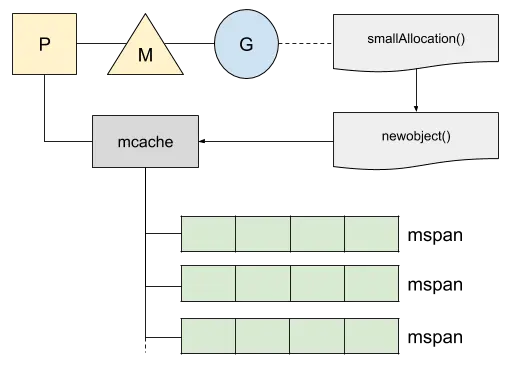
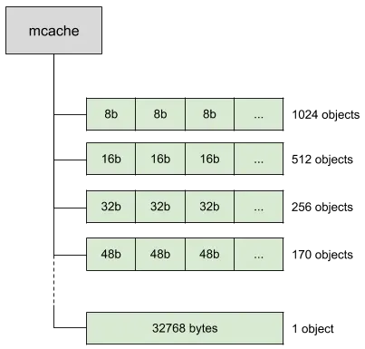
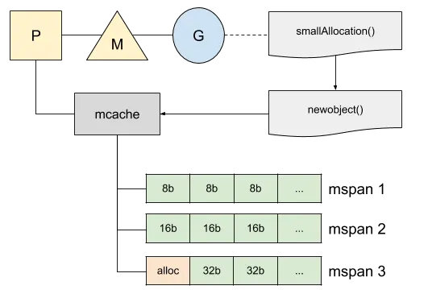
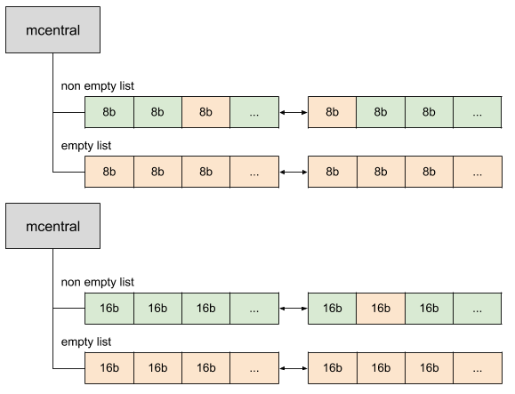
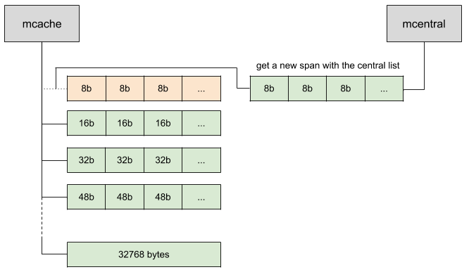
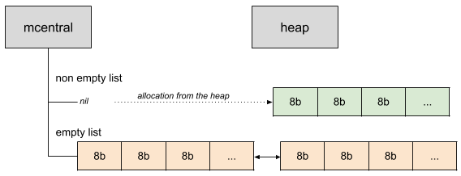
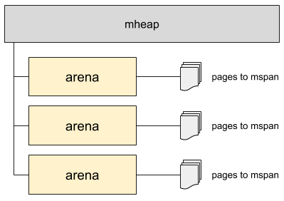
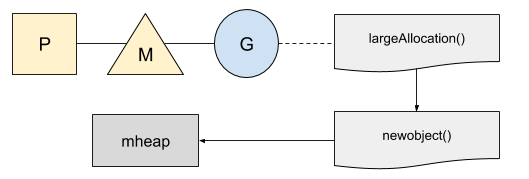

[The Go Memory Model](https://golang.org/ref/mem)
[译：内存管理与内存分配](https://juejin.im/post/5ddcdc5df265da05c33fcad2)
[原文](https://medium.com/a-journey-with-go/go-memory-management-and-allocation-a7396d430f44)

[Go 内存分配器可视化指南](https://github.com/coldnight/go-memory-allocator-visual-guide)

[TOC]
# Go 1.13 内存管理与内存分配
当内存不再被使用时，标准库就会自动执行Go内存管理，即从内存分配到Go自己的集合中（from allocation of the memory to its collection）。
虽然开发人员不用去和这些打交道，但是Go的内存管理做了很多优化以及有很多有趣的概念，所以也值得我们去探讨与学习。

## 堆上的分配 Allocation on the heap
内存管理是在高并发环境以及集成了垃圾回收功能上所设计的。我们来演示一些简单的例子：
```golang
package main

type smallStruct struct {
   a, b int64
   c, d float64
}

func main() {
   smallAllocation()
}

//go:noinline
func smallAllocation() *smallStruct {
   return &smallStruct{}
}

```
注解go:noinline会阻止编译器进行代码优化，否则编译器会将这个函数去除因此就不能触发内存分配。

运行下面命令可以确认Go进行了内存分配
```
go tool compile "-m" main.go

main.go:14:9: &smallStruct literal escapes to heap

```
获取该代码的汇编指令，多亏go tool compile -S main.go,能够精确地展示我们的内存分配情况。
```
0x001d 00029 (main.go:14)   LEAQ   type."".smallStruct(SB), AX
0x0024 00036 (main.go:14)  PCDATA $0, $0
0x0024 00036 (main.go:14)  MOVQ   AX, (SP)
0x0028 00040 (main.go:14)  CALL   runtime.newobject(SB)

```

函数newobject是一个内置函数，用于新分配内存以及代理mallocgc,mallocgc是一个函数，负责在堆上管理他们。在Go中有两种内存分配策略，一个是小内存分配，一个是大内存分配。

## 小内存分配 Samll allocation
对于小内存分配，小于32kb，Go会试图从本地缓存mcache中获取。mcache掌管一系列的内存大小为32kb的内存块，我们称这些内存块为mspan。这些mspan里面包含空闲的，可用于内存分配的插槽块。


每一个线程M会指派一个处理者P以及负责在同一时间最多只处理一个goroutine。当需要分配内存的时候，我们并发的goruntine会使用当前P上本地缓存mspan，去在mspan上获取第一个空闲的可用的插槽块。使用本地缓存不需要涉及锁，因为同一时间只会运行一个goruntine，所以会让内存分配非常高效。

mspan分为从8字节到32k字节的大约70个大小的插槽块，可以用于储存不同大小的对象。


每一个块存在两次：一次是不包含指针的对象，一次是包含指针。这种区分能让垃圾回收更加容易因为他不需要再去扫描那些不包含指针的对象。

在我们之前的例子中，结构体是32字节大小，他会被填入一个32字节大小的插槽块中。



现在，我们会好奇，如果一个块没有足够的空间可以分配的时候会发生什么事情。Go维护了一个mcentral，用于储存mspan中 不同插槽块大小区间的链表集合。下面演示的是一个包含空闲对象以及不包含空闲对象的mcentral。



mcentral维护的是双向链表，每个块都有前一块以及后一块的指向。在非空链表中每个块意味着至少有一个区域是空闲可以用于内存分配的，同时包含很多已经被使用的内存。其实，当垃圾回收清理内存时候，他可以清理一部分的块，这些块会被标记为不再被使用，然后将其放回非空链表中。

当我们想申请的内存已经被用完以后，可以向mcentral申请获取新的插槽块：



当mcentral中的插槽块都已经被用完以后，Go需要一个途径去给mcentral获取新的插槽块，这时我们就会从堆上分配新的插槽块并且链到我们的mcentral上



这个堆会在必要的时候从操作系统中拉取内存。如果需要更多的内存，堆会分配一个大块内存，称为arena，对于64位操作系统会分配64Mb的大内存，其他位数的操作系统会分配4Mb。arena会将内存页与mspan建立对应关系。



## 大内存分配 Large allocation

Go的本地缓存并不维护大内存，所以大于32kb的内存分配，会被四舍五入为一页的大小，然后将也直接分配到堆上。



## 概述图

现在我们已经对Go的内存管理与内存分配有了一个比较大概的理解了。我们将之前每个涉及到的部分整合起来，如下图所示：


内存分配器最初是基于TCMalloc，TCMalloc是为Google创建的并发环境优化的内存分配器。 [TCMalloc](http://goog-perftools.sourceforge.net/doc/tcmalloc.html)的文档值得一读； 你还能在里面找到一些前面我们所提及的一些专业术语的概念。