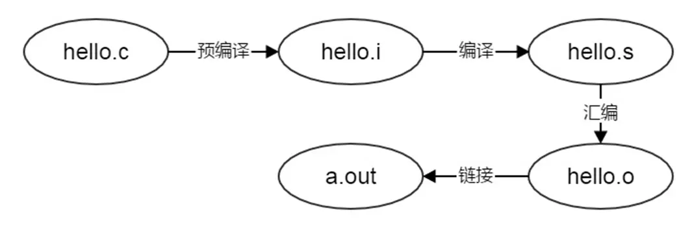
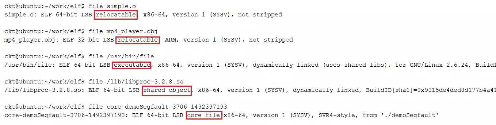
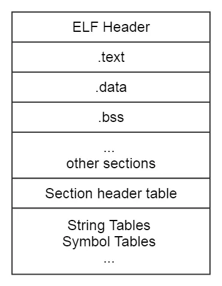
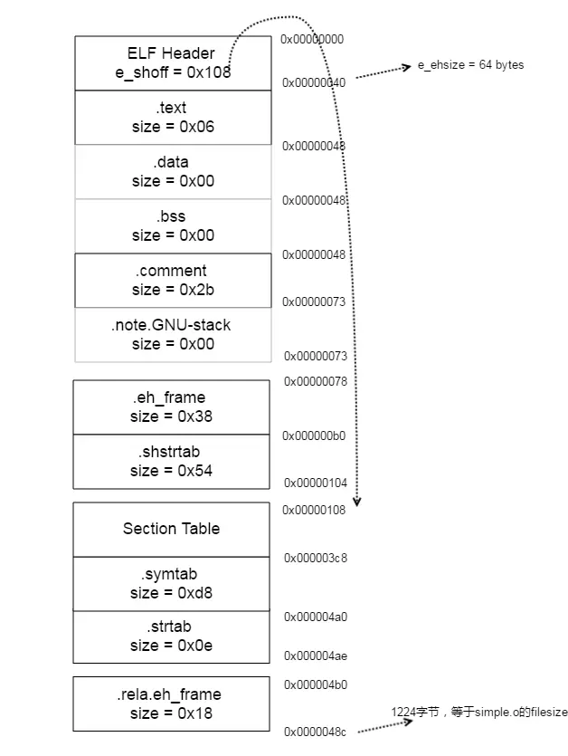
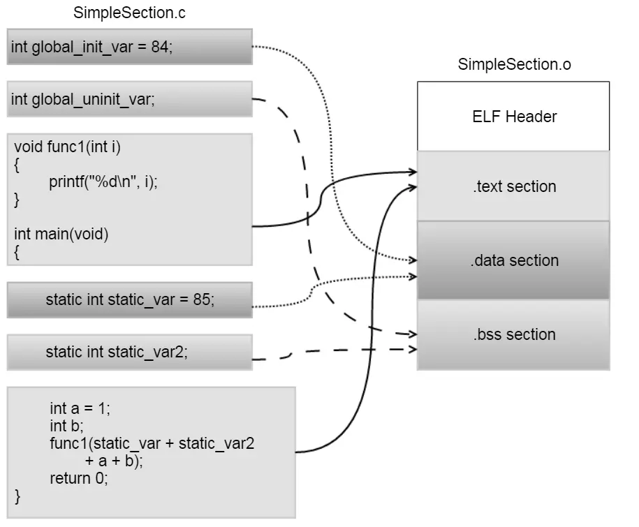
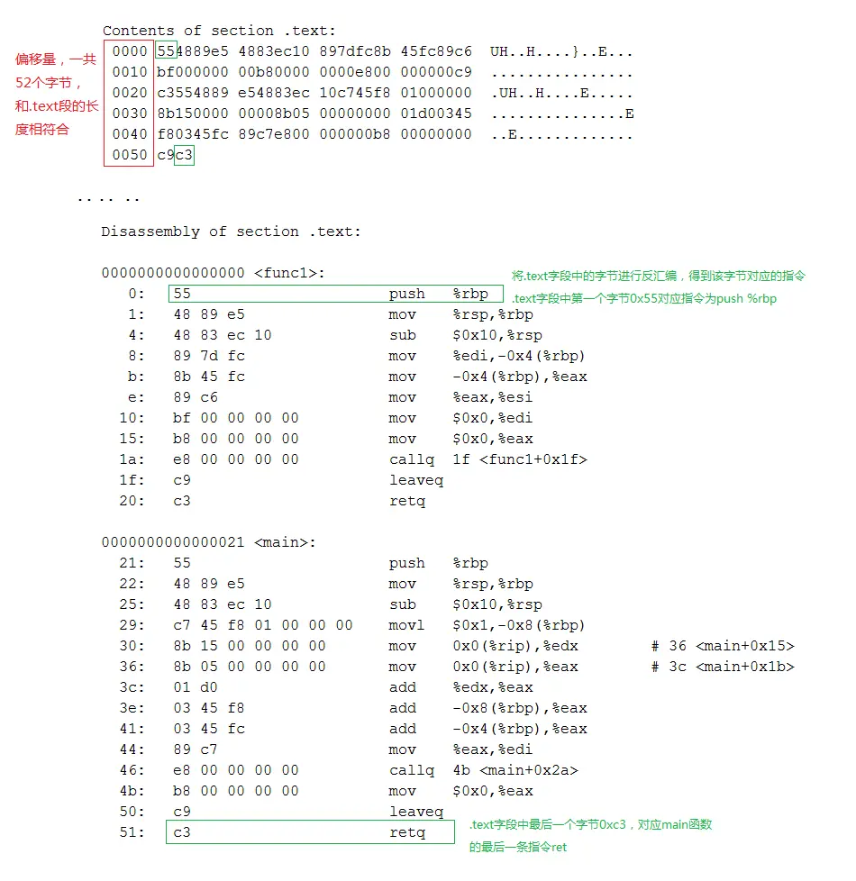
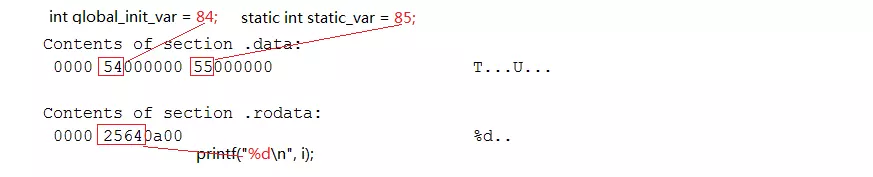
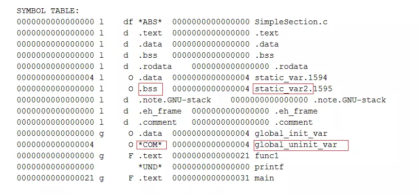
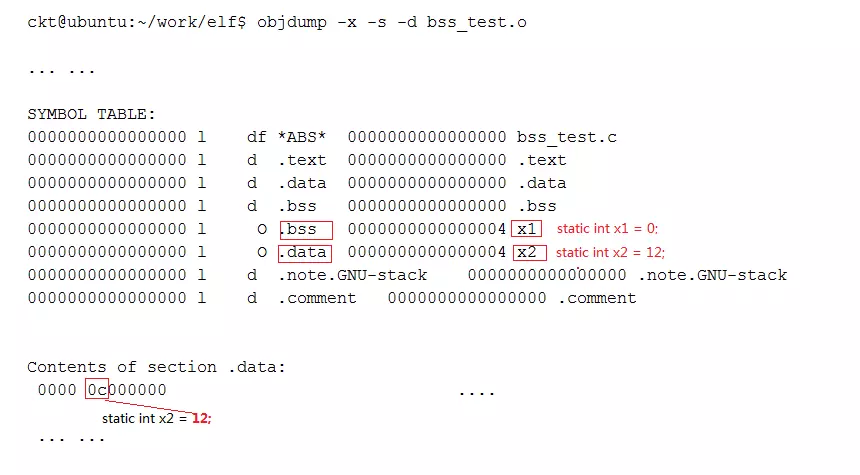

[TOC]
# 使用readelf和objdump解析目标文件
## 引言
本文是对程序员的自我修养：链接、装载与库中第3章的实践总结(和结构相关的示意图都是用Gliffy Diagrams画的🤓)，通过使用工具readelf、objdump对目标文件进行解析，学习目标文件的结构。

## 1. 目标文件
### 1.1 目标文件的定义
编译器编译源代码后生成的文件叫做目标文件。在Linux下，使用gcc -c xxxx.c编译生成.o文件。
```c
$ gcc -v simple.c
$ ls
simple.c simeple.o
```
### 1.2 编译过程回顾

目标文件的文件类型为ELF，在Linux下对应文件后缀为.o的文件，Window下对应文件后缀为.obj的文件。使用file命令可以查看到.o和.obj文件均为ELF类型。
```
[root@etcd-node02 go]# file go
go: ELF 64-bit LSB executable, x86-64, version 1 (SYSV), statically linked, not stripped
```
目标文件只是ELF文件的可重定位文件(Relocatable file)，ELF文件一共有4种类型：Relocatable file、Executable file、Shared object file和[Core Dump file](http://hutaow.com/blog/2013/10/25/linux-core-dump/)


### 示例
在Linux下，使用命令 gcc -c xxxx.c就可以编译生成.o文件
```
ckt@ubuntu:~/work/elf$ gcc -c simple.c 
ckt@ubuntu:~/work/elf$ ls
simple.c  simple.o
```
在 simple.c中，我们只加入了下面这一个函数fun，函数内容为空
```
void fun()
{

}
```
使用UltraEdit将simple.o打开，里面的内容有机器指令代码、数据等，我们的程序就是由这些字节组成的。对于程序员来说，使用高级语言(C/C++，Java等)实现的代码是最容易阅读和理解的，但是对于计算机来说，它只懂得机器语言，它更喜欢二进制，将0转换为低电平，1转换成高电平，这样一个程序就可以跑起来了。

我们可以使用工具readelf 和objdump对目标文件simple.o进行分析。为了加深对目标文件的理解，在使用readelf & objdump进行前，需要先要了解ELF文件的结构。
```
00000000h: 7F 45 4C 46 02 01 01 00 00 00 00 00 00 00 00 00 ; �ELF............
00000010h: 01 00 3E 00 01 00 00 00 00 00 00 00 00 00 00 00 ; ..>.............
00000020h: 00 00 00 00 00 00 00 00 08 01 00 00 00 00 00 00 ; ................
00000030h: 00 00 00 00 40 00 00 00 00 00 40 00 0B 00 08 00 ; ....@.....@.....
00000040h: 55 48 89 E5 5D C3 00 00 00 47 43 43 3A 20 28 55 ; UH夊]?..GCC: (U
00000050h: 62 75 6E 74 75 2F 4C 69 6E 61 72 6F 20 34 2E 36 ; buntu/Linaro 4.6
00000060h: 2E 33 2D 31 75 62 75 6E 74 75 35 29 20 34 2E 36 ; .3-1ubuntu5) 4.6
00000070h: 2E 33 00 00 00 00 00 00 14 00 00 00 00 00 00 00 ; .3..............
00000080h: 01 7A 52 00 01 78 10 01 1B 0C 07 08 90 01 00 00 ; .zR..x......?..
00000090h: 1C 00 00 00 1C 00 00 00 00 00 00 00 06 00 00 00 ; ................
000000a0h: 00 41 0E 10 86 02 43 0D 06 41 0C 07 08 00 00 00 ; .A..?C..A......
000000b0h: 00 2E 73 79 6D 74 61 62 00 2E 73 74 72 74 61 62 ; ..symtab..strtab
000000c0h: 00 2E 73 68 73 74 72 74 61 62 00 2E 74 65 78 74 ; ..shstrtab..text
000000d0h: 00 2E 64 61 74 61 00 2E 62 73 73 00 2E 63 6F 6D ; ..data..bss..com
000000e0h: 6D 65 6E 74 00 2E 6E 6F 74 65 2E 47 4E 55 2D 73 ; ment..note.GNU-s
000000f0h: 74 61 63 6B 00 2E 72 65 6C 61 2E 65 68 5F 66 72 ; tack..rela.eh_fr
00000100h: 61 6D 65 00 00 00 00 00 00 00 00 00 00 00 00 00 ; ame.............
00000110h: 00 00 00 00 00 00 00 00 00 00 00 00 00 00 00 00 ; ................
00000120h: 00 00 00 00 00 00 00 00 00 00 00 00 00 00 00 00 ; ................
00000130h: 00 00 00 00 00 00 00 00 00 00 00 00 00 00 00 00 ; ................
00000140h: 00 00 00 00 00 00 00 00 1B 00 00 00 01 00 00 00 ; ................
00000150h: 06 00 00 00 00 00 00 00 00 00 00 00 00 00 00 00 ; ................
00000160h: 40 00 00 00 00 00 00 00 06 00 00 00 00 00 00 00 ; @...............
00000170h: 00 00 00 00 00 00 00 00 04 00 00 00 00 00 00 00 ; ................
00000180h: 00 00 00 00 00 00 00 00 21 00 00 00 01 00 00 00 ; ........!.......
00000190h: 03 00 00 00 00 00 00 00 00 00 00 00 00 00 00 00 ; ................
000001a0h: 48 00 00 00 00 00 00 00 00 00 00 00 00 00 00 00 ; H...............
000001b0h: 00 00 00 00 00 00 00 00 04 00 00 00 00 00 00 00 ; ................
000001c0h: 00 00 00 00 00 00 00 00 27 00 00 00 08 00 00 00 ; ........'.......
000001d0h: 03 00 00 00 00 00 00 00 00 00 00 00 00 00 00 00 ; ................
000001e0h: 48 00 00 00 00 00 00 00 00 00 00 00 00 00 00 00 ; H...............
000001f0h: 00 00 00 00 00 00 00 00 04 00 00 00 00 00 00 00 ; ................
00000200h: 00 00 00 00 00 00 00 00 2C 00 00 00 01 00 00 00 ; ........,.......
00000210h: 30 00 00 00 00 00 00 00 00 00 00 00 00 00 00 00 ; 0...............
00000220h: 48 00 00 00 00 00 00 00 2B 00 00 00 00 00 00 00 ; H.......+.......
00000230h: 00 00 00 00 00 00 00 00 01 00 00 00 00 00 00 00 ; ................
00000240h: 01 00 00 00 00 00 00 00 35 00 00 00 01 00 00 00 ; ........5.......
00000250h: 00 00 00 00 00 00 00 00 00 00 00 00 00 00 00 00 ; ................
00000260h: 73 00 00 00 00 00 00 00 00 00 00 00 00 00 00 00 ; s...............
00000270h: 00 00 00 00 00 00 00 00 01 00 00 00 00 00 00 00 ; ................
00000280h: 00 00 00 00 00 00 00 00 4A 00 00 00 01 00 00 00 ; ........J.......
00000290h: 02 00 00 00 00 00 00 00 00 00 00 00 00 00 00 00 ; ................
000002a0h: 78 00 00 00 00 00 00 00 38 00 00 00 00 00 00 00 ; x.......8.......
000002b0h: 00 00 00 00 00 00 00 00 08 00 00 00 00 00 00 00 ; ................
000002c0h: 00 00 00 00 00 00 00 00 45 00 00 00 04 00 00 00 ; ........E.......
000002d0h: 00 00 00 00 00 00 00 00 00 00 00 00 00 00 00 00 ; ................
000002e0h: B0 04 00 00 00 00 00 00 18 00 00 00 00 00 00 00 ; ?..............
000002f0h: 09 00 00 00 06 00 00 00 08 00 00 00 00 00 00 00 ; ................
00000300h: 18 00 00 00 00 00 00 00 11 00 00 00 03 00 00 00 ; ................
00000310h: 00 00 00 00 00 00 00 00 00 00 00 00 00 00 00 00 ; ................
00000320h: B0 00 00 00 00 00 00 00 54 00 00 00 00 00 00 00 ; ?......T.......
00000330h: 00 00 00 00 00 00 00 00 01 00 00 00 00 00 00 00 ; ................
00000340h: 00 00 00 00 00 00 00 00 01 00 00 00 02 00 00 00 ; ................
00000350h: 00 00 00 00 00 00 00 00 00 00 00 00 00 00 00 00 ; ................
00000360h: C8 03 00 00 00 00 00 00 D8 00 00 00 00 00 00 00 ; ?......?......
00000370h: 0A 00 00 00 08 00 00 00 08 00 00 00 00 00 00 00 ; ................
00000380h: 18 00 00 00 00 00 00 00 09 00 00 00 03 00 00 00 ; ................
00000390h: 00 00 00 00 00 00 00 00 00 00 00 00 00 00 00 00 ; ................
000003a0h: A0 04 00 00 00 00 00 00 0E 00 00 00 00 00 00 00 ; ?..............
000003b0h: 00 00 00 00 00 00 00 00 01 00 00 00 00 00 00 00 ; ................
000003c0h: 00 00 00 00 00 00 00 00 00 00 00 00 00 00 00 00 ; ................
000003d0h: 00 00 00 00 00 00 00 00 00 00 00 00 00 00 00 00 ; ................
000003e0h: 01 00 00 00 04 00 F1 FF 00 00 00 00 00 00 00 00 ; ......?........
000003f0h: 00 00 00 00 00 00 00 00 00 00 00 00 03 00 01 00 ; ................
00000400h: 00 00 00 00 00 00 00 00 00 00 00 00 00 00 00 00 ; ................
00000410h: 00 00 00 00 03 00 02 00 00 00 00 00 00 00 00 00 ; ................
00000420h: 00 00 00 00 00 00 00 00 00 00 00 00 03 00 03 00 ; ................
00000430h: 00 00 00 00 00 00 00 00 00 00 00 00 00 00 00 00 ; ................
00000440h: 00 00 00 00 03 00 05 00 00 00 00 00 00 00 00 00 ; ................
00000450h: 00 00 00 00 00 00 00 00 00 00 00 00 03 00 06 00 ; ................
00000460h: 00 00 00 00 00 00 00 00 00 00 00 00 00 00 00 00 ; ................
00000470h: 00 00 00 00 03 00 04 00 00 00 00 00 00 00 00 00 ; ................
00000480h: 00 00 00 00 00 00 00 00 0A 00 00 00 12 00 01 00 ; ................
00000490h: 00 00 00 00 00 00 00 00 06 00 00 00 00 00 00 00 ; ................
000004a0h: 00 73 69 6D 70 6C 65 2E 63 00 66 75 6E 00 00 00 ; .simple.c.fun...
000004b0h: 20 00 00 00 00 00 00 00 02 00 00 00 02 00 00 00 ;  ...............
000004c0h: 00 00 00 00 00 00 00 00                         ; ........
```
## ELF格式规范
在计算机科学中，是一种用于二进制文件、可执行文件、目标代码、共享库和核心转储格式文件。
**.exe 不是elf文件格式而是PE文件格式，要想查看PE文件 用可以StudyPE+ x64.exe查看**

现在PC平台流行的可执行文件格式（Executable）主要是Windows下的[PE（Portable Executable）](https://www.cnblogs.com/qftm/p/11611038.html)和Linux的ELF（Executable Linkable Format），它们都是COFF（Common file format）格式的变种。
不光是可执行文件（Windows的.exe和Linux下的ELF可执行文件）按照可执行文件格式存储。动态链接库（DLL，Dynamic Linking Library）（`Windows的.dll和Linux的.so`）及静态链接库（Static Linking Library）（Windows的.lib和Linux的.a）文件都按照可执行文件格式存储。它们在Windows下都按照PE-COFF格式存储，Linux下按照ELF格式存储。
什么又是COFF格式呢？
COFF是由Unix System V Release 3首先提出并且使用的格式规范，后来微软公司基于COFF格式，制定了PE格式标准，并将其用于当时的Windows NT系统。System V Release 4在COFF的基础上引入了ELF格式，目前流行的Linux系统也以ELF作为基本可执行文件格式。这也就是为什么目前PE和ELF如此相似的主要原因，因为它们都是源于同一种可执行文件格式COFF。

Unix最早的可执行文件格式为a.out格式，它的设计非常地简单，以至于后来共享库这个概念出现的时候，a.out格式就变得捉襟见肘了。于是人们设计了COFF格式来解决这些问题，这个设计非常通用，以至于COFF的继承者到目前还在被广泛地使用。

COFF的主要贡献是在目标文件里面引入了“段”的机制，不同的目标文件可以拥有不同数量及不同类型的“段”。另外，它还定义了调试数据格式。

目标文件有三种类型：
1. 可重定位文件（Relocatable File） 包含适合于与其他目标文件链接来创建可执行文件或者共享目标文件的代码和数据。 (Linux的*.o 文件 Windows的 *.obj文件)
2. 可执行文件（Executable File） 包含适合于执行的一个程序，此文件规定了 exec() 如何创建一个程序的进程映像。（比如/bin/bash文件；Windows的*.exe）
3. 共享目标文件（Shared Object File） 包含可在两种上下文中链接的代码和数据。首先链接编辑器可以将它和其它可重定位文件和共享目标文件一起处理，生成另外一个目标文件。其次，动态链接器（Dynamic Linker）可能将它与某个可执行文件以及其它共享目标一起组合，创建进程映像。
目标文件全部是程序的二进制表示，目的是直接在某种处理器上直接执行（`Linux的.so，如/lib/ glibc-2.5.so`；Windows的DLL

### ELF文件结构

和[class文件](https://www.jianshu.com/p/26f95965320e)类似，ELF文件存放数据的格式也是固定的，计算机在解析目标文件时，就是按照它每个字段的数据结构进行逐字解析的。ELF文件结构信息定义在/usr/include/elf.h中，整个ELF文件的结构如下图：


ELF文件由4部分组成，分别是ELF头（ELF header）、程序头表（Program header table）、节（Section）和节头表（Section header table）。实际上，一个文件中不一定包含全部内容，而且他们的位置也未必如同所示这样安排，只有ELF头的位置是固定的，其余各部分的位置、大小等信息由ELF头中的各项值来决定。

### ELF Header

ELF Header是ELF文件的第一部分，64 bit的ELF文件头的结构体如下：
```c
typedef struct
{
  unsigned char e_ident[EI_NIDENT]; /* Magic number and other info */
  Elf64_Half    e_type;         /* Object file type */
  Elf64_Half    e_machine;      /* Architecture */
  Elf64_Word    e_version;      /* Object file version */
  Elf64_Addr    e_entry;        /* Entry point virtual address */
  Elf64_Off e_phoff;        /* Program header table file offset */
  Elf64_Off e_shoff;        /* Section header table file offset */
  Elf64_Word    e_flags;        /* Processor-specific flags */
  Elf64_Half    e_ehsize;       /* ELF header size in bytes */
  Elf64_Half    e_phentsize;        /* Program header table entry size */
  Elf64_Half    e_phnum;        /* Program header table entry count */
  Elf64_Half    e_shentsize;        /* Section header table entry size */
  Elf64_Half    e_shnum;        /* Section header table entry count */
  Elf64_Half    e_shstrndx;     /* Section header string table index */
} Elf64_Ehdr;
```
接下来我们会使用到第一个分析目标文件的工具readelf，通过man readelf命令，我们可以查到readelf的作用就是用来显示ELF文件的信息
```
DESCRIPTION
   readelf displays information about one or more ELF format object files. 
```
使用readelf -h simple.o来进行对Header的解析，通过man readelf命令同样可以查询到对-h参数的说明，
-h用来显示ELF header的相关信息。
```
OPTIONS
   -h
   --file-header
       Displays the information contained in the ELF header at the start of the file.
```

Header中主要存放的是一些基本信息，通过Header中的信息，我们可以确定后面其他字段的大小和起始地址，通常比较关心的部分是：ELF文件类型、是32bit还是64bit、Header部分大小、Section部分大小和拥有Section的个数等。

结合Elf64_Ehdr来看，对应解析结果如下：


### Section
完成了对Header的解析，再接着分析Section部分，Section对应结构体如下：
```
typedef struct
{
  Elf64_Word  sh_name;    /* Section name (string tbl index) */
  Elf64_Word  sh_type;    /* Section type */
  Elf64_Xword sh_flags;   /* Section flags */
  Elf64_Addr  sh_addr;    /* Section virtual addr at execution */
  Elf64_Off sh_offset;    /* Section file offset */
  Elf64_Xword sh_size;    /* Section size in bytes */
  Elf64_Word  sh_link;    /* Link to another section */
  Elf64_Word  sh_info;    /* Additional section information */
  Elf64_Xword sh_addralign;   /* Section alignment */
  Elf64_Xword sh_entsize;   /* Entry size if section holds table */
} Elf64_Shdr;
```
Section部分主要存放的是机器指令代码和数据，执行命令readelf -S -W simple.o对Section部分的解析，解析结果和Elf64_Shdr也是一一对应的。
```
ckt@ubuntu:~/work/elf$ readelf -S -W simple.o
There are 11 section headers, starting at offset 0x108:

Section Headers:
  [Nr] Name              Type            Address          Off    Size   ES Flg Lk Inf Al
  [ 0]                   NULL            0000000000000000 000000 000000 00      0   0  0
  [ 1] .text             PROGBITS        0000000000000000 000040 000006 00  AX  0   0  4
  [ 2] .data             PROGBITS        0000000000000000 000048 000000 00  WA  0   0  4
  [ 3] .bss              NOBITS          0000000000000000 000048 000000 00  WA  0   0  4
  [ 4] .comment          PROGBITS        0000000000000000 000048 00002b 01  MS  0   0  1
  [ 5] .note.GNU-stack   PROGBITS        0000000000000000 000073 000000 00      0   0  1
  [ 6] .eh_frame         PROGBITS        0000000000000000 000078 000038 00   A  0   0  8
  [ 7] .rela.eh_frame    RELA            0000000000000000 0004b0 000018 18      9   6  8
  [ 8] .shstrtab         STRTAB          0000000000000000 0000b0 000054 00      0   0  1
  [ 9] .symtab           SYMTAB          0000000000000000 0003c8 0000d8 18     10   8  8
  [10] .strtab           STRTAB          0000000000000000 0004a0 00000e 00      0   0  1
Key to Flags:
  W (write), A (alloc), X (execute), M (merge), S (strings), l (large)
  I (info), L (link order), G (group), T (TLS), E (exclude), x (unknown)
  O (extra OS processing required) o (OS specific), p (processor specific)
```

对于这部分内容，通常我们比较的Section是.text（存放代码）、.data（存放全局静态变量和局部静态变量）和.bss（存未初始化的全局变量和局部静态变量） ，在后面会对这几个段分别分进行解析。

根据readelf -S -W simple.o的输出结果，我们可以算出整个simple.o的组成部分和起始地址，使用ls -l 命令查看simple.o的大小，和simple.o结束地址0x0000048c是吻合的。

```
ckt@ubuntu:~/work/elf$ ls -l simple.o
-rw-rw-r-- 1 ckt ckt 1224 Apr 12 18:42 simple.o
```


## 解析目标文件
分析完ELF文件结构，接着来解析一个目标文件。首先，准备好源码SimpleSection.c，执行命令gcc -c SimpleSection.c生成目标文件SimpleSection.o。
```
int printf(const char* format, ...);

int global_init_var = 84;
int global_uninit_var;

void func1(int i)
{
    printf("%d\n", i);
}

int main(void)
{
    static int static_var = 85;
    static int static_var2;

    int a = 1;
    int b;
    func1(static_var + static_var2 + a + b);
    return 0;
}
```
在这部分，我们会使用另外一个命令objdump，使用man objdump查看该命令，objdump是用来显示目标文件相关信息的。
```
DESCRIPTION
   objdump displays information about one or more object files. 
```

### 查看目标文件的Section

执行命令objdump -h SimpleSection.o对Section部分进行解析，我们可以得到每个段的大小
```
[root@etcd-node02 go]# objdump -h go.exe

go.exe:     file format pei-x86-64

Sections:
Idx Name          Size      VMA               LMA               File off  Algn
  0 .text         000997d0  0000000000401000  0000000000401000  00000600  2**4
                  CONTENTS, ALLOC, LOAD, READONLY, CODE, DATA
  1 .rdata        000c648a  000000000049b000  000000000049b000  00099e00  2**4
                  CONTENTS, ALLOC, LOAD, READONLY, DATA
  2 .data         00013c00  0000000000562000  0000000000562000  00160400  2**4
                  CONTENTS, ALLOC, LOAD, DATA
  3 .debug_abbrev 000001e6  0000000000597000  0000000000597000  00174000  2**2
                  CONTENTS, READONLY, DEBUGGING
  4 .debug_line   0002a088  0000000000598000  0000000000598000  00174200  2**2
                  CONTENTS, READONLY, DEBUGGING
  5 .debug_frame  00013bb4  00000000005af000  00000000005af000  0018ac00  2**2
                  CONTENTS, READONLY, DEBUGGING
  6 .debug_pubnames 00004fa6  00000000005b6000  00000000005b6000  00191000  2**2
                  CONTENTS, READONLY, DEBUGGING
  7 .debug_pubtypes 0000cca5  00000000005b8000  00000000005b8000  00192e00  2**2
                  CONTENTS, READONLY, DEBUGGING
  8 .debug_gdb_scripts 0000002c  00000000005bc000  00000000005bc000  00196200  2**0
                  CONTENTS, READONLY, DEBUGGING
  9 .debug_info   0007660a  00000000005bd000  00000000005bd000  00196400  2**2
                  CONTENTS, READONLY, DEBUGGING
 10 .debug_loc    00081376  00000000005ec000  00000000005ec000  001c4a00  2**2
                  CONTENTS, READONLY, DEBUGGING
 11 .debug_ranges 00029a00  0000000000602000  0000000000602000  001daa00  2**2
                  CONTENTS, READONLY, DEBUGGING
 12 .idata        000003b4  000000000060a000  000000000060a000  001e2800  2**2
                  CONTENTS, ALLOC, LOAD, DATA
 13 .symtab       0001fa54  000000000060b000  000000000060b000  001e2c00  2**2
                  CONTENTS, READONLY
[root@etcd-node02 go]# objdump -h go

go:     file format elf64-x86-64

Sections:
Idx Name          Size      VMA               LMA               File off  Algn
  0 .text         000515c0  0000000000401000  0000000000401000  00001000  2**4
                  CONTENTS, ALLOC, LOAD, READONLY, CODE
  1 .rodata       0003079e  0000000000453000  0000000000453000  00053000  2**5
                  CONTENTS, ALLOC, LOAD, READONLY, DATA
  2 .typelink     0000077c  0000000000483960  0000000000483960  00083960  2**5
                  CONTENTS, ALLOC, LOAD, READONLY, DATA
  3 .itablink     00000008  00000000004840e0  00000000004840e0  000840e0  2**3
                  CONTENTS, ALLOC, LOAD, READONLY, DATA
  4 .gosymtab     00000000  00000000004840e8  00000000004840e8  000840e8  2**0
                  CONTENTS, ALLOC, LOAD, READONLY, DATA
  5 .gopclntab    0003d7d8  0000000000484100  0000000000484100  00084100  2**5
                  CONTENTS, ALLOC, LOAD, READONLY, DATA
  6 .go.buildinfo 00000020  00000000004c2000  00000000004c2000  000c2000  2**4
                  CONTENTS, ALLOC, LOAD, DATA
  7 .noptrdata    00000be8  00000000004c2020  00000000004c2020  000c2020  2**5
                  CONTENTS, ALLOC, LOAD, DATA
  8 .data         00001e90  00000000004c2c20  00000000004c2c20  000c2c20  2**5
                  CONTENTS, ALLOC, LOAD, DATA
  9 .bss          0001b470  00000000004c4ac0  00000000004c4ac0  000c4ac0  2**5
                  ALLOC
 10 .noptrbss     00002728  00000000004dff40  00000000004dff40  000dff40  2**5
                  ALLOC
 11 .zdebug_abbrev 000001e6  00000000004e3000  00000000004e3000  000c5000  2**3
                  CONTENTS, READONLY, DEBUGGING
 12 .zdebug_line  0001896f  00000000004e3119  00000000004e3119  000c5119  2**3
                  CONTENTS, READONLY, DEBUGGING
 13 .zdebug_frame 0000ada4  00000000004f1482  00000000004f1482  000d3482  2**3
                  CONTENTS, READONLY, DEBUGGING
 14 .zdebug_pubnames 000013f3  00000000004f5040  00000000004f5040  000d7040  2**3
                  CONTENTS, READONLY, DEBUGGING
 15 .zdebug_pubtypes 00008df2  00000000004f589a  00000000004f589a  000d789a  2**3
                  CONTENTS, READONLY, DEBUGGING
 16 .debug_gdb_scripts 0000002c  00000000004f7bdc  00000000004f7bdc  000d9bdc  2**0
                  CONTENTS, READONLY, DEBUGGING
 17 .zdebug_info  00042935  00000000004f7c08  00000000004f7c08  000d9c08  2**3
                  CONTENTS, READONLY, DEBUGGING
 18 .zdebug_loc   0004de5f  00000000005131b1  00000000005131b1  000f51b1  2**3
                  CONTENTS, READONLY, DEBUGGING
 19 .zdebug_ranges 000179b0  000000000052048e  000000000052048e  0010248e  2**3
                  CONTENTS, READONLY, DEBUGGING
 20 .note.go.buildid 00000064  0000000000400f9c  0000000000400f9c  00000f9c  2**2
                  CONTENTS, ALLOC, LOAD, READONLY, DATA

```

我们的代码是存放到.text中，已初始化全局变量和局部静态变量存放在.data中，未初始化全局变量和局部静态变量存放在.bss中


### 代码段
执行命令objdump -s -d SimpleSection.o对代码段(.text)的解析结果如下：


### 数据段和只读数据段
执行命令objdump -s -d SimpleSection.o对数据段和只读数据段解析结果如下：


## BSS段
执行命令objdump -x -s -d SimpleSection.o打印出目标文件的符号表，通过符号表我们可以知道各个变量的存放位置，只有未初始化的局部静态变量static_var2被放到了.bss段，而global_uninit_var被放入了comment段



另外，被初始化为0的静态变量也会被放入.bss段，因为未初始变量的值也是0，经过优化后被放入.bss段，这样可以节省磁盘空间，因为.bss不占磁盘空间

例如，下面的代码中x1会被放入.bss段，而x2被放入.data段

```
static int x1 = 0;
static int x2 = 12;
```
