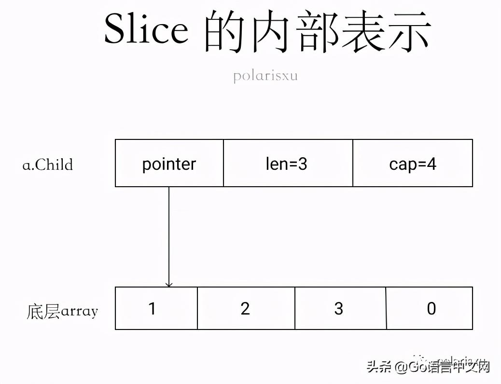
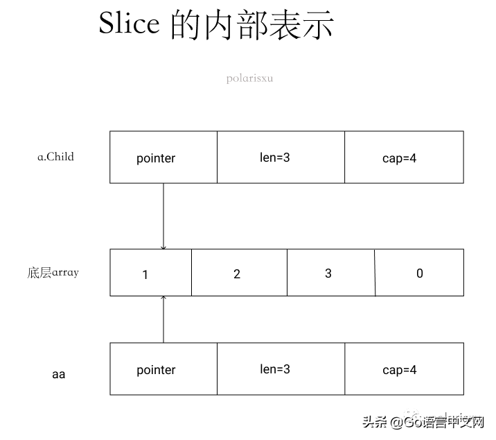
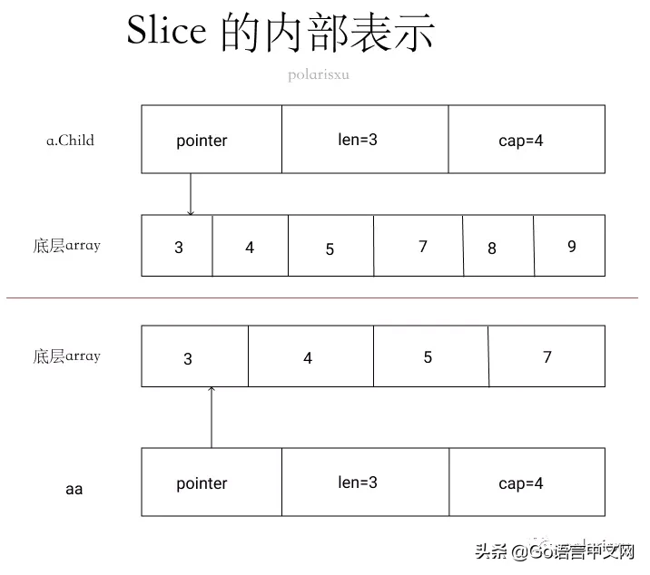

[Go语言中文网公开课-切片实现.pdf](../files/Go语言中文网公开课-切片实现.pdf)
[源码](https://github.com/openjw/genter/blob/master/x/slice/slice.go)

深度解密Go语言之Slice
https://mp.weixin.qq.com/s?__biz=MjM5MDUwNTQwMQ==&mid=2257483743&idx=1&sn=af5059b90933bef5a7c9d491509d56d9&scene=19#wechat_redirect

## 惊！一道关于 json和 slice的题难倒了 80% 的人
https://www.toutiao.com/i6885503576911643150/

```go
package main

import (
 "encoding/json"
 "fmt"
)

type AutoGenerated struct {
 Age   int    `json:"age"`
 Name  string `json:"name"`
 Child []int  `json:"child"`
}

func main() {
 jsonStr1 := `{"age": 14,"name": "potter", "child":[1,2,3]}`
 a := AutoGenerated{}
 json.Unmarshal([]byte(jsonStr1), &a)
 aa := a.Child
 fmt.Println(aa)
 jsonStr2 := `{"age": 12,"name": "potter", "child":[3,4,5,7,8,9]}`
 json.Unmarshal([]byte(jsonStr2), &a)
 fmt.Println(aa)
}
```
输出：
```
[1 2 3]
[3 4 5]
```

### 1、json 解析
关于 json.Unmarshal 的文档，不少人可能没认真看。借此机会正好一起看下。https://docs.studygolang.com/pkg/encoding/json/#Unmarshal。

```
Unmarshal 解析 JSON 编码的数据，并将结果存入 v 指向的值。如果 v 为 nil 或不是指针，则 Unmarshal 返回 InvalidUnmarshalError。

Unmarshal 和 Marshal 做相反的操作，必要时申请 map、slice 或指针，有如下的附加规则：

为了将 JSON 数据解码写入一个指针，Unmarshal 首先处理 JSON 数据为 JSON 字面值 null 的情况。此时，Unmarshal 会将指针设置为 nil。否则，Unmarshal 会将 JSON 数据解码为指针所指向的值。如果指针为 nil，则 Unmarshal 为其分配一个新值并使指针指向它。

为了将 JSON 数据解码为实现 Unmarshaler 接口的值，Unmarshal 调用该值的 UnmarshalJSON 方法，包括当输入为 JSON null 时。否则，如果该值实现 encoding.TextUnmarshaler 且输入是带引号的 JSON 字符串，则 Unmarshal 会使用该字符串的未加引号形式来调用该值的 UnmarshalText 方法。

要将 json 数据解码写入一个结构体，函数会匹配输入对象的键和 Marshal 使用的键（结构体字段名或者它的标签指定的键名），优先选择精确的匹配，但也接受大小写不敏感的匹配；

为了将 JSON 数据解码到结构中，Unmarshal 将传入的对象键与 Marshal 使用的键（结构字段名称或其 Tag）进行匹配，希望使用精确匹配，但还接受不区分大小写的匹配。默认情况下，没有相应结构字段的对象键将被忽略（有关替代方法，请参见 Decoder.DisallowUnknownFields）。

要将 JSON 数据解码写入一个接口类型值，Unmarshal 将其中之一存储在接口值中：

Bool 对应JSON布尔类型
float64 对应JSON数字类型
string 对应JSON字符串类型
[]interface{} 对应JSON数组
map[string]interface{} 对应JSON对象
nil 对应JSON的null

要将一个 JSON 数组解码到切片（slice）中，Unmarshal 将切片长度重置为零，然后将每个元素 append 到切片中。特殊情况，如果将一个空的 JSON 数组解码到一个切片中，Unmarshal 会用一个新的空切片替换该切片。

为了将 JSON 数组解码为 Go 数组，Unmarshal 将 JSON 数组元素解码为对应的 Go 数组元素。如果 Go 数组长度小于 JSON 数组，则其他 JSON 数组元素将被丢弃。如果 JSON 数组长度小于 Go 数组，则将其他 Go 数组元素会设置为零值。

要将 JSON 对象解码到 map 中，Unmarshal 首先要建立将使用的 map。如果 map 为零，Unmarshal 会分配一个新 map。否则，Unmarshal 会重用现有 map，保留现有条目（item）。然后，Unmarshal 将来自 JSON 对象的键/值对存储到 map 中。map 的键类型必须是任意字符串类型、整数或实现了 json.Unmarshaler 或 encoding.TextUnmarshaler 接口的类型。

如果 JSON 值不适用于给定的目标类型，或者 JSON 数字写入目标类型时溢出，则 Unmarshal 会跳过该字段并尽最大可能完成解析。如果没有遇到更多的严重错误，则 Unmarshal 返回一个 UnmarshalTypeError 来描述最早的此类错误。但无法确保有问题的字段之后的所有其余字段都将被解析到目标对象中。

JSON 的 null 值解码为 Go 的接口、指针、切片时会将它们设为 nil，因为 null 在 JSON 里一般表示“不存在”。因此将 JSON null 解码到任何其他 Go 类型中不会影响该值，并且不会产生任何错误。

解析带引号的字符串时，无效的 UTF-8 或无效的 UTF-16 不会被视为错误。而是将它们替换为 Unicode 字符 U+FFFD。
```
跟此题相关的是下面这点：
> 要将一个 JSON 数组解码到切片（slice）中，Unmarshal 将切片长度重置为零，然后将每个元素 append 到切片中。特殊情况，如果将一个空的 JSON 数组解码到一个切片中，Unmarshal 会用一个新的空切片替换该切片。

因此第一次解析时，a.Child 是 [1 2 3]，aa 自然也是 [1 2 3]。第二次解析时，a.Child 的长度会被重置为 0，也就说里面的值会被重置（比如 a.Child = a.Child[:0]），然后将 3,4,5,7,8,9 一个个 append 到 a.Child 中。

而 append 操作可能会涉及到底层数组的扩容：当原来的容量不足时，会进行扩容。怎么扩容的呢？目前的版本（Go1.15.x）按照如下规则扩容：（扩容规则依赖具体实现，不同版本可能不一样）

```go
// Get element of array, growing if necessary.
if v.Kind() == reflect.Slice {
  // Grow slice if necessary
  if i >= v.Cap() {
    newcap := v.Cap() + v.Cap()/2
    if newcap < 4 {
      newcap = 4
    }
    newv := reflect.MakeSlice(v.Type(), v.Len(), newcap)
    reflect.Copy(newv, v)
    v.Set(newv)
  }
  if i >= v.Len() {
    v.SetLen(i + 1)
  }
}
```
- 初始容量最小为 4；
- 之后按照容量的一半扩容，所以容量是 4、6、9、13、19...

有人问上题为什么 aa 的容量是 4，这里正好解释了。

因此，第一次解析，aa.Child 是：[1 2 3]，cap = 4。第二次解析，aa.Child 先被重置，之后将 3,4,5,7,8,9 一个个 append，最后 aa.Child 是：[3 4 5 6 7 8 9], cap = 6。

### 2、slice
以上就是能从 json Unmarshal 文档能学到的相关知识。接下来关键在于 slice。关于 slice 的知识，网上很多教程，这里只讲解和该题相关的内容。

1. aa := a.Child 意味着什么？

先看 a.Child 的内部结构。


赋值给 aa 后呢？aa 和 a.Child 共用底层数组。


这里有引入一个小知识点，aa := a.Child 后，以下代码输出的两个地址是一样的：

`fmt.Printf("%p,%p\n", a.Child, aa)`
它们输出的都是底层数组的地址，这里一定要注意。通过它们，你可以验证底层数组扩容了（地址变了，表明扩容了）。

如果要输出 slice 本身的地址，应该这样：

`fmt.Printf("%p,%p\n", &a.Child, &aa)`

2. 执行第二次 json 解析后

根据上文的讲解，底层数组从索引 0 位置开始依次被 3、4、5、7 填充。因为 aa 的 len 是 3，所以即使底层数组变成了 3、4、5、7，aa 看到却是 3、4、5。

当再继续解析时，底层数组容量不够，因此进行扩容，cap 变成 6，将原底层数组的元素拷贝一份到新的数组中。所以最后 a.Child 的底层数组是这个新的底层数组：[3 4 5 7 8 9]，cap = 6。而 aa 的底层数组还是原来的。最后的内部表示是这样的。


### 3、小结

- json 解析的规则，文档上明确说明了；（有人评论说跟 json 没关系，但我觉得很多人根本不知道 json 对这块是怎么处理的，正因为有这样的处理，才引出了 slice 扩容的问题）

- slice 内部表示和 append 导致扩容。