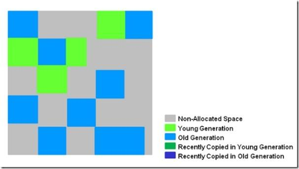
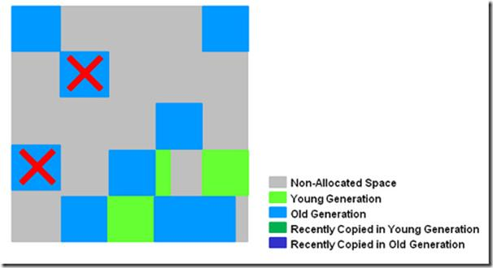
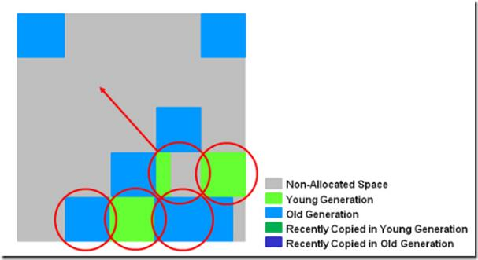
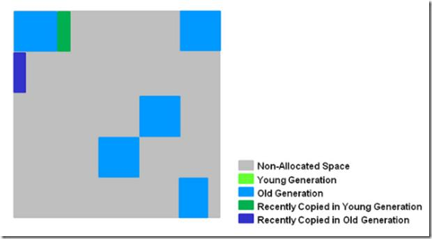

# G1收集器
G1是目前技术发展的最前沿成果之一，HotSpot开发团队赋予它的使命是未来可以替换掉JDK1.5中发布的CMS收集器。与CMS收集器相比G1收集器有以下特点：

1. 空间整合，G1收集器采用**标记整理**算法，不会产生内存空间碎片。分配大对象时不会因为无法找到连续空间而提前触发下一次GC。
2. 可预测停顿，这是G1的另一大优势，降低停顿时间是G1和CMS的共同关注点，但G1除了追求低停顿外，还能建立可预测的停顿时间模型，能让使用者明确指定在一个长度为N毫秒的时间片段内，消耗在垃圾收集上的时间不得超过N毫秒，这几乎已经是实时Java（RTSJ）的垃圾收集器的特征了。

上面提到的垃圾收集器，收集的范围都是整个新生代或者老年代，而G1不再是这样。使用G1收集器时，Java堆的内存布局与其他收集器有很大差别，它将整个Java堆划分为多个大小相等的独立区域（**Region**），虽然还**保留有新生代和老年代的概念，但新生代和老年代不再是物理隔阂了，它们都是一部分（可以不连续）Region的集合**。

G1的新生代收集跟ParNew类似，当新生代占用达到一定比例的时候，开始出发收集。和CMS类似，G1收集器收集老年代对象会有短暂停顿。

收集步骤：
1. 标记阶段，首先初始标记(Initial-Mark),这个阶段是停顿的(Stop the World Event)，并且会触发一次普通Mintor GC。对应GC log:GC pause (young) (inital-mark)
2. Root Region Scanning，程序运行过程中会回收survivor区(存活到老年代)，这一过程必须在young GC之前完成。
3. Concurrent Marking，在整个堆中进行并发标记(和应用程序并发执行)，此过程可能被young GC中断。在并发标记阶段，若发现区域对象中的所有对象都是垃圾，那个这个区域会被立即回收(图中打X)。同时，并发标记过程中，会计算每个区域的对象活性(区域中存活对象的比例)。

4. Remark, 再标记，会有短暂停顿(STW)。再标记阶段是用来收集 并发标记阶段 产生新的垃圾(并发阶段和应用程序一同运行)；G1中采用了比CMS更快的初始快照算法:snapshot-at-the-beginning (SATB)。
5. Copy/Clean up，多线程清除失活对象，会有STW。G1将回收区域的存活对象拷贝到新区域，清除Remember Sets，并发清空回收区域并把它返回到空闲区域链表中。

6. 复制/清除过程后。回收区域的活性对象已经被集中回收到深蓝色和深绿色区域。
