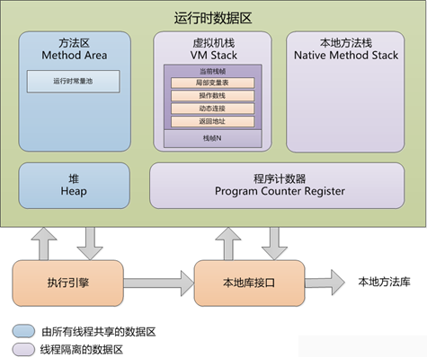
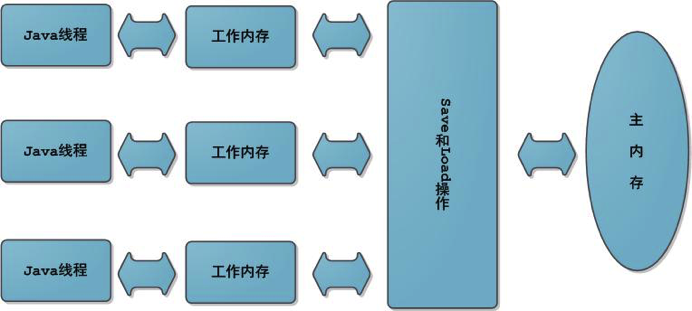
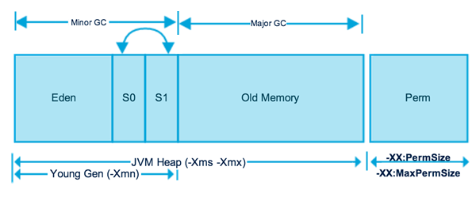
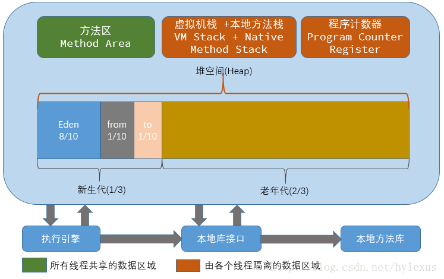
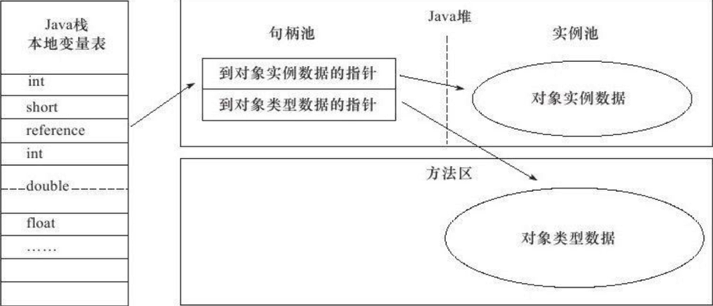
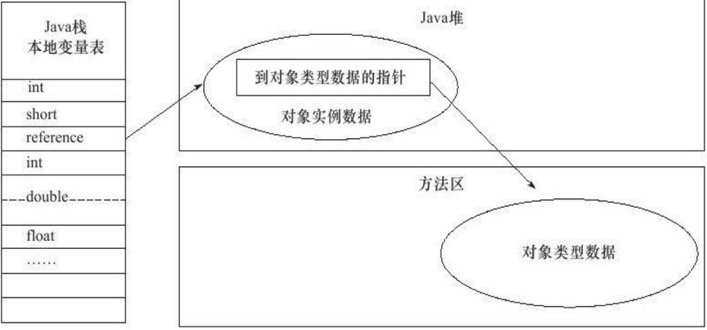
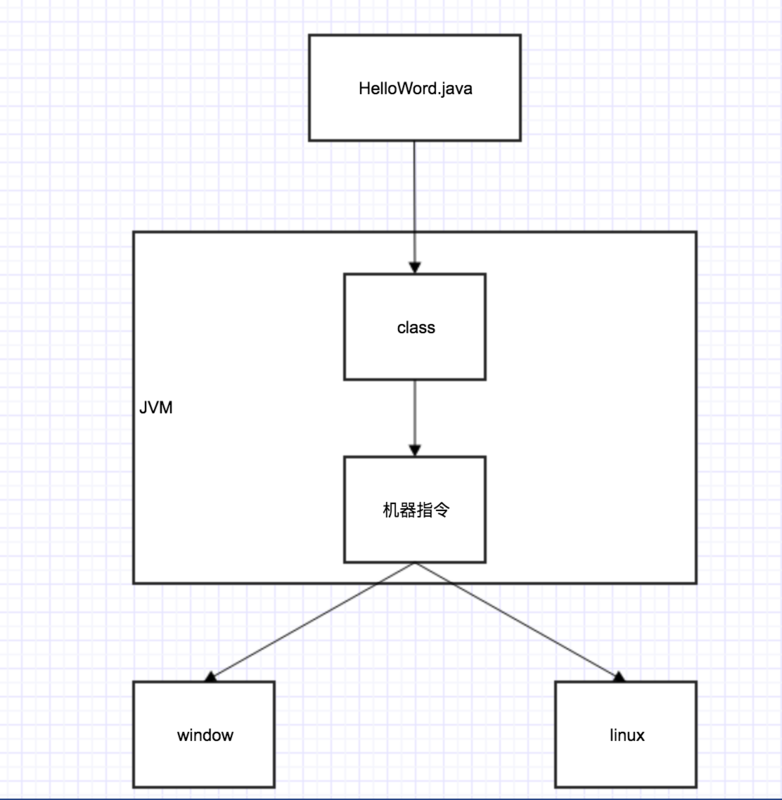

工作之余，想总结一下JVM相关知识。

## Java运行时数据区：

```
Java虚拟机在执行Java程序的过程中会将其管理的内存划分为若干个不同的数据区域，这些区域有各自的用途、创建和销毁的时间，有些区域随虚拟机进程的启动而存在，有些区域则是依赖用户线程的启动和结束来建立和销毁。Java虚拟机所管理的内存包括以下几个运行时数据区域，如图：
```



1、程序计数器：指向当前线程正在执行的字节码指令。线程私有的。2、虚拟机栈：虚拟机栈是Java执行方法的内存模型。每个方法被执行的时候，都会创建一个栈帧，把栈帧压人栈，当方法正常返回或者抛出未捕获的异常时，栈帧就会出栈。（1）栈帧：栈帧存储方法的相关信息，包含局部变量数表、返回值、操作数栈、动态链接 a、局部变量表：包含了方法执行过程中的所有变量。局部变量数组所需要的空间在编译期间完成分配，在方法运行期间不会改变局部变量数组的大小。 b、返回值：如果有返回值的话，压入调用者栈帧中的操作数栈中，并且把PC的值指向 方法调用指令 后面的一条指令地址。 c、操作数栈：操作变量的内存模型。操作数栈的最大深度在编译的时候已经确定（写入方法区code属性的max\_stacks项中）。操作数栈的的元素可以是任意Java类型，包括long和double，32位数据占用栈空间为1，64位数据占用2。方法刚开始执行的时候，栈是空的，当方法执行过程中，各种字节码指令往栈中存取数据。 d、动态链接：每个栈帧都持有在运行时常量池中该栈帧所属方法的引用，持有这个引用是为了支持方法调用过程中的动态链接。（2）线程私有3、本地方法栈：（1）调用本地native的内存模型（2）线程独享。4、方法区：用于存储已被虚拟机加载的类信息、常量、静态变量、即时编译后的代码等数据（1）线程共享的（2）运行时常量池：

```
A、是方法区的一部分
B、存放编译期生成的各种字面量和符号引用
C、Class文件中除了存有类的版本、字段、方法、接口等描述信息，还有一项是常量池，存有这个类的 编译期生成的各种字面量和符号引用，这部分内容将在类加载后，存放到方法区的运行时常量池中。
```

5、堆（Heap）：Java对象存储的地方（1）Java堆是虚拟机管理的内存中最大的一块（2）Java堆是所有线程共享的区域（3）在虚拟机启动时创建（4）此内存区域的唯一目的就是存放对象实例，几乎所有对象实例都在这里分配内存。存放new生成的对象和数组（5）Java堆是垃圾收集器管理的内存区域，因此很多时候称为“GC堆”

## JMM Java内存模型：

1、 Java的并发采用“共享内存”模型，线程之间通过读写内存的公共状态进行通讯。多个线程之间是不能通过直接传递数据交互的，它们之间交互只能通过共享变量实现。2、 主要目的是定义程序中各个变量的访问规则。3、 Java内存模型规定所有变量都存储在主内存中，每个线程还有自己的工作内存。（1） 线程的工作内存中保存了被该线程使用到的变量的拷贝（从主内存中拷贝过来），线程对变量的所有操作都必须在工作内存中执行，而不能直接访问主内存中的变量。（2） 不同线程之间无法直接访问对方工作内存的变量，线程间变量值的传递都要通过主内存来完成。（3） 主内存主要对应Java堆中实例数据部分。工作内存对应于虚拟机栈中部分区域。

4、Java线程之间的通信由内存模型JMM（Java Memory Model）控制。（1）JMM决定一个线程对变量的写入何时对另一个线程可见。（2）线程之间共享变量存储在主内存中（3）每个线程有一个私有的本地内存，里面存储了读/写共享变量的副本。（4）JMM通过控制每个线程的本地内存之间的交互，来为程序员提供内存可见性保证。5、可见性、有序性：（1）当一个共享变量在多个本地内存中有副本时，如果一个本地内存修改了该变量的副本，其他变量应该能够看到修改后的值，此为可见性。（2）保证线程的有序执行，这个为有序性。（保证线程安全）6、内存间交互操作：（1）lock（锁定）：作用于主内存的变量，把一个变量标识为一条线程独占状态。（2）unlock（解锁）：作用于主内存的变量，把一个处于锁定状态的变量释放出来，释放后的变量才可以被其他线程锁定。（3）read（读取）：作用于主内存变量，把主内存的一个变量读取到工作内存中。（4）load（载入）：作用于工作内存，把read操作读取到工作内存的变量载入到工作内存的变量副本中（5）use（使用）：作用于工作内存的变量，把工作内存中的变量值传递给一个执行引擎。（6）assign（赋值）：作用于工作内存的变量。把执行引擎接收到的值赋值给工作内存的变量。（7）store（存储）：把工作内存的变量的值传递给主内存（8）write（写入）：把store操作的值入到主内存的变量中6.1、注意：（1）不允许read、load、store、write操作之一单独出现（2）不允许一个线程丢弃assgin操作（3）不允许一个线程不经过assgin操作，就把工作内存中的值同步到主内存中（4）一个新的变量只能在主内存中生成（5）一个变量同一时刻只允许一条线程对其进行lock操作。但lock操作可以被同一条线程执行多次，只有执行相同次数的unlock操作，变量才会解锁（6）如果对一个变量进行lock操作，将会清空工作内存中此变量的值，在执行引擎使用这个变量前，需要重新执行load或者assgin操作初始化变量的值。（7）如果一个变量没有被锁定，不允许对其执行unlock操作，也不允许unlock一个被其他线程锁定的变量（8）对一个变量执行unlock操作之前，需要将该变量同步回主内存中

## 堆的内存划分：

Java堆的内存划分如图所示，分别为年轻代、Old Memory（老年代）、Perm（永久代）。其中在Jdk1.8中，永久代被移除，使用MetaSpace代替。1、新生代：（1）使用复制清除算法（Copinng算法），原因是年轻代每次GC都要回收大部分对象。新生代里面分成一份较大的Eden空间和两份较小的Survivor空间。每次只使用Eden和其中一块Survivor空间，然后垃圾回收的时候，把存活对象放到未使用的Survivor（划分出from、to）空间中，清空Eden和刚才使用过的Survivor空间。（2）分为Eden、Survivor From、Survivor To，比例默认为8：1：1（3）内存不足时发生Minor GC2、老年代：（1）采用标记-整理算法（mark-compact），原因是老年代每次GC只会回收少部分对象。3、Perm：用来存储类的元数据，也就是方法区。（1）Perm的废除：在jdk1.8中，Perm被替换成MetaSpace，MetaSpace存放在本地内存中。原因是永久代进场内存不够用，或者发生内存泄漏。（2）MetaSpace（元空间）：元空间的本质和永久代类似，都是对JVM规范中方法区的实现。不过元空间与永久代之间最大的区别在于：元空间并不在虚拟机中，而是使用本地内存。4、堆内存的划分在JVM里面的示意图：

## GC垃圾回收：

一、 判断对象是否要回收的方法：可达性分析法1、 可达性分析法：通过一系列“GC Roots”对象作为起点进行搜索，如果在“GC Roots”和一个对象之间没有可达路径，则称该对象是不可达的。不可达对象不一定会成为可回收对象。进入DEAD状态的线程还可以恢复，GC不会回收它的内存。（把一些对象当做root对象，JVM认为root对象是不可回收的，并且root对象引用的对象也是不可回收的）2、 以下对象会被认为是root对象：（1） 虚拟机栈（栈帧中本地变量表）中引用的对象（2） 方法区中静态属性引用的对象（3） 方法区中常量引用的对象（4） 本地方法栈中Native方法引用的对象3、 对象被判定可被回收，需要经历两个阶段：（1） 第一个阶段是可达性分析，分析该对象是否可达（2） 第二个阶段是当对象没有重写finalize()方法或者finalize()方法已经被调用过，虚拟机认为该对象不可以被救活，因此回收该对象。（finalize()方法在垃圾回收中的作用是，给该对象一次救活的机会）4、 方法区中的垃圾回收：（1） 常量池中一些常量、符号引用没有被引用，则会被清理出常量池（2） 无用的类：被判定为无用的类，会被清理出方法区。判定方法如下：A、 该类的所有实例被回收B、 加载该类的ClassLoader被回收C、 该类的Class对象没有被引用5、 finalize():（1） GC垃圾回收要回收一个对象的时候，调用该对象的finalize()方法。然后在下一次垃圾回收的时候，才去回收这个对象的内存。（2） 可以在该方法里面，指定一些对象在释放前必须执行的操作。

二、 发现虚拟机频繁full GC时应该怎么办：（full GC指的是清理整个堆空间，包括年轻代和永久代）（1） 首先用命令查看触发GC的原因是什么 jstat –gccause 进程id（2） 如果是System.gc()，则看下代码哪里调用了这个方法（3） 如果是heap inspection(内存检查)，可能是哪里执行jmap –histo\$&:live\$&命令（4） 如果是GC locker，可能是程序依赖的JNI库的原因

三、常见的垃圾回收算法：1、Mark-Sweep（标记-清除算法）：（1）思想：标记清除算法分为两个阶段，标记阶段和清除阶段。标记阶段任务是标记出所有需要回收的对象，清除阶段就是清除被标记对象的空间。（2）优缺点：实现简单，容易产生内存碎片2、Copying（复制清除算法）：（1）思想：将可用内存划分为大小相等的两块，每次只使用其中的一块。当进行垃圾回收的时候了，把其中存活对象全部复制到另外一块中，然后把已使用的内存空间一次清空掉。（2）优缺点：不容易产生内存碎片；可用内存空间少；存活对象多的话，效率低下。3、Mark-Compact（标记-整理算法）：（1）思想：先标记存活对象，然后把存活对象向一边移动，然后清理掉端边界以外的内存。（2）优缺点：不容易产生内存碎片；内存利用率高；存活对象多并且分散的时候，移动次数多，效率低下

4、分代收集算法：（目前大部分JVM的垃圾收集器所采用的算法）：

```
思想：把堆分成新生代和老年代。（永久代指的是方法区）
```

（1） 因为新生代每次垃圾回收都要回收大部分对象，所以新生代采用Copying算法。新生代里面分成一份较大的Eden空间和两份较小的Survivor空间。每次只使用Eden和其中一块Survivor空间，然后垃圾回收的时候，把存活对象放到未使用的Survivor（划分出from、to）空间中，清空Eden和刚才使用过的Survivor空间。（2） 由于老年代每次只回收少量的对象，因此采用mark-compact算法。（3） 在堆区外有一个永久代。对永久代的回收主要是无效的类和常量5、GC使用时对程序的影响？ 垃圾回收会影响程序的性能，Java虚拟机必须要追踪运行程序中的有用对象，然后释放没用对象，这个过程消耗处理器时间6、几种不同的垃圾回收类型：（1）Minor GC：从年轻代（包括Eden、Survivor区）回收内存。

```
A、当JVM无法为一个新的对象分配内存的时候，越容易触发Minor GC。所以分配率越高，内存越来越少，越频繁执行Minor GC
B、执行Minor GC操作的时候，不会影响到永久代（Tenured）。从永久代到年轻代的引用，被当成GC Roots，从年轻代到老年代的引用在标记阶段直接被忽略掉。
```

（2）Major GC：清理整个老年代，当eden区内存不足时触发。（3）Full GC：清理整个堆空间，包括年轻代和老年代。当老年代内存不足时触发

## HotSpot 虚拟机详解：

1、 Java对象创建过程：（1）虚拟机遇到一条new指令时，首先检查这个指令的参数能否在常量池中定位到一个类的符号引用，并检查这个符号引用代表的类是否已经加载、连接和初始化。如果没有，就执行该类的加载过程。（2）为该对象分配内存。 A、假设Java堆是规整的，所有用过的内存放在一边，空闲的内存放在另外一边，中间放着一个指针作为分界点的指示器。那分配内存只是把指针向空闲空间那边挪动与对象大小相等的距离，这种分配称为“指针碰撞” B、假设Java堆不是规整的，用过的内存和空闲的内存相互交错，那就没办法进行“指针碰撞”。虚拟机通过维护一个列表，记录哪些内存块是可用的，在分配的时候找出一块足够大的空间分配给对象实例，并更新表上的记录。这种分配方式称为“空闲列表“。 C、使用哪种分配方式由Java堆是否规整决定。Java堆是否规整由所采用的垃圾收集器是否带有压缩整理功能决定。 D、分配对象保证线程安全的做法：虚拟机使用CAS失败重试的方式保证更新操作的原子性。（实际上还有另外一种方案：每个线程在Java堆中预先分配一小块内存，称为本地线程分配缓冲，TLAB。哪个线程要分配内存，就在哪个线程的TLAB上分配，只有TLAB用完并分配新的TLAB时，才进行同步锁定。虚拟机是否使用TLAB，由-XX:+/-UseTLAB参数决定）（3）虚拟机为分配的内存空间初始化为零值（默认值）（4）虚拟机对对象进行必要的设置，例如这个对象是哪个类的实例、如何才能找到对象的元数据信息、对象的Hash码、对象的GC分代年龄等信息。这些信息存放在对象的对象头中。（5） 执行<init>方法，把对象按照程序员的意愿进行初始化。2、 对象的定位访问的方式（通过引用如何去定位到堆上的具体对象的位置）：（1）句柄：使用句柄的方式，Java堆中将会划分出一块内存作为作为句柄池，引用中存储的就是对象的句柄的地址。而句柄中包含了对象实例数据和对象类型数据的地址。

（2）直接指针：使用直接指针的方式，引用中存储的就是对象的地址。Java堆对象的布局必须必须考虑如何去访问对象类型数据。

（3）两种方式各有优点： A、使用句柄访问的好处是引用中存放的是稳定的句柄地址，当对象被移动（比如说垃圾回收时移动对象），只会改变句柄中实例数据指针，而引用本身不会被修改。 B、使用直接指针，节省了一次指针定位的时间开销。3、HotSpot的GC算法实现：（1）HotSpot怎么快速找到GC Root？HotSpot使用一组称为OopMap的数据结构。在类加载完成的时候，HotSpot就把对象内什么偏移量上是什么类型的数据计算出来，在JIT编译过程中，也会在栈和寄存器中哪些位置是引用。这样子，在GC扫描的时候，就可以直接知道哪些是可达对象了。（2）安全点： A、HotSpot只在特定的位置生成OopMap，这些位置称为安全点。 B、程序执行过程中并非所有地方都可以停下来开始GC，只有在到达安全点是才可以暂停。 C、安全点的选定基本上以“是否具有让程序长时间执行“的特征选定的。比如说方法调用、循环跳转、异常跳转等。具有这些功能的指令才会产生Safepoint。（3）中断方式：

```
A、抢占式中断：在GC发生时，首先把所有线程中断，如果发现有线程不在安全点上，就恢复线程，让它跑到安全点上。
B、主动式中断：GC需要中断线程时，不直接对线程操作，仅仅设置一个标志，各个线程执行时主动去轮询这个标志，当发现中断标记为真就自己中断挂起。轮询标记的地方和安全点是重合的。
```

（5）安全区域：一段代码片段中，对象的引用关系不会发生变化，在这个区域中任何地方开始GC都是安全的。在线程进入安全区域时，它首先标志自己已经进入安全区域，在这段时间里，当JVM发起GC时，就不用管进入安全区域的线程了。在线程将要离开安全区域时，它检查系统是否完成了GC过程，如果完成了，它就继续前行。否则，它就必须等待直到收到可以离开安全区域的信号。4、 GC时为什么要停顿所有Java线程？ 因为GC先进行可达性分析。可达性分析是判断GC Root对象到其他对象是否可达，假如分析过程中对象的引用关系在不断变化，分析结果的准确性就无法得到保证。5、 CMS收集器：（1）一种以获取最短回收停顿时间为目标的收集器。（2）一般用于互联网站或者B/S系统的服务端（3）基于标记-清除算法的实现，不过更为复杂，整个过程为4个步骤：

```
A、初始标记：标记GC Root能直接引用的对象
B、并发标记：利用多线程对每个GC Root对象进行tracing搜索，在堆中查找其下所有能关联到的对象。
C、重新标记：为了修正并发标记期间，用户程序继续运作而导致标志产生变动的那一部分对象的标记记录。
D、并发清除：利用多个线程对标记的对象进行清除
```

（4）由于耗时最长的并发标记和并发清除操作都是用户线程一起工作，所以总体来说，CMS的内存回收工作是和用户线程一起并发执行的。（5）缺点：

```
A、对CPU资源占用比较多。可能因为占用一部分CPU资源导致应用程序响应变慢。
B、CMS无法处理浮动垃圾。在并发清除阶段，用户程序继续运行，可能产生新的内存垃圾，这一部分垃圾出现在标记过程之后，因此，CMS无法清除。这部分垃圾称为“浮动垃圾“
C、需要预留一部分内存，在垃圾回收时，给用户程序使用。
D、基于标记-清除算法，容易产生大量内存碎片，导致full GC（full GC进行内存碎片的整理）

```

6、 对象头部分的内存布局：HotSpot的对象头分为两部分，第一部分用于存储对象自身的运行时数据，比如哈希码、GC分代年龄等。另外一部分用于指向方法区对象类型数据的指针。7、 偏向锁：偏向锁偏向于第一个获取它的线程，如果在接下来的执行过程，没有其他线程获取该锁，则持有偏向锁的线程永远不需要同步。（当一个线程获取偏向锁，它每次进入这个锁相关的同步块，虚拟机不在进行任何同步操作。当有另外一个线程尝试获取这个锁时，偏向模式宣告结束）

## JVM优化：

1、一般来说，当survivor区不够大或者占用量达到50%，就会把一些对象放到老年区。通过设置合理的eden区，survivor区及使用率，可以将年轻对象保存在年轻代，从而避免full GC，使用`-Xmn`设置年轻代的大小

2、对于占用内存比较多的大对象，一般会选择在老年代分配内存。如果在年轻代给大对象分配内存，年轻代内存不够了，就要在eden区移动大量对象到老年代，然后这些移动的对象可能很快消亡，因此导致full GC。通过设置参数：`-XX:PetenureSizeThreshold=1000000`，单位为B，标明对象大小超过1M时，在老年代(tenured)分配内存空间。

3、一般情况下，年轻对象放在eden区，当第一次GC后，如果对象还存活，放到survivor区，此后，每GC一次，年龄增加1，当对象的年龄达到阈值，就被放到tenured老年区。这个阈值可以同构`-XX:MaxTenuringThreshold`设置。如果想让对象留在年轻代，可以设置比较大的阈值。

4、设置最小堆和最大堆：`-Xmx`和`-Xms`稳定的堆大小堆垃圾回收是有利的，获得一个稳定的堆大小的方法是设置-Xms和-Xmx的值一样，即最大堆和最小堆一样，如果这样子设置，系统在运行时堆大小理论上是恒定的，稳定的堆空间可以减少GC次数，因此，很多服务端都会将这两个参数设置为一样的数值。稳定的堆大小虽然减少GC次数，但是增加每次GC的时间，因为每次GC要把堆的大小维持在一个区间内。

5、一个不稳定的堆并非毫无用处。在系统不需要使用大内存的时候，压缩堆空间，使得GC每次应对一个较小的堆空间，加快单次GC次数。基于这种考虑，JVM提供两个参数，用于压缩和扩展堆空间。（1）`-XX:MinHeapFreeRatio` 参数用于设置堆空间的最小空闲比率。默认值是40，当堆空间的空闲内存比率小于40，JVM便会扩展堆空间（2）`-XX:MaxHeapFreeRatio` 参数用于设置堆空间的最大空闲比率。默认值是70， 当堆空间的空闲内存比率大于70，JVM便会压缩堆空间。（3）当-Xmx和-Xmx相等时，上面两个参数无效

6、通过增大吞吐量提高系统性能，可以通过设置并行垃圾回收收集器。 （1）`-XX:+UseParallelGC`:年轻代使用并行垃圾回收收集器。这是一个关注吞吐量的收集器，可以尽可能的减少垃圾回收时间。 （2）`-XX:+UseParallelOldGC`:设置老年代使用并行垃圾回收收集器。

7、尝试使用大的内存分页：使用大的内存分页增加CPU的内存寻址能力，从而系统的性能。`-XX:+LargePageSizeInBytes` 设置内存页的大小

8、使用非占用的垃圾收集器。`-XX:+UseConcMarkSweepGC`老年代使用CMS收集器降低停顿。

9、`-XXSurvivorRatio=3`，表示年轻代中的分配比率：survivor:eden = 2:3

10、JVM性能调优的工具：（1）jps（Java Process Status）：输出JVM中运行的进程状态信息(现在一般使用jconsole)（2）jstack：查看java进程内线程的堆栈信息。（3）jmap：用于生成堆转存快照（4）jhat：用于分析jmap生成的堆转存快照（一般不推荐使用，而是使用Ecplise Memory Analyzer）（3）jstat是JVM统计监测工具。可以用来显示垃圾回收信息、类加载信息、新生代统计信息等。（4）VisualVM：故障处理工具

## 类加载机制：

一、 概念：类加载器把class文件中的二进制数据读入到内存中，存放在方法区，然后在堆区创建一个java.lang.Class对象，用来封装类在方法区内的数据结构。类加载的步骤如下： 1、加载：查找并加载类的二进制数据（把class文件里面的信息加载到内存里面） 2、连接：把内存中类的二进制数据合并到虚拟机的运行时环境中 （1）验证：确保被加载的类的正确性。包括：

```
   A、类文件的结构检查：检查是否满足Java类文件的固定格式
   B、语义检查：确保类本身符合Java的语法规范
   C、字节码验证：确保字节码流可以被Java虚拟机安全的执行。字节码流是操作码组成的序列。每一个操作码后面都会跟着一个或者多个操作数。字节码检查这个步骤会检查每一个操作码是否合法。
   D、二进制兼容性验证：确保相互引用的类之间是协调一致的。
```

（2）准备：为类的静态变量分配内存，并将其初始化为默认值 （3）解析：把类中的符号引用转化为直接引用（比如说方法的符号引用，是有方法名和相关描述符组成，在解析阶段，JVM把符号引用替换成一个指针，这个指针就是直接引用，它指向该类的该方法在方法区中的内存位置） 3、初始化：为类的静态变量赋予正确的初始值。当静态变量的等号右边的值是一个常量表达式时，不会调用static代码块进行初始化。只有等号右边的值是一个运行时运算出来的值，才会调用static初始化。

二、双亲委派模型： 1、当一个类加载器收到类加载请求的时候，它首先不会自己去加载这个类的信息，而是把该 请求转发给父类加载器，依次向上。所以所有的类加载请求都会被传递到父类加载器中，只有当父类加载器中无法加载到所需的类，子类加载器才会自己尝试去加载该类。当当前类加载器和所有父类加载器都无法加载该类时，抛出ClassNotFindException异常。 2、意义：

```
提高系统的安全性。用户自定义的类加载器不可能加载应该由父加载器加载的可靠类。（比如用户定义了一个恶意代码，自定义的类加载器首先让系统加载器去加载，系统加载器检查该代码不符合规范，于是就不继续加载了）
```

3、定义类加载器：如果某个类加载器能够加载一个类，那么这个类加载器就叫做定义类加载器 4、初始类加载器：定义类加载器及其所有子加载器都称作初始类加载器。 5、运行时包： （1）由同一个类加载器加载并且拥有相同包名的类组成运行时包 （2）只有属于同一个运行时包的类，才能访问包可见（default）的类和类成员。作用是 限制用户自定义的类冒充核心类库的类去访问核心类库的包可见成员。 6、加载两份相同的class对象的情况：A和B不属于父子类加载器关系，并且各自都加载了同一个类。

三、特点：1、全盘负责：当一个类加载器加载一个类时，该类所依赖的其他类也会被这个类加载器加载到内存中。2、缓存机制：所有的Class对象都会被缓存，当程序需要使用某个Class时，类加载器先从缓存中查找，找不到，才从class文件中读取数据，转化成Class对象，存入缓存中。

三、 类加载器：两种类型的类加载器：1、 JVM自带的类加载器（3种）：（1）根类加载器（Bootstrap）： a、C++编写的，程序员无法在程序中获取该类 b、负责加载虚拟机的核心库，比如java.lang.Object c、没有继承ClassLoader类（2）扩展类加载器（Extension）： a、Java编写的，从指定目录中加载类库 b、父加载器是根类加载器 c、是ClassLoader的子类 d、如果用户把创建的jar文件放到指定目录中，也会被扩展加载器加载。（3）系统加载器（System）或者应用加载器(App)： a、Java编写的 b、父加载器是扩展类加载器 c、从环境变量或者class.path中加载类 d、是用户自定义类加载的默认父加载器 e、是ClassLoader的子类

2、用户自定义的类加载器：（1）Java.lang.ClassLoader类的子类（2）用户可以定制类的加载方式（3）父类加载器是系统加载器（4）编写步骤： A、继承ClassLoader B、重写findClass方法。从特定位置加载class文件，得到字节数组，然后利用defineClass把字节数组转化为Class对象（5）为什么要自定义类加载器？  A、可以从指定位置加载class文件，比如说从数据库、云端加载class文件 B、加密：Java代码可以被轻易的反编译，因此，如果需要对代码进行加密，那么加密以后的代码，就不能使用Java自带的ClassLoader来加载这个类了，需要自定义ClassLoader，对这个类进行解密，然后加载。 

问题：Java程序对类的执行有几种方式：1、 主动使用（6种情况）： JVM必须在每个类“首次 主动使用”的时候，才会初始化这些类。（1） 创建类的实例（2） 读写某个类或者接口的静态变量（3） 调用类的静态方法（4） 同过反射的API（Class.forName()）获取类（5） 初始化一个类的子类（6） JVM启动的时候，被标明启动类的类（包含Main方法的类） 只有当程序使用的静态变量或者静态方法确实在该类中定义时，该可以认为是对该类或者接口的主动使用。2、 被动使用：除了主动使用的6种情况，其他情况都是被动使用，都不会导致类的初始化。3、 JVM规范允许类加载器在预料某个类将要被使用的时候，就预先加载它。如果该class文件缺失或者存在错误，则在程序“首次 主动使用”的时候，才报告这个错误。（Linkage Error错误）。如果这个类一直没有被程序“主动使用”，就不会报错。

类加载机制与接口：1、 当Java虚拟机初始化一个类时，不会初始化该类实现的接口。2、 在初始化一个接口时，不会初始化这个接口父接口。3、 只有当程序首次使用该接口的静态变量时，才导致该接口的初始化。

ClassLoader：1、 调用Classloader的loadClass方法去加载一个类，不是主动使用，因此不会进行类的初始化。

类的卸载：1、 有JVM自带的三种类加载器（根、扩展、系统）加载的类始终不会卸载。因为JVM始终引用这些类加载器，这些类加载器使用引用他们所加载的类，因此这些Class类对象始终是可到达的。2、 由用户自定义类加载器加载的类，是可以被卸载的。

补充：

- JDK和JRK

（1）JDK ： Java Development Kit，开发的时候用到的类包。（2）JRE ： Java Runtime Environment，Java运行的基础，包含运行时需要的所有类库。

- 图解java文件转化成机器码

JVM虚拟机先将java文件编译成class文件（字节码文件），然后再将class文件转换成所有操作系统都能运行的机器指令。