<!--toc-->
[TOC]
# JVM运行时参数

## JVM都有哪些参数类型
### JVM参数有多少
大概有1000多个
PerfMa社区：https://my.oschina.net/PerfMa
https://www.heapdump.cn/

### JVM参数类型
- 标准参数
```
-help
-server -client
-version -showversion
-cp -classpath

-verbose:gc
```
标准参数，在各个版本的JVM里面中，基本保持不变。相对比较稳定
例如：java -help

- X参数
非标准参数:也就是说在各个版本的JVM中可能会变，但是变化的也比较小。
但是我们这块X参数平时用的并不多，用的更多而是后面这块XX参数。
```
-Xint：解释执行 #设置成解释模式,可以用java -Xint -version
-Xcomp：第一次使用就编译成本地代码  #设置成编译模式,可以用java -Xcomp -version
-Xmixed：混合模式,JVM自己来决定是否编译成本地代码 #默认混合模式,可以用java -version看到
```

- XX参数
特点：
非标准化参数化
相对不稳定
主要用于JVM调优和Debug

主要分为两大类(Boolean是带有+-号，而非Boolean类型是key,value形式存在，中间用等号。)
1. Boolean类型：
格式：-XX:[+-]表示启用或者禁用name属性。其中+号表示启用该参数，-号表示禁用该参数。
如：`-XX:+UseG1GC`表示启用了G1垃圾收集器
2. 非Boolean类型：
格式：-XX:=表示name属性的值是value，主要是以key，value形式存在。
如:`-XX:MaxGCPauseMillis=500`表示GC最大的停顿时间是500ms。


其中`-X`和`-`开头的通常会被转换为一个或者多个`-XX:`开头的参数，只是一个简化的写法，比如说`-Xmx100M`，JVM里会自动转化为`-XX:MaxHeapSize=100M`，`-verbose:class`会自动转换为`-XX:+TraceClassLoading` `-XX:+TraceClassUnloading`

-Xms等价于-XX:InitialHeapSize
-Xmx等价于-XX:MaxHeapSize
-Xss等价于-XX:ThreadStackSize
InitialHeapSize初始堆的大小。MaxHeapSize最大的堆大小。ThreadStackSize线程堆栈大小
查看进程的堆栈大小
`jinfo -flag MaxHeapSize p_id`
查看线程的堆栈大小
`jinfo -flag ThreadStackSize p_id`

### JVM参数文件
#### 通过Flags参数指定JVM参数文件
`java -XX:Flags=/home/admin/flags Main arg1 arg2`
在这个文件里指定所有的JVM参数就可以了，但是对flags文件里的参数写法会有些要求，`-X`之类的参数**不能设置**，但是可以用其等价的`-XX`的参数来替代，比如说`-Xmx100M`，只能用`-XX:MaxHeapSize=100M`来取代，同时在文件里**不要出现** `-XX:`，只要key=value或许+/-key就可以了，不同的参数之间用**换行或者空格**分开即可，比如flags文件的内容如下：
```
MaxHeapSize=8G +UseG1GC
```
其实等价于
```
-Xmx8G -XX:+UseG1GC
```
可以通过加上`-XX:+PrintVMOptions`可以打印设置过的JVM参数来验证，比如
`java -XX:Flags=/home/admin/flags -XX:+PrintVMOptions Main arg1 arg2`

#### 通过VMOptionsFile参数来指定JVM参数文件
使用上面的Flags参数可能会比较别扭，因为设置参数和我们正常的写法不太一样，如果我们的JDK版本大于1.8的话，JVM提供了一个更人性化的参数，那就是VMOptionsFile来取代Flags，这也是指定一个文件，这个文件里的JVM参的写法和我们在java命令后写的JVM参数写法完全一样
`java -XX:VMOptionsFile=/home/admin/flags Main arg1 arg2`
在flags文件里我们可以这么写
`-Xmx8G -XX:+UseG1GC`

## 如何查看JVM运行时参数

1.-XX:+PrintFlagsInitial（查看初始值）

2.-XX:+PrintFlagsFinal（查看最终值）

3.-XX:+UnlockExperimentalVMOptions（解锁实验参数）

4.-XX:+UnlockDiagnosticVMOptions（解锁诊断参数）

5.-XX:+PrintCommandLineFlags（打印命令行参数）

### PrintFlagsFinal

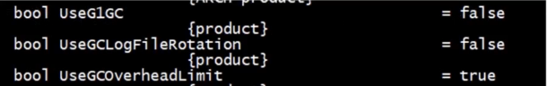

bool类型 属性名：UseG1GC 值：false

因此可以看出，并没有使用G1GC。

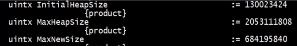

InitialHeapSize := 130023424

表示初始堆的值大小。

> 注意：
> 
> =表示默认值
> 
> :=被用户或者JVM修改后的值

#### 演示一下

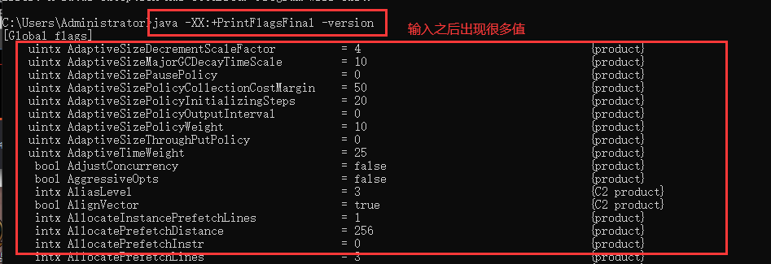

可以看到有非常多的参数。有兴趣的小伙伴可以自己试试。

那么刚才我们看到的参数是哪个进程的呢？

答案是：通过执行`java -XX:+PrintFlagsFinal -version`这个命令时的进程参数值。

如果我们要查看一个在运行时的JVM参数值，那么如何查看呢？这就是我们后面讲到的[jinfo](https://docs.oracle.com/javase/8/docs/technotes/tools/unix/jinfo.html#BCGEBFDD),在此之前，我们先来看一下·jps·。

### jps

`jps`它就类似于Linux系统中的`ps`，也是用来查看系统进程的。不过它是专门用来查看java的进程。接下来我们来简单演示一下`jps`的使用

#### 如何使用？

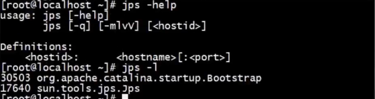

更多`jps`的适用参数命令，可以去[这里](https://docs.oracle.com/javase/8/docs/technotes/tools/unix/jps.html#CHDCGECD)查看
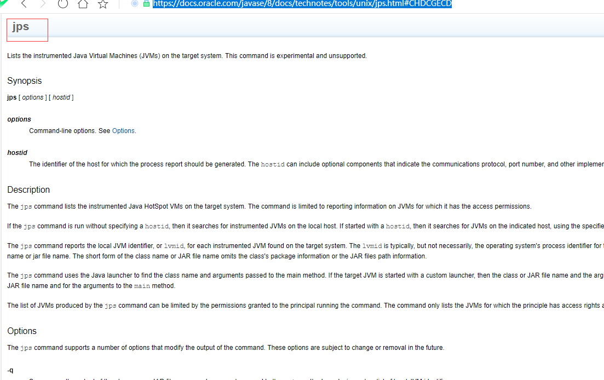

### jinfo

那么我们如何去查看一个正在运行的JVM的参数值呢？

那么用`jinfo`就可以了。

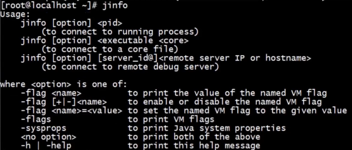

再例如，我们如何查看tomcat的最大内存值是多少？那么我们首先得知道命令，然后找到对应的pid。

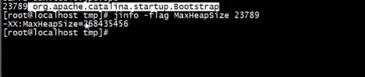

如图，其中23789就是`tomcat`的进程`pid`,查看对内存大小命令：`MaxHeapSize`。

可以看到最大堆内存大小为268435456

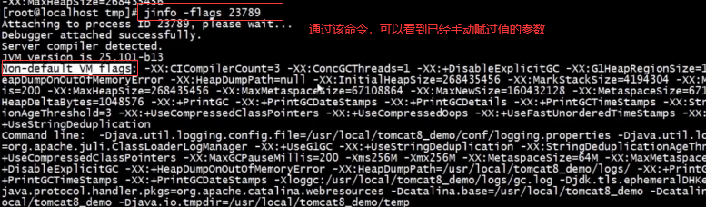

可以看到我们手动赋值的参数，也可以看到默认有的参数值。

- 查看最大内存

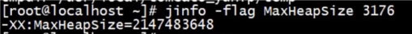

- 查看垃圾回收器

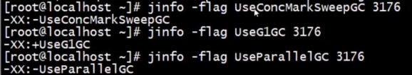

### jstat查看JVM统计信息

- 类装载
- 垃圾收集
- JIT编译

垃圾回收这块非常有用，因为我们能够非常清楚的看到内存结构里面每一块的大小是如何进行变化的。

#### 命令格式

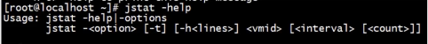

> options：-class,-compiler,-gc,-printcompilation

我们来查看一下[jstat](https://docs.oracle.com/javase/8/docs/technotes/tools/unix/jstat.html#BEHHGFAE)文档。

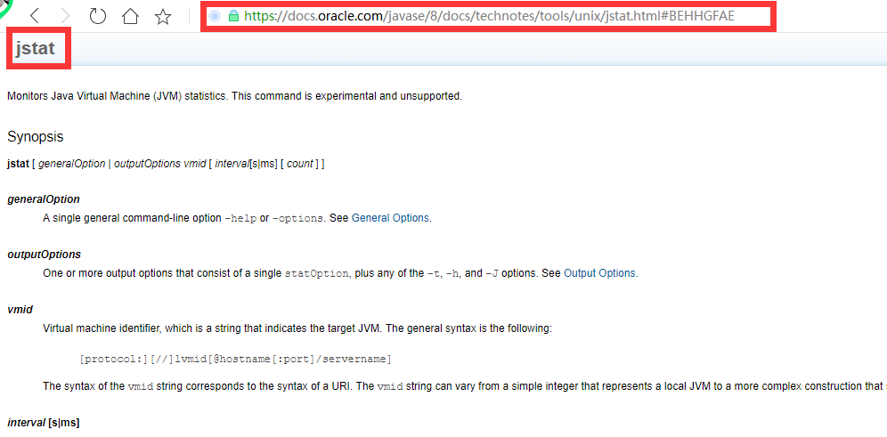

我们来介绍一下几个命令。

#### 类装载

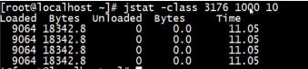

> jstat -class 3176 1000 10

后面的1000表示每隔1000ms,10表示一共输出10次

我们来看一下文档中是如何介绍-class命令。

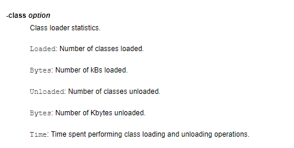

分别表示什么含义呢？

- Loaded：类装载的个数
- Bytes：装载的kBs数
- Unloaded：卸载的个数
- Bytes：卸载的kBs数
- Time：所花费的装载和卸载的时间

### 垃圾收集

命令：-gc、-gcutil、-gccause、-gcnew、-gcold
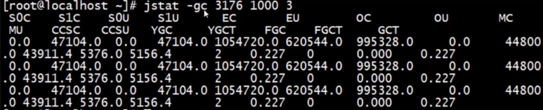

输入：jstat -gc 3176 1000 3

同样，后面表示每隔1000ms,一共打印输出3次

我们同样来看一下文档中的-gc的命令

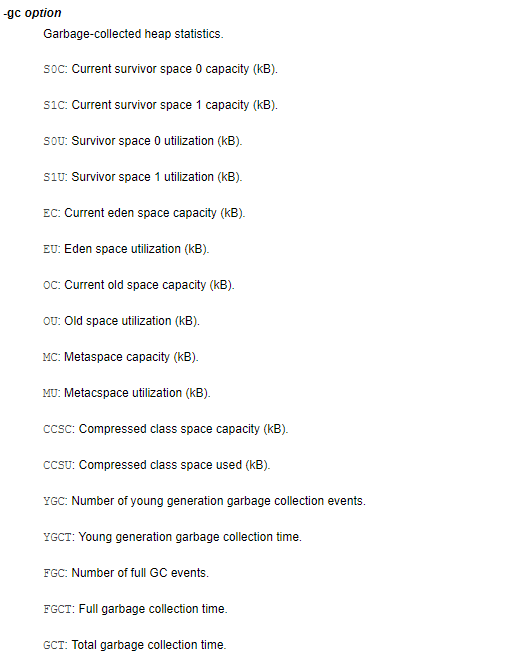

我们来总结一下-gc输出结果。

- S0C、S1C、S0U、S1U：S0和S1的总量与使用量
- EC、EU：Eden区总量与使用量
- OC、OU：Old区总量与使用量
- MC、MU：Metaspace区总量与使用量
- CCSC、CCSU：压缩类空间总量与使用量
- YGC、YGCT：YoungGC的次数与时间
- FGC、FGCT：FullGC的次数与时间
- GCT：总的GC时间

### JIT编译

命令：-compiler、-printcompilation

我们来演示一下JIT编译。

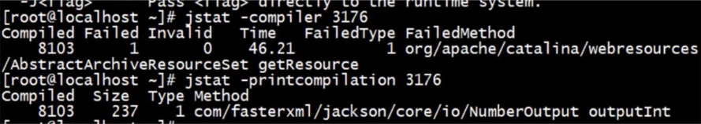

这些都表示什么含义呢？我们来看一下我们的文档。

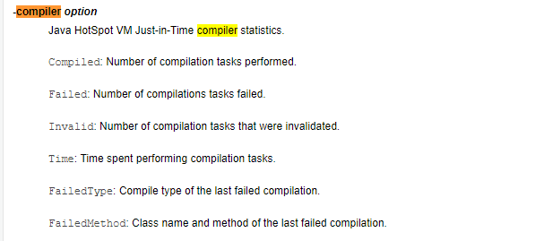

- Compiled：表示完成了多少个编译任务
- Failed：表示失败的编译任务个数
- Invalid：表示无效的编译任务
- Time：执行编译任务所花的时间。
- FailedType：上次失败编译的编译类型。
- FailedMethod：上次编译失败的类名和方法。

小伙伴可以结合一下上方的演示图案，来理解一下是什么含义。

大家了解一下就可以，实际工作中作用并不是很大。

以上都是以**JDK1.8**进行介绍。这里小伙伴们先简单了解一下这一块，后续再详细介绍。小伙伴们可以自己在电脑上尝试一下使用命令，观察一下打印结果。

关于**JVM参数**的命令，在文档中还有更多的详细介绍。感兴趣的小伙伴，可以自行去查看。

传送门：[https://docs.oracle.com/javase/8/docs/technotes/tools/unix/jstat.html#BEHHGFAE](https://docs.oracle.com/javase/8/docs/technotes/tools/unix/jstat.html#BEHHGFAE)

下一章，我们将来学习一下**JVM的内存结构以及内存溢出**。感兴趣的小伙伴，可以关注一下~

## 推荐

- [[JVM教程与调优] 为什么要学习JVM虚拟机？](https://mp.weixin.qq.com/s?__biz=MzIwMTg3NzYyOA==&mid=2247484247&idx=1&sn=e41732e54d5b57534d312dc9f15f47f0&chksm=96e67244a191fb5287c35c278cff4810939bd70a76cd4190fe7636d06b3ccb07f6aca974ed62&token=89408735&lang=zh_CN#rd)
    
- [[JVM教程与调优] JVM都有哪些参数类型？](https://mp.weixin.qq.com/s?__biz=MzIwMTg3NzYyOA==&mid=2247484247&idx=2&sn=a1f732611bab89f0db84d3ab162e8763&chksm=96e67244a191fb52a4d6b292112cc94c412d3c90a688bc6da533dec8cfe9cfa693af65b16dd5&token=89408735&lang=zh_CN#rd)
    

## 文末

文章收录至

Github: [https://github.com/CoderMerlin/coder-programming](https://links.jianshu.com/go?to=https%3A%2F%2Fgithub.com%2FCoderMerlin%2Fcoder-programming)

Gitee: [https://gitee.com/573059382/coder-programming](https://links.jianshu.com/go?to=https%3A%2F%2Fgitee.com%2F573059382%2Fcoder-programming)


[原文](https://www.cnblogs.com/coder-programming/p/12604799.html)