<!--toc-->
[TOC]

# 1 面试问题 

> 1. 请谈谈你对JVM的理解?java8版有什么了解？
> 2. 谈谈JVM中你对ClassLoader类加载器的认识？
> 3. 什么是OOM？写代码使得分别出现StackOverflowError和OutOfMemoryError
> 4. JVM的常用参数调优你了解吗？
> 5. 内存快照抓取和MAT分析hprof文件干过吗？

> 1）StackOverflowError和 OutofMemoryError，谈谈你的理解

> - If the computation in a thread requires a larger Java Virtual Machine stack than is permitted, the Java Virtual Machine throws a StackOverflowError.
> 如果线程中的计算需要比允许的更大的 Java 虚拟机堆栈，则 Java 虚拟机抛出 StackOverflowError。

> - If Java Virtual Machine stacks can be dynamically expanded, and expansion is attempted but insufficient memory can be made available to effect the expansion, or if insufficient memory can be made available to create the initial Java Virtual Machine stack for a new thread, the Java Virtual Machine throws an OutOfMemoryError.
> 如果 Java 虚拟机堆栈可以动态扩展，并且尝试扩展，但是没有足够的内存来实现扩展，或者如果没有足够的内存来为新线程创建初始的 Java 虚拟机堆栈，Java 虚拟机抛出 OutOfMemoryError。


> 2）一般什么时候会发生GC？如何处理？
> 
> Java中的GC会有两种回收：年轻代的 Minor GC，另外一个就是老年代的Full GC；新对象创建时如果伊甸园空间不足会触发 Minor GC，如果此时老年代的内存空间不足会触发Full GC，如果空间都不足抛出 OutOfMemoryError。


> 3）GC回收策略，谈谈你的理解
> 
> - 年轻代（伊甸园区+两个幸存区），GC回收策略为“复制”；
> - 老年代的保存空间一般较大，GC回收策略为“整理-压缩”

**！栈管运行，堆管存储**

* * *

# 2 JVM体系结构概述

## 2.1 三种JWM

> 1. Sun公司的 Hotspot （oracle 收购）
> 2. BEA公司的 JRockit（oracle 收购）
> 3. IBM公司的J9 VM


## 3.2 **JVM位置**

JVM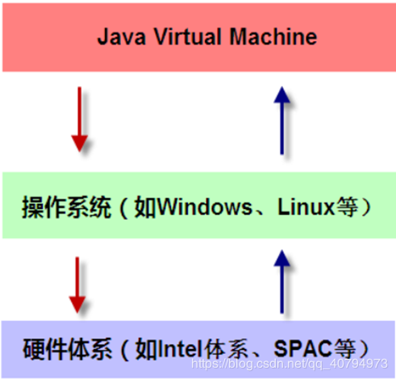

**JVM****是运行在操作系统之上的，它与硬件没有直接的交互**

* * *

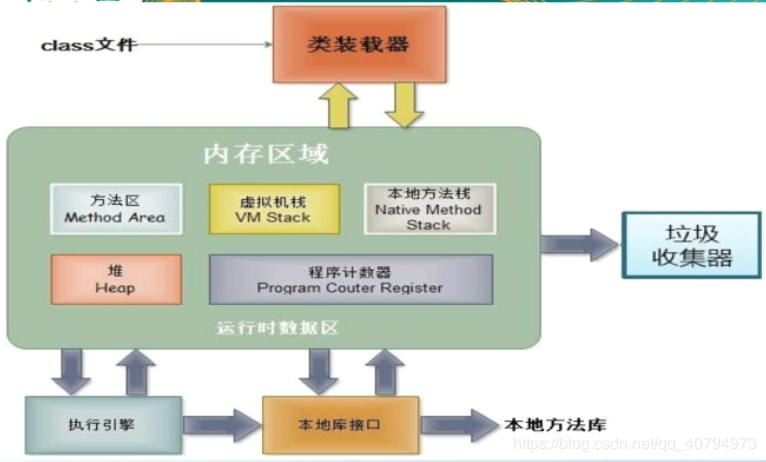

* * *

## 3.3 JVM体系结构概览

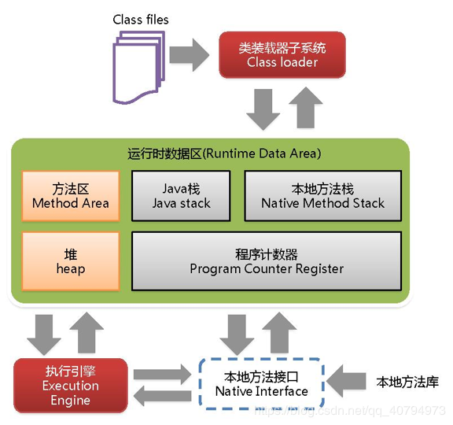

> 1. Class Loader类加载器
> 2. Execution Engine执行引擎负责解释命令，提交操作系统执行
> 3. Native Interface本地接口
> 4. Runtime data area运行数据区

* * *

## **3.4 类装载器**

### **3.4.1 类装载器ClassLoader**

> 负责加载class文件，class文件在文件开头有特定的文件标示，并且ClassLoader只负责class文件的加载，至于它是否可以运行，则由Execution Engine决定。

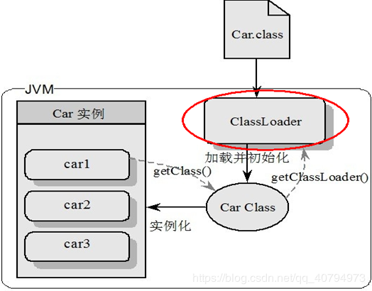

### **3.4.2 类装载器ClassLoader2**

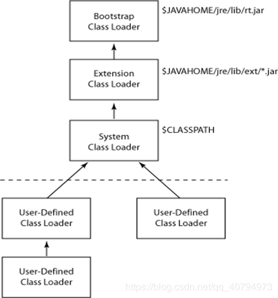

> 虚拟机自带的加载器。
> 
> - 启动类加载器（Bootstrap）C++  (...\\jre\\lib\\rt.jar)
> - 扩展类加载器（Extension）Java
> - 应用程序类加载器（App）Java
> - 也叫系统类加载器，加载当前应用的classpath的所有类
> 
> 用户自定义加载器 
> 
> - Java.lang.ClassLoader的子类，用户可以定制类的加载方式

```java
import org.junit.Test;
public class Main {
    @Test
    public void test3() {
     var obj = new Object();
     System.out.println("启动类加载器 "+obj.getClass().getClassLoader());//null
     System.out.println();

     var test = new Main();
     System.out.println("应用程序类加载器（App） "+test.getClass().getClassLoader());//jdk.internal.loader.ClassLoaders$AppClassLoader@2437c6dc
    }
}

```

案例二：

打包 MyHello.java

```java
package com.atguigu.hello;
public class MyHello {
   public static void main(String[] args){
   }
}

```

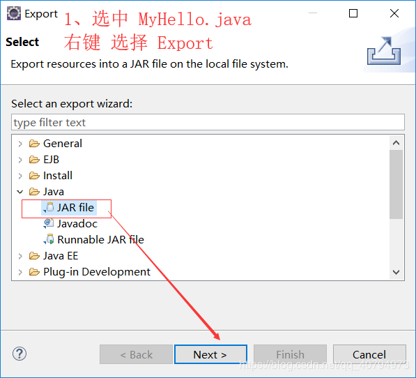

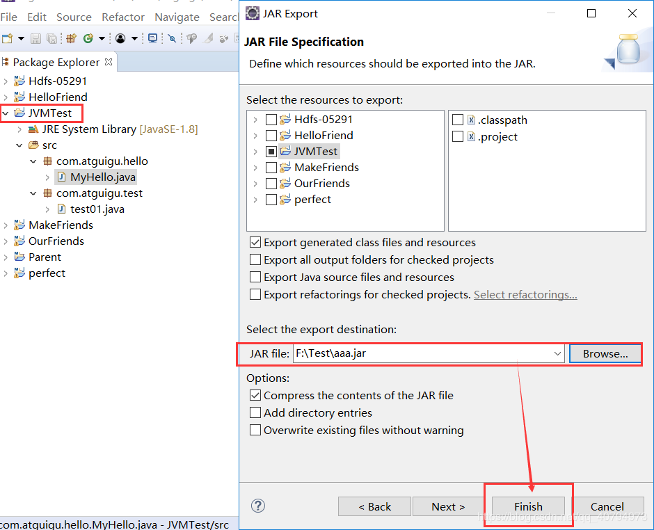

 把刚刚打包的 aaa.jar 放入java里面的拓展文件里面  ...\\jre\\lib\\rt.jar


 删除创建的 MyHello.java  文件

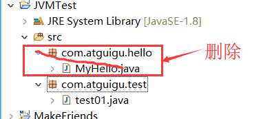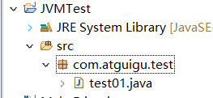

我现在是重拓展包加载获取 MyHello

```java
package com.atguigu.test;
public class test01 {
	public static void main(String[] args) throws ClassNotFoundException {
		Object obj = new Object();
		System.out.println("***:"+obj.getClass().getClassLoader());
		System.out.println();
		
		Class clazz = Class.forName("com.atguigu.hello.MyHello");
		System.out.println("***:"+clazz.getClassLoader());
		System.out.println();
		
		test01 test = new test01();
		System.out.println("***:"+test.getClass().getClassLoader());
	}
}

```

三个加载器都有体现 

> \*\*\*:null
> 
> \*\*\*:sun.misc.Launcher$ExtClassLoader@3d4eac69
> 
> \*\*\*:sun.misc.Launcher$AppClassLoader@2a139a55

 注意：aaa.jar  一定要移动到，你创建的项目所用的那个 jdk， 启动类加载器 返回的都是 null。


案例三：

 如何体现继承关系

```java
package com.atguigu.test;
public class test01 {
	public static void main(String[] args) throws ClassNotFoundException {
		test01 test = new test01();
		System.out.println("***:"+test.getClass().getClassLoader());
	
		System.out.println("***parent:"+test.getClass().getClassLoader().getParent());
		System.out.println("***parent parent:"+test.getClass().getClassLoader().getParent().getParent());
	}
}

```

> **\*\*\*:sun.misc.Launcher$****AppClassLoader****@2a139a55
> 
> \*\*\*parent:sun.misc.Launcher$****ExtClassLoader****@3d4eac69
> 
> \*\*\*parent parent:****null**

### **3.4.3 类装载器ClassLoader3**


> •Code案例
> 
> •sun.misc.Launcher
> 
> 它是一个java虚拟机的入口应用
> 
> 某个特定的类加载器在接到加载类的请求时，首先将加载任务委托给父类加载器，依次递归，如果父类加载器可以完成类加载任务，就成功返回；只有父类加载器无法完成此加载任务时，才自己去加载。（双亲委派机制 \+ 沙箱机制（防止恶意代码对 java 的破坏））

 创建一个 java自带的 String 一样的类

```java
package java.lang;
public class String {
	public static void main(String[] args) {		
	}
}
```

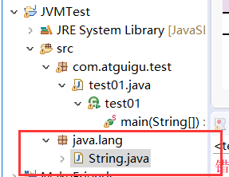

执行：

> 错误: 在类 java.lang.String 中找不到 main 方法, 请将 main 方法定义为:
> 
>    public static void main(String[] args)
> 
> 否则 JavaFX 应用程序类必须扩展javafx.application.Application

分析：java.lang.String jdk 自身就带了一个，根据类加载机制，它首先加载的是 java 自带的 java.lang.String，而不是我写的这个，这样保证了 java 源代码的安全，保证了程序的健壮性。

> **Execution Engine执行引擎负责解释命令，提交操作系统执行。**

## **Native Interface本地接口**

Java语言本身不能对操作系统底层进行访问和操作，但是可以通过**[JNI](https://baike.baidu.com/item/JNI/9412164?fr=aladdin)**接口调用其他语言来实现对底层的访问。

本地接口的作用是融合不同的编程语言为Java所用，它的初衷是融合 C/C++程序，Java诞生的时候是C/C++横行的时候，要想立足，必须有调用C/C++程序，于是就在内存中专门开辟了一块区域处理标记为Native的代码，它的具体做法是Native Method Stack中登记Native方法，在Execution Engine 执行时加载Native libraries。

目前该方法使用的越来越少了，除非是与硬件有关的应用，比如通过Java程序驱动打印机或者Java系统管理生产设备，在企业级应用中已经比较少见。因为现在的异构领域间的通信很发达，比如可以使用Socket通信，也可以使用WebService等等，不多做介绍。

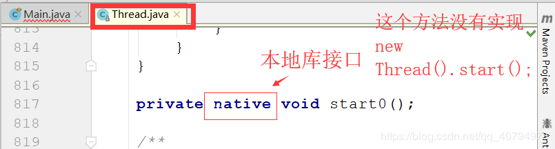

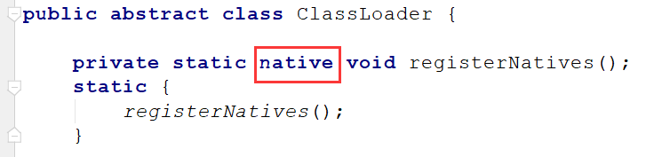

**native**本地方法，是放在本地方法栈里面的，而我们平时说的栈是虚拟机栈（Persion p = new Persion() ）。 

## **Native Method Stack**

它的具体做法是Native Method Stack中登记native方法，在Execution Engine执行时加载本地方法库。

## **PC寄存器**

每个线程都有一个程序计数器，是线程私有的,就是一个指针，指向方法区中的方法字节码（用来存储指向下一条指令的地址,也即将要执行的指令代码），由执行引擎读取下一条指令，是一个非常小的内存空间，几乎可以忽略不记。

* * *

## **栈**

### Stack栈是什么 

栈也叫栈内存，主管Java程序的运行，是在线程创建时创建，它的生命期是跟随线程的生命期，线程结束栈内存也就释放，对于栈来说不存在垃圾回收问题，只要线程一结束该栈就Over，生命周期和线程一致，是线程私有的。基本类型的变量、实例方法、引用类型变量都是在函数的栈内存中分配。

* * *

### 栈存储什么？

栈帧中主要保存3类数据：（栈帧就是栈中保存的方法）

1. 本地变量（Local Variables）：输入参数和输出参数以及方法内的变量
2. 栈操作（Operand Stack）：记录出栈、入栈的操作
3. 栈帧数据（Frame Data）：包括类文件、方法等等

* * *

### 栈运行原理：

栈中的数据都是以栈帧（Stack Frame）的格式存在，栈帧是一个内存区块，是一个数据集，是一个有关方法（Method)和运行期数据的数据集，当一个方法A被调用时就产生了一个栈帧F1，并被压入到栈中，

A方法又调用了B方法，于是产生栈帧F2也被压入栈，

B方法又调用了C方法，于是产生栈帧F3也被压入栈，

........

执行完毕后，先弹F3栈帧，再弹出F2栈帧，再弹出F1栈帧…

遵循“先进后出”/“后进先出”原则。

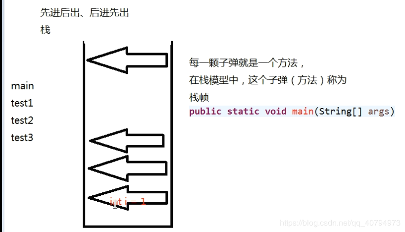

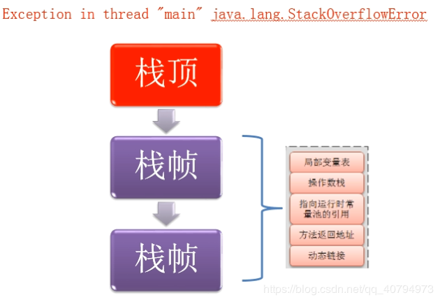

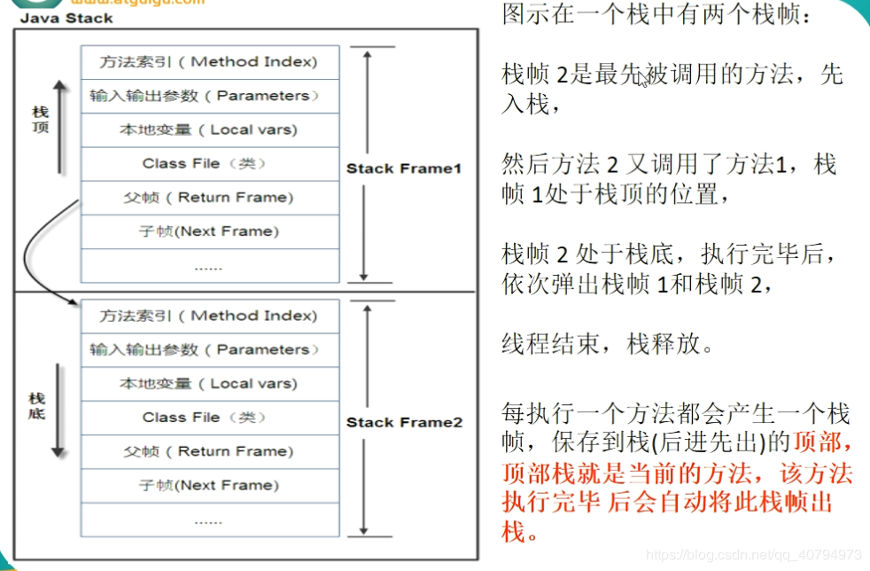

## 

```java
public class StackDemo {
	public static void sayHello() {
		sayHello();
	}
	public static void main(String[] args) {
		sayHello();
	}
}
```

Exception in  ——thread "main" java.lang.StackOverflowError

* * *

## **方法区**

> 1：方法区是线程共享的，通常用来保存装载的类的元结构信息。
> 
> 比如：运行时常量池+静态变量+常量+字段+方法字节码+在类/实例/接口初始化用到的特殊方法等。
> 
> 2：通常和永久区关联在一起(Java7之前)，但具体的跟JVM的实现和版本有关。

* * *

# 堆体系结构概述

Heap堆(**Java7****之前**)

一个JVM实例只存在一个堆内存，堆内存的大小是可以调节的。类加载器读取了类文件后，需要把类、方法、常变量放到堆内存中，保存所有引用类型的真实信息，以方便执行器执行。

**堆内存****逻辑上****分为三部分：新生****+****养老****+****永久**

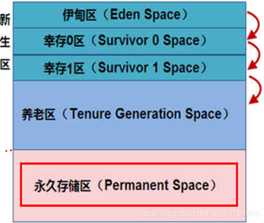

* * *

### **新生区**

新生区是类的诞生、成长、消亡的区域，一个类在这里产生，应用，最后被垃圾回收器收集，结束生命。新生区又分为两部分： 伊甸区（Eden space）和幸存者区（Survivor pace） ，所有的类都是在伊甸区被new出来的。幸存区有两个： 0区（Survivor 0 space）和1区（Survivor 1 space）。当伊甸园的空间用完时，程序又需要创建对象，JVM的垃圾回收器将对伊甸园区进行垃圾回收(Minor GC)，将伊甸园区中的不再被其他对象所引用的对象进行销毁。然后将伊甸园中的剩余对象移动到幸存0区.若幸存0区也满了，再对该区进行垃圾回收，然后移动到1区。那如果1区也满了呢？再移动到养老区。若养老区也满了，那么这个时候将产生MajorGC（FullGC），进行养老区的内存清理。若养老区执行了Full GC之后发现依然无法进行对象的保存，就会产生OOM异常“**OutOfMemoryError**”。

* * *

### **养老区**

养老区用于保存从新生区筛选出来的 JAVA 对象，一般池对象都在这个区域活跃。 

* * *

### 永久区

永久存储区是一个常驻内存区域，用于存放JDK自身所携带的Class，Interface 的元数据，也就是说它存储的是运行环境必须的类信息，被装载进此区域的数据是不会被垃圾回收器回收掉的，关闭 JVM 才会释放此区域所占用的内存

如果出现**java.Lang.OutofMemoryerror：PermGen space**，**说明是Java虚拟机对永久代Perm内存设置不够。一般出现这种情况，都是程序启动需要加载大量的第三方jar包。例如：在一个 Tomcat下部署了太多的应用。或者大量动态反射生成的类不断被加载，最终导致Perm区被占满。**

> - Jdk1.6及之前：           有永久代，常量池1.6在方法区
> - Jdk1.7：                      有**永久代**，但已经逐步“去永久代”，常量池1.7在堆
> - Jdk1.8及之后：           无永久代，常量池1.8在**元空间**

注：谁是空的谁就是 1区，(1，0)直接交换

> 如果出现java.lang.OutOfMemoryError: Java heap space异常，说明Java虚拟机的堆内存不够。原因有二：
> 
> （1）Java虚拟机的堆内存设置不够，可以通过参数-Xms、-Xmx来调整
> 
> （2）代码中创建了大量大对象，并且长时间不能被垃圾收集器收集（存在被引用）
> 
> 注释： -Xms、 -X 固定写法，m，单位 M s start 开始，-Xmx x max 最大

* * *

# 程序内存划分小总结 

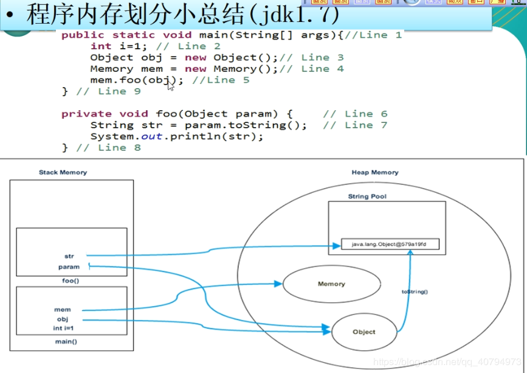

 String 是在字符串常量池里面，6的这个常量池在方法区，7在堆中，8在元空间。

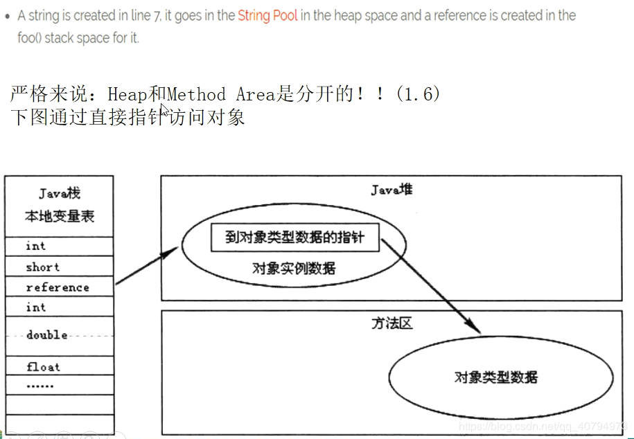

实际而言，方法区（Method area）和堆一样，是各个线程共享的内存区域，它用于存储虚拟机加载的：类信息+普通常量+静态常量+编译器编译后的代码等等，虽然 **JVM 规范将方法区描述为堆的一个逻辑部分**，但它却还有一个别名叫做Non-Heap（非堆），目的就是要和堆分开。（理解：虽然我们从小受到的教育规范，将台湾描述为中国的一个逻辑部分，但台湾还有个别名——中华民国，目的就是要和中国大陆分开）

对于 Hotspot 虚拟机，很多开发者习惯将方法区称之为 “永久代(Parmanent Gen)”，但严格本质上说两者不同，或者说**使用永久代来实现方法区而**已，**永久代是方法区（相当于是一个接口 interface）的一个实现**，jdk1.7的版本中，已经将原本放在永久代的字符串常量池移走。

常量池（Constant Pool）是方法区的一部分，Class 文件除了有类的版本、字段、方法、接口等描述信息外，还有一项信息就是常量池，这部分内容将在类加载后进入方法区的运行时常量池中存放。

 java7 及以前：

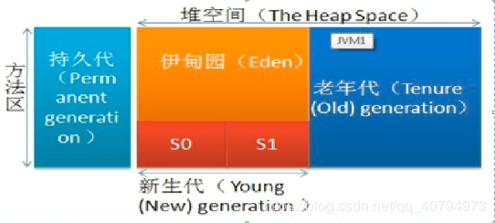

**永久代（实现类 ArrayList） ，实现了 方法区（接口 List）** 。

* * *

# 堆参数调优入门

> 所谓的优化是优化共有的，私有的方法不用优化，也优化不了

* * *

## **Java7**

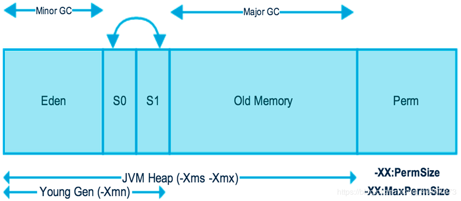

 逻辑上有三块构成 新生 \+ 养老 \+ 永久 ，但是实际上只有两块 新生 \+ 养老。永久又被称为非堆内存（java8的元空间也是一个道理）

* * *

## **Java8**

> 1. **JDK 1.8之后将最初的永久代取消了，由元空间取代**
> 2. 目的：将 HotSpot与 JRockitl两个虚拟机标准二合一，诞生了新的 java 规范（oracle版的java8）

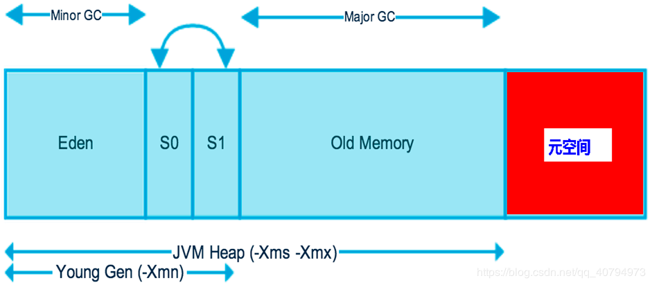

注意：真正的堆内存，实际上只有前两部分构成，并不包含第三部分，第三部分（java7以前的 永久区， java8 的元空间 ）只是一个逻辑包含。 

* * *

## **堆内存调优**

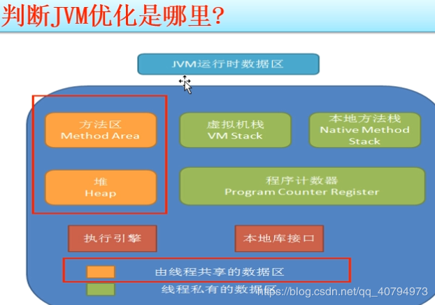

###  •**（堆内存调优简介01）**

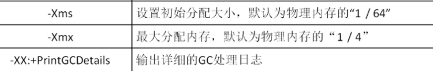

```java
public static void main(String[] args) {
	long maxMemory = Runtime.getRuntime().maxMemory() ;//返回 Java 虚拟机试图使用的最大内存量。
	long totalMemory = Runtime.getRuntime().totalMemory() ;//返回 Java 虚拟机中的内存总量。
	System.out.println("MAX_MEMORY = " + maxMemory + "（字节）、" + (maxMemory / (double)1024 / 1024) + "MB");
	System.out.println("TOTAL_MEMORY = " + totalMemory + "（字节）、" + (totalMemory / (double)1024 / 1024) + "MB");  

}

//1GB=1024MB  1MB=1024KB 
```

注释： -Xms、 -X 固定写法，m，单位 M s start 开始，-Xmx x max 最大

* * *

### •**（堆内存调优简介02）**

发现默认的情况下分配的内存是总内存的“1 / 4”、而初始化的内存为“1 / 64”

 演示 （8G 内存）： 

> MAX\_MEMORY = 2118123520（字节）、2020.0MB
> 
> TOTAL\_MEMORY = 134217728（字节）、128.0MB
> 
> 2020.0MB \* 4 = 8080 约等于 8 \* 1024 = 8192

VM参数：  -Xms1024m -Xmx1024m -XX:+PrintGCDetails

都设置成 1G 的大小 

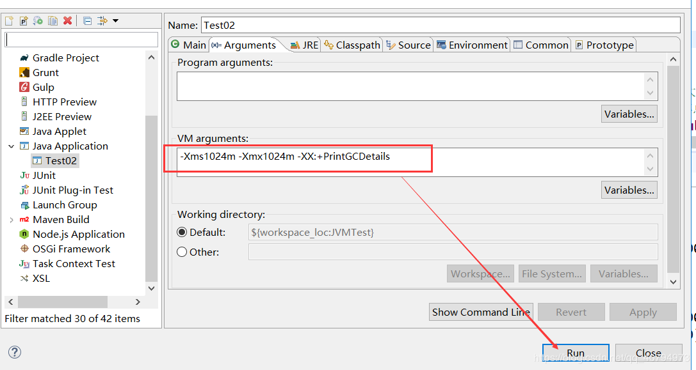

> MAX\_MEMORY = 1029177344（字节）、981.5MB
> 
> TOTAL\_MEMORY = 1029177344（字节）、981.5MB
> 
> Heap
> PSYoungGen      total 305664K, used 15729K [0x00000000eab00000, 0x0000000100000000, 0x0000000100000000)
> 
>   eden space 262144K, 6% used [0x00000000eab00000,0x00000000eba5c420,0x00000000fab00000)
> 
>   from space 43520K, 0% used [0x00000000fd580000,0x00000000fd580000,0x0000000100000000)
> 
>   to   space 43520K, 0% used [0x00000000fab00000,0x00000000fab00000,0x00000000fd580000)
> ParOldGen       total 699392K, used 0K [0x00000000c0000000, 0x00000000eab00000, 0x00000000eab00000)
> 
>   object space 699392K, 0% used [0x00000000c0000000,0x00000000c0000000,0x00000000eab00000)
> Metaspace       used 2749K, capacity 4486K, committed 4864K, reserved 1056768K
> 
>   class space    used 302K, capacity 386K, committed 512K, reserved 1048576K

验证：（305664K（新生去） + 699392K（养老区））/1024  = 981.5MB

##  •**（堆内存调优简介03）此图为java7，上面演示为8**

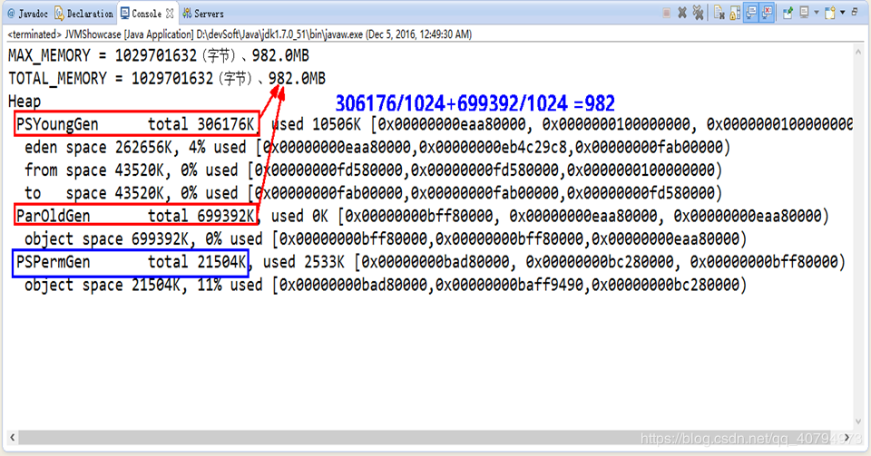

* * *

### •**（堆内存调优简介04）**

**自动触发垃圾回收**

```java
String str = "www.***.com" ;
while(true) 
{
str += str + new Random().nextInt(88888888) + new Random().nextInt(999999999) ;//字符串很少重复 不断地填充堆空间
}

```

 调小堆内存，方便演示：

VM参数：-Xms8m -Xmx8m -XX:+PrintGCDetails

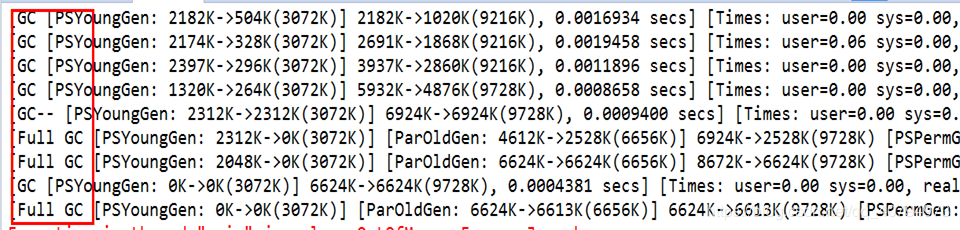

> [GC (Allocation Failure) [PSYoungGen: 1444K->510K(2048K)] 1444K->1038K(7680K), 0.0011469 secs] [Times: user=0.00 sys=0.00, real=0.00 secs] 
> 
> [GC (Allocation Failure) [PSYoungGen: 1640K->504K(2048K)] 2168K->1731K(7680K), 0.0008227 secs] [Times: user=0.00 sys=0.00, real=0.00 secs] 
> 
> [Full GC (Ergonomics) [PSYoungGen: 1414K->0K(2048K)] [ParOldGen: 5627K->3179K(5632K)] 7041K->3179K(7680K), [Metaspace: 2704K->2704K(1056768K)], 0.0057323 secs] [Times: user=0.00 sys=0.00, real=0.01 secs] 
> 
> [GC (Allocation Failure) [PSYoungGen: 0K->32K(2048K)] 4938K->4970K(7680K), 0.0005466 secs] [Times: user=0.00 sys=0.00, real=0.00 secs] 
> 
> [Full GC (Ergonomics) [PSYoungGen: 32K->0K(2048K)] [ParOldGen: 4938K->2297K(5632K)] 4970K->2297K(7680K), [Metaspace: 2704K->2704K(1056768K)], 0.0059569 secs] [Times: user=0.00 sys=0.00, real=0.01 secs] 
> 
> [GC (Allocation Failure) [PSYoungGen: 30K->0K(2048K)] 4087K->4057K(7680K), 0.0004661 secs] [Times: user=0.01 sys=0.00, real=0.00 secs] 
> 
> [GC (Allocation Failure) [PSYoungGen: 0K->0K(2048K)] 4057K->4057K(7680K), 0.0003690 secs] [Times: user=0.00 sys=0.00, real=0.00 secs] 
> 
> [Full GC (Allocation Failure) [PSYoungGen: 0K->0K(2048K)] [ParOldGen: 4057K->4057K(5632K)] 4057K->4057K(7680K), [Metaspace: 2704K->2704K(1056768K)], 0.0021665 secs] [Times: user=0.00 sys=0.00, real=0.00 secs] 
> 
> [GC (Allocation Failure) [PSYoungGen: 0K->0K(2048K)] 4057K->4057K(7680K), 0.0003964 secs] [Times: user=0.00 sys=0.00, real=0.00 secs] 
> 
> [**Full GC** (Allocation Failure) [PSYoungGen: 0K->0K(2048K)] [ParOldGen: 4057K->4043K(5632K)] 4057K->4043K(7680K), [Metaspace: 2704K->2704K(1056768K)], 0.0070502 secs] [Times: user=0.00 sys=0.00, real=0.01 secs] 
> Exception in thread "main" java.lang.**OutOfMemoryError**: Java heap space
> 
>     at java.util.Arrays.copyOf(Unknown Source)
> 
>     at java.lang.AbstractStringBuilder.ensureCapacityInternal(Unknown Source)
> 
>     at java.lang.AbstractStringBuilder.append(Unknown Source)
> 
>     at java.lang.StringBuilder.append(Unknown Source)
> 
>     at com.atguigu.test.Test02.main(Test02.java:9)

养老区才会报，**OutOfMemoryError**

 eclipse MAT 插件分析内存泄漏：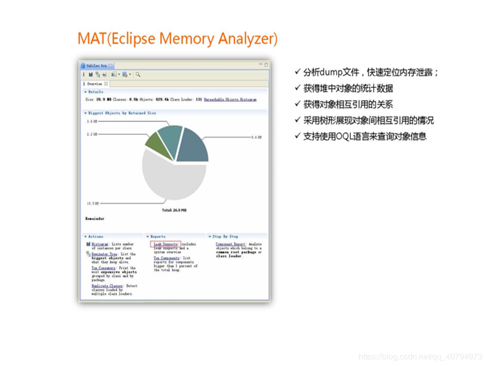

[官网下载插件： ](https://www.eclipse.org/mat/downloads.php)

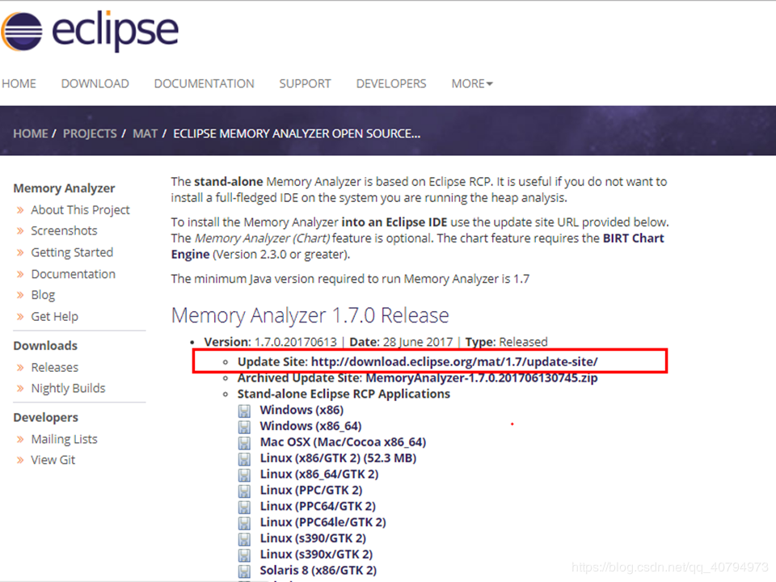

安装： [https://download.eclipse.org/mat/1.8.1/update-site/](https://download.eclipse.org/mat/1.8.1/update-site/)

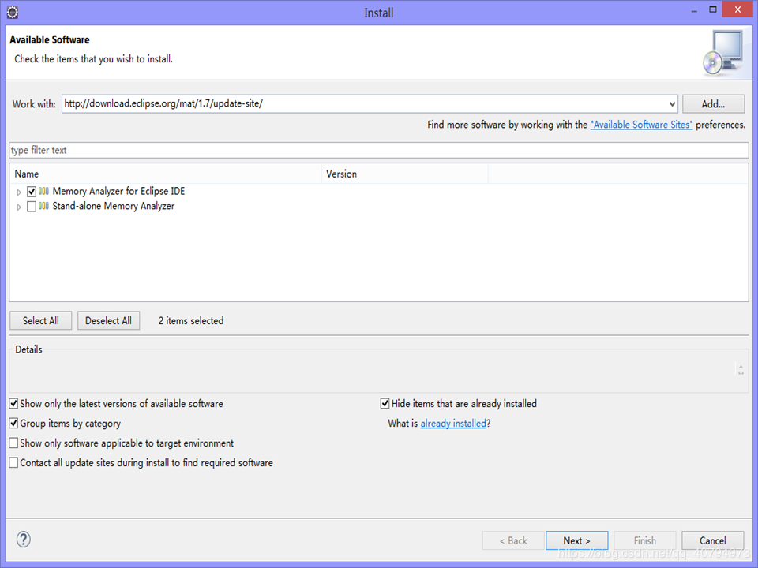

> **-XX:+****HeapDumpOnOutOfMemoryError**
> 
> **OOM****时导出堆到****hprof****文件。**

**-Xms1m -Xmx8m -XX:+HeapDumpOnOutOfMemoryError**

```java
import java.util.ArrayList;
import java.util.List;
public class Test03 {
	byte[] byteArray = new byte[1*1024*1024];//1MB
	public static void main(String[] args) {
		List<Test03> list = new ArrayList<>();
		try {
			for(int i = 1; i <= 40; i++) {
				list.add(new Test03());
			}
		}catch (Exception e) {
			e.printStackTrace();
		}

	}
}

```

> java.lang.OutOfMemoryError: Java heap space
> 
> Dumping heap to java\_pid16188.hprof ...
> 
> Heap dump file created [6488096 bytes in 0.010 secs]
> Exception in thread "main" java.lang.**OutOfMemoryError**: Java heap space
> 
>     at com.atguigu.test.Test03.<init>(Test03.java:7)
> 
>     at com.atguigu.test.Test03.main(Test03.java:12)

刷新工程， 找到内存快照文件：

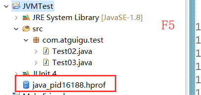

打开： 

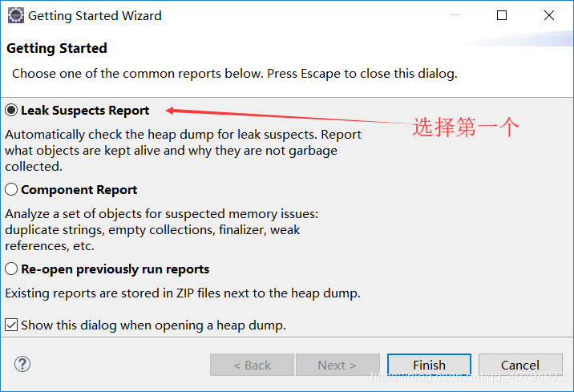

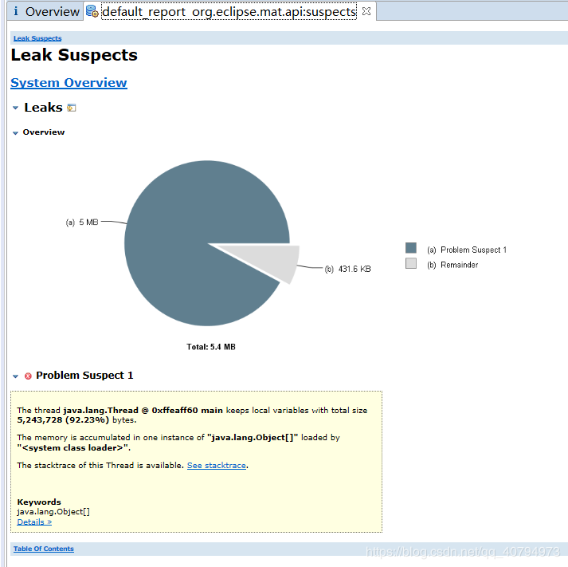

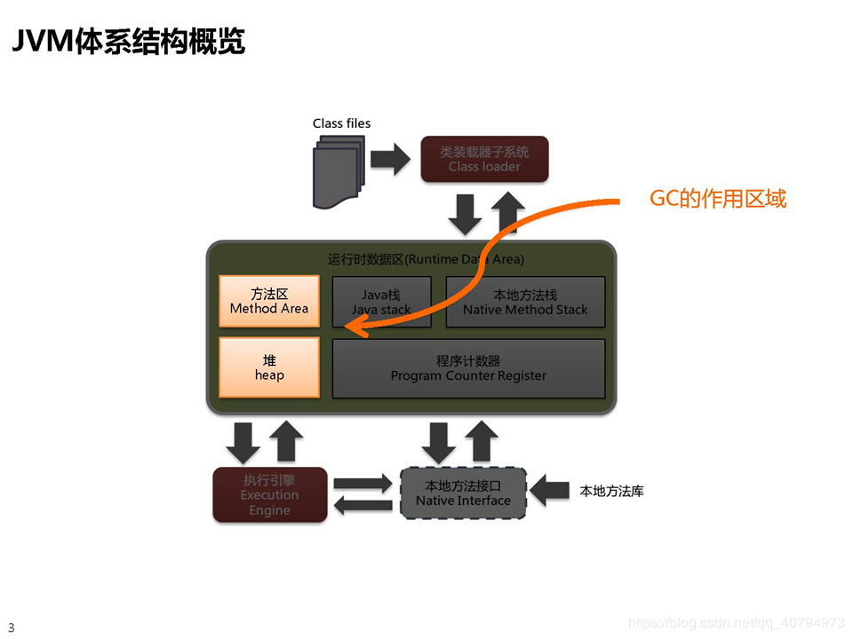

* * *

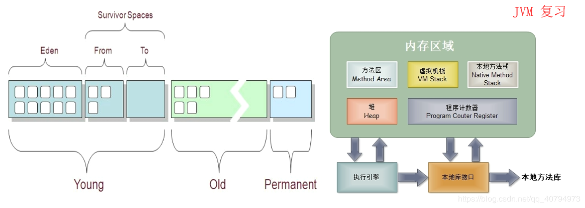

[https://my.oschina.net/wangsifangyuan/blog/711329](https://my.oschina.net/wangsifangyuan/blog/711329)

[原文](https://blog.csdn.net/qq_40794973/article/details/87554692)