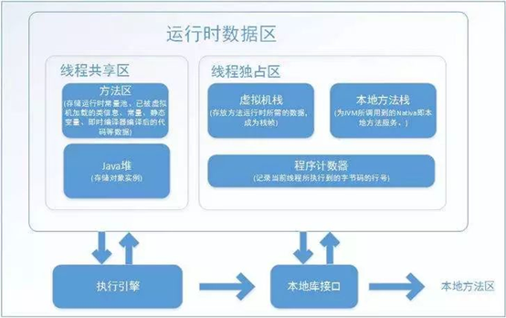
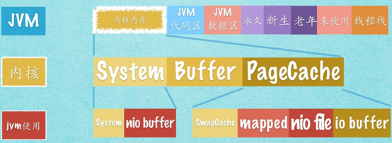

# 从linux进程角度看JVM内存模型

普通进程栈区，在JVM一般仅仅用做线程栈,如下图所示

首先是永久代。**永久代本质上是Java程序的代码区和数据区**。Java程序中类（class），会被加载到整个区域的不同数据结构中去，包括常量池、域、方法数据、方法体、构造函数、以及类中的专用方法、实例初始化、接口初始化等。这个区域对于操作系统来说，是堆的一个部分；而对于Java程序来说，这是容纳程序本身及静态资源的空间，使得JVM能够解释执行Java程序。

其次是新生代和老年代。新生代和老年代才是Java程序真正使用的堆空间，主要用于内存对象的存储；

那么这些区域如何对应JVM的内存模型呢,首先看一张经典的JVM内存模型图:

**线程栈:**
在JVM中用做线程栈,每个线程都会在这个区域开辟私有栈

程序计数器是一块较小的内存空间,它可以看做是当前线程所执行的字节码的行号指示器,字节码解释器通过改变这个计数器的值来选取下一条需要执行的字节码指令,分支循环,跳转,异常处理,线程恢复等基础功能,特别注意的是,如果线程正在执行的是一个java方法那这个计数器记录的是字节码指令的地址(位置),如果是执行的是Native方法,这个计数器为空

程序计数器该部分内存是唯一不会发生OutOfMemoryError异常的区域

java虚拟机栈,也在这个线程栈中,线程私有,每个方法执行的同时都会创建一个栈帧,用于存储局部变量表,操作数栈,动态链接,方法出口等信息.

局部变量表,存放了编译期可知的各种基本数据类型(boolean,byte,char short,int float,long,double),对象引用(reference,指向对象的指针,或者代表对象的句柄)和returnAddress类型

在jvm规范中,对这个区域规定了两种异常状况:1.如果线程请求的的栈深度大于虚拟机所允许的深度,将抛出StackOverFlowError异常,如果虚拟机栈可以动态扩展,扩展时无法申请到足够的内存将抛出OutOfMemoryError异常

本地方法栈,与虚拟机栈的作用非常相似,只不过是服务于Native方法,也会抛出两种异常

linux的普通进程所使用的堆区,在jvm(Hotspot)进程中分为永久新生老年代三块区域

**永久代** ,对应于 jvm的方法区,

方法区:用于存储已经被虚拟机加载的类信息,常量,静态变量,即时编译器编译后的代码,等数据.要特别注意的是.方法区和永久代并不是等价的,这要取决于虚拟机的类型,紧紧是因为HotSpot使用永久代来实现方法区.对于其他虚拟机并不存在永久代的概念,

运行时常量池是方法区的一部分,因此它也在永久代,用于存储编译期间生成的各种字面量和符号引用,什么叫字面量呢,就是int i =1;这个1就是字面量,String str= "abc";这个abc是字面量,什么叫符号引用呢,就是在一个类中Student stu = new Student("张三",28) new出来的Student对象在编译后未加载前显然不知道其实际内存地址,因此在class文件中用一串无异议的符号来代替对象的内存首地址,等class文件经过一系列的加载检验之后分配完内存,会将符号引用替换成直接引用

**新生代和老年代**

Java堆:新生代和老年代才是对应于JVm内存模型中的java堆,它是被所有线程共享的一个内存区域,在虚拟机启动时创建.它的唯一目的就是存放对象实例,几乎所有的对象实例都在这里分配内存,包括数组

java堆是垃圾收集器管理的主要区域,因此,很多时候也被称为GC堆,由于现在收集器基本都采用分代收集算法,所以Java堆细分为新生代和老年代;再细致一点的有Eden空间,FROM Survivor空间,To Survivor空间等.

从内存分配的角度来看,线程共享的java堆中可能划分出多个线程私有的分配缓冲区(Thread Local Allocation Buffer TLAB),进一步划分是为了更好的回收内存,或者更快的分配内存.

根据JVM规范,java堆可以处于物理上不连续的内存空间中,只要逻辑上是连续的就可以,如果在堆中内有内存完成实例分配,并且对无法扩展出足够的内存,将会抛出OutOfMemoryError异常

JVM中的直接内存,并不是虚拟机运行时数据区的一部分,也不是Java虚拟机规范中定义的内存区域,但是这部分内存也被频繁地使用,而且也可能导致OutOfMemoryError,

在jdk1.4中新加入了NIO类,引入了一种基于通道(Channel)与缓冲区(BUffer)的IO方式,它可以使用Native函数库直接分配内存,然后通过一个存储在java堆中的DirectByteBuffer对象作为这块内存引用进行操作,这样能在一些场景中显著提高性能,因为避免了Java堆和Native堆中来回复制数据.如下图:NIO使用的堆外内存

显然,本机直接内存的分配不会受到Java堆大小的限制,但是,既然是内存,肯定还是会受到本机总存的(包括RAM以及swap区域或者分页文件),大小以及处理器寻址空间的限制.服务器管理员在配置虚拟机参数时,会根据实际内存设置-Xmx等参数信息.但经常忽略直接内存,使得各个内存区域总和大于物理内存限制(包括物理的和操作系统级的限制),从而导致动态扩展时出现OutOfMemoryError异常