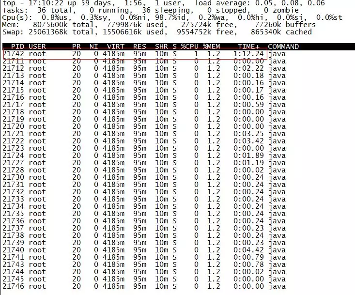
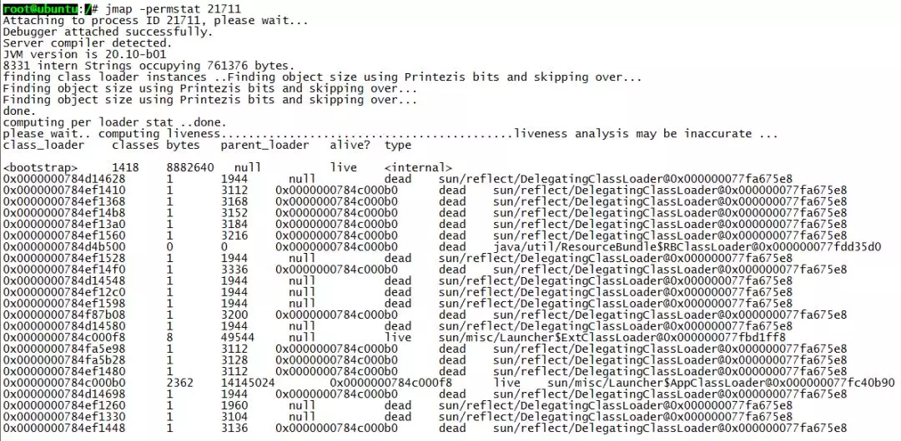
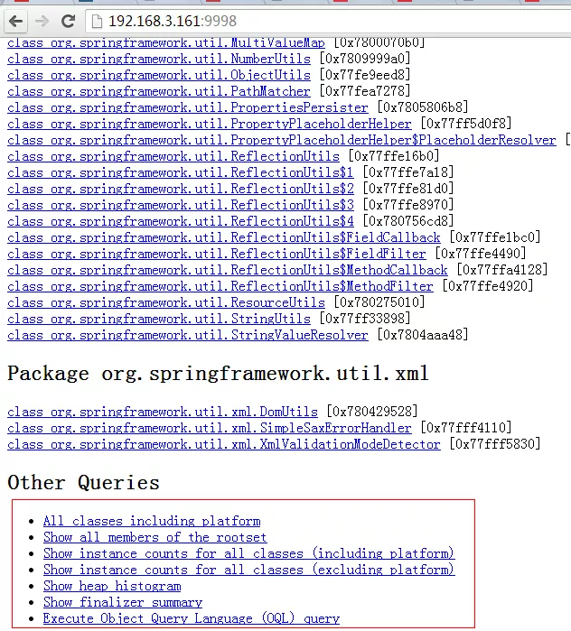

<!-- toc -->
[TOC]
# JVM 性能调优监控工具 jps、jstack、jmap、jhat、jstat、hprof 使用详解

现实企业级Java应用开发、维护中，有时候我们会碰到下面这些问题： 

*   OutOfMemoryError，内存不足    
*   内存泄露    
*   线程死锁    
*   锁争用（Lock Contention）    
*   Java进程消耗CPU过高    
*   ......

这些问题在日常开发、维护中可能被很多人忽视（比如有的人遇到上面的问题只是重启服务器或者调大内存，而不会深究问题根源），但能够理解并解决这些问题是Java程序员进阶的必备要求。本文将对一些常用的JVM性能调优监控工具进行介绍，希望能起抛砖引玉之用。  

## 一、 jps (Java Virtual Machine Process Status Tool) -- 基础工具
jps主要用来输出JVM中运行的进程状态信息。语法格式如下：  

    jps [options] [hostid]  

如果不指定hostid就默认为当前主机或服务器。 
命令行参数选项说明如下： 

    -q 不输出类名、Jar名和传入main方法的参数
    -m 输出传入main方法的参数
    -l 输出main类或Jar的全限名
    -v 输出传入JVM的参数
---
    jps -q (只查询虚拟机进程ID)
    jps -m (启动时传递main()的参数)
    jps -l(输出类全名，或者jar路径)
    jps -v(输出虚拟机进程启动参数)


比如下面：

    root@ubuntu:/# jps -m -l
    2458 org.artifactory.standalone.main.Main /usr/local/artifactory-2.2.5/etc/jetty.xml
    29920 com.sun.tools.hat.Main -port 9998 /tmp/dump.dat
    3149 org.apache.catalina.startup.Bootstrap start
    30972 sun.tools.jps.Jps -m -l8247 org.apache.catalina.startup.Bootstrap start
    25687 com.sun.tools.hat.Main -port 9999 dump.dat21711 mrf-center.jar

  

## 二、 jstack (Stack Trace for Java) -- 显示虚拟机线程快照

  

jstack主要用来查看某个Java进程内的线程堆栈信息。语法格式如下：  

    jstack [option] pid
    jstack [option] executable core
    jstack [option] [server-id@]remote-hostname-or-ip  

命令行参数选项说明如下：  

    -l long listings，会打印出额外的锁信息，
    在发生死锁时可以用jstack -l pid来观察锁持有情况-m mixed mode，
    不仅会输出Java堆栈信息，还会输出C/C++堆栈信息（比如Native方法）  
举例
1. 显示关于锁的附加信息
jstack -l 21888
2. 显示本地方法C/C++的堆栈
jstack -m 21888

jstack可以定位到线程堆栈，根据堆栈信息我们可以定位到具体代码，所以它在JVM性能调优中使用得非常多。下面我们来一个实例找出某个Java进程中最耗费CPU的Java线程并定位堆栈信息，用到的命令有ps、top、printf、jstack、grep。  

第一步先找出Java进程ID，我部署在服务器上的Java应用名称为mrf-center：  

    root@ubuntu:/# ps -ef | grep mrf-center | grep -v grep
    root     21711     1  1 14:47 pts/3    00:02:10 java -jar mrf-center.jar  

得到进程ID为21711，第二步找出该进程内最耗费CPU的线程，可以使用ps -Lfp pid或者ps -mp pid -o THREAD, tid, time或者top -Hp pid，我这里用第三个，输出如下：  

  

TIME列就是各个Java线程耗费的CPU时间，CPU时间最长的是线程ID为21742的线程，用  

    printf "%x"
    21742  

得到21742的十六进制值为54ee，下面会用到。     

OK，下一步终于轮到jstack上场了，它用来输出进程21711的堆栈信息，然后根据线程ID的十六进制值grep，如下：  

    root@ubuntu:/# jstack 21711 | grep 54ee
    "PollIntervalRetrySchedulerThread" prio=10 tid=0x00007f950043e000 nid=0x54ee in Object.wait() [0x00007f94c6eda000]  

可以看到CPU消耗在PollIntervalRetrySchedulerThread这个类的Object.wait()，我找了下我的代码，定位到下面的代码：  

    // Idle wait
    getLog().info("Thread [" + getName() + "] is idle waiting...");
    schedulerThreadState = PollTaskSchedulerThreadState.IdleWaiting;
    long now = System.currentTimeMillis();
    long waitTime = now + getIdleWaitTime();
    long timeUntilContinue = waitTime - now;
    synchronized(sigLock) {try {    
        if(!halted.get()) {    
            sigLock.wait(timeUntilContinue);    
            }   
        } catch (InterruptedException ignore) { 

        }
    }  

它是轮询任务的空闲等待代码，上面的sigLock.wait(timeUntilContinue)就对应了前面的Object.wait()。
  
举例：
1. 每秒查询1次进程21888垃圾收集情况，一共查询20次
jstat -gc 21888 1000 20
jstat -gccapacity 21888 1000 20 (最大最小空间)
jstat -gcutil 21888 1000 20 (占的百分比)
jstat -gccause 21888 1000 20 (额外输出导致上一次CG产生的原因)
2. 被JIT编译过的方法
jstat -printcompilation 21888 1000 20

## 三、 jmap（Memory Map）-- 生成虚拟机内存快照 和 jhat（Java Heap Analysis Tool）-- 分析heapdump文件  

jmap导出堆内存，然后使用jhat来进行分析 
jmap语法格式如下：  

    jmap [option] pidjmap [option] executable corejmap [option] [server-id@]remote-hostname-or-ip  

举例：
1. 导出虚拟机进程的dump文件（MemoryAnalyzer，jhat查看）
jmap -dump:live,format=b,file=d:/jvm.bin 21888
2. 打印进程堆信息
jmap -heap 21888
3. 显示堆中的对象的统计的前10条
jmap -histo 21888 | head 10

如果运行在64位JVM上，可能需要指定-J-d64命令选项参数。  

    jmap -permstat pid  

打印进程的类加载器和类加载器加载的持久代对象信息，输出：类加载器名称、对象是否存活（不可靠）、对象地址、父类加载器、已加载的类大小等信息，如下图：  

  

使用jmap -heap pid查看进程堆内存使用情况，包括使用的GC算法、堆配置参数和各代中堆内存使用情况。比如下面的例子：  

    root@ubuntu:/# jmap -heap 21711
    Attaching to process ID 21711, please wait...
    Debugger attached successfully.
    Server compiler detected.
    JVM version is 20.10-b01
    
    using thread-local object allocation.
    Parallel GC with 4 thread(s)
    
    Heap Configuration:
    MinHeapFreeRatio = 40   
    MaxHeapFreeRatio = 70   
    MaxHeapSize      = 2067791872 (1972.0MB)
    NewSize          = 1310720 (1.25MB)
    MaxNewSize       = 17592186044415 
    MBOldSize          = 5439488 (5.1875MB)
    NewRatio         = 2   
    SurvivorRatio    = 8   
    PermSize         = 21757952 (20.75MB)
    MaxPermSize      = 85983232 (82.0MB)

    Heap Usage:
    PS Young Generation
    Eden Space:   
    capacity = 6422528 (6.125MB)   
    used     = 5445552 (5.1932830810546875MB)   
    free     = 976976 (0.9317169189453125MB)   84.78829520089286% used
    From Space:   
    capacity = 131072 (0.125MB)   
    used     = 98304 (0.09375MB)   
    free     = 32768 (0.03125MB)   75.0% used
    To Space:   capacity = 131072 (0.125MB)   
    used     = 0 (0.0MB)   
    free     = 131072 (0.125MB)   0.0% used
    PS Old Generation   
    capacity = 35258368 (33.625MB)   
    used     = 4119544 (3.9287033081054688MB)   
    free     = 31138824 (29.69629669189453MB)   11.683876009235595% used
    PS Perm Generation   
    capacity = 52428800 (50.0MB)   
    used     = 26075168 (24.867218017578125MB)   
    free     = 26353632 (25.132781982421875MB)   49.73443603515625% used   
    ....

  

使用jmap -histo[:live] pid查看堆内存中的对象数目、大小统计直方图，如果带上live则只统计活对象，如下：
  
```
root@ubuntu:/# jmap -histo:live 21711 | more 
num     #instances         #bytes  class name----------------------------------------------
   1:         38445        5597736  <constMethodKlass>
   2:         38445        5237288  <methodKlass>
   3:          3500        3749504  <constantPoolKlass>
   4:         60858        3242600  <symbolKlass>
   5:          3500        2715264  <instanceKlassKlass>
   6:          2796        2131424  <constantPoolCacheKlass>
   7:          5543        1317400  [I
   8:         13714        1010768  [C
   9:          4752        1003344  [B
  10:          1225         639656  <methodDataKlass>
  11:         14194         454208  java.lang.String
  12:          3809         396136  java.lang.Class
  13:          4979         311952  [S
  14:          5598         287064  [[I
  15:          3028         266464  java.lang.reflect.Method
  16:           280         163520  <objArrayKlassKlass>
  17:          4355         139360  java.util.HashMap$Entry
  18:          1869         138568  [Ljava.util.HashMap$Entry;
  19:          2443          97720  java.util.LinkedHashMap$Entry
  20:          2072          82880  java.lang.ref.SoftReference
  21:          1807          71528  [Ljava.lang.Object;
  22:          2206          70592  java.lang.ref.WeakReference
  23:           934          52304  java.util.LinkedHashMap
  24:           871          48776  java.beans.MethodDescriptor
  25:          1442          46144  java.util.concurrent.ConcurrentHashMap$HashEntry
  26:           804          38592  java.util.HashMap
  27:           948          37920  java.util.concurrent.ConcurrentHashMap$Segment
  28:          1621          35696  [Ljava.lang.Class;
  29:          1313          34880  [Ljava.lang.String;
  30:          1396          33504  java.util.LinkedList$Entry
  31:           462          33264  java.lang.reflect.Field
  32:          1024          32768  java.util.Hashtable$Entry
  33:           948          31440  [Ljava.util.concurrent.ConcurrentHashMap$HashEntry;
``` 

class name是对象类型，说明如下：

```
B  byte
C  char
D  double
F  float
I  int
J  long
Z  boolean
[  数组，如[I表示int[]
[L+类名 其他对象
```
  

还有一个很常用的情况是：用jmap把进程内存使用情况dump到文件中，再用jhat分析查看。jmap进行dump命令格式如下：  

    jmap -dump:format=b,file=dumpFileName pid  

我一样地对上面进程ID为21711进行Dump：  
```
root@ubuntu:/# jmap -dump:format=b,file=/tmp/dump.dat 21711     
Dumping heap to /tmp/dump.dat ...
Heap dump file created
``` 

dump出来的文件可以用MAT、VisualVM等工具查看，这里用jhat查看：  

```
root@ubuntu:/# jhat -port 9998 /tmp/dump.dat
Reading from /tmp/dump.dat...
Dump file created Tue Jan 28 17:46:14 CST 2014Snapshot read, resolving...
Resolving 132207 objects...
Chasing references, expect 26 dots..........................
Eliminating duplicate references..........................
Snapshot resolved.
Started HTTP server on port 9998Server is ready.
```
  

注意如果Dump文件太大，可能需要加上-J-Xmx512m这种参数指定最大堆内存，即jhat -J-Xmx512m -port 9998 /tmp/dump.dat。然后就可以在浏览器中输入主机地址:9998查看了：  

  

上面红线框出来的部分大家可以自己去摸索下，最后一项支持OQL（对象查询语言）。
  
jhat(Java Heap Dump Browser)--分析heapdump文件

举例：
1. 查看dump文件
jhat d:\\jvm.bin(在浏览器查看，默认端口7000)


## 四、jstat(JVM Statistics MOnitoring Toll) -- JVM统计监测工具 

看看各个区内存和GC的情况  

语法格式如下：  

    jstat [ generalOption | outputOptions vmid [interval[s|ms] [count]] ]

vmid是Java虚拟机ID，在Linux/Unix系统上一般就是进程ID。interval是采样时间间隔。count是采样数目。比如下面输出的是GC信息，采样时间间隔为250ms，采样数为4：

```
root@ubuntu:/# jstat -gc 21711 250 4 
S0C    S1C    S0U    S1U      EC       EU        OC         OU       PC     PU    YGC     YGCT    FGC    FGCT     GCT   
192.0  192.0   64.0   0.0    6144.0   1854.9   32000.0     4111.6   55296.0 25472.7    702    0.431   3      0.218    0.649
192.0  192.0   64.0   0.0    6144.0   1972.2   32000.0     4111.6   55296.0 25472.7    702    0.431   3      0.218    0.649
192.0  192.0   64.0   0.0    6144.0   1972.2   32000.0     4111.6   55296.0 25472.7    702    0.431   3      0.218    0.649
192.0  192.0   64.0   0.0    6144.0   2109.7   32000.0     4111.6   55296.0 25472.7    702    0.431   3      0.218    0.649
```
  

要明白上面各列的意义，先看JVM堆内存布局：  

  

可以看出：  

    堆内存 = 年轻代 + 年老代 + 永久代
    年轻代 = Eden区 + 两个Survivor区（From和To）  

现在来解释各列含义：  

    S0C、S1C、S0U、S1U：Survivor 0/1区容量（Capacity）和使用量（Used）
    EC、EU：Eden区容量和使用量
    OC、OU：年老代容量和使用量
    PC、PU：永久代容量和使用量
    YGC、YGT：年轻代GC次数和GC耗时
    FGC、FGCT：Full GC次数和Full GC耗时
    GCT：GC总耗时  

## 五、hprof（Heap/CPU Profiling Tool）-- CPU使用率，统计堆内存使用情况 

hprof能够展现CPU使用率，统计堆内存使用情况。  

语法格式如下：  

    java -agentlib:hprof[=options] ToBeProfiledClass
    java -Xrunprof[:options] ToBeProfiledClass
    javac -J-agentlib:hprof[=options] ToBeProfiledClass  

完整的命令选项如下：  

```
Option Name and Value  Description                    Default
---------------------  -----------                    -------
heap=dump|sites|all    heap profiling                 all
cpu=samples|times|old  CPU usage                      off
monitor=y|n            monitor contention             n
format=a|b             text(txt) or binary output     a
file=<file>            write data to file             java.hprof[.txt]
net=<host>:<port>      send data over a socket        off
depth=<size>           stack trace depth              4
interval=<ms>          sample interval in ms          10
cutoff=<value>         output cutoff point            0.0001
lineno=y|n             line number in traces?         y
thread=y|n             thread in traces?              n
doe=y|n                dump on exit?                  y
msa=y|n                Solaris micro state accounting n
force=y|n              force output to <file>         y
verbose=y|n            print messages about dumps     y
```  

来几个官方指南上的实例。  

CPU Usage Sampling Profiling(cpu=samples)的例子：
    java -agentlib:hprof=cpu=samples,interval=20,depth=3 Hello
  

上面每隔20毫秒采样CPU消耗信息，堆栈深度为3，生成的profile文件名称是java.hprof.txt，在当前目录。   

CPU Usage Times Profiling(cpu=times)的例子，它相对于CPU Usage Sampling Profile能够获得更加细粒度的CPU消耗信息，能够细到每个方法调用的开始和结束，它的实现使用了字节码注入技术（BCI）：  

    javac -J-agentlib:hprof=cpu=times Hello.java  

Heap Allocation Profiling(heap=sites)的例子：  

    javac -J-agentlib:hprof=heap=sites Hello.java  

Heap Dump(heap=dump)的例子，它比上面的Heap Allocation Profiling能生成更详细的Heap Dump信息：  

    javac -J-agentlib:hprof=heap=dump Hello.java  

虽然在JVM启动参数中加入-Xrunprof:heap=sites参数可以生成CPU/Heap Profile文件，但对JVM性能影响非常大，不建议在线上服务器环境使用

## 六、jinfo (Configuration Info for java) -- 显示虚拟机配置

举例：
1. 查看CMSInitiatingOccupancyFraction的参数值
jinfo -flag CMSInitiatingOccupancyFraction 21888 (1.6以上java -XX:PrintFlagsFinal)
2. 查询虚拟机进程系统属性
jinfo -sysprops 21888

## 七、visualvm 监控jvm利器
https://visualvm.github.io/download.html

## 八、jprofiler
https://www.ej-technologies.com/products/jprofiler/overview.html

## mat
MAT是Memory Analyzer tool的缩写，是一种快速，功能丰富的Java堆分析工具，能帮助你查找内存泄漏和减少内存消耗。很多情况下，我们需要处理测试提供的hprof文件，分析内存相关问题，那么MAT也绝对是不二之选。 Eclipse可以下载插件结合使用，也可以作为一个独立分析工具使用，下载地址：http://www.eclipse.org/mat/downloads.php

## jinfo 
通过jinfo查看Java进程运行的JVM参数，通过jinfo -h  查看命令。
我们先通过 jps查看PID，然后通过jinfo来查看 对应进程的参数信息。
查看 JVM参数：jinfo -flags pid
查看系统参数：jinfo -sysprops pid
查看启动脚本参数：jinfo -flag PrintGC pid
动态修改启动脚本参数：通过java -XX:+PrintFlagsFinal -version | grep manageable 查询可以修改的参数，以PrintGC为例，jinfo -flag -PrintGC pid 关闭GC日志，jinfo -flag +PrintGC pid 打开GC日志


## Arthas

## greys-anatomy
Java诊断工具 国产
https://github.com/oldmanpushcart/greys-anatomy

## 其它
VisualVm ,JProfiler,Perfino,Yourkit,Perf4J,JProbe
Visualvm,Perfino,yourkit和Jprofiler(推荐值按顺序依次递减)

YourKit 也有.net 分析