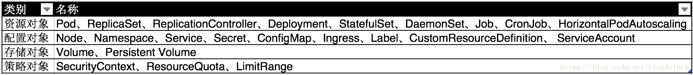

https://blog.csdn.net/cloudvtech/article/details/80277960
https://www.jianshu.com/p/0d10121ab283
https://www.jianshu.com/p/cc7eea6dd1fb
[TOC]
## 一、前言
Kubernetes平台对于分布式服务部署的很多重要的模块都有系统性的支持，借助如下一些平台资源可以满足大多数分布式系统部署和管理的需求：

但是在不同应用业务环境下，对于平台可能有一些特殊的需求，这些需求可以抽象为Kubernetes的扩展资源，而Kubernetes的CRD(CustomResourceDefinition)为这样的需求提供了轻量级的机制，保证新的资源的快速注册和使用。在更老的版本中，TPR(ThirdPartyResource)是与CRD类似的概念，但是在1.9以上的版本中被弃用，而CRD则进入的beta状态。

kubernetes允许用户自定义自己的资源对象，就如同deployment statefulset一样，这个应用非常广泛，比如prometheus opterator就自定义Prometheus对象，再加上一个自定义的controller监听到kubectl create Prometheus时就去创建Pod组成一个pormetheus集群。

https://github.com/kubernetes/sample-controller/tree/master/artifacts/examples

apiVersion: apiextensions.k8s.io/v1beta1
kind: CustomResourceDefinition

Admission Webhook
https://www.jianshu.com/p/39ae0b6fc907