<!--toc-->
[TOC]

# Envoy组件分析

Envoy是Istio数据平面核心组件，在Istio架构中起着非常重要的作用，本文首先介绍Envoy的基本概念及工作流程，再从Istio的设计角度出发，对Envoy在Istio中如何部署及如何对入站出站流量进行代理转发及流量劫持进行具体分析，最后通过实验加以验证。

## Envoy概述

Envoy 是以 C++ 开发的高性能代理，其内置服务发现、负载均衡、TLS终止、HTTP/2、GRPC代理、熔断器、健康检查，基于百分比流量拆分的灰度发布、故障注入等功能。

Envoy主要面向SOA（面向服务的架构）的网络代理，所以非常适用于微服务，其主要是用来调解Service Mesh中所有服务的入站和出站流量。架构如下图所示。

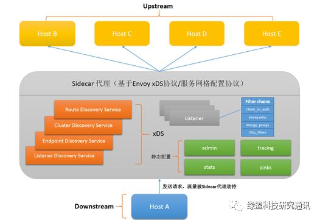

图1  Envoy架构图

下面首先介绍Envoy架构中的一些重要概念：

**Downstream：**下游主机，指连接到Envoy的主机，这些主机用来发送请求并接受响应。

**Upstream：**上游主机，指接收来自Envoy连接和请求的主机，并返回响应。

**Listener：**服务或程序的监听器， Envoy暴露一个或多个监听器监听下游主机的请求，当监听到请求时，通过Filter Chain把对请求的处理全部抽象为Filter， 例如ReadFilter、WriteFilter、HttpFilter等。

**Cluster：**服务提供集群，指Envoy连接的一组逻辑相同的上游主机。Envoy通过服务发现功能来发现集群内的成员，通过负载均衡功能将流量路由到集群的各个成员。

**xDS：**xDS中的x是一个代词，类似云计算里的XaaS可以指代IaaS、PaaS、SaaS等。DS为Discovery Service，即发现服务的意思。xDS包括cds (cluster discovery service)、rds (route discovery service)、eds (endpoint discovery service)、ads (aggregated discovery service)，其中ads称为聚合的发现服务，是对cds、rds、lds、eds服务的统一封装，解决cds、rds、lds、eds信息更新顺序依赖的问题，从而保证以一定的顺序同步各类配置信息。以上endpoint、cluster、route的概念介绍如下：

- **endpoint：**一个具体的“应用实例”，类似于k8s中的一个Pod；
    
- **cluster：**可以理解“应用集群”，对应提供相同服务的一个或多个endpoint， 类似k8s中Service概念，即一个Service提供多个相同服务的Pod；
    
- **route：**当我们做金丝雀发布部署时，同一个服务会有多个版本，这时需要route规则规定请求如何路由到其中的某个版本上。
    

xDS模块的功能是通过Envoy API V1（基于HTTP）或V2（基于gRPC）实现一个服务端将配置信息暴露给上游主机，等待上游主机的拉取。

Envoy正常的工作流程为Host A（下游主机）发送请求至上游主机（Host B、Host C、Host D等），Envoy通过Listener监听到有下游主机的请求，收到请求后的Envoy将所有请求流量劫持至Envoy内部，并将请求内容抽象为Filter Chains路由至某个上游主机中从而实现路由转发及负载均衡能力。

Envoy为了实现流量代理能力通常需要一个统一的配置文件来记录信息以便启动时加载，在Envoy中启动配置文件有静态配置和动态配置两种方式。静态配置是将配置信息写入文件中，启动时直接加载，动态配置通过xDS实现一个Envoy的服务端（可以理解为以API接口对外实现服务发现能力）。

## Envoy组件解析

为了便于理解Istio中Envoy与服务的关系，下图为Envoy的拓扑图，如图所示：

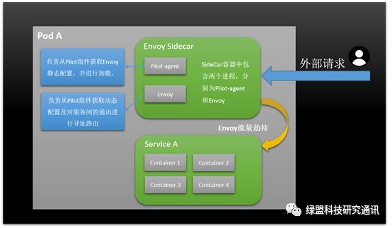

图2  Envoy拓扑图

Envoy和Service A同属于一个Pod，共享网络和命名空间，Envoy代理进出Pod A的流量，并将流量按照外部请求的规则作用于Service A中。

## 理解Istio中Envoy代理注入及流量劫持

以下以Istio中的Bookinfo demo说明Envoy在Istio中流量劫持和代理注入的过程：

首先通过kubectl get pods查看目前部署的Bookinfo微服务程序：

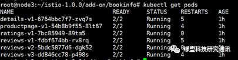

图3 bookinfo demo Pod信息

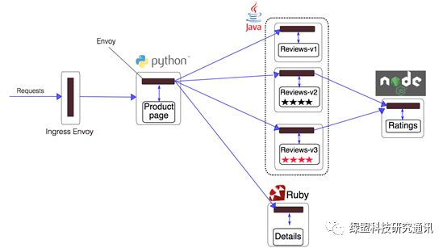

图4  bookinfo架构图

由Bookinfo的架构图可以看出服务间的请求调用关系，我们以Productpage举例，通过kubectl describe pod productpage-v1-54b8b9f55-8lt67 可以查看Productpage服务的信息，从中可以看到有容器相关的两个部分，分别为Init Containers和Containers。

---

Init Containers为初始化容器，下文统一称作Init容器，通常在应用容器和Envoy代理容器启动之前运行，并在初始化成功后退出。一个Pod可具有多个Init Containers，如果指定了多个，那么按照顺序依次运行，并且只有当前面的Init Containers运行成功后才可以运行下一个Init Containers，否则会根据Pod的RestartPolicy策略进行重试。

Containers主要分为Envoy代理容器和应用容器两部分。

Init容器都做了哪些事情呢？以下截图为Init相关信息

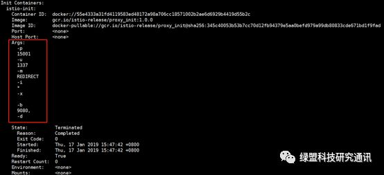

图5 Init容器相关信息

我们查看Init容器的dockerfile，如下图所示：

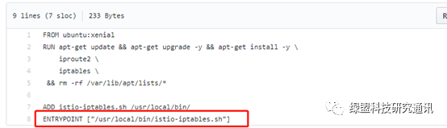

图6  Init Containers dockerfile

由以上dockerfile可以看出Init容器入口为/usr/local/bin/istio-iptables.sh脚本，我们可以在Istio github中查看istio-iptables.sh的内容，该脚本主要是用于给Envoy代理容器做前期的初始化工作，具体设置了iptables端口转发规则。

由istio-iptables.sh的使用方法结合Init容器相关信息图中红框部分，即-p 15001 -u 1337 -m REDIRECT -i '\*' -x "" -b 9080 -d ""，执行的启动脚本为：

```javascript javascript hljs
1/usr/local/bin/istio-iptables.sh -p 15001 -u 1337 -m REDIRECT -i '*' -x "" -b 9080 -d ""
```

可以cd到istio-iptables.sh目录下，执行命令istio-iptables.sh --help查看参数含义，如下图所示：

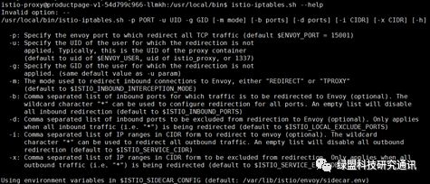

图7 istio-iptables.sh使用方法

这条启动命令的作用为：

- 将容器所有流量都转发到Envoy的15001端口。
    
- 使用istio-proxy用户身份运行，UID 1337。
    
- 使用默认的REDIRECT模式来重定向流量。
    
- 将所有出站流量都重定向至Envoy代理。
    
- 将所有9080端口的流量重定向到Envoy代理。
    

所以总结Init容器的作用及存在的意义就是让Envoy代理可以拦截所有进出Pod的流量，即将入站流量重定向到Envoy代理，再拦截出站流量经过Envoy处理后再出站。

因为Init容器在运行完毕后就会自动退出，所以我们无法直接进入Init容器中查看iptables信息，不过Init容器会将结果保留到Envoy代理容器中，我们以特权模式进入Productpage服务的Envoy容器，并执行iptables命令， 过程如下图所示：

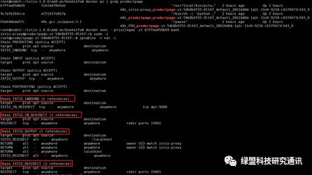

图8  Envoy代理容器中iptables NAT表中链信息

由上图可以看出，Init容器通过为Envoy代理容器iptables中NAT表注入ISTIO\_INBOUND、ISTIO\_IN\_REDIRECT、ISTIO\_OUTPUT、ISTIO\_REDIRECT四条链路来对流量进行劫持。

具体的劫持过程可以参考下图，图片来自https：//jimmysong.io ：

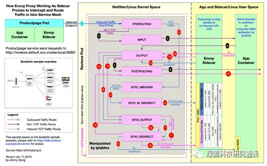

图9 Envoy代理容器劫持过程图

## Envoy代理注入过程

通过命令：

```hljs nginx
1kubectl describe pod productpage-v1-54b8b9f55-8lt67
```

可以看出Envoy代理容器的启动参数为下图红框所示：


图10  Envoy代理容器启动参数

Envoy容器的dockerfile如下图所示：

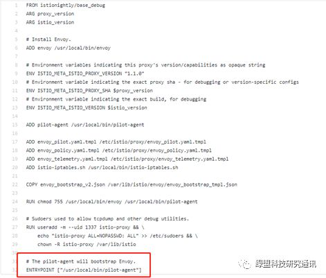

图11 Envoy代理容器dockerfile

结合图10，图11可看出Envoy代理容器入口为/usr/local/bin/pilot-agent，传递参数为：

```javascript javascript hljs
1proxy sidecar --configPath /etc/istio/proxy --binaryPath /usr/local/bin/envoy --2serviceCluster productpage --drainDuration 45s --parentShutdownDuration 1m0s --3discoveryAddress istio-pilot.istio-system：15007 --discoveryRefreshDelay 1s --zipkinAddress 4zipkin.istio-system：9411 --connectTimeout 10s --statsdUdpAddress istio-statsd-prom-5bridge.istio-system：9125 --proxyAdminPort 15000 --controlPlaneAuthPolicy NONE
```

这些参数主要配置了Envoy 二进制文件的位置（/usr/local/bin/envoy）、服务发现地址（istio-pilot.istio-system：15007）、服务集群名（\-\- istio-pilot.istio-system：15007）、监控指标上报地址（ istio-statsd-prom-bridge.istio-system：9125）、Envoy 的管理端口（15000）、热重启时间（10s）等。       

Envoy代理容器中PID为1的进程为pilot-agent，它启动时又创建了一个Envoy进程。启动命令为：

```javascript javascript hljs
1/usr/local/bin/envoy -c /etc/istio/proxy/envoy-rev0.json --restart-epoch 0 --drain-time-s 45 --parent-shutdown-time-s 60 --service-cluster productpage --service-node sidecar~172.33.78.10~productpage-v1-745ffc55b7-2l2lw.default~default.svc.cluster.local --max-obj-name-len 189 -l warn --v2-config-only
```

由Envoy进程启动的命令参数可以看出有一个配置文件为/etc/istio/proxy/envoy-rev0.json，这是其它一切配置的根本来源，在Envoy注入到Pod时会通过此配置文件加载bootstrap静态配置，说起bootstrap配置，它是Envoy整个配置中的静态配置，当然我们可以通过命令

```javascript javascript hljs
1kubectl -n default exec -it ratings-v1-7bc85949-89tm5 -c istio-proxy curl http：//localhost：15000/config_dump如
```

进入到容器中查看所有配置，因为json文件很长，大概6000行，在此不贴出来了。关于该配置内容可参照下图：

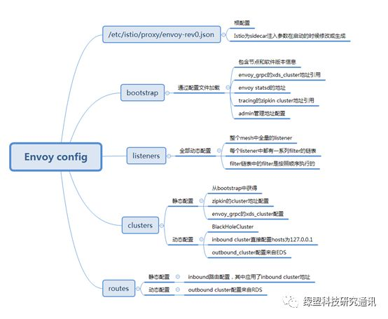

图12 Envoy Config

除了Bootstrap配置以外，剩下的基于xDS（listener DS /Clusters DS/routes DS）的动态配置则是从Pilot的Envoy API获取。有了配置文件，Envoy就可以进行转发了，可以进入Envoy容器中/etc查看/etc/istio/proxy/envoy-rev0.json文件，内容如下：

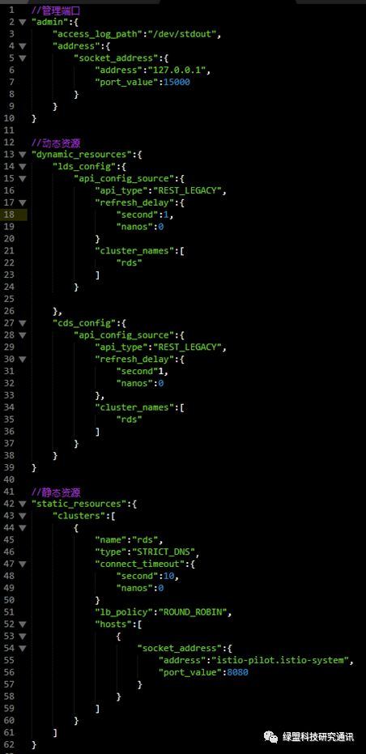

图13 Envoy代理容器中Envoy配置文件内容

Envoy就是通过以上配置在各个服务中进行规则的动态转发。

可以进到Envoy容器中查看Envoy和Pilot-agent进程， 如下图所示：

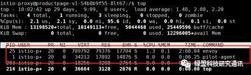

图14 Envoy中运行的主要进程

**Envoy：** 可以进到对应目录中（/etc/istio/proxy/envoy-rev0.json）查看Envoy的配置，这些配置一部分由用户通过Rules API提供，一部分由Kubernetes服务发现功能提供。Envoy进程由Pilot-agent进程启动，启动后，Envoy读取pilot-agent为它生成的配置文件，然后根据该文件的配置获取到Pilot的地址，通过Envoy API的xDS接口从Pilot拉取动态配置信息，包括路由（route），监听器（listener），服务集群（cluster）和服务端点（endpoint）。Envoy初始化完成后，就根据这些配置信息对服务间的通信进行寻址和路由。

**Pilot-agent：**负责Envoy的生命周期管理，可对Envoy静态配置进行热重启，比如TLS证书，Envoy还不支持动态下发，所以要先重新配置静态文件，再使用Pilot-agent负责将Envoy进行热重启加载。

## 总结

Envoy的核心在于对业务透明的请求拦截；将拦截请求进行一定的规则校验，认证，流量调度；承担所有的微服务间的网络通信职责。Envoy作为Sidecar容器与服务部署在一起这种方式在给运维人员带来便利的同时，也必不可少的带来了一些性能问题，试想当服务数量到达千级时，业务复杂程度与性能呈相关性，此时由于Envoy要接管所有服务的出入流量，对于每一个请求的转发都需要与控制面板Mixer组件通信，这必然带来IO性能瓶颈问题，所以请求转发性能的高低成为了Istio针对Envoy需要考虑的问题，目前官方的解决方案是在Istio控制平面Mixer侧和数据平面Envoy侧分别添加两个缓存以降低大规模服务下的请求次数。


[原文](https://mp.weixin.qq.com/s/laSMCTtyvhQuXf1NbMwNyA)