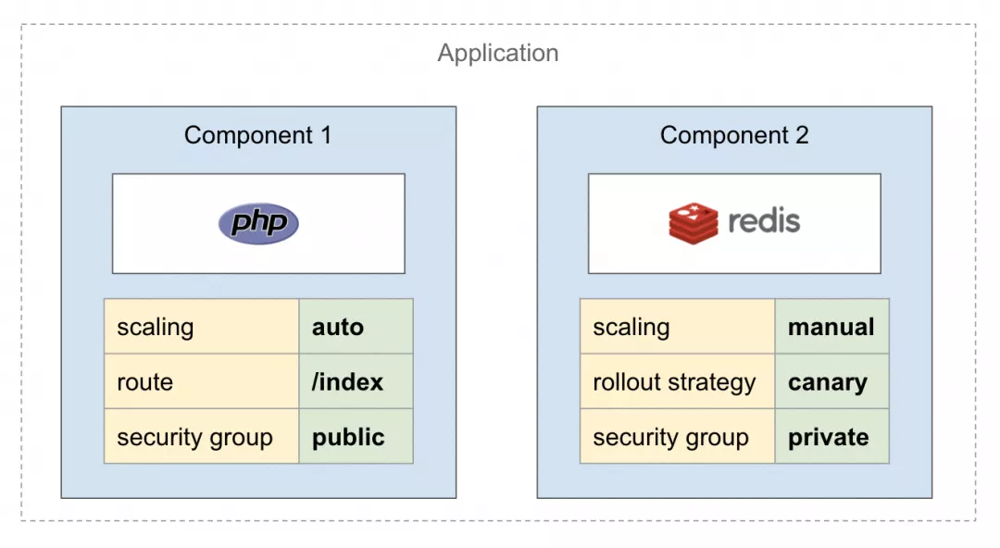
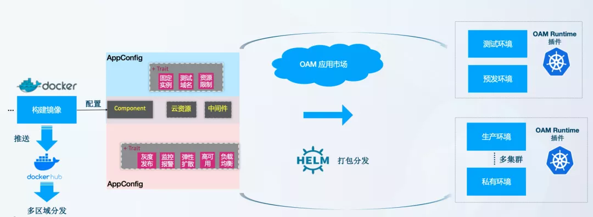
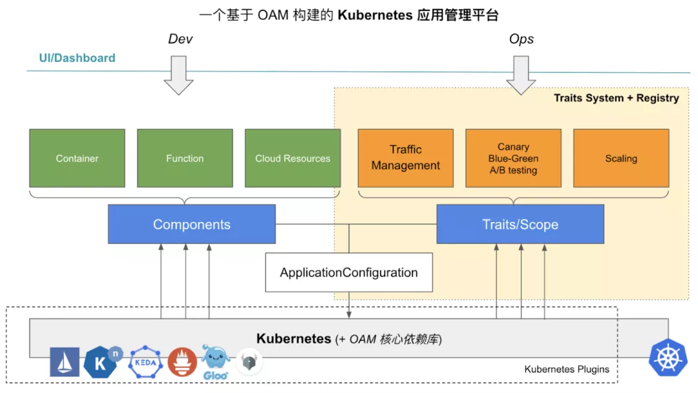
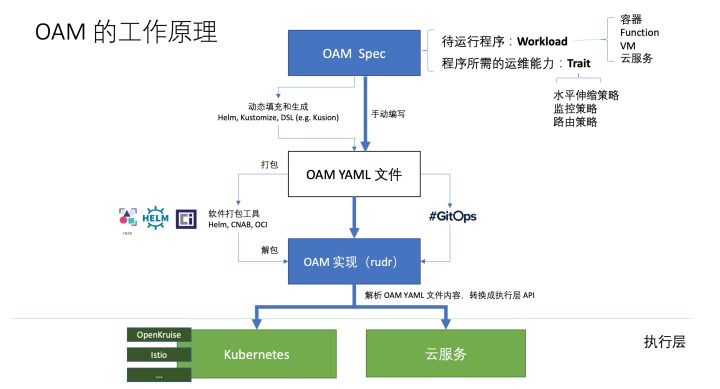

# 开放应用模型 Open Application Model （OAM）
[官网](https://oam.dev/)
[规范](https://github.com/oam-dev/spec)

OAM 全称是 Open Application Model，从名称上来看它所定义的就是一种模型，同时也实现了基于 OAM 的我认为这种模型旨在定义了云原生应用的标准。

- 开放（Open）：支持异构的平台、容器运行时、调度系统、云供应商、硬件配置等，总之与底层无关
- 应用（Application）：云原生应用
- 模型（Model）：定义标准，以使其与底层平台无关

顺便说下 CNCF 中的也有几个定义标准的「开源项目」，其中有的项目都已经毕业。

- [SMI（Service Mesh Interface）](https://github.com/servicemeshinterface/smi-spec)：服务网格接口
- [Cloud Events](https://github.com/cloudevents/spec)：Serverless 中的事件标准
- [TUF](https://github.com/theupdateframework/specification)：更新框架标准
- [SPIFFE](https://github.com/spiffe/spiffe)：身份安全标准

这其中唯独没有应用定义标准，[CNCF SIG App delivery](https://github.com/cncf/sig-app-delivery) 即是要做这个的。当然既然要制定标准，自然要对不同平台和场景的逻辑做出更高级别的抽象（这也意味着你在掌握了底层逻辑的情况下还要学习更多的概念），这样才能屏蔽底层差异。

## 云原生
开放应用模型针对云原生应用定义了一些规范和标准，这里就先简单介绍一下什么是云原生。云原生（cloud native）包含两部分：云和原生。云就是应用运行在云环境中，具有弹性和分布式的特点；原生就是土生土长的意思，也就是说应用在设计之初就考虑到了云的运行环境（IaaS、PaaS、SaaS）。

云原生 = 微服务 + DevOps + 持续交付 + 容器化

### 微服务
- 应用间采用Restful API通信；
- 可以独立部署、升级、扩缩容、重启；
- 低耦合高内聚；

### DevOps
- 开发和运维高度协同工作；
- 自动化发布管道和CI工具；
- 快速部署到生产环境；
### 持续交付
- 频繁发布、快速交付、快速反馈、降低发布风险；
### 容器化
- Docker等容器技术；
- 微服务的最佳载体；

## 开放应用模型介绍(OAM)
开放应用模型，是构建云原生应用时，一个以团队为核心的标准。

其中明确描述了构建云原生应用的三个重度参与方：应用开发者、应用运维、基础设施运维。他们分别的职责：

- 应用开发者 负责定义应用组件；
- 应用运维 负责创建这些应用组件的实例，并且为它们分配相应的应用配置；
- 基础设施运维 负责申请、安装、维护平台上的底层基础服务，并且能为上层应用组件提供稳定的服务；

### 云原生开发和OAM开发方式

序号|	云原生开发|	OAM开发方式
---|---|---
0|	微服务非常复杂|	一种新的应用模型
1|	开发者必须在基础设施工具（镜像、仓库、版本控制等）上花费越来越多的时间|	利用角色和作用域来管理应用，就像管理你的团队一样，不用关心基础设施
2|	应用的开发过程中纠缠着应用的安全、性能和配置问题|	有一个固定的工作流，它将开发者和运维所关注的事情分离开，并且提供了灵活性和明确分工
3|	微服务的运行环境会影响到你的应用的开发和配置|	可以运行在任何地方，可以跨云平台和边界设备部署

### OAM有什么意义？
在 OAM 发布之前，云原生生态里其实并没有一个叫做 “应用” 的概念。哪怕在今天，全世界几乎每一个在落地云原生的团队，都有一个自己定义的 “应用” 的概念，它们的抽象程度层次不齐，定义方式也丰富多样，这就导致了所有围绕着这些 “应用” 构建出来的系统，就成为了一个又一个的大烟囱。

对于整个云原生生态来说，这种应用层的碎片化和烟囱化，其实对于整个生态演进是非常不利的。而今天的现状也已经证明了这一点，在 Kubernetes 逐渐标准化了基础设施能力的接入方式之后，原本更加接近用户、更加重要的应用管理层，却几乎停滞了演进，在最近几年里没有提出任何一个创新性的思想出来。

应用管理层停滞不前的结果，就是全世界的业务研发和运维一夜之间都被迫变成了 “容器专家”，一边学习着根本不应该是他们关心的各种 “基础设施即数据（Infrastructure as Data）” 领域的概念（比如：声明式 API，控制器等），一边吐槽 Kubernetes 实在是太复杂了、设计太奇葩了。

简而言之，Kubernetes 作为一个面向基础设施工程师的系统级项目，主要负责提供松耦合的基础设施语义，这就使得用户学习和操作 Kubernetes YAML 文件的时候，往往会感觉这些文件里的关注点非常底层，学习门槛很高。

实际上，对于Kubernetes 真正的最终用户比如业务研发人员和运维人员来说，他们并不想配置这些如此底层的资源信息，而是希望有更高维度的抽象。这就要求一个真正面向最终用户侧的应用定义，需要能够为业务研发和应用运维人员提供各自视角的应用定义原语。所以说，OAM 带来的第一个改变，就是提供了一种大家都可以遵循的、标准化的方式来定义更高层级的应用层抽象，并且把“关注点分离”作为这个定义模型的核心思想。

**而 OAM 带来的第二个变化，则是为 Kubernetes 项目带来了应用定义，更确切地说，是对应用本身和它所需运维能力进行定义与描述的标准开源规范。**站在 Kubernetes 项目的角度来讲，OAM 是一个 Kubernetes 原生的标准的“应用定义”项目，同时也是一个专注于封装、组织和管理 Kubernetes 中各种“运维能力”、以及连接“运维能力”与“应用”的平台层框架。

详细的说，OAM 基于 Kubernetes API 资源模型（Kubernetes Resource Model）来标准化应用定义的规范，它强调一个现代应用是多个组件的集合，而非一个简单的工作负载或者 K8s Operator。所以在 OAM 的语境中，一个 PHP 容器和它所依赖的数据库，以及它所需要使用的各种云服务，都是一个“电商网站”应用的组成部分。更进一步的，OAM 把这个应用所需的“运维策略”也认为是一个应用的一部分，比如这个 PHP 容器所需的 HPA（水平自动扩展策略）：

以 Crossplane 项目为例，它在本次合作中通过 OAM 升级之后得到了怎样的变化呢？
**作为混合云管理领域中的佼佼者，Crossplane 的 OAM 化保证了今天任何一个符合 OAM 规范的待运行程序、运维能力和它所依赖的云服务，可以组成一个整体在混合云环境中无缝漂移。**
这种平台无关的应用定义范式，使得应用研发人员只需要通过 OAM 规范来描述他们的应用程序，那么该应用程序就可以在任何 Kubernetes 群集或者 Serverless 应用平台甚至边缘环境上运行，而无需对应用描述做任何修改。本次合作中 Crossplane OAM 版的发布，则意味着 OAM 社区正在将标准应用定义和标准化的云服务管理能力统一起来，从而实现真正的 “云端应用交付” 。

### OAM 如何发挥作用？
那么 OAM 在一个项目中是如何运作的呢？

据介绍，OAM 以原生插件的方式运行在 Kubernetes 当中。OAM 强调整个模型是关注点分离的。即业务研发人员负责定义和维护组件 (Component) 来描述服务单元，而运维人员定义运维特征 (Trait)，并将其附加到前面的组件上，最后构成 OAM 可交付物 ——ApplicationConfiguration。

这种设计是 OAM 在能够无限接入 Kubernetes 各种能力的同时，保证给业务研发与运维人员提供最佳的使用体验和最低的心智负担的重要基础。与此同时，基础设施工程师可以随时在 Kubernetes 中添加更多工作负载（例如 FaaS）以运行无服务器功能，或者添加运维特性（例如 CronHPA）来定义 CronJob 类型的 HPA 策略。OAM 以标准的声明方式在整个平台中管理应用交付能力和流程，并且提供面向各个角色的 API 原语来表达各自的诉求，最后通过 Kubernetes 把这些诉求落实。

### 什么样的项目需要 OAM？
实际上，几乎所有基于 Kubernetes 的应用管理平台都对通过 OAM 来以标准化的方式去构建自己的应用模型有明确的诉求。另一方面，由于 OAM 是原生的 Kubernetes API 资源模型，这里的迁移过程难度很低，可以通过 API 对象灰度纳管的方式逐步完成迁移操作（通过 OAM 对象逐步接管现有 Kubernetes 对象）。

而相比于传统 PaaS 封闭的、不能同 “以 Operator 为基础的云原生生态” 衔接的现状，基于 OAM 和 Kubernetes 构建的现代云原生应用管理平台，本质上是一个 “以应用为中心” 的  Kubernetes ，保证了这个应用平台在能够无缝接入整个云原生生态。同时，OAM 可以进一步屏蔽掉容器基础设施的复杂性和差异性，为平台的使用者带来低心智负担的、标准化的、一致的应用管理与交付体验。这就使得一个基于OAM 构建的 Kubernetes 应用平台，首先能够隐藏底层基础设施的细节（例如，是云还是物联网），专注于应用层抽象，提供以应用为中心的资源模型。

其次，OAM 划分了应用交付路径上的开发、运维、基础架构三种角色，分离了关注点，让流程更加清晰和易于管理。

第三，OAM 站在 K8s  API 资源模型的肩膀之上，提供了可移植的应用与基础设施抽象，让一个应用描述可以完全不加修改的云、边、端等任何环境下直接交付运行起来。

除此之外，OAM 还定义了一组核心工作负载/运维特征/应用范畴，作为应用程序交付平台的基石。而平台开发者也可以添加更多工作负载（例如 FaaS 或者任意云服务），或者添加运维特性（例如 CronHPA）来定义 CronJob 类型的 HPA 策略。OAM 以标准的声明方式在整个平台中管理应用交付能力和流程。当模块化的 Workload 和 Trait 越来越多，就会形成组件市场。而 OAM 就像是这个组件市场的管理者，处理组件之间的关系，把许多组件集成起来变成一个产品交付给用户。OAM 加持下的 Kubernetes 应用管理平台，可以像乐高积木一样灵活组装底层能力、运维特征、以及开发组件。使得应用管理变得统一，功能却更加强大。

### OAM 基本对象
OAM 模型中包含以下基本对象，以本文发稿时的最新 API 版本 core.oam.dev/v1alpha2 为准：

- Component：OAM 中最基础的对象，该配置与基础设施无关，定义负载实例的运维特性。例如一个微服务 workload 的定义。
- TraitDefinition：一个组件所需的运维策略与配置，例如环境变量、Ingress、AutoScaler、Volume 等。（注意：该对象在 apiVersion: core.oam.dev/v1alpha1 中的名称为 Trait）。
- ScopeDefinition：多个 Component 的共同边界。可以根据组件的特性或者作用域来划分 Scope，一个 Component 可能同时属于多个 Scope。
- ApplicationConfiguration：将 Component（必须）、Trait（必须）、Scope（非必须）等组合到一起形成一个完整的应用配置。

### OAM 工作原理
Rudr 可以看做是 OAM 规范的解析器，将应用定义翻译为 Kubernetes 中的资源对象。

可以将上图分为三个层次：

- 汇编层：即人工或者使用工具来根据 OAM 规范定义汇编出一个云原生应用的定义，其中包含了该应用的工作负载和运维能力配置。
- 转义层：汇编好的文件将打包为 YAML 文件，由 Rudr 或其他 OAM 的实现将其转义为 Kubernetes 或其他云服务（例如 Istio）上可运行的资源对象。
- 执行层：执行经过转义好的云平台上的资源对象并执行资源配置。

### 一个开放应用模型的Kubernetes实现：Rudr

OAM 仅定义云原生应用的规范，目前推出的 Rudr 可以看做是 OAM 规范的 Kubernetes 解释器，将云原生应用定义翻译成 Kubernetes 的资源对象

Rudr 是对 OAM v1alpha1 在 Kubernetes 环境下的实现，OAM 正在与 Crossplane 合作

[Rudr](https://github.com/oam-dev/rudr) 采用的是增量的方法解决问题，它的架构设计，提供了一组Kubernetes的插件，它允许任何对OAM规范的实现（使用原生的API或者kubectl）部署在该集群中。

应用开发者专注于构建OAM组件，应用运维人员专注于利用OAM应用配置的应用运维能力，基础设施运维人员专注于Kubernetes集群的运维。利用开放应用模型，现在用户可以按照这个框架在Kubernetes集群上定义他们的应用。

目前，Rudr 利用已经定义好的 trait 来完成任务，这样用户有选择任何底层工具的自由，并且提供了专注于功能而不是技术的 trait 。未来，Rudr 可能会提供一组默认的技术来支持一个trait所需要的功能。

### 2020年5月18日。Crossplane成为OAM规范的标准Kubernetes实现

https://github.com/crossplane/crossplane

https://github.com/crossplane/oam-kubernetes-runtime
OAM Kubernetes Runtime 将会成为 OAM 社区官方维护的基础组件，目标是在 Kubernetes 上提供稳定且统一的 OAM 核心插件。

## 参考

[OAM（开放应用模型）——定义云原生应用标准的野望](https://zhuanlan.zhihu.com/p/134608559)