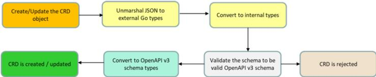
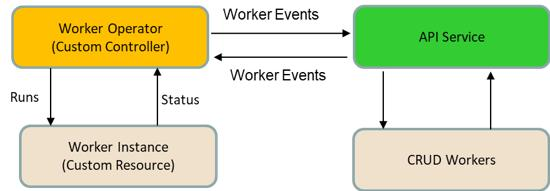
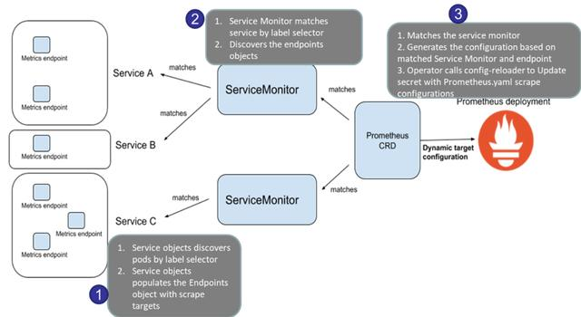

https://github.com/operator-framework/awesome-operators

https://www.toutiao.com/i6760845939163791876/
https://www.toutiao.com/i6738200403835355661/

# 自己开发
https://github.com/cnych/opdemo

[Kubernetes Operator 快速入门教程（Operator 101）](https://www.toutiao.com/a6696782409343435275)

# Kubernetes Operator 介绍
https://blog.csdn.net/ygqygq2/article/details/83655552
在 Kubernetes 的支持下，管理和伸缩 Web 应用、移动应用后端以及 API 服务都变得比较简单了。其原因是这些应用一般都是无状态的，所以 Deployment 这样的基础 Kubernetes API 对象就可以在无需附加操作的情况下，对应用进行伸缩和故障恢复了。

而对于数据库、缓存或者监控系统等有状态应用的管理，就是个挑战了。这些系统需要应用领域的知识，来正确的进行伸缩和升级，当数据丢失或不可用的时候，要进行有效的重新配置。我们希望这些应用相关的运维技能可以编码到软件之中，从而借助 Kubernetes 的能力，正确的运行和管理复杂应用。

Operator 这种软件，使用 TPR(第三方资源，现在已经升级为 CRD) 机制对 Kubernetes API 进行扩展，将特定应用的知识融入其中，让用户可以创建、配置和管理应用。和 Kubernetes 的内置资源一样，Operator 操作的不是一个单实例应用，而是集群范围内的多实例。

# 实操案例：使用Prometheus Operator进行集群监控

据Sysdig发布的容器报告，容器以及如Kubernetes等编排工具的使用增长了５１％以上，大家开始将工作负载在集群中进行托管并管理。鉴于集群中短暂的状态，对于端到端的集群有一个十分重要的需求，即能够详细监控节点、容器以及pod。

IT工程师需要管理应用程序、集群（节点和数据），并且需要减少手动配置service、目标和数据存储的工作量，同时在应用程序每次关闭和返回时进行监控。这就需要一个无缝部署以及管理高可用监控系统（如Prometheus），其中可以与Operator一起处理抓取目标的动态配置、服务发现以及用于告警集群中各种目标的配置规则。同时，使用Operator模式编写代码以减少人工干预。

本文，我们将关注Prometheus Operator是如何工作的，service monitor在Prometheus Operator中是如何发现目标和获取指标的。

  

在集群监控中Prometheus Operator所扮演的角色
===============================

*   能够使用原生Kubernetes配置选项无缝安装Prometheus Operator
*   能够在Kubernetes命名空间中创建和摧毁一个Prometheus实例，某个特定的应用程序或者团队能够轻松地使用Operator
*   能够预配置配置文件，包括Kubernetes资源的版本、持久性、保留策略和replica
*   能够使用标签发现目标service，并根据熟悉的Kubernetes标签查询自动生成监控目标配置。

例如：当pod /service销毁并返回时，Prometheus Operator可以自动创建新的配置文件，无需人工干预。

在Operator模式下所需的组件
=================

*   **Custom Resource Definition（CRD）**：创建一个新的自定义资源，包括可指定的名称和模式，无需任何编程。Kubernetes API提供和处理自定义资源的存储。
*   **自定义资源**：扩展Kubernetes API或允许将自定义API引入kubernetes集群的对象。
*   **自定义控制器**：以新的方式处理内置的Kubernetes对象，如Deployment、Service等，或管理自定义资源，如同管理本机Kubernetes组件
*   **Operator模式**（适用于CRD和自定义控制器）：Operator基于Kubernetes资源和控制器增加了允许Operator执行常见应用程序任务的配置。

Operator的工作流程
=============

Operator在后台执行以下操作以管理自定义资源：

1、CRD创建：CRD定义规范和元数据，基于该规范和元数据应创建自定义资源。当创建CRD的请求时，使用Kubernetes内部模式类型（OpenAPI v3模式）验证元数据，然后创建自定义资源定义（CRD）对象

2、自定义资源创建根据元数据和CRD规范验证对象，并相应地创建自定义对象创建。

3、Operator（自定义控制器）开始监控event及其状态变更，并基于CRD管理自定义资源。它可以提供event在自定义资源上执行CRUD操作，因此每当更改自定义资源的状态时，都能被触发相应的event。

服务发现及自动配置获取的目标
==============

Prometheus Operator使用Service Monitor CRD执行自动发现和自动配置获取的目标。

ServiceMonitoring包括以下组件：

1.  Service：实际上是service/deployment，它在定义的端点、端口暴露指标，并使用对应的标签进行标识。每当service或pod发生故障时，该service以相同的标签返回，因此使得它可被service monitor发现。
2.  Service Monitor：可基于匹配的标签发现service的自定义资源。Servicemonitor处于部署了Prometheus CRD的命名空间中，但通过使用NamespaceSelector，它依旧能够发现部署在其他命名空间中的service。
3.  Prometheus CRD：基于标签与service monitor相匹配并且能够生成Prometheus的配置。
4.  Prometheus Operator：它可调用config-reloader组件以自动更新yaml配置，其中包含抓取目标的详细信息。

接下来我们来看一个简单的使用案例，以此理解Prometheus Operator时如何监控service的。

  

使用案例：使用Prometheus Operator进行Gerrit服务监控
======================================

Gerrit是一个代码review工具，主要用于DevOps CI流水线，在代码入库前对每个提交进行审阅。本文假设Gerrit已经在Kubernetes集群中运行，因此不再赘述Gerrit在Kubernetes作为服务运行的步骤。

如果你还没有Prometheus Operator，可以使用helm chart来安装或直接使用Rancher，在Rancher2.2及以上的版本中，Rancher会在新添加的集群中部署一个Prometheus Operator。以下组件将会被默认下载安装：

*   prometheus-operator
*   prometheus
*   alertmanager
*   node-exporter
*   kube-state-metrics
*   grafana
*   service monitors to scrape internal kubernetes components

>>>kube-apiserver

>>>kube-scheduler

>>>kube-controller-manager

>>>etcd

>>>kube-dns/coredns

以下步骤将展示Prometheus Operator如何自动发现运行在Kubernetes集群上的Gerrit服务以及如何从Gerrit中抓取指标。

  

使用Gerrit-Prometheus插件暴露指标
=========================

可以使用Prometheus jar插件暴露Gerrit指标，但需要提前将该插件安装在Gerrit实例上运行。

1.  Prometheus jar插件下载地址：
2.  https://gerrit-ci.gerritforge.com/，将jar放在Gerrit插件目录中：/var/gerrit/review_site/plugins/，并重启gerrit服务。
3.  在管理员的web界面校验Prometheus插件：Gerrit -> Plugins -> Prometheus plugin。
4.  创建一个账号和组并给予查看指标的访问权限
5.  以管理员权限登录到Gerrit的web界面，访问：Projects>List>All-Projects。点击【Access】标签，再点击【edit】按钮。
6.  在block global capabilities中，点击【Add Permission】并且在下拉列表中选择【View Metrics】。
7.  在Gerrit中为用户生成一个token。
8.  选择我们此前创建的组“Prometheus Metrics“，点击【Add】按钮。
9.  滑至页面底部并点击【Save Changes】按钮。

创建secret以访问Gerrit服务
===================

1.  在Gerrit中生成token之后，你可以使用用户id和token来生成Base64编码格式的用户id和token，用于将凭证存储在Kubernetes中。
2.  使用secret的详细信息创建一个yaml并在Kubernetes中创建secret。
3.  kubectl apply -f gerrit-secret.yaml

将标签应用到服务
========

使用两个标签标记Gerrit服务，例如：app: gerrit and release: prometheus-operator

kubectl label svc gerrit app=gerrit release=prometheus-operator  

为Gerrit创建Service Monitor
========================

在servicemonitoring添加端点的详细信息以发现Gerrit服务指标以及具有匹配标签的的selector，如下所示：

**带标签的service selector**

Selector下的标签是用于标识服务的标签：

Selector:  
matchLabels:  
app: gerrit  
release: prometheus-operator  

**ServiceMonitor selector**

元数据部分下的标签是指用于通过Prometheus CRD识别服务监视器的标签。

Metadata:  
labels:  
app: gerrit  
release: prometheus-operator  

**Namespaceselector：**在Gerrit服务所运行的Kubernetes集群中提供命名空间。Service可以在任何命名空间中运行，但service monitor只能在Prometheus Operator运行的命名空间创建，这样Prometheus CRD就可以识别service monitor对象。

在Prometheus中匹配Service Monitor selector
======================================

使用以下命令验证Prometheus对象中Service Monitor selector的部分：

kubectl get prometheus  
Match and apply the label as given in step 4b for the Prometheus object.  
serviceMonitorSelector:  
matchLabels:  
release: prometheus-operator  

注意：如果Prometheus-operator使用helm部署，标签release=Prometheus-operator已经应用到Prometheus对象上。我们依旧需要在service monitor中匹配这个标签，因为Prometheus CRD需要确定合适的service monitor。

以上servicemonitor创建步骤可以使用prometheus-operator helm自定义values.yaml来完成。

自动发现Gerrit服务
============

标签更新之后，Prometheus自定义对象将会自动调用config-reloader来读取终端并更新Prometheus配置文件。这是Prometheus Operator的一个好处，无需手动介入创建Prometheus配置文件和更新抓取的配置。

1、 打开Prometheus url：http://prometheusip:nodeport

kubectl get svc prometheus以获取nodeport详细信息并用节点的详细信息来替代IP。

2、 访问菜单：Status -> Configuration，来查看使用抓取配置自动加载的Prometheus配置。在scrape_configs部分，可以查看Gerrit service monitor的详细信息，如下所示：

3、 访问菜单 -> Status -> Targets or Service Discovery。如果service monitor已经成功抓取Gerrit的指标，目标应该显示为健康\[1/1up\]。

在Grafana中的Gerrit 健康指标
=====================

Gerrit暴露了各种指标，如JVM运行时间、线程内存、heap size、error等。这些都可以在Grafana仪表板中配置以监控Gerrit的性能和运行状况（如下所示）。

Gerrit指标在scrape url下暴露：

http://gerrit-svcip:nodeport/a/plugins/metrics-reporter-prometheus/metrics

kubectl get svc prometheus-获取service 节点端口。

将gerrit-svcip、nodeport替换为gerrit服务的gerrit IP / nodeport的详细信息，暴露的指标将如下所示。

指标的值可以在Prometheus -> Graph 中的表达字段进行评估，如：caches\_disk\_cached\_git\_tags

在Grafana中配置指标以监控Gerrit的健康状况，选择数据源为Prometheus并在dashboard中配置widget。一些已经配置的关键指标有JVM\_threads、Uptime、Http\_Plugin errors、内存使用情况、事件等。

Prometheus Operator有助于Prometheus的无缝部署和管理、抓取目标的动态配置、服务发现、可扩展性、以及内置的SRE专业知识，这可以加速集群监控。

开箱即用的Prometheus
===============

2018年年末，Rancher Labs宣布加强对Prometheus的支持，这将为跨多个Kubernetes集群和多个隔离租户环境提供更高的可见性。在Rancher2.2及以上的版本中，每当添加一个新的Kubernetes集群到Rancher中，Rancher都将在集群中部署一个Prometheus operator，然后在集群中创建一个Prometheus部署。此外，还支持以下两个功能：

*   集群范围内的Prometheus部署将被用于存储集群指标（如CPU节点和内存消耗），并存储从单个用户部署的应用程序中收集的项目级指标。
*   项目级的Grafana与Prometheus的通信将通过安全代理完成，该代理可为Prometheus实现多租户。安全代理工具PromQL语句可确保仅能通过用户项目的命名空间进行查询。

Rancher对Prometheus的增强支持，**可确保为所有Kubernetes集群、所有项目和所有用户进行高效的部署和有效的监测。**安全代理确保不在多租户之间重复共享数据，并且对多租户进行隔离。除此之外，Rancher还收集使用Prometheus处理的数据公开端点的任意自定义指标。所有指标均可用于Rancher内部的告警和决策，通过通知用户的Slack及PagerDuty进行简单操作，通过启动工作负载的横向扩展最终增加负载进行复杂操作。Rancher现在还拥有完全安全隔离和RBAC的集群级和项目级的指标和仪表盘。