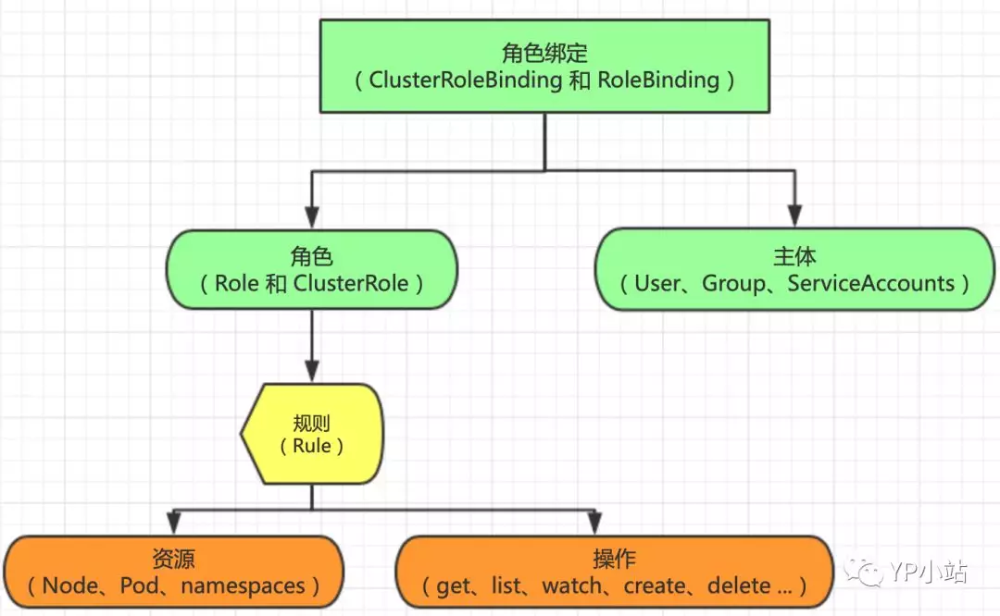

[TOC]
# Kubernetes RBAC角色权限控制

[RBAC——基于角色的访问控制](https://jimmysong.io/kubernetes-handbook/concepts/rbac.html)
[Kubernetes RBAC角色权限控制](https://www.toutiao.com/a6764673033236906499/)

## 什么是 Kubernetes RBAC

在Kubernetes中，授权有ABAC（基于属性的访问控制）、RBAC（基于角色的访问控制）、Webhook、Node、AlwaysDeny（一直拒绝）和AlwaysAllow（一直允许）这6种模式。从1.6版本起，Kubernetes 默认启用RBAC访问控制策略(beta版本)。从1.8开始，RBAC已作为稳定的功能。通过设置–authorization-mode=RBAC，启用RABC。在RABC API中，通过如下的步骤进行授权：1）定义角色：在定义角色时会指定此角色对于资源的访问控制的规则；2）绑定角色：将主体与角色进行绑定，对用户进行访问授权。

基于角色的访问控制（Role-Based Access Control, 即 "RBAC"）：使用 “rbac.authorization.k8s.io” API Group 实现授权决策，允许管理员通过 Kubernetes API 动态配置策略。


RBAC 从 Kubernetes v1.6 处于beta版本，从 v1.8 开始，RBAC已作为 稳定的功能。启用 RBAC，请使用 --authorization-mode=RBAC 启动 API Server。



### 三个RBAC最基本的概念
- Role: 角色，它定义了一组规则，定义了一组对Kubernetes API对象的操作权限
- Subject: 被作用者，既可以是"人"，也可以是机器，当然也可以是我们Kubernetes中定义的用户(ServiceAccount主要负责kubernetes内置用户)
- RoleBinding: 定义了"被作用者"和"角色"的绑定关系


在Kubernetes中所有的API对象都保存在ETCD里，可是，对这些API对象的操作，却一定是通过访问kube-apiserver实现的。我们需要APIServer来帮助我们授权工作，而在Kubernetes项目中，负责完成授权(Authorization)的工作机制就是RBAC: 基于角色的访问控制 (Role-Based Access Control)

RBAC是基于角色的访问控制 (Role-Based Access Control) 在RBAC中，权限与角色相关联。Kubernetes 基于角色的访问控制使用rbac.authorization.k8s.io API组来实现权限控制，RBAC允许管理员通过Kubernetes API动态的配置权限策略。如果需要开启RBAC授权需要在apiserver组件中指定--authorization-mode=Node,RBAC

## ClusterRole 与 Role


在RBAC API中，角色包含代表权限集合的规则。在这里，权限只有被授予，而没有被拒绝的设置。在Kubernetes中有两类角色，即普通角色和集群角色。可以通过Role定义在一个命名空间中的角色，或者可以使用ClusterRole定义集群范围的角色。一个角色只能被用来授予访问单一命令空间中的资源。下面是在“default”命令空间中定义了一个名为“pod-reader”的角色，此角色能够对在“default”命名空间中访问Pod.

### Role（角色）
是一系列权限的集合，例如一个角色可以包含读取 Pod 的权限和列出 Pod 的权限。**Role 只能用来给某个特定 namespace 中的资源作鉴权**。对 namespace 、集群级资源 和 非资源类的 API（如 /healthz）使用 ClusterRole


```yaml
kind: Role
apiVersion: rbac.authorization.k8s.io/v1beta1
metadata:
  namespace: default
  name: pod-reader
rules:
- apiGroups: [""] # 空字符串""表明使用 core API group
  resources: ["pods"]
  verbs: ["get", "watch", "list"]
```
上面的例子描述了 ”default” 命名空间中的一个 Role 对象的定义，用于授予对 pod 的读访问权限。


### ClusterRole
对象可以授予与 Role 对象相同的权限，但由于它们属于集群范围对象，也可以使用它们授予对以下几种资源的访问权限：

- 集群范围资源（例如节点，即 node）
- 非资源类型 endpoint（例如 /healthz）
- 跨所有命名空间的命名空间范围资源（例如 pod，需要运行命令 kubectl get pods --all-namespaces 来查询集群中所有的 pod）

```yaml
kind: ClusterRole
apiVersion: rbac.authorization.k8s.io/v1beta1
metadata:
  # ClusterRole 是集群范围对象，所以不需要定义 "namespace" 字段
  name: secret-reader
rules:
- apiGroups: [""]
  resources: ["secrets"] #明确资源类型
  verbs: ["get", "watch", "list"]
```
上面例子中的 ClusterRole 定义可用于授予用户对某一特定命名空间，或者所有命名空间中的 secret（取决于其绑定方式）的读访问权限

**Kubernetes还提供了四个预先定义好的ClusterRole来提供用户直接使用**
- cluster-admin
- admin
- edit
- view

其中cluster-admin角色，对应的是整个Kubernetes项目中最高权限(verbs=*)

我们可以通过下面的命令查看clusterrole的权限
```
[root@node1 ~]# kubectl describe clusterrole cluster-admin -n kube-system
Name:         cluster-admin
Labels:       kubernetes.io/bootstrapping=rbac-defaults
Annotations:  rbac.authorization.kubernetes.io/autoupdate: true
PolicyRule:
  Resources  Non-Resource URLs  Resource Names  Verbs
  ---------  -----------------  --------------  -----
  *.*        []                 []              [*]
             [*]                []              [*]
```

## ClusterRoleBinding 与 RoleBinding


### RoleBinding：
把 Role 或 ClusterRole 中定义的各种权限映射到 User，Service Account 或者 Group，从而让这些用户继承角色在 namespace 中的权限。

RoleBinding 可以引用在同一命名空间内定义的 Role 对象。
```yaml
# 以下角色绑定定义将允许用户 "jane" 从 "default" 命名空间中读取 pod。
kind: RoleBinding
apiVersion: rbac.authorization.k8s.io/v1beta1
metadata:
  name: read-pods
  namespace: default
subjects:
- kind: User
  name: jane
  apiGroup: rbac.authorization.k8s.io
roleRef:
  kind: Role
  name: pod-reader
  apiGroup: rbac.authorization.k8s.io
```
RoleBinding 对象也可以引用一个 ClusterRole 对象用于在 RoleBinding 所在的命名空间内授予用户对所引用的 ClusterRole 中定义的命名空间资源的访问权限。
这一点允许管理员在整个集群范围内首先定义一组通用的角色，然后再在不同的命名空间中复用这些角色。

例如，尽管下面示例中的 RoleBinding 引用的是一个 ClusterRole 对象，但是用户 ”dave” （即角色绑定主体）还是只能读取 ”development” 命名空间中的
secret（即 RoleBinding 所在的命名空间）。

```yaml
kind: RoleBinding
apiVersion: rbac.authorization.k8s.io/v1beta1
metadata:
  name: read-secrets
  namespace: development # 这里表明仅授权读取 "development" 命名空间中的资源。
subjects:
- kind: User
  name: dave
  apiGroup: rbac.authorization.k8s.io
roleRef:
  kind: ClusterRole
  name: secret-reader
  apiGroup: rbac.authorization.k8s.io
```

### ClusterRoleBinding：
让用户继承 ClusterRole 在整个集群中的权限。

使用 ClusterRoleBinding 在集群级别和所有命名空间中授予权限。下面示例中所定义的 ClusterRoleBinding 允许在用户组 ”manager” 中的任何用户都可以读取
集群中任何命名空间中的 secret。
```yaml
kind: ClusterRoleBinding
apiVersion: rbac.authorization.k8s.io/v1beta1
metadata:
  name: read-secrets-global
subjects:
- kind: Group
  name: manager
  apiGroup: rbac.authorization.k8s.io
roleRef:
  kind: ClusterRole
  name: secret-reader
  apiGroup: rbac.authorization.k8s.io
```

### ClusterRole 聚合
从 v1.9 开始，在 ClusterRole 中可以通过 aggregationRule 来与其他 ClusterRole 聚合使用：
```yaml
kind: ClusterRole
apiVersion: rbac.authorization.k8s.io/v1
metadata:
  name: monitoring
aggregationRule:
  clusterRoleSelectors:
  - matchLabels:
      rbac.example.com/aggregate-to-monitoring: "true"
rules: [] # Rules are automatically filled in by the controller manager.
---
kind: ClusterRole
apiVersion: rbac.authorization.k8s.io/v1
metadata:
  name: monitoring-endpoints
  labels:
    rbac.example.com/aggregate-to-monitoring: "true"
# These rules will be added to the "monitoring" role.
rules:
- apiGroups: [""]
  resources: ["services", "endpoints", "pods"]
  verbs: ["get", "list", "watch"]
```

## ServiceAccount
ServiceAccount主要负责kubernetes内置用户，下面简单定义一个ServiceAccount
```yaml
apiVersion: v1
kind: ServiceAccount
metadata:
 namespace: mynamespace
 name: example-sa
```
我们定义了一个serverAccount对象，只需要name以及namespace最基础字段就可以。然后通过编写rolebinding的yaml文件，来为这个serviceAccount分配权限
```yaml
kind: RoleBinding
apiVersion: rbac.authorization.k8s.io/v1
metadata:
 name: example-rolebinding
 namespace: mynamespace
subjects:
- kind: ServiceAccount
 name: example-sa
 namespace: mynamespace
roleRef:
 kind: Role
 name: example-role
 apiGroup: rbac.authorization.k8s.io
```
在Rolebinding对象里，subject字段的类型(kind)，不在是一个User，而是一个名叫example-sa的ServerAccount。而roleRef引用的Role对象，依然名叫example-role。也就是我们上面定义的

## User && Group
Kubernetes除了有用户(User)，还拥有用户组(Group)概念，如果我们Kubernetes配置了外部认证服务的话，这个用户组的概念就由外部认证服务提供
一个ServiceAccount在Kubernetes对应的用户的名字是
```
system:serviceaccount:<ServiceAccount名字>
```
而对应的用户组则是
```
system:serviceaccounts:<Namespace名字>
```


比如，我们可以在RoleBinding中定义如下subjects
```
subjects:
- kind: Group
 name: system:serviceaccounts:mynamespace
 apiGroup: rbac.authorization.k8s.io
```
这就意味着role的规则权限，作用于mynamespace里的所有ServiceAccount，这就用到了用户组的概念


```
subjects:
- kind: Group
 name: system:serviceaccounts
 apiGroup: rbac.authorization.k8s.io
```
这个role的规则权限，则作用于整个系统里ServiceAccount


在Kubernetes中已经内置了很多歌为系统保留的ClusterRole，它们的名字都以system:开头，可以使用kubectl get clusterroles查找到
```
[root@node1 ~]# kubectl get clusterroles
NAME                                                                   AGE
admin                                                                  3d21h
cluster-admin                                                          3d21h
custom-metrics-resource-reader                                         3h22m
custom-metrics-server-resources                                        3h22m
edit                                                                   3d21h
flannel                                                                3d21h
prometheus                                                             3h23m
system:aggregate-to-admin                                              3d21h
system:aggregate-to-edit                                               3d21h
system:aggregate-to-view                                               3d21h
system:auth-delegator                                                  3d21h
system:basic-user                                                      3d21h
system:certificates.k8s.io:certificatesigningrequests:nodeclient       3d21h
system:certificates.k8s.io:certificatesigningrequests:selfnodeclient   3d21h
system:controller:attachdetach-controller                              3d21h
system:controller:certificate-controller                               3d21h
system:controller:clusterrole-aggregation-controller                   3d21h
system:controller:cronjob-controller                                   3d21h
system:controller:daemon-set-controller                                3d21h
system:controller:deployment-controller                                3d21h
system:controller:disruption-controller                                3d21h
system:controller:endpoint-controller                                  3d21h
system:controller:expand-controller                                    3d21h
system:controller:generic-garbage-collector                            3d21h
system:controller:horizontal-pod-autoscaler                            3d21h
system:controller:job-controller                                       3d21h
system:controller:namespace-controller                                 3d21h
system:controller:node-controller                                      3d21h
system:controller:persistent-volume-binder                             3d21h
system:controller:pod-garbage-collector                                3d21h
system:controller:pv-protection-controller                             3d21h
system:controller:pvc-protection-controller                            3d21h
system:controller:replicaset-controller                                3d21h
system:controller:replication-controller                               3d21h
system:controller:resourcequota-controller                             3d21h
system:controller:route-controller                                     3d21h
system:controller:service-account-controller                           3d21h
system:controller:service-controller                                   3d21h
system:controller:statefulset-controller                               3d21h
system:controller:ttl-controller                                       3d21h
system:coredns                                                         3d21h
system:csi-external-attacher                                           3d21h
system:csi-external-provisioner                                        3d21h
system:discovery                                                       3d21h
system:heapster                                                        3d21h
system:kube-aggregator                                                 3d21h
system:kube-controller-manager                                         3d21h
system:kube-dns                                                        3d21h
system:kube-scheduler                                                  3d21h
system:kubelet-api-admin                                               3d21h
system:metrics-server                                                  3h25m
system:node                                                            3d21h
system:node-bootstrapper                                               3d21h
system:node-problem-detector                                           3d21h
system:node-proxier                                                    3d21h
system:persistent-volume-provisioner                                   3d21h
system:public-info-viewer                                              3d21h
system:volume-scheduler                                                3d21h
view                                                                   3d21h

```
现在我们可以理解，所谓的角色(Role)，其实就是一组规则权限列表，而我们分配这些权限的方式，就是通过创建RoleBinding对象，将被用者(subject)和权限列表绑定。

而对应的ClusterRole和ClusterRoleBinding，则是Kubernetes集群级别的Role和RoleBinding，它们不受namespace限制

## 对资源的引用

### RBAC API对象
Kubernetes有一个很基本的特性就是它的所有资源都是模型化的API对象，允许执行CRUD(Create、Read、Update、Delete)操作。资源如下

主要的资源包括：
- Pods
- Nodes
- Services
- Deployment
- Replicasets
- Statefulsets
- Namespace
- Persistents
- Secrets
- ConfigMaps
- ...

资源对象可能存在的操作有如下:
- create
- get
- delete
- list
- update
- edit
- watch
- exec

**这些资源和API Group进行关联，比如Pods属于Core API Group，而Deployment属于apps API Group，要在kubernetes中进行RBAC授权**


大多数资源由代表其名字的字符串表示，例如 ”pods”，就像它们出现在相关API endpoint 的URL中一样。然而，有一些Kubernetes API还 包含了”子资源”，比如 pod 的 logs。在Kubernetes中，pod logs endpoint的URL格式为：
```
GET /api/v1/namespaces/{namespace}/pods/{name}/log
```
在这种情况下,”pods” 是命名空间资源，而 ”log” 是 pods 的子资源。为了在 RBAC Role 中表示出这一点，我们需要使用斜线来划分资源与子资源。
如果需要 Role 绑定主体读取 pods 以及 pods log（如果不显示指定子资源，那么子资源是没有权限访问的），需要定义以下 Role
```yaml
kind: Role
apiVersion: rbac.authorization.k8s.io/v1beta1
metadata:
  namespace: default
  name: pod-and-pod-logs-reader
rules:
- apiGroups: [""]
  resources: ["pods", "pods/log"]
  verbs: ["get", "list"]
```
上面的例子显示，“pod-and-pod-logs-reader”角色能够对“pods”和“pods/log”进行访问

通过 resourceNames 列表，Role可以针对不同种类的请求根据资源名引用资源实例。当指定了 resourceNames 列表时，不同动作种类的请求的权限，
如使用 ”get”、”delete”、”update” 以及 ”patch” 等动词的请求，将被限定到资源列表中所包含的资源实例上。 
例如，如果需要限定一个角色绑定主体只能 ”get” 或者 ”update” 一个名为 “my-configmap” 的 configmap 时，可以定义以下角色：
```yaml
kind: Role
apiVersion: rbac.authorization.k8s.io/v1beta1
metadata:
  namespace: default
  name: configmap-updater
rules:
- apiGroups: [""]
  resources: ["configmap"]
  resourceNames: ["my-configmap"]
  verbs: ["update", "get"]
```

值得注意的是，如果设置了resourceNames，则请求所使用的动词不能是list、watch、create或者deletecollection。 由于资源名不会出现在create、list、watch和deletecollection等API请求的URL中，所以这些请求动词不会被设置了resourceNames 的规则所允许，因为规则中的resourceNames部分不会匹配这些请求。

### 角色定义的例子

使用 kubectl api-resources 查看所有 kubernetes 资源对象所属的 apiGroups
```
[root@node1 ~]# kubectl api-resources
NAME                              SHORTNAMES   APIGROUP                       NAMESPACED   KIND
bindings                                                                      true         Binding
componentstatuses                 cs                                          false        ComponentStatus
configmaps                        cm                                          true         ConfigMap
endpoints                         ep                                          true         Endpoints
events                            ev                                          true         Event
limitranges                       limits                                      true         LimitRange
namespaces                        ns                                          false        Namespace
nodes                             no                                          false        Node
persistentvolumeclaims            pvc                                         true         PersistentVolumeClaim
persistentvolumes                 pv                                          false        PersistentVolume
pods                              po                                          true         Pod
podtemplates                                                                  true         PodTemplate
replicationcontrollers            rc                                          true         ReplicationController
resourcequotas                    quota                                       true         ResourceQuota
secrets                                                                       true         Secret
serviceaccounts                   sa                                          true         ServiceAccount
services                          svc                                         true         Service
mutatingwebhookconfigurations                  admissionregistration.k8s.io   false        MutatingWebhookConfiguration
validatingwebhookconfigurations                admissionregistration.k8s.io   false        ValidatingWebhookConfiguration
customresourcedefinitions         crd,crds     apiextensions.k8s.io           false        CustomResourceDefinition
apiservices                                    apiregistration.k8s.io         false        APIService
controllerrevisions                            apps                           true         ControllerRevision
daemonsets                        ds           apps                           true         DaemonSet
deployments                       deploy       apps                           true         Deployment
replicasets                       rs           apps                           true         ReplicaSet
statefulsets                      sts          apps                           true         StatefulSet
tokenreviews                                   authentication.k8s.io          false        TokenReview
localsubjectaccessreviews                      authorization.k8s.io           true         LocalSubjectAccessReview
selfsubjectaccessreviews                       authorization.k8s.io           false        SelfSubjectAccessReview
selfsubjectrulesreviews                        authorization.k8s.io           false        SelfSubjectRulesReview
subjectaccessreviews                           authorization.k8s.io           false        SubjectAccessReview
horizontalpodautoscalers          hpa          autoscaling                    true         HorizontalPodAutoscaler
cronjobs                          cj           batch                          true         CronJob
jobs                                           batch                          true         Job
certificatesigningrequests        csr          certificates.k8s.io            false        CertificateSigningRequest
leases                                         coordination.k8s.io            true         Lease
events                            ev           events.k8s.io                  true         Event
ingresses                         ing          extensions                     true         Ingress
nodes                                          metrics.k8s.io                 false        NodeMetrics
pods                                           metrics.k8s.io                 true         PodMetrics
ingresses                         ing          networking.k8s.io              true         Ingress
networkpolicies                   netpol       networking.k8s.io              true         NetworkPolicy
runtimeclasses                                 node.k8s.io                    false        RuntimeClass
poddisruptionbudgets              pdb          policy                         true         PodDisruptionBudget
podsecuritypolicies               psp          policy                         false        PodSecurityPolicy
clusterrolebindings                            rbac.authorization.k8s.io      false        ClusterRoleBinding
clusterroles                                   rbac.authorization.k8s.io      false        ClusterRole
rolebindings                                   rbac.authorization.k8s.io      true         RoleBinding
roles                                          rbac.authorization.k8s.io      true         Role
priorityclasses                   pc           scheduling.k8s.io              false        PriorityClass
csidrivers                                     storage.k8s.io                 false        CSIDriver
csinodes                                       storage.k8s.io                 false        CSINode
storageclasses                    sc           storage.k8s.io                 false        StorageClass
volumeattachments                              storage.k8s.io                 false        VolumeAttachment

```
如果 apiGroups: [""] 则表示 core API Group。

在以下示例中，我们仅截取展示了rules部分的定义。

允许读取 core API Group 中定义的资源 ”pods”：
```yaml
rules:
- apiGroups: [""]
  resources: ["pods"]
  verbs: ["get", "list", "watch"]
```

允许读写在 ”extensions” 和 ”apps” API Group 中定义的 ”deployments”：
```yaml
rules:
- apiGroups: ["extensions", "apps"]
  resources: ["deployments"]
  verbs: ["get", "list", "watch", "create", "update", "patch", "delete"]
```

允许读取”pods”以及读写”jobs”：
```yaml
rules:
- apiGroups: [""]
  resources: ["pods"]
  verbs: ["get", "list", "watch"]
- apiGroups: ["batch", "extensions"]
  resources: ["jobs"]
  verbs: ["get", "list", "watch", "create", "update", "patch", "delete"]
```

允许读取一个名为”my-config”的ConfigMap实例（需要将其通过RoleBinding绑定从而限制针对某一个命名空间中定义的一个ConfigMap实例的访问）：
```yaml
rules:
- apiGroups: [""]
  resources: ["configmaps"]
  resourceNames: ["my-config"]
  verbs: ["get"]
```

允许读取core API Group中的”nodes”资源（由于Node是集群级别资源，所以此ClusterRole定义需要与一个ClusterRoleBinding绑定才能有效）：
```yaml
rules:
- apiGroups: [""]
  resources: ["nodes"]
  verbs: ["get", "list", "watch"]
```

允许对非资源endpoint “/healthz”及其所有子路径的”GET”和”POST”请求（此ClusterRole定义需要与一个ClusterRoleBinding绑定才能有效）：
```yaml
rules:
- nonResourceURLs: ["/healthz", "/healthz/*"] # 在非资源URL中，'*'代表后缀通配符
  verbs: ["get", "post"]
```

绑定用户能查看所有 namespace
```yaml
apiVersion: rbac.authorization.k8s.io/v1
kind: ClusterRole
metadata:
  # 鉴于ClusterRole是集群范围对象，所以这里不需要定 义"namespace"字段
  name: view-namespace-clusterrole
rules:
- apiGroups:
  - ""
  resources:
  - namespaces
  - namespaces/status
  verbs:
  - get
  - list
  - watch
```

定义 develop-role 用户对 default 命名空间详细权限

```yaml
apiVersion: rbac.authorization.k8s.io/v1
kind: Role
metadata:
  name: develop-role
  namespace: default
rules:
- apiGroups:
  - ""
  resources:
  - endpoints
  - serviceaccounts
  - configmaps
  - persistentvolumeclaims
  - persistentvolumes
  - services
  - replicationcontrollers
  - replicationcontrollers/scale
  verbs:
  - get
  - list
  - watch
- apiGroups:
  - ""
  resources:
  - pods
  - pods/log
  - pods/status
  - pods/exec
  verbs:
  - create
  - delete
  - deletecollection
  - patch
  - update
  - get
  - list
  - watch
- apiGroups:
  - ""
  resources:
  - bindings
  - events
  - limitranges
  - namespaces/status
  - replicationcontrollers/status
  - resourcequotas
  - resourcequotas/status
  verbs:
  - get
  - list
  - watch
- apiGroups:
  - ""
  resources:
  - namespaces
  verbs:
  - get
  - list
  - watch
- apiGroups:
  - apps
  resources:
  - daemonsets
  - statefulsets
  verbs:
  - get
  - list
  - watch
- apiGroups:
  - apps
  resources:
  - deployments
  - deployments/scale
  - replicasets
  - replicasets/scale
  verbs:
  - get
  - list
  - watch
  - update
- apiGroups:
  - autoscaling
  resources:
  - horizontalpodautoscalers
  verbs:
  - get
  - list
  - watch
- apiGroups:
  - batch
  resources:
  - cronjobs
  - jobs
  verbs:
  - get
  - list
  - watch
- apiGroups:
  - extensions
  resources:
  - daemonsets
  - statefulsets
  - ingresses
  - networkpolicies
  verbs:
  - get
  - list
  - watch
- apiGroups:
  - extensions
  resources:
  - deployments
  - deployments/scale
  - replicasets
  - replicasets/scale
  - replicationcontrollers/scale
  verbs:
  - get
  - list
  - watch
  - update
- apiGroups:
  - policy
  resources:
  - poddisruptionbudgets
  verbs:
  - get
  - list
  - watch
- apiGroups:
  - networking.k8s.io
  resources:
  - networkpolicies
  verbs:
  - get
  - list
  - watch
```

## 对角色绑定主体（Subject）的引用

RoleBinding或者ClusterRoleBinding将角色绑定到角色绑定主体（Subject）。 角色绑定主体可以是用户组（Group）、用户（User）或者服务账户（Service Accounts）。

用户由字符串表示。可以是纯粹的用户名，例如”alice”、电子邮件风格的名字，如 “bob@example.com” 或者是用字符串表示的数字id。由Kubernetes管理员配置[认证模块](https://k8smeetup.github.io/docs/admin/authentication/) 以产生所需格式的用户名。对于用户名，RBAC授权系统不要求任何特定的格式。然而，前缀system:是 为Kubernetes系统使用而保留的，所以管理员应该确保用户名不会意外地包含这个前缀。

Kubernetes中的用户组信息由授权模块提供。用户组与用户一样由字符串表示。Kubernetes对用户组 字符串没有格式要求，但前缀system:同样是被系统保留的。

[服务账户](https://k8smeetup.github.io/docs/tasks/configure-pod-container/configure-service-account/)拥有包含 system:serviceaccount:前缀的用户名，并属于拥有system:serviceaccounts:前缀的用户组。


### 角色绑定的一些例子
以下示例中，仅截取展示了RoleBinding的subjects字段。

一个名为”alice@example.com”的用户：
```yaml
subjects:
- kind: User
  name: "alice@example.com"
  apiGroup: rbac.authorization.k8s.io
```

一个名为”frontend-admins”的用户组：
```yaml
subjects:
- kind: Group
  name: "frontend-admins"
  apiGroup: rbac.authorization.k8s.io
```

kube-system命名空间中的默认服务账户：
```yaml
subjects:
- kind: ServiceAccount
  name: default
  namespace: kube-system
```

名为”qa”命名空间中的所有服务账户：
```yaml
subjects:
- kind: Group
  name: system:serviceaccounts:qa
  apiGroup: rbac.authorization.k8s.io
```
在集群中的所有服务账户：
```yaml
subjects:
- kind: Group
  name: system:serviceaccounts
  apiGroup: rbac.authorization.k8s.io
```

所有认证过的用户（version 1.5+）：
```yaml
subjects:
- kind: Group
  name: system:authenticated
  apiGroup: rbac.authorization.k8s.io
```
所有未认证的用户（version 1.5+）：
```yaml
subjects:
- kind: Group
  name: system:unauthenticated
  apiGroup: rbac.authorization.k8s.io
```
所有用户（version 1.5+）：
```yaml
subjects:
- kind: Group
  name: system:authenticated
  apiGroup: rbac.authorization.k8s.io
- kind: Group
  name: system:unauthenticated
  apiGroup: rbac.authorization.k8s.io
```

## 默认角色与默认角色绑定
API Server会创建一组默认的ClusterRole和ClusterRoleBinding对象。 这些默认对象中有许多包含system:前缀，表明这些资源由Kubernetes基础组件”拥有”。 对这些资源的修改可能导致非功能性集群（non-functional cluster）。一个例子是system:node ClusterRole对象。 这个角色定义了kubelets的权限。如果这个角色被修改，可能会导致kubelets无法正常工作。

所有默认的ClusterRole和ClusterRoleBinding对象都会被标记为`kubernetes.io/bootstrapping=rbac-defaults`。

### 自动更新
每次启动时，API Server都会更新默认ClusterRole所缺乏的各种权限，并更新默认ClusterRoleBinding所缺乏的各个角色绑定主体。 这种自动更新机制允许集群修复一些意外的修改。由于权限和角色绑定主体在新的Kubernetes释出版本中可能变化，这也能够保证角色和角色 绑定始终保持是最新的。

如果需要禁用自动更新，请将默认ClusterRole以及ClusterRoleBinding的`rbac.authorization.kubernetes.io/autoupdate` 设置成为false。 请注意，缺乏默认权限和角色绑定主体可能会导致非功能性集群问题。

自Kubernetes 1.6+起，当集群RBAC授权器（RBAC Authorizer）处于开启状态时，可以启用自动更新功能.

### 发现类角色

默认ClusterRole |	默认ClusterRoleBinding	|描述
--|--|--
system:basic-user|	system:authenticated and system:unauthenticated groups	|允许用户只读访问有关自己的基本信息。
system:discovery|	system:authenticated and system:unauthenticated groups|	允许只读访问API discovery endpoints, 用于在API级别进行发现和协商。

### 面向用户的角色
一些默认角色并不包含system:前缀，它们是面向用户的角色。 这些角色包含超级用户角色（cluster-admin），即旨在利用ClusterRoleBinding（cluster-status）在集群范围内授权的角色， 以及那些使用RoleBinding（admin、edit和view）在特定命名空间中授权的角色。


默认ClusterRole |	默认ClusterRoleBinding|	描述
--|--|--
cluster-admin|	system:masters group|	超级用户权限，允许对任何资源执行任何操作。 在ClusterRoleBinding中使用时，可以完全控制集群和所有命名空间中的所有资源。 在RoleBinding中使用时，可以完全控制RoleBinding所在命名空间中的所有资源，包括命名空间自己。
admin|	None	|管理员权限，利用RoleBinding在某一命名空间内部授予。 在RoleBinding中使用时，允许针对命名空间内大部分资源的读写访问， 包括在命名空间内创建角色与角色绑定的能力。 但不允许对资源配额（resource quota）或者命名空间本身的写访问。
edit|	None	|允许对某一个命名空间内大部分对象的读写访问，但不允许查看或者修改角色或者角色绑定。
view|	None|	允许对某一个命名空间内大部分对象的只读访问。 不允许查看角色或者角色绑定。 由于可扩散性等原因，不允许查看secret资源。

### Core Component Roles(核心组件角色) 
默认ClusterRole|	默认ClusterRoleBinding	|描述
--|--|--
system:kube-scheduler	|system:kube-scheduler user	|允许访问kube-scheduler组件所需要的资源。
system:kube-controller-manager|	system:kube-controller-manager user	|允许访问kube-controller-manager组件所需要的资源。 单个控制循环所需要的权限请参阅控制器（controller）角色.
system:node|	system:nodes group (deprecated in 1.7)	|允许对kubelet组件所需要的资源的访问，包括读取所有secret和对所有pod的写访问。 自Kubernetes 1.7开始, 相比较于这个角色，更推荐使用Node authorizer 以及NodeRestriction admission plugin， 并允许根据调度运行在节点上的pod授予kubelets API访问的权限。 自Kubernetes 1.7开始，当启用Node授权模式时，对system:nodes用户组的绑定将不会被自动创建。
system:node-proxier	|system:kube-proxy user	|允许对kube-proxy组件所需要资源的访问。


### 其它组件角色

默认ClusterRole|	默认ClusterRoleBinding	|描述
--|--|--
system:auth-delegator	|None	|允许委托认证和授权检查。 通常由附加API Server用于统一认证和授权。
system:heapster	|None|	Heapster组件的角色。
system:kube-aggregator|	None|	kube-aggregator组件的角色。
system:kube-dns|	kube-dns service account in the kube-systemnamespace|	kube-dns组件的角色。
system:node-bootstrapper|	None	|允许对执行Kubelet TLS引导（Kubelet TLS bootstrapping）所需要资源的访问.
system:node-problem-detector|	None|	node-problem-detector组件的角色。
system:persistent-volume-provisioner|	None	|允许对大部分动态存储卷创建组件（dynamic volume provisioner）所需要资源的访问。


### 控制器（Controller）角色
[Kubernetes controller manager](https://k8smeetup.github.io/docs/admin/kube-controller-manager/)负责运行核心控制循环。 当使用--use-service-account-credentials选项运行controller manager时，每个控制循环都将使用单独的服务账户启动。 而每个控制循环都存在对应的角色，前缀名为system:controller:。 如果不使用--use-service-account-credentials选项时，controller manager将会使用自己的凭证运行所有控制循环，而这些凭证必须被授予相关的角色。 这些角色包括：
```
system:controller:attachdetach-controller
system:controller:certificate-controller
system:controller:cronjob-controller
system:controller:daemon-set-controller
system:controller:deployment-controller
system:controller:disruption-controller
system:controller:endpoint-controller
system:controller:generic-garbage-collector
system:controller:horizontal-pod-autoscaler
system:controller:job-controller
system:controller:namespace-controller
system:controller:node-controller
system:controller:persistent-volume-binder
system:controller:pod-garbage-collector
system:controller:replicaset-controller
system:controller:replication-controller
system:controller:resourcequota-controller
system:controller:route-controller
system:controller:service-account-controller
system:controller:service-controller
system:controller:statefulset-controller
system:controller:ttl-controller
```
## Permissive RBAC(宽泛的RBAC权限)
所谓 Permissive RBAC 是指授权给所有的 Service Accounts 管理员权限。

您可以使用RBAC角色绑定来复制一个宽泛的策略。

警告：以下政策略允许所有服务帐户作为集群管理员。 运行在容器中的任何应用程序都会自动接收服务帐户凭据，并且可以对API执行任何操作，包括查看secret和修改权限。 因此，并**不推荐**使用这种策略。
```sh
kubectl create clusterrolebinding permissive-binding \
  --clusterrole=cluster-admin \
  --user=admin \
  --user=kubelet \
  --group=system:serviceaccounts
```


