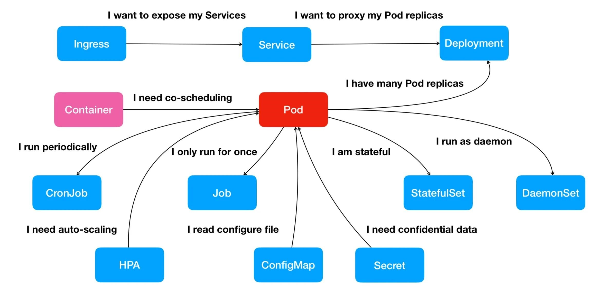

[Rancher](https://profile.zjurl.cn/rogue/ugc/profile/?version_code=769&version_name=70609&user_id=52042300867)

https://kuboard.cn/learning

https://learnk8s.io/troubleshooting-deployments
[k8s故障排除指南.pdf](../files/k8s/troubleshooting-kubernetes.pdf)


Kubernetes 中，0.5 代表请求半个 CPU 资源。表达式 0.1 等价于 表达式 100m （英文读作 one hundred millicpu 或 one hundred millicores）。在 API Server 中，表达式 0.1 将被转换成 100m，精度低于 1m 的请求是不受支持的。 CPU 的计量代表的是绝对值，而非相对值，例如，您请求了 0.1 个 CPU，无论您的节点是 单核、双核、48核，您得到的 CPU 资源都是 0.1 核。

Mi表示（1Mi=1024x1024）,M表示（1M=1000x1000）


在 top 命令查看CPU消耗，100% 代表 1核；4核为 400%；10% 代表 0.1 核 或者 100m

污点和容忍
亲和性和反亲和性


[《Kubernetes Hardening Guidance-Kubernetes 加固手册》（美国国家安全局出品）](https://jimmysong.io/kubernetes-hardening-guidance)

### 常见Pods错误

错误有两种类型，

1. 启动错误

2. 运行时错误

启动错误包括以下几种:

• ImagePullBackoff

• ImageInspectError

• ErrImagePull

• ErrImageNeverPull

• RegistryUnavailable

• InvalidImageName

运行时错误包括:

• CrashLoopBackOff

• RunContainerError

• KillContainerError

• VerifyNonRootError

• RunInitContainerError

• CreatePodSandboxError

• ConfigPodSandboxError

• KillPodSandboxError

• SetupNetworkError

• TeardownNetworkError

#### ImagePullBackoff
这个错误意味着 K8s 无法为Pod中的一个容器拉取镜像。

常见的错误原因可能是以下之一，

1. 镜像名称无效

2. 您为镜像指定了不存在的标记

3. 您试图拉取的镜像属于私有注册中心，k8s没有访问它的凭据。

前两种情况可以通过纠正镜像名称和标记来解决。

最后，您应该在Secret中将凭证添加到您的私有注册表中，并在您的Pods中引用它。

#### CrossLoopBackOff
如果容器不能启动，那么K8s将显示 CrashLoopBackOff 消息作为状态。

通常，容器在以下情况下不能启动:

1. 应用程序中有一个错误，阻止它启动。

2. 您错误地配置了容器。

3. alive探测失败了太多次。

您应该尝试从该容器检索日志，以调查它失败的原因。

如果因为容器重启太快而看不到日志，可以使用以下命令:

`kubectl logs <pod-name> --previous`

它打印来自前一次容器的错误信息。

#### RunContainerError
当容器无法启动时出现该错误。

这甚至是在容器内的应用程序启动之前。

该问题通常是由错误配置造成的，例如:

• 挂载不存在的卷，如ConfigMap、Secrets等。

• 将只读卷挂载为可读写。

你应该使用 `kubectl describe pod <pod-name>` 来检查和分析错误。

#### pod 处于挂起(Pending)状态:
当你创建一个Pod时，Pod保持在Pending状态。

为什么?

假设您的调度程序组件运行良好，以下是可能原因:

1. 集群没有足够的资源(如CPU和内存)来运行Pod。

2. 当前的命名空间有一个ResourceQuota对象，创建Pod将使命名空间超过配额。

3. Pod被绑定到Pending PersistentVolumeClaim。

你最好的选择是检查 kubectl description 命令中的Events部分:

`kubectl describe pod <pod-name>`

对于由于 ResourceQuotas 而产生的错误，您可以使用以下方法检查集群的日志:
`kubectl get events --sort-by=.metadata.creationTimestamp`

#### Pods 处于未就绪(not Ready)状态:
如果一个Pod是Running 但不是 Ready(Deployment 等控制类型状态)，这意味着 Readiness探测失败。

当Readiness探测失败时，Pod不会附加到Service，并且没有流量被转发到该实例。

Readiness 探测失败是应用程序特有的错误，因此您应该检查 kubectl describe 中的Events部分来识别错误。

#### context
显示当前context
`kubectl config current-context`
显示所有context
`kubectl config get-contexts`
切换context/设置当前context
`kubectl config use-context docker-desktop`

设置默认上下文的默认命名空间: `kubectl config set-context docker-desktop --namespace=${work_namespace}`

> kubectl config --help
可以存在多个KUBECONFIG, 只需要配置环境变量KUBECONFIG,文件名用冒号隔开
[配置对多集群的访问](https://kubernetes.io/zh-cn/docs/tasks/access-application-cluster/configure-access-multiple-clusters/)


#### kubeconfig 文件合并
通过 [kubecm](https://github.com/sunny0826/kubecm) 工具合并多个 kubeconfig 文件

```
$ export VERSION=v0.25.0

# linux x86_64 安装包
$ curl -Lo kubecm.tar.gz https://github.com/sunny0826/kubecm/releases/download/v${VERSION}/kubecm_${VERSION}_Linux_x86_64.tar.gz

# macos 安装包
$ curl -Lo kubecm.tar.gz https://github.com/sunny0826/kubecm/releases/download/v${VERSION}/kubecm_${VERSION}_Darwin_x86_64.tar.gz

# windows 安装包
$ curl -Lo kubecm.tar.gz https://github.com/sunny0826/kubecm/releases/download/v${VERSION}/kubecm_${VERSION}_Windows_x86_64.tar.gz

# # linux & macos 安装
$ tar -zxvf kubecm.tar.gz kubecm
$ cd kubecm
$ sudo mv kubecm /usr/local/bin/

# windows 安装
# Unzip kubecm.tar.gz
# Add the binary in to your $PATH
```


```
# 把需要合并的 Kubeconfig 文件放到 all_kubeconfig 目录下，执行命令后会在当前路径下产生一个新的 kubeconfig 文件

$ kubecm merge -f all_kubeconfig

# 直接把新生成的 kubeconfig 文件替换 $HOME/.kube/config 文件
$ kubecm merge -f all_kubeconfig -c

# 集群切换命令
$ kubecm switch

```


#### 日常运维常用命令
- 根据启动时间降序（descending order）
`kubectl get pods --sort-by=.metadata.creationTimestamp`

- 根据启动时间升序（ascending order）
```
kubectl get pods --sort-by=.metadata.creationTimestamp | awk 'NR == 1; NR > 1 {print $0 | "tac"}'
kubectl get pods --sort-by=.metadata.creationTimestamp | tail -n +2 | tac
kubectl get pods --sort-by={metadata.creationTimestamp} --no-headers | tac
kubectl get pods --sort-by=.metadata.creationTimestamp | tail -n +2 | tail -r
```

- 查看集群內 Pod 的服务质量等级（QoS）

`kubectl get pods --all-namespaces -o custom-columns=NAME:.metadata.name,NAMESPACE:.metadata.namespace,QOS-CLASS:.status.qosClass`

- 把Secret复制到其他namespace
```
kubectl get secrets -o json --namespace namespace-old | \
  jq '.items[].metadata.namespace = "namespace-new"' | \
  kubectl create-f  -
```

- 获取K8s的token
`kubectl -n kube-system describe $(kubectl -n kube-system get secret -n kube-system -o name | grep namespace) | grep token`

- 清理K8s异常pod
```
#clean Evicted
kubectl get pods --all-namespaces -o wide | grep Evicted | awk '{print $1,$2}' | xargs -L1 kubectl delete pod -n 
# clean error
kubectl get pods --all-namespaces -o wide | grep Error | awk '{print $1,$2}' | xargs -L1 kubectl delete pod -n 
#clean compete
kubectl get pods --all-namespaces -o wide | grep Completed | awk '{print $1,$2}' | xargs -L1 kubectl delete pod -n 
```

- 批量强制删除指定namespace下Terminating状态的pod
`kubectl get pod -n $namespace |grep Terminating|awk '{print $1}'|xargs kubectl delete pod -n $namespace --grace-period=0 --force`

- 批量强制删除集群内Terminating状态的pod
```
for ns in $(kubectl get ns --no-headers | cut -d ' ' -f1); do \
  for po in $(kubectl -n $ns get po --no-headers --ignore-not-found | grep Terminating | cut -d ' ' -f1); do \
    kubectl -n $ns delete po $po --force --grace-period 0; \
  done; \
done;
```

- 导出干净的YAML
```
#需要插件kubectl-neat支持https://github.com/itaysk/kubectl-neat
kubectl get cm nginx-config -oyaml | kubectl neat -o yaml
```

- clean unused pv
```
kubectl describe -A pvc | grep -E "^Name:.*$|^Namespace:.*$|^Used By:.*$" | grep -B 2 "<none>" | grep -E "^Name:.*$|^Namespace:.*$" | cut -f2 -d: | paste -d " " - - | xargs -n2 bash -c 'kubectl -n ${1} delete pvc ${0}'
```

- 清理没有被绑定的 PVC
```
kubectl get pvc --all-namespaces | tail -n +2 | grep -v Bound | awk '{print $1,$2}' | xargs -L1 kubectl delete pvc -n
```

- 临时释放的指定namespace下的pod
适用于不想删除 Kubernetes 集群內的信息
```
# 方法一：通过 patch 模式
kubectl get deploy -o name -n <NAMESPACE>|xargs -I{} kubectl patch {} -p '{"spec":{"replicas":0}}'

# 方法二：通过资源伸缩副本数
kubectl get deploy -o name |xargs -I{} kubectl scale --replicas=0 {}
```

- 临时关闭 Daemonsets
如果需要临时将 Daemonsets 关闭，只需要将其调度到一个不存在的 node 上即可，调整下 nodeSelector
```
kubectl patch daemonsets nginx-ingress-controller -p '{"spec":{"template":{"spec":{"nodeSelector":{"project/xdp":"none"}}}}}'
```

- 清理没有被绑定的 PV
```
kubectl get pv | tail -n +2 | grep -v Bound | awk '{print $1}' | xargs -L1 kubectl delete pv
```

- 根据pods的重启次数进行排序
```
kubectl get pods -A --sort-by='.status.containerStatuses[0].restartCount'
```

- 无缝重启deploy,daemonset,statfulset(zero downtime)
`kubectl -n <namespace> rollout restart deployment <deployment-name>`

- 根据overlay2目录名找容器
```
docker ps -q | xargs docker inspect --format '{{.Name}}, {{.State.Pid}}, {{.Id}}, {{.GraphDriver.Data.WorkDir}}'
```

- 通过变量组合展示容器绑定端口列表
```
docker inspect --format '{{/*通过变量组合展示容器绑定端口列表*/}}已绑定端口列表：{{println}}{{range $p,$conf := .NetworkSettings.Ports}}{{$p}} -> {{(index $conf 0).HostPort}}{{println}}{{end}}' Web_web_1
```

- 查询指定网络下的容器名称，如果存在输出容器名称，如果没有，输出With No Containers
```
docker inspect --format '{{range .Containers}}{{.Name}}{{println}}{{else}}With No Containers{{end}}' bridge
```

- 通过索引序号读取默认网关
```
docker inspect bridge --format '{{/*查看网络的默认网关*/}}{{(index .IPAM.Config 0).Gateway}}'
```

- 查看容器是否配置了容器策略
```
docker ps -q | xargs docker inspect --format '{{if not .State.Restarting}}{{.Name}}容器没有配置重启策略{{end}}'
```

- 查看容器当前的运行状态
```
docker inspect --format '{{or .State.Status .State.Restarting}}' configuration-center
```

- 显示所有容器的IP
```
docker inspect --format='{{range .NetworkSettings.Networks}}{{.IPAddress}}{{end}}' $(docker ps -q)
```

- 显示所有容器的mac地址
```
docker inspect --format='{{range .NetworkSettings.Networks}}{{.MacAddress}}{{end}}' $(docker ps -a -q)
```

- 显示所有容器的名称，并分离出反斜杠
```
docker inspect --format='{{.Name}}' $(docker ps -aq)|cut -d"/" -f2
```

- 创建临时可调式POD
```
kubectl run ephemeral-busybox \
  --rm \
  --stdin \
  --tty \
  --restart=Never \
  --image=lqshow/busybox-curl:1.28 \
  -- sh
```

- 获取容器的日志路径
```
docker inspect --format='{{.LogPath}}' docker-test1
```

- 调试coredns
```
kubectl run -it --rm --restart=Never --image=infoblox/dnstools:latest dnstools
```

- 查看资源使用情况
```
kubectl get nodes --no-headers | awk '{print $1}' | xargs -I {} sh -c "echo {} ; kubectl describe node {} | grep Allocated -A 5 | grep -ve Event -ve Allocated -ve percent -ve --;"
```

- 查看资源总情况
```
kubectl get no -o=custom-columns="NODE:.metadata.name,ALLOCATABLE CPU:.status.allocatable.cpu,ALLOCATABLE MEMORY:.status.allocatable.memory"
```

- 查看CPU分配情况
```
kubectl get nodes --no-headers | awk '{print $1}' | xargs -I {} sh -c 'echo -n "{}\t"|tr "\n" " " ; kubectl describe node {} | grep Allocated -A 5 | grep -ve Event -ve Allocated -ve percent -ve -- | grep cpu | awk '\''{print $2$3}'\'';'
```

- 查看内存分配
```
kubectl get nodes --no-headers | awk '{print $1}' | xargs -I {} sh -c 'echo "{}\t"|tr "\n" " " ; kubectl describe node {} | grep Allocated -A 5 | grep -ve Event -ve Allocated -ve percent -ve -- | grep memory | awk '\''{print $2$3}'\'';'
```

- 查看所有镜像
```
kubectl get pods -o custom-columns='NAME:metadata.name,IMAGES:spec.containers[*].image'
```

- 线程数统计
```
printf "    ThreadNUM  PID\t\tCOMMAND\n" && ps -eLf | awk '{$1=null;$3=null;$4=null;$5=null;$6=null;$7=null;$8=null;$9=null;print}' | sort |uniq -c |sort -rn | head -10
```

- 设置环境变量
```
kubectl set env deploy <DEPLOYMENT_NAME> OC_XXX_HOST=bbb
```

- 端口映射
将 localhost:3000 的请求转发到 nginx-pod Pod 的 80 端口
`kubectl port-forward nginx-po 3000:80`
将 localhost:3201 的请求转发到 nginx-web service 的 3201 端口
`kubectl port-forward svc/nginx-web 3201`

kubectl proxy


- 配置默认storageclass
```
kubectl patch storageclass <your-class-name> -p '{"metadata": {"annotations":{"storageclass.kubernetes.io/is-default-class":"true"}}}'
```

- 在多个pod中运行命令
```
kubectl get pods -o name | xargs -I{} kubectl exec {} -- <command goes here>
```

- 查看容器名
```
kubectl get po calibre-web-76b9bf4d8b-2kc5j -o json | jq -j ".spec.containers[].name"
```

- 进入容器namespace
```
docker ps | grep APP_NAME
docker inspect CONTAINER_ID | grep Pid
nsenter -t PID -n
```

- 查找非 running 状态的 Pod
```
kubectl get pods -A --field-selector=status.phase!=Running | grep -v Complete
```

- 获取节点列表及其内存容量
```
kubectl get no -o json | jq -r '.items | sort_by(.status.capacity.memory)[]|[.metadata.name,.status.capacity.memory]| @tsv'
```

- 使用交互 shell 访问匹配到 标签的 Pod
```
# 案例1
kubectl exec -i -t $(kubectl get pod -l <KEY>=<VALUE> -o name |sed 's/pods\///') -- bash

# 案例2
kubectl exec -i -t $(kubectl get pod -l <KEY>=<VALUE> -o jsonpath='{.items[0].metadata.name}') -- bash
```

- 获取每个节点的Pod数量
```
kubectl get po -o json --all-namespaces | jq '.items | group_by(.spec.nodeName) | map({"nodeName": .[0].spec.nodeName, "count": length}) | sort_by(.count)'
```

- 复制secret到其他namespace下
比如使用证书，镜像凭证等.
```
kubectl get secret <SECRET-NAME> -n <SOURCE-NAMESPACE> -oyaml | sed "/namespace:/d" | kubectl apply --namespace=<TARGET-NAMESPACE> -f -
```
- 重置集群节点
将节点标记为不可调度，确保新的容器不会调度到该节点
`kubectl cordon <NODE-NAME>`
Master 节点上将需要重置的节点驱逐, 除了 deemonset
`kubectl drain <NODE-NAME> --delete-local-data --force --ignore-daemonsets`
删除节点
`kubectl delete node <NODE-NAME>`
在需要重置节点上执⾏重置脚本，注意，如果在 Master 主节点执⾏ kubeadm reset，则需要重新初始化集群
`kubeadm reset`

### 文档
中文文档：https://kubernetes.io/zh/docs/

Kubernetes Handbook （Kubernetes指南）
https://github.com/feiskyer/kubernetes-handbook

和我一步步部署 kubernetes 集群
https://github.com/opsnull/follow-me-install-kubernetes-cluster

中文文档: https://rootsongjc.gitbooks.io/kubernetes-handbook
中文文档: https://jimmysong.io/kubernetes-handbook/
中文文档: https://github.com/rootsongjc/kubernetes-handbook
中文文档: https://www.kubernetes.org.cn/k8s
中文文档: https://kubernetes.io/zh/docs/
中文文档：https://jimmysong.io/kubernetes-handbook/  https://github.com/rootsongjc/kubernetes-handbook
中文文档： https://blog.frognew.com/

所有安装方式列表：https://kubernetes.io/docs/setup/

中文二进制文件安装方式文档： https://github.com/opsnull/follow-me-install-kubernetes-cluster

英文二进制文件安装方式文档： https://github.com/kelseyhightower/kubernetes-the-hard-way


使用Ansible脚本安装文档：https://github.com/gjmzj/kubeasz （在自建机房,建议使用此方法）

k8s-kubeasz-阿里云vpc部署记录: https://li-sen.github.io/2018/09/27/k8s-kubeasz-阿里云vpc部署记录/

kops在AWS中国区安装k8s文档：

https://github.com/nwcdlabs/kops-cn （建议使用此方法，该项目由aws中国区维护）

https://github.com/kubernetes/kops/blob/master/docs/aws-china.md

http://senlinzhan.github.io/2018/01/11/k8s-on-aws/

https://blog.csdn.net/cloudvtech/article/details/80539086

中文社区1： https://www.kubernetes.org.cn

中文社区2：http://dockone.io/

kubernetes相关的工具：https://github.com/kubernetes-sigs/ （你会发现很多有实用的工具可以使用）

这里有一个在aws上管理k8s的pdf文档：https://s3.cn-north-1.amazonaws.com.cn/sides-share/AWS+Webinar+2018/PDF/EKS+Webinar+Chinese.pdf

这里介绍Terraform 管理 EKS：https://www.hashicorp.com/blog/hashicorp-announces-terraform-support-aws-kubernetes

[图解kubernetes调度器SchedulingQueue核心源码实现](https://m.toutiao.com/i6781307442589336067/)

[Kubernetes REST API](https://www.jianshu.com/p/0de6bc64c423)

## helm

中文文档：https://whmzsu.github.io/helm-doc-zh-cn/

helm 工具集合：https://github.com/helm/charts/tree/master/stable
## K less S
### k0s
k0s,一个单文件的kubernetes
https://github.com/k0sproject/k0s

### k3d
[Little helper to run CNCF's k3s in Docker 在 Docker 中运行 k3s](https://github.com/k3d-io/k3d)

### k3s
边缘计算
https://github.com/k3s-io/k3s

### kind
[Kubernetes IN Docker - local clusters for testing Kubernetes](https://github.com/kubernetes-sigs/kind)
k8s in docker/k8s in pod

## 其它
### 监控工具
#### kubectl-debug
https://github.com/aylei/kubectl-debug 这个是别人开发的插件

另外k8s 1.20原生支持 kubectl debug （跟上面不是一个东西）, Kubernetes v1.25 [stable]
https://kubernetes.io/blog/2020/12/08/kubernetes-1-20-release-announcement/#kubectl-debug-graduates-to-beta

https://kubernetes.io/docs/tasks/debug-application-cluster/debug-running-pod/
由于容器崩溃或容器镜像不包含调试程序而导致 kubectl exec 无法运行时，临时容器对于排除交互式故障很有用。
具体方式见https://github.com/kubernetes/website/blob/main/content/zh-cn/docs/tasks/debug/debug-application/debug-running-pod.md


#### Pixie
Instant Kubernetes-Native Application Observability
https://github.com/pixie-io/pixie

Pixie 是 Kubernetes 应用的可观察性工具，它可以查看集群的高级状态，如服务地图、集群资源和应用流量；还可以深入到更详细的视图，如 pod 状态、火焰图和单个 full-body 应用请求。Pixie 使用 eBPF 自动收集遥测数据，它在集群本地收集、存储和查询所有的遥测数据，使用不到 5% 的集群 CPU。Pixie的用例包括集群内的网络监控、基础设施健康、服务性能和数据库查询剖析。

#### Mizu
[Kubernetes的API流量查看器](https://github.com/up9inc/mizu)

类似TCPDump and Chrome Dev Tools的组合

```
mizu tap pod-name
# 正则
mizu tap "(catalo*|front-end*)"
mizu tap "^ca.*" # 以ca开头的所有pod

# User agent filtering（任何包含具有指定值(kube-probe或prometheus)的User-Agent报头的请求都不会被捕获）
mizu tap "^ca.*" --set tap.ignored-user-agents=kube-probe --set tap.ignored-user-agents=prometheus  

mizu tap # 当前命名空间中的所有pod
mizu tap ".*" # 所有pod
mizu tap ".*" -n sock-shop # 查看sock-shop命名空间中的pod
# 然后打开 http://localhost:8899 查看
```

#### Kubewatch
Kubewatch是一个很好用的工具，kubewatch能够监控那些特定的Kubernetes事件，并将此类事件以通知的形式推送到诸如Slack和PagerDuty的端点上。可以确保你的容器是安全的，并使用行业最佳实践进行打包，同时监视软件的漏洞和更新。但是，用户表示，添加对多个实例的支持将会更有帮助。支持多个端点，且易于部署。


#### Weave Scope

Weave Scope用来监视和解决Kubernetes和Docker集群的故障，你就可以解放双手轻松地识别和纠正你的容器化应用程序的问题。

#### Test-infra

Testinfra 是一个基础架构测试框架，它可以轻松编写单元测试来验证服务器的状态。它支持的后端之一是 Ansible，所以这意味着 Testinfra 可以直接使用 Ansible 的清单文件和清单中定义的一组机器来对它们进行测试。对于处理复杂的模板来测试和检测错误非常有用。

#### Trireme

Trireme通过提高Kubernetes进程、工作负载和容器的安全性和降低复杂性，引入了一种不同的网络授权方法。建议用它来减轻Kubernetes工作负载、容器和进程的复杂性。它可以帮助你在应用程序层强制实施安全性。

#### Sysdig Falco

这是一个可以提供深度容器可见性的行为活动监视工具，它缩短了检测安全事件所需的时间，并应用了允许你持续监视和检测容器、应用程序、主机和网络活动的规则。使用它可以对其基础设施进行持续检查、异常检测，并为任何类型的 Linux 系统调用设置警报通知。

还可以通过 Falco 监视 shell 何时在容器中运行、容器在哪里挂载、对敏感文件的意外读取、出站网络尝试以及其他可疑调用。

### 开发工具
#### Telepresence
[开发和调试现有的服务](https://kubernetes.io/zh/docs/tasks/debug-application-cluster/local-debugging/)
它让你可以在本地调试Kubernetes服务，简化了开发和调试过程。

#### Helm

Helm帮助用户管理他们的Kubernetes应用程序，通过Helm图表让你可以共享你的应用程序。这让用户能够创建可共享可复制的构建，但它不推荐用于更高级、更频繁的部署。

#### Keel

它让用户可以重新专注于编写代码和测试他们的应用程序。因为如果库中有新的应用程序版本可用，它就会自动更新kubernetes的工作负载。

### Kubernetes日志监控工具
#### Zebrium
优点：易于启动；只需复制/粘贴自定义的HELM或kubectl命令；自动检测问题和根本原因，无需手动规则；可以用作独立的日志管理工具，也可以用作现有日志管理工具（例如ELK Stack）的机器学习附件。
缺点：免费计划限制为每天500 MB，保留3天；支持Kubernetes，Docker和大多数常见平台，但不支持Windows

#### Sematext
用于日志管理和应用程序性能监控的解决方案。Sematex提供了系统状态的全栈可见性。
Sematext不仅限于Kubernetes日志，还可以监控和Kubernetes（基于度量标准和日志）。收集到的日志会自动针对几种不同的已知日志格式进行解析/结构化，并且用户还可以提供自定义日志的模式。它还公开了Elasticsearch API，因此也可以使用任何与Elasticsearch配合使用的工具，例如Filebeat和Logstash与Sematex。可以将其用作ELK的变体或与本机Sematext生态系统一起使用。该工具有助于创建特定规则，来监控特定情况并捕获异常。借助Sematex全面的实时仪表板，客户可以控制和监控所有服务。

优点：与其他Sematext云工具集成；可配置超限来阻止日志被接受从而控制成本；具有ELK的灵活性。

缺点：Sematext小部件和Kibana不能在一个仪表板上混合使用；自定义解析需要在日志传送器中完成，Sematext仅在服务器端解析Syslog和JSON；跟踪功能较弱，但已经在计划进行改进。

#### Loki
Loki是一个受Prometheus启发的多租户和高度可用的日志聚合工具。这款工具有助于收集日志，但是用户将需要为其建立手动规则。Loki与Grafana，Prometheus和Kubernetes合作。Loki可以让内部流程更有效率。如，它节省了Paytm Insider 75%的日志记录和监控成本。Loki不会索引你的日志内容，而是仅索引每个事件流的一组标签，因此效率很高。

优点：拥有大型的生态系统；丰富的可视化功能；由于未索引日志内容而提高了效率。并且可以配合tempo调用链查看日志.

缺点：未针对Kubernetes日志管理进行优化；大量的架构规则手工工作；缺少内容索引可能会限制搜索性能。


- Loki 是主服务器，负责存储日志和处理查询。对标ELK中的ElasticSearch。
> dotnet add package Serilog.Sinks.Loki
> .WriteTo.LokiHttp(new NoAuthCredentials("http://localhost:3100"))//配置Loki Url和认证方式 (请求时附带调用链信息，loki配置一个调用链后端)
> https://github.com/JosephWoodward/Serilog-Sinks-Loki
> demo: https://github.com/grafana/tempo/tree/master/example/docker-compose#loki-derived-fields
- Promtail 是代理，负责收集日志并将其发送给loki。对标ELK中的Logstash。

- Grafana提供用户界面。对标ELK中的Kibana。

#### ELK Stack

ELK是最著名的日志管理开源工具。ELK是Elasticsearch，Logstash和Kibana的首字母缩写。每个组件负责日志记录过程的不同部分。Elasticsearch是一个功能强大且可扩展的搜索系统，Logstash聚合并处理日志，而Kibana提供了一个分析和可视化界面，可帮助用户理解数据。它们共同为Kubernetes提供了全面的日志记录解决方案。但ELK Stack还有许多其他变体，如EFK Stack，即Elasticsearch，Fluentd和Kibana组成。

优点：ELK是众所周知的，并且拥有庞大的社区；非常广泛的平台支持；Kibana中丰富的分析和可视化功能；需要对日志和手动定义的警报规则进行复杂的分析。

缺点：维持规模难度大；需要很多调整，特别是对于大型环境；大量的资源需求；某些功能需要付费许可证。

#### Fluentd

优点：大型社区和插件生态系统；统一日志记录层；经过验证的可靠性和性能。可以在不到10分钟的时间内安装完毕。

缺点：难以配置；对转换数据的支持有限；不是完整的日志记录解决方案。


### Kubernetes工具

#### KubeDB
在Kubernetes上运行生产级数据库  
https://github.com/kubedb  
https://kubedb.com/  

KubeDB允许管理员创建用于管理数据库的Kubernetes运算符。运行备份，克隆，监视，快照和声明性地创建数据库都是混合的一部分。
- Elasticsearch
- Memcached
- MongoDB
- MySQL
- Percona XtraDB
- PgBouncer
- PostgreSQL
- ProxySQL
- Redis
#### Headlamp
K8s UI

#### Bitnami Cabin
适用于iOS和Android的Kubernetes仪表板

Cabin为Kubernetes管理员提供了可从iOS或Android智能手机访问的Kubernetes仪表板版本。完整的Kubernetes仪表板中提供的许多功能都可以从Cabin启动，包括Helm图表，扩展部署，读取pod日志以及访问Kubernetes托管的基于Web的应用程序。

#### Goldpinger
可视化Kubernetes集群

#### K9s
全屏Kubernetes CLI UI

其它UI
- Kubernetes-Dashboard
- Rancher
- Kuboard
- Lens(lens6开始收费了)
- Octant
- Kubenav
- Infra.App

#### Kube-ops-view
多个Kubernetes集群的仪表板

Kubernetes有一个用于通用监控的有用仪表板，但Kubernetes社区正在尝试其他方式向Kubernetes管理员有用地呈现数据。Kube-ops-view就是这样一个实验;它提供了多个Kubernetes集群的一览式视图，以图形方式呈现，因此可以一目了然地看到集群中CPU和内存使用情况以及pod的状态。请注意，它不允许您调用任何命令;它严格用于可视化。但它提供的可视化效果非常高效，适用于运营中心的墙壁监视器。

#### Gravity
便携式Kubernetes集群

如果你想将应用程序部署到Kubernetes，许多应用程序都会使用Helm图表来指导和自动化该过程。但是，如果你想按原样使用Kubernetes集群并将其部署到某个地方呢?

Gravity获取Kubernetes集群及其容器注册表及其运行应用程序(称为“应用程序包”)的快照。程序包只是一个.tar文件，可以在Kubernetes运行的任何地方复制集群。

Gravity还确保目标基础结构可以支持与源相同的行为要求，并且目标上的Kubernetes运行时也可以满足要求。Gravity的企业版增加了安全功能，包括基于角色的访问控制，以及跨多个集群部署同步安全配置的能力。


#### Kaniko
在Kubernetes集群中构建容器

大多数容器镜像都构建在容器堆栈外部的系统上。但有时，你希望在容器堆栈中执行构建过程，例如，在正在运行的容器内或Kubernetes集群上的某个位置。

Kaniko在容器环境中执行容器构建，但不依赖像Docker这样的容器守护进程来完成其工作。Kaniko获取基本镜像，提取文件系统，然后在提取的文件系统顶部的用户空间中执行所有构建命令，在每个命令之后获取文件系统的快照。

#### Koki Short
可管理的Kubernetes清单

Koki Short像上面的Kedge，是一个改进应用程序定义或表现方式在Kubernetes中工作的项目。与Kedge定义一样，Koki Short使用缩写语法来描述Kubernetes pod，它可以转换为完整的语法，然后再转换回来。与Kedge定义不同，Koki Short也是模块化的，这意味着来自一个Short声明的细节可以在其他声明中重复使用，因此可以简洁地定义许多具有共同元素的pod。

#### Kops

Kubernetes集群的命令行操作

Kops由Kubernetes团队开发，允许你从命令行管理Kubernetes集群。它支持在AWS和GCE上运行的集群，VMware vSphere和其他环境正在开发中。除了自动化设置和拆卸过程外，Kops还可以帮助实现其他类型的自动化。例如，它可以生成Terraform配置以允许使用Terraform重新部署集群。

#### Kubebox
Kubernetes的终端控制台

作为Kubernetes的高级终端控制台，Kubebox不仅为Kubernetes及其API提供了美化外壳。它提供内存和CPU利用率的交互式显示，pod列表，运行日志和配置编辑器。最重要的是，它可作为Linux，Windows和MacOS的独立应用程序提供。

#### Kubecost
运行Kubernetes的指标成本

大多数Kubernetes管理工具都侧重于易用性，监控，对pod行为的洞察等。但是如何监控与运行Kubernetes相关的成本?

Kubecost使用实时Kubernetes指标以及从主要云提供商上运行的集群派生的实际成本信息，以提供每个集群部署的每月成本的仪表板视图。内存，CPU，GPU和存储的成本都由Kubernetes组件(容器，容器，服务，部署等)分解。

Kubecost还可以跟踪“群集外”资源(例如S3存储桶)的成本，尽管目前仅限于AWS。成本数据甚至可以共享回Prometheus，因此可以使用数据以编程方式更改群集行为。

#### Kube-monkey

Kubernetes的混沌猴子

对系统进行压力测试的一种可靠方法是随意破坏。这就是Netflix的混乱猴子的理论，它是一种混乱的工程工具，可以随机终止在生产中运行的虚拟机和容器，以“鼓励”开发人员构建更具弹性的系统。Kube-monkey是对Kubernetes集群进行压力测试的相同基本思想的实现。它的工作原理是随机删除你专门指定的群集中的pod，并且可以进行微调以在特定时间窗口内运行。

#### Kube-ps1
Smart Kubernetes命令提示符

不，Kube-ps1不是Kubernetes的第一代索尼PlayStation模拟器(虽然那会非常漂亮)。它是Bash的一个简单补充，它在提示符中显示当前的Kubernetes上下文和命名空间。Kube-shell包含了这一功能以及许多其他功能，但如果你想要的只是更智能的提示，Kube-ps1可以提供很少的开销。

#### Kube-prompt

交互式Kubernetes客户端

对Kubernetes CLI，Kube-prompt的另一个最小但有用的修改允许你输入与Kubernetes客户端的交互式命令会话的数量。Kube-prompt使你不必键入kubectl来为每个命令添加前缀，并为每个命令提供自动完成功能以及上下文信息。

#### Kube-shell
用于Kubernetes CLI的Shell

Kubernetes命令行功能强大，但与任何命令行应用程序一样，选择其选项可能很繁琐。Kube-shell将标准Kubernetes命令行包装在一个集成shell中，该shell提供常用命令的自动完成和自动建议，包括Kubernetes服务器提供的建议(例如，服务名称)。它还为你提供了更强大的命令历史记录功能，vi样式编辑模式以及用户，命名空间，群集和其他特定于安装的详细信息的运行上下文信息。

#### Kubespy

实时监控Kubernetes资源

Pulumi的Kubespy是一个诊断工具，允许你实时跟踪Kubernetes资源的更改，为你提供一种文本视图仪表板。例如，你可以在启动时观察pod状态的变化：pod定义被写入Etcd，pod被安排在节点上运行，节点上的Kubelet创建pod，最后是pod标记为正在运行。Kubespy可以作为独立的二进制文件运行，也可以作为Kubectl的插件运行。

#### Skaffold
Kubernetes的迭代开发

Skaffold是Google自己的Kubernetes工具之一，是一种为Kubernetes应用程序执行持续部署的方法。当你对源代码进行更改时，Skaffold会自动检测它们，触发构建和部署过程，并在出现任何错误时向您发出警告。 Skaffold完全在客户端运行。它可以在现有的CI/CD流水线中使用，并与一些外部构建工具集成，主要是谷歌自己的Bazel。

#### Stern和Kubetail
为Kubernetes记录标记

Stern允许从Kubernetes中的pod和容器生成颜色编码输出(根据tail命令)。这是一种快速方法，可以将来自多个资源的所有输出组合成一个可以一目了然地读取的流。与此同时，可以一目了然(颜色编码)来区分流。

Kubetail同样将来自多个pod的日志聚合到一个流中，对不同的pod和容器进行颜色编码。但是Kubetail是一个Bash脚本，所以它只需要一个shell。

#### Teresa
Kubernetes的简单PaaS

Teresa是一个应用程序部署系统，在Kubernetes上作为简单的PaaS运行。组织成团队的用户可以部署和管理属于他们的应用程序。这使得受特定应用程序信任的人更轻松地使用它，而无需直接处理Kubernetes。

#### Tilt
将容器更新到Kubernetes集群

由Windmill Engineering开发，Tilt实时监控对Dockerfiles的更改，然后将这些更改逐步部署到Kubernetes集群中的相应容器中。从本质上讲，它允许开发人员实时更新实时集群，只需更新Dockerfile即可。Tilt在集群内执行构建，唯一引起的变化是源代码。
