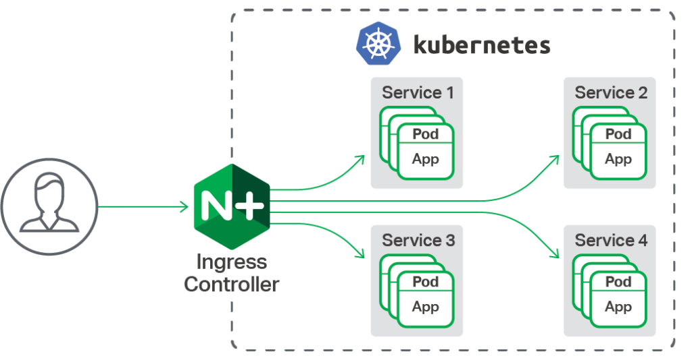

<!--toc-->
[TOC]


## Ingress
Ingress 是 Kubernetes 的一种 API 对象，将集群内部的 Service 通过 HTTP/HTTPS 方式暴露到集群外部，并通过规则定义 HTTP/HTTPS 的路由。Ingress 具备如下特性：集群外部可访问的 URL、负载均衡、SSL Termination、按域名路由（name-based virtual hosting）。

Ingress Controller （通常需要负载均衡器配合）负责实现 Ingress API 对象所声明的能力。

1. Ingress Controller 监听所有 worker 节点上的 80/443 端口(netstat -lnpt 查看端口)
2. Ingress Controller 将所有对域名为 a.kuboard.cn 的 HTTP/HTTPS 请求路由到 Service B 的 9080 端口
3. Service B 将请求进一步转发到其标签所选择的 Pod 容器组（通过 targetPort 指定容器组上的端口号）
请求被转发的过程为：

1. 假设您将 a.kuboard.cn 的 DNS 解析到了集群中的一个 worker 节点的 IP 地址 192.168.2.69。（如果您的 worker 节点有外网地址，请使用外网地址，这样您可以从外网访问您的服务）
2. 从客户端机器执行命令 curl http://a.kuboard.cn/abc/，该请求您将被转发到 192.168.2.69 这个地址的 80 端口，并被 Ingress Controller 接收
3. Ingress Controller 根据请求的域名 a.kuboard.cn 和路径 abc 匹配集群中所有的 Ingress 信息，并最终找到 Ingress B 中有这个配置，其对应的 Service 为 Service B 的 9080 端口
4. Ingress Controller 通过 kube-proxy 将请求转发到 Service B 对应的任意一个 Pod 上 与 Service B 的 9080 端口对应的容器端口上。（从 Ingress Controller 到 Pod 的负载均衡由 kube-proxy + Service 实现）


### Ingress Controller
如上所述，您必须在 Kubernetes 集群中安装了 Ingress Controller，您配置的 Ingress 才能生效。
Ingress 只是 Kubernetes 中的一种配置信息；Ingress Controller 才是监听 80/443 端口，并根据 Ingress 上配置的路由信息执行 HTTP 路由转发的组件。

片段
```
apiVersion: extensions/v1beta1
kind: DaemonSet
metadata:
  name: nginx-ingress
  namespace: nginx-ingress
	# ...
spec:
  selector:
    matchLabels:
      app: nginx-ingress
  template:
    metadata:
      labels:
        app: nginx-ingress
    spec:
      serviceAccountName: nginx-ingress
      containers:
      - image: nginx/nginx-ingress:1.5.3
        name: nginx-ingress
        ports:
        - name: http
          containerPort: 80
          hostPort: 80
        - name: https
          containerPort: 443
          hostPort: 443
```
> Ingress Controller 并非只能监听 80/443 端口，您可以根据自己网络拓扑的需要，选择合适的端口
> 根据您安装 Ingress Controller 的方式不同，您的 Ingress Controller 并不一定监听了所有 worker 节点的 80/443 端口

https://github.com/nginxinc/kubernetes-ingress
kubectl apply -f daemon-set/nginx-ingress.yaml
kubectl create -f service/nodeport.yaml
https://github.com/nginxinc/kubernetes-ingress/blob/master/deployments/service/nodeport.yaml

### 之前部署的都是


kubectl apply -f https://raw.githubusercontent.com/kubernetes/ingress-nginx/master/deploy/static/mandatory.yaml
kubectl apply -f https://raw.githubusercontent.com/kubernetes/ingress-nginx/master/deploy/static/provider/cloud-generic.yaml

更新了
https://github.com/kubernetes/ingress-nginx/blob/master/deploy/static/provider/kind/deploy.yaml
https://github.com/kubernetes/ingress-nginx

## ingress-nginx/how-it-works
> 原文链接：https://kubernetes.github.io/ingress-nginx/how-it-works/

本文的目的是解释 Nginx Ingress 控制器的工作原理，特别是 Nginx 模型的构建方式以及我们为何需要这个模型。



**1. NGINX 配置**

ingress-nginx 的目标是构造配置文件（nginx.conf），主要用途是在配置文件有任何变更后都需要重新加载 NGINX。不过需要特别注意的是，在只有 upstream 配置变更的时候我们不需要重新加载 Nginx（即当你部署的应用 Endpoints 变更时）。我们使用 lua-nginx-module(https://github.com/openresty/lua-nginx-module) 达到这个目的。请通过 下面的内容 来了解有关操作方法的更多信息。

**2. NGINX 模型**

通常，一个 Kubernetes 控制器采用 synchronization loop pattern(https://coreos.com/kubernetes/docs/latest/replication-controller.html#the-reconciliation-loop-in-detail) 来检查控制器中所需的状态是否已更新或者需要变更。为了达到这个目的，我们需要使用集群中放入不同对象来构建模型，特别是 Ingresses、Services、Endpoints、Secrets 以及 Configmaps 来生成反映集群状态时间点的配置文件。

为了从集群获取这些对象，我们使用 Kubernetes Informers(https://godoc.org/k8s.io/client-go/informers#NewFilteredSharedInformerFactory)，特别是 FilteredSharedInformer。当一个新的对象添加、修改或者删除的时候，informers 允许通过 回调(https://godoc.org/k8s.io/client-go/tools/cache#ResourceEventHandlerFuncs) 针对单个变更进行响应。不过没有办法知道一个特定的变更是否会影响最终的配置文件，所以在每次变更时，我们都必须基于集群的状态重新构建一个新模型，并将其和当前的模型进行比较。如果新模型等于当前模型，那么我们就可以避免生成新的 NGINX 配置并触发重新加载，否则，我们就通过 Endpoints 来检查不同，然后使用 HTTP POST 请求一个新的 Endpoints 列表发送给运行在 Nginx 中的 Lua 程序并且避免重新生成一个新的 NGINX 配置以及触发重新加载。如果运行的模型和当前的差异不仅仅是 Endpoints，我们则基于新的模型创建一个新的 NGINX 配置文件，替代当前的模型并触发一次重新加载。

该模型的用途之一是当状态没有变化的时候避免不必要的重新加载，并检测定义中的冲突。

生成 NGINX 配置最终是从一个 Go template 生成的，使用新模型作为这个模板所需要的变量输入。

**3. 构建 NGINX 模型**

建立模型是一项成本比较高的操作，所以必须使用同步循环。通过使用 work queue(https://github.com/kubernetes/ingress-nginx/blob/master/internal/task/queue.go#L38)，可以不丢失变更并通过 sync.Mutex 移除来强制执行一次同步循环，此外还可以在同步循环的开始和结束之间创建一个时间窗口，从而允许我们摒弃不必要的更新。重要的是要理解，集群中的任何变更都会生成事件，然后 informer 会发送给控制器，这也是使用 work queue 的原因之一。

建立模型的操作方式：

- 通过 CreationTimestamp 字段对 Ingress 规则排序，即先创建的规则优先
    
- 如果相同 host 的相同路径被多个 Ingress 定义，那么先创建的规则优先
    
- 如果多个 Ingress 包含相同 host 的 TLS 部分，那么先创建的规则优先
    
- 如果多个 Ingresses 定义了一个 annotation 影响到 Server 块配置，那么先创建的规则优先
    
- 创建一个 NGINX Servers 列表（按主机名）
    
- 创建一个 NGINX Upstreams 列表
    
- 如果多个 Ingresses 定义了同一个 host 的不同路径，ingress 控制器会合并这些规则
    
- Annotations 被应用于这个 Ingress 的所有路径
    
- 多个 Ingresses 可以定义不同的 annotations，这些定义不会在 Ingresses 之间共享
    

**4. 重新加载**

下面描述了一些需要重新加载的场景：

- 新的 Ingress 资源创建
    
- 添加 TLS 部分到现有的 Ingress
    
- 变更 Ingress annotations 不仅仅影响 upstream 配置。对于实例 load-balance 这个 annotation 不需要重新加载
    
- 从 Ingress 中添加/移除路径
    
- 一个 Ingress、Service、Secret 被移除
    
- 一些 Ingress 缺少可用的引用对象时，如 Service 或者 Secret
    
- Secret 对象被更新了
    

**5. 避免重新加载**

在某些情况下，有可能需要避免重新加载，尤其是在 endpoints 发送变化的时候，如 Pod 启动或者被替换时。完全移除重新加载这超过了 Ingress 控制器的范围。这将需要大量的工作，并且有时没有任何意义。仅当 NGINX 变更了读取新配置的方式时，才进行变更，基本上，新的更改不会替代工作进程。

**5.1 避免 Endpoints 变更时重新加载**

在每个 endpoint 对象变更时，控制器从所有能看到的服务上获取 endpoints 并生成相应的后端对象。然后将这些对象发送给运行在 Nginx 内部的 Lua 处理程序。Lua 程序将这些后端存储在共享内存区域。然后对于在 balancer\_by\_lua 上下文运行的每个请求，Lua 代码检测 endpoints 选择对应 upstream 并应用已经配置的负载均衡算法，Nginx 负责其余的工作。这样，我们避免在 endpoint 变更时重新加载 Nginx。注意，这也包括仅影响 Nginx upstream 配置的 annoations 变更。

在频繁部署应用的较大集群中，这个特性可以避免大量的 Nginx 重新加载，否则会影响响应延迟，负责均衡质量（每一次重新加载 Nginx 都会重置负载均衡状态）等等。

**5.2 避免因错误的配置而中断**

因为 ingress-nginx 使用 synchronization loop pattern，它对所有匹配到的对象应用配置。如果某些 Ingress 对象配置损坏，如 nginx.ingress.kubernetes.io/configuration-snippet 这个 annotation 语法错误，生成的配置变得无效，将不会重新加载，并不再考虑其它 Ingress。

为了防止这种情况发生，nginx ingress 控制器选择暴露一个 validating admission webhook server(https://kubernetes.io/docs/reference/access-authn-authz/admission-controllers/#validatingadmissionwebhook) 以确保传入的 ingress 对象可用性。这个 webhook 把传入的 ingress 对象追加到 ingresses 列表上，生成配置并调用 nginx 以确保配置没有语法错误。

* * *


[原文](https://mp.weixin.qq.com/s/hzeS8LFHTTEA8IyNlej4tw)