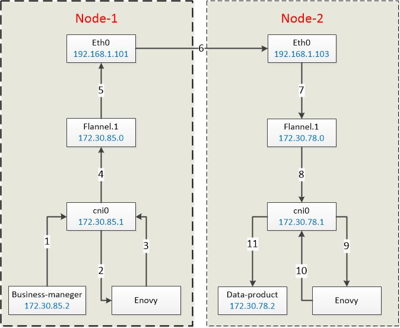

[TOC]

## 什么是Istio
当前我们已经完成从单体的应用程序向微服务架构的转型，未来还可能会面临更多的分布式场景需求。以往只需要运行好一个单体的应用，现在却面临着对整体服务网络管理，随着规模和复杂度的不断增长，服务网络势必会越来越难以理解和管理。那么我们如何去应对这些挑战呢？这就是Istio所能为我们解决的问题。

忘了在哪看到过类似的话了，开发人员应该把更多的精力放在对业务和功能的实现上，而不是被繁琐的日志、监控、测试等辅助模块所禁锢。事实上，我们启用Redis、Grpc、Iris等——正是在往这个简化开发步骤的方向走，总不能每开发一个应用都得实现一套TCP/IP通讯、实现一套红黑树或跳表吧。而Istio则为我们把这件事执行的更彻底。让我们看看Istio到底能干啥？

Istio lets you connect, secure, control, and observe services.官方给出的Istio的总结，很简单明了。连接、安全、控制和观测服务。换个思路来讲，Istio针对现有的服务网络，提供一种简单的方式将连接、安全、控制和观测的模块，与应用程序或服务隔离开来，从而开发人员可以将更多的精力放在核心的业务逻辑上，以下是Istio的核心功能概述：
- HTTP、gRPC、WebSocket 和 TCP 流量的自动负载均衡。
- 通过丰富的路由规则、重试、故障转移和故障注入，可以对流量行为进行细粒度控制。
- 可插入的策略层和配置 API，支持访问控制、速率限制和配额。
- 对出入集群入口和出口中所有流量的自动度量指标、日志记录和追踪。
- 通过强大的基于身份的验证和授权，在集群中实现安全的服务间通信。

## 架构和原理
https://istio.io/docs/ops/deployment/architecture/

Istio服务网格在逻辑上分为数据平面和控制平面。

- 数据平面(data plane)由部署为边车的一组智能代理（Envoy）组成。 这些代理与通用策略和遥测集线器[Mixer](https://istio.io/docs/reference/config/policy-and-telemetry/)一起协调和控制微服务之间的所有网络通信

- 控制平面(control plane)管理和配置代理以路由流量。 此外，控制平面将混合器(Mixers)配置为执行策略并收集遥测。


Istio中的流量分为数据平面流量和控制平面流量。 数据平面流量是指工作负载的业务逻辑发送和接收的消息。 控制平面流量是指在Istio组件之间发送的用于配置网格行为的配置和控制消息。 Istio中的流量管理专门指数据平面流量。

## 组件

### Envoy - Proxy代理
Istio使用Envoy代理的扩展版本。
Envoy是使用C ++开发的高性能代理，可为服务网格中的所有服务调解所有入站和出站流量。
Envoy代理是与数据平面流量交互的唯一Istio组件。


Envoy之所以有能力拦截下所有的流量，是因为它被设计为部署在每一个需要管理的Pod里，作为一个独立容器存在，支持通过配置iptables或cni网桥两种方式来拦截流量，请看上图，Business-manager容器的请求发出时，会经过本Pod的Enovy代理，Enovy完成规则校验、数据采集、日志等操作后，再转发出去；值得注意的是，请求方Enovy转发出去的流量会发送给接收方的Enovy，之后才有可能到达真正的接收方data-product容器。当然这些操作是Istio的活，我们要做的仅仅是通过配置的形式告诉Istio我们要对哪些流量做什么动作。
通过对拦截下来的流量的解析和修改（是的，理论上什么都能干，包括修改甚至丢弃流量），Envoy包括但不限于以下功能：

Sidecar proxies per microservice

- Dynamic service discovery(动态服务发现)
- Load balancing(负载均衡)
- TLS termination(TLS 终止)
- HTTP/2 and gRPC proxies( HTTP/2 & gRPC 代理)
- Circuit breakers(熔断器)
- Health checks(健康检查)
- Staged rollouts with %-based traffic split(基于百分比流量拆分的灰度发布)
- Fault injection(故障注入)
- Rich metrics(丰富的度量指标)

Envoy代理启用的一些Istio功能和任务包括：
- 流量控制功能：使用丰富的路由规则对HTTP，gRPC，WebSocket和TCP流量实施细粒度的流量控制。

- 网络弹性功能：设置重试，故障转移，断路器和故障注入。

- 安全和身份验证功能：实施安全策略并实施通过配置API定义的访问控制和速率限制。

### Mixer(混合器)
代理和微服务利用的中央组件，以执行诸如授权，速率限制，配额，身份验证，请求跟踪和遥测收集之类的策略。

顾名思义，Mixer混合了各种策略以及后端数据采集或遥测系统的适配器，从而实现了前端Proxy与后端系统的隔离与汇合。Mixer是一个灵活的插件模型，它一端连着Envoy，同时我们可以将日志、监控、遥测等各种系统“插入”到Mixer的另一端中，从而得到我们想要的数据或结果。


#### Mixer拓扑结构
我们来看下Mixer拓扑图，Mixer被设计为一个独立运行的模块，它可以“插入”logging日志、quota指标、auth安全认证、Tele遥测等很多模块。每插入一个模块都会在前端生成一个规则过滤器。前端的Enovy在每次流量到来时，都会请求Mixer，匹配每一个过滤器。

这就涉及到性能问题了，所以Istio在这个拓扑下设计了一个二级缓存系统。Envoy端在每个Pod里有一个一级缓存，当然这个缓存不能太大；Mixer端会有一个二级缓存，由于Mixer是独立运行的，所以这个缓存可以设计的比较大。这样Envoy可以预先缓存一部分规则，只有当规则缺失时才需要向Mixer请求，这就减少了每次流量到来的网络请求次数；另一方面，日志等数据上送，也是异步执行的，先经过一级缓存、二级缓存再到达后端存储或处理系统。

总体而言Mixer提供：
- **后端抽象（Backend Abstraction）** Mixer将Istio的其余部分与各个基础架构后端的实现细节隔离开来。

- **中介（Intermediation）** Mixer使操作员可以对网格和基础架构后端之间的所有交互进行精细控制。
#### Adapters
Mixer是高度模块化和可扩展的组件。
它的主要功能之一是抽象出不同策略和遥测后端系统的细节，从而使Istio的其余部分可以不了解这些后端。


#### Attributes
Mixer本质上是一种属性处理机。 Envoy边车为每个请求调用Mixer，为Mixer提供一组描述请求和请求周围环境的属性。 根据其配置和给定的特定属性集，Mixer生成对各种基础架构后端的调用。
Here are some example attributes with their associated values:
```
request.path: xyz/abc
request.size: 234
request.time: 12:34:56.789 04/17/2017
source.ip: [192 168 0 1]
destination.service.name: example
```


#### Configuration model
https://istio.io/docs/reference/config/policy-and-telemetry/mixer-overview/#configuration-model


### Pilot(引导)
Pilot是为我们提供配置智能路由（如A/B测试、金丝雀发布等）、弹性（超时、重发、熔断等）等功能的管理系统，它提供了一系列rules api，允许运维人员指定一系列高级的流量管理规则。Pilot负责将我们的配置转换并写入到每个sidecar（Enovy）。

下图显示了平台适配器和Envoy代理如何交互。


1. 平台启动一个服务的新实例，该实例通知其平台适配器。

2. 平台适配器将实例注册到Pilot抽象模型。

3. Pilot将traffic rules和配置分发给Envoy代理以说明更改。


您可以使用Istio的[流量管理API](https://istio.io/docs/concepts/traffic-management/#introducing-istio-traffic-management)来指示Pilot优化Envoy配置，以更精细地控制服务网格中的流量。


### Citadel(堡垒)
它管理着集群的密钥和证书，是集群的安全部门。典型的如果我们的服务是跨网络通讯（Istio允许我们建立一个安全的集群的集群网络），开发人员想省事懒得对通讯数据进行加解密和身份认证，这事就可以交给Citadel来处理了。更详细的说，Istio各个模块在安全性上分别扮演以下角色：
- Citadel，用于密钥和证书管理
- Sidecar和周边代理，实现客户端和服务器之间的安全通信
- Pilot，将授权策略和安全命名信息分发给代理
- Mixer，管理授权和审计

Starting from release 0.5,you can use Istio’s [authorization feature](https://istio.io/docs/concepts/security/#authorization) to control who can access your services.


### Galley
目前这个组件的作用是验证用户编写的Istio api配置。从官网的说法来看，后面这个组件会逐步接管获取配置、处理和分配的工作，比如从k8s的数据中心（etcd）获取集群信息的活，理论上应该交给Galley干。从这个信息来看，Galley的定位应该类似于k8s的api server组件，提供集群内统一的配置信息接口，从而将用户配置的细节隔离开来。


## 设计目标

### Maximize Transparency 最大化透明度
### Extensibility 可扩展性
### Portability 可移植性
### Policy Uniformity 政策统一

## Deployment Models 部署模型
1. single or multiple cluster
2. single or multiple network
3. single or multiple control plane
4. single or multiple mesh

### Cluster models 集群模型

#### Single cluster
单群集部署提供了简单性，但缺少其他功能，例如，故障隔离和故障转移。

#### Multiple clusters
- 故障隔离和故障转移：cluster-1发生故障，故障转移到cluster-2。
- 位置感知路由和故障转移：将请求发送到最近的服务。
- 各种控制平面模型：支持不同级别的可用性。
- 团队或项目隔离：每个团队都运行自己的集群集。


### Network models 网络模型

#### Single network


#### Multiple networks
多个网络提供了除单个网络之外的以下功能：

- 服务端点的IP或VIP范围重叠
- 跨越行政界限
- 容错能力
- 网络地址扩展
- 符合要求网络分段的标准

在此模型中，不同网络中的工作负载实例只能通过一个或多个[Istio网关](https://istio.io/docs/concepts/traffic-management/#gateways)相互访问。
Istio使用分区服务发现为消费者提供服务端点的不同视图。
该视图取决于消费者的网络。


### Control plane models 控制平面模型


#### A service mesh with a control plane on a single cluster


#### A service mesh with two clusters sharing a control plane


#### A service mesh with control plane instances for each region(HA)


该模型具有以下优点：
- 改进的可用性(Improved availability)：如果控制平面不可用，则中断范围仅限于该控制平面。

- 配置隔离(Configuration isolation)：您可以在一个群集，区域或区域中进行配置更改，而不会影响其他群集，区域或区域。

您可以通过故障转移来提高控制平面的可用性。
当控制平面实例不可用时，工作负载实例可以连接到另一个可用的控制平面实例。
故障转移可能发生在群集，区域或区域之间。

控制平面实例失败后的服务网格


可用性:
- One cluster per region (lowest availability)
- Multiple clusters per region
- One cluster per zone
- Multiple clusters per zone
- Each cluster (highest availability)


### Identity and trust models 身份和信任模型

#### Trust within a mesh
A service mesh with a certificate authority


#### Trust between meshes


### Mesh models 网格模型

#### Single mesh
单个网格可以跨越一个或多个群集和一个或多个网络。
Within a mesh, namespaces are used for tenancy.

#### Multiple meshes
多个网格提供了除单个网格之外的以下功能：
- 组织界限(Organizational boundaries)：业务范围
- 服务名称或名称空间重用(Service name or namespace reuse)：默认名称空间的多种不同用途
- 加强隔离(Stronger isolation)：将测试工作负载与生产工作负载隔离


为了避免服务命名冲突，可以为每个网格提供全局唯一的网格ID，以确保每个服务的完全限定域名（FQDN）是唯一的。

### Tenancy models
在Istio中，租户是一组用户，它们共享对一组已部署工作负载的公共访问权限和特权。
通常，您可以通过网络配置和策略将工作负载实例与多个租户彼此隔离。

您可以配置租户模型以满足以下组织隔离要求：
- Security安全
- Policy政策
- Capacity容量
- Cost成本
- Performance性能


#### Namespace tenancy
Istio使用名称空间作为网格内的租赁单位。 Istio还可以在未实现名称空间租约的环境中使用。 在这样的环境中，您可以授予团队权限以仅将其工作负载部署到给定的名称空间或一组名称空间。 默认情况下，来自多个租户名称空间的服务可以相互通信。

A service mesh with two isolated namespaces


为了提高隔离度，您可以有选择地选择将哪些服务公开给其他名称空间。 您可以为公开服务配置授权策略以将访问权限限制为仅对适当的呼叫者进行访问。

A service mesh with two namespaces and an exposed service


A service mesh with clusters with the same namespace


#### Cluster tenancy
Istio支持使用群集作为租赁单位。 在这种情况下，您可以为每个团队提供一个专用集群或一组集群来部署其工作负载。 群集的权限通常仅限于拥有它的团队成员。 您可以设置各种角色以实现更精细的控制，例如：
- Cluster administrator集群管理员
- Developer开发者

Two isolated service meshes with two clusters and two namespaces


## 功能列表

类别 |	功能	|说明
--|--|--
流量管理|	请求路由	|A/B测试、金丝雀发布等，包括对集群出入口、及集群内部的流量的控制。比如某应用新版本发布，可以配置为5%的流量流向新版本，95%的给旧版本
 . |流量转移|	与上一条请求路由类似，可以平滑的将流量从旧版本转移到新版本上
 . |负载均衡|	目前支持3种方式，轮询、随机和带权重的最少请求
 . |服务发现|	带心跳的健康检查，失败率超标的Pod移出负载均衡池
 . |故障处理|	超时、重发、熔断、上游并发请求或下游连接数限制等
 . |微调|	支持用特殊的请求头参数，覆盖默认的超时、重发值
 . |故障注入|	由Enovy在正常的集群中人为注入故障，比如TCP包损坏或延迟、HTTP错误码等，支持按百分比注入，比如给10%的流向服务A的请求包增加5秒延迟
 . |多重匹配|	上述规则的配置，支持按多种条件匹配，且支持and或or的方式匹配多条规则
 . |Gateway|	接管集群入口的流量，替代了Ingress，从而对入口流量执行其他规则
 . |Service Entry|	接管集群内部访问外部服务的流量，从而对出口流量执行一些规则
 . |镜像|	支持将特定的流量镜像到服务路径之外，而不影响主服务路径的正常执行
安全|	命名空间访问控制|	支持配置某命名空间的所有或个别服务可以被其他命名空间访问
 . |服务级别访问控制	|允许或禁止访问某个服务
 . |双向TLS|	HTTPS加密传输
 . |其他安全策略	　
策略|	速率限制|	比如限制每秒的请求次数
 . |黑白名单|	支持基于IP或属性的黑名单、白名单
遥测|	日志收集|	支持将Prometheus、Jaeger等系统插入Mixer，从而完成数据的采集
 . |指标采集	
 . |分布式追踪	


## 性能评估
https://istio.io/docs/ops/deployment/performance-and-scalability/
官方给出了对最新版本V1.4.2的性能测试结果。在由1000个服务和2000个sidecar组成，每秒产生70000个网格范围内的请求的网格中，得到以下结果：
- Envoy在每秒处理 1000 请求的情况下，使用 0.5 个 vCPU 以及 50 MB 的内存。
- istio-telemetry在每秒1000个网格范围内的请求的情况下，消耗了0.6个vCPU。
- Pilot使用了 1 个 vCPU 以及 1.5 GB 的内存。
- Envoy在第 90 个百分位上增加了 6.3 毫秒的延迟。

## Istio使用的端口

Port|	Protocol|	Used by	|Description
--|--|--|--
8060|	HTTP|	Citadel|	GRPC server
8080|	HTTP|	Citadel agent|	SDS service monitoring
9090|	HTTP|	Prometheus|	Prometheus
9091|	HTTP|	Mixer|	Policy/Telemetry
9876|	HTTP|	Citadel, Citadel agent|	ControlZ user interface
9901|	GRPC|	Galley|	Mesh Configuration Protocol
15000|	TCP|	Envoy	|Envoy admin port (commands/diagnostics)
15001|	TCP	|Envoy|	Envoy Outbound
15006|	TCP|	Envoy	|Envoy Inbound
15004|	HTTP|	Mixer, Pilot|	Policy/Telemetry - mTLS
15010|	HTTP|	Pilot	|Pilot service - XDS pilot - discovery
15011|	TCP|	Pilot	|Pilot service - mTLS - Proxy - discovery
15014|	HTTP|	Citadel, Citadel agent, Galley, Mixer, Pilot, Sidecar Injector|	Control plane monitoring
15020|	HTTP|	Ingress Gateway	|Pilot health checks
15029|	HTTP|	Kiali	|Kiali User Interface
15030|	HTTP|	Prometheus|	Prometheus User Interface
15031|	HTTP|	Grafana	|Grafana User Interface
15032|	HTTP|	Tracing	|Tracing User Interface
15443|	TLS|	Ingress and Egress Gateways|	SNI
15090|	HTTP|	Mixer|	Proxy
42422|	TCP|	Mixer|	Telemetry - Prometheus