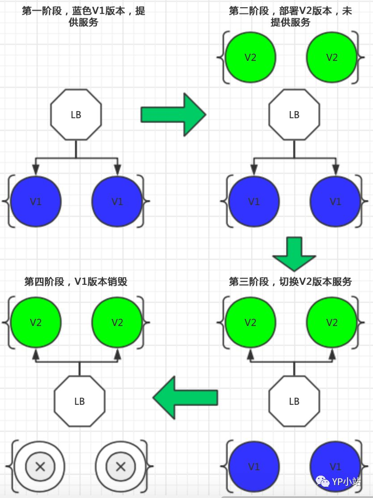

<!--toc-->
[TOC]

# 蓝绿部署

## 什么是蓝绿部署
蓝绿(blue/green)：新版本与旧版本一起存在，然后切换流量

## 蓝绿部署流程图


## K8S中如何实现蓝绿部署
- 通过k8s service label标签来实现蓝绿发布
- 通过Ingress 控制器来实现蓝绿发布
- 通过Istio来实现蓝绿发布，或者像Istio类似的服务

## k8s 蓝绿 yaml 配置
service.yaml 文件
```

apiVersion: v1
kind: Service
metadata:
  name: demo
  namespace: default
  labels:
    app: demo
spec:
  ports:
    - port: 80
      targetPort: http
      protocol: TCP
      name: http
  # 注意这里我们匹配 app 和 version 标签，当要切换流量的时候，我们更新 version 标签的值，比如：v2
  selector:
    app: demo
    version: v1
```
蓝 v1-deploy.yaml 文件
```
apiVersion: apps/v1
kind: Deployment
metadata:
  name: demo1-deployment
  namespace: default
  labels:
    app: demo
    version: v1
spec:
  replicas: 1
  revisionHistoryLimit: 3
  strategy:
    rollingUpdate:
      maxSurge: 30%
      maxUnavailable: 30%
  selector:
    matchLabels:
      app: demo
      version: v1
  template:
    metadata:
      labels:
        app: demo
        version: v1
    spec:
      containers:
      - name: demo1
        image: mritd/demo
        livenessProbe:
          httpGet:
            path: /
            port: 80
            scheme: HTTP
          initialDelaySeconds: 30
          timeoutSeconds: 5
          periodSeconds: 30
          successThreshold: 1
          failureThreshold: 5
        readinessProbe:
          httpGet:
            path: /
            port: 80
            scheme: HTTP
          initialDelaySeconds: 30
          timeoutSeconds: 5
          periodSeconds: 10
          successThreshold: 1
          failureThreshold: 5
        ports:
          - name: http
            containerPort: 80
            protocol: TCP
```
绿 v2-deploy.yaml
```

apiVersion: apps/v1
kind: Deployment
metadata:
  name: demo2-deployment
  namespace: default
  labels:
    app: demo
    version: v2
spec:
  replicas: 1
  revisionHistoryLimit: 3
  strategy:
    rollingUpdate:
      maxSurge: 30%
      maxUnavailable: 30%
  selector:
    matchLabels:
      app: demo
      version: v2
  template:
    metadata:
      labels:
        app: demo
        version: v2
    spec:
      containers:
      - name: demo2
        image: mritd/demo
        livenessProbe:
          httpGet:
            path: /
            port: 80
            scheme: HTTP
          initialDelaySeconds: 30
          timeoutSeconds: 5
          periodSeconds: 30
          successThreshold: 1
          failureThreshold: 5
        readinessProbe:
          httpGet:
            path: /
            port: 80
            scheme: HTTP
          initialDelaySeconds: 30
          timeoutSeconds: 5
          periodSeconds: 10
          successThreshold: 1
          failureThreshold: 5
        ports:
          - name: http
            containerPort: 80
            protocol: TCP
```
上面定义的资源对象中，最重要的就是Service 中 label selector的定义：

```
  selector:
    app: demo
    version: v1
```
## 部署与测试
部署v1 v2 deploy服务 和 service服务
```
$ kubectl  apply -f service.yaml -f v1-deploy.yaml -f v2-deploy.yaml
```
测试流量是否到v1版本
```
# 登陆任意一个pod，向 demo service 发起请求
$ while sleep 0.3; do curl http://demo; done

# 输出日志
Host: demo1-deployment-b5bd596d8-dw27b, Version: v1
Host: demo1-deployment-b5bd596d8-dw27b, Version: v1
```
切换入口流量从v1 到 v2
```
$ kubectl patch service demo -p '{"spec":{"selector":{"version":"v2"}}}'
```
测试流量是否到v2版本
```
# 登陆任意一个pod，向 demo service 发起请求
$ while sleep 0.3; do curl http://demo; done

# 输出日志
Host: demo2-deployment-b5bd596d8-dw27b, Version: v2
Host: demo2-deployment-b5bd596d8-dw27b, Version: v2
```

# 金丝雀

## 什么是金丝雀发布?
金丝雀发布（Canary）：也是一种发布策略，和国内常说的灰度发布是同一类策略。蓝绿部署是准备两套系统，在两套系统之间进行切换，金丝雀策略是只有一套系统，逐渐替换这套系统。

## Istio 金丝雀部署
定义 service 服务
```
apiVersion: v1
kind: Service
metadata:
  name: demo4
  namespace: test1
  labels:
    app: demo4
spec:
  ports:
    - port: 80
      targetPort: http
      protocol: TCP
      name: http
  selector:
    app: demo4
```
定义两个版本的 deploy 文件，两个版本都包含服务选择标签 app：demo4
```
apiVersion: apps/v1beta1
kind: Deployment
metadata:
  name: demo4-deployment-v1
  namespace: test1
spec:
  replicas: 1
  template:
    metadata:
      annotations:
        # 允许注入 sidecar
        sidecar.istio.io/inject: "true"
      labels:
        app: demo4
        version: v1
    spec:
      containers:
      - name: demo4-v1
        image: mritd/demo
        livenessProbe:
          httpGet:
            path: /
            port: 80
            scheme: HTTP
          initialDelaySeconds: 30
          timeoutSeconds: 5
          periodSeconds: 10
          successThreshold: 1
          failureThreshold: 5
        readinessProbe:
          httpGet:
            path: /
            port: 80
            scheme: HTTP
          initialDelaySeconds: 30
          timeoutSeconds: 5
          periodSeconds: 10
          successThreshold: 1
          failureThreshold: 5
        ports:
          - name: http
            containerPort: 80
            protocol: TCP

---

apiVersion: apps/v1beta1
kind: Deployment
metadata:
  name: demo4-deployment-v2
  namespace: test1
spec:
  replicas: 1
  template:
    metadata:
      labels:
        app: demo4
        version: v2
      annotations:
        sidecar.istio.io/inject: "true"
    spec:
      containers:
      - name: demo4-v2
        image: mritd/demo
        livenessProbe:
          httpGet:
            path: /
            port: 80
            scheme: HTTP
          initialDelaySeconds: 30
          timeoutSeconds: 5
          periodSeconds: 10
          successThreshold: 1
          failureThreshold: 5
        readinessProbe:
          httpGet:
            path: /
            port: 80
            scheme: HTTP
          initialDelaySeconds: 30
          timeoutSeconds: 5
          periodSeconds: 10
          successThreshold: 1
          failureThreshold: 5
        ports:
          - name: http
            containerPort: 80
            protocol: TCP
```
上面定义和普通k8s定义蓝绿部署是一样的

设置路由规则来控制流量分配。如将 10％ 的流量发送到金丝雀版本（v2）。后面可以渐渐的把所有流量都切到金丝雀版本（v2），只需要修改weight: 10参数，注意v1和v2版本和一定要等于100

```
apiVersion: networking.istio.io/v1alpha3
kind: VirtualService
metadata:
  name: demo4-vs
  namespace: test1
spec:
  hosts:
  - demo4.a.com
  gateways:
  - demo4-gateway
  http:
  - route:
    - destination:
        host: demo4.test1.svc.cluster.local
        subset: v1
      weight: 90
    - destination:
        host: demo4.test1.svc.cluster.local
        subset: v2
      weight: 10

---

apiVersion: networking.istio.io/v1alpha3
kind: DestinationRule
metadata:
  name: demo4
  namespace: test1
spec:
  host: demo4.test1.svc.cluster.local
  subsets:
  - name: v1
    labels:
      version: v1
  - name: v2
    labels:
      version: v2
```
当规则设置生效后，Istio 将确保只有 10% 的请求发送到金丝雀版本，无论每个版本的运行副本数量是多少。

## 高层次的金丝雀部署

只允许特定网站上50％的用户流量路由到金丝雀（v2）版本，而其他用户则不受影响

```

apiVersion: networking.istio.io/v1alpha3
kind: VirtualService
metadata:
  name: demo4-vs
  namespace: test1
spec:
  hosts:
  - demo4.a.com
  gateways:
  - demo4-gateway
  http:
  - match:
    - headers:
        cookie:
          regex: "^(.*?;)?(email=[^;]*@some-company-name.com)(;.*)?$"
    route:
    - destination:
        host: demo4.test1.svc.cluster.local
        subset: v1
        weight: 50
    - destination:
        host: demo4.test1.svc.cluster.local
        subset: v2
        weight: 50
  - route:
    - destination:
        host: demo4.test1.svc.cluster.local
        subset: v1
```

## VirtualService 与 DestinationRule 解释

- Istio Virtual Service，用于控制当前deployment和金丝雀deployment流量分配的权重
- Istio Destination Rule，包含当前deployment和金丝雀deployment的子集（subset）
- Istio Gateway（可选），如果服务需要从容器集群外被访问则需要搭建gateway

## 参考
https://archive.istio.io/v1.2/zh/docs/tasks/traffic-management/request-routing/
https://archive.istio.io/v1.2/zh/blog/2017/0.1-canary/