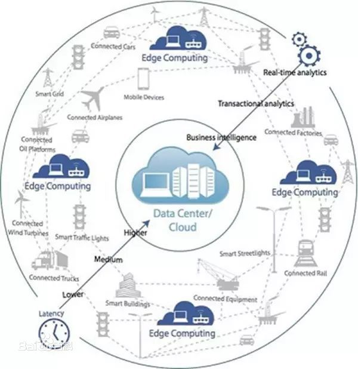

边缘计算
IOT

论是云、雾还是边缘计算，本身只是实现物联网、智能制造等所需要计算技术的一种方法或者模式。严格讲，雾计算和边缘计算本身并没有本质的区别，都是在接近于现场应用端提供的计算。就其本质而言，都是相对于云计算而言的。

https://www.toutiao.com/i6754155394181890573/
https://www.toutiao.com/i6740789249601176072/