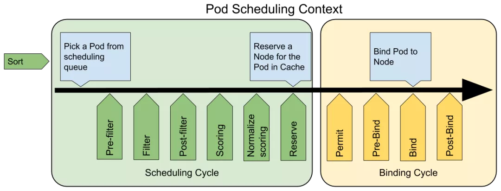

[源码](https://github.com/cnych/sample-scheduler-framework)

[TOC]
# K8S自定义调度器之调度框架

调度框架定义了一组扩展点，用户可以实现扩展点定义的接口来定义自己的调度逻辑（我们称之为扩展），并将扩展注册到扩展点上，调度框架在执行调度工作流时，遇到对应的扩展点时，将调用用户注册的扩展。调度框架在预留扩展点时，都是有特定的目的，有些扩展点上的扩展可以改变调度程序的决策方法，有些扩展点上的扩展只是发送一个通知。

我们知道每当调度一个 Pod 时，都会按照两个过程来执行：**调度过程和绑定过程**。

调度过程为 Pod 选择一个合适的节点，绑定过程则将调度过程的决策应用到集群中（也就是在被选定的节点上运行 Pod），将调度过程和绑定过程合在一起，称之为**调度上下文（scheduling context）**。需要注意的是调度过程是 同步运行的（同一时间点只为一个 Pod 进行调度），绑定过程可异步运行（同一时间点可并发为多个 Pod 执行绑定）。

调度过程和绑定过程遇到如下情况时会中途退出：
- 调度程序认为当前没有该 Pod 的可选节点
- 内部错误

这个时候，该 Pod 将被放回到 待调度队列，并等待下次重试。

## 扩展点（Extension Points）
下图展示了调度框架中的调度上下文及其中的扩展点，一个扩展可以注册多个扩展点，以便可以执行更复杂的有状态的任务。


- QueueSort 扩展用于对 Pod 的待调度队列进行排序，以决定先调度哪个 Pod， QueueSort 扩展本质上只需要实现一个方法 Less(Pod1,Pod2) 用于比较两个 Pod 谁更优先获得调度即可，同一时间点只能有一个 QueueSort 插件生效。

- Pre-filter 扩展用于对 Pod 的信息进行预处理，或者检查一些集群或 Pod 必须满足的前提条件，如果 pre-filter 返回了 error，则调度过程终止。

- Filter 扩展用于排除那些不能运行该 Pod 的节点，对于每一个节点，调度器将按顺序执行 filter 扩展；如果任何一个 filter 将节点标记为不可选，则余下的 filter 扩展将不会被执行。调度器可以同时对多个节点执行 filter 扩展。

- Post-filter 是一个通知类型的扩展点，调用该扩展的参数是 filter 阶段结束后被筛选为可选节点的节点列表，可以在扩展中使用这些信息更新内部状态，或者产生日志或 metrics 信息。

- Scoring 扩展用于为所有可选节点进行打分，调度器将针对每一个节点调用 Soring 扩展，评分结果是一个范围内的整数。在 normalize scoring 阶段，调度器将会把每个 scoring 扩展对具体某个节点的评分结果和该扩展的权重合并起来，作为最终评分结果。

- Normalizescoring 扩展在调度器对节点进行最终排序之前修改每个节点的评分结果，注册到该扩展点的扩展在被调用时，将获得同一个插件中的 scoring 扩展的评分结果作为参数，调度框架每执行一次调度，都将调用所有插件中的一个 normalize scoring 扩展一次。

- Reserve 是一个通知性质的扩展点，有状态的插件可以使用该扩展点来获得节点上为 Pod 预留的资源，该事件发生在调度器将 Pod 绑定到节点之前，目的是避免调度器在等待 Pod 与节点绑定的过程中调度新的 Pod 到节点上时，发生实际使用资源超出可用资源的情况。（因为绑定 Pod 到节点上是异步发生的）。这是调度过程的最后一个步骤，Pod 进入 reserved 状态以后，要么在绑定失败时触发 Unreserve 扩展，要么在绑定成功时，由 Post-bind 扩展结束绑定过程。

- Permit 扩展用于阻止或者延迟 Pod 与节点的绑定。Permit 扩展可以做下面三件事中的一项：
  - approve（批准）：当所有的 permit 扩展都 approve 了 Pod 与节点的绑定，调度器将继续执行绑定过程
  - deny（拒绝）：如果任何一个 permit 扩展 deny 了 Pod 与节点的绑定，Pod 将被放回到待调度队列，此时将触发 Unreserve 扩展
  - wait（等待）：如果一个 permit 扩展返回了 wait，则 Pod 将保持在 permit 阶段，直到被其他扩展 approve，如果超时事件发生，wait 状态变成 deny，Pod 将被放回到待调度队列，此时将触发 Unreserve 扩展

- Pre-bind 扩展用于在 Pod 绑定之前执行某些逻辑。例如，pre-bind 扩展可以将一个基于网络的数据卷挂载到节点上，以便 Pod 可以使用。如果任何一个 pre-bind 扩展返回错误，Pod 将被放回到待调度队列，此时将触发 Unreserve 扩展。

- Bind 扩展用于将 Pod 绑定到节点上
  - 只有所有的 pre-bind 扩展都成功执行了，bind 扩展才会执行
  - 调度框架按照 bind 扩展注册的顺序逐个调用 bind 扩展
  - 具体某个 bind 扩展可以选择处理或者不处理该 Pod
  - 如果某个 bind 扩展处理了该 Pod 与节点的绑定，余下的 bind 扩展将被忽略

- Post-bind 是一个通知性质的扩展：
  - Post-bind 扩展在 Pod 成功绑定到节点上之后被动调用
  - Post-bind 扩展是绑定过程的最后一个步骤，可以用来执行资源清理的动作

- Unreserve 是一个通知性质的扩展，如果为 Pod 预留了资源，Pod 又在被绑定过程中被拒绝绑定，则 unreserve 扩展将被调用。Unreserve 扩展应该释放已经为 Pod 预留的节点上的计算资源。在一个插件中，reserve 扩展和 unreserve 扩展应该成对出现。

如果我们要实现自己的插件，必须向调度框架注册插件并完成配置，另外还必须实现扩展点接口，对应的扩展点接口我们可以在源码 pkg/scheduler/framework/v1alpha1/interface.go 文件中找到，如下所示：

```go
// Plugin is the parent type for all the scheduling framework plugins.
type Plugin interface {
	Name() string
}

// PodInfo is a wrapper to a Pod with additional information for purposes such as tracking
// the timestamp when it's added to the queue or recording per-pod metrics.
type PodInfo struct {
	Pod *v1.Pod
	// The time pod added to the scheduling queue.
	Timestamp time.Time
	// Number of schedule attempts before successfully scheduled.
	// It's used to record the # attempts metric.
	Attempts int
	// The time when the pod is added to the queue for the first time. The pod may be added
	// back to the queue multiple times before it's successfully scheduled.
	// It shouldn't be updated once initialized. It's used to record the e2e scheduling
	// latency for a pod.
	InitialAttemptTimestamp time.Time
}

// DeepCopy returns a deep copy of the PodInfo object.
func (podInfo *PodInfo) DeepCopy() *PodInfo {
	return &PodInfo{
		Pod:                     podInfo.Pod.DeepCopy(),
		Timestamp:               podInfo.Timestamp,
		Attempts:                podInfo.Attempts,
		InitialAttemptTimestamp: podInfo.InitialAttemptTimestamp,
	}
}

// LessFunc is the function to sort pod info
type LessFunc func(podInfo1, podInfo2 *PodInfo) bool

// QueueSortPlugin is an interface that must be implemented by "QueueSort" plugins.
// These plugins are used to sort pods in the scheduling queue. Only one queue sort
// plugin may be enabled at a time.
type QueueSortPlugin interface {
	Plugin
	// Less are used to sort pods in the scheduling queue.
	Less(*PodInfo, *PodInfo) bool
}

// PreFilterExtensions is an interface that is included in plugins that allow specifying
// callbacks to make incremental updates to its supposedly pre-calculated
// state.
type PreFilterExtensions interface {
	// AddPod is called by the framework while trying to evaluate the impact
	// of adding podToAdd to the node while scheduling podToSchedule.
	AddPod(ctx context.Context, state *CycleState, podToSchedule *v1.Pod, podToAdd *v1.Pod, nodeInfo *schedulernodeinfo.NodeInfo) *Status
	// RemovePod is called by the framework while trying to evaluate the impact
	// of removing podToRemove from the node while scheduling podToSchedule.
	RemovePod(ctx context.Context, state *CycleState, podToSchedule *v1.Pod, podToRemove *v1.Pod, nodeInfo *schedulernodeinfo.NodeInfo) *Status
}

// PreFilterPlugin is an interface that must be implemented by "prefilter" plugins.
// These plugins are called at the beginning of the scheduling cycle.
type PreFilterPlugin interface {
	Plugin
	// PreFilter is called at the beginning of the scheduling cycle. All PreFilter
	// plugins must return success or the pod will be rejected.
	PreFilter(ctx context.Context, state *CycleState, p *v1.Pod) *Status
	// PreFilterExtensions returns a PreFilterExtensions interface if the plugin implements one,
	// or nil if it does not. A Pre-filter plugin can provide extensions to incrementally
	// modify its pre-processed info. The framework guarantees that the extensions
	// AddPod/RemovePod will only be called after PreFilter, possibly on a cloned
	// CycleState, and may call those functions more than once before calling
	// Filter again on a specific node.
	PreFilterExtensions() PreFilterExtensions
}

// FilterPlugin is an interface for Filter plugins. These plugins are called at the
// filter extension point for filtering out hosts that cannot run a pod.
// This concept used to be called 'predicate' in the original scheduler.
// These plugins should return "Success", "Unschedulable" or "Error" in Status.code.
// However, the scheduler accepts other valid codes as well.
// Anything other than "Success" will lead to exclusion of the given host from
// running the pod.
type FilterPlugin interface {
	Plugin
	// Filter is called by the scheduling framework.
	// All FilterPlugins should return "Success" to declare that
	// the given node fits the pod. If Filter doesn't return "Success",
	// please refer scheduler/algorithm/predicates/error.go
	// to set error message.
	// For the node being evaluated, Filter plugins should look at the passed
	// nodeInfo reference for this particular node's information (e.g., pods
	// considered to be running on the node) instead of looking it up in the
	// NodeInfoSnapshot because we don't guarantee that they will be the same.
	// For example, during preemption, we may pass a copy of the original
	// nodeInfo object that has some pods removed from it to evaluate the
	// possibility of preempting them to schedule the target pod.
	Filter(ctx context.Context, state *CycleState, pod *v1.Pod, nodeInfo *schedulernodeinfo.NodeInfo) *Status
}

// PostFilterPlugin is an interface for Post-filter plugin. Post-filter is an
// informational extension point. Plugins will be called with a list of nodes
// that passed the filtering phase. A plugin may use this data to update internal
// state or to generate logs/metrics.
type PostFilterPlugin interface {
	Plugin
	// PostFilter is called by the scheduling framework after a list of nodes
	// passed the filtering phase. All postfilter plugins must return success or
	// the pod will be rejected. The filteredNodesStatuses is the set of filtered nodes
	// and their filter status.
	PostFilter(ctx context.Context, state *CycleState, pod *v1.Pod, nodes []*v1.Node, filteredNodesStatuses NodeToStatusMap) *Status
}

// ScoreExtensions is an interface for Score extended functionality.
type ScoreExtensions interface {
	// NormalizeScore is called for all node scores produced by the same plugin's "Score"
	// method. A successful run of NormalizeScore will update the scores list and return
	// a success status.
	NormalizeScore(ctx context.Context, state *CycleState, p *v1.Pod, scores NodeScoreList) *Status
}

// ScorePlugin is an interface that must be implemented by "score" plugins to rank
// nodes that passed the filtering phase.
type ScorePlugin interface {
	Plugin
	// Score is called on each filtered node. It must return success and an integer
	// indicating the rank of the node. All scoring plugins must return success or
	// the pod will be rejected.
	Score(ctx context.Context, state *CycleState, p *v1.Pod, nodeName string) (int64, *Status)

	// ScoreExtensions returns a ScoreExtensions interface if it implements one, or nil if does not.
	ScoreExtensions() ScoreExtensions
}

// ReservePlugin is an interface for Reserve plugins. These plugins are called
// at the reservation point. These are meant to update the state of the plugin.
// This concept used to be called 'assume' in the original scheduler.
// These plugins should return only Success or Error in Status.code. However,
// the scheduler accepts other valid codes as well. Anything other than Success
// will lead to rejection of the pod.
type ReservePlugin interface {
	Plugin
	// Reserve is called by the scheduling framework when the scheduler cache is
	// updated.
	Reserve(ctx context.Context, state *CycleState, p *v1.Pod, nodeName string) *Status
}

// PreBindPlugin is an interface that must be implemented by "prebind" plugins.
// These plugins are called before a pod being scheduled.
type PreBindPlugin interface {
	Plugin
	// PreBind is called before binding a pod. All prebind plugins must return
	// success or the pod will be rejected and won't be sent for binding.
	PreBind(ctx context.Context, state *CycleState, p *v1.Pod, nodeName string) *Status
}

// PostBindPlugin is an interface that must be implemented by "postbind" plugins.
// These plugins are called after a pod is successfully bound to a node.
type PostBindPlugin interface {
	Plugin
	// PostBind is called after a pod is successfully bound. These plugins are
	// informational. A common application of this extension point is for cleaning
	// up. If a plugin needs to clean-up its state after a pod is scheduled and
	// bound, PostBind is the extension point that it should register.
	PostBind(ctx context.Context, state *CycleState, p *v1.Pod, nodeName string)
}

// UnreservePlugin is an interface for Unreserve plugins. This is an informational
// extension point. If a pod was reserved and then rejected in a later phase, then
// un-reserve plugins will be notified. Un-reserve plugins should clean up state
// associated with the reserved Pod.
type UnreservePlugin interface {
	Plugin
	// Unreserve is called by the scheduling framework when a reserved pod was
	// rejected in a later phase.
	Unreserve(ctx context.Context, state *CycleState, p *v1.Pod, nodeName string)
}

// PermitPlugin is an interface that must be implemented by "permit" plugins.
// These plugins are called before a pod is bound to a node.
type PermitPlugin interface {
	Plugin
	// Permit is called before binding a pod (and before prebind plugins). Permit
	// plugins are used to prevent or delay the binding of a Pod. A permit plugin
	// must return success or wait with timeout duration, or the pod will be rejected.
	// The pod will also be rejected if the wait timeout or the pod is rejected while
	// waiting. Note that if the plugin returns "wait", the framework will wait only
	// after running the remaining plugins given that no other plugin rejects the pod.
	Permit(ctx context.Context, state *CycleState, p *v1.Pod, nodeName string) (*Status, time.Duration)
}

// BindPlugin is an interface that must be implemented by "bind" plugins. Bind
// plugins are used to bind a pod to a Node.
type BindPlugin interface {
	Plugin
	// Bind plugins will not be called until all pre-bind plugins have completed. Each
	// bind plugin is called in the configured order. A bind plugin may choose whether
	// or not to handle the given Pod. If a bind plugin chooses to handle a Pod, the
	// remaining bind plugins are skipped. When a bind plugin does not handle a pod,
	// it must return Skip in its Status code. If a bind plugin returns an Error, the
	// pod is rejected and will not be bound.
	Bind(ctx context.Context, state *CycleState, p *v1.Pod, nodeName string) *Status
}

// Framework manages the set of plugins in use by the scheduling framework.
// Configured plugins are called at specified points in a scheduling context.
type Framework interface {
	FrameworkHandle
	// QueueSortFunc returns the function to sort pods in scheduling queue
	QueueSortFunc() LessFunc

	// RunPreFilterPlugins runs the set of configured prefilter plugins. It returns
	// *Status and its code is set to non-success if any of the plugins returns
	// anything but Success. If a non-success status is returned, then the scheduling
	// cycle is aborted.
	RunPreFilterPlugins(ctx context.Context, state *CycleState, pod *v1.Pod) *Status

	// RunFilterPlugins runs the set of configured filter plugins for pod on
	// the given node. It returns directly if any of the filter plugins
	// return any status other than "Success". Note that for the node being
	// evaluated, the passed nodeInfo reference could be different from the
	// one in NodeInfoSnapshot map (e.g., pods considered to be running on
	// the node could be different). For example, during preemption, we may
	// pass a copy of the original nodeInfo object that has some pods
	// removed from it to evaluate the possibility of preempting them to
	// schedule the target pod.
	RunFilterPlugins(ctx context.Context, state *CycleState, pod *v1.Pod, nodeInfo *schedulernodeinfo.NodeInfo) *Status

	// RunPreFilterExtensionAddPod calls the AddPod interface for the set of configured
	// PreFilter plugins. It returns directly if any of the plugins return any
	// status other than Success.
	RunPreFilterExtensionAddPod(ctx context.Context, state *CycleState, podToSchedule *v1.Pod, podToAdd *v1.Pod, nodeInfo *schedulernodeinfo.NodeInfo) *Status

	// RunPreFilterExtensionRemovePod calls the RemovePod interface for the set of configured
	// PreFilter plugins. It returns directly if any of the plugins return any
	// status other than Success.
	RunPreFilterExtensionRemovePod(ctx context.Context, state *CycleState, podToSchedule *v1.Pod, podToAdd *v1.Pod, nodeInfo *schedulernodeinfo.NodeInfo) *Status

	// RunPostFilterPlugins runs the set of configured post-filter plugins. If any
	// of these plugins returns any status other than "Success", the given node is
	// rejected. The filteredNodeStatuses is the set of filtered nodes and their statuses.
	RunPostFilterPlugins(ctx context.Context, state *CycleState, pod *v1.Pod, nodes []*v1.Node, filteredNodesStatuses NodeToStatusMap) *Status

	// RunScorePlugins runs the set of configured scoring plugins. It returns a map that
	// stores for each scoring plugin name the corresponding NodeScoreList(s).
	// It also returns *Status, which is set to non-success if any of the plugins returns
	// a non-success status.
	RunScorePlugins(ctx context.Context, state *CycleState, pod *v1.Pod, nodes []*v1.Node) (PluginToNodeScores, *Status)

	// RunPreBindPlugins runs the set of configured prebind plugins. It returns
	// *Status and its code is set to non-success if any of the plugins returns
	// anything but Success. If the Status code is "Unschedulable", it is
	// considered as a scheduling check failure, otherwise, it is considered as an
	// internal error. In either case the pod is not going to be bound.
	RunPreBindPlugins(ctx context.Context, state *CycleState, pod *v1.Pod, nodeName string) *Status

	// RunPostBindPlugins runs the set of configured postbind plugins.
	RunPostBindPlugins(ctx context.Context, state *CycleState, pod *v1.Pod, nodeName string)

	// RunReservePlugins runs the set of configured reserve plugins. If any of these
	// plugins returns an error, it does not continue running the remaining ones and
	// returns the error. In such case, pod will not be scheduled.
	RunReservePlugins(ctx context.Context, state *CycleState, pod *v1.Pod, nodeName string) *Status

	// RunUnreservePlugins runs the set of configured unreserve plugins.
	RunUnreservePlugins(ctx context.Context, state *CycleState, pod *v1.Pod, nodeName string)

	// RunPermitPlugins runs the set of configured permit plugins. If any of these
	// plugins returns a status other than "Success" or "Wait", it does not continue
	// running the remaining plugins and returns an error. Otherwise, if any of the
	// plugins returns "Wait", then this function will block for the timeout period
	// returned by the plugin, if the time expires, then it will return an error.
	// Note that if multiple plugins asked to wait, then we wait for the minimum
	// timeout duration.
	RunPermitPlugins(ctx context.Context, state *CycleState, pod *v1.Pod, nodeName string) *Status

	// RunBindPlugins runs the set of configured bind plugins. A bind plugin may choose
	// whether or not to handle the given Pod. If a bind plugin chooses to skip the
	// binding, it should return code=4("skip") status. Otherwise, it should return "Error"
	// or "Success". If none of the plugins handled binding, RunBindPlugins returns
	// code=4("skip") status.
	RunBindPlugins(ctx context.Context, state *CycleState, pod *v1.Pod, nodeName string) *Status

	// HasFilterPlugins returns true if at least one filter plugin is defined.
	HasFilterPlugins() bool

	// HasScorePlugins returns true if at least one score plugin is defined.
	HasScorePlugins() bool

	// ListPlugins returns a map of extension point name to list of configured Plugins.
	ListPlugins() map[string][]config.Plugin
}

// FrameworkHandle provides data and some tools that plugins can use. It is
// passed to the plugin factories at the time of plugin initialization. Plugins
// must store and use this handle to call framework functions.
type FrameworkHandle interface {
	// SnapshotSharedLister returns listers from the latest NodeInfo Snapshot. The snapshot
	// is taken at the beginning of a scheduling cycle and remains unchanged until
	// a pod finishes "Reserve" point. There is no guarantee that the information
	// remains unchanged in the binding phase of scheduling, so plugins in the binding
	// cycle(permit/pre-bind/bind/post-bind/un-reserve plugin) should not use it,
	// otherwise a concurrent read/write error might occur, they should use scheduler
	// cache instead.
	SnapshotSharedLister() schedulerlisters.SharedLister

	// IterateOverWaitingPods acquires a read lock and iterates over the WaitingPods map.
	IterateOverWaitingPods(callback func(WaitingPod))

	// GetWaitingPod returns a waiting pod given its UID.
	GetWaitingPod(uid types.UID) WaitingPod

	// RejectWaitingPod rejects a waiting pod given its UID.
	RejectWaitingPod(uid types.UID)

	// ClientSet returns a kubernetes clientSet.
	ClientSet() clientset.Interface

	SharedInformerFactory() informers.SharedInformerFactory
}
```

对于调度框架插件的启用或者禁用，我们同样可以使用 KubeSchedulerConfiguration(https://godoc.org/k8s.io/kubernetes/pkg/scheduler/apis/config#KubeSchedulerConfiguration) 资源对象来进行配置。下面的例子中的配置启用了一个实现了 reserve 和 preBind 扩展点的插件，并且禁用了另外一个插件，同时为插件 foo 提供了一些配置信息：
```yaml
apiVersion: kubescheduler.config.k8s.io/v1alpha1
kind: KubeSchedulerConfiguration
...
plugins:
  reserve:
    enabled:
    - name: foo
    - name: bar
    disabled:
    - name: baz
  preBind:
    enabled:
    - name: foo
    disabled:
    - name: baz
pluginConfig:
- name: foo
  args: >
    foo插件可以解析的任意内容
```

扩展的调用顺序如下：
- 如果某个扩展点没有配置对应的扩展，调度框架将使用默认插件中的扩展
- 如果为某个扩展点配置且激活了扩展，则调度框架将先调用默认插件的扩展，再调用配置中的扩展
- 默认插件的扩展始终被最先调用，然后按照 KubeSchedulerConfiguration 中扩展的激活 enabled 顺序逐个调用扩展点的扩展
- 可以先禁用默认插件的扩展，然后在 enabled 列表中的某个位置激活默认插件的扩展，这种做法可以改变默认插件的扩展被调用时的顺序

假设默认插件 foo 实现了 reserve 扩展点，此时我们要添加一个插件 bar，想要在 foo 之前被调用，则应该先禁用 foo 再按照 bar foo 的顺序激活。示例配置如下所示：

```yaml
apiVersion: kubescheduler.config.k8s.io/v1alpha1
kind: KubeSchedulerConfiguration
...
plugins:
  reserve:
    enabled:
    - name: bar
    - name: foo
    disabled:
    - name: foo
```
在源码目录 pkg/scheduler/framework/plugins/examples 中有几个示范插件，我们可以参照其实现方式。

## 示例
其实要实现一个调度框架的插件，并不难，我们只要实现对应的扩展点，然后将插件注册到调度器中即可，下面是默认调度器在初始化的时候注册的插件：
```go
func NewRegistry() Registry {
    return Registry{
        // FactoryMap:
        // New plugins are registered here.
        // example:
        // {
        // stateful_plugin.Name: stateful.NewStatefulMultipointExample,
        // fooplugin.Name: fooplugin.New,
        // }
    }
}
```
但是可以看到默认并没有注册一些插件，所以要想让调度器能够识别我们的插件代码，就需要自己来实现一个调度器了，当然这个调度器我们完全没必要完全自己实现，直接调用默认的调度器，然后在上面的 NewRegistry() 函数中将我们的插件注册进去即可。在 kube-scheduler 的源码文件 kubernetes/cmd/kube-scheduler/app/server.go 中有一个 NewSchedulerCommand 入口函数，其中的参数是一个类型为 Option 的列表，而这个 Option 恰好就是一个插件配置的定义：
```go
// Option configures a framework.Registry.
type Option func(framework.Registry) error
// NewSchedulerCommand creates a *cobra.Command object with default parameters and registryOptions
func NewSchedulerCommand(registryOptions ...Option) *cobra.Command {
......
}
```
所以我们完全就可以直接调用这个函数来作为我们的函数入口，并且传入我们自己实现的插件作为参数即可，而且该文件下面还有一个名为 WithPlugin 的函数可以来创建一个 Option 实例：
```go
// WithPlugin creates an Option based on plugin name and factory.
func WithPlugin(name string, factory framework.PluginFactory) Option {
    return func(registry framework.Registry) error {
        return registry.Register(name, factory)
    }
}
```
所以最终我们的入口函数如下所示：
```go
func main() {
    rand.Seed(time.Now().UTC().UnixNano())
    command := app.NewSchedulerCommand(
        app.WithPlugin(sample.Name, sample.New),
    )
    logs.InitLogs()
    defer logs.FlushLogs()
    if err := command.Execute(); err != nil {
        _, _ = fmt.Fprintf(os.Stderr, "%v\n", err)
        os.Exit(1)
    }
}
```
其中 app.WithPlugin(sample.Name,sample.New) 就是我们接下来要实现的插件，从 WithPlugin 函数的参数也可以看出我们这里的 sample.New 必须是一个 framework.PluginFactory 类型的值，而 PluginFactory 的定义就是一个函数：
```go
type PluginFactory = func(configuration *runtime.Unknown, f FrameworkHandle) (Plugin, error)
```
所以 sample.New 实际上就是上面的这个函数，在这个函数中我们可以获取到插件中的一些数据然后进行逻辑处理即可，插件实现如下所示，我们这里只是简单获取下数据打印日志，如果你有实际需求的可以根据获取的数据就行处理即可，我们这里只是实现了 PreFilter、 Filter、 PreBind 三个扩展点，其他的可以用同样的方式来扩展即可：
```go
// 插件名称
const Name = "sample-plugin"
type Sample struct {
    handle framework.FrameworkHandle
}

func (s *Sample) Name() string {
    return Name
}

func (s *Sample) PreFilter(pc *framework.PluginContext, pod *v1.Pod) *framework.Status {
    klog.V(3).Infof("prefilter pod: %v", pod.Name)
    return framework.NewStatus(framework.Success, "")
}

func (s *Sample) Filter(pc *framework.PluginContext, pod *v1.Pod, nodeName string) *framework.Status {
    klog.V(3).Infof("filter pod: %v, node: %v", pod.Name, nodeName)
    return framework.NewStatus(framework.Success, "")
}

func (s *Sample) PreBind(pc *framework.PluginContext, pod *v1.Pod, nodeName string) *framework.Status {
    if nodeInfo, ok := s.handle.NodeInfoSnapshot().NodeInfoMap[nodeName]; !ok {
        return framework.NewStatus(framework.Error, fmt.Sprintf("prebind get node info error: %+v", nodeName))
    } else {
        klog.V(3).Infof("prebind node info: %+v", nodeInfo.Node())
        return framework.NewStatus(framework.Success, "")
    }
}

//type PluginFactory = func(configuration *runtime.Unknown, f FrameworkHandle) (Plugin, error)
func New(configuration *runtime.Unknown, f framework.FrameworkHandle) (framework.Plugin, error) {
    var args interface{}
    if err := framework.DecodeInto(configuration, args); err != nil {
        return nil, err
    }
    klog.V(3).Infof("--------> args: %+v", args)
    return &Sample{
        handle: f,
    }, nil

}
```
> 完整代码可以前往仓库 https://github.com/cnych/sample-scheduler-framework 获取。

实现完成后，编译打包成镜像即可，然后我们就可以当成普通的应用用一个 Deployment 控制器来部署即可，由于我们需要去获取集群中的一些资源对象，所以当然需要申请 RBAC 权限，然后同样通过 --config 参数来配置我们的调度器，同样还是使用一个 KubeSchedulerConfiguration 资源对象配置，可以通过 plugins 来启用或者禁用我们实现的插件，也可以通过 pluginConfig 来传递一些参数值给插件：
```yaml
kind: ClusterRole
apiVersion: rbac.authorization.k8s.io/v1
metadata:
  name: sample-scheduler-clusterrole
rules:
  - apiGroups:
      - ""
    resources:
      - endpoints
      - events
    verbs:
      - create
      - get
      - update
  - apiGroups:
      - ""
    resources:
      - nodes
    verbs:
      - get
      - list
      - watch
  - apiGroups:
      - ""
    resources:
      - pods
    verbs:
      - delete
      - get
      - list
      - watch
      - update
  - apiGroups:
      - ""
    resources:
      - bindings
      - pods/binding
    verbs:
      - create
  - apiGroups:
      - ""
    resources:
      - pods/status
    verbs:
      - patch
      - update
  - apiGroups:
      - ""
    resources:
      - replicationcontrollers
      - services
    verbs:
      - get
      - list
      - watch
  - apiGroups:
      - apps
      - extensions
    resources:
      - replicasets
    verbs:
      - get
      - list
      - watch
  - apiGroups:
      - apps
    resources:
      - statefulsets
    verbs:
      - get
      - list
      - watch
  - apiGroups:
      - policy
    resources:
      - poddisruptionbudgets
    verbs:
      - get
      - list
      - watch
  - apiGroups:
      - ""
    resources:
      - persistentvolumeclaims
      - persistentvolumes
    verbs:
      - get
      - list
      - watch
  - apiGroups:
      - ""
    resources:
      - configmaps
    verbs:
      - get
      - list
      - watch
  - apiGroups:
      - "storage.k8s.io"
    resources:
      - storageclasses
      - csinodes
    verbs:
      - get
      - list
      - watch
  - apiGroups:
      - "coordination.k8s.io"
    resources:
      - leases
    verbs:
      - create
      - get
      - list
      - update
  - apiGroups:
      - "events.k8s.io"
    resources:
      - events
    verbs:
      - create
      - patch
      - update
---
apiVersion: v1
kind: ServiceAccount
metadata:
  name: sample-scheduler-sa
  namespace: kube-system
---
kind: ClusterRoleBinding
apiVersion: rbac.authorization.k8s.io/v1
metadata:
  name: sample-scheduler-clusterrolebinding
  namespace: kube-system
roleRef:
  apiGroup: rbac.authorization.k8s.io
  kind: ClusterRole
  name: sample-scheduler-clusterrole
subjects:
  - kind: ServiceAccount
    name: sample-scheduler-sa
    namespace: kube-system

---
apiVersion: v1
kind: ConfigMap
metadata:
  name: scheduler-config
  namespace: kube-system
data:
  scheduler-config.yaml: |
    apiVersion: kubescheduler.config.k8s.io/v1alpha1
    kind: KubeSchedulerConfiguration
    schedulerName: sample-scheduler
    leaderElection:
      leaderElect: true
      lockObjectName: sample-scheduler
      lockObjectNamespace: kube-system
    plugins:
      preFilter:
        enabled:
        - name: "sample-plugin"
      filter:
        enabled:
        - name: "sample-plugin"
      preBind:
        enabled:
        - name: "sample-plugin"
    pluginConfig:
    - name: "sample-plugin"
      args:
        favorite_color: "#326CE5"
        favorite_number: 7
        thanks_to: "thockin"
---
apiVersion: apps/v1
kind: Deployment
metadata:
  name: sample-scheduler
  namespace: kube-system
  labels:
    component: sample-scheduler
spec:
  replicas: 1
  selector:
    matchLabels:
      component: sample-scheduler
  template:
    metadata:
      labels:
        component: sample-scheduler
    spec:
      serviceAccount: sample-scheduler-sa
      priorityClassName: system-cluster-critical
      volumes:
        - name: scheduler-config
          configMap:
            name: scheduler-config
      containers:
        - name: scheduler-ctrl
          image: cnych/sample-scheduler:v0.1.6
          imagePullPolicy: IfNotPresent
          args:
            - sample-scheduler-framework
            - --config=/etc/kubernetes/scheduler-config.yaml
            - --v=3
          resources:
            requests:
              cpu: "50m"
          volumeMounts:
            - name: scheduler-config
              mountPath: /etc/kubernetes
```

直接部署上面的资源对象即可，这样我们就部署了一个名为 sample-scheduler 的调度器了，接下来我们可以部署一个应用来使用这个调度器进行调度：
```yaml
apiVersion: apps/v1
kind: Deployment
metadata:
  name: test-scheduler
spec:
  replicas: 1
  selector:
    matchLabels:
      app: test-scheduler
  template:
    metadata:
      labels:
        app: test-scheduler
    spec:
      schedulerName: sample-scheduler
      containers:
      - image: nginx
        imagePullPolicy: IfNotPresent
        name: nginx
        ports:
        - containerPort: 80
```
这里需要注意的是我们现在手动指定了一个 schedulerName 的字段，将其设置成上面我们自定义的调度器名称 sample-scheduler。

我们直接创建这个资源对象，创建完成后查看我们自定义调度器的日志信息：
```
kubectl get pods -n kube-system -l component=sample-scheduler
```
可以看到当我们创建完 Pod 后，在我们自定义的调度器中就出现了对应的日志，并且在我们定义的扩展点上面都出现了对应的日志，证明我们的示例成功了，也可以通过查看 Pod 的 schedulerName 来验证：
```
kubectl get pods

kubectl get pod test-scheduler-xxx-xxx -o yaml
```
在最新的 Kubernetes v1.17 版本中， SchedulerFramework 内置的预选和优选函数已经全部插件化，所以要扩展调度器我们应该掌握并理解调度框架这种方式。
