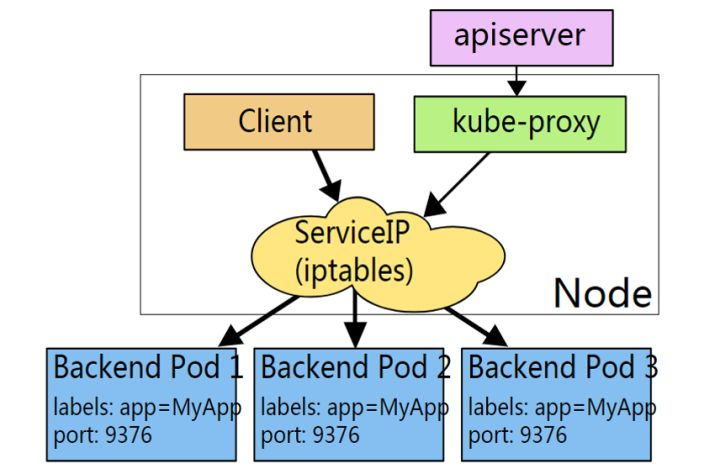
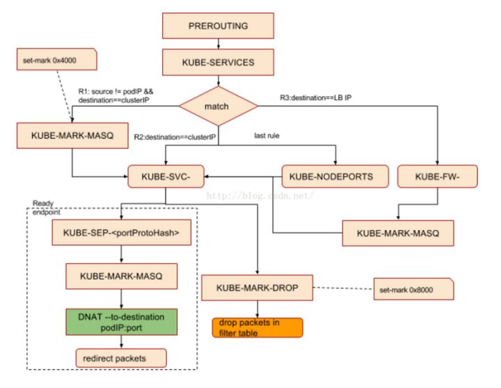

<!-- toc -->
[TOC]
# k8s中的endpoint

## Service（无 label selector）
Service 通常用于提供对 Kubernetes Pod 的访问，但是您也可以将其用于任何其他形式的后端。例如：

- 您想要在生产环境中使用一个 Kubernetes 外部的数据库集群，在测试环境中使用 Kubernetes 内部的 数据库
- 您想要将 Service 指向另一个名称空间中的 Service，或者另一个 Kubernetes 集群中的 Service
- 您正在将您的程序迁移到 Kubernetes，但是根据您的迁移路径，您只将一部分后端程序运行在 Kubernetes 中
在上述这些情况下，您可以定义一个没有 Pod Selector 的 Service。例如：
```
apiVersion: v1
kind: Service
metadata:
  name: my-service
spec:
  ports:
    - protocol: TCP
      port: 80
      targetPort: 9376
```
因为该 Service 没有 selector，相应的 Endpoint 对象就无法自动创建。您可以手动创建一个 Endpoint 对象，以便将该 Service 映射到后端服务真实的 IP 地址和端口：
```
apiVersion: v1
kind: Endpoints
metadata:
  name: my-service
subsets:
  - addresses:
      - ip: 192.0.2.42
    ports:
      - port: 9376
```
> Endpoint 中的 IP 地址不可以是 loopback（127.0.0.0/8 IPv4 或 ::1/128 IPv6），或 link-local（169.254.0.0/16 IPv4、224.0.0.0/24 IPv4 或 fe80::/64 IPv6）
> Endpoint 中的 IP 地址不可以是集群中其他 Service 的 ClusterIP

对于 Service 的访问者来说，Service 是否有 label selector 都是一样的。在上述例子中，Service 将请求路由到 Endpoint 192.0.2.42:9376 (TCP)。


## service selector
service通过selector和pod建立关联。

k8s会根据service关联到pod的podIP信息组合成一个endpoint。

若service定义中没有selector字段，service被创建时，endpoint controller不会自动创建endpoint。

## service负载分发策略
service 负载分发策略有两种：
- RoundRobin：轮询模式，即轮询将请求转发到后端的各个pod上（默认模式）；
- SessionAffinity：基于客户端IP地址进行会话保持的模式，第一次客户端访问后端某个pod，之后的请求都转发到这个pod上。

## k8s服务发现方式
DNS：可以通过cluster add-on的方式轻松的创建KubeDNS来对集群内的Service进行服务发现————这也是k8s官方强烈推荐的方式。为了让Pod中的容器可以使用kube-dns来解析域名，k8s会修改容器的/etc/resolv.conf配置。

## k8s服务发现原理
### endpoint
endpoint是k8s集群中的一个资源对象，存储在etcd中，用来记录一个service对应的所有pod的访问地址。

service配置selector，endpoint controller才会自动创建对应的endpoint对象；否则，不会生成endpoint对象.

例如，k8s集群中创建一个名为k8s-classic-1113-d3的service，就会生成一个同名的endpoint对象，如下图所示。其中ENDPOINTS就是service关联的pod的ip地址和端口。

```
kube get endpoints
```

### endpoint controller
endpoint controller是k8s集群控制器的其中一个组件，其功能如下：

负责生成和维护所有endpoint对象的控制器

负责监听service和对应pod的变化

监听到service被删除，则删除和该service同名的endpoint对象

监听到新的service被创建，则根据新建service信息获取相关pod列表，然后创建对应endpoint对象

监听到service被更新，则根据更新后的service信息获取相关pod列表，然后更新对应endpoint对象

监听到pod事件，则更新对应的service的endpoint对象，将podIp记录到endpoint中

## 负载均衡
### kube-proxy
kube-proxy负责service的实现，即实现了k8s内部从pod到service和外部从node port到service的访问。

kube-proxy采用iptables的方式配置负载均衡，基于iptables的kube-proxy的主要职责包括两大块：一块是侦听service更新事件，并更新service相关的iptables规则，一块是侦听endpoint更新事件，更新endpoint相关的iptables规则（如 KUBE-SVC-链中的规则），然后将包请求转入endpoint对应的Pod。如果某个service尚没有Pod创建，那么针对此service的请求将会被drop掉。

kube-proxy的架构如下：


### kube-proxy iptables
kube-proxy监听service和endpoint的变化(service创建删除和修改, pod的扩张与缩小)，将需要新增的规则添加到iptables中。

kube-proxy只是作为controller，而不是server，真正服务的是内核的netfilter，体现在用户态则是iptables。

kube-proxy的iptables方式也支持RoundRobin（默认模式）和SessionAffinity负载分发策略。

kubernetes只操作了filter和nat表。

Filter：在该表中，一个基本原则是只过滤数据包而不修改他们。filter table的优势是小而快，可以hook到input，output和forward。这意味着针对任何给定的数据包，只有可能有一个地方可以过滤它。

NAT：此表的主要作用是在PREROUTING和POSTROUNTING的钩子中，修改目标地址和原地址。与filter表稍有不同的是，该表中只有新连接的第一个包会被修改，修改的结果会自动apply到同一连接的后续包中。

kube-proxy对iptables的链进行了扩充，自定义了KUBE-SERVICES，KUBE-NODEPORTS，KUBE-POSTROUTING，KUBE-MARK-MASQ和KUBE-MARK-DROP五个链，并主要通过为KUBE-SERVICES chain增加rule来配制traffic routing 规则。我们可以看下自定义的这几个链的作用：

- KUBE-MARK-DROP - [0:0] 对于未能匹配到跳转规则的traffic set mark 0x8000，有此标记的数据包会在filter表drop掉

- KUBE-MARK-MASQ - [0:0] 对于符合条件的包 set mark 0x4000, 有此标记的数据包会在KUBE-POSTROUTING chain中统一做MASQUERADE

- KUBE-NODEPORTS - [0:0] 针对通过nodeport访问的package做的操作

- KUBE-POSTROUTING - [0:0]KUBE-SERVICES - [0:0] 操作跳转规则的主要chain

同时，kube-proxy也为默认的prerouting、output和postrouting chain增加规则，使得数据包可以跳转至k8s自定义的chain，规则如下：
```
-A PREROUTING -m comment --comment "kubernetes service portals" -j KUBE-SERVICES

 -A OUTPUT -m comment --comment "kubernetes service portals" -j KUBE-SERVICES

 -A POSTROUTING -m comment --comment "kubernetes postrouting rules" -j KUBE-POSTROUTING 
```

如果service类型为nodePort，（从LB转发至node的数据包均属此类）那么将KUBE-NODEPORTS链中每个目的地址是NODE节点端口的数据包导入这个“KUBE-SVC-”链：

```
-A KUBE-SERVICES -m comment --comment "kubernetes service nodeports; NOTE: this must be the last rule in this chain" -m addrtype --dst-type LOCAL -j KUBE-NODEPORTS

 -A KUBE-NODEPORTS -p tcp -m comment --comment "default/es1:http" -m tcp --dport 32135 -j KUBE-MARK-MASQ

 -A KUBE-NODEPORTS -p tcp -m comment --comment "default/es1:http" -m tcp --dport 32135 -j KUBE-SVC-LAS23QA33HXV7KBL 
```
Iptables chain支持嵌套并因为依据不同的匹配条件可支持多种分支，比较难用标准的流程图来体现调用关系，建单抽象为下图：


举个例子，在k8s集群中创建了一个名为my-service的服务，其中：

service vip：10.11.97.177

对应的后端两副本pod ip：10.244.1.10、10.244.2.10

容器端口为：80

服务端口为：80

则kube-proxy为该service生成的iptables规则主要有以下几条：

```
-A KUBE-SERVICES -d 10.11.97.177/32 -p tcp -m comment --comment "default/my-service: cluster IP" -m tcp --dport 80 -j KUBE-SVC-BEPXDJBUHFCSYIC3

 -A KUBE-SVC-BEPXDJBUHFCSYIC3 -m comment --comment “default/my-service:” -m statistic --mode random --probability 0.50000000000 -j KUBE-SEP-U4UWLP4OR3LOJBXU  //50%的概率轮询后端pod
 -A KUBE-SVC-BEPXDJBUHFCSYIC3 -m comment --comment "default/my-service:" -j KUBE-SEP-QHRWSLKOO5YUPI7O

 -A KUBE-SEP-U4UWLP4OR3LOJBXU -s 10.244.1.10/32 -m comment --comment "default/my-service:" -j KUBE-MARK-MASQ
 -A KUBE-SEP-U4UWLP4OR3LOJBXU -p tcp -m comment --comment "default/my-service:" -m tcp -j DNAT --to-destination 10.244.1.10:80
 -A KUBE-SEP-QHRWSLKOO5YUPI7O -s 10.244.2.10/32 -m comment --comment "default/my-service:" -j KUBE-MARK-MASQ
 -A KUBE-SEP-QHRWSLKOO5YUPI7O -p tcp -m comment --comment "default/my-service:" -m tcp -j DNAT --to-destination 10.244.2.10:80 
```

kube-proxy通过循环的方式创建后端endpoint的转发，概率是通过probability后的1.0/float64(n-i)计算出来的，譬如有两个的场景，那么将会是一个0.5和1也就是第一个是50%概率第二个是100%概率，如果是三个的话类似，33%、50%、100%。