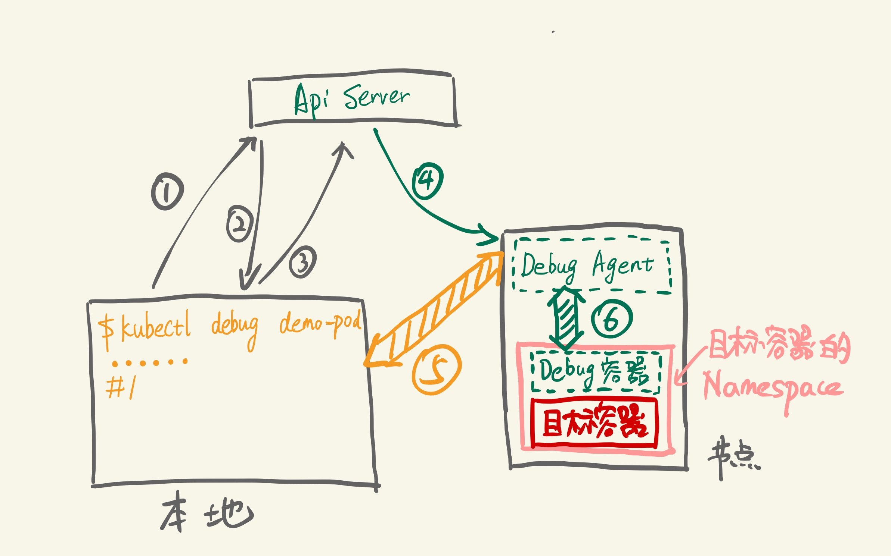

# 超好用的K8s诊断工具：kubectl-debug
https://github.com/aylei/kubectl-debug/releases

[简化 Pod 故障诊断: kubectl-debug 介绍](https://aleiwu.com/post/kubectl-debug-intro/)

[kubectl plugin manager](https://github.com/kubernetes-sigs/krew)

[kubectl superdebug](https://github.com/JonMerlevede/kubectl-superdebug)

## 其它工具
- nsenter 
`yum -y install util-linux`
nsenter 命令可以很方便的进入指定容器的网络命名空间，使用宿主机的命令调试容器网络。

除此以外，nsenter 还可以进入 mnt、uts、ipc、pid、user 等命名空间，以及指定根目录和工作目录。

```
nsenter [options] [program [arguments]]

options:
-t, --target pid：指定被进入命名空间的目标进程的pid
-m, --mount[=file]：进入mount命令空间。如果指定了file，则进入file的命令空间
-u, --uts[=file]：进入uts命令空间。如果指定了file，则进入file的命令空间
-i, --ipc[=file]：进入ipc命令空间。如果指定了file，则进入file的命令空间
-n, --net[=file]：进入net命令空间。如果指定了file，则进入file的命令空间
-p, --pid[=file]：进入pid命令空间。如果指定了file，则进入file的命令空间
-U, --user[=file]：进入user命令空间。如果指定了file，则进入file的命令空间
-G, --setgid gid：设置运行程序的gid
-S, --setuid uid：设置运行程序的uid
-r, --root[=directory]：设置根目录
-w, --wd[=directory]：设置工作目录

如果没有给出program，则默认执行$SHELL。
```

```
nsenter --target <PID> -n

进入容器的网络命名空间后，就可以使用tcpdump进行抓包了
tcpdump -i any  -w /tmp/pod.pcap
```
也可以直接执行命令
```
# 获取相应的 Dokcer 容器的 PID
$ PID=$(docker inspect --format {{.State.Pid}} <container_name_or_ID>)
# 使用相应参数进入程序所在的不同 NameSpace
$ nsenter -m -u -i -n -p -t $PID <command>
```

如果是在 Kubernetes 中，在得到容器 Pid 之前，你还需先获取容器的 ID，可以使用如下命令获取：
```
$ kubectl get pod nginx -n web -o yaml|grep containerID
  - containerID: docker://cf0873782d587dbca6aa32f49605229da3748600a9926e85b36916141597ec85

$ kubectl get pod nginx -n web -o template --template='{{range .status.containerStatuses}}{{.containerID}}{{end}}'
docker://cf0873782d587dbca6aa32f49605229da3748600a9926e85b36916141597ec85
```


## 背景
容器技术的一个最佳实践是构建尽可能精简的容器镜像。但这一实践却会给排查问题带来麻烦：精简后的容器中普遍缺失常用的排障工具，部分容器里甚至没有 shell (比如 FROM scratch ）。 在这种状况下，我们只能通过日志或者到宿主机上通过 docker-cli 或 nsenter 来排查问题，效率很低。Kubernetes 社区也早就意识到了这个问题，在 16 年就有相关的 [Issue Support for troubleshooting distroless containers](https://github.com/kubernetes/kubernetes/issues/27140) 并形成了对应的 [Proposal](https://github.com/kubernetes/community/blob/master/contributors/design-proposals/node/troubleshoot-running-pods.md)。 遗憾的是，由于改动的涉及面很广，相关的实现至今还没有合并到 Kubernetes 上游代码中。而在 一个偶然的机会下（PingCAP 一面要求实现一个 kubectl 插件实现类似的功能），我开发了 [kubectl-debug](https://github.com/aylei/kubectl-debug): 通过启动一个安装了各种排障工具的容器，来帮助诊断目标容器 。

## 原理
kubectl-debug 本身非常简单，因此只要理解了它的工作原理，你就能完全掌握这个工具，并且还能用它做 debug 之外的事情。

我们知道，容器本质上是带有 cgroup 资源限制和 namespace 隔离的一组进程。因此，我们只要启动一个进程，并且让这个进程加入到目标容器的各种 namespace 中，这个进程就能 "进入容器内部"（注意引号），与容器中的进程"看到"相同的根文件系统、虚拟网卡、进程空间了——这也正是 docker exec 和 kubectl exec 等命令的运行方式。

现在的状况是，我们不仅要 "进入容器内部"，还希望带一套工具集进去帮忙排查问题。那么，想要高效管理一套工具集，又要可以跨平台，最好的办法就是把工具本身都打包在一个容器镜像当中。 接下来，我们只需要通过这个"工具镜像"启动容器，再指定这个容器加入目标容器的的各种 namespace，自然就实现了 "携带一套工具集进入容器内部"。事实上，使用 docker-cli 就可以实现这个操作：
```
export TARGET_ID=666666666
# 加入目标容器的 network, pid 以及 ipc namespace
docker run -it --network=container:$TARGET_ID --pid=container:$TARGET_ID --ipc=container:$TARGET_ID busybox
```
这就是 kubectl-debug 的出发点： 用工具容器来诊断业务容器 。背后的设计思路和 sidecar 等模式是一致的：每个容器只做一件事情。

具体到实现上，一条 `kubectl debug <target-pod>` 命令背后是这样的：


步骤分别是:

1. 插件查询 ApiServer：demo-pod 是否存在，所在节点是什么
2. ApiServer 返回 demo-pod 所在所在节点
3. 插件请求在目标节点上创建 Debug Agent Pod
4. Kubelet 创建 Debug Agent Pod
5. 插件发现 Debug Agent 已经 Ready，发起 debug 请求（长连接）
6. Debug Agent 收到 debug 请求，创建 Debug 容器并加入目标容器的各个 Namespace 中，创建完成后，与 Debug 容器的 tty 建立连接


接下来，客户端就可以开始通过 5，6 这两个连接开始 debug 操作。操作结束后，Debug Agent 清理 Debug 容器，插件清理 Debug Agent，一次 Debug 完成。效果如下图：


## 安装
在K8s环境部署应用后，经常遇到需要进入pod进行排错。除了查看pod logs和describe方式之外，传统的解决方式是在业务pod基础镜像中提前安装好procps、net-tools、tcpdump、vim等工具。但这样既不符合最小化镜像原则，又徒增Pod安全漏洞风险。

kubectl-debug是一个简单、易用、强大的 kubectl 插件, 能够帮助你便捷地进行 Kubernetes 上的 Pod 排障诊断。它通过启动一个排错工具容器，并将其加入到目标业务容器的pid, network, user 以及 ipc namespace 中，这时我们就可以在新容器中直接用 netstat, tcpdump 这些熟悉的工具来解决问题了, 而业务容器可以保持最小化, 不需要预装任何额外的排障工具。
kubectl-debug 包含两部分:
kubectl-debug：命令行工具；
debug-agent：部署在K8s的node上，用于启动关联排错工具容器；

k8s 1.12 支持kubectl插件（kubectl debug 命令,其实就是执行了kubectl-debug），之前使用kubectl-debug命令

```
curl -Lo kubectl-debug.tar.gz https://github.com/aylei/kubectl-debug/releases/download/v0.1.1/kubectl-debug_0.1.1_linux_amd64.tar.gz

tar -zxvf kubectl-debug.tar.gz kubectl-debug
mv kubectl-debug /usr/local/bin/

# 可选 安装 debug-agent DaemonSet
kubectl-debug 包含两部分, 一部分是用户侧的 kubectl 插件, 另一部分是部署在所有 k8s 节点上的 agent(用于启动"新容器", 同时也作为 SPDY 连接的中继). 在 agentless 中, kubectl-debug 会在 debug 开始时创建 debug-agent Pod, 并在结束后自动清理.(默认开启agentless模式)

agentless 虽然方便, 但会让 debug 的启动速度显著下降, 你可以通过预先安装 debug-agent 的 DaemonSet 并配合 --agentless=false 参数来使用 agent 模式, 加快启动速度:

# 如果你的kubernetes版本为v1.16或更高
kubectl apply -f https://raw.githubusercontent.com/aylei/kubectl-debug/master/scripts/agent_daemonset.yml
# 如果你使用的是旧版本的kubernetes(<v1.16), 你需要先将apiVersion修改为extensions/v1beta1, 可以如下操作
wget https://raw.githubusercontent.com/aylei/kubectl-debug/master/scripts/agent_daemonset.yml
sed -i '' '1s/apps\/v1/extensions\/v1beta1/g' agent_daemonset.yml
kubectl apply -f agent_daemonset.yml
# 或者使用helm安装
helm install kubectl-debug -n=debug-agent ./contrib/helm/kubectl-debug
# 使用daemonset agent模式(关闭agentless模式)
kubectl debug --agentless=false POD_NAME


# 简单使用:

# kubectl 1.12.0 或更高的版本, 可以直接使用:
kubectl debug -h
# 假如安装了 debug-agent 的 daemonset, 可以使用 --agentless=false 来加快启动速度
# 之后的命令里会使用默认的agentless模式
kubectl debug POD_NAME

# 假如 Pod 处于 CrashLookBackoff 状态无法连接, 可以复制一个完全相同的 Pod 来进行诊断
kubectl debug POD_NAME --fork

# 当使用fork mode时,如果需要复制出来的pod保留原pod的labels,可以使用 --fork-pod-retain-labels 参数进行设置(注意逗号分隔,且不允许空格)
# 示例如下
# 若不设置,该参数默认为空(既不保留原pod的任何labels,fork出来的新pod的labels为空)
kubectl debug POD_NAME --fork --fork-pod-retain-labels=<labelKeyA>,<labelKeyB>,<labelKeyC>

# 为了使 没有公网 IP 或无法直接访问(防火墙等原因)的 NODE 能够访问, 默认开启 port-forward 模式
# 如果不需要开启port-forward模式, 可以使用 --port-forward=false 来关闭
kubectl debug POD_NAME --port-forward=false --agentless=false --daemonset-ns=kube-system --daemonset-name=debug-agent

# 老版本的 kubectl 无法自动发现插件, 需要直接调用 binary
kubectl-debug POD_NAME

# 使用私有仓库镜像,并设置私有仓库使用的kubernetes secret
# secret data原文请设置为 {Username: <username>, Password: <password>}
# 默认secret_name为kubectl-debug-registry-secret,默认namspace为default
kubectl-debug POD_NAME --image calmkart/netshoot:latest --registry-secret-name <k8s_secret_name> --registry-secret-namespace <namespace>

# 在默认的agentless模式中,你可以设置agent pod的resource资源限制,如下示例
# 若不设置,默认为空
kubectl-debug POD_NAME --agent-pod-cpu-requests=250m --agent-pod-cpu-limits=500m --agent-pod-memory-requests=200Mi --agent-pod-memory-limits=500Mi


kubectl debug podname

ps -ef # 查看进程

netstat

logout #相当于会把相应的这个 debug pod 杀掉，然后进行退出，此时对应用实际上是没有任何的影响的

...
```


```
apiVersion: apps/v1
kind: DaemonSet
metadata:
  labels:
    app: debug-agent
  name: debug-agent
spec:
  selector:
    matchLabels:
      app: debug-agent
  template:
    metadata:
      labels:
        app: debug-agent
    spec:
      hostPID: true
      tolerations:
        - key: node-role.kubernetes.io/master
          effect: NoSchedule
      containers:
        - name: debug-agent
          image: aylei/debug-agent:latest
          imagePullPolicy: Always
          securityContext:
            privileged: true
          livenessProbe:
            failureThreshold: 3
            httpGet:
              path: /healthz
              port: 10027
              scheme: HTTP
            initialDelaySeconds: 10
            periodSeconds: 10
            successThreshold: 1
            timeoutSeconds: 1
          ports:
            - containerPort: 10027
              hostPort: 10027
              name: http
              protocol: TCP
          volumeMounts:
            - name: cgroup
              mountPath: /sys/fs/cgroup
            - name: lxcfs
              mountPath: /var/lib/lxc/lxcfs
              mountPropagation: Bidirectional
            - name: docker
              mountPath: "/var/run/docker.sock"
      # hostNetwork: true
      volumes:
        - name: cgroup
          hostPath:
            path: /sys/fs/cgroup
        - name: lxcfs
          hostPath:
            path: /var/lib/lxc/lxcfs
            type: DirectoryOrCreate
        - name: docker
          hostPath:
            path: /var/run/docker.sock
  updateStrategy:
    rollingUpdate:
      maxUnavailable: 5
    type: RollingUpdate
```

## 典型案例
kubectl debug 默认使用 [nicolaka/netshoot](https://github.com/nicolaka/netshoot) 作为默认的基础镜像，里面内置了相当多的排障工具，包括：

### 使用 iftop 查看容器网络流量：
```
➜  ~ kubectl debug demo-pod

root @ /
 [2] 🐳  → iftop -i eth0
interface: eth0
IP address is: 10.233.111.78
MAC address is: 86:c3:ae:9d:46:2b
```

### 使用 drill 诊断 DNS 解析：
```
root @ /
 [3] 🐳  → drill -V 5 demo-service
;; ->>HEADER<<- opcode: QUERY, rcode: NOERROR, id: 0
;; flags: rd ; QUERY: 1, ANSWER: 0, AUTHORITY: 0, ADDITIONAL: 0
;; QUESTION SECTION:
;; demo-service.	IN	A

;; ANSWER SECTION:

;; AUTHORITY SECTION:

;; ADDITIONAL SECTION:

;; Query time: 0 msec
;; WHEN: Sat Jun  1 05:05:39 2019
;; MSG SIZE  rcvd: 0
;; ->>HEADER<<- opcode: QUERY, rcode: NXDOMAIN, id: 62711
;; flags: qr rd ra ; QUERY: 1, ANSWER: 0, AUTHORITY: 1, ADDITIONAL: 0
;; QUESTION SECTION:
;; demo-service.	IN	A

;; ANSWER SECTION:

;; AUTHORITY SECTION:
.	30	IN	SOA	a.root-servers.net. nstld.verisign-grs.com. 2019053101 1800 900 604800 86400

;; ADDITIONAL SECTION:

;; Query time: 58 msec
;; SERVER: 10.233.0.10
;; WHEN: Sat Jun  1 05:05:39 2019
;; MSG SIZE  rcvd: 121
```

### 使用 tcpdump 抓包：

```
root @ /
 [4] 🐳  → tcpdump -i eth0 -c 1 -Xvv
tcpdump: listening on eth0, link-type EN10MB (Ethernet), capture size 262144 bytes
12:41:49.707470 IP (tos 0x0, ttl 64, id 55201, offset 0, flags [DF], proto TCP (6), length 80)
    demo-pod.default.svc.cluster.local.35054 > 10-233-111-117.demo-service.default.svc.cluster.local.8080: Flags [P.], cksum 0xf4d7 (incorrect -> 0x9307), seq 1374029960:1374029988, ack 1354056341, win 1424, options [nop,nop,TS val 2871874271 ecr 2871873473], length 28
  0x0000:  4500 0050 d7a1 4000 4006 6e71 0ae9 6f4e  E..P..@.@.nq..oN
  0x0010:  0ae9 6f75 88ee 094b 51e6 0888 50b5 4295  ..ou...KQ...P.B.
  0x0020:  8018 0590 f4d7 0000 0101 080a ab2d 52df  .............-R.
  0x0030:  ab2d 4fc1 0000 1300 0000 0000 0100 0000  .-O.............
  0x0040:  000e 0a0a 08a1 86b2 ebe2 ced1 f85c 1001  .............\..
1 packet captured
11 packets received by filter
0 packets dropped by kernel
```

### 访问目标容器的根文件系统：

容器技术(如 Docker）利用了 /proc 文件系统提供的 /proc/{pid}/root/ 目录实现了为隔离后的容器进程提供单独的根文件系统（root filesystem）的能力（就是 chroot 一下）。当我们想要访问 目标容器的根文件系统时，可以直接访问这个目录：
```
root @ /
 [5] 🐳  → tail -f /proc/1/root/log_
Hello, world!
```

这里有一个常见的问题是 free top 等依赖 /proc 文件系统的命令会展示宿主机的信息，这也是容器化过程中开发者需要适应的一点（当然了，各种 runtime 也要去适应，比如臭名昭著的 [Java 8u121 以及更早的版本不识别 cgroups 限制](https://blog.softwaremill.com/docker-support-in-new-java-8-finally-fd595df0ca54) 问题就属此列）。


### 诊断 CrashLoopBackoff
排查 CrashLoopBackoff 是一个很麻烦的问题，Pod 可能会不断重启， kubectl exec 和 kubectl debug 都没法稳定进行排查问题，基本上只能寄希望于 Pod 的日志中打印出了有用的信息。 为了让针对 CrashLoopBackoff 的排查更方便， kubectl-debug 参考 oc debug 命令，添加了一个 --fork 参数。当指定 --fork 时，插件会复制当前的 Pod Spec，做一些小修改， 再创建一个新 Pod：

- 新 Pod 的所有 Labels 会被删掉，避免 Service 将流量导到 fork 出的 Pod 上
- 新 Pod 的 ReadinessProbe 和 LivnessProbe 也会被移除，避免 kubelet 杀死 Pod
- 新 Pod 中目标容器（待排障的容器）的启动命令会被改写，避免新 Pod 继续 Crash

接下来，我们就可以在新 Pod 中尝试复现旧 Pod 中导致 Crash 的问题。为了保证操作的一致性，可以先 chroot 到目标容器的根文件系统中：

```
➜  ~ kubectl debug demo-pod --fork

root @ /
 [4] 🐳  → chroot /proc/1/root

root @ /
 [#] 🐳  → ls
 bin            entrypoint.sh  home           lib64          mnt            root           sbin           sys            tmp            var
 dev            etc            lib            media          proc           run            srv            usr

root @ /
 [#] 🐳  → ./entrypoint.sh
 # 观察执行启动脚本时的信息并根据信息进一步排障
```

> kubectl get pod --v=8 加上--v=8 可以查看详细


## https://alibaba.github.io/arthas/docker.html
