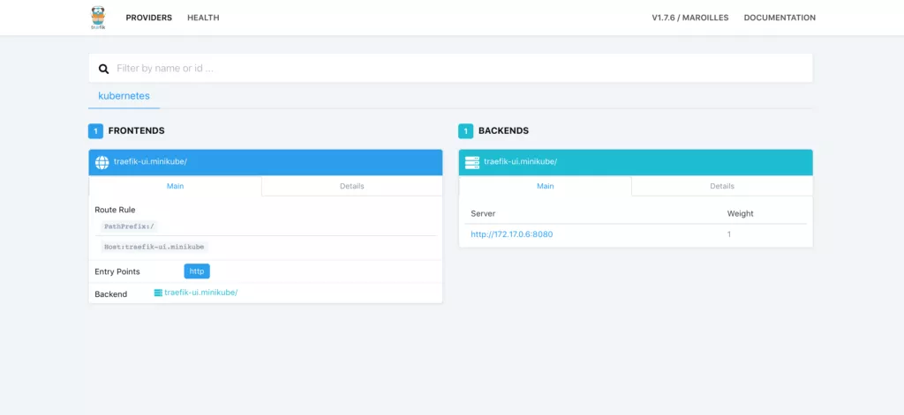
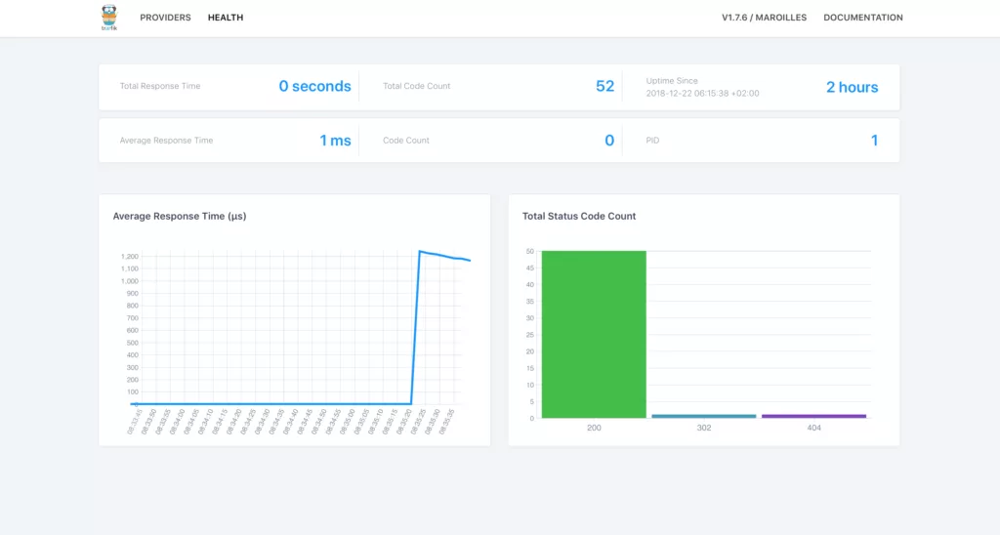
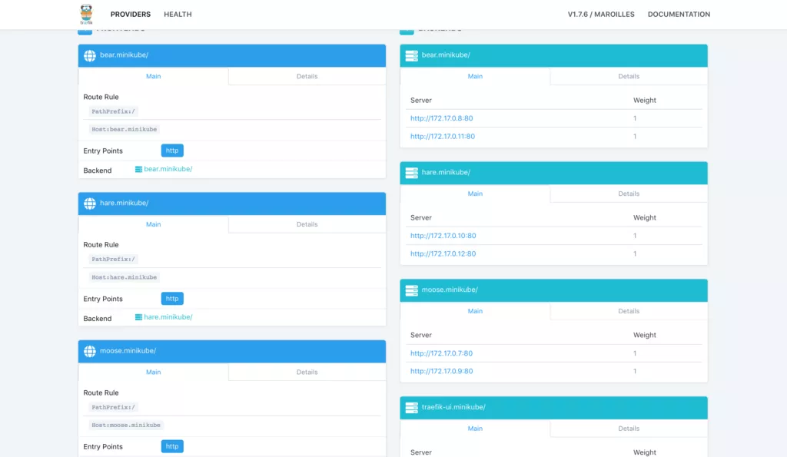

[TOC]
# 如何在K8S集群中部署Traefik Ingress Controller
在生产环境中，我们常常需要控制来自互联网的外部进入集群中，而这恰巧是Ingress的职责。
Ingress的主要目的是将HTTP和HTTPS从集群外部暴露给该集群中运行的服务。这与Ingress控制如何将外部流量路由到集群有异曲同工之妙。接下来，我们举一个实际的例子来更清楚的说明Ingress的概念。

  

首先，想象一下在你的Kubernetes集群中有若干个微服务（小型应用程序之间彼此通信）。这些服务能够在集群内部被访问，但我们想让我们的用户从集群外部也能够访问它们。因此，我们需要做的是使用反向代理将每个HTTP（S）（例如，`service.yourdomain.com`）路由与相应的后端关联，并在该服务的不同实例之间（如，pod）进行负载均衡。与此同时，由于Kubernetes的性质会不断发生变化，因此我们希望跟踪服务后端的更改，以便能够在添加或删除新Pod时将这些HTTP路由重新关联到新Pod实例。

  

使用Ingress资源和关联的Ingress Controller，你可以实现以下目标：

  

*   将你的域`app.domain.com`指向你的私有网络中的微服务应用程序
    
*   将路径`domain.com/web`指向你的私有网络中的微服务web
    
*   将你的域`backend.domain.com`指向你的私有网络中的微服务后端，并在该微服务的多个实例之间（Pod）进行负载均衡
    

  

现在，你理解了Ingress的重要性。它能够帮助将HTTP路由指向在Kubernetes集群中特定的微服务。

  

但是，流量路由并不是Ingress在Kubernetes中的唯一功能。例如，还可以将Ingress配置为负载均衡流量到你的应用程序、终止SSL、执行基于名称的虚拟主机、在不同服务之间分配流量、设置服务访问规则等。

  

Kubernetes有一个特别的Ingress API资源，它能够支持上述所有功能。但是，简单地创建一个Ingress API资源是没有作用的。你还需要一个Ingress Controller。目前，Kubernetes支持许多Ingress controller，如Contour、HAProxy、NGINX以及Traefik。

  

在本文中，我将使用Traefik Ingress Controller创建Ingress。它能够实现现代HTTP反向代理和负载均衡器的功能，从而简化了微服务的部署。此外，Traefik对Docker、Marathon、Consul、Kubernetes、Amazon ECS等系统和环境都提供了强大的支持。

  

Traefik对于诸如Kubernetes之类的灵活性较强的系统十分有用。在Kubernetes中，每天需要多次添加、删除或升级服务，而Traefik可以监听服务镜像仓库/编排器 API并立即生成或更新路由，因此你的微服务无需手动配置即可与外界连接。

  

除此之外，Traefik支持多个负载均衡算法、Let’s Encrypt的HTTPS（支持通配证书）、断路器、WebSoket、GRPC和多个监控程序（Rest、Prometheus、Statsd、Datadog、InfluxDB等）。有关Traefik中可用功能的更多信息，请参考其官方文档：

https://docs.traefik.cn/


## Ingress 资源  

在教程开始之前，我们先来简单地讨论一下Ingress资源是如何工作的。以下是隐式使用Nginx Ingress Controller的Ingress示例。  
```yaml
apiVersion: extensions/v1beta1
kind: Ingress
metadata:
  name: ingress-example
  annotations:
    nginx.ingress.kubernetes.io/rewrite-target: /
spec:
  rules:
  - http:
      paths:
      - path: /microservice1
        backend:
          serviceName: test
          servicePort: 80
```
以上Ingress manifest 包含了一系列HTTP规则，它们用于规定controller如何路由流量。

可选主机。如果未指定主机（如上所示），则该规则适用于通过指定IP地址的所有入站HTTP流量。如果提供了主机（如`yourhost.com`），则该规则仅适用于该主机。

一个路径列表（如，/microservice1），它指向由serviceName和servicePort定义的关联后端。

一个后端。向Ingress发出的HTTP（和HTTPS）请求将与给定规则的主机和路径匹配，然后将其路由到该规则中指定的后端服务。

  

在以上例子中，我们配置了一个名为”test“的后端，它将接收所有来自/microservice路径的流量。然而，我们也可以配置一个默认后端，它将将为任何不符合规范中路径的用户请求提供服务。同时，如果不定义任何规则，Ingress将路由所有流量到默认后端。例如：

```yaml
apiVersion: extensions/v1beta1
kind: Ingress
metadata:
  name: test-ingress
spec:
  backend:
    serviceName: defaultbackend
    servicePort: 80
```

在本例中，所有流量都被转发到默认后端中defaultbackend。现在，我们理解了Ingress 资源的基本概念，接下来我们来看看一些具体的例子。
  
## Step 0：前期准备
  

如上文我们所说的，定义一个Ingress资源没有任何作用，除非你使用了Ingress Controller。在本教程中，我们在Kubernetes集群中将Traefik设置为Ingress Controller。  

要完成教程，你需要进行以下准备：  

*   一个正在运行的Kubernetes集群。
    
*   一个安装好的命令行工具，kubectl。并配置为与集群通信。  

请注意：以下示例均假设你在本地计算上使用Minikube运行Kubernetes集群。  

## Step 1：启用RBAC  

首先，我们需要向Traefik授予一些权限，以访问集群中运行的Pod、endpoint和服务。为此，我们将使用ClusterRole和ClusterRoleBinding资源。但是，你也可以对命名空间范围内的RoleBindings使用最小特权方法。通常，如果集群的命名空间不会动态更改，并且Traefik无法监视所有集群的命名空间，那么这是首选的方法。  

让我们创建一个新的ServiceAccount，为Traefik提供集群中的身份。  
```yaml

apiVersion: v1
kind: ServiceAccount
metadata:
  name: traefik-ingress
  namespace: kube-system
```

要创建一个ServiceAccount，需要在traefik-service-acc.yaml中保存以上manifest并运行：
```sh
kubectl create -f traefik-service-acc.yaml
serviceaccount "traefik-ingress" created
```
接下来，让我们创建一个具有一组权限的ClusterRole，该权限将应用于Traefik ServiceAccount。通过ClusterRole，Traefik可以管理和监视集群中所有命名空间中的资源，例如服务、endpoint、secret以及Ingress。
```yaml
kind: ClusterRole
apiVersion: rbac.authorization.k8s.io/v1beta1
metadata:
  name: traefik-ingress
rules:
  - apiGroups:
      - ""
    resources:
      - services
      - endpoints
      - secrets
    verbs:
      - get
      - list
      - watch
  - apiGroups:
      - extensions
    resources:
      - ingresses
    verbs:
      - get
      - list
      - watch
```
将这一规范保存到文件traefik-cr.yaml中，并运行：
```
kubectl create -f traefik-cr.yaml
clusterrole.rbac.authorization.k8s.io “traefik-ingress” created
```
最后，启用这些权限，我们应该将ClusterRole绑定到Traefik ServiceAccount中。使用ClusterRoleBinding manifest可以完成这一操作：
```yaml
kind: ClusterRoleBinding
apiVersion: rbac.authorization.k8s.io/v1beta1
metadata:
  name: traefik-ingress
roleRef:
  apiGroup: rbac.authorization.k8s.io
  kind: ClusterRole
  name: traefik-ingress
subjects:
- kind: ServiceAccount
  name: traefik-ingress
  namespace: kube-system
```  

保存这一规范到traefik-crb.yaml中，并运行以下命令：
```
kubectl create -f traefik-crb.yaml
clusterrolebinding.rbac.authorization.k8s.io “traefik-ingress” created
```

## Step 2：部署Traefik到集群
接下来，我们将部署Traefik到Kubernetes集群。官方Traefik文档支持三种类型的部署：使用Deployment对象、使用DaemonSet对象或使用Helm Chart。  

在本教程中，我们将使用Deployment manifest。相比其他选项，Deployment有诸多优势。例如，它们能确保更好的可伸缩性，并为滚动更新提供良好支持。 

让我们看一下 Deployment manifest：
```yaml
kind: Deployment
apiVersion: extensions/v1beta1
metadata:
  name: traefik-ingress
  namespace: kube-system
  labels:
    k8s-app: traefik-ingress-lb
spec:
  replicas: 1
  selector:
    matchLabels:
      k8s-app: traefik-ingress-lb
  template:
    metadata:
      labels:
        k8s-app: traefik-ingress-lb
        name: traefik-ingress-lb
    spec:
      serviceAccountName: traefik-ingress
      terminationGracePeriodSeconds: 60
      containers:
      - image: traefik
        name: traefik-ingress-lb
        ports:
        - name: http
          containerPort: 80
        - name: admin
          containerPort: 8080
        args:
        - --api
        - --kubernetes
        - --logLevel=INFO
```
这个Deployment将在kube-system 命名空间中创建一个Traefik副本。Traefik容器将使用此manifest中指定的端口80和8080。  

将这个manifest保存到traefik-deployment.yaml文件中，并运行以下命令创建Deployment：
```
kubectl create -f traefik-deployment.yaml
deployment.extensions “traefik-ingress” created
```

现在，让我们检查以下Traefik Pod是否都成功创建了：
```
kubectl --namespace=kube-system get pods
NAME                         READY     STATUS    RESTARTS   AGE
....
storage-provisioner           1/1       Running   3          23d
traefik-ingress-54d6d8d9cc-ls6cs 1/1       Running   0          1m
```

如你所见，Deployment Controller启动了一个Traefik副本，并在正在运行，敲棒的！

## Step 3：为外部访问创建NodePorts
让我们创建一个服务来从集群外部访问Traefik。为此，我们需要一个暴露两个NodePorts的服务。
```yaml

kind: Service
apiVersion: v1
metadata:
  name: traefik-ingress-service
  namespace: kube-system
spec:
  selector:
    k8s-app: traefik-ingress-lb
  ports:
    - protocol: TCP
      port: 80
      name: web
    - protocol: TCP
      port: 8080
      name: admin
  type: NodePort
```
将这个manifest保存到traefik-svc.yaml，并创建服务：
```
kubectl create -f traefik-svc.yaml
service “traefik-ingress-service” created
```
现在，让我们验证该服务是否创建：
```
kubectl describe svc traefik-ingress-service --namespace=kube-system
Name:                     traefik-ingress-service
Namespace:                kube-system
Labels:                   <none>
Annotations:              <none>
Selector:                 k8s-app=traefik-ingress-lb
Type:                     NodePort
IP:                       10.102.215.64
Port:                     web  80/TCP
TargetPort:               80/TCP
NodePort:                 web  30565/TCP
Endpoints:                172.17.0.6:80
Port:                     admin  8080/TCP
TargetPort:               8080/TCP
NodePort:                 admin  30729/TCP
Endpoints:                172.17.0.6:8080
Session Affinity:         None
External Traffic Policy:  Cluster
Events:                   <none>
```

如你所见，我们现在有两个NodePorts（web和admin），它们分别路由到Traefik Ingress Controller的80和8080容器端口。“admin” NodePort将用于访问Traefik Web UI，“web” NodePort将用于访问通过Ingress暴露的服务。

## Step 4：访问Traefik

为了能在浏览器中访问Traefik Web UI，你可以使用“admin”NodePort 30729（请注意，你的NodePort值可能会有所不同）。因为我们还没有添加任何前端，所以UI此时应该是空的。 

由于我们尚未给Traefik进行任何配置，因此我们会收到404的响应。
```
curl $(minikube ip):30565
404 page not found
```

## Step 5 ：添加Ingress 到集群

现在我们在Kubernetes集群中已经将Traefik作为Ingress Controller了。然而，我们依旧需要定义Ingress资源和暴露Traefik Web UI的服务。

首先，我们创建一个服务：
```yaml

apiVersion: v1
kind: Service
metadata:
  name: traefik-web-ui
  namespace: kube-system
spec:
  selector:
    k8s-app: traefik-ingress-lb
  ports:
  - name: web
    port: 80
    targetPort: 8080
```
保存manifest到traefik-webui-svc.yaml中，并运行：

```
kubectl create -f traefik-webui-svc.yaml
service “traefik-web-ui” created
```

让我们验证服务是否已经创建：
```
kubectl describe svc traefik-web-ui --namespace=kube-system
Name:              traefik-web-ui
Namespace:         kube-system
Labels:            <none>
Annotations:       <none>
Selector:          k8s-app=traefik-ingress-lb
Type:              ClusterIP
IP:                10.98.230.58
Port:              web  80/TCP
TargetPort:        8080/TCP
Endpoints:         172.17.0.6:8080
Session Affinity:  None
Events:            <none>
```
如你所见，服务的ClusterIP是10.98.230.58，并在manifest中分配指定端口。

接下来，我们需要创建一个Ingress资源，指向Traefik Web UI后端：
```yaml
apiVersion: extensions/v1beta1
kind: Ingress
metadata:
  name: traefik-web-ui
  namespace: kube-system
spec:
  rules:
  - host: traefik-ui.minikube
    http:
      paths:
      - path: /
        backend:
          serviceName: traefik-web-ui
          servicePort: web
```

本质上，Ingress将所有请求路由到traefik-ui.minikube，在上述步骤中创建的服务暴露Traefik Web UI。

将规范保存到traefik-ingress.yaml，并运行：
```
kubectl create -f traefik-ingress.yaml
ingress.extensions “traefik-web-ui” created
```

为了能够通过traefik-ui.minikube在浏览器中可以访问Traefik Web UI，我们需要添加新的条目到我们/etc/hosts文件中。该条目将包含Minikube IP和主机名。你可以通过运行minikube ip来获取minkube实例的IP地址，然后将新主机的名称保存到/etc/hosts文件中，如下所示：
```
echo "$(minikube ip) traefik-ui.minikube" | sudo tee -a /etc/hosts
192.168.99.100 traefik-ui.minikube
```
现在，你应该能够在浏览器中访问`http://traefik-ui.minikube:<AdminNodePort>`并查看Traefik Web UI。别忘了附加”admin”NodePort到主机地址。

  

在dashboard中，你可以点击Health 链接来查看应用程序的健康状况：  




## Step 6：实现基于名称的路由
现在，我们来演示如何使用Traefik Ingress Controller为前端列表设置基于名称的路由。我们将使用简单的单页网站创建3个Deployment，并显示动物图像：熊、野兔和驼鹿。
```yaml
---
kind: Deployment
apiVersion: extensions/v1beta1
metadata:
  name: bear
  labels:
    app: animals
    animal: bear
spec:
  replicas: 2
  selector:
    matchLabels:
      app: animals
      task: bear
  template:
    metadata:
      labels:
        app: animals
        task: bear
        version: v0.0.1
    spec:
      containers:
      - name: bear
        image: supergiantkir/animals:bear
        ports:
        - containerPort: 80
---
kind: Deployment
apiVersion: extensions/v1beta1
metadata:
  name: moose
  labels:
    app: animals
    animal: moose
spec:
  replicas: 2
  selector:
    matchLabels:
      app: animals
      task: moose
  template:
    metadata:
      labels:
        app: animals
        task: moose
        version: v0.0.1
    spec:
      containers:
      - name: moose
        image: supergiantkir/animals:moose
        ports:
        - containerPort: 80
---
kind: Deployment
apiVersion: extensions/v1beta1
metadata:
  name: hare
  labels:
    app: animals
    animal: hare
spec:
  replicas: 2
  selector:
    matchLabels:
      app: animals
      task: hare
  template:
    metadata:
      labels:
        app: animals
        task: hare
        version: v0.0.1
    spec:
      containers:
      - name: hare
        image: supergiantkir/animals:hare
        ports:
        - containerPort: 80
```

每个Deployment都将有两个Pod副本，而每个Pod将在containerPort 80上服务“动物“网站。

让我们保存这些Deployment manifest到animals-deployment.yaml中，并运行：

```
kubectl create -f animals-deployment.yaml
deployment.extensions “bear” created
deployment.extensions “moose” created
deployment.extensions “hare” created
```
现在，让我们为每个Deployment创建一个服务，使得Pod可以访问：
```yaml
---
apiVersion: v1
kind: Service
metadata:
  name: bear
spec:
  ports:
  - name: http
    targetPort: 80
    port: 80
  selector:
    app: animals
    task: bear
---
apiVersion: v1
kind: Service
metadata:
  name: moose
spec:
  ports:
  - name: http
    targetPort: 80
    port: 80
  selector:
    app: animals
    task: moose
---
apiVersion: v1
kind: Service
metadata:
  name: hare
  annotations:
    traefik.backend.circuitbreaker: "NetworkErrorRatio() > 0.5"
spec:
  ports:
  - name: http
    targetPort: 80
    port: 80
  selector:
    app: animals
    task: hare
```

请注意：第三项服务使用断路器annotation。断路器是Traefik的一项功能，可防止发生故障的服务器承受高负载。在本例中，我们防止服务器上的高负载超过50%。当此条件匹配时，CB进入“跳闸“状态，在该状态中它会使用预定义的HTTP状态代码进行响应或重定向到另一个前端。

保存这些服务manifest到animals-svc.yaml并运行：
```
kubectl create -f animals-svc.yaml
service “bear” created
service “moose” created
service “hare” created
```

最后，为每个Deployment创建一个有3个前后端对的Ingress。bear.minikube、moose.minikube和hare.minikube将是我们指向相应后端服务的前端。

Ingress manifest如下所示：
```yaml
apiVersion: extensions/v1beta1
kind: Ingress
metadata:
  name: animals
  annotations:
    kubernetes.io/ingress.class: traefik
spec:
  rules:
  - host: hare.minikube
    http:
      paths:
      - path: /
        backend:
          serviceName: hare
          servicePort: http
  - host: bear.minikube
    http:
      paths:
      - path: /
        backend:
          serviceName: bear
          servicePort: http
  - host: moose.minikube
    http:
      paths:
      - path: /
        backend:
          serviceName: moose
          servicePort: http
```

保存规范到animals-ingress.yaml并运行：
```

kubectl create -f animals-ingress.yaml
ingress.extensions “animals” created
```
现在，在Traefik dashboard内，你可以看到每个主机的前端以及相应的后端列表：



如果你再次编辑etc/hosts，你应该能够在你的浏览器中访问动物网页：
```
echo “$(minikube ip) bear.minikube hare.minikube moose.minikube” | sudo tee -a /etc/hosts
```

你应该使用“web“NodePort来访问特定网页。例如，`http://bear.minikube:<WebNodePort>`

我们也可以将三个前端重新配置为在一个域下提供服务，如下所示：
```yaml

apiVersion: extensions/v1beta1
kind: Ingress
metadata:
  name: all-animals
  annotations:
    kubernetes.io/ingress.class: traefik
    traefik.frontend.rule.type: PathPrefixStrip
spec:
  rules:
  - host: animals.minikube
    http:
      paths:
      - path: /bear
        backend:
          serviceName: bear
          servicePort: http
      - path: /moose
        backend:
          serviceName: moose
          servicePort: http
      - path: /hare
        backend:
          serviceName: hare
          servicePort: http
```

如果你激活这个Ingress，使用相应的路径，三个动物在一个域下都能够访问——animals.minikube。别忘了将这个域添加到/etc/hosts。
```
    echo “$(minikube ip) animals.minikube” | sudo tee -a /etc/hosts
```

请注意：我们正在配置Traefik，以使用`traefik.frontend.rule.type`注释，从URL路径中删除前缀。这样我们可以直接使用上一个示例中的容器。由于`traefik.frontend.rule.type: PathPrefixStrip`规则，你必须使用`http://animals.minikube:32484/moose/` 而不是`http://animals.minikube:32484/moose`  
## Step 7：实现流量分配

借助Traefik，用户可以使用服务权重以受控方式在多个deployment之间分配Ingress流量。这一功能可用于金丝雀发布，它最初应该获得少量但持续增长的流量。

让我们使用以下manifest在两个微服务之间分配Traefik：
```yaml

apiVersion: extensions/v1beta1
kind: Ingress
metadata:
  annotations:
    traefik.ingress.kubernetes.io/service-weights: |
      animals-app: 99%
      animals-app-canary: 1%
  name: animals-app
spec:
  rules:
  - http:
      paths:
      - backend:
          serviceName: animals-app
          servicePort: 80
        path: /
      - backend:
          serviceName: animals-app-canary
          servicePort: 80
        path: /
```
请注意`traefik.ingress.kubernetes.io/service-weights`的注释。它指定了流量如何在指定后端服务（animals-app和animals-app-canary）之间分配。Traefik将把99%的用户请求路由到animals-app deployment支持的Pod，并将1%的用户请求路由到animals-app-canary deployment支持的Pod。

要使此设置正常工作，需要满足一些条件：

*   所有服务后端必须共享相同的路径和主机。    
*   跨服务后端共享的请求总数应总计为100％。    
*   百分比值应该在支持的精度范围内，目前Traefik支持3个小数位的权重。

## 总  结

如你所见，Ingress是将外部流量路由到Kubernetes集群中相应后端服务的强大工具。用户可以使用Kubernetes支持的许多Ingress controller来实现Ingress。在本教程中，我们重点介绍了Traefik Ingress controller，该控制器支持基于名称的路由，负载均衡以及Ingress controller的其他常见任务。
  

推荐阅读

[实践示例：从一个域名跳转到另一个域名，ingress-nginx经历了什么](http://mp.weixin.qq.com/s?__biz=MzIyMTUwMDMyOQ==&mid=2247492713&idx=1&sn=8bf1f69be1637346bc9c8746825f11e2&chksm=e83962afdf4eebb941bd4fb3b833e2cbcc97f339c408dc02d4fe040bdc4c93012d83b0190a1c&scene=21#wechat_redirect)  

[服务网格数据平面的关键：层层剖析Envoy配置](http://mp.weixin.qq.com/s?__biz=MzIyMTUwMDMyOQ==&mid=2247492762&idx=1&sn=f1df1ffa66d03a7964df120cc0cb5d0a&chksm=e839625cdf4eeb4add904f883db2fb99651504933b8c4cea4c2a001042283c7a2a90869b7002&scene=21#wechat_redirect)

[原文：Building a Service Mesh with Envoy](https://www.thoughtworks.com/insights/blog/building-service-mesh-envoy-0)

  