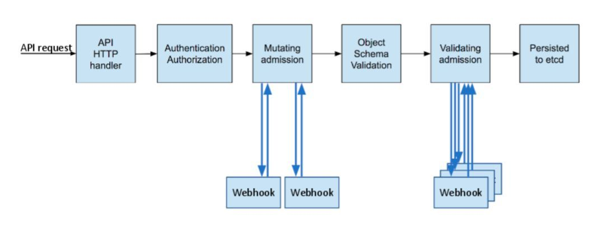

# webhook

admission 入场

webhook 的本质是个 http server，因此，需要用代码实现这么一个 server，供 apiserver 调用

admission webhook 的作用我简单的总结下，当用户的请求到达 k8s apiserver 后，apiserver 根据 MutatingWebhookConfiguration 和 ValidatingWebhookConfiguration 的配置，先调用 MutatingWebhookConfiguration 去修改用户请求的配置文件，最后会调用 ValidatingWebhookConfiguration 来验证这个修改后的配置文件是否合法。

我们可以利用 mutating 的机制，将一些特殊的配置自动加上，而不用用户来操心。同时也可以在 validating 中编写代码设置自己的规则，看请求是否合法。

1. 修改类型(mutating)

2. 验证类型(validating)

3. 既是修改又是验证类型(mutating&validating)

api请求到达K8S API Server，请求要先经过认证，执行一连串的admission controller，包括MutatingAdmissionWebhook和ValidatingAdmissionWebhook, 先串行执行MutatingAdmission的Webhook list，对请求对象的schema进行校验，并行执行ValidatingAdmission的Webhook list，最后写入etcd

apiserver 如何知道它要访问 webhook server？
- 配置 ValidatingWebhookConfiguration
- 配置 MutatingWebhookConfiguration

##  相关操作
kubectl exec登入pod
kube-apiserver --help |grep enable-admission-plugins

kubectl get MutatingWebhookConfiguration
kubectl get ValidatingWebhookConfiguration

kubectl api-versions | grep admissionregistration.k8s.io/v1beta1

## 如何自己写一个webhook?
需要完成几个事情：
- 创建TLS Certificate，即证书
- 编写服务端代码，服务端代码需要使用证书
- 根据证书创建k8s sercret
- 创建k8s Deployment和Service
- 创建k8s WebhookConfiguration，其中需要使用之前创建的证书

https://github.com/morvencao/kube-mutating-webhook-tutorial

[编译开源的 admission webhook](https://www.cnblogs.com/oolo/p/11778727.html)
[玩转K8S AdmissionWebhook](https://cloud.tencent.com/developer/article/1445760)