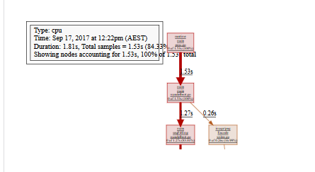

[TOC]
# High Performance Go Workshop（Part5）

## 5\. 执行追踪器

  

执行追踪程序是由 [Dmitry Vyukov](https://github.com/dvyukov) 为 GO 1.5 开发的。

  

与基于示例的分析不同，执行跟踪程序集成到 Go runtime 中，因此它只知道 go 程序在特定时间点在做什么。

  

### 5.1. 什么是执行跟踪器，为什么需要它？

  

我认为最简单的解释是执行跟踪器做了什么，以及为什么它是重要的，通过查看一段代码中 pprof, go tool pprof 性能较差。

  

`examples/mandelbrot`目录包含一个简单的 mandelbrot 生成器。此代码源自 [Francesc Campoy’s mandelbrot package](https://github.com/campoy/mandelbrot).

  
```
cd examples/mandelbrot 
go build && ./mandelbrot
```
  

  

如果我们 build，然后 run ，它会产生这样的东西

  

  
  

  

#### 5.1.1. 需要多长时间?

  

那么，这个程序生成 1024x 1024 像素的图像需要多长时间？

  

我知道的最简单的方法就是 `time(1)`。

  
```
% time ./mandelbrot 
real    0m1.654s 
user    0m1.630s 
sys     0m0.015s
```
  

> 不要使用 `time go run mandebrot.go`，否则将计算编译和运行程序所需的时间。

  

#### 5.1.2. 程序正在做什么？

  

因此，在本例中，程序用了 1.6 秒生成 mandelbrot 并写入图片。

  

这样可以了吗？我们能快点吗？

  

解决这个问题的一种方法是使用 Go 内置的 pprof 支持来分析程序。

  

### 5.2. 生成分析文件

  

要转为生成分析文件，我们需要

  

1.  直接使用 `runtime/pprof` package  
    

  

2.  使用像 `github.com/pkg/profile` 这样的装饰器来实现自动化。

  

  

### 5.3.使用 runtime/pprof 生成分析文件

  

让我们修改程序写一个CPU分析文件 `os.Stdout`。

  
```
import "runtime/pprof"   
func main() {  
    pprof.StartCPUProfile(os.Stdout) 
    defer pprof.StopCPUProfile()
```
  

通过将此代码添加到 `main`  函数的顶部，这个程序会向 `os.Stdout` 写入分析文件。

  
```
cd examples/mandelbrot-runtime-pprof 
go run mandelbrot.go > cpu.pprof
```
  

> 在这种情况下，我们可以使用 `go run`，因为 cpu 分析只包括 `mandelbrot.go` 的执行，而不包括它的编译。

  

#### 5.3.1. 利用 github.com/pkg/profile 生成分析文件

  

前一张幻灯片展示了一种生成分析文件的的方法，但是它有一些问题。

  

*   如果忘记将输出重定向到文件，则会终止该终端会话。（提示：`reset(1)` 将帮助你）

  

*   如果你在 `os.Stdout` 上写其他东西，例如 `fmt.Println`，你会破坏跟踪。

  

建议使用 `runtime/pprof` 的方法是将跟踪写入文件。但是，必须确保跟踪已停止，并且在程序停止之前关闭了文件，其中包括如果有人\`^ C 。

  

所以，几年前我写了一个 [package](https://godoc.org/github.gom/pkg/profile) 来处理它。

  
```
import "github.com/pkg/profile"   
func main() {  
    defer profile.Start(profile.CPUProfile, 
    profile.ProfilePath(".")).Stop()
```
  

如果我们运行这个版本中，我们得到写入到当前工作目录中的分析文件

  
```
% go run mandelbrot.go 
2017/09/17 12:22:06 profile: cpu profiling enabled, cpu.pprof 
2017/09/17 12:22:08 profile: cpu profiling disabled, cpu.pprof
```
  

> 是否使用 `pkg/profile` 并不是强制性的，但是它会处理收集和记录跟踪的许多样板，所以我们将在本次研讨会中使用它。

  

  

#### 5.3.2. 分析文件

  

现在我们有一个分析文件，我们可以使用 `go tool pprof` 来分析它。

  
```
% go tool pprof -http=:8080 cpu.pprof
```
  

在这次运行中，我们看到程序运行了 1.81 秒（分析会增加一点开销）。我们还可以看到 pprof 只捕获了 1.53 秒的数据，因为 pprof 是基于示例的，依赖于操作系统的 `SIGPROF` 计时器。

  

> 由于 Go 1.9 `pprof` 跟踪包含分析跟踪所需的所有信息。你不再需要有产生跟踪的匹配二进制文件。🎉

  

我们可以用 `top` pprof 函数对跟踪记录的函数进行排序。

  
```
% go tool pprof cpu.pprof 
Type: cpu 
Time: Mar 24, 2019 at 5:18pm (CET) 
Duration: 2.16s, Total samples = 1.91s (88.51%) 
Entering interactive mode (type "help" for commands, "o" for options) 
(pprof) top 
Showing nodes accounting for 1.90s, 99.48% of 1.91s total 
Showing top 10 nodes out of 35  
flat  flat%   sum%        cum   cum% 
0.82s 42.93% 42.93%      1.63s 85.34%  main.fillPixel 
0.81s 42.41% 85.34%      0.81s 42.41%  main.paint 
0.11s  5.76% 91.10%      0.12s  6.28%  runtime.mallocgc 
0.04s  2.09% 93.19%      0.04s  2.09%  runtime.memmove 
0.04s  2.09% 95.29%      0.04s  2.09%  runtime.nanotime 
0.03s  1.57% 96.86%      0.03s  1.57%  runtime.pthread\_cond\_signal 
0.02s  1.05% 97.91%      0.04s  2.09%  compress/flate.(\*compressor).deflate 
0.01s  0.52% 98.43%      0.01s  0.52%  compress/flate.(\*compressor).findMatch 
0.01s  0.52% 98.95%      0.01s  0.52%  compress/flate.hash4 
0.01s  0.52% 99.48%      0.01s  0.52%  image/png.filter
```
  

  

我们看到，当 pprof 捕获堆栈时，`main.fillPixel` 函数在 CPU 上运行得最多。

  

在堆栈上找到 `main.paint` 并不奇怪，这是程序所做的；它负责绘制像素。但是是什么导致 `paint` 花了这么多时间？我们可以用*cummulative*  命令 `top` 来检查。

  
```
(pprof) top --cum 
Showing nodes accounting for 1630ms, 85.34% of 1910ms total 
Showing top 10 nodes out of 35  
flat  flat%   sum%        cum   cum% 
0     0%     0%     1840ms 96.34%  main.main 
0     0%     0%     1840ms 96.34%  runtime.main 
820ms 42.93% 42.93%     1630ms 85.34%  main.fillPixel 
0     0% 42.93%     1630ms 85.34%  main.seqFillImg 
810ms 42.41% 85.34%      810ms 42.41%  main.paint 
0     0% 85.34%      210ms 10.99%  image/png.(\*Encoder).Encode 
0     0% 85.34%      210ms 10.99%  image/png.Encode 
0     0% 85.34%      160ms  8.38%  main.(\*img).At 
0     0% 85.34%      160ms  8.38%  runtime.convT2Inoptr 
0     0% 85.34%      150ms  7.85%  image/png.(\*encoder).writeIDATs
```
  

这表明 `main.fillPixed` 实际上在做大部分工作。

  

> 你还可以使用 `web` 命令可视化配置文件，如下所示：
> 
>   
> 
>   

  

  

### 5.4. 跟踪 VS 分析

  

希望这个例子展示了分析的局限性。分析告诉我们分析器看到了什么；`fillPixel` 正在做所有的工作。似乎没有很多事情可以做的了。

  

所以现在是引入执行跟踪程序的好时机，它可以为同一个程序提供不同的视图。

  

#### 5.4.1. 使用执行跟踪

  

使用跟踪程序就像请求 `profile.TraceProfile` 一样简单，没有其他的变化。

  

  
```
import "github.com/pkg/profile"   
func main() {  
    defer profile.Start(profile.TraceProfile, profile.ProfilePath(".")).Stop()
```
  

  

当我们运行程序时，会在当前工作目录中得到一个`trace.out` 文件。

  
```
% go build mandelbrot.go 
% % time ./mandelbrot 
2017/09/17 13:19:10 profile: trace enabled, trace.out 
2017/09/17 13:19:12 profile: trace disabled, trace.out 
real    0m1.740s 
user    0m1.707s 
sys     0m0.020s
```
  

  

与 pprof 一样，`go` 命令中也有一个工具来分析跟踪。

  
```
% go tool trace trace.out 
2017/09/17 12:41:39 Parsing trace... 
2017/09/17 12:41:40 Serializing trace... 
2017/09/17 12:41:40 Splitting trace... 
2017/09/17 12:41:40 Opening browser. Trace viewer s listening on http://127.0.0.1:57842
```
  

  

这个工具和 `go tool pprof`  有点不同。执行跟踪程序正在重用 Chrome 中内置的许多分析文件可视化基础设施，因此 `go tool trace` 充当服务器，将原始执行跟踪转换为 Chrome 可以本机显示的数据。

  

#### 5.4.2. 分析跟踪

  

从跟踪中我们可以看出，这个程序只使用了一个 CPU。

  
```
func seqFillImg(m *img) {  
    for i, row := range m.m { 
        for j := range row { 
            fillPixel(m, i, j) 
        } 
    } 
}
```
  

这并不奇怪，默认情况下 `mandelbrot.go` 会按顺序为每一行中的每一个像素调用 `fillPixel` 。

  

绘制图像后，请参阅执行开关以写入 `.png` 文件。这会在堆上生成垃圾，因此跟踪在这一点上发生变化，我们可以看到垃圾收集堆的典型锯齿模式。

  

跟踪分析文件提供了微秒级的时间分辨率。这是外部分析所不能得到的。

  

> go tool trace
> 
>   
> 
> 在我们继续之前，我们需要应该谈谈跟踪工具的使用。
> 
>   
> 
> *   该工具使用内置在 Chrome 中的 JavaScript 调试支持。跟踪配置文件只能在 Chrome 中查看，在 Firefox、Safari、IE/Edge 中不起作用。
> 
>   
> 
> *   因为这是一个 Google 产品，它支持键盘快捷键；使用 `WASD` 导航，使用 `?` 得到一份清单。
> 
>   
> 
> *   查看跟踪会占用大量内存。说真的，4GB不够用，8GB估计勉强，上更高的内存肯定更好。
> 
>   
> 
> *    如果你是从Fedora之类的OS发行版中安装Go的，那么跟踪查看器的支持文件可能不是 `golang` deb/rpm main 程序的一部分，它们可能在一些 `-extra` 的包中。

  

  

### 5.5. 使用多个CPU

  

我们从前面的跟踪中看到，程序按顺序运行，没有利用这台机器上的其他的 CPU。

  

Mandelbrot generation 被称为 *embarassingly\_parallel*（令人尴尬的并行）。每个像素都是独立的，可以并行计算。所以，让我们试试。

  
```
% go build mandelbrot.go 
% time ./mandelbrot -mode px 
2017/09/17 13:19:48 profile: trace enabled, trace.out 
2017/09/17 13:19:50 profile: trace disabled, trace.out 
real    0m1.764s 
user    0m4.031s 
sys     0m0.865s
```
  

  

因此，运行时间基本上是相同的。  我们使用了所有的 CPU，因此有更多的用户时间，这是有道理的，但是实际（wall clock）时间大致相同。

  

让我们看看跟踪。

  

正如所看到的，这个跟踪生成了更多的数据。

  

*   看起来有很多工作要做，但如果你放大，就会发现有差距。这就是调度程序。

  

*   当我们使用所有四个核心时，因为每个 `fillPixel` 的工作量相对较小，所以我们在调度开销上花费了大量时间。

  

### 5.6. 分批工作

  

每像素使用一个 goroutine 太细粒度了。没有足够的工作来证明 goroutine 的开销是合理的。

  

让我们尝试每个 goroutine 处理一行。
```
% go build mandelbrot.go 
% time ./mandelbrot -mode row 
2017/09/17 13:41:55 profile: trace enabled, trace.out 
2017/09/17 13:41:55 profile: trace disabled, trace.out 
real    0m0.764s 
user    0m1.907s 
sys     0m0.025s
```
  

这看起来是一个很好的改进，我们几乎把程序的运行时间减少了一半。让我们看看跟踪。

  

正如所看到的，跟踪现在更小，更容易使用。我们可以在 span 中看到整个痕迹。

  

*   在程序开始时，我们看到 goroutines 的数量增加到1000个左右。这比我们在上一次跟踪中看到的 1 << 20 有所改进。

  

*   放大后，我们会看到一个 `onePerRowFillImg` 运行更长时间，并且随着 goroutine 生成工作提前完成，调度器将有效地处理剩余的可运行 goroutine。

  

  

### 5.7. 使用 workers

  

`mandelbrot.go` 支持另外一个模式。

  
```
% go build mandelbrot.go 
% time ./mandelbrot -mode workers 
2017/09/17 13:49:46 profile: trace enabled, trace.out 
2017/09/17 13:49:50 profile: trace disabled, trace.out   
real    0m4.207s 
user    0m4.459s 
sys     0m1.284s
```
  

  

所以，runtime 比以前差好多。让我们看看跟踪，看看能不能看出发生了什么事。

  

查看跟踪可以看到，只有一个 worker 进程，生产者和消费者往往会轮换，因为只有一个生产者和一个消费者。让我们增加 worker 的数量

  
```
% go build mandelbrot.go 
% time ./mandelbrot -mode workers -workers 4 
2017/09/17 13:52:51 profile: trace enabled, trace.out 
2017/09/17 13:52:57 profile: trace disabled, trace.out   
real    0m5.528s 
user    0m7.307s 
sys     0m4.311s
```
  

  

那就更糟了！消耗更多的运行时间，更多的CPU时间。让我们看看跟踪发生了什么。

  

跟踪没法看。因为有更多的 worker 可供选择，但他们似乎把所有的时间都花在争夺 work  上 。

  

这是因为通道是无缓冲的。在准备好接收之前，无缓冲信道无法发送消息。

  

*   在一个消费者准备好接收内容之前，生产者不能发送消息。

  

*   消费者们只有等到有人准备好了才可以接受消息，所以他们在等待的时候互相竞争。

  

*   发送方没有特权，它不能比已经运行的消费者享有优先权。

  

  

我们在这里看到的是未缓冲通道引入的延迟。调度程序内有很多停止和启动，在等待工作时可能会锁定和互斥，这就是为什么我们看到 `sys` 消耗的时间更多的原因。

  

  

### 5.8. 使用缓冲通道

  
```
import "github.com/pkg/profile"   
func main() {  
    defer profile.Start(profile.TraceProfile, profile.ProfilePath(".")).Stop()
```
  

  
```
% go build mandelbrot.go 
% time ./mandelbrot -mode workers -workers 4 
2017/09/17 14:23:56 profile: trace enabled, trace.out 
2017/09/17 14:23:57 profile: trace disabled, trace.out   
real    0m0.905s 
user    0m2.150s 
sys     0m0.121s
```
  

  

非常接近上面每一行的模式。

  

使用缓冲通道跟踪显示：

  

*   生产者不必等消费者来，它可以很快填满信道。

  

*   消费者可以快速地从信道获取下一个消息，而无需在消息生产时睡眠。

  

使用这种方法，我们使用一个信道来分配每一个像素的工作，其速度几乎与之前在每行 goroutine 上调度的速度相同。

  

> 将 `nWorkersFillImg` 修改为每行工作。对结果进行时间分析并分析跟踪。

  

### 5.9. Mandelbrot 微服务

  

在2019年，除非你可以将 Internet 作为无服务器微服务提供，否则生成 Mandelbrots 毫无意义。  因此，我向你介绍 *Mandelweb*

  
```
% go run examples/mandelweb/mandelweb.go 
2017/09/17 15:29:21 listening on http://127.0.0.1:8080/
```
  

[http://127.0.0.1:8080/mandelbrot](http://127.0.0.1:8080/mandelbrot)

  

#### 5.9.1. 跟踪运行的应用程序

  

在前面的例子中，我们对整个程序运行了跟踪。

  

如你所见，跟踪可能非常大，即使是在很短的时间内，因此连续收集跟踪数据会产生太多的数据。此外，跟踪还会对程序的速度产生影响，特别是在有大量活动的情况下。

  

我们需要的是一种从正在运行的程序中收集短跟踪的方法。

  

好在`net/http/pprof` 包就是这样一个工具。

  

#### 5.9.2. 通过http收集跟踪

  

希望大家都知道 `net/http/pprof` 包。

  

import \_ "net/http/pprof"

  

导入时，`net/http/pprof` 将使用 `http.DefaultServeMux` 注册跟踪和分析路由。从 Go 1.5 开始，这包括跟踪探查器。

  

> `net/http/pprof` 向 `http.DefaultServeMux` 注册。如果你正在隐式或显式地使用该 `ServeMux` ，则可能会无意中将 pprof 端点公开到网络上。这可能导致源代码泄露。你可能不想这么做。

  

我们可以使用 `curl`  (或 `wget`) 从 mandelweb 获取五秒钟的跟踪

  
```
% curl -o trace.out http://127.0.0.1:8080/debug/pprof/trace?seconds=5
```
  

  

#### 5.9.3. 产生一些负载

  

上一个例子很有趣，但是根据定义，空闲的 web 服务器没有性能问题。我们需要产生一些负荷。因此我用的是 [JBD](https://github.com/rakyll/hey) 的 `hey`。（Google大佬。。第一次看到这么漂亮的mm）

  
```
% go get -u github.com/rakyll/hey
```
  

让我们从每秒一个请求开始。

  
```
% hey -c 1 -n 1000 -q 1 http://127.0.0.1:8080/mandelbrot
```
  

运行之后，在另一个窗口中收集跟踪

  
```
% curl -o trace.out http://127.0.0.1:8080/debug/pprof/trace?seconds=5  
% Total    % Received % Xferd  Average Speed   Time    Time     Time  Current Dload  Upload   Total   Spent    Left  Speed 
100 66169    0 66169    0     0  13233      0 --:--:--  0:00:05 --:--:-- 17390 

% go tool trace trace.out 
2017/09/17 16:09:30 Parsing trace... 
2017/09/17 16:09:30 Serializing trace... 
2017/09/17 16:09:30 Splitting trace... 
2017/09/17 16:09:30 Opening browser. Trace viewer is listening on http://127.0.0.1:60301
```
  

#### 5.9.4. 模拟过载

  

让我们将请求速率增加到每秒5个请求。

  
```
% hey -c 5 -n 1000 -q 5 http://127.0.0.1:8080/mandelbrot
```
  

然后在另一个窗口收集

  
```
% curl -o trace.out http://127.0.0.1:8080/debug/pprof/trace?seconds=5  
% Total    % Received % Xferd  Average Speed   Time    Time     Time  Current Dload  Upload   Total   Spent    Left  Speed 100 66169    0 66169    0     0  13233      0 --:--:--  0:00:05 --:--:-- 17390 

% go tool trace trace.out 
2017/09/17 16:09:30 Parsing trace... 
2017/09/17 16:09:30 Serializing trace... 
2017/09/17 16:09:30 Splitting trace... 
2017/09/17 16:09:30 Opening browser. Trace viewer is listening on http://127.0.0.1:60301
```
  

  

#### 5.9.5. Extra credit, the Sieve of Eratosthenes

  

[并发筛选质数](https://github.com/golang/go/blob/master/doc/play/sieve.go)是最早编写的 Go 程序之一。

  

Ivan Daniluk 写了一篇关于可视化的[文章](https://divan.dev/posts/go_concurrency_visualize/)。

  

让我们使用执行跟踪程序来查看它的操作。

  

#### 5.9.6. 更多资料

  

*   Rhys Hiltner, [Go’s execution tracer](https://www.youtube.com/watch?v=mmqDlbWk_XA) (dotGo 2016)

  

*   Rhys Hiltner, [An Introduction to "go tool trace"](https://www.youtube.com/watch?v=V74JnrGTwKA) (GopherCon 2017)

  

*   Dave Cheney, [Seven ways to profile Go programs](https://www.youtube.com/watch?v=2h_NFBFrciI) (GolangUK 2016)

  

*   Dave Cheney, [High performance Go workshop](https://dave.cheney.net/training#high-performance-go)\]

  

*   Ivan Daniluk, [Visualizing Concurrency in Go](https://www.youtube.com/watch?v=KyuFeiG3Y60) (GopherCon 2016)

  

*   Kavya Joshi, [Understanding Channels](https://www.youtube.com/watch?v=KBZlN0izeiY) (GopherCon 2017)

  

*   Francesc Campoy, [Using the Go execution tracer](https://www.youtube.com/watch?v=ySy3sR1LFCQ)

  

  
