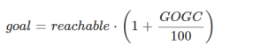

[TOC]

# High Performance Go Workshop（Part6）

## 6\. 内存和垃圾回收

  

Go是一种自带 GC 语言。这是一个设计原则，它不会改变。

  

作为垃圾回收语言，Go 程序的性能通常取决于它们与垃圾回收器的交互。

  

除了你选择的算法外，内存消耗是决定应用程序性能和可扩展性的最重要因素。

  

本节讨论垃圾回收器的操作、如何测量程序的内存使用情况以及垃圾回收器性能存在瓶颈时降低内存使用量的策略。

  

### 6.1. 概览 GC

  

任何垃圾回收的目的都是让人产生一种错觉，即程序有无限的可用内存。

  

你可能不同意这种说法，但这是垃圾收集器设计器工作方式的基本假设。

  

一个 stw(stop the world)，标记清除 GC 在总运行时间方面是最有效的；对批处理、模拟等效果很好。但是，随着时间的推移，Go GC 已经从一个纯的 STW 收集器转变为一个并发的、非压缩的收集器。这是因为 Go GC 是为低延迟服务器和交互式应用程序设计的。

  

Go GC 的设计倾向于低延迟，而不是大的吞吐量；它将一些分配成本转移到mutator，以减少以后清理的成本。

  

### 6.2.设计 GC

  

Go GC 的设计这些年一直在有改

  

*   Go 1.0, stw 标记-扫描 回收器基于 tcmalloc.

  

*   Go 1.3, 完全精确的收集器，不会将堆上的大的数字误认为指针，从而防止内存泄漏。

  

*   Go 1.5,  新的 GC 设计，专注于吞吐量上的延迟。

  

*   Go 1.6,  GC 改进，以较低的延迟处理较大的堆。

  

*   Go 1.7, 小的 GC 改进，主要是重构。

  

*   Go 1.8, 进一步减少 STW 次数，现在降低到100微秒的范围。

  

*   Go 1.10+, 当触发一个完整的GC周期时，[远离纯协作式 goroutine 调度来降低延迟](https://github.com/golang/proposal/blob/master/design/24543-non-cooperative-preemption.md)。

  

### 6.3. 监控 GC

  

要获得 GC 的工作量，一个简单的方法是启用 GC 日志记录的输出。

  

这些统计信息总是会被收集，但是这个功能通常是被禁止的，你可以通过设置 `GODEBUG` 环境变量来启用。

  
```
% env GODEBUG=gctrace=1 godoc -http=:8080 
gc 1 @0.012s 2%: 0.026+0.39+0.10 ms clock, 0.21+0.88/0.52/0+0.84 ms cpu, 4->4->0 MB, 5 MB goal, 8 P 
gc 2 @0.016s 3%: 0.038+0.41+0.042 ms clock, 0.30+1.2/0.59/0+0.33 ms cpu, 4->4->1 MB, 5 MB goal, 8 P 
gc 3 @0.020s 4%: 0.054+0.56+0.054 ms clock, 0.43+1.0/0.59/0+0.43 ms cpu, 4->4->1 MB, 5 MB goal, 8 P 
gc 4 @0.025s 4%: 0.043+0.52+0.058 ms clock, 0.34+1.3/0.64/0+0.46 ms cpu, 4->4->1 MB, 5 MB goal, 8 P 
gc 5 @0.029s 5%: 0.058+0.64+0.053 ms clock, 0.46+1.3/0.89/0+0.42 ms cpu, 4->4->1 MB, 5 MB goal, 8 P 
gc 6 @0.034s 5%: 0.062+0.42+0.050 ms clock, 0.50+1.2/0.63/0+0.40 ms cpu, 4->4->1 MB, 5 MB goal, 8 P 
gc 7 @0.038s 6%: 0.057+0.47+0.046 ms clock, 0.46+1.2/0.67/0+0.37 ms cpu, 4->4->1 MB, 5 MB goal, 8 P 
gc 8 @0.041s 6%: 0.049+0.42+0.057 ms clock, 0.39+1.1/0.57/0+0.46 ms cpu, 4->4->1 MB, 5 MB goal, 8 P 
gc 9 @0.045s 6%: 0.047+0.38+0.042 ms clock, 0.37+0.94/0.61/0+0.33 ms cpu, 4->4->1 MB, 5 MB goal, 8 P
```
  

跟踪输出给出了GC活动的大概程度。gctrace=1 的输出格式在 [`runtime` package documentation](https://golang.org/pkg/runtime/#hdr-Environment_Variables) 有描述。

  

DEMO: 显示 `godoc` 的时候启用 `GODEBUG=gctrace=1`

  

> 在生产环境中使用这个 env 变量，它不会影响性能。

  

当你知道存在问题时，使用 `GODEBUG=gctrace=1` 是很好的，但是对于 Go 应用程序上的常规遥测，我建议使用 `net/http/pprof` 接口。

  
```
import _ "net/http/pprof"
```
  

导入 `net/http/pprof` 包将在 `/debug/pprof` 注册具有各种运行指标处理程序，包括：

  

*   所有正在运行的 goroutines, `/debug/pprof/heap?debug=1`。

  

*   关于内存分配统计信息的报告, `/debug/pprof/heap?debug=1`。

  

  

> `net/http/pprof` 将注册到你默认的 `http.ServeMux` 。
> 
>   
> 
> 如果你是用 `http.ListenAndServe(address, nil)` ，小心这将是可见的。

  

  

DEMO: `godoc -http=:8080`, show `/debug/pprof`。

  

#### 6.3.1.GC 调优

  

go运行时提供一个环境变量来优化gc，`GOGC`。

  

GOGC 的公式是

  

  

  

例如，如果我们当前有一个 256MB 的堆，并且`GOGC=100`（默认值），那么当堆填满时，它将增长到

  

  

  

*   `GOGC`  的值大于 100 会导致堆增长更快，从而降低 gc 上的压力。

  

*   `GOGC`  的值小于 100 会导致堆缓慢增长，从而增加 gc 上的压力。

  

  

默认值 100 是 *just\_a\_guide*。你应该在使用生产负载分析应用程序之后选择自己的值。

  

### 6.4. 减少分配

  

确保 APIs 允许调用者减少生成的垃圾。

  

考虑一下这两种读取方法

  
```
func (r *Reader) Read() ([]byte, error) 
func (r *Reader) Read(buf []byte) (int, error)
```
  

第一个read方法不接受参数，并以`[]byte` 的形式返回一些数据。第二个获取一个 `[]byte` 的缓冲区并返回读取的字节数。

  

第一个read方法会分配一个缓冲区，给 GC 带来压力。第二个填充了给定的缓冲区。

  

### 6.5. strings 和 []bytes

  

在  Go 中，`string`  值是不可变的，`[]byte` 是可变的。

  

大多数程序员喜欢使用 `string`，但大多数 IO 是用 `[]byte` 完成的。

  

尽可能避免 `[]byte` 到字符串的转换，这通常意味着选择一个表示形式，即 `string`  或`[]byte` 作为值。如果从网络或磁盘读取数据，则通常为 `[]byte`。

  

[`bytes`](https://golang.org/pkg/bytes/)  package 包含许多与 [`strings`](https://golang.org/pkg/strings/)  package 相同的操作 —— `Split`、`Compare`、`HasPrefix`、`Trim` 等。

  

在hood下， `strings`  使用与 `bytes` package 相同的汇编原语。

  

### 6.6. 使用 []byte 作为 map 的 key

  

使用 `string` 作为 map 的键是很常见的，但通常你有一个 `[]byte`。

  

编译器实现了针对这种情况的特定优化

  
```
var m map[string]string 
v, ok := m[string(bytes)]
```
  

这将避免将字节片转换为用于字典查找的字符串。这是非常特殊的，如果你这样做，它将不会工作

  
```
key := string(bytes) 
val, ok := m[key]
```
  

### 6.7. 避免字符串拼接

  

Go 字符串是不可变的。连接两个字符串会产生第三个字符串。下面哪个速度是最快的？

  
```
 s := request.ID 
 s += " " + client.Addr().String() 
 s += " " + time.Now().String() 
 r = s 
```
  
```
 var b bytes.Buffer 
 fmt.Fprintf(&b, "%s %v %v", request.ID, client.Addr(), time.Now()) 
 r = b.String()
```
  
```
 r = fmt.Sprintf("%s %v %v", request.ID, client.Addr(), time.Now())
```
  
```
 b := make([]byte, 0, 40) 
 b = append(b, request.ID...) 
 b = append(b, ' ') 
 b = append(b, client.Addr().String()...) 
 b = append(b, ' ') 
 b = time.Now().AppendFormat(b, "2006-01-02 15:04:05.999999999 -0700 MST") 
 r = string(b)
```
  
```
 var b strings.Builder 
 b.WriteString(request.ID) 
 b.WriteString(" ") 
 b.WriteString(client.Addr().String()) 
 b.WriteString(" ") 
 b.WriteString(time.Now().String()) 
 r = b.String()
```
  

DEMO: `go test -bench=. ./examples/concat`

  

  

### 6.8. 如果长度已知，就提前分配切片

  

Append 是非常方便的，但是很浪费空间。

  

切片的增长速度是 1024 个元素的两倍，之后大约是25%。再加一个成员后 `b` 的容量是多少？

  
```
func main() {  
    b := make([]int, 1024) 
    b = append(b, 99) 
    fmt.Println("len:", len(b), "cap:", cap(b)) 
}
```
  

如果使用 append 模式，可能会复制大量数据并创建大量垃圾。

  

如果事先知道切片的长度，那么就预先分配目标以避免复制，并确保目标的大小完全正确。

  

Before

  
```
var s []string 
for _, v := range fn() {  
    s = append(s, v) 
} 
return s
```
  

After

  
```
vals := fn() 
s := make([]string, len(vals)) 
for i, v := range vals {  
    s[i] = v 
} 
return s
```
  

  

### 6.9. 使用 sync.Pool

  

`sync` 包附带 `sync.Pool` 类型，用于复用常见对象。

  

`sync.Pool` 没有固定大小或最大容量。添加到它并从中获取，直到 GC 发生，然后无条件清空它。这是[设计的理念](https://groups.google.com/forum/#!searchin/golang-dev/gc-aware/golang-dev/kJ_R6vYVYHU/LjoGriFTYxMJ)：

  

> If before garbage collection is too early and after garbage collection too late, then the right time to drain the pool must be during garbage collection. That is, the semantics of the Pool type must be that it drains at each garbage collection.  — Russ Cox

  

sync.Pool in action

  
```
var pool = sync.Pool{New: func() interface{} { return make([]byte, 4096) }} 

func fn() {  
    buf := pool.Get().([]byte) // takes from pool or calls New 
    // do work 
    pool.Put(buf) // returns buf to the pool 
}
```
  

> `sync.Pool` 不是缓存。它可以随时被清空。
> 
>   
> 
> 不要将重要的东西放在 `sync.Pool` 中。它们将被丢弃。
> 
>   
> 
> 在 Go 1.13 中，每个 GC 上的 sync.Pool 清空自身的设计可能会有所改变，这将有助于提高其实用性。
> 
>   
> 
> This CL fixes this by introducing a victim cache mechanism. Instead of clearing Pools, the victim cache is dropped and the primary cache is moved to the victim cache. As a result, in steady-state, there are (roughly) no new allocations, but if Pool usage drops, objects will still be collected within two GCs (as opposed to one). — Austin Clements

  

[https://go-review.googlesource.com/c/go/+/166961/](https://go-review.googlesource.com/c/go/+/166961/)

  

  

### 6.10. 练习

  

*   使用 `godoc` （或其他程序）观察使用 `GODEBUG=gctrace=1` 更改 `GOGC` 的结果。

  

*   用基准问题测试字典的的字符串（字节）键。

  

*   用基准问题测试不同分配的拼接字符串策略。

  
