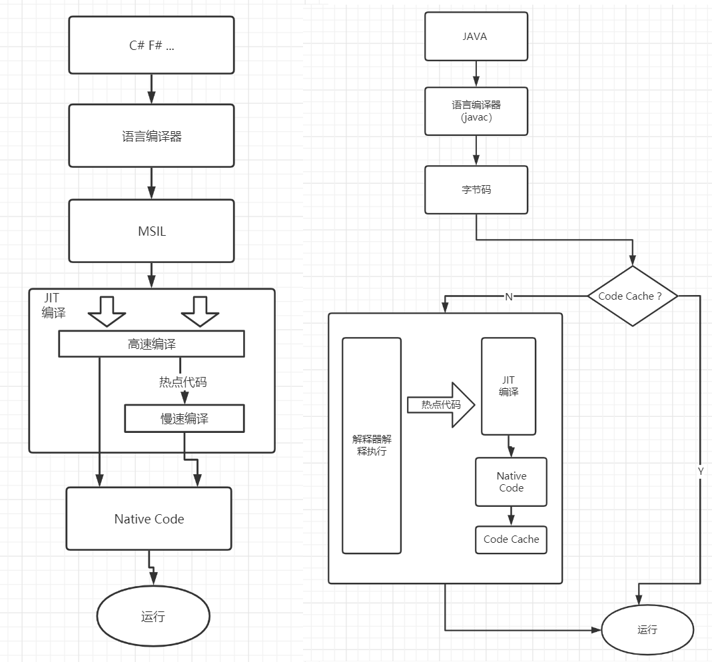

# Java vs. C#

## 多线程
[对比Java和.NET多线程编程](https://mp.weixin.qq.com/s/HesvRgE9IozUmh1xDGathw)

### 基本概念
多线程：很多开发语言都提供多线程编程支持，比如Java，C#。


- 并发（concurrent）：即使对于单核CPU，我们也会采用多线程等技术提高service的并发处理能力，我们经常说的高并发，就是这个意思。


- 并行（parallel）：多个计算机任务能够真正在同一时刻同时执行，狭义的讲，对同一台计算机，在单核CPU时代，理论上，这是不可能的；随着计算机得硬件得发展，多核CPU使得这个成为了可能。


- 异步（asynchronous programming）：异步编程可以基于多线程（语言层面提供的多线程），并不是一定要基于多线程，比如说nodejs，nodejs的异步编程其实是基于事件驱动和事件循环来实现的。


- 阻塞（blocking）/非阻塞（non-blocking）：这两个概念更多是出现在IO的场景，比如Blocking IO（BIO）和Non-blocking IO（NIO）；其实理解这两个概念，我们可以分别类比下面会提到的BlockingQueue和CompletionService。

### Java
在java中，多线程编程一般有两种方式：

- 使用最原生的API
- 使用concurrent包提供的API

1. 使用最原生的API

启动一个线程有两种方式：继承java.lang.Thread类和实现java.lang.Runnable接口。这两个类都是从java 1.0就开始有了。

线程之间同步主要是用synchronized关键字和java.lang.Object的wait()、notify()方法。


2. 使用concurrent包提供的API

其实，concurrent包提供很多功能，比如线程池相关类、阻塞队列、集合的线程安全实现等，具体可以参考concurent包的官方文档（https://docs.oracle.com/javase/8/docs/api/java/util/concurrent/package-summary.html）。


这里列举一些用过的concurrent包下API的典型例子：

1. 启动一个线程池，把要做的事情放到java.util.concurrent.Callable接口里面实现(Callable不同于Runnable接口的地方是，Callable可以有返回)，然后把Callable实现类提交给线程池管理，同时可以得到一个java.util.concurrent.Future，调用Future的get()方法可以获取Callable返回结果。
```java
ExecutorService threadPool = Executors.newFixedThreadPool(10);

List<Future<String>> futureList = new ArrayList<Future<String>>)();
for(int i = 0; i < 100; i++) {
  Future<String> future = threadPool.submit(new TaskCallable());
  futureList.add(future);
}

for(Future<String> future : futureList) {
  System.out.println(future.get());
}

threadPool.shutdown();
```
如果有100个Task要执行，可以使用java.util.concurrent.CountDownLatch类来等待所有Task都执行完才做下一步操作。


2. 上面示例代码中future.get()是一个阻塞动作，如果有100个Task，有可能后面的Task先执行完，这样对后面Task结果的处理就会一直pending在前面Task的future.get()调用上。concurrent包提供了另外一个API - CompletionService，可以解决这个问题。实例代码如下：
```java
ExecutorService threadPool = Executors.newFixedThreadPool(10);

CompletionService<String> completionService = new ExecutorCompletionService<String>(threadPool);

for(int i = 0; i < 100; i++) {
  Future<String> future = completionService.submit(new TaskCallable());
}

for(int i = 0; i < 100; i++) {
  String result = completionService.take().get();
  System.out.println(result);
}

threadPool.shutdown();
```
3. 控制两个线程执行顺序，一个线程等另外一个执行完之后才能继续执行，可以用java.util.concurrent.SynchronousQueue比较容易实现；而传统的做法则是采用wait/notify。其实SynchronousQueue实现了java.util.concurrent.BlockingQueue接口，这个接口还有一些其它的实现类，比如：java.util.concurrent.ArrayBlockingQueue，当我们需要实现一个典型的生产者消费者模型时，就可以直接使用这个类。


4. HashMap的线程安全实现java.util.concurrent.ConcurrentHashMap。关于ConcurrentHashMap的实现原理，可以参考这篇文章（漫画：什么是ConcurrentHashMap？）。


5. 还有一个经常用到的就是concurrent包下面的java.util.concurrent.locks.Lock接口，这个接口有一个实现类java.util.concurrent.locks.ReentrantLock，这是一个可重入锁的实现，和上面提到的synchronized关键字的作用一样。当然，使用Lock和synchronized关键字还是有一些区别的：比如Lock可以实现公平锁，synchronized则只能是非公平锁。


6. java.util.concurrent.atomic包下面提供的原子操作类，也经常用到。当我们要实现自增长功能时，可以使用java.util.concurrent.atomic.AtomicInteger类，这个类实现自增长原子操作的原理是CAS（Compare And Set）算法，而不是加锁的方式，所以在某些情况下可能会效率高一些。

### C# / .NET
对比Java里面的多线程编程实现方法，.NET里面基本上也都有对用的实现。

1) Java中的Thread类和Runnable接口；对应.NET里面就是System.Threading.Thread类和System.Threading.ThreadStart委托。


2) Java中线程同步主要用synchronized关键字；而.NET中则用lock关键字，但是lock关键字不能应用到方法上，如果要把同步加到方法上，可以用System.Runtime.Remoting.Context.Synchronization特性。


3) 除了上面提到的语言层面提供的关键字可以用于加锁，Java的concurrent包提供了Lock类；对应.NET就是System.Threading.Monitor类。


4) Java的concurrent包提供了一些原子操作的类，比如java.util.concurrent.atomic.AtomicInteger；对应.NET里面就是System.Threading.Interlocked。


5) Java的concurrent包提供了一些集合的线程安全实现，比如java.util.concurrent.ConcurrentHashMap；在.NET里面也是类似，.NET里面的System.Collections.Concurrent这个namespace下，也提供了很多集合的线程安全实现，比如System.Collections.Concurrent.ConcurrentDictionary。


6) .NET里面使用线程池实现多线程编程例子如下（See https://docs.microsoft.com/en-us/dotnet/api/system.threading.threadpool?view=netcore-3.1）：
```csharp
using System;
using System.Threading;

public class Example 
{
    public static void Main() 
    {
        // Queue the task.
        ThreadPool.QueueUserWorkItem(ThreadProc);
        Console.WriteLine("Main thread does some work, then sleeps.");
        Thread.Sleep(1000);

        Console.WriteLine("Main thread exits.");
    }
    // This thread procedure performs the task.
    static void ThreadProc(Object stateInfo) 
    {
        // No state object was passed to QueueUserWorkItem, so stateInfo is null.
        Console.WriteLine("Hello from the thread pool.");
    }
}
```
7) .net 4.0新增的TAP（task-based asynchronous pattern），不需要显示操作线程（CLR负责管理线程的分配），只需要关注Task，如下：
```csharp
using System;
using System.Threading;
using System.Threading.Tasks;

namespace ConsoleApp1
{
    class Program2
    {
        static void Main(string[] args)
        {
            Console.WriteLine("current thread: " + Thread.CurrentThread.ManagedThreadId);

            // Construct a started task using Task.Run.
            String taskData = "delta";
            Task t3 = Task.Run(() => {
                Console.WriteLine("Task={0}, obj={1}, Thread={2}", Task.CurrentId, taskData, Thread.CurrentThread.ManagedThreadId);
                Thread.Sleep(1000 * 10000);
            });
            // Wait for the task to finish.
            //t3.Wait();
            Task t2 = Task.Run(() => {
                Console.WriteLine("Task={0}, obj={1}, Thread={2}", Task.CurrentId, taskData, Thread.CurrentThread.ManagedThreadId);
            });
            // Wait for the task to finish.
            t2.Wait();

            Console.WriteLine("end");
        }
    }
}
```
在.net 4.5之后，又新增了async/await关键字，这种方式基于TAP，通过这种方式可以方便的实现Task完成之后的callback逻辑，比如上面例子中想在t3执行完了之后再做一些逻辑，需要调用t3.wait()，或者调用Task.WaitAll()方法。有async/await关键字之后，可以很方便的实现，如下：
```csharp
using System;
using System.Collections.Generic;
using System.Linq;
using System.Text;
using System.Threading;
using System.Threading.Tasks;

namespace ConsoleApp1
{
    class Program
    {
        static void Main(string[] args)
        {
            TestMain();
        }

        static void TestMain()
        {
            Console.Out.Write("Start\n");
            GetValueAsync();
            Console.Out.Write("End\n");
            Console.ReadKey();
        }
        
        static async Task GetValueAsync()
        {
            await Task.Run(()=>
            {
                Thread.Sleep(1000);
                for(int i = 0; i < 5; ++i)
                {
                    Console.Out.WriteLine(String.Format("From task : {0}", i));
                }
            });
            Console.Out.WriteLine("Task End");
        }
    }
}
```
上面Console.Out.WriteLine("Task End");这行代码即是Task执行完成之后才执行的逻辑。这个有点像javascript里面的Promise.


8) .net 4.0里面还提供了并行编程的一些功能，比如：System.Threading.Tasks.Parallel。所谓并行编程，狭义的讲，就是说可以充分利用现在计算机CPU多核的优势，让运算任务在多个核上同时并行执行。更多的，可以参考（https://docs.microsoft.com/en-us/dotnet/standard/parallel-programming/）。

#### 原子操作
修改状态要么成功且状态改变，要么失败且状态不变，并且外部只能观察到修改前或者修改后的状态，修改中途的状态不能被观察到

.NET 中，System.Threading.Interlocked 类提供了用于执行原子操作的函数，这些函数接收引用参数（ref），也就是变量的内存地址，然后针对该内存地址中的值执行原子操作

#### 无锁算法
不使用线程锁，通过修改操作的内容使它们满足原子操作的条件

.NET 提供了一些线程安全的数据类型，这些数据类型大量应用了无锁算法来提升访问速度（在部分情况下仍需要线程锁）：
```csharp
System.Collections.Consurrent.CurrentBag

System.Collections.Consurrent.CurrentDictionary<TKey, TValue>

System.Collections.Consurrent.CurrentQueue

System.Collections.Consurrent.CurrentStack
```
#### 线程锁
有获取锁（Acquire）和释放锁（Release）两个操作，在获取锁之后和释放锁之前进行的操作保证在同一个时间只有一个线程执行，操作内容无需改变，所以线程锁具有很强的通用性

线程锁有不同的种类，下面将分别介绍自旋锁，互斥锁，混合锁，读写锁

#### 自旋锁
自旋锁（Spinlock）是最简单的线程锁，基于原子操作实现

它使用一个数值来表示锁是否已经被获取，0表示未被获取，1表示已经获取

获取锁时会先使用原子操作设置数值为1，然后检查修改前的值是否为0，如果为0则代表获取成功，否则继续重试直到成功为止

释放锁时会设置数值为0，其他正在获取锁的线程会在下一次重试时成功获取

使用原子操作的原因是，它可以保证多个线程同时把数值0修改到1时，只有一个线程可以观察到修改前的值为0，其他线程观察到修改前的值为1

.NET 可以使用以下的类实现自旋锁：

System.Threading.Thread.SpinWait

System.Threading.SpinWait

System.Threading.SpinLock

使用自旋锁有个需要注意的问题，自旋锁保护的代码应该在非常短的时间内执行完毕，如果代码长时间运行则其他需要获取锁的线程会不断重试并占用逻辑核心，影响其他线程运行

此外，如果 CPU 只有一个逻辑核心，自旋锁在获取失败时应该立刻调用 Thread.Yield 函数提示操作系统切换到其他线程，因为一个逻辑核心同一时间只能运行一个线程，在切换线程之前其他线程没有机会运行，也就是切换线程之前自旋锁没有机会被释放

#### 互斥锁
由于自旋锁不适用于长时间运行，它的使用场景比较有限，更通用的线程锁是操作系统提供的基于原子操作与线程调度实现的互斥锁（Mutex）

与自旋锁一样，操作系统提供的互斥锁内部有一个数值表示是否已经被获取，不同的是当获取锁失败时，它不会反复重试，而是安排获取锁的线程进入等待状态，并把线程对象添加到锁关联的队列中，另一个线程释放锁时会检查队列中是否有线程对象，如果有则通知操作系统唤醒该线程

因为处于等待状态的线程没有运行，即使长时间不释放也不会消耗 CPU 资源，但让线程进入等待状态与从等待状态唤醒并调度运行可能会花费毫秒级的时间，与自旋锁重试所需的纳秒级时间相比非常的长

.NET 提供了 System.Threading.Mutex 类，这个类包装了操作系统提供的互斥锁，它是可重入的，已经获取锁的线程可以再次执行获取苏锁的操作，但释放锁的操作也要执行相同的次数，可重入的锁又叫递归锁（Recursive Lock）

递归锁内部使用一个计数器记录进入次数，同一个线程每获取一次就加1，释放一次就减1，减1后如果计数器变为0就执行真正的释放操作，一般用在嵌套调用的多个函数中

Mutex 类的另一个特点是支持跨进程使用，创建时通过构造函数的第二个参数可以传入名称

如果一个进程获取了锁，那么在释放该锁前的另一个进程获取同样名称的锁需要等待；如果进程获取了锁，但是在退出之前没有调用释放锁的方法，那么锁会被操作系统自动释放，其他当前正在等待锁（锁被自动释放前进入等待状态）的进程会收到 AbandonedMutexException 异常

跨进程锁通常用于保护多个进程共享的资源或者防止程序多重启动

#### 混合锁
互斥锁 Mutex 使用时必须创建改类型的实例，因为实例包含了非托管的互斥锁对象，开发者必须在不使用锁后尽快调用 Dispose 函数释放非托管资源，并且因为获取锁失败后会立刻安排线程进入等待，总体上性能比较低

.NET 提供了更通用而且更高性能的混合锁（Monitor），任何引用类型的对象都可以作为锁对象，不需要事先创建指定类型的实例，并且涉及的非托管资源由 .NET 运行时自动释放，不需要手动调用释放函数

获取和释放混合锁需要使用 System.Threading.Monitor 类中的函数

C# 提供了 lock 语句来简化通过 Monitor 类获取和释放的代码

混合锁的特征是在获取锁失败后像自旋锁一样重试一定的次数，超过一定次数之后（.NET Core 2.1 是30次）再安排当前进程进入等待状态

混合锁的好处是，如果第一次获取锁失败，但其他线程马上释放了锁，当前线程在下一轮重试可以获取成功，不需要执行毫秒级的线程调度处理；而如果其他线程在短时间内没有释放锁，线程会在超过重试次数之后进入等待状态，以避免消耗 CPU 资源，因此混合锁适用于大部分场景

#### 读写锁
读写锁（ReaderWriterLock）是一个具有特殊用途的线程锁，适用于频繁读取且读取需要一定时间的场景

共享资源的读取操作通常是可以同时执行的，而普通的互斥锁不管是读取还是修改操作都无法同时执行，如果多个线程为了读取操作而获取互斥锁，那么同一时间只有一个线程可以执行读取操作，在频繁读取的场景下会对吞吐量造成影响

读写锁分为读取锁和写入锁，线程可以根据对共享资源的操作类型选择获取读写锁还是写入锁，读取锁可以被多个线程同时获取，写入锁不可以被多个线程同时获取，而且读取锁和写入锁不可以被不同的线程同时获取

.NET 提供的 System.Threading.ReaderWriterLockSlim 类实现了读写锁，

读写锁也是一个混合锁（Hybird Lock）,在获取锁时通过自旋重试一定的次数再进入等待状态

此外，它还支持同一个线程先获取读写锁，然后再升级为写入锁，适用于“需要先获取读写锁，然后读取共享数据判断是否需要修改，需要修改时再获取写入锁”的场景


## 比较


-|Java | .NET
---|---|---
开发语言|java(Scalar etc.)|C#(VB,F# etc.)


## Code for Code Comparison
http://www.javacamp.org/javavscsharp
<table border="1" align="center">
<tbody><tr><td><a href="getStarted.html">Getting started</a></td>
<td><a href="keyword.html">Keywords</a></td>
<td><a href="types.html">Types</a></td>
<td><a href="access.html">Access Modifiers</a></td>
<td><a href="startup.html">Application Startup</a></td>
</tr><tr>
<td><a href="arraytype.html">Array type</a></td>
<td><a href="condition.html">Conditional Statements</a></td>
<td><a href="constructor.html">Constructor</a></td>
<td><a href="default.html">default Modifier</a></td>
<td><a href="documentation.html">Documentation</a></td>
</tr><tr>
<td><a href="eventhandler.html">Event Handler</a></td>
<td><a href="exception.html">Exception</a></td>
<td><a href="sealed.html">final vs. sealed</a></td>
<td><a href="string.html">String vs. string</a></td>
<td><a href="inheritance.html">Inheritance</a></td>
</tr><tr>
<td><a href="instance.html">Instance</a></td>
<td><a href="interface.html">Interface</a></td>
<td><a href="internal.html">internal Modifier</a></td>
<td><a href="keyword.html">Keywords</a></td>
<td><a href="library.html">Library &amp; Package</a></td>
</tr><tr>
<td><a href="loop.html">Loop Constructs</a></td>
<td><a href="method.html">Method Modifiers</a></td>
<td><a href="operators.html">Operators</a></td>
<td><a href="outparam.html">Out Parameters</a></td>
<td><a href="override.html">Overriding</a></td>
</tr><tr>
<td><a href="paramarray.html">Parameter Array</a></td>
<td><a href="prim2obj.html">Primitives vs Objects</a></td>
<td><a href="protected.html">protected Modifier</a></td>
<td><a href="refparam.html">Reference Parameters</a></td>
<td><a href="scope.html">Scope</a></td>
</tr><tr>
<td><a href="stack.html">Stack class</a></td>
<td><a href="static.html">Static Context</a></td>
<td><a href="struct.html">struct</a></td>
<td><a href="sync.html">synchronized vs lock</a></td>
<td><a href="trycatch.html">try/catch Statement</a></td>
</tr><tr>

<td><a href="typeexample.html">Type Example</a></td>
<td><a href="valuetypes.html">Value Type</a></td>
<td><a href="thread.html">Multiple Thread</a></td>
<td><a href="attribute.html">Attribute</a></td>
<td><a href="share.html">Shared Features</a></td>
</tr><tr>

<td><a href="readonly.html">readonly keyword</a></td>
<td><a href="protected.html">protected Modifier</a></td>
<td><a href="property.html">Properties</a></td>
<td><a href="poly.html">Polymorphism</a></td>
<td><a href="pointer.html">Pointer</a></td>
</tr><tr>

<td><a href="passbyvalue.html">Pass By Value vs. Pass By Reference</a></td>
<td><a href="ooloading.html">Operator Overloading</a></td>
<td><a href="objects.html">Objects</a></td>
<td><a href="new.html">new keyword</a></td>
<td><a href="namespace.html">namespace vs. package</a></td>
</tr><tr>

<td><a href="maxmin.html">Maximums and Minmums</a></td>
<td><a href="boxing.html">Boxing vs. Unboxing</a></td>
<td><a href="library.html">Library &amp; Package</a></td>
<td><a href="iniparent.html">Initialization of Parent Constructor</a></td>
<td><a href="indexer.html">Indexer</a></td>
</tr><tr>

<td><a href="foreach.html">foreach</a></td>
<td><a href="fieldmodifier.html">Field modifiers</a></td>
<td><a href="escapesqnce.html">Escape Sequences</a></td>
<td><a href="enum.html">enum</a></td>
<td><a href="event.html">event</a></td>
</tr><tr>

<td><a href="delegate.html">delegate</a></td>
<td><a href="string2num.html">Converting a string to a number</a></td>
<td><a href="readonly.html">const keyword</a></td>
<td><a href="comminter.html">Command-line Interactive</a></td>
<td><a href="classmodifiers.html">Class Modifiers</a></td>
</tr><tr>

<td></td>
<td></td>
<td></td>
<td></td>
<td></td>
</tr><tr>


</tr>
</tbody></table>


## Keywords & Reserved Words
http://www.javacamp.org/javavscsharp/keyword.html

<table align="center"><tbody><tr><td valign="top">
<p align="center"><table class="java" border="1">
<tbody><tr><th><font size="+1">Java</font></th></tr></tbody><tbody><tr><td width="100%"><pre> 
52
abstract     do         if           package      synchronized 
boolean      double     implements   private      this 
break        else       import       protected    throw 
byte         extends    instanceof   public       throws 
case         false      int          return       transient 
catch        final      interface    short        true 
char         finally    long         static       try 
class        float      native       strictfp     void 
const        for        new          super        volatile 
continue     goto       null         switch       while 
default      assert(1.4)             enum(1.5)


<hr>
C# doesn't have
assert       boolean    extends      final        implements
instanceof   native     package      strictfp     super
synchronized            throws       transient


</pre></td></tr></tbody></table>
</p></td><td valign="top">
<p align="center"><table class="csharp" border="1">
<tbody><tr><th><font size="+1">C#</font></th></tr></tbody><tbody><tr><td width="100%"><pre> 
77
abstract     as         base         bool         break
byte         case       catch        char         checked
class        const      continue     decimal      default
delegate     do         double       else         enum
event        explicit   extern       false        finally
fixed        float      for          foreach      goto
if           implicit   in           int          interface
internal     is         lock         long         namespace
new          null       object       operator     out
override     params     private      protected    public
readonly     ref        return       sbyte        sealed
short        sizeof     stackalloc   static       string
struct       switch     this         throw        true
try          typeof     uint         ulong        unchecked
unsafe       ushort     using        virtual      void
volatile     while
<hr>
Java doesn't have
as           base       bool         checked      decimal
delegate                event        explicit     extern
fixed        foreach    implicit     int          internal
is           lock       namespace    object       operator
out          override   params       readonly     ref
sbyte        sealed     sizeof       stackalloc   string
struct       typeof     uint         ulong        unchecked
unsafe       ushort     using        virtual
</pre></td></tr></tbody></table>
</p></td></tr>
</tbody></table>

## .NET 与 JAVA 在 JIT 编译上的一些差异
[关于 .NET 与 JAVA 在 JIT 编译上的一些差异](https://www.cnblogs.com/kklldog/p/net-java-jit-different.html)
