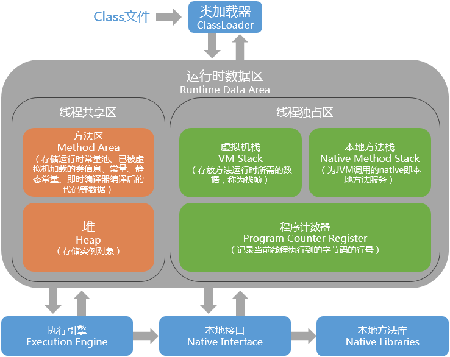
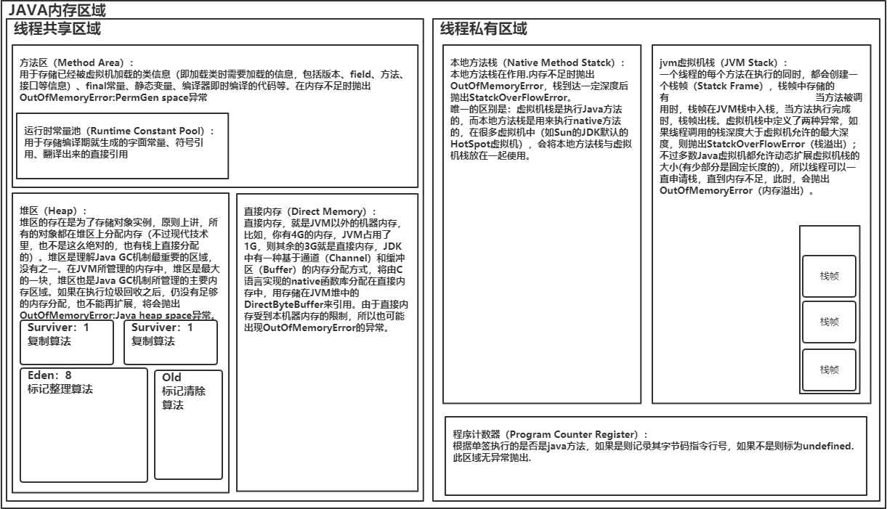
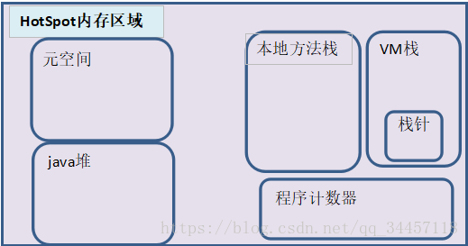
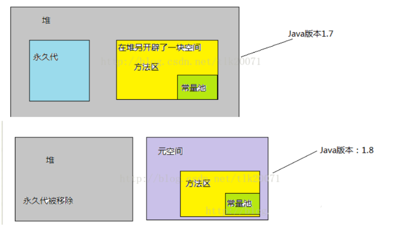
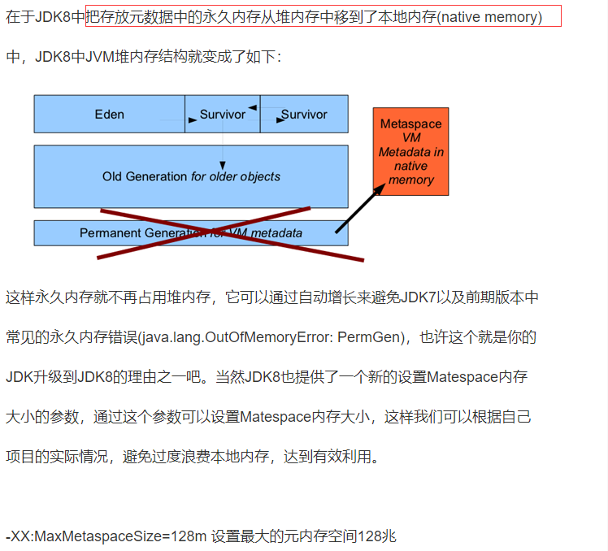

java:[参考](https://micrometer.io/docs/registry/prometheus)
micrometer
Contains built-in support for AppOptics, Azure Monitor, Netflix Atlas, CloudWatch, Datadog, Dynatrace, Elastic, Ganglia, Graphite, 
	Humio, Influx/Telegraf, JMX, KairosDB, New Relic, Prometheus, SignalFx, Google Stackdriver, StatsD, and Wavefront.
```xml
<dependency>
    <groupId>io.prometheus</groupId>
    <artifactId>simpleclient_hotspot</artifactId>
    <version>0.8.0</version>
</dependency>
<dependency>
    <groupId>io.micrometer</groupId>
    <artifactId>micrometer-core</artifactId>
    <version>1.3.0</version>
</dependency>
<dependency>
    <groupId>io.micrometer</groupId>
    <artifactId>micrometer-registry-prometheus</artifactId>
    <version>1.3.0</version>
</dependency>

```

```java
public static void main(String[] args) {
        run();
		SpringApplication.run(PrometheusDemoApplication.class, args);
	}
    public static void run() {
        PrometheusMeterRegistry prometheusRegistry = new PrometheusMeterRegistry(PrometheusConfig.DEFAULT);
        prometheusRegistry.config().commonTags("application", "MYAPPNAME");
        DefaultExports.register(prometheusRegistry.getPrometheusRegistry());
        try {
            HttpServer server = HttpServer.create(new InetSocketAddress(9999), 0);
            server.createContext("/metrics", httpExchange -> {
                String response = prometheusRegistry.scrape();
                httpExchange.sendResponseHeaders(200, response.getBytes().length);
                try (OutputStream os = httpExchange.getResponseBody()) {
                    os.write(response.getBytes());
                }
            });
            new Thread(server::start).start();
        } catch (IOException e) {
            throw new RuntimeException(e);
        }
    }
```
```
# HELP jvm_classes_loaded The number of classes that are currently loaded in the JVM
# TYPE jvm_classes_loaded gauge
jvm_classes_loaded 7060.0
# HELP jvm_classes_loaded_total The total number of classes that have been loaded since the JVM has started execution
# TYPE jvm_classes_loaded_total counter
jvm_classes_loaded_total 7062.0
# HELP jvm_classes_unloaded_total The total number of classes that have been unloaded since the JVM has started execution
# TYPE jvm_classes_unloaded_total counter
jvm_classes_unloaded_total 1.0
# HELP jvm_buffer_pool_used_bytes Used bytes of a given JVM buffer pool.
# TYPE jvm_buffer_pool_used_bytes gauge
jvm_buffer_pool_used_bytes{pool="direct",} 16384.0
jvm_buffer_pool_used_bytes{pool="mapped",} 0.0
# HELP jvm_buffer_pool_capacity_bytes Bytes capacity of a given JVM buffer pool.
# TYPE jvm_buffer_pool_capacity_bytes gauge
jvm_buffer_pool_capacity_bytes{pool="direct",} 16384.0
jvm_buffer_pool_capacity_bytes{pool="mapped",} 0.0
# HELP jvm_buffer_pool_used_buffers Used buffers of a given JVM buffer pool.
# TYPE jvm_buffer_pool_used_buffers gauge
jvm_buffer_pool_used_buffers{pool="direct",} 2.0
jvm_buffer_pool_used_buffers{pool="mapped",} 0.0
# HELP jvm_info JVM version info
# TYPE jvm_info gauge
jvm_info{version="1.8.0_191-b12",vendor="Oracle Corporation",runtime="Java(TM) SE Runtime Environment",} 1.0
# HELP jvm_memory_pool_allocated_bytes_total Total bytes allocated in a given JVM memory pool. Only updated after GC, not continuously.
# TYPE jvm_memory_pool_allocated_bytes_total counter
jvm_memory_pool_allocated_bytes_total{pool="Code Cache",} 5693312.0
jvm_memory_pool_allocated_bytes_total{pool="PS Eden Space",} 2.8277096E8
jvm_memory_pool_allocated_bytes_total{pool="PS Old Gen",} 6069168.0
jvm_memory_pool_allocated_bytes_total{pool="PS Survivor Space",} 2.8001656E7
jvm_memory_pool_allocated_bytes_total{pool="Compressed Class Space",} 3954024.0
jvm_memory_pool_allocated_bytes_total{pool="Metaspace",} 2.8883648E7
# HELP jvm_gc_collection_seconds Time spent in a given JVM garbage collector in seconds.
# TYPE jvm_gc_collection_seconds summary
jvm_gc_collection_seconds_count{gc="PS Scavenge",} 3.0
jvm_gc_collection_seconds_sum{gc="PS Scavenge",} 0.046
jvm_gc_collection_seconds_count{gc="PS MarkSweep",} 1.0
jvm_gc_collection_seconds_sum{gc="PS MarkSweep",} 0.033
# HELP jvm_threads_current Current thread count of a JVM
# TYPE jvm_threads_current gauge
jvm_threads_current 29.0
# HELP jvm_threads_daemon Daemon thread count of a JVM
# TYPE jvm_threads_daemon gauge
jvm_threads_daemon 24.0
# HELP jvm_threads_peak Peak thread count of a JVM
# TYPE jvm_threads_peak gauge
jvm_threads_peak 30.0
# HELP jvm_threads_started_total Started thread count of a JVM
# TYPE jvm_threads_started_total counter
jvm_threads_started_total 44.0
# HELP jvm_threads_deadlocked Cycles of JVM-threads that are in deadlock waiting to acquire object monitors or ownable synchronizers
# TYPE jvm_threads_deadlocked gauge
jvm_threads_deadlocked 0.0
# HELP jvm_threads_deadlocked_monitor Cycles of JVM-threads that are in deadlock waiting to acquire object monitors
# TYPE jvm_threads_deadlocked_monitor gauge
jvm_threads_deadlocked_monitor 0.0
# HELP jvm_threads_state Current count of threads by state
# TYPE jvm_threads_state gauge
jvm_threads_state{state="TIMED_WAITING",} 6.0
jvm_threads_state{state="TERMINATED",} 0.0
jvm_threads_state{state="WAITING",} 13.0
jvm_threads_state{state="RUNNABLE",} 10.0
jvm_threads_state{state="BLOCKED",} 0.0
jvm_threads_state{state="NEW",} 0.0
# HELP jvm_memory_bytes_used Used bytes of a given JVM memory area.
# TYPE jvm_memory_bytes_used gauge
jvm_memory_bytes_used{area="heap",} 9.5986592E7
jvm_memory_bytes_used{area="nonheap",} 4.5185904E7
# HELP jvm_memory_bytes_committed Committed (bytes) of a given JVM memory area.
# TYPE jvm_memory_bytes_committed gauge
jvm_memory_bytes_committed{area="heap",} 3.08281344E8
jvm_memory_bytes_committed{area="nonheap",} 4.8300032E7
# HELP jvm_memory_bytes_max Max (bytes) of a given JVM memory area.
# TYPE jvm_memory_bytes_max gauge
jvm_memory_bytes_max{area="heap",} 7.626293248E9
jvm_memory_bytes_max{area="nonheap",} -1.0
# HELP jvm_memory_bytes_init Initial bytes of a given JVM memory area.
# TYPE jvm_memory_bytes_init gauge
jvm_memory_bytes_init{area="heap",} 5.36870912E8
jvm_memory_bytes_init{area="nonheap",} 2555904.0
# HELP jvm_memory_pool_bytes_used Used bytes of a given JVM memory pool.
# TYPE jvm_memory_pool_bytes_used gauge
jvm_memory_pool_bytes_used{pool="Code Cache",} 6874560.0
jvm_memory_pool_bytes_used{pool="Metaspace",} 3.3592624E7
jvm_memory_pool_bytes_used{pool="Compressed Class Space",} 4718816.0
jvm_memory_pool_bytes_used{pool="PS Eden Space",} 7.6787608E7
jvm_memory_pool_bytes_used{pool="PS Survivor Space",} 1.3129816E7
jvm_memory_pool_bytes_used{pool="PS Old Gen",} 6069168.0
# HELP jvm_memory_pool_bytes_committed Committed bytes of a given JVM memory pool.
# TYPE jvm_memory_pool_bytes_committed gauge
jvm_memory_pool_bytes_committed{pool="Code Cache",} 6881280.0
jvm_memory_pool_bytes_committed{pool="Metaspace",} 3.6175872E7
jvm_memory_pool_bytes_committed{pool="Compressed Class Space",} 5242880.0
jvm_memory_pool_bytes_committed{pool="PS Eden Space",} 1.34742016E8
jvm_memory_pool_bytes_committed{pool="PS Survivor Space",} 2.2020096E7
jvm_memory_pool_bytes_committed{pool="PS Old Gen",} 1.51519232E8
# HELP jvm_memory_pool_bytes_max Max bytes of a given JVM memory pool.
# TYPE jvm_memory_pool_bytes_max gauge
jvm_memory_pool_bytes_max{pool="Code Cache",} 2.5165824E8
jvm_memory_pool_bytes_max{pool="Metaspace",} -1.0
jvm_memory_pool_bytes_max{pool="Compressed Class Space",} 1.073741824E9
jvm_memory_pool_bytes_max{pool="PS Eden Space",} 2.81542656E9
jvm_memory_pool_bytes_max{pool="PS Survivor Space",} 2.2020096E7
jvm_memory_pool_bytes_max{pool="PS Old Gen",} 5.71998208E9
# HELP jvm_memory_pool_bytes_init Initial bytes of a given JVM memory pool.
# TYPE jvm_memory_pool_bytes_init gauge
jvm_memory_pool_bytes_init{pool="Code Cache",} 2555904.0
jvm_memory_pool_bytes_init{pool="Metaspace",} 0.0
jvm_memory_pool_bytes_init{pool="Compressed Class Space",} 0.0
jvm_memory_pool_bytes_init{pool="PS Eden Space",} 1.34742016E8
jvm_memory_pool_bytes_init{pool="PS Survivor Space",} 2.2020096E7
jvm_memory_pool_bytes_init{pool="PS Old Gen",} 3.58088704E8
# HELP process_cpu_seconds_total Total user and system CPU time spent in seconds.
# TYPE process_cpu_seconds_total counter
process_cpu_seconds_total 4.171875
# HELP process_start_time_seconds Start time of the process since unix epoch in seconds.
# TYPE process_start_time_seconds gauge
process_start_time_seconds 1.572244584591E9
```


| java内置监控                          | 类型    | 标签                                                                                                                             | 说明                                                                                                                                  | 翻译                                                               |
|---------------------------------------|---------|----------------------------------------------------------------------------------------------------------------------------------|---------------------------------------------------------------------------------------------------------------------------------------|--------------------------------------------------------------------|
| jvm_classes_loaded                    | gauge   | 无                                                                                                                               | HELP jvm_classes_loaded The number of classes that are currently loaded in the JVM                                                    | JVM中当前加载的类数                                                |
| jvm_classes_loaded_total              | counter | 无                                                                                                                               | HELP jvm_classes_loaded_total The total number of classes that have been loaded since the JVM has started execution                   | 自JVM开始执行以来已加载的类总数                                    |
| jvm_classes_unloaded_total            | counter | 无                                                                                                                               | HELP jvm_classes_unloaded_total The total number of classes that have been unloaded since the JVM has started execution               | 自JVM开始执行以来已卸载的类总数                                    |
| jvm_buffer_pool_used_bytes            | gauge   | pool=direct,pool=mapped                                                                                                          | HELP jvm_buffer_pool_used_bytes Used bytes of a given JVM buffer pool.                                                                | 给定JVM缓冲池的已用字节。                                          |
| jvm_buffer_pool_capacity_bytes        | gauge   | pool=direct,pool=mapped                                                                                                          | HELP jvm_buffer_pool_capacity_bytes Bytes capacity of a given JVM buffer pool.                                                        | 给定JVM缓冲池的字节容量。                                          |
| jvm_buffer_pool_used_buffers          | gauge   | pool=direct,pool=mapped                                                                                                          | HELP jvm_buffer_pool_used_buffers Used buffers of a given JVM buffer pool.                                                            | 给定JVM缓冲池的已用缓冲区。                                        |
| jvm_info                              | gauge   | 无                                                                                                                               | HELP jvm_info JVM version info                                                                                                        | JVM版本信息                                                        |
| jvm_gc_collection_seconds             | summary | gc="PS Scavenge",gc="PS MarkSweep",                                                                                              | HELP jvm_gc_collection_seconds Time spent in a given JVM garbage collector in seconds.                                                | 在给定的JVM垃圾收集器中花费的时间（以秒为单位）。                  |
| jvm_threads_current                   | gauge   | 无                                                                                                                               | HELP jvm_threads_current Current thread count of a JVM                                                                                | JVM的当前线程数                                                    |
| jvm_threads_daemon                    | gauge   | 无                                                                                                                               | HELP jvm_threads_daemon Daemon thread count of a JVM                                                                                  | JVM的守护程序线程计数                                              |
| jvm_threads_peak                      | gauge   | 无                                                                                                                               | HELP jvm_threads_peak Peak thread count of a JVM                                                                                      | JVM的峰值线程数                                                    |
| jvm_threads_started_total             | counter | 无                                                                                                                               | HELP jvm_threads_started_total Started thread count of a JVM                                                                          | JVM的启动线程数                                                    |
| jvm_threads_deadlocked                | gauge   | 无                                                                                                                               | HELP jvm_threads_deadlocked Cycles of JVM-threads that are in deadlock waiting to acquire object monitors or ownable synchronizers    | 处于死锁状态的JVM线程周期正在等待获取对象监视器或可拥有的同步器    |
| jvm_threads_deadlocked_monitor        | gauge   | 无                                                                                                                               | HELP jvm_threads_deadlocked_monitor Cycles of JVM-threads that are in deadlock waiting to acquire object monitors                     | 处于死锁状态的JVM线程周期正在等待获取对象监视器                    |
| jvm_threads_state                     | gauge   | state="TIMED_WAITING",state="TERMINATED",state="WAITING",state="RUNNABLE",state="BLOCKED",state="NEW",                           | HELP jvm_threads_state Current count of threads by state                                                                              | 当前状态的线程数                                                   |
| jvm_memory_bytes_committed            | gauge   | area="heap",area="nonheap",                                                                                                      | HELP jvm_memory_bytes_committed Committed (bytes) of a given JVM memory area.                                                         | 给定的JVM内存区域的已提交（字节）。                                |
| jvm_memory_bytes_used                 | gauge   | area="heap",area="nonheap",                                                                                                      | HELP jvm_memory_bytes_used Used bytes of a given JVM memory area.                                                                     | 给定JVM内存区域的已用字节。                                        |
| jvm_memory_bytes_max                  | gauge   | area="heap",area="nonheap",                                                                                                      | HELP jvm_memory_bytes_max Max (bytes) of a given JVM memory area.                                                                     | 给定JVM内存区域的最大（字节）。                                    |
| jvm_memory_bytes_init                 | gauge   | area="heap",area="nonheap",                                                                                                      | HELP jvm_memory_bytes_init Initial bytes of a given JVM memory area.                                                                  | 给定JVM内存区域的初始字节。                                        |
| jvm_memory_pool_bytes_used            | gauge   | pool="Code Cache"pool="PS Eden Space",pool="PS Old Gen",pool="PS Survivor Space",pool="Compressed Class Space",pool="Metaspace", | HELP jvm_memory_pool_bytes_used Used bytes of a given JVM memory pool.                                                                | 给定JVM内存池的已使用字节。                                        |
| jvm_memory_pool_bytes_committed       | gauge   | pool="Code Cache"pool="PS Eden Space",pool="PS Old Gen",pool="PS Survivor Space",pool="Compressed Class Space",pool="Metaspace", | HELP jvm_memory_pool_bytes_committed Committed bytes of a given JVM memory pool.                                                      | 给定JVM内存池的已提交字节。                                        |
| jvm_memory_pool_bytes_max             | gauge   | pool="Code Cache"pool="PS Eden Space",pool="PS Old Gen",pool="PS Survivor Space",pool="Compressed Class Space",pool="Metaspace", | HELP jvm_memory_pool_bytes_max Max bytes of a given JVM memory pool.                                                                  | 给定JVM内存池的最大字节数。                                        |
| jvm_memory_pool_bytes_init            | gauge   | pool="Code Cache"pool="PS Eden Space",pool="PS Old Gen",pool="PS Survivor Space",pool="Compressed Class Space",pool="Metaspace", | HELP jvm_memory_pool_bytes_init Initial bytes of a given JVM memory pool.                                                             | 给定JVM内存池的初始字节。                                          |
| jvm_memory_pool_allocated_bytes_total | counter | pool="Code Cache"pool="PS Eden Space",pool="PS Old Gen",pool="PS Survivor Space",pool="Compressed Class Space",pool="Metaspace", | HELP jvm_memory_pool_allocated_bytes_total Total bytes allocated in a given JVM memory pool. Only updated after GC, not continuously. | 给定的JVM内存池中分配的总字节数。 仅在GC之后更新，而不是连续更新。 |
| process_cpu_seconds_total             | counter | 无                                                                                                                               | HELP process_cpu_seconds_total Total user and system CPU time spent in seconds.                                                       | 用户和系统的CPU总时间，以秒为单位。                                |
| process_start_time_seconds            | gauge   | 无                                                                                                                               | HELP process_start_time_seconds Start time of the process since unix epoch in seconds.                                                | 从Unix纪元开始的进程开始时间（以秒为单位）。                       |


use spring
```xml
<dependency>
    <groupId>org.springframework.boot</groupId>
    <artifactId>spring-boot-starter-actuator</artifactId>
</dependency>
<dependency>
    <groupId>io.micrometer</groupId>
    <artifactId>micrometer-registry-prometheus</artifactId>
    <version>1.3.0</version>
</dependency>


application.properties:
management.endpoints.web.exposure.include: prometheus

http://localhost:8080/actuator/prometheus
```
```
# HELP process_uptime_seconds The uptime of the Java virtual machine
# TYPE process_uptime_seconds gauge
process_uptime_seconds 12.336
# HELP jvm_threads_daemon_threads The current number of live daemon threads
# TYPE jvm_threads_daemon_threads gauge
jvm_threads_daemon_threads 23.0
# HELP tomcat_sessions_active_max_sessions  
# TYPE tomcat_sessions_active_max_sessions gauge
tomcat_sessions_active_max_sessions 0.0
# HELP jvm_memory_committed_bytes The amount of memory in bytes that is committed for the Java virtual machine to use
# TYPE jvm_memory_committed_bytes gauge
jvm_memory_committed_bytes{area="heap",id="PS Survivor Space",} 2.2020096E7
jvm_memory_committed_bytes{area="heap",id="PS Old Gen",} 2.3068672E8
jvm_memory_committed_bytes{area="heap",id="PS Eden Space",} 2.69484032E8
jvm_memory_committed_bytes{area="nonheap",id="Metaspace",} 3.735552E7
jvm_memory_committed_bytes{area="nonheap",id="Code Cache",} 6750208.0
jvm_memory_committed_bytes{area="nonheap",id="Compressed Class Space",} 5373952.0
# HELP system_cpu_usage The "recent cpu usage" for the whole system
# TYPE system_cpu_usage gauge
system_cpu_usage 0.0
# HELP logback_events_total Number of error level events that made it to the logs
# TYPE logback_events_total counter
logback_events_total{level="warn",} 0.0
logback_events_total{level="debug",} 0.0
logback_events_total{level="error",} 0.0
logback_events_total{level="trace",} 0.0
logback_events_total{level="info",} 7.0
# HELP system_cpu_count The number of processors available to the Java virtual machine
# TYPE system_cpu_count gauge
system_cpu_count 4.0
# HELP jvm_gc_pause_seconds Time spent in GC pause
# TYPE jvm_gc_pause_seconds summary
jvm_gc_pause_seconds_count{action="end of major GC",cause="Metadata GC Threshold",} 1.0
jvm_gc_pause_seconds_sum{action="end of major GC",cause="Metadata GC Threshold",} 0.065
jvm_gc_pause_seconds_count{action="end of minor GC",cause="Metadata GC Threshold",} 1.0
jvm_gc_pause_seconds_sum{action="end of minor GC",cause="Metadata GC Threshold",} 0.016
# HELP jvm_gc_pause_seconds_max Time spent in GC pause
# TYPE jvm_gc_pause_seconds_max gauge
jvm_gc_pause_seconds_max{action="end of major GC",cause="Metadata GC Threshold",} 0.065
jvm_gc_pause_seconds_max{action="end of minor GC",cause="Metadata GC Threshold",} 0.016
# HELP jvm_memory_max_bytes The maximum amount of memory in bytes that can be used for memory management
# TYPE jvm_memory_max_bytes gauge
jvm_memory_max_bytes{area="heap",id="PS Survivor Space",} 2.2020096E7
jvm_memory_max_bytes{area="heap",id="PS Old Gen",} 5.71998208E9
jvm_memory_max_bytes{area="heap",id="PS Eden Space",} 2.81542656E9
jvm_memory_max_bytes{area="nonheap",id="Metaspace",} -1.0
jvm_memory_max_bytes{area="nonheap",id="Code Cache",} 2.5165824E8
jvm_memory_max_bytes{area="nonheap",id="Compressed Class Space",} 1.073741824E9
# HELP jvm_buffer_memory_used_bytes An estimate of the memory that the Java virtual machine is using for this buffer pool
# TYPE jvm_buffer_memory_used_bytes gauge
jvm_buffer_memory_used_bytes{id="direct",} 8192.0
jvm_buffer_memory_used_bytes{id="mapped",} 0.0
# HELP tomcat_sessions_created_sessions_total  
# TYPE tomcat_sessions_created_sessions_total counter
tomcat_sessions_created_sessions_total 0.0
# HELP jvm_threads_peak_threads The peak live thread count since the Java virtual machine started or peak was reset
# TYPE jvm_threads_peak_threads gauge
jvm_threads_peak_threads 28.0
# HELP tomcat_sessions_rejected_sessions_total  
# TYPE tomcat_sessions_rejected_sessions_total counter
tomcat_sessions_rejected_sessions_total 0.0
# HELP jvm_threads_states_threads The current number of threads having NEW state
# TYPE jvm_threads_states_threads gauge
jvm_threads_states_threads{state="runnable",} 10.0
jvm_threads_states_threads{state="blocked",} 0.0
jvm_threads_states_threads{state="waiting",} 12.0
jvm_threads_states_threads{state="timed-waiting",} 5.0
jvm_threads_states_threads{state="new",} 0.0
jvm_threads_states_threads{state="terminated",} 0.0
# HELP tomcat_sessions_active_current_sessions  
# TYPE tomcat_sessions_active_current_sessions gauge
tomcat_sessions_active_current_sessions 0.0
# HELP jvm_gc_memory_promoted_bytes_total Count of positive increases in the size of the old generation memory pool before GC to after GC
# TYPE jvm_gc_memory_promoted_bytes_total counter
jvm_gc_memory_promoted_bytes_total 1.6954808E7
# HELP tomcat_sessions_alive_max_seconds  
# TYPE tomcat_sessions_alive_max_seconds gauge
tomcat_sessions_alive_max_seconds 0.0
# HELP tomcat_sessions_expired_sessions_total  
# TYPE tomcat_sessions_expired_sessions_total counter
tomcat_sessions_expired_sessions_total 0.0
# HELP jvm_buffer_count_buffers An estimate of the number of buffers in the pool
# TYPE jvm_buffer_count_buffers gauge
jvm_buffer_count_buffers{id="direct",} 1.0
jvm_buffer_count_buffers{id="mapped",} 0.0
# HELP jvm_classes_loaded_classes The number of classes that are currently loaded in the Java virtual machine
# TYPE jvm_classes_loaded_classes gauge
jvm_classes_loaded_classes 7209.0
# HELP jvm_buffer_total_capacity_bytes An estimate of the total capacity of the buffers in this pool
# TYPE jvm_buffer_total_capacity_bytes gauge
jvm_buffer_total_capacity_bytes{id="direct",} 8192.0
jvm_buffer_total_capacity_bytes{id="mapped",} 0.0
# HELP jvm_classes_unloaded_classes_total The total number of classes unloaded since the Java virtual machine has started execution
# TYPE jvm_classes_unloaded_classes_total counter
jvm_classes_unloaded_classes_total 1.0
# HELP jvm_gc_live_data_size_bytes Size of old generation memory pool after a full GC
# TYPE jvm_gc_live_data_size_bytes gauge
jvm_gc_live_data_size_bytes 2.3066736E7
# HELP process_cpu_usage The "recent cpu usage" for the Java Virtual Machine process
# TYPE process_cpu_usage gauge
process_cpu_usage 0.1777693333394012
# HELP jvm_memory_used_bytes The amount of used memory
# TYPE jvm_memory_used_bytes gauge
jvm_memory_used_bytes{area="heap",id="PS Survivor Space",} 0.0
jvm_memory_used_bytes{area="heap",id="PS Old Gen",} 2.3066736E7
jvm_memory_used_bytes{area="heap",id="PS Eden Space",} 1.279644E7
jvm_memory_used_bytes{area="nonheap",id="Metaspace",} 3.4642432E7
jvm_memory_used_bytes{area="nonheap",id="Code Cache",} 6743040.0
jvm_memory_used_bytes{area="nonheap",id="Compressed Class Space",} 4847800.0
# HELP process_start_time_seconds Start time of the process since unix epoch.
# TYPE process_start_time_seconds gauge
process_start_time_seconds 1.572237633844E9
# HELP jvm_gc_max_data_size_bytes Max size of old generation memory pool
# TYPE jvm_gc_max_data_size_bytes gauge
jvm_gc_max_data_size_bytes 5.71998208E9
# HELP jvm_gc_memory_allocated_bytes_total Incremented for an increase in the size of the young generation memory pool after one GC to before the next
# TYPE jvm_gc_memory_allocated_bytes_total counter
jvm_gc_memory_allocated_bytes_total 2.21006848E8
# HELP jvm_threads_live_threads The current number of live threads including both daemon and non-daemon threads
# TYPE jvm_threads_live_threads gauge
jvm_threads_live_threads 27.0
```

| stpring actuator自带很多组件的监控      | 类型    | label                                                                                                                                                                                                  | 说明                                                                                                                                                 | 翻译                                                 |
|-----------------------------------------|---------|--------------------------------------------------------------------------------------------------------------------------------------------------------------------------------------------------------|------------------------------------------------------------------------------------------------------------------------------------------------------|------------------------------------------------------|
| logback_events_total                    | counter | level="warn",debug,error,trace,info                                                                                                                                                                    | HELP logback_events_total Number of error level events that made it to the logs                                                                      | 进入日志的错误级别事件数                             |
| tomcat_sessions_created_sessions_total  | counter | 无                                                                                                                                                                                                     | 无                                                                                                                                                   | 无                                                   |
| tomcat_sessions_rejected_sessions_total | counter | 无                                                                                                                                                                                                     | 无                                                                                                                                                   | 无                                                   |
| tomcat_sessions_expired_sessions_total  | counter | 无                                                                                                                                                                                                     | 无                                                                                                                                                   | 无                                                   |
| tomcat_sessions_active_current_sessions | gauge   | 无                                                                                                                                                                                                     | 无                                                                                                                                                   | 无                                                   |
| tomcat_sessions_alive_max_seconds       | gauge   | 无                                                                                                                                                                                                     | 无                                                                                                                                                   | 无                                                   |
| tomcat_sessions_active_max_sessions     | gauge   | 无                                                                                                                                                                                                     | 无                                                                                                                                                   | 无                                                   |
| system_cpu_usage                        | gauge   | 无                                                                                                                                                                                                     | HELP system_cpu_usage The "recent cpu usage" for the whole system                                                                                    | 整个系统的“最近的cpu使用”                            |
| system_cpu_count                        | gauge   | 无                                                                                                                                                                                                     | HELP system_cpu_count The number of processors available to the Java virtual machine                                                                 | Java虚拟机可用的处理器数量                           |
| jvm_gc_pause_seconds                    | summary | action="end of major GC",cause="Metadata GC Threshold",action="end of minor GC",cause="Metadata GC Threshold",                                                                                         | HELP jvm_gc_pause_seconds Time spent in GC pause                                                                                                     | GC暂停所花费的时间                                   |
| jvm_gc_pause_seconds_max                | gauge   | action="end of major GC",cause="Metadata GC Threshold",action="end of minor GC",cause="Metadata GC Threshold",                                                                                         | HELP jvm_gc_pause_seconds_max Time spent in GC pause                                                                                                 | GC暂停所花费的时间                                   |
| jvm_memory_max_bytes                    | gauge   | area="heap",id="PS Survivor Space",area="heap",id="PS Old Gen",area="heap",id="PS Eden Space",area="nonheap",id="Metaspace",area="nonheap",id="Code Cache",area="nonheap",id="Compressed Class Space", | HELP jvm_memory_max_bytes The maximum amount of memory in bytes that can be used for memory management                                               | 可用于内存管理的最大内存量（以字节为单位）           |
| jvm_memory_used_bytes                   | gauge   | area="heap",id="PS Survivor Space",area="heap",id="PS Old Gen",area="heap",id="PS Eden Space",area="nonheap",id="Metaspace",area="nonheap",id="Code Cache",area="nonheap",id="Compressed Class Space", | HELP jvm_memory_used_bytes The amount of used memory                                                                                                 | 已用内存量                                           |
| jvm_memory_committed_bytes              | gauge   | area="heap",id="PS Survivor Space",area="heap",id="PS Old Gen",area="heap",id="PS Eden Space",area="nonheap",id="Metaspace",area="nonheap",id="Code Cache",area="nonheap",id="Compressed Class Space", | HELP jvm_memory_committed_bytes The amount of memory in bytes that is committed for the Java virtual machine to use                                  | 可供Java虚拟机使用的已提交的内存量（以字节为单位）   |
| jvm_threads_daemon_threads              | gauge   |                                                                                                                                                                                                        | HELP jvm_threads_daemon_threads The current number of live daemon threads                                                                            | 当前活动的守护程序线程数                             |
| jvm_threads_peak_threads                | gauge   |                                                                                                                                                                                                        | HELP jvm_threads_peak_threads The peak live thread count since the Java virtual machine started or peak was reset                                    | 自Java虚拟机启动或重置峰值以来的活动线程峰值         |
| jvm_threads_live_threads                | gauge   |                                                                                                                                                                                                        | HELP jvm_threads_live_threads The current number of live threads including both daemon and non-daemon threads                                        | 当前活动线程数，包括守护程序线程和非守护程序线程     |
| jvm_threads_states_threads              | gauge   | state="runnable",state="blocked",state="waiting",state="timed-waiting",state="new",state="terminated",                                                                                                 | HELP jvm_threads_states_threads The current number of threads having NEW state                                                                       | 当前处于NEW状态的线程数                              |
| jvm_classes_loaded_classes              | gauge   |                                                                                                                                                                                                        | HELP jvm_classes_loaded_classes The number of classes that are currently loaded in the Java virtual machine                                          | Java虚拟机中当前加载的类数                           |
| jvm_classes_unloaded_classes_total      | counter |                                                                                                                                                                                                        | HELP jvm_classes_unloaded_classes_total The total number of classes unloaded since the Java virtual machine has started execution                    | 自Java虚拟机开始执行以来已卸载的类总数               |
| jvm_gc_memory_promoted_bytes_total      | counter |                                                                                                                                                                                                        | HELP jvm_gc_memory_promoted_bytes_total Count of positive increases in the size of the old generation memory pool before GC to after GC              | GC之前到GC之后，旧代内存池的大小正增加的计数         |
| jvm_gc_memory_allocated_bytes_total     | counter |                                                                                                                                                                                                        | HELP jvm_gc_memory_allocated_bytes_total Incremented for an increase in the size of the young generation memory pool after one GC to before the next | 从一个GC之后到下一个GC之前，增加了年轻代内存池的大小 |
| jvm_gc_max_data_size_bytes              | gauge   |                                                                                                                                                                                                        | HELP jvm_gc_max_data_size_bytes Max size of old generation memory pool                                                                               | 上一代内存池的最大大小                               |
| jvm_gc_live_data_size_bytes             | gauge   |                                                                                                                                                                                                        | HELP jvm_gc_live_data_size_bytes Size of old generation memory pool after a full GC                                                                  | 完整GC后旧代内存池的大小                             |
| jvm_buffer_total_capacity_bytes         | gauge   | id="direct",id="mapped",                                                                                                                                                                               | HELP jvm_buffer_total_capacity_bytes An estimate of the total capacity of the buffers in this pool                                                   | 对该池中缓冲区总容量的估计                           |
| jvm_buffer_count_buffers                | gauge   | id="direct",id="mapped",                                                                                                                                                                               | HELP jvm_buffer_count_buffers An estimate of the number of buffers in the pool                                                                       | 池中缓冲区数量的估计                                 |
| jvm_buffer_memory_used_bytes            | gauge   | id="direct",id="mapped",                                                                                                                                                                               | HELP jvm_buffer_memory_used_bytes An estimate of the memory that the Java virtual machine is using for this buffer pool                              | Java虚拟机为此缓冲池使用的内存的估计值               |
| process_cpu_usage                       | gauge   |                                                                                                                                                                                                        | HELP process_cpu_usage The "recent cpu usage" for the Java Virtual Machine process                                                                   | Java虚拟机进程的“最近的cpu使用”                      |
| process_start_time_seconds              | gauge   |                                                                                                                                                                                                        | HELP process_start_time_seconds Start time of the process since unix epoch.                                                                          | 从Unix时代开始的进程开始时间。                       |
| process_uptime_seconds                  | gauge   |                                                                                                                                                                                                        | HELP process_uptime_seconds The uptime of the Java virtual machine                                                                                   | Java虚拟机的正常运行时间                             |
# 说明：gc="PS Scavenge",gc="PS MarkSweep",
```
Parallel Old 收集器
这里注意，Parallel Scavage 收集器架构中本身有PS MarkSweep收集器来收集老年代，并非直接使用了Serial Old,但二者接近。本人win10 64位系统，jdk1.8.0_102，测试默认垃圾收集器为：PS MarkSweep 和 PS Scavenge。 也就是说Java8的默认并不是G1。

这是”吞吐量优先“，注重吞吐量以及CPU资源敏感的场合都可以优先考虑Parallel Scavenge和Parallel Old(PS Mark Sweep)。Java8 默认就是这个。

年轻态几种垃圾收集方式：

Serial (复制) 是一种stop-the-world(导致应用全部暂停，僵死一会儿), 使用单个GC线程进行复制收集

将幸存对象从 Eden复制到幸存 Survivor空间，并且在幸存Survivor空间之间复制，直到它决定这些对象已经足够长了，在某个点一次性将它们复制到旧生代old generation.

Parallel Scavenge (PS Scavenge)是一种stop-the-world, 使用多个GC线程实现复制收集。如同上面复制收集一样，但是它是并行使用多个线程。

ParNew是一种stop-the-world, 使用多个GC线程实现的复制收集，区别于"Parallel Scavenge"在于它与CMS可搭配使用，它也是并行使用多个线程，内部有一个回调功能允许旧生代操作它收集的对象。

 

旧生代几种垃圾收集方式：

Serial Old (MarkSweepCompact) 是一种stop-the-world, 使用单个线程进行mark-sweep-compact(标志-清扫-压缩) 收集。

Parallel Old (PS MarkSweep) 是一种使用多个GC线程压缩收集。

ConcurrentMarkSweep (CMS) 是最并行，低暂停的收集器。垃圾回收算法在后台不会暂停应用线程情况下实现大部分垃圾回收工作。

G1 使用 'Garbage First' 算法将堆空间划分为许多小空间。是一种跨年轻态和旧生代的回收。Java 7以后支持。
```
# 说明：[What does "mapped buffer pool" and "direct buffer pool" mean?](https://stackoverflow.com/questions/15657837/what-is-mapped-buffer-pool-direct-buffer-pool-and-how-to-increase-their-size)

```
Direct Buffer

A direct buffer is a chunk of memory typically used to interface Java to the OS I/O subsystems, for example as a place where the OS writes data as it receives it from a socket or disk, and from which Java can read directly.

Sharing the buffer with the OS is much more efficient than the original approach of copying data from the OS into Java's memory model, which then makes the data subject to Garbage Collection and inefficiencies such as the re-copying of data as it migrates from eden -> survivor -> tenured -> to the permanent generation.

In the screenshot you have just one buffer of 16KB of direct buffer. Java will grow this pool as required so the fact the blue area is at the top of the block is merely a statement that all buffer memory allocated so far is in use. I don't see this as an issue.

Mapped buffer pool

The mapped buffer pool is all the memory used by Java for its FileChannel instances.

Each FileChannel instance has a buffer shared with the OS (similar to the direct buffer with all the efficiency benefits). The memory is essentially an in-RAM window onto a portion of the file. Depending on the mode (read, write or both), Java can either read and/or modify the file's contents directly and the OS can directly supply data to or flush modified data to disk.

Additional advantages of this approach is that the OS can flush this buffer directly to the disk as it sees fit, such as when the OS is shutting down, and the OS can lock that portion of the file from other processes on the computer.

The screenshot indicates you have about 680MB in use by 12 FileChannel objects. Again, Java will grow this is Scala needs more (and the JVM can get additional memory from the OS), so the fact that all 680MB is all in use is not important. Given their size, it certainly seems to me that the program has already been optimized to use these buffers effectively.

Increasing the size of the mapped buffer pool

Java allocates memory outside the Garbage Collection space for the FileChannel buffers. This means the normal heap size parameters such as -Xmx are not important here

The size of the buffer in a FileChannel is set with the map method. Changing this would entail changing your Scala program

Once the buffer has reached a threshold size, of the order 10s-100s of KB, increasing FileChannel buffer size may or may not increase performance - it depends on how the program uses the buffer:

No: If the file is read precisely once from end to end: Almost all the time is either waiting for the disk or the processing algorithm
Maybe: If, however, the algorithm frequently scans the file revisiting portions many times, increasing the size might improve performance:
If modifying or writing the file, a larger buffer can consolidate more writes into a single flush.
If reading the file, the operating system will likely have already cached the file (the disk cache) and so any gains are likely marginal. Perversely increasing the size of the JVM might decrease performance by shrinking the effective disk cache size
In any case the application would have to be specifically coded to get any benefits, for example by implementing its own logical record pointer onto the cache.
Try profiling the application and look for I/O waits (Jprofiler and YourKit are good at this). It may be that file I/O is not actually a problem - don't be a victim of premature optimization. If I/O waits are a significant portion of the total elapsed time, then it might be worth trying out a larger buffer size

Further information

https://blogs.oracle.com/alanb/entry/monitoring_direct_buffers

Also be aware that there is a bug reported on the JVM saying that FileChannel is not good at releasing memory. It's detailed in Prevent OutOfMemory when using java.nio.MappedByteBuffer
```

# 说明 heap nonheap
JVM区域总体分两类，heap区和非heap区，

其中heap区又分为：Eden Space（伊甸园）、SurvivorSpace(幸存者区)、Tenured Gen（老年代-养老区）Perm Gen（永久代）。GC(gabage collection)

非heap区又分：Code Cache(代码缓存区)、Perm Gen（永久代）、Jvm Stack(java虚拟机栈)、Local Method Statck(本地方法栈)。--在java栈中会涉及。

# 说明 Minor GC和Major GC

发生在新生代的垃圾回收成为Minor GC，Minor GC又称为新生代GC，因为新生代对象大多都具备朝生夕灭的特性，因此Minor GC(采用复制算法)非常频繁，一般回收速度也比较快。

发生在老年代的GC称为Full GC，又称为Major GC，其经常会伴随至少一次的Minor GC(并非绝对，在Parallel Scavenge收集器中就有直接进行Full GC的策略选择过程)。Major GC的速度一般会比Minor GC慢10倍以上。








# go
| go内置监控                                 | 类型    | 标签 | 说明                                                                                                                         | 翻译                                            |
|--------------------------------------------|---------|------|------------------------------------------------------------------------------------------------------------------------------|-------------------------------------------------|
| go_gc_duration_seconds                     | summary | 无   | HELP go_gc_duration_seconds A summary of the GC invocation durations.                                                        | GC持续时间                                      |
| go_goroutines                              | gauge   | 无   | HELP go_goroutines Number of goroutines that currently exist.                                                                | 当前goroutine数量                               |
| go_threads                                 | gauge   | 无   | HELP go_threads Number of OS threads created.                                                                                | 当前线程数量                                    |
| go_info                                    | gauge   | 无   | HELP go_info Information about the Go environment.                                                                           | go信息                                          |
| go_memstats_alloc_bytes                    | gauge   | 无   | HELP go_memstats_alloc_bytes Number of bytes allocated and still in use.                                                     | 分配并仍在使用的字节数。                        |
| go_memstats_alloc_bytes_total              | counter | 无   | HELP go_memstats_alloc_bytes_total Total number of bytes allocated, even if freed.                                           | 已分配的总字节数，即使已释放。                  |
| go_memstats_buck_hash_sys_bytes            | gauge   | 无   | HELP go_memstats_buck_hash_sys_bytes Number of bytes used by the profiling bucket hash table.                                | 分析存储区哈希表使用的字节数。                  |
| go_memstats_frees_total                    | counter | 无   | HELP go_memstats_frees_total Total number of frees.                                                                          | 空闲的总数                                      |
| go_memstats_gc_cpu_fraction                | gauge   | 无   | HELP go_memstats_gc_cpu_fraction The fraction of this program's available CPU time used by the GC since the program started. | 自程序启动以来，GC使用的程序可用CPU时间的比例。 |
| go_memstats_gc_sys_bytes                   | gauge   | 无   | HELP go_memstats_gc_sys_bytes Number of bytes used for garbage collection system metadata.                                   | 用于垃圾回收系统元数据的字节数。                |
| go_memstats_heap_alloc_bytes               | gauge   | 无   | HELP go_memstats_heap_alloc_bytes Number of heap bytes allocated and still in use.                                           | 已分配且仍在使用的堆字节数。                    |
| go_memstats_heap_idle_bytes                | gauge   | 无   | HELP go_memstats_heap_idle_bytes Number of heap bytes waiting to be used.                                                    | 等待使用的堆字节数。                            |
| go_memstats_heap_inuse_bytes               | gauge   | 无   | HELP go_memstats_heap_inuse_bytes Number of heap bytes that are in use.                                                      | 正在使用的堆字节数。                            |
| go_memstats_heap_objects                   | gauge   | 无   | HELP go_memstats_heap_objects Number of allocated objects.                                                                   | 分配的对象数。                                  |
| go_memstats_heap_released_bytes            | gauge   | 无   | HELP go_memstats_heap_released_bytes Number of heap bytes released to OS.                                                    | 释放到操作系统的堆字节数。                      |
| go_memstats_heap_sys_bytes                 | gauge   | 无   | HELP go_memstats_heap_sys_bytes Number of heap bytes obtained from system.                                                   | 从系统获取的堆字节数。                          |
| go_memstats_last_gc_time_seconds           | gauge   | 无   | HELP go_memstats_last_gc_time_seconds Number of seconds since 1970 of last garbage collection.                               | 自上次垃圾收集1970年以来的秒数。                |
| go_memstats_lookups_total                  | counter | 无   | HELP go_memstats_lookups_total Total number of pointer lookups.                                                              | 指针查找总数。                                  |
| go_memstats_mallocs_total                  | counter | 无   | HELP go_memstats_mallocs_total Total number of mallocs.                                                                      | malloc的总数。                                  |
| go_memstats_mcache_inuse_bytes             | gauge   | 无   | HELP go_memstats_mcache_inuse_bytes Number of bytes in use by mcache structures.                                             | mcache结构正在使用的字节数。                    |
| go_memstats_mcache_sys_bytes               | gauge   | 无   | HELP go_memstats_mcache_sys_bytes Number of bytes used for mcache structures obtained from system.                           | 从系统获取的用于mcache结构的字节数。            |
| go_memstats_mspan_inuse_bytes              | gauge   | 无   | HELP go_memstats_mspan_inuse_bytes Number of bytes in use by mspan structures.                                               | mspan结构使用的字节数。                         |
| go_memstats_mspan_sys_bytes                | gauge   | 无   | HELP go_memstats_mspan_sys_bytes Number of bytes used for mspan structures obtained from system.                             | 从系统获取的用于mspan结构的字节数。             |
| go_memstats_next_gc_bytes                  | gauge   | 无   | HELP go_memstats_next_gc_bytes Number of heap bytes when next garbage collection will take place.                            | 下次进行垃圾回收时的堆字节数。                  |
| go_memstats_other_sys_bytes                | gauge   | 无   | HELP go_memstats_other_sys_bytes Number of bytes used for other system allocations.                                          | 用于其他系统分配的字节数。                      |
| go_memstats_stack_inuse_bytes              | gauge   | 无   | HELP go_memstats_stack_inuse_bytes Number of bytes in use by the stack allocator.                                            | 堆栈分配器正在使用的字节数。                    |
| go_memstats_stack_sys_bytes                | gauge   | 无   | HELP go_memstats_stack_sys_bytes Number of bytes obtained from system for stack allocator.                                   | 从系统获得的用于堆栈分配器的字节数。            |
| go_memstats_sys_bytes                      | gauge   | 无   | HELP go_memstats_sys_bytes Number of bytes obtained from system.                                                             | 从系统获得的字节数。                            |
| process_cpu_seconds_total                  | counter | 无   | HELP process_cpu_seconds_total Total user and system CPU time spent in seconds.                                              | 用户和系统的CPU总时间，以秒为单位。             |
| process_max_fds                            | gauge   | 无   | HELP process_max_fds Maximum number of open file descriptors.                                                                | 打开文件描述符的最大数量。                      |
| process_open_fds                           | gauge   | 无   | HELP process_open_fds Number of open file descriptors.                                                                       | 打开文件描述符的数量。                          |
| process_resident_memory_bytes              | gauge   | 无   | HELP process_resident_memory_bytes Resident memory size in bytes.                                                            | 驻留内存大小（以字节为单位）。                  |
| process_start_time_seconds                 | gauge   | 无   | HELP process_start_time_seconds Start time of the process since unix epoch in seconds.                                       | 从Unix纪元开始的进程开始时间（以秒为单位）。    |
| process_virtual_memory_bytes               | gauge   | 无   | HELP process_virtual_memory_bytes Virtual memory size in bytes.                                                              | 虚拟内存大小（以字节为单位）。                  |
| process_virtual_memory_max_bytes           | gauge   | 无   | HELP process_virtual_memory_max_bytes Maximum amount of virtual memory available in bytes.                                   | 最大可用虚拟内存量（以字节为单位）。            |
| promhttp_metric_handler_requests_in_flight | gauge   | 无   | HELP promhttp_metric_handler_requests_in_flight Current number of scrapes being served.                                      | 当前提供的刮片数。                              |
| promhttp_metric_handler_requests_total     | counter | 无   | HELP promhttp_metric_handler_requests_total Total number of scrapes by HTTP status code.                                     | prometheus调用次数或者metrics访问次数           |