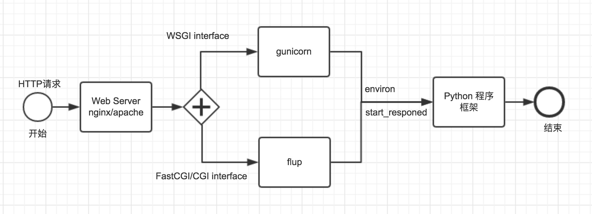

<!--toc-->
[TOC]
# Flask docker部署
## Flask uwsgi docker部署
https://uwsgi-docs.readthedocs.io/en/latest/WSGIquickstart.html
https://uwsgi-docs.readthedocs.io/en/latest/WSGIquickstart.html#deploying-flask
https://uwsgi-docs.readthedocs.io/en/latest/WSGIquickstart.html#deploying-django
先定义好uwsgi配置文件
参数：https://uwsgi-docs.readthedocs.io/en/latest/Options.html

uwsgi.ini
```
socket=/tmp/app.sock
chmod-socket=666
pidfile=/etc/nginx/uwsgi.pid
chdir=/learn_flask/app
master=true
module = wsgi:app
# wsgi-file=app.py
# callable=app
http=0.0.0.0:5000
processes=8
threads=4
lazy-apps=true
```
```
# uwsgi.ini file
[uwsgi]

# Django-related settings

# django项目运行的端口号
socket = :8001

# django项目的根目录，同名目录的外层
# the base directory (full path)
# chdir = /home/blog/Blog
chdir = /home//www/blog/Blog

# django项目同名目录内层自动生成的wsgi.py的路径，如果你的项目叫taobao，就填taobao.wsgi
# Django s wsgi file
module = Blog.wsgi

# 开启主进程
# process-related settings
# master
master = true

# 最大进程数量
# maximum number of worker processes
processes = 4

# 停止uwsgi时自动清理
# ... with appropriate permissions - may be needed
# chmod-socket = 664
# clear environment on exit
vacuum = true

# 指定后台输出日志信息的文件，如果遇到不能正常使用，可以使用cat /var/log/uwsgi_log.log查看报错信息
daemonize = /var/log/uwsgi_log.log

# 指定运行时候的pid文件，也可以用来停止进程， uwsgi --stop /var/run/uwsgi_pid.log
pidfile = /var/run/uwsgi_pid.log

# 指定虚拟环境，如果没有使用虚拟环境可以不用指定
home = /usr/local/django2.2
```
```
master = true 
#启动主进程，来管理其他进程，其它的uwsgi进程都是这个master进程的子进程，如果kill这个master进程，相当于重启所有的uwsgi进程。

chdir = /web/www/mysite 
#在app加载前切换到当前目录， 指定运行目录

module = mysite.wsgi 
# 加载一个WSGI模块,这里加载mysite/wsgi.py这个模块

py-autoreload=1  
#监控python模块mtime来触发重载 (只在开发时使用)

lazy-apps=true  
#在每个worker而不是master中加载应用

socket = /test/myapp.sock 
#指定socket文件，也可以指定为127.0.0.1:9000，这样就会监听到网络套接字

processes = 2 #启动2个工作进程，生成指定数目的worker/进程

buffer-size = 32768 
#设置用于uwsgi包解析的内部缓存区大小为64k。默认是4k。

daemonize = /var/log/myapp_uwsgi.log 
# 使进程在后台运行，并将日志打到指定的日志文件或者udp服务器

log-maxsize = 5000000 #设置最大日志文件大小

disable-logging = true #禁用请求日志记录

vacuum = true #当服务器退出的时候自动删除unix socket文件和pid文件。

listen = 120 #设置socket的监听队列大小（默认：100）

pidfile = /var/run/uwsgi.pid #指定pid文件

enable-threads = true 
#允许用内嵌的语言启动线程。这将允许你在app程序中产生一个子线程

reload-mercy = 8 
#设置在平滑的重启（直到接收到的请求处理完才重启）一个工作子进程中，等待这个工作结束的最长秒数。这个配置会使在平滑地重启工作子进程中，如果工作进程结束时间超过了8秒就会被强行结束（忽略之前已经接收到的请求而直接结束）

max-requests = 5000 
#为每个工作进程设置请求数的上限。当一个工作进程处理的请求数达到这个值，那么该工作进程就会被回收重用（重启）。你可以使用这个选项来默默地对抗内存泄漏

limit-as = 256 
#通过使用POSIX/UNIX的setrlimit()函数来限制每个uWSGI进程的虚拟内存使用数。这个配置会限制uWSGI的进程占用虚拟内存不超过256M。如果虚拟内存已经达到256M，并继续申请虚拟内存则会使程序报内存错误，本次的http请求将返回500错误。

harakiri = 60 
#一个请求花费的时间超过了这个harakiri超时时间，那么这个请求都会被丢弃，并且当前处理这个请求的工作进程会被回收再利用（即重启）
```

启动uwsgi服务器
`uwsgi --ini uwsgi.ini`

`uwsgi --socket 127.0.0.1:3031 --wsgi-file myflaskapp.py --callable app --processes 4 --threads 2 --stats 127.0.0.1:9191`

`uwsgi -s /tmp/flask-demo.sock --http 0.0.0.0:5001 --wsgi-file app.py --callable app --processes 4 --threads 2 --stats 0.0.0.0:9191`

`uwsgi -s /tmp/yourapplication.sock --manage-script-name --mount /yourapplication=myapp:app`

启动`uwsgi --ini uwsgi.ini`
uwsgi重启`uwsgi --reload uwsgi.pid`
uwsgi停止`uwsgi --stop uwsgi.pid`
```
[uwsgi]
#配合nginx使用
socket = 127.0.0.1:8000
#项目路径 /自己项目路径/flask_test
chdir = 自己项目路径
#wsgi文件 run就是flask启动文件去掉后缀名 app是run.py里面的Flask对象 
module = run:app
#指定工作进程
processes = 4
#主进程
master = true
#每个工作进程有2个线程
threads = 2
#指的后台启动 日志输出的地方
daemonize = uwsgi.log
#保存主进程的进程号
pidfile = uwsgi.pid
#虚拟环境环境路径（在root下的.virtualenvs下查看）
virtualenv = /虚拟环境路径/flask_test
```
然后配置Nginx，找到Nginx的配置文件nginx.conf，在http块下加上下面代码
```
server {
    # 监听端口
    listen 80;
    # 监听ip 换成服务器公网IP
    server_name 127.0.0.1;
 
    #动态请求
    location / {
      include uwsgi_params;
      uwsgi_pass 127.0.0.1:8000;
    }
    #静态请求
    location /static {
        alias /自己路径下的静态文件/static;
​
    }
}
```


#### uwsgi http、http-socket和socket配置项

在uwsgi的[配置说明书](https://uwsgi-docs.readthedocs.io/en/latest/Configuration.html)中有配置使用http、http-socket和socket，我对http-socket和socket不是太懂，搜了一下资料。

在uwsgi的[注意事项](https://uwsgi-docs.readthedocs.io/en/latest/ThingsToKnow.html)中有强调说http和http-socket是两个不同的“野兽”，这是什么意思呢?简单的说，如果我们想直接将uwsgi用作服务器（例如Apache和nginx那样）直接暴露在公网那么就使用http；如果有单独的服务器（例如Apache或者nginx），由服务器将请求转发给uwsgi处理，并且使用http协议，那么此时使用http-socket。

而socket配置项又是什么意思呢？首先，按照uwsgi文档给出的解释是：bind to the specified UNIX/TCP socket using default protocol.也就是说指定UNIX/TCP socket作为默认的协议（[引](https://uwsgi-docs.readthedocs.io/en/latest/Options.html#socket)）。

UNIX/TCP socket其实是两类socket。UNIX socket是进程间的通信（[Inter Process Communication](https://www.geeksforgeeks.org/inter-process-communication-ipc/)），但只在同一台机器上；TCP/IP sockets允许进程通过网络通信。（[引](https://serverfault.com/a/124518/449456)）

在uwsgi中如果配置如下则是使用UNIX socket：
```
[uwsgi]
socket = /tmp/uwsgi.sock
```
如果配置如下则是使用TCP/IP socket：
```
[uwsgi]
socket = 127.0.0.1:8000
```
[在nginx也是对应的配置](https://uwsgi-docs.readthedocs.io/en/latest/Nginx.html)-[OR](https://dormousehole.readthedocs.io/en/latest/deploying/uwsgi.html#nginx)：
```
# uWSGI socket（unix socket）
uwsgi_pass unix:///tmp/uwsgi.sock;
include uwsgi_params;

# TCP sockets 一般我们部署到k8s时会和nginx分开部署
uwsgi_pass 127.0.0.1:3031;
include uwsgi_params;
```
但是官方文档将两种形式写在一起了，是不是两个都可以用([引](https://uwsgi-docs.readthedocs.io/en/latest/Configuration.html#ini-files))：
```
[uwsgi]
socket = /tmp/uwsgi.sock
socket = 127.0.0.1:8000
workers = 3
master = true
```
注：[uwsgi-socket是socket的别名](https://stackoverflow.com/questions/57112428/what-are-the-differences-between-http-and-socket-inside-of-ini-file-in-uwsgi/57113565#57113565)

#### 镜像

https://hub.docker.com/_/python
可以使用镜像python:3.8.2-alpine3.11  
or python:3.8-alpine3.12 # 默认最新python3.8
or python:3.8-alpine # 默认最新python3.8和最新alpine

### flask run 
https://dormousehole.readthedocs.io/en/latest/cli.html
```
Unix Bash （ Linux 、Mac 及其他）:

$ export FLASK_APP=hello
$ flask run
Windows CMD:

> set FLASK_APP=hello
> flask run
Windows PowerShell:

> $env:FLASK_APP = "hello"
> flask run
```
FLASK_APP=hello 指在hello模块中的app 或者create_app
名称被导入，自动探测一个应用（ app ）或者工厂（ create_app ）。
FLASK_APP 分三个部分：一是一个可选路径，用于设置当前工作文件夹；二是一 个 Python 文件或者带点的导入路径；三是一个可选的实例或工厂的变量名称。如果 名称是工厂，则可以选择在后面的括号中加上参数。以下演示说明：

FLASK_APP=src/hello
设置当前工作文件夹为 src 然后导入 hello 。

FLASK_APP=hello.web
导入路径 hello.web 。

FLASK_APP=hello:app2
使用 hello 中的 app2 Flask 实例。

FLASK_APP="hello:create_app('dev')"
调用 hello 中的 create_app 工厂，把 'dev' 作为参数。

如果没有设置 FLASK_APP ，命令会查找 wsgi.py 文件或者 app.py 文件并尝试探测一个应用实例或者工厂。

根据给定的导入，命令会寻找一个名为 app 或者 application 的应用实例。 如果找不到会继续寻找任意应用实例。如果找不到任何实例，会接着寻找名为 create_app 或者 make_app 的函数，使用该函数返回的实例。

当调用一个应用工厂时，如果工厂接收一个名为 info 的参数，那么 class:~cli.ScriptInfo 实例会被作为一个关键字参数传递。如果括号紧随着工厂 名称，那么其中的内容会被视作为 Python 语言内容，并用作函数的参数。这意味着 字符串必须使用双引号包围。

> [run 命令](https://dormousehole.readthedocs.io/en/latest/api.html#flask.cli.run_command)可以启动开发服务器，它在大多数情况下替代 Flask.run() 方法。不要在生产中使用此命令运行应用，只能在开发过程中使用开发服务 器。开发服务器只是为了提供方便，但是不够安全、稳定和高效。有关如何在生 产中运行服务器，请参阅 部署方式 。

> 当 FLASK_ENV 是 development 时会开启调试模式。 如果想要单独控制调试模式，要使用 FLASK_DEBUG 。值为 1 表示开启， 0 表示关闭。

### 部署方式
https://dormousehole.readthedocs.io/en/latest/deploying/index.html


虽然轻便且易于使用，但是 **Flask 的内建服务器不适用于生产** ，它也不能很好
的扩展。本文主要说明在生产环境下正确使用 Flask 的一些方法。

如果想要把 Flask 应用部署到这里没有列出的 WSGI 服务器，请查询其文档中关于
如何使用 WSGI 的部分，只要记住： `Flask` 应用对象实质上是一个 WSGI
应用。


#### 托管于其它web服务

*   [Heroku](https://devcenter.heroku.com/articles/getting-started-with-python)

*   [Google App Engine](https://cloud.google.com/appengine/docs/standard/python/getting-started/python-standard-env)

*   [AWS Elastic Beanstalk](https://docs.aws.amazon.com/elasticbeanstalk/latest/dg/create-deploy-python-flask.html)

*   [Azure (IIS)](https://docs.microsoft.com/en-us/azure/app-service/containers/how-to-configure-python)

*   [PythonAnywhere](https://help.pythonanywhere.com/pages/Flask/)


#### 自主部署选项


*   [独立 WSGI 容器](https://dormousehole.readthedocs.io/en/latest/deploying/wsgi-standalone.html)
    *   [Gunicorn](https://dormousehole.readthedocs.io/en/latest/deploying/wsgi-standalone.html#gunicorn)
    *   [uWSGI](https://dormousehole.readthedocs.io/en/latest/deploying/wsgi-standalone.html#uwsgi)
    *   [Gevent](https://dormousehole.readthedocs.io/en/latest/deploying/wsgi-standalone.html#gevent)
    *   [Twisted Web](https://dormousehole.readthedocs.io/en/latest/deploying/wsgi-standalone.html#twisted-web)
    *   [代理设置](https://dormousehole.readthedocs.io/en/latest/deploying/wsgi-standalone.html#deploying-proxy-setups)

*   [uWSGI](https://dormousehole.readthedocs.io/en/latest/deploying/uwsgi.html)
    *   [使用 uwsgi 启动你的应用](https://dormousehole.readthedocs.io/en/latest/deploying/uwsgi.html#id1)
    *   [配置 nginx](https://dormousehole.readthedocs.io/en/latest/deploying/uwsgi.html#nginx)

*   [mod_wsgi (Apache)](https://dormousehole.readthedocs.io/en/latest/deploying/mod_wsgi.html)
    *   [安装 <cite>mod_wsgi</cite>](https://dormousehole.readthedocs.io/en/latest/deploying/mod_wsgi.html#mod-wsgi)
    *   [创建一个 <cite>.wsgi</cite> 文件](https://dormousehole.readthedocs.io/en/latest/deploying/mod_wsgi.html#wsgi)
    *   [配置 Apache](https://dormousehole.readthedocs.io/en/latest/deploying/mod_wsgi.html#id1)
    *   [故障排除](https://dormousehole.readthedocs.io/en/latest/deploying/mod_wsgi.html#id5)
    *   [支持自动重载](https://dormousehole.readthedocs.io/en/latest/deploying/mod_wsgi.html#id6)
    *   [使用虚拟环境](https://dormousehole.readthedocs.io/en/latest/deploying/mod_wsgi.html#id7)

*   [FastCGI](https://dormousehole.readthedocs.io/en/latest/deploying/fastcgi.html)
    *   [创建一个 <cite>.fcgi</cite> 文件](https://dormousehole.readthedocs.io/en/latest/deploying/fastcgi.html#fcgi)
    *   [配置 Apache](https://dormousehole.readthedocs.io/en/latest/deploying/fastcgi.html#apache)
    *   [配置 lighttpd](https://dormousehole.readthedocs.io/en/latest/deploying/fastcgi.html#lighttpd)
    *   [配置 nginx](https://dormousehole.readthedocs.io/en/latest/deploying/fastcgi.html#nginx)
    *   [运行 FastCGI 进程](https://dormousehole.readthedocs.io/en/latest/deploying/fastcgi.html#id1)
    *   [调试](https://dormousehole.readthedocs.io/en/latest/deploying/fastcgi.html#id2)

*   [CGI](cgi.html)
    *   [创建一个 <cite>.cgi</cite> 文件](https://dormousehole.readthedocs.io/en/latest/deploying/cgi.html#id1)
    *   [服务器设置](https://dormousehole.readthedocs.io/en/latest/deploying/cgi.html#id2)

### 参考

[Flask项目Docker容器化部署原理与实现](https://www.cnblogs.com/ybjourney/p/12014120.html)

[最简单的运行](https://github.com/lvthillo/python-flask-docker)

[flask run python:3.8.2-alpine3.11](https://github.com/codefresh-contrib/python-flask-sample-app)

[Flask + uWSGI alpine](https://github.com/cirolini/Docker-Flask-uWSGI)

[supervisord + nginx + uwsgi + flask + alpine](https://github.com/hellt/nginx-uwsgi-flask-alpine-docker/tree/master/python3)

[alpine python 镜像](../docker/alpine.md)

## Web 框架，gunicorn/flup/uWSGI 程序，与 CGI/FastCGI/WSGI 标准
### CGI/fastCGI/WSGI 标准
#### CGI（Common Gateway Interface）
通用网关接口。实现它的程序使用了 UNIX shell 环境变量来保存从 Web 服务器传递出去的参数，然后生成一个独立进程。CGI的第一个实现是 Perl 写的。
- 效率低下：每一个连接 fork 一个进程处理。
- 功能十分有限：CGI只能收到一个请求，输出一个响应。很难在CGI体系去对Web请求的控制，例如：用户认证等。

正因为这些问题，后面就有大神提出了 FastCGI 标准。
#### FastCGI（Fast Common Gateway Interface）
Fast通用网关接口 （这个名字起好敷衍）。使用进程/线程池来处理一连串的请求。这些进程/线程由FastCGI服务器管理，而不是Web服务器。 当进来一个请求时，Web服务器把环境变量和这个页面请求通过一个Socket长连接传递给FastCGI进程。所以FastCGI有如下的优点并在一推出就几乎获得了所有主流Web Server的支持：
- 性能：通过进程/线程池规避了CGI开辟新的进程的开销。
- 兼容：非常容易改造现有CGI标准的程序。
- 语言无关：FastCGI是一套标准，理论上讲只要能进行标准输出（stdout）的语言都可以作为FastCGI标准的Web后端。
- Web Server隔离：FastCGI后端和Web Server运行在不同的进程中，后端的任何故障不会导致Web Server挂掉。
- 专利：没有Apache mod_php之类的私有API的知识产权问题。
- 扩展：FastCGI后端和Web Server通过Socket进行通信，两者可以分布式部署并方便进行横向扩展。

所以FastCGI一推出就几乎获得了所有主流 Web Server 的支持，比如 Apache

但是，事情总是还有改进的余地的，FastCGI 这套工作模式实际上没有什么太大缺陷，但是有些不安分的 Python 程序猿觉得，FastCGI 标准下写异步的Web服务还是不太方便，如果能够收到请求后CGI端去处理，处理完毕后通过Callback回调来返回结果，那样岂不是很Coooool？！所以 WSGI 就被创造出来了

#### WSGI（Web Server Gateway Interface）
Web服务器网关接口。是为 Python 语言定义的Web服务器和Web应用程序或框架之间的一种简单而通用的接口。
你如果去搜索了他们的概念（我加上了），你一定知道了他们是标准接口规范， 而 Gateway Interface Server 才是实现了这个标准接口规范的产物，正如 CGI 的第一个实现是 Perl 写的；

举个例子，我规定了有一种房子必须有两个入口，一个出口，那么按照这个规定造出来的房子（两入口，一出口）就是实现了这个规定的产物，规定和房子分别对应上面的接口规范和 Gateway Interface Server ，可好理解？

### gunicorn/flup/uWSGI 程序
- [gunicorn](https://gunicorn.org/) - Gunicorn 'Green Unicorn' is a Python WSGI HTTP Server for UNIX.
- [flup](https://www.saddi.com/software/flup/) - Flup offers three sets of WSGI servers/gateways, which speak AJP 1.3, FastCGI, and SCGI.
- [uWSGI](https://uwsgi-docs.readthedocs.io/en/latest/) - The uWSGI project aims at developing a full stack for building hosting services.

可以看出他们是实现了标准的接口，之前有读者希望多点图直观，画了个图：


**如果你使用Python语言，推荐你使用 Gunicorn 来部署，希望大家重视生产环境**
> [gunicorn 文档](https://docs.gunicorn.org/en/stable/run.html#commands)
> [gunicorn code 7.2k](https://github.com/benoitc/gunicorn)


### Gunicorn理论
Gunicorn“绿色独角兽”是一个被广泛使用的高性能的python WSGI UNIX HTTP服务器，移植自Ruby的独角兽（Unicorn）项目，使用pre-fork worker模式，具有使用非常简单，轻量级的资源消耗，以及高性能等特点。

Gunicorn是主流的WSGI容器之一，它易于配置，兼容性好，CPU消耗很少，它支持多种worker模式：

- 同步worker：默认模式，也就是一次只处理一个请求。
- 异步worker：通过Eventlet、Gevent实现的异步模式
- 异步IOWorker：目前支持gthread和gaiohttp
- Tronado worker：tornado框架

> pre-fork worker模式
> 
> Gunicorn基于pre-fork的工作者模式，即有一个中央master进程来管理一系列的工作进程，master并不知道各个独立客户端。
> 所有的请求和响应完全由工作进程去完成。
> master通过一个循环不断监听各个进程的信号并作出相应反应，这些信号包括TTIN、TTOU和CHLD。TTIN和TTOU告诉master增加或者减少正在运行的进程数，CHLD表明一个子进程被终止了，在这种情况下master进程会自动重启这个失败的进程。

工作模式是通过work_class参数配置的值：缺省值：sync (gunicorn --worker-class=gevent myapp:app)

- sync
- Gevent
- Eventlet
- tornado
- gaiohttp
- gthread

> Sync Workers（sync）
> 最简单的同步工作模式
> 
> Async Workers（gevent，eventlet）
> gevent和eventlet都是基于greenlet库，利用python协程实现的
> 
> Tornado Workers（tornado）
> 利用python Tornado框架实现
> 
> AsyncIO Workers（gthread，gaiohttp）
> gaiohttp利用aiohttp库实现异步IO，支持web socket
> gthread采用的事线程工作模式，利用线程池管理连接

启动
> gunicorn --workers=6 app:app -b 0.0.0.0:8888
> - --workers是开启的进程数量，推荐值是CPU个数*2+1，CPU个数的获取方式
> - 第一个app是模块文件的名字，如果包含文件夹可以使用.连接
> - 第二个app是文件中Flask实例的名字
> - -b 指定监听地址和端口


- 服务器模式

Gunicorn基于pre-fork的工作者模式，即有一个中央master进程来管理一系列的工作进程，master并不知道各个独立客户端。所有的请求和响应完全由工作进程去完成。

master通过一个循环不断监听各个进程的信号并作出相应反应，这些信号包括TTIN、TTOU和CHLD。TTIN和TTOU告诉master增加或者减少正在运行的进程数，CHLD表明一个子进程被终止了，在这种情况下master进程会自动重启这个失败的进程。

如 Gevent,Sync 同步进程，Asyc 异步进程，Eventlet 等等

- 进程的同步和异步模式

默认情况下，Gunicorn的工作进程是同步执行的模式，即单个进程在某个时间只处理一个请求。同时，Gunicorn也支持Gevent、Eventlet来实现异步，通过--worker-class选项可以指定工作方式：

gunicorn --worker-class=gevent myapp:app

[fcgi vs. gunicorn vs. uWSGI 10年的老文章](https://www.peterbe.com/plog/fcgi-vs-gunicorn-vs-uwsgi)
[uWSGI vs. Gunicorn 12年的老文章](https://blog.kgriffs.com/2012/12/18/uwsgi-vs-gunicorn-vs-node-benchmarks.html)

[gevent: gunicorn vs uWSGI 12年的老文章](https://ivan-site.com/2012/10/gevent-gunicorn-vs-uwsgi/)

## 参考
https://flask.palletsprojects.com/en/1.0.x/deploying/wsgi-standalone/
- Gunicorn
- uWSGI
- Gevent
- Twisted Web
- Proxy Setups