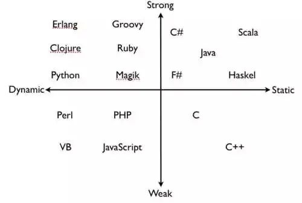

动静类型与强弱类型

https://wiki.python.org/moin/Why%20is%20Python%20a%20dynamic%20language%20and%20also%20a%20strongly%20typed%20language

强类型：如果一门语言不对变量的类型做隐式转换，这种编程语言就被称为强类型语言 ；
弱类型：与强类型相反，如果一门语言对变量的类型做隐式转换，那我们则称之为弱类型语言；
动态类型：如果一门语言可以在运行时改变变量的类型，那我们称之为动态类型语言；
静态类型：与动态类型相反，如果一门语言不可以在运行时改变变量的类型，则称之为静态类型语言；

## 学习资源

数据科学 Python 笔记本:深度学习(TensorFlow、Theano、Caffe、Keras)、scikit-learn、Kaggle、大数据(Spark、Hadoop MapReduce、HDFS)、matplotlib、panda、NumPy、SciPy、Python essentials、AWS 和各种命令行。
https://github.com/donnemartin/data-science-ipython-notebooks

### python  基础教程

python2: https://www.runoob.com/python/python-tutorial.html

python3: https://www.runoob.com/python3/python3-tutorial.html

Python - 100 天从新手到大师: https://github.com/jackfrued/Python-100-Days

## IronPython vs. Python .NET

https://stackoverflow.com/questions/1168914/ironpython-vs-python-net
https://ironpython.net/
https://github.com/IronLanguages/ironpython2
https://github.com/IronLanguages/ironpython3
https://github.com/pythonnet/pythonnet

## Python 解释器&编译器

### CPython (C), which is the most common
CPython 是默认的且使用最广泛的 Python 编译器。它是用 C 语言编写的，并使用 GIL（全局解释器锁），这使得并发 CPython 进程之间的通信很困难。

CPython 中的编译步骤包括：解码、令牌化、解析、抽象语法树和编译。

网站：https://compilers.pydata.org/

### Jython (Java)
它用 Java 编写，可以在运行 JVM 的任何平台上执行。Jython 将 Python代码编译为 Java 字节码，从而做到跨平台。

它可用于创建 Servelets、Swing、SWT 和 AWT 软件包的解决方案。Jython 使用 CPython 之类的全局解释器锁（GIL） 。

另外，你可以将 Java 类扩展到 Python 代码。

网址：https://www.jython.org

### IronPython (.NET)
此版本的 Python 编译器是在微软的 .Net 框架和 Mono 上实现的。

它还提供了动态编译和交互式控制台。它使得安装非常容易，并且具有跨平台兼容性。

它还具有标准库和不同的模块，主要用于实现 .Net 框架的用户界面库。

网址：https://ironpython.net/
### PyPy (Python)

### Stackless

Stackless Python 是 Python 编程语言的增强版本
https://github.com/stackless-dev/stackless

Microthreads: tasklets wrap functions allowing them to be launched as microthreads.
Channels channels can be used for bidirectional communication between tasklets.
Scheduling a round robin scheduler is built in. It can be used to schedule tasklets either cooperatively or preemptively.
Serialisation: tasklets can be serialised to disk through pickling for later resumption of execution.

### RustPython

https://github.com/RustPython/RustPython

Each of these implementations offer some benefits: Jython, for example, compiles Python source code to Java byte code, then routes it to the Java Virtual Machine. Because Python code is translated to Java byte code, it looks and feels like a true Java program at runtime and so it integrates well with Java applications.

IronPython is well-integrated with .NET, which means IronPython can use the .NET framework and Python libraries or vice versa.

We want to unlock the same possibilities that Jython and IronPython enable, but for the Rust programming language. In addition, thanks to Rusts’ minimal runtime, we’re able to compile RustPython to WebAssembly and allow users to run their Python code easily in the browser.

### gpython

https://github.com/go-python/gpython

### Pyston
Pyston是Python编程语言的一种更快、高兼容性的实现。版本2目前是封闭源代码，但是您可以在这个存储库的v1.0标记下找到旧的v1源代码。
如需更新，请关注[我们的博客](https://blog.pyston.org/)
https://github.com/pyston/pyston

Ubuntu 
```
# 下载
$ wget https://github.com/pyston/pyston/releases/download/v2.0/pyston_2.0_amd64_18.04.deb
# 安装
$ sudo apt install ./pyston_2.0*.deb
然后你就可以使用 pyston (或者 pyston3) 和 pip-pyston install(或者 pip-pyston3 install) 命令来使用 pyston。
```

### Brython
Brython 是一种流行的 Python 编译器，可将 Python 转换为 Javascript 代码。它提供对所有 Web 浏览器（包括一种手机 Web 浏览器）的支持。

它还支持最新的 Html5/CSS3 规范，可以使用流行的 CSS 框架，如 BootStrap3 和 LESS。

网址：https://brython.info

### Pyjs

Pyjs 是一个丰富的 Internet 应用程序框架，也是一种轻量级的 Python 编译器，可以从 Web 浏览器直接执行 Python 脚本，可以从浏览器的 JS 控制台执行程序。

它是从 Python 到 Javascript 的编译器，可以使代码在 Web 浏览器上运行。它带有 Ajax 框架和 Widget Set API。

网站：http://pyjs.org

### WinPython
它是为 Windows 操作系统设计的。它有一些 CPython 的特性。它预装了一些针对数据科学和机器学习的流行库，例如 Numpy、Pandas 和 Scipy。

它带有 C/C++ 编译器，大多数时候不会用到。除此之外，它只有 Python 编译器，没有其它包。

网址：https://winpython.github.io

### Skulpt
Skulpt 是 Python 的浏览器版实现，可以被添加到 HTML 代码中。

此 Python 编译器使用 Javascript 编写，在客户端运行代码，无需其它插件、加工或服务器支持。

Skulpt 解释器通过导入方式，来执行保存在网站上的 .py 文件中的代码。

网站：https://skulpt.org

### Shed Skin
该编译器将 Python 标准库模块编译为 C++，它将静态类型的 Python 程序转换为很受限的优化的 C++ 代码。

通过将其内置的 Python 数据类型再次实现为自己的类集（可以用 C++ 高效实现），可以提高性能。

网站：https://en.wikipedia.org/wiki/Shed_Skin

### Active Python
这是用于 Windows、Linux 和 Mac Os 的 Python 发行版，有免费的社区版。

它支持在许多平台安装，某些不被 Python-like 的 AIX 支持的平台，它也支持。它提供了比 Python 更多的兼容性。

网站：https://www.activestate.com/products/activepython

### Transcrypt
它是一种流行的将 Python 代码编译为简单易读的 Java 代码的编译器。它是一个轻量级的 Python 编译器，支持对矩阵和向量运算进行切片。

Transcrypt 也可以在 Node.js 上运行。分层模块、多重继承和本地类给其添加了很多功能。

网站：http://www.transcrypt.org/
### Nutika
这是一种源码到源码的 Python 编译器，可以将 Python 源代码转换为 C/C++ 可执行代码。它会使用到许多 Python 库和扩展模块。

它自带 Anaconda，可用于创建数据科学和机器学习项目。

网站：http://nuitka.net/


## Style Guide

Style Guide: https://www.python.org/dev/peps/pep-0008/

### autopep8

helps to format code automatically
使用 autopep8，以 PEP 8 规范，自动排版 Python 代码

```
python -m autopep8 -r --global-config .config-pep8 -i .

autopep8 --in-place --aggressive --aggressive file.py


```

### isort

helps to order imports automatically

```
python -m isort -rc .
#When you use newly 3rd party modules, add it to .isort.cfg to keep import order correct
```

### Docstring style: Google Style

https://sphinxcontrib-napoleon.readthedocs.io/en/latest/example_google.html

### RST 与 Python 类似 Javadoc 与 Java.

You can customise CHANGELOG.rst with commit messages following .gitchangelog.rc
It generates readable changelog
如果下载了别人的 Python 源码，里面有 rst 文件夹，我们可以转为 html 后用浏览器打开

```
pip install sphinx
pip install -i http://pypi.douban.com/simple/ sphinx_rtd_theme --trusted-host pypi.douban.com


sphinx-build -b html docs build
```

### pip

https://stackoverflow.com/questions/30306099/pip-install-editable-vs-python-setup-py-develop

pip install -e
https://stackoverflow.com/questions/42609943/what-is-the-use-case-for-pip-install-e/59667164

#### Installing from a VCS

https://the-hitchhikers-guide-to-packaging.readthedocs.io/en/latest/pip.html#installing-from-a-vcs

#### cmd

pip install -h

pip install http://dist.repoze.org/PIL-1.1.6.tar.gz

pip install -U git+https://github.com/madmaze/pytesseract.git
git clone https://github.com/madmaze/pytesseract.git
cd pytesseract && pip install -U .
pip3 install face_recognition -i http://mirrors.aliyun.com/pypi/simple/ --trusted-host mirrors.aliyun.com

pip install -r requirements.txt

### 生成 requirements.txt

1.

```
pip freeze > requirements.txt

//pip install pycryptodome -i https://pypi.doubanio.com/simple/
//pip install -i https://pypi.doubanio.com/simple/ -r requirements.txt
```

2.

```
pip install pipreqs
// 生成
pipreqs .
pipreqs --encoding=utf-8 .
// 更新
pipreqs --force .
pipreqs --force --encoding=utf-8 .
```

#### pipenv

```
pip install --user pipenv
python -m pipenv lock --clear

# If you experience the below error, then refer pypa/pipenv#187 to solve it.
# Locking Failed! unknown locale: UTF-8


python -m pipenv install --dev --system

pre-commit install
```

查看依赖关系

```
pipenv graph
```

## python 解释器(python.exe)和 python 启动器(py.exe)

（在 Unix 系统中是 Control-D，Windows 系统中是 Control-Z）就退出解释器并返回退出状态为 0。如果这样不管用，你还可以写这个命令退出：quit() 和 exit()。

### python 启动器

多环境（如;2.7 和 3.7 和 3.8）共存
py -h
[适用于 Windows 的 Python 启动器](https://docs.python.org/zh-cn/3/using/windows.html#launcher)

### python 解释器

如果不使用默认编码，要声明文件所使用的编码，文件的 第一 行要写成特殊的注释。语法如下所示：
https://docs.python.org/zh-cn/3/library/codecs.html#module-codecs

```
# -*- coding: encoding -*-
```

关于 第一行 规则的一种例外情况是，源码以 UNIX "shebang" 行 开头。这种情况下，编码声明就要写在文件的第二行。例如：

```
#!/usr/bin/env python3
# -*- coding: cp1252 -*-
```

在 Unix 系统中，Python 3.x 解释器默认安装后的执行文件并不叫作 python，这样才不会与同时安装的 Python 2.x 冲突。

```
#! /usr/bin/python -v
```

然后 Python 将以 -v 选项启动

## 分布式计算框架

https://github.com/mars-project/mars
Mars 是由阿里云高级软件工程师秦续业等人开发的一个基于张量的大规模数据计算的统一框架，目前它已在 GitHub 上开源。
该工具能用于多个工作站，而且即使在单块 CPU 的情况下，它的矩阵运算速度也比 NumPy(MKL)快。

https://github.com/databricks/koalas

https://github.com/dask/dask
关于 Python 性能的一个常见抱怨是全局解释器锁(GIL)。由于 GIL，同一时刻只能有一个线程执行 Python 字节码。因此，即使在现代的多核机器上，使用线程也不会加速计算。
但当你需要并行化到多核时，你不需要放弃使用 Python，Dask 库可以将计算扩展到多个内核甚至多个机器。某些设置可以在数千台机器上配置 Dask，每台机器都有多个内核。

https://github.com/vaexio/vaex
Vaex 是一个开源的 DataFrame 库(类似于 Pandas)，对和你硬盘空间一样大小的表格数据集，它可以有效进行可视化、探索、分析甚至进行实践机器学习。

它可以在 N 维网格上计算每秒超过十亿(10^9)个对象/行的统计信息，例如均值、总和、计数、标准差等。使用直方图、密度图和三维体绘制完成可视化，从而可以交互式探索大数据。
Vaex 使用内存映射、零内存复制策略获得最佳性能(不浪费内存)。

为实现这些功能，Vaex 采用内存映射、高效的核外算法和延迟计算等概念。所有这些都封装为类 Pandas 的 API，因此，任何人都能快速上手。

https://github.com/cupy/cupy
CuPy 是一个借助 CUDA GPU 库在英伟达 GPU 上实现 Numpy 数组的库。基于 Numpy 数组的实现，GPU 自身具有的多个 CUDA 核心可以促成更好的并行加速。
CuPy 接口是 Numpy 的一个镜像，并且在大多情况下，它可以直接替换 Numpy 使用。只要用兼容的 CuPy 代码替换 Numpy 代码，用户就可以实现 GPU 加速。
CuPy 支持 Numpy 的大多数数组运算，包括索引、广播、数组数学以及各种矩阵变换。

http://docs.cython.org/en/latest/
Cython 是结合了 Python 和 C 的语法的一种语言，可以简单的认为就是给 Python 加上了静态类型后的语法，使用者可以维持大部分的 Python 语法，
而不需要大幅度调整主要的程式逻辑与算法。但由于会直接编译为二进制程序，所以性能较 Python 会有很大提升。

```
pip install Cython

from cpython cimport array
import array
cdef array.array a = array.array('i', [1, 2, 3])
cdef int[:] ca = a
print(ca[0])
```

https://github.com/ray-project/ray

Ray 是由加州大学伯克利分校 RISELab 开源的新兴人工智能应用的分布式框架。它实现了一个统一的接口、分布式调度器、分布式容错存储，以满足高级人工智能技术对系统最新的、苛刻的要求。Ray 允许用户轻松高效地运行许多新兴的人工智能应用，例如，使用 RLlib 的深度强化学习、使用 Ray Tune 的可扩展超参数搜索、使用 AutoPandas 的自动程序合成等等。

深度学习、强化学习、自动机器学习（AutoML）

Ray On Spark
https://github.com/intel-analytics/analytics-zoo

Apache Spark/Flink & Ray 上的分布式 Tensorflow、Keras 和 PyTorch

https://github.com/uber/fiber

## Python 执行实时可视化

可以实时可视化 Python 程序的执行过程
Heartate——如监测心率般追踪程序运行
https://github.com/alexmojaki/heartrate
代码调用高亮依赖于 executing (https://github.com/alexmojaki/executing) 库

## 优美的绘图可视化

http://www.bugman123.com/

## 代码格式化

让 Python 代码更易维护的七种武器——代码风格（pylint、Flake8、Isort、Autopep8、Yapf、Black）测试覆盖率（Coverage）CI（JK）
https://www.cnblogs.com/bonelee/p/11045196.html

### black

https://github.com/psf/black 17k

### autopep8

https://github.com/hhatto/autopep8 3.5k

## Python 方面的静态检查工具

### pylint

https://github.com/PyCQA/pylint 3k

### Google 的 pytype

https://github.com/google/pytype 2.8k

### Microsoft 的 pyright

https://github.com/microsoft/pyright 5.6k

### Facebook 的 Pyre

[Pysa](https://engineering.fb.com/security/pysa/)是一个专注于安全性的工具，它是在 Facebook 之前开源的静态检查工具 Pyre 的基础上进行开发的。
Pysa 还可以检查常见的 web 应用安全问题，例如，XSS 和 SQL 注入。

Pysa 的开发汲取了 Zoncolan 的经验，其使用了与 Zoncolan 相同的算法执行静态分析，甚至与 Zoncolan 共享了一些代码。像 Zoncolan 一样，Pysa 可追踪程序中的数据流。Zoncolan 是 Facebook 于 2019 年 8 月发布的用于 Hack 的静态分析器，主要面向类似于 PHP 的编程语言。

https://github.com/facebook/pyre-check 4.1k

https://pyre-check.org/docs/pysa-basics.html

### mypy

### 还可以利用 Git pre-commit hook 规范检查

如果你需要跳过这些钩子，你可以运行 git commit --no-verify 或 git push --no-verify

## 虚拟环境和包管理工具 Conda、Virtualenv、Pipenv、 pyenv、venv、

## Pipx 是一款跨平台的 Python 环境隔离管理工具

## Latex 公式

https://github.com/connorferster/handcalcs

## object-mapper

https://github.com/marazt/object-mapper

## Pymunk

[是一个易于使用的 pythonic 2d 物理库](https://www.toutiao.com/i6871974915000500744)
http://www.pymunk.org/en/latest/
https://pypi.org/project/pymunk/
https://github.com/viblo/pymunk

## python 新版本
### Python 3.10

https://towardsdatascience.com/6-new-awesome-features-in-python-3-10-a0598e87689f

- 更好的错误跟踪（错误位置，以及具体的错误类型）；
- match-case 结构模式匹配；
- 新型 Union 运算符。
```
def func(num: Union[int, float]) -> Union[int, float]: 
    return num + 5
```
```
def func(num: int | float) -> int | float: 
    return num + 5
```
- Stricter Zipping
在以前的版本中，你可以使用具有不同长度序列的 zip，但是现在引入了一个新的参数 strict，用来检查传递给 zip 函数的所有可迭代对象是否具有相同的长度。
- 自动文本编码
有时编码会遇到这种情况，代码在一台机器上可以运行，但是在另一台机器上会出错。导致这种情况的原因很多，有些是文本编码造成的。在 Python 的早期版本中，如果没有显式声明编码类型，首选的本地编码可能会导致代码在其他计算机上出现错误。在新版本的 Python3.10 中，如果用户打开没有特定编码类型的文本文件时，可以激活一个警告来通知用户。
- 异步迭代
有两个新的异步内置函数 aiter 和 anext 使代码更具可读性。