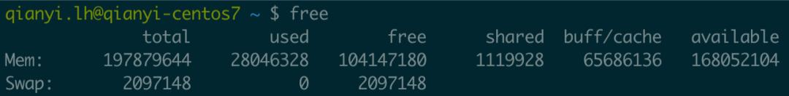
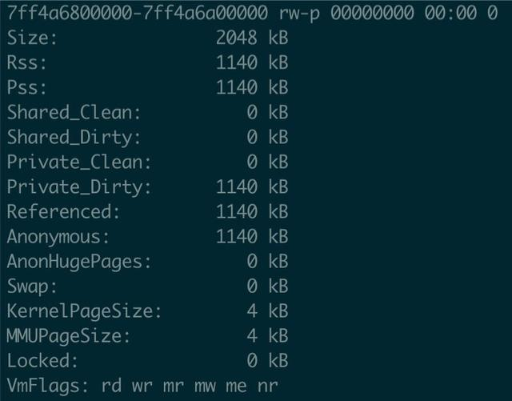
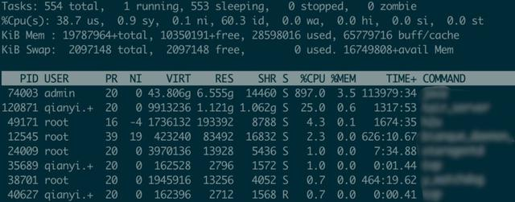

[Linux的内存初始化](https://www.toutiao.com/a6735580749635781132/)

# 聊聊 Linux 的内存统计

## free 命令

纵向是内存和Swap分区，横向是统计项:

- total — 系统总内存（其实就是从 /proc/meminfo获取的）
- used — 已使用内存
- free — 未使用的内存
- shared — 共享内存的大小，主要是 tmpfs
- buff / cache — buffers和cache使用的内存之和
- available — 可用内存，可以简单理解为未使用的内存和可释放的内存之和（buffer、cache 可以释放大部分，所以这里近似等于 free + buffer / cache 的大小）

```
# 内存总量 = 已使用内存 + 空闲内存
`total` = `used` + `free`

# 系统被用掉的内存
`-buffers/cache` = `used` - `buffers` - `cached`

# 系统还能用的内存
`+buffers/cache` = `free` + `buffers` + `cached`

# 所以，其实还有下面的公式
`total` = `-buffers/cache` + `+buffers/cache`
```

## /proc/meminfo

很多命令的内存统计都是从/proc/meminfo读取的。鉴于/proc/meminfo的 man 文档（man proc）写的实在不够清晰，很多条目居然还是To be documented状态，所以这里逐一列举出来常见的统计项解释一下。

首先明确一点，内核目前并没有绝对精确的统计所有的内存使用量，比如alloc_pages接口申请的内存不一定被统计在内（除非所有调用alloc_pages的代码主动进行统计，如果某些不讲究的驱动程序没有主动统计的话统计值就肯定对不上了）。

先看这三项全局统计：

- MemTotal — 总的全局可用内存大小（即物理RAM减去保留的以及内核代码占用的，系统启动后一般固定不变）

- MemFree — 总的全局未使用内存大小

- MemAvailable — 内核估计出来的全局可用内存大小，非精确值（MemFree不代表所有可用的内存，Cache/Buffer、Slab均有部分可以临时释放的内存要计算在内）

用户进程的内存页分为两种：

1. 与文件关联的内存页（File-backed Pages）, 比如程序文件、读取文件时数据对应的缓存页

2. 与文件无关的匿名内存页（Anonymous Pages），比如进程的堆、栈等分配的内存

所有Page Cache里的页面都是File-backed Pages，File-backed Pages在内存不足的时候可以直接写回对应的硬盘文件里，即Page-out。而Anonymous Pages在内存不足时就只能写到硬盘上的交换区Swap里来释放内存，称之为Swap-out。

Anonymous Pages与用户进程共存，进程退出则Anonymous pages释放，而Page Cache即使在进程退出后还可以缓存。

下面是磁盘缓存相关的统计项：

- Buffers — 块设备所占用的缓存页，比如磁盘文件系统的meta信息如SuperBlock等，直接读写块设备产生的缓存也统计在这里(例如dd命令)

- Cached — 从磁盘读取的文件内容缓存（即Page cache）

- SwapCached — Swap中包含的确定要被换出，但是尚未写入物理交换区的匿名内存页

- SwapTotal — 可用的磁盘Swap总大小

- SwapFree — 磁盘Swap的free大小

- Dirty — 修改了等待写回磁盘的内存大小

- Writeback — 正在写回磁盘的内存大小

以下几项和内核的页面回收算法（Page Frame Reclaiming）相关，Page Cache和所有用户进程的内存（除内核栈和HugePages外）都在相关的LRU Lists上。内核在 2.6 以前就引入了增强的LRU算法来解决朴素的LRU算法完全不考虑使用频率的问题。具体的Active 链表和Inactive 链表的使用详情请参阅其他资料。

- Active — 最近使用的内存，回收的优先级低

- Inactive — 最近较少使用的内存，回收的优先级高

- Active (anon) — Active 链表中的匿名页（Anonymous Pages）部分

- Inactive (anon) — Inactive 链表中的匿名页（Anonymous Pages）部分

- Active (file) — Active 链表中的File-backed Pages部分

- Inactive (file) — Inactive 链表中的File-backed Pages部分

- Unevictable — 禁止换出的页，对应Unevictable 链表，其中包括VM_LOCKED的内存页、SHM_LOCK的共享内存页（也统计在Mlocked中）、和Ramfs等

- Mlocked — mlock系统调用锁定的内存大小

共享内存在 Linux 中细分的话可以分为以下几种：

- SystemV Shared Memory — shmget

- POSIX Shared Memory — shm_open

- Shared Anonymous Memory — mmap(MAP_ANONYMOUS | MAP_SHARED)

共享内存在内核中都是 基于tmpf机制实现 的。因为基于文件系统所以就不能算是匿名页，不能计入AnonPages的统计项，而只能计入Cached和Mapped统计项。但是，tmpfs背后并没有真实的磁盘文件存在，如果想要被临时释放出来，只能通过Swap的方式，所以内存页被链接到了Inactive(anon)和Active(anon)里。

也就是说，共享内存的页面属于File-backed Pages，但是被放在Inactive(anon)和Active(anon)链表里，统计也不算在AnonPages里，而是算在Cached和Mapped里。特别地，如果这些页被mlock的话，就放在Unevictable链里并计算在内。所以从数值上看，Inactive(anon)项 +Active(anon)项 不等于AnonPages项，因为前者包括共享内存的部分。Active(file)项 +Inactive(file)项 也不等于Mapped项，因为前者中包括Unmapped的内存，后者还包含共享内存的部分（这部分在Inactive(anon)和Active(anon)里）。

这里有一个情况要注意，与文件关联的页也有可能是匿名页（MAP_PRIVATE映射的页面被修改时会产生一个匿名页拷贝），会被算到AnonPages里。

与此相关的相关的统计项有：

- AnonPages — 匿名页（Anonymous pages）的大小，同时也包含Transparent HugePages (THP)对应的 AnonHugePages

- Mapped — 设备和文件等映射的大小，Mapped统计了Cached中所有的Mapped页面，是Cached的子集（满足Cached-Mapped=Unmapped）。共享内存、可执行程序的文件、动态库、mmap的文件等都统计在这里

- Shmem — 共享内存的大小，包括Shared Memory、tmpfs和devtmpfs

> 注意 Linux 的内存是真正使用时才分配的，所以注意这里的大小都是已分配的大小，而不是程序里申请的大小。

下面都是内核使用的内存相关的统计项：

- Slab — 内核Slab结构使用的大小（就是那个Slab分配器占用的）

- SReclaimable — 内核Slab里面可回收的部分（调用kmem_getpages()时带有 SLAB_RECLAIM_ACCOUNT 标的）

- SUnreclaim — Slab里面无法回收的大小，等于Slab项 -SReclaimable项

- KernelStack — 分配给内核栈的大小（每个用户线程都会分配一个Kernel Stack，系统调用syscall、trap、exception后进入内核态执行代码时候使用）

- PageTables — 页表的大小（就是经常挂在嘴上的那个页表）

- NFS_Unstable — 发送到服务端但尚未提交的 NFS 页的大小

- Bounce — 块设备 “bounce buffers” 部分的大小（有些老设备只能访问低端内存，比如 16M 以下，这部分分配的 buffer 统计在这里）

- WritebackTmp — FUSE 用于写回磁盘的缓冲区的大小

- VmallocTotal — vmalloc 区域大小

- VmallocUsed — vmalloc 区域使用大小

- VmallocChunk — vmalloc 区域最大的 free 连续区块大小

- HardwareCorrupted — 系统检测到内存的硬件故障的内存大小（问题页会被记录不再使用）

之前说过，HugePages 是独立统计的，如果进程使用了 HugePages，是不会计入自身的RSS/PSS的。注意下面的AnonHugePages指的是透明大页（THP，Transparent HugePages），THP是统计在进程的RSS/PSS里的，要注意区别。下面是相关的统计项：

- AnonHugePages — 透明大页 THP 使用的大小

- HugePages_Total — 内存大页的总量，对应 /proc/sys/vm/nr_hugepages，可以动态改

- HugePages_Free — 内存大页中 free 的大小

- HugePages_Rsvd — 内存大页中能分配出来的大小

- HugePages_Surp — 内存大页中超过 /proc/sys/vm/nr_hugepages的大小， 最大值由/proc/sys/vm/nr_overcommit_hugepages限制

- Hugepagesize — 内存大页的页大小

## 进程级别的统计

先介绍几个通用概念：

- VSS - Virtual Set Size，虚拟内存大小，包含共享库占用的全部内存，以及分配但未使用内存

- RSS - Resident Set Size，实际使用物理内存，包含了共享库占用的全部内存

- PSS - Proportional Set Size，实际使用的物理内存，共享库占用的内存按照进程数等比例划分

- USS - Unique Set Size，进程独自占用的物理内存，不包含共享库占用的内存

### /proc/{pid}/smaps 文件
在/proc/{pid}/smaps文件对应每个进程的详细内存分段统计。截取一部分：



下面分别解释下含义：

- Size：映射的大小（mapping size）

- Rss：实际驻留在RAM的内存大小（包括共享库的大小，不包括已经交换出去的页面）

- Pss：Rss 的基础上，把共享库的大小均摊给所有被映射的进程后的大小

- Shared_Clean：共享的Clean内存的大小

- Shared_Dirty：共享的Dirty内存的大小

- Private_Clean：私有的Clean内存的大小

- Private_Dirty：私有的Dirty内存的大小

- Referenced：当前被标记为引用的页的大小

- Anonymous：匿名内存的大小

- AnonHugePages：透明大页内存的大小

- Swap：Swap的大小

- KernelPageSize：内核页大小

- MMUPageSize：MMU页大小

- Locked：被mlock的内存大小

- VmFlags：页的标志位，有点多这里不列举，详见参考资料

可以看到Rss这个指标实际上是包含了共享库的大小的，不同的进程会共享这个映射的，如果想通过累加这个值来计算所有进程用到的内存的话就不准确了，而Pss把共享库的大小均摊给了所有用到映射了这个库的进程，所以累加起来就不会重复计算共享库大小了。

> P.S. 最新的内核文档提到了要加smaps_rollup这个统计，支持Pss_Anon、Pss_File和Pss_Shmem三个分类统计，这个在进程级别看，用到内存就很清晰了。

我们可以累加一下这个值看看某进程用到的内存总和：

```
sudo cat /proc/14718/smaps | grep 'Pss' | awk '{total += $2}; END {print total}'

输出1175758
```
注意单位是KB，所以这里进程用到的内存是 1.17 GB 左右。

这是个使用共享内存作为存储的服务，所以这是符合预期的。如果想要看排除共享内存的部分，那要看Anonymous部分的总和：
```
sudo cat /proc/14718/smaps | grep 'Anonymous' | awk '{total += $2}; END {print total}'

输出63360
```

所以实际匿名内存使用是 63 MB 左右。

### top 命令
top命令中关于内存使用的统计：

内存相关的统计有VIRT、RES、SHR、SWAP、CODE、DATA、USED

- VIRT — Virtual Memory Size，虚拟内存大小，包括所有代码、数据和共享库，以及已交换的页面和已映射但未使用的内存

- RES — Resident Memory Size，驻留内存大小，共享的内存比如动态库也会计算在内

- SHR — Shared Memory Size，共享的内存大小，并非所有共享的内存都是常驻的

- SWAP — Swapped Size，非驻留内存大小

- CODE — Code Size，程序可执行代码的大小

- DATA — Data + Stack Size，可执行代码以外的物理内存量，也称为数据驻留集大小

- USED — Memory in Use，RES + SWAP 的大小

### 其他的内存查看命令
常用的还有这些：vmstat、sar、slabtop、kmstat、ps、prstat、pmap等等。懒得写了，有问题看man文档得了。