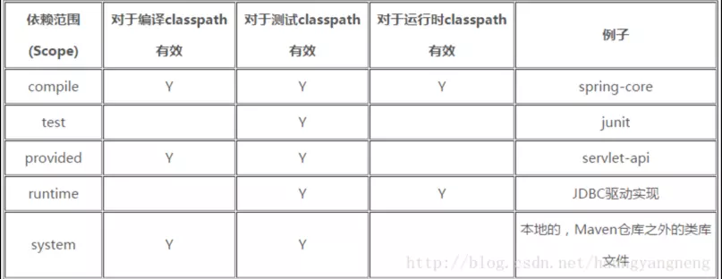
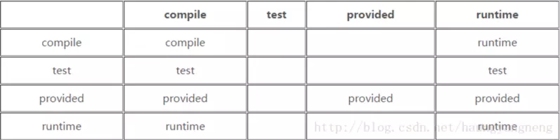
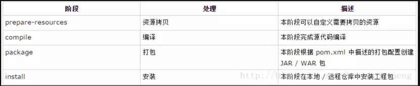
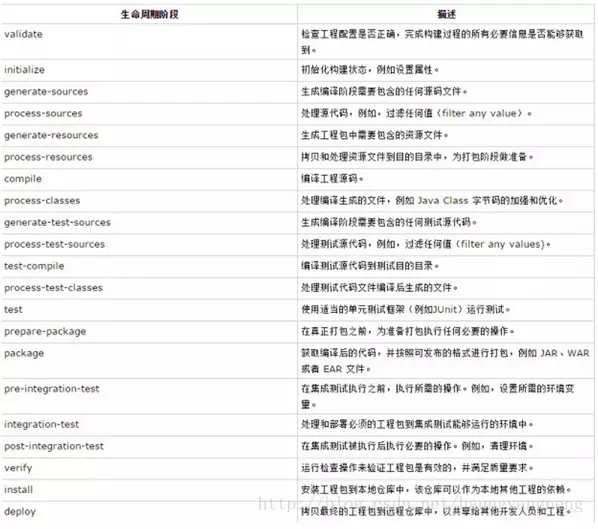

https://github.com/binary-repositories-comparison/binary-repositories-comparison.github.io/blob/master/docs/content/_index.md
产品|厂商|备注 |VS
--|--|--|--
Apache|Archiva|https://github.com/apache/archiva
JFrog|Artifactory|[开源版本](https://www.jfrogchina.com/open-source/),[官网](https://jfrog.com/artifactory/) |https://jfrog.com/blog/artifactory-vs-nexus-integration-matrix/
Sonatype|Nexus |[oss版本开源](https://github.com/sonatype/nexus-public) , [官网](https://www.sonatype.com/nexus-repository-oss)|https://www.sonatype.com/nexus-vs-artifactory
CloudRepo ||https://www.cloudrepo.io/


https://www.jianshu.com/c/1690baadc10f


# Maven
[TOC]
## Maven 常用命令
命令|作用|参数
--|--|--
mvn |查看版本|-v /--version
mvn clean|清除编译文件,删除target目录下编译内容
mvn compile|编译
mvn package|打包、jar/war|-Dmaven.test.skip=ture：打包时跳过测试
mvn install|打包发布到本地仓库
mvn deploy|打包发布到远程仓库
mvn test | 测试
mvn test-compile|编译测试程序
mvn site|生成站点目录
mvn site-deploy|生成站点目录并发布
mvn help:effective-pom|查看实际pom信息
mvn dependency:tree|分析项目的依赖信息
- mvn archetype:generate -DgroupId=com.companyname.bank -DartifactId=consumerBanking -DarchetypeArtifactId=maven-archetype-quickstart -DinteractiveMode=false：创建一个简单的Java工程
- mvn archetype:generate -DgroupId=com.companyname.automobile -DartifactId=trucks -DarchetypeArtifactId=maven-archetype-webapp -DinteractiveMode=false：创建一个java的web工程
- mvn install:install-file -DgroupId=<groupId> -DartifactId=<artifactId> -Dversion=1.0.0 -Dpackaging=jar -Dfile=<myfile.jar>：安装指定文件到本地仓库


## Maven 之pom.xml解析

所有的POM文件需要project元素(坐标元素)和三个必须的字段：groupId， artifactId，version

- POM模型
```xml
<project xmlns="http://maven.apache.org/POM/4.0.0"
     xmlns:xsi="http://www.w3.org/2001/XMLSchema-instance"
     xsi:schemaLocation="http://maven.apache.org/POM/4.0.0
        http://maven.apache.org/xsd/maven-4.0.0.xsd">
        <modelVersion>4.0.0</modelVersion>
        <!-- 基本配置 -->
        <groupId>...</groupId>
        <artifactId>...</artifactId>
        <version>...</version>
        <packaging>...</packaging>
        <!-- 依赖配置 -->
        <dependencies>...</dependencies>
        <parent>...</parent>
        <dependencyManagement>...</dependencyManagement>
        <modules>...</modules>
        <properties>...</properties>
        <!-- 构建配置 -->
        <build>...</build>
        <reporting>...</reporting>
        <!-- 项目信息 -->
        <name>...</name>
        <description>...</description>
        <url>...</url>
        <inceptionYear>...</inceptionYear>
        <licenses>...</licenses>
        <organization>...</organization>
        <developers>...</developers>
        <contributors>...</contributors>
        <!-- 环境设置 -->
        <issueManagement>...</issueManagement>
        <ciManagement>...</ciManagement>
        <mailingLists>...</mailingLists>
        <scm>...</scm>
        <prerequisites>...</prerequisites>
        <repositories>...</repositories>
        <pluginRepositories>...</pluginRepositories>
        <distributionManagement>...</distributionManagement>
        <profiles>...</profiles>
</project>
```
1. **基本配置**
modelVersion : pom模型版本，maven2和3只能为4.0.0
groupId : 组ID，maven用于定位
artifactId : 在组中的唯一ID用于定位
version : 项目版本
packaging : 项目打包方式，有以下值：pom, jar, maven-plugin, ejb, war, ear, rar, par，默认为jar
2. **依赖配置**
- 2.1 parent：用于确定父项目的坐标  
```xml
<parent>
    <groupId>com.hyn</groupId>
    <artifactId>SIP-parent</artifactId>
    <relativePath></relativePath>
    <version>0.0.1-SNAPSHOT</version>
</parent>
```
groupId：父项目的构件标识符
artifactId：父项目的唯一标识符
relativePath：Maven首先在当前项目的找父项目的pom，然后在文件系统的这个位置（relativePath），然后在本地仓库，再在远程仓库找
version：父项目的版本

- 2.2 modules : 有些maven项目会做成多模块的，这个标签用于指定当前项目所包含的所有模块。之后对这个项目进行的maven操作，会让所有子模块也进行相同操作
```xml
<modules>
   <module>com-a</module>
   <module>com-b</module>
   <module>com-c</module>
</modules>
```

- 2.3 properties : 用于定义pom常量
```xml
<properties>
    <java.version>1.8</java.version>
</properties>
```
这个常量可以在pom文件的任意地方通过${java.version}来引用

- 2.4 dependencies : 项目相关依赖配置，如果在父项目写的依赖，会被子项目引用，一般父项目会将子项目公用的依赖引入
```xml
<dependencies>
    <dependency>
        <groupId>junit</groupId>
        <artifactId>junit</artifactId>
        <version>4.12</version>
    </dependency>
</dependencies>
```

- 2.5 dependencyManagement : 在父模块中定义后，子模块不会直接使用对应依赖，但是在使用相同依赖的时候可以不加版本号，这样的好处是，父项目统一了版本，而且子项目可以在需要的时候才引用对应的依赖
```xml
父项目：
<dependencyManagement>
    <dependencies>
        <dependency>
            <groupId>junit</groupId>
            <artifactId>junit</artifactId>
            <version>4.12</version>
            <scope>test</scope>
        </dependency>
    </dependencies>
</dependencyManagement>
子项目：
<dependency>
    <groupId>junit</groupId>
    <artifactId>junit</artifactId>
</dependency>
```
3. **构建配置**
- 3.1 build : 用于配置项目构建相关信息
```xml
<build>
        <!--该元素设置了项目源码目录，当构建项目的时候，构建系统会编译目录里的源码。该路径是相对于pom.xml的相对路径。-->
        <sourceDirectory/>
        <!--该元素设置了项目脚本源码目录，该目录和源码目录不同：绝大多数情况下，该目录下的内容会被拷贝到输出目录(因为脚本是被解释的，而不是被编译的)。-->
        <scriptSourceDirectory/>
        <!--该元素设置了项目单元测试使用的源码目录，当测试项目的时候，构建系统会编译目录里的源码。该路径是相对于pom.xml的相对路径。-->
        <testSourceDirectory/>
        <!--被编译过的应用程序class文件存放的目录。-->
        <outputDirectory/>
        <!--被编译过的测试class文件存放的目录。-->
        <testOutputDirectory/>
        <!--使用来自该项目的一系列构建扩展-->
        <extensions>
            <!--描述使用到的构建扩展。-->
            <extension>
                  <!--构建扩展的groupId-->
                  <groupId/>
                  <!--构建扩展的artifactId-->
                  <artifactId/>
                  <!--构建扩展的版本-->
                  <version/>
            </extension>
        </extensions>
        <!--当项目没有规定目标（Maven2 叫做阶段）时的默认值-->
        <defaultGoal/>
        <!--这个元素描述了项目相关的所有资源路径列表，例如和项目相关的属性文件，这些资源被包含在最终的打包文件里。-->
        <resources>
           <!--这个元素描述了项目相关或测试相关的所有资源路径-->
           <resource>
                <!-- 描述了资源的目标路径。该路径相对target/classes目录（例如${project.build.outputDirectory}）。举个例子，如果你想资源在特定的包里(org.apache.maven.messages)，你就必须该元素设置为org/apache/maven/messages。然而，如果你只是想把资源放到源码目录结构里，就不需要该配置。-->
                <targetPath/>
                <!--是否使用参数值代替参数名。参数值取自properties元素或者文件里配置的属性，文件在filters元素里列出。-->
                <filtering/>
                <!--描述存放资源的目录，该路径相对POM路径-->
                <directory/>
                <!--包含的模式列表，例如**/*.xml.-->
                <includes/>
                <!--排除的模式列表，例如**/*.xml-->
                <excludes/>
          </resource>
      </resources>
      <!--这个元素描述了单元测试相关的所有资源路径，例如和单元测试相关的属性文件。-->
      <testResources>
          <!--这个元素描述了测试相关的所有资源路径，参见build/resources/resource元素的说明-->
          <testResource>
                <targetPath/>
                <filtering/>
                <directory/>
                <includes/>
                <excludes/>
          </testResource>
      </testResources>
      <!--构建产生的所有文件存放的目录-->
      <directory/>
      <!--产生的构件的文件名，默认值是${artifactId}-${version}。-->
      <finalName/>
      <!--当filtering开关打开时，使用到的过滤器属性文件列表-->
      <filters/>
      <!--子项目可以引用的默认插件信息。该插件配置项直到被引用时才会被解析或绑定到生命周期。给定插件的任何本地配置都会覆盖这里的配置-->
      <pluginManagement>
           <!--使用的插件列表 。-->
           <plugins>
                <!--plugin元素包含描述插件所需要的信息。-->
                <plugin>
                     <!--插件在仓库里的group ID-->
                     <groupId/>
                     <!--插件在仓库里的artifact ID-->
                     <artifactId/>
                     <!--被使用的插件的版本（或版本范围）-->
                     <version/>
                     <!--是否从该插件下载Maven扩展（例如打包和类型处理器），由于性能原因，只有在真需要下载时，该元素才被设置成enabled。-->
                     <extensions/>
                     <!--在构建生命周期中执行一组目标的配置。每个目标可能有不同的配置。-->
                     <executions>
                          <!--execution元素包含了插件执行需要的信息-->
                          <execution>
                               <!--执行目标的标识符，用于标识构建过程中的目标，或者匹配继承过程中需要合并的执行目标-->
                               <id/>
                               <!--绑定了目标的构建生命周期阶段，如果省略，目标会被绑定到源数据里配置的默认阶段-->
                               <phase/>
                               <!--配置的执行目标-->
                               <goals/>
                               <!--配置是否被传播到子POM-->
                               <inherited/>
                               <!--作为DOM对象的配置-->
                               <configuration/>
                          </execution>
                     </executions>
                     <!--项目引入插件所需要的额外依赖-->
                     <dependencies>
                          <!--参见dependencies/dependency元素-->
                          <dependency>
                           ......
                          </dependency>
                     </dependencies>
                     <!--任何配置是否被传播到子项目-->
                     <inherited/>
                     <!--作为DOM对象的配置-->
                     <configuration/>
                </plugin>
           </plugins>
      </pluginManagement>
      <!--使用的插件列表-->
      <plugins>
           <!--参见build/pluginManagement/plugins/plugin元素-->
           <plugin>
                <groupId/>
                <artifactId/>
                <version/>
                <extensions/>
                <executions>
                     <execution>
                          <id/>
                          <phase/>
                          <goals/>
                          <inherited/>
                          <configuration/>
                     </execution>
                </executions>
                <dependencies>
                     <!--参见dependencies/dependency元素-->
                     <dependency>
                      ......
                     </dependency>
                </dependencies>
                <goals/>
                <inherited/>
                <configuration/>
           </plugin>
      </plugins>
 </build>
```
- 3.2 reporting : 该元素描述使用报表插件产生报表的规范,当用户执行“mvn site”，这些报表就会运行,在页面导航栏能看到所有报表的链接
```xml
<reporting>
      <!--true，则网站不包括默认的报表。这包括“项目信息”菜单中的报表。-->
      <excludeDefaults/>
      <!--所有产生的报表存放到哪里。默认值是${project.build.directory}/site。-->
      <outputDirectory/>
      <!--使用的报表插件和他们的配置。-->
      <plugins>
           <!--plugin元素包含描述报表插件需要的信息-->
           <plugin>
                <!--报表插件在仓库里的group ID-->
                <groupId/>
                <!--报表插件在仓库里的artifact ID-->
                <artifactId/>
                <!--被使用的报表插件的版本（或版本范围）-->
                <version/>
                <!--任何配置是否被传播到子项目-->
                <inherited/>
                <!--报表插件的配置-->
                <configuration/>
                <!--一组报表的多重规范，每个规范可能有不同的配置。一个规范（报表集）对应一个执行目标 。例如，有1，2，3，4，5，6，7，8，9个报表。1，2，5构成A报表集，对应一个执行目标。2，5，8构成B报表集，对应另一个执行目标-->
                <reportSets>
                     <!--表示报表的一个集合，以及产生该集合的配置-->
                     <reportSet>
                      <!--报表集合的唯一标识符，POM继承时用到-->
                      <id/>
                      <!--产生报表集合时，被使用的报表的配置-->
                      <configuration/>
                      <!--配置是否被继承到子POMs-->
                      <inherited/>
                      <!--这个集合里使用到哪些报表-->
                      <reports/>
                     </reportSet>
                </reportSets>
            </plugin>
      </plugins>
</reporting>
```
4. **项目信息**
name : 给用户提供更为友好的项目名
description : 项目描述，maven文档中保存
url : 主页的URL，maven文档中保存
inceptionYear : 项目创建年份，4位数字。当产生版权信息时需要使用这个值
licenses : 该元素描述了项目所有License列表,应该只列出该项目的license列表，不要列出依赖项目的license列表,如果列出多个license，用户可以选择它们中的一个而不是接受所有license
```xml
<license>
    <!--license用于法律上的名称-->
    <name>...</name>
    <!--官方的license正文页面的URL-->
    <url>....</url>
    <!--项目分发的主要方式：repo，可以从Maven库下载 manual， 用户必须手动下载和安装依赖-->
    <distribution>repo</distribution>
    <!--关于license的补充信息-->
    <comments>....</comments>
</license>
```
organization : 1.name 组织名 2.url 组织主页url
developers : 项目开发人员列表
```xml
<developers>
    <!--某个开发者信息-->
    <developer>
        <!--开发者的唯一标识符-->
        <id>...</id>
        <!--开发者的全名-->
        <name>...</name>
        <!--开发者的email-->
        <email>...</email>
        <!--开发者的主页-->
        <url>...<url/>
        <!--开发者在项目中的角色-->
        <roles>
            <role>Java Dev</role>
            <role>Web UI</role>
        </roles>
        <!--开发者所属组织-->
        <organization>sun</organization>
        <!--开发者所属组织的URL-->
        <organizationUrl>...</organizationUrl>
        <!--开发者属性，如即时消息如何处理等-->
        <properties>
            <!-- 和主标签中的properties一样，可以随意定义子标签 -->
        </properties>
        <!--开发者所在时区,-11到12范围内的整数。-->
        <timezone>-5</timezone>
    </developer>
</developers>
```
contributors : 项目其他贡献者列表，同developers

5. **环境设置**
- 5.1 issueManagement : 目的问题管理系统(Bugzilla, Jira, Scarab)的名称和URL
```xml
<issueManagement>
    <system>Bugzilla</system>系统类型
    <url>http://127.0.0.1/bugzilla/</url>路径
</issueManagement>
```
- 5.2 ciManagement : 项目的持续集成信息
```xml
<ciManagement>
    <system>continuum</system>持续集成系统的名字
    <url>http://127.0.0.1:8080/continuum</url>持续集成系统的URL
    <notifiers>构建完成时，需要通知的开发者/用户的配置项。包括被通知者信息和通知条件（错误，失败，成功，警告）
      <notifier>
        <type>mail</type>通知方式
        <sendOnError>true</sendOnError>错误时是否通知
        <sendOnFailure>true</sendOnFailure>失败时是否通知
        <sendOnSuccess>false</sendOnSuccess>成功时是否通知
        <sendOnWarning>false</sendOnWarning>警告时是否通知
        <address>continuum@127.0.0.1</address>通知发送到的地址
        <configuration></configuration>扩展项
      </notifier>
    </notifiers>
</ciManagement>
```
- 5.3 mailingLists : 项目相关邮件列表信息
```xml
<mailingLists>
    <mailingList>
      <name>User List</name>
      <subscribe>user-subscribe@127.0.0.1</subscribe>订阅邮件（取消订阅）的地址或链接，如果是邮件地址，创建文档时，mailto: 链接会被自动创建
      <unsubscribe>user-unsubscribe@127.0.0.1</unsubscribe>订阅邮件（取消订阅）的地址或链接，如果是邮件地址，创建文档时，mailto: 链接会被自动创建
      <post>user@127.0.0.1</post>接收邮件的地址
      <archive>http://127.0.0.1/user/</archive>浏览邮件信息的URL
      <otherArchives>
        <otherArchive>http://base.google.com/base/1/127.0.0.1</otherArchive>
      </otherArchives>
    </mailingList>
    .....
</mailingLists>
```
- 5.4 scm : 允许你配置你的代码库，供Maven web站点和其它插件使用
```xml
<scm>
    <connection>scm:svn:http://127.0.0.1/svn/my-project</connection>表示我们如何连接到maven的版本库。connection只提供读。写法如：scm:[provider]:[provider_specific]如果连接到CVS仓库，可以配置如下：scm:cvs:pserver:127.0.0.1:/cvs/root:my-project
    <developerConnection>scm:svn:https://127.0.0.1/svn/my-project</developerConnection>表示我们如何连接到maven的版本库。developerConnection将提供写的请求。写法如：scm:[provider]:[provider_specific]如果连接到CVS仓库，可以配置如下：scm:cvs:pserver:127.0.0.1:/cvs/root:my-project
    <tag>HEAD</tag>项目标签，默认HEAD
    <url>http://127.0.0.1/websvn/my-project</url>共有仓库路径
</scm>
```
- 5.5 prerequisites : 项目构建的前提
```xml
<prerequisites>
    <maven>2.0.6</maven>
</prerequisites>
```
- 5.6 repositories,pluginRepositories : 依赖和扩展的远程仓库列表
```xml
<repositories>
    <repository>
      <releases>
        <enabled>false</enabled>
        <updatePolicy>always</updatePolicy>
        <checksumPolicy>warn</checksumPolicy>
      </releases>
      <snapshots>
        <enabled>true</enabled>
        <updatePolicy>never</updatePolicy>
        <checksumPolicy>fail</checksumPolicy>
      </snapshots>
      <id>codehausSnapshots</id>
      <name>Codehaus Snapshots</name>
      <url>http://snapshots.maven.codehaus.org/maven2</url>
      <layout>default</layout>
    </repository>
</repositories>
<pluginRepositories>
 ...
</pluginRepositories>
releases, snapshots : 这是各种构件的策略，release或者snapshot。这两个集合，POM就可以根据独立仓库任意类型的依赖改变策略。如：一个人可能只激活下载snapshot用来开发
enable : true或者false，决定仓库是否对于各自的类型激活(release 或者 snapshot)
updatePolicy : 这个元素决定更新频率。maven将比较本地pom的时间戳（存储在仓库的maven数据文件中）和远程的. 有以下选择: always, daily (默认), interval:X (x是代表分钟的整型) ， never
checksumPolicy : 当Maven向仓库部署文件的时候，它也部署了相应的校验和文件。可选的为：ignore，fail，warn，或者不正确的校验和
layout : 在上面描述仓库的时候，提到他们有统一的布局。Maven 2有它仓库默认布局。然而，Maven 1.x有不同布局。使用这个元素来表明它是default还是legacy。
```
- 5.7 distributionManagement: 它管理的分布在整个构建过程生成的工件和支持文件
```xml
<distributionManagement>
    ...
    <downloadUrl>http://mojo.codehaus.org/my-project</downloadUrl>
    <status>deployed</status>
</distributionManagement>
 downloadUrl : 其他pom可以通过此url的仓库抓取组件
status : 给出该构件在远程仓库的状态
none : 默认
converted : 将被早期Maven 2 POM转换过来
partner : 这个项目会从合作者仓库同步过来
deployed : 从Maven 2或3实例部署
verified : 被核实时正确的和最终的
```
- 5.8 repository : 指定Maven pom从远程下载控件到当前项目的位置和方式，如果snapshotRepository没有被定义则使用repository相关的配置
```xml
<distributionManagement>
    <repository>
      <uniqueVersion>false</uniqueVersion>
      <id>corp1</id>
      <name>Corporate Repository</name>
      <url>scp://repo/maven2</url>
      <layout>default</layout>
    </repository>
    <snapshotRepository>
      <uniqueVersion>true</uniqueVersion>
      <id>propSnap</id>
      <name>Propellors Snapshots</name>
      <url>sftp://propellers.net/maven</url>
      <layout>legacy</layout>
    </snapshotRepository>
    ...
</distributionManagement>
id, name : 仓库的唯一标识
uniqueVersion : true或false，指明控件部署的时候是否获取独立的版本号
url : repository元素的核心,指定位置和部署协议发布控件到仓库
layout : 布局，default或legacy
```
- 5.9 site,distribution : 多分布存储库,distributionManagement负责定义如何部署项目的网站和文档
```xml
<distributionManagement>
...
<site>
  <id>mojo.website</id>
  <name>Mojo Website</name>
  <url>scp://beaver.codehaus.org/home/projects/mojo/public_html/</url>
</site>
...
</distributionManagement>
```
- 5.10 id, name, url: 这些元素与distributionManagement repository中的相同
- 5.11 relocation : 重新部署-项目不是静态的，是活的。他们需要被搬到更合适的地方。如：当你的下个成功的开源项目移到Apache下，重命名为org.apache:my-project:1.0 对你项目更有好处
```xml
<distributionManagement>
    ...
    <relocation>
      <groupId>org.apache</groupId>
      <artifactId>my-project</artifactId>
      <version>1.0</version>
      <message>We have moved the Project under Apache</message>
    </relocation>
    ...
</distributionManagement>
```
- 5.12 profiles : profile可以让我们定义一系列的配置信息（插件等），然后指定其激活条件


## Maven 依赖范围
- 3种classpath范围

名称|解释
--|--
Compile|         【编译范围 所有的classpath 中可用】
Test    |        【测试范围 只在测试、测试编译时生效】
Runtime  |       【运行时范围 运行和测试时生效，编译时不生效】

- 依赖配置dependencies/dependency
```xml
<dependencies>
    <dependency>
            <groupId>junit</groupId>
            <artifactId>junit</artifactId>
            <version>4.12</version>
            <classifier></classifier>
            <scope>test</scope>
            <type></type>
            <optional></optional>
            <exclusions>
                <exclusion>
                    <artifactId></artifactId>
                    <groupId></groupId>
                </exclusion>
            </exclusions>
    </dependency>
</dependencies>
```
- classifier : 用来定义构建输出的一些附属构建。如下情况：有的时候会有jdk版本，这时候就需要<classifier>jdk13</classifier>指定对应jdk版本

- scope : 依赖范围,有以下值:
名称|解释
--|--
compile | 默认值，适用于所有阶段，会随着项目一起发布
provided | 编译和测试的有用，在运行时无效，如servlet-api，在编译和测试的时候需要依赖，但是运行时，容器已经提供，所以不需要再次引入
runtime |只在运行时使用，如JDBC驱动，适用运行和测试阶段
test | 只在测试时使用，用于编译和运行测试代码。不会随项目发布
system | 类似provided，需要再使用systemPath元素显示制定依赖文件路径，如下。（由于绑定本地文件，在其他计算机不一定存在，所以尽量不要使用）
```xml
<scope>system</scope>
<systemPath>${java.home}/lib/rt.jar</systemPath>
```
- type : 依赖类型，对应项目坐标定义的packaging，默认不用声明则为jar
- optional : 标记依赖是否可选，有true和false。如果A依赖于B，但是B只是A在测试时使用，这个时候X依赖于A，那么X就不需要B，那么在x的pom中配置optional为true的话，则在x编译的时候会忽略B的依赖
- exclusions : 用来排除传递性依赖。比如，我们的项目A中引入了第三方构件B，但是B中又引入了C和D，但是D对于我们的项目有冲突那么我们可以配置如下，将D这个依赖忽略
```xml
<exclusion>
    <artifactId>D</artifactId>
    <groupId>D</groupId>
</exclusion>
```
#### 依赖范围
阶段|解释
--|--
编译阶段（compile）|该范围表明相关依赖是只在工程的类路径下有效，默认取值，对于编译、测试、运行三种classpath都有效
供应阶段（provided）|该范围表明相关依赖是由运行时的JDK或者网络服务器提供的，对于编译和测试classpath有效，但在运行时无效。典型范例：servlet-api
运行阶段（runtime）|该范围表明相关依赖在编译阶段不是必须的，但是在执行阶段是必须的，对于测试和运行classpath有效，但在对编译主代码时无效。典型范例：JDBC
测试阶段（test）|该范围表明相关依赖只在测试编译阶段和执行阶段，只对测试classpath有效。典型范例：Junit
系统阶段（system）|该范围表明你需要提供一个系统路径
导入阶段（import）|该范围只在依赖是一个pom里定义的依赖时使用。同时，当前工程的POM 文件的部分定义的依赖关系可以取代某特定的POM。它不会对三种实际的classpath产生影响


## Maven 依赖传递
假设：A依赖于B，B依赖于C，那么我们就说A对于B是第一直接依赖，B对于C是第二直接依赖，A对于C是传递性依赖。
- 当第二直接依赖的范围是compile的时候，传递性依赖的范围与第一直接依赖的范围一致；
- 当第二直接依赖的范围是test的时候，依赖不会得以传递;
- 当第二直接依赖的范围是provided的时候，只传递第一依赖范围也为provided的依赖，且传递性依赖的范围同样是provided；
- 当第二直接依赖的范围是runtime的时候，传递性依赖的范围与第一直接依赖的范围一致，但compile除外，此时传递性依赖范围为runtime;

依赖传递：左侧第一列表示第一直接依赖范围，最上面一行表示第二直接依赖


## Maven 依赖冲突
- **查看依赖**
mvn dependency:list以列表形式解析依赖
mvn dependency:tree以树的形式展示
mvn dependency:analyze分析当前当前项目的依赖，该命令执行结果的两个重要部分：
-- Used undeclared dependencies: 表示项目中使用到的，但是没有显示声明的依赖
-- Unused declared dependencies: 表示项目中未使用的，但显示声明的依赖

注：dependency : analyze只会分析编译主代码和测试代码需要用到的依赖，一些执行测试和运行时需要的依赖它无法发现。

- **依赖调解原则**
1. 情景一：我们在项目中分别引入了2个依赖A和B，A又依赖的C，C又依赖了D，B也依赖了D，但是这个时候C依赖的D和B依赖的D的版本是不同的：
项目----A---C----D
项目----B---D
也就是说，当前项目引入了2次D依赖，那么这时，Maven将采用第一原则：路径最近原则

2. 情景二：我们在项目中分别引入了2个依赖A和B，而A和B又都引入了C，但是，此时A依赖的C和B依赖的C版本是不一致的，那么这个时候Maven如何处理呢？
这时，第一原则已经不起作用了，
在Maven2.0.8及之前的版本中和Maven2.0.9之后的版本Maven对于这种情况的处理方式是不一致的,确切的说：
在Maven2.0.8及之前的版本中Maven究竟会解析哪个版本的依赖，这是不确定的
在Maven2.0.9之后的版本中，制定了第二原则：第一声明者优先；就是说，它取决于在POM中依赖声明的顺序

- **可选依赖**
```xml
如果A->B，B中有如下依赖：
<dependency>
    <groupId>com.my.C</groupId>
    <artifactId>cpt</artifactId>
    <version>1.0.0</version>
    <optional>true</optional>
</dependency>
通过上面配置，optional为true，那么A中就不会依赖这个cpt
```
为什么会有可选依赖呢？是因为某一个项目实现了多个特性，但是我们在面向对象的设计中，有一个原则叫：单一职责性原则，就是强调在一个类只有一项职责，而不是糅合了太多的功能，所以一般这种可选依赖很少会出现。

- **排除依赖**

如果项目A依赖第三方依赖B，B又依赖SNAPSHOT版C那么C的不稳定会影响到A，这个时候就需要排除掉C。还有就是一个传递性依赖在中央仓库中对应的版本不存在，我们就需要排除依赖，然后再导入存在版本的依赖

想实现依赖排除，然后替换成自己想要的依赖，这时我们要用到的一个配置是&lt;exclusions&gt;和&lt;exclusion>，我们可以使用这一元素声明排除依赖，然后显示的声明我们想要的依赖，在&lt;exclusions>中可以声明一个或多个&lt;exclusion>来排除一个或多个传递性依赖。注：声明&lt;exclusion>的时候只需要声明groupId和artifactId就能唯一定位依赖图中的某个依赖。

```xml
<dependency>
    <groupId>com.ys.b</groupId>
    <artifactId>pro-b</artifactId>
    <version>1.0.1</version>
<!--排除依赖-->
    <exclusions>
        <exclusion>
            <groupId>com.ys.c</groupId>
            <artifactId>pro-c</artifactId>
        </exclusion>
    </exclusions>
</dependency>
<!-- 引入正确依赖 -->
<dependency>
    <groupId>com.ys.c</groupId>
    <artifactId>pro-c</artifactId>
    <version>1.0.0</version>
</dependency>
```
- **归并依赖**

如果我们在pom中引入了多个依赖，比如spring相关的有core，beans，context等，这样如果我们需要修改版本，需要一个一个修改，十分麻烦,这个时候就可以使用properties来定义：
```xml
<properties>
    <springframework.version>2.5.6</springframework.version>
</properties>
```
这个时候我们就可以在声明依赖的时候使用${springframework.version}来替换具体的版本号：
```xml
<dependency>
    <groupId>org.springframework</groupId>
    <artifactId>spring-context-support</artifactId>
    <version>${springframework.version}</version>
</dependency>
```

## Maven 聚合和继承
- **聚合**
聚合是为了方便统一的构建
对于聚合模块来说 ， 他知道有哪些模块被聚合 ， 但是被聚合的模块不知道这个聚合模块的存在

将多个项目放到一起运行
用法:
packaging是pom
定义modules
```xml
<packaging>pom</packaging>
<modules>
    <module>SIP-utils</module>
    <module>SIP-web</module>
    <module>SIP-sql</module>
    <module>SIP-core</module>
</modules>
每个module的值都是一个当前POM的相对目录
```
- **继承**
继承是为了避免重复的配置
对于继承模块来说所 ， 他不知道有哪些模块继承了它 ， 但是子模块都要知道自己的父pom是什么

抽取各模块相同的依赖和插件
子项目中pom文件配置：
```xml
<project>
    <modelVersion>4.0.0</modelVersion>
    <parent>
        <groupId>com.juvenxu.mvnbook.account</groupId>
        <artifactId> account-parent </artifactId>
        <version>1.0.0-SNAPSHOT</version>
        <relativePath>../account-parent/pom.xml</relativePath>
    </parent>
    <artifactId> account-email </artifactId>
    <name>Account Email</name>
</project>
```
父项目pom文件配置：
```xml
<project>
    <modelVersion>4.0.0</modelVersion>
    <groupId>com.juvenxu.mvnbook.account</groupId>
    <artifactId> account-parent </artifactId>
    <version>1.0.0-SNAPSHOT</version>
    <packaging>pom</packaging>
    <name>Account Parent</name>
</project>
```
可被继承的pom元素：
groupId:项目组ID,项目坐标的核心元素
version: 项目版本, 项目坐标的核心元素
description: 项目的描述信息
organization: 项目的组织信息
inceptionYear: 项目的创始年份
url: 项目的URL地址
developers: 项目开发者信息
contributors: 项目的贡献者信息
distributionManagement: 项目的部署配置
issueManagement: 项目的缺陷跟踪系统信息
ciManagement: 项目的持续集成系统信息
scm: 项目的版本控制系统信息
mailingLists: 项目的邮件列表信息
properties: 自定义的maven属性
dependencies: 项目的依赖配置
dependencyManagement: 项目的依赖管理配置
repositories: 项目的仓库配置
build: 包括项目的源码目录配置、输出目录配置、插件配置、插件管理配置等
reporting: 包括项目的报告输出目录配置、报告插件配置等

## Maven 生命周期和插件
Maven的生命周期就是对所有的构建过程进行抽象和统一。包含了项目的清理、初始化、编译、测试、打包、集成测试、验证、部署和站点生成等几乎所有的构建步骤

典型的构建生命周期


三套生命周期
1. clean生命周期
  - 在进行真正的构建之前进行一些清理工作
  - 包含三个phase
    - pre-clean：执行清理前需要完成的工作
    - clean：清理上一次构建生成的文件
    - post-clean：执行清理后需要完成的工作
2. default生命周期
 - 构建的核心部分，编译，测试，打包，部署等等
 - Maven 的主要生命周期，被用于构建应用。包括图中的 23 个阶段
 

 当一个阶段通过 Maven 命令调用时，例如 mvn compile，只有该阶段之前以及包括该阶段在内的所有阶段会被执行。

    不同的 maven 目标将根据打包的类型（JAR / WAR / EAR），被绑定到不同的 Maven 生命周期阶段。

3. site生命周期
- 生成项目报告，站点，发布站点
- 包括四个phase
  - pre-site：生成项目站点之前需要完成的工作
  - site：生成项目站点文档
  - post-site：生成项目站点之后需要完成的工作
  - site-deploy：将项目站点发布到服务器

mvn clean : 调用clean生命周期的clean阶段，实际执行pre-clean和clean阶段

mvn test : 调用default生命周期的test阶段，实际执行test以及之前所有阶段

mvn clean install : 调用clean生命周期的clean阶段和default的install阶段，实际执行pre-clean和clean，install以及之前所有阶段

mvn clean install -Dmaven.test.skip=true : 调用clean生命周期的clean阶段和default的install阶段，实际执行pre-clean和clean，install以及之前所有阶段,但跳过test阶段


## Maven settings文件详解
1. **文件概览**
```xml
<?xml version="1.0" encoding="UTF-8"?>
<settings xmlns="http://maven.apache.org/SETTINGS/1.0.0"
       xmlns:xsi="http://www.w3.org/2001/XMLSchema-instance"    xsi:schemaLocation="http://maven.apache.org/SETTINGS/1.0.0
           http://maven.apache.org/xsd/settings-1.0.0.xsd">
  <localRepository/>
  <interactiveMode/>
  <offline/>
  <pluginGroups/>
  <servers/>
  <mirrors/>
  <proxies/>
  <profiles/>
  <activeProfiles/>
</settings>
```
通过配置文件中的注释，我们可以看到，有两种配置此文件的方法
```
1.用户级别
${user.home}/.m2/settings.xml
可以通过指令 -s /path/to/user/settings.xml

2.全局级别
${maven.home}/conf/settings.xml.
可以通过指令 -gs /path/to/global/settings.xml
```
2. **localRepository**
localRepository用于构建系统的本地仓库的路径。
默认的值是${user.home}/.m2/repository。
```
Default: ${user.home}/.m2/repository
  <localRepository>/path/to/local/repo</localRepository>
```
3. **interactiveMode**
interactiveMode 用于决定maven是否在需要输出的时候提示你，默认true。如果是false，它将使用合理的默认值，或者基于一些设置。
4. **offline**
决定maven是否在构建的时候进行网络传输。
默认false，表示联网状态，true为取消联网。
在某些情况下设置为true是很有用的，比如jar无法从网上下载等
5. **pluginGroups**
pluginGroups 插件组
```xml
<pluginGroups>
    <pluginGroup>org.mortbay.jetty</pluginGroup>
 </pluginGroups>
```
这样Maven可以使用简单的命令执行org.morbay.jetty:jetty-maven-plugin:run
```
mvn jetty run
```
我们同样可以在pom文件中看到相似的配置，只是在这配置了就起到全局的作用，而不用每个项目中pom配置jetty
6. **proxies**
此项用于设置http代理
有时候由于安全问题，需要配置http代理，通过代理服务才能正常访问外部仓库下载资源可以ping repo1.maven.org来访问中央仓库
telnet 218.14.227.197 3128 来查看代理地址以及端口是否畅通
```xml
<proxies>
    <proxy>
      <id>optional</id>
      <active>true</active>
      <protocol>http</protocol><!--代理协议-->
      <username>proxyuser</username>
      <password>proxypass</password>
      <host>proxy.host.net</host>
      <port>80</port>
     <nonProxyHosts>local.net|some.host.com</nonProxyHosts>
    </proxy>
  </proxies>
```
- id：proxy的唯一标识，用来区别proxy元素。
- active：表示是否激活代理，如果配置多个，默认是第一个生效
- username，password：提供连接代理服务器时的认证。
- host，port：主机地址，端口号
- nonProxyHosts：用来表示哪些主机名不需要代理，可以用|来分
割多个，此外也支持通配符，
如：*.goole.com表示所有以goole.com结尾的都不需要通过代理
7. **servers**
这是一个认证配置的列表,根据系统中使用的server-id控制。认证配置在maven连接到远程服务时使用。
```xml
<servers>
    <!--使用登录方式-->
    <server>
          <id>deploymentRepo</id>
          <username>repouser</username>
          <password>repopwd</password>
        </server>

        <!-- 使用秘钥认证 -->
        <server>
          <id>siteServer</id>
          <privateKey>/path/to/private/key</privateKey>
          <passphrase>可空</passphrase>
        </server>
</servers>
```
8. **mirrors**
指定镜像仓库位置用于从远程仓库下载资源
```xml
<mirrors>
    <mirror>
      <id>mirrorId</id>
      <mirrorOf>repositoryId</mirrorOf>
      <name>Human Readable Name for this Mirror.</name>
      <url>http://my.repository.com/repo/path</url>
    </mirror>
</mirrors>
```
- id：用于继承和直接查找，唯一
- mirrorOf：镜像所包含的仓库的Id
- name：唯一标识，用于区分镜像站
- url：镜像路径
9. **profiles**
- settings.xml中时意味着该profile是全局的，所以只能配置范围宽泛一点配置信息，比如远程仓库等。而一些比较细致一点的需要定义在项目的pom.xml中。
- profile可以让我们定义一系列的配置信息，然后指定其激活条件。
根据每个profile对应不同的激活条件和配置信息，从而达到不同环境使用不同配置。
- 例子：通过profile定义jdk1.5以上使用一套配置，jdk1.5以下使用另外一套配置；或者通过操作系统来使用不同的配置信息。
- settings.xml中的信息有repositories、pluginRepositories和properties。定义在properties的值可以在pom.xml中使用。

下面的例子是从官网翻译的，大家有疑问还可以去官网查看
##### Activation
```xml
<profiles>
    <profile>
              <id>test</id>
              <activation>
                 <activeByDefault>false</activeByDefault>
                 <jdk>1.5</jdk>
                 <os>
                     <name>Windows XP</name>
                     <family>Windows</family>
                     <arch>x86</arch>
                     <version>5.1.2600</version>
                 </os>
                 <property>
                     <name>mavenVersion</name>
                     <value>2.0.3</value>
                 </property>
                 <file>
                <exists>${basedir}/file2.properties</exists>
               <missing>${basedir}/file1.properties</missing>
                </file>
             </activation>
         </profile>
</profiles>
```
- jdk：检测到对应jdk版本就激活
- os：针对不同操作系统
- property：当maven检测到property（pom中如${name}这样的）profile将被激活
- file：如果存在文件，激活，不存在文件激活
通过以下命令查看哪些profile将生效
```
mvn help:active-profiles
```
##### properites
Maven的属性是值占位符，就像Ant中的一样。如果X是一个属性的话，在POM中可以使用${X}来进行任意地方的访问。他们来自于五种不同的风格，所有都可以从settings.xml文件中访问到。
- env.x：“env.”前缀会返回当前的环境变量。如`${env.PATH}`就是使用了$path环境变量（windosws中的%PATH%）。
- project.x：一个点“.”分割的路径，在POM中就是相关的元素的值。例如：`<project><version>1.0</version></project>`就可以通过`${project.version}`来访问。
- settings.x：一个点“.”分割的路径，在settings.xml中就是相对应的元素的值，例如：`<settings><offline>false</offline></settings>`就可以通过`${settings.offline}`来访问。
- Java系统属性：通过java.lang.System.getProperties()来访问的属性都可以像POM中的属性一样访问，例如：`${java.home}`
- x：被`<properties/>`或者外部文件定义的属性，值可以这样访问`${someVar}`
```
<profiles>
    <profile>
      ...
      <properties>
        <user.install>${user.home}/our-project</user.install>
      </properties>
      ...
    </profile>
  </profiles>
```
上面这个profile如果被激活，那么在pom中`${user.install}`就可以被访问了。

##### Repositories
Repositories是远程项目集合maven用来移植到本地仓库用于构建系统。如果来自本地仓库，Maven调用它的插件和依赖关系。不同的远程仓库可能包含不同的项目，当profile被激活，他们就会需找匹配的release或者snapshot构件。
```xml
<profiles>
    <profile>
      ...
      <repositories>
        <repository>
          <id>codehausSnapshots</id>
          <name>Codehaus Snapshots</name>
          <releases>
            <enabled>false</enabled>
            <updatePolicy>always</updatePolicy>
            <checksumPolicy>warn</checksumPolicy>
          </releases>
          <snapshots>
            <enabled>true</enabled>
            <updatePolicy>never</updatePolicy>
            <checksumPolicy>fail</checksumPolicy>
          </snapshots>
          <url>http://snapshots.maven.codehaus.org/maven2</url>
          <layout>default</layout>
        </repository>
      </repositories>
      <pluginRepositories>
        ...
      </pluginRepositories>
      ...
    </profile>
  </profiles>
```
- releases，snapshots：这是各种构件的策略，release或者snapshot。这两个集合，POM就可以根据独立仓库任意类型的依赖改变策略。如：一个人可能只激活下载snapshot用来开发。
- enable：true或者false，决定仓库是否对于各自的类型激活(release 或者 snapshot)。
- updatePolicy: 这个元素决定更新频率。maven将比较本地pom的时间戳（存储在仓库的maven数据文件中）和远程的. 有以下选择: always, daily (默认), interval:X (x是代表分钟的整型) ， never.
- checksumPolicy：当Maven向仓库部署文件的时候，它也部署了相应的校验和文件。可选的为：ignore，fail，warn，或者不正确的校验和。
- layout：在上面描述仓库的时候，提到他们有统一的布局。Maven 2有它仓库默认布局。然而，Maven 1.x有不同布局。使用这个元素来表明它是default还是legacy。

10. **activeProfiles**
```xml
<activeProfiles>
    <activeProfile>alwaysActiveProfile</activeProfile>
    <activeProfile>anotherAlwaysActiveProfile</activeProfile>
</activeProfiles>
```
每个activeProfile元素对应一个profile id的值，任何profile id被定义到activeProfile的profile将被激活。
[参考](http://maven.apache.org/settings.html)
## Maven仓库
详见仓库章节


