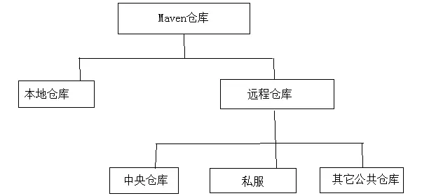
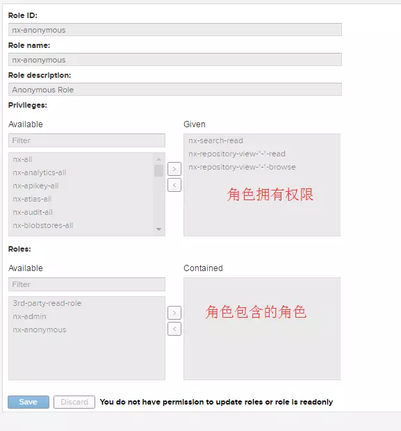
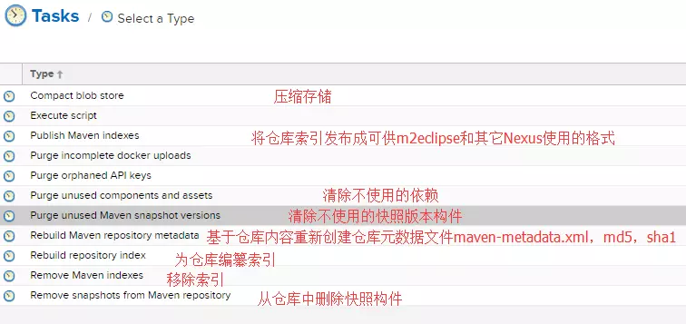

# Maven仓库
## 作用
仓库用来存储所有项目使用到构件，在maven项目需要依赖时就从该仓库中获取需要的依赖添加到classpath供其使用。
maven项目不再各自存储其依赖文件，它们只需要声明这些依赖的坐标，在需要的时候（例如，编译项目的时候需要将依赖加入到classpath中），Maven会自动根据坐标到仓库中找构件，并使用它们。

## 路径规则
- groupId/artifactId/version/artifactId-verson.packaging。
- 比如：log4j:log4j:1.2.15这一依赖，在仓库的对应路径为： log4j/log4j/1.2.15/log4j-1.2.15.jar。

## 分类

仓库分为两种，远程仓库和本地仓库，maven根据坐标寻找构件时，会先在本地仓库查找，本地找不到会到远程仓库查找，找到后会下载到本地仓库，如果本地和远程仓库都找不到就会报错。

- 本地仓库
本地仓库默认位置在${user.home}/.m2/repository目录下。我的用户名为enter，则本地仓库地址为C:\Users\enter\.m2\repository\，而Linux上的本地仓库地址为home/enter/.m2/repository/注意Liunx中以点（.）开头的文件或目录默认隐藏的，可以使用ls-a命令查看。

修改本地仓库地址：setting.xml文件
```
<localRepository>D:\repository</localRepository>
```
添加构件到本地仓库
1. 通过在项目的pom中配置依赖，dependency下载需要的依赖到本地仓库
2. 在某个maven项目根目录下执行：mvn clean install命令就可以把项目以构件形式安装到本地仓库中。（部署到私服上执行mvn clean deploy后面讲）
3. 第三方，只是一个jar包，出现这种情况：别人开发好的一个jar包，但是没有发布到maven中央仓库中，我需要在maven项目中使用，所以，我们可以通过命令将该jar包添加到本地仓库中，这样就可以在项目中声明使用了，声明一个构件当然需要groupId\artifactId、version。
需求：把jar：g:\edu.mit.jwi_2.3.3_jdk.jar 安装到本地仓库，并且自定义它的gourpId=local.edu.stanford; artifactId=edu.mit.jwi_jdk；version=2.3.3；packaging =jar
[install:install-file](http://maven.apache.org/plugins/maven-install-plugin/install-file-mojo.html)
```
mvn install:install-file -Dfile=g:\edu.mit.jwi_2.3.3_jdk.jar -DgroupId=local.edu.stanford -DartifactId=edu.mit.jwi_jdk -Dversion=2.3.3 -Dpackaging=jar  -DpomFile=g:\pom.xml
```
- 远程仓库
对maven来说，每个用户只有一个本地仓库，但可以配置访问很多远程仓库
 - 1. 中央仓库
 由于最原始的本地仓库是空的，Maven必须知道至少一个可用的远程仓库，才能在执行maven命令的时候下载需要的构件。中央仓库就是这样一个默认的远程仓库，中央仓库的信息在超级Pom中配置，所有的maven项目都会继承超级POM,超级POM的位置：$M2_HOME/lib/maven-model-builder-3.0.jar，然后访问路径org/apache/maven/model/pom-4.0.0.xml，可以看到配置：
 ```xml
 <repositories>
    <repository>
      <id>central</id>
      <name>Central Repository</name>
      <url>https://repo.maven.apache.org/maven2</url>
      <layout>default</layout>
      <snapshots>
        <enabled>false</enabled>
      </snapshots>
    </repository>
  </repositories>
 ```
 使用id=central对仓库进行唯一标识；name仓库名称；url仓库地址；layout=default指定仓库的布局，default也就是上面提到布局规则；**enabled=false表示不从该中央仓库下载快照版本的构件**。
 - 2. 私服
私服是一种特殊的远程仓库，为了节省带宽时间，应该在局域网内假设一个私有的仓库服务器，用其代理所有外部的远程仓库，内部项目在本地找不到时就到私服上下载，因为是公司内部网络下载起来就好很快，如果私服上没有，私服就会通过代理去下载。内部的项目还能部署到私服上供其他项目使用。
架设私服的好处:
- **节省资金的外网带宽**，利用私服代理外部仓库之后，对外的重复构件下载便得以下手，降低外网带宽压力。

- **加速Maven构建**。不停地连接请求外部仓库是什么耗时的，但是maven的一些内部机制（如快照更新检查）要求Maven在执行构建的时候不停地检查远程仓库数据。因此，当项目配置了很多外部远程仓库的时候，构建速度会降低。使用私服解决这问题，因为Maven只需要检查局域网内私服的数据时，构建速度便提高。

- **部署第三方构件**，当某个构件无法从任何一个远程仓库获取怎么办？比如Oracle的JDBC驱动由于版权原因不能发布到公共仓库中。建立私服后，便可以将这些构件部署到这个内部仓库中，供内部Maven项目使用。

- **提高稳定性，增强控制**。对于远程仓库当外网不可用时，maven构建有可能因为依赖没有下载而不可行，私服后，即使没有网，如果该构件只有之前被其它人下载过就会存在私服上，此时我下时就可以不用连接外网直接就可以从私服上下载到。同时私服软件（nexus)还提供了额外的管理功能。

- **降低中央仓库的负荷**。

- 3. 其它公开的远程仓库
常见的有JBoss Maven库和Java.net Maven库等。

https://help.aliyun.com/document_detail/102512.html

#### 远程仓库配置
```xml
<repositories>
<repository>
    <id>alipublic</id>
    <name>aliyun public</name>
    <url>https://maven.aliyun.com/repository/public</url>
    <layout>default</layout>
    <releases>
        <enabled>true</enabled>
        <updataPolicy>daily</updataPolicy>
        <checksumPolicy>warn</checksumPolicy>
    </releases>
    <snapshots>
        <enabled>false</enabled>
        <updataPolicy>daily</updataPolicy>
        <checksumPolicy>warn</checksumPolicy>
    </snapshots>
</repository>
</repositories>
```
- updataPolicy:配置maven从远程仓库检查更新的频率，对同一个版本（如：log4j.1.2.15.jar）的构件如果发现有更新（如：对log4j.1.2.15.jar进行了内容修复但是版本都不变）会下载最新的。默认daily-maven每天检查一次
never-从不检查；always-每次构件都要检查更新；interval:X -每隔X分钟检查一次更新（X为整数）
当然：用户可以使用参数-U,强制检查更新，使用参数后，maven就会忽略updatePolicy的配置。

- checksumPolicy:用来配置Maven检查校验和文件失败后的策略。构件被部署到maven仓库中时会同时部署对应的校验和文件，maven会验证校验和文件以确定下载的构件是否完整，如果校验失败，怎么办？策略有3中：(默认值)warn-maven会执行构建时输出警告信息；fail-maven遇到校验和错处就让构建失败；ignore-使maven完全忽略校验和错误。

#### 远程仓库的认证
有时候处于安全考虑，需要提供认证信息才能访问一些远程仓库。为了能让maven访问仓库内容，就需要配置认证信息，认证信息的配置不会在pom.xml配置，而是在settings.xml中配置，因为pom会被提交到代码仓库中供所有成员访问，而settings.xml一般只放在本机。

假设我在pom.xml中配置id=my-proj的远程仓库，需要认证信息，则在settings.xml中配置如下：
```xml
<settings>
   <servers>
    <server>  
          <id>my-proj</id>  
          <username>repo-user</username>  
          <password>repo-pwd</password>  
       </server>  
   </servers>
</settings>
```
#### 部署当前maven项目至远程仓库(私服上或者其他的远程仓库)
1. 配置pom.xml
```xml
<distributionManagement>
    <repository>
        <id>proj-releases</id>
        <name>Proj Release Repository</name>
        <url>http://192.168.1.100/content/repositories/proj-releases</url>
    </repository>
    <snapshotRepository>
        <id>proj-snapshots</id>
        <name>Proj Snapshot Repository</name>
        <url>http://192.168.1.100/content/repositories/proj-snapshots</url>
    </snapshotRepository>
  </distributionManagement>
```
2. 配置settings.xml
往仓库部署构件往往需要认证，配置方式如上面所讲，只需要配置settings.xml中的server元素。同时其id要与仓库id匹配。不论部署还是下载构件，当需要认证时配置方式一样。
3. 使用部署命令
在命令行运行 mvn clean deploy。Maven就会将项目构建输出的构件部署到配置对应的远程仓库，如果项目版本是快照版本就部署到快照版本仓库地址，同理发布版本仓库地址。

#### 快照机制
快照版只应该在公司内部项目使用，因为项目成员对不同的模块有清晰的理解和控制。项目不应该依赖第三方的快照版构件。那样存在不受控制和不稳定性。

将模块A的版本设定为2.1-SNAPSHOT，然后发布到私服中，在发布过程中maven会自动为构件打上时间戳，比如2.1-20191119-105936-12:表示2019年11月19号10点59分36秒第12次修改，有了该时间戳，Maven就能随时找到该仓库中该构件2.1-SNAPSHOT的最新构件。也就是2.1-SNAPSHOT对应了许多带有不同时间戳的构件。
配置对于模块A的2.1-SNAPSHOT版本，当构建模块B时发现有更新便进行下载，默认情况下，maven每天检查一次更新（由仓库配置的updataPolicy控制，上面有讲），也可以使用命令行-U参数强制maven更新，如：mvn clean install-U。
基于快照机制,就不用不断的修改版本.

#### Maven是根据怎样的规则从仓库解析并使用依赖构件的呢？
1. 解析构件步骤
1.1 当依赖范围是system时候，Maven直接从本地文件解析构件。
1.2 根据依赖坐标计算仓库路径后，先从本地仓库寻找构件，如果发现则解析成功。
1.3 本地仓库没找到，如果依赖版本(version)是发布版构件，即1.2,2.3等，则遍历远程仓库，发现后下载并解析使用。
1.4 如果version是SNAPSHOT版，如：2.1-SNAPSHOT，则基于更新策略（updatepolicy）读取所有远程仓库的元数据groupId/artifactId/version/maven-metadata.xml，将其与本地仓库的对应元数据合并后，得到最新快照版本的值，然后基于该值检查本地仓库，或者从远程仓库下载。（如果最新版还是之前的值就不需要去远程仓库下载了）。
1.5 如果最后解析得到构件版本是时间戳格式的快照，如1.4.1-20161121.121432-121则复制其时间戳格式的文件至非时间戳格式，如SNAPSHOT，并使用该时间戳格式的构件。
1.6 当依赖的version值为RELEASE时（不建议），Maven会基于updatepolicy策略读取远程仓库的元数据groupId/artifactId/maven-metadata.xml，将其与本地仓库相对应元数据合并后，计算出最新版本的RELEASE值（稳定版），然后基于这个值检查本地和远程仓库，步骤如2和3。

## 镜像
如果仓库X可以提供仓库Y存储的所有内容，那么就可以认为X是Y的一个镜像。举个栗子：http://maven.net.cn/content/groups/public/ 是中央仓库http://repol.maven.org/maven2/ 在中国的镜像，由于地理位置原因，该镜像提供的下载服务更快。因此可以配置maven使用该镜像来替代中央仓库，编辑settings.xml。
```xml
<settings>
  <mirrors>   
    <mirror>
		<id>alimaven</id>
		<name>aliyun maven</name>
		<url>http://maven.aliyun.com/nexus/content/groups/public/</url>
		<mirrorOf>central</mirrorOf>
	</mirror>
  </mirrors>
</settings>
```

mirrorOf为central，表示该配置为中央仓库的镜像,任何对于中央仓库的请求都会转至该镜像
```
<mirrorOf>*</mirrorOf> ：匹配所有远程仓库。
<mirrorOf>external:*</mirrorOf> ：匹配所有远程仓库，使用localhost的除外，使用file://协议的除外。
<mirrorOf>repo1,repo2</mirrorOf> ：匹配仓库repo1,repo2，多个使用逗号分隔。
<mirrorOf>*,!repo1</mirrorOf> ：匹配所有远程仓库，repo1除外。
```
maven获取真正起作用的repository集合流程：首先会获取pom.xml里的repository集合，然后在settings.xml里找mirrors元素，
如果repository的id和mirror的mirrorOf的值相同，则该mirror替代该repository，
如果该repository找不到对应的mirror，
则使用其本身，依此可以得到最终起作用的repository集合，
repositories中默认包含了中央仓库central，当然也可以重新它的url；
可以理解mirror是复写了对应id的repository

mirror相当于一个拦截器，它会拦截maven对remote repository的相关请求，把请求里的remote repository地址，重定向到mirror里配置的地址。


## Maven私服比较
产品|厂商|备注
--|--|--|--
Apache|Archiva|https://github.com/apache/archiva
JFrog|Artifactory|最早的仓库管理软件 [开源版本](https://www.jfrogchina.com/open-source/),[官网](https://jfrog.com/artifactory/) 
Sonatype|Nexus |最流行 [oss版本开源](https://github.com/sonatype/nexus-public) , [官网](https://www.sonatype.com/nexus-repository-oss)

## Nexus功能点
- **代理远程仓库**。配置Nexus代理中央仓库，其它任何公开的Maven仓库，将你组织内部的Maven配置指向Nexus，这样所有构件都将从Nexus下载，如果Nexus没有你要的构件，它会自动先去外部仓库下载到本地，仅一次。
- **本地宿主仓库**。Nexus可以在服务器上建立本地的宿主仓库，你可以往这个仓库里提交任意的Maven规范构件，包括不能从公开仓库下载到的构件，或者你组织内部产生的构件。
- **仓库组**。有了仓库组，你就能将很多仓库聚合起来，对外公开一个统一的接口提供构件服务。
- **构件搜索**。Nexus能下载远程的仓库索引，并在本地构件自己的仓库索引，有了该索引，你就能很快速方便的搜索任何你感兴趣的构件。
- **RSS源**。Nexus服务器上发生的几乎任何事情，你都能用RSS监视，方便管理。
- **Release和Snapshots区分**。配置Nexus提供Release构件服务或者Snapshots服务，能更清晰的管理构件。
- **路由**。Nexus的路由能够管理为特定的请求提供特定的仓库。加入你在一个组中配置了很多仓库，一条路由能够极大提高某些特定请求的响应速度。
- **上传构件**。使用Nexus你能很方便的在web界面上上传一些特殊的构件至仓库。
- **较小的内存占用（最少28MB)**。
- **细粒度的安全控制**。
- **支持多储存库格式**（Bower,Docker,Git LFS,Maven,npm,NuGet， PyPI,Ruby Gems,Yum,APT,Conan*,R*,CPAN*,Raw (Universal),P2*,Helm*,ELPA*,Go）
## 下载和安装Nexus3.X
下载：https://www.sonatype.com/download-oss-sonatype
文档：https://help.sonatype.com/repomanager3
解压后包含两个目录：
1. nexus-3.19.1-01 安装目录
该目录包含了Nexus运行所需要的文件，如启动脚本，依赖jar包等。
2. sonatype-work 数据目录
该目录包含Nexus生成的配置文件、日志、仓库文件等。（需要备份时备份该目录就行）

##### Windows安装
[linux安装参考](https://help.sonatype.com/repomanager3/installation/run-as-a-service)

- 配置bin目录下nexus.vmoptions文件，适当调整内存参数，防止占用内存太大
```
-Xms600m
-Xmx600m
-XX:MaxDirectMemorySize=1G
```
- etc目录下nexus-default.properties文件可配置默认端口和host及访问根目录。

1. 直接运行
nexus.exe /run
2. 服务安装
nexus.exe /install nexus
nexus.exe /start optional-service-name
nexus.exe /stop optional-service-name
nexus.exe /uninstall optional-service-name


#### 使用
http://127.0.0.1:8081/
默认两个用户：admin和anonymous
admin 密码在admin.passworld下

初次使用需要设置下是否能够匿名下载(也可以后面设置)
Configure Anonymous Access
Enabling anonymous access will allow unauthenticated downloads, browsing, and searching of repository content by default. Permissions for unauthenticated users can be changed by editing the roles assigned to the anonymous user.
- **Nexus的Repository**
http://127.0.0.1:8081/#admin/repository
1. **Repository -> Repositories**
仓库分为三种：Proxy、hosted、group
1.1 Proxy
这里就是代理的意思，代理中央Maven仓库，当PC访问中央库的时候，先通过Proxy下载到Nexus仓库，然后再从Nexus仓库下载到PC本地。这样的优势只要其中一个人从中央库下来了，以后大家都是从Nexus私服上进行下来，私服一般部署在内网，这样大大节约的宽带。
1.2 Hosted
Hosted是宿主机的意思，用于将第三方的Jar或者我们自己的jar放到私服上。
Hosted有三种方式，Releases、SNAPSHOT、Mixed
Releases: 一般是已经发布的Jar包
Snapshot: 未发布的版本
Mixed：混合的,可包含release和snapshot版本
Hosted的创建和Proxy类似，类型需选择maven2(hosted)。
**注意**：Deployment Pollcy，我们需要把策略改成“Allow redeploy”，以允许重复发布覆盖同版本的jar包。
1.3 Group
能把多个仓库合成一个仓库来使用
2. **Repository -> Blob**
存储
E:\maven\nexus3.x\sonatype-work\nexus3\blobs\default

- **Nexus的Security**
包含用户、角色、权限的配置。操作权限完全仿照RBAC角色权限模型
1. **Security -> Privileges**
数据权限：repository权限有两种类型，repository admin和repository view，每种类型又有6种权限标识，分别是：*，add，browse、delete、edit、read，*包含其它5种权限，也可以自定义操作标识，正常系统的生成权限足够使用
2. **Security -> Roles**
用户角色，新建一个角色，指定该角色可对哪些库进行哪些操作

3. **Security -> Users**
因为默认的anonymous游客用户只能查看无法部署jar，而admin是管理员身份主要用于配置nexus，所以新建一个可以部署查看jar但不能配置nexus的用户
4. **Security -> anonymous**
普通未登录用户，都是游客用户，正常如果想要下载依赖，需要勾上Allow access
为了安全性需要控制外界游客用户对私库的访问：Users - anonymous  将Status设置为Disabled


- **Nexus的Support**
包含日志及数据分析。
- **Nexus的System**
包含API（swagger做的）、邮件服务器，设置调度任务等。
1. **System -> Tasks**
定时任务Tasks,如：定期清理过期不使用快照版依赖（选择Maven - Delete unused SNAPSHOT）,周期：每天、每周、手动等

## 配置
- 方法一: 在setting中配置访问私服
```xml
<settings>
 ...
    <!--配置Nexus仓库-->
    <profile>
       <id>nexus</id>
       <repositories>
        <repository>
          <id>nexus</id>
          <name>Nexus Repository</name>
          <url>http://localhost:8081/repository/maven-public/</url>
          <layout>default</layout>
          <snapshots>
            <enabled>true</enabled>
          </snapshots>
         <releases>
            <enabled>true</enabled>
          </releases>
        </repository>
      </repositories>

      <pluginRepositories>
        <pluginRepository>
            <id>nexus</id>
            <name>Nexus Repository</name>
            <url>http://localhost:8081/repository/maven-public/</url>
            <layout>default</layout>
            <snapshots>
              <enabled>true</enabled>
            </snapshots>
            <releases>
              <enabled>true</enabled>
            </releases>
        </pluginRepository>
      </pluginRepositories>
    </profile>
  </profiles>
  <!--激活Nexus仓库配置  -->
  <activeProfiles>
    <activeProfile>nexus</activeProfile>
  </activeProfiles>
...
</settings>
```
- 方法二:同样在settings.xml中配置镜像（推荐）

```xml
<settings>
 ...

    <!--配置镜像-->
 <mirror>
      <id>nexus</id>
      <mirrorOf>*</mirrorOf>
      <name>nexus mirror for all repositry</name>
      <url>http://localhost:8081/repository/maven-public/</url>
    </mirror>
    <!--配置Nexus仓库-->
    <profile>
       <id>nexus</id>
       <repositories>
        <repository>
          <id>central</id>
          <name>Central Repository</name>
          <url>https://repo.maven.apache.org/maven2</url>
          <layout>default</layout>
          <snapshots><enabled>true</enabled>  </snapshots>
         <releases><enabled>true</enabled>  </releases>
        </repository>
      </repositories>

      <pluginRepositories>
        <pluginRepository>
            <id>central</id>
            <name>Central pluginRepository</name>
            <url>https://repo.maven.apache.org/maven2</url>
            <layout>default</layout>
            <snapshots><enabled>true</enabled></snapshots>
            <releases><enabled>true</enabled></releases>
        </pluginRepository>
      </pluginRepositories>
    </profile>
  </profiles>
  <!--激活Nexus仓库配置  -->
  <activeProfiles>
    <activeProfile>nexus</activeProfile>
  </activeProfiles>
...
</settings>
```


## 部署Maven项目构件至Nexus
pom最后添加如下配置，注意repository的id需要和settings中server的id一致，也就是以server指定的用户登录进行上传部署，普通游客没有权限部署，部署命令：mvn clean deploy
1. 配置项目pom
```xml
<!--配置项目生成的构件部署到Nexus私服上 -->
  <distributionManagement>
    <repository>
        <id>nexus-releases</id>
        <name>Nexus ReleaseRepository</name>    
        <url>http://localhost:8081/repository/maven-releases/</url>
    </repository>
    <snapshotRepository>
        <id>nexus-snapshots</id>
        <name>Nexus SnapshotsRepository</name>      
        <url>http://localhost:8081/repository/maven-snapshots/</url>
    </snapshotRepository>
  </distributionManagement>
```
2. 在settings.xml配置仓库认证信息
```xml
<settings>
 ....
  <servers>
 <!--配置nexus仓库认证信息-->
    <server>  
        <id>nexus-releases</id>  
        <username>admin</username>  
        <password>****</password>  
    </server>  
    <server>  
        <id>nexus-snapshots</id>  
        <username>admin</username>  
        <password>****</password>  
    </server>  
  </servers>
...
</settings>
```
3. 使用mvn命令
在项目根目录下执行部署命令，或者在开发工具中执行部署命令
```
mvn clean deploy
```

## 手动部署第三方构件至Nexus仓库
对于一些开源或者有版权的jar文件，他们在远程仓库没有，所以只能将他们先下载下来，再手动上传到nexus私服上。
1. 新建hosted仓库3rd-party
http://localhost:8081/repository/3rd-party/
2. 在settings.xml配置3rd-party仓库认证信息
```xml
<server>  
    <id>nexus-3rd-party</id>  
    <username>admin</username>  
    <password>admin123</password>  
</server>
```
3. 命令行部署到nexus上
```
mvn deploy:deploy-file  -Dfile=G:\5jar\edu.mit.jwi_2.3.3_jdk.jar -DgroupId=local.edu.stanford -DartifactId=edu.mit.jwi_jdk -Dversion=2.3.3 -Dpackaging=jar    -Durl=http://localhost:8081/repository/3rd-party/ -DrepositoryId=nexus-3rd-party

# 部署到本地仓库
mvn install:install-file -Dfile=g:\edu.mit.jwi_2.3.3_jdk.jar -DgroupId=local.edu.stanford -DartifactId=edu.mit.jwi_jdk -Dversion=2.3.3 -Dpackaging=jar  -DpomFile=g:\pom.xml
```
