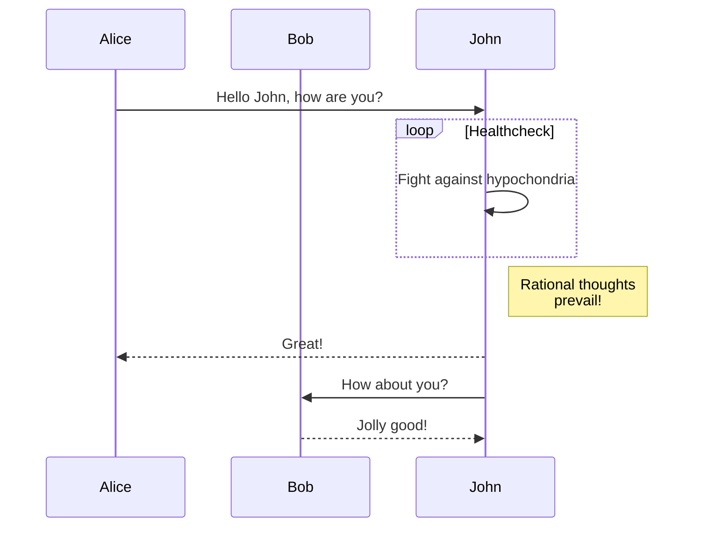
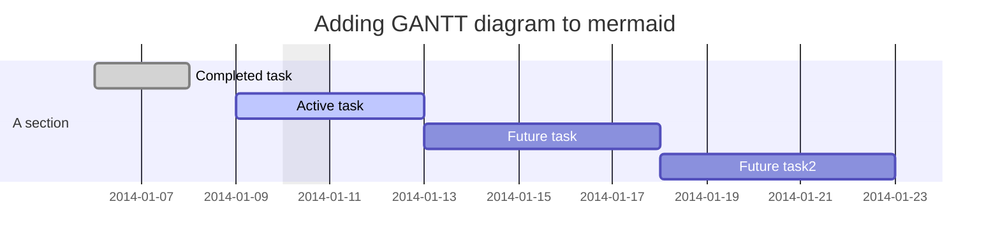
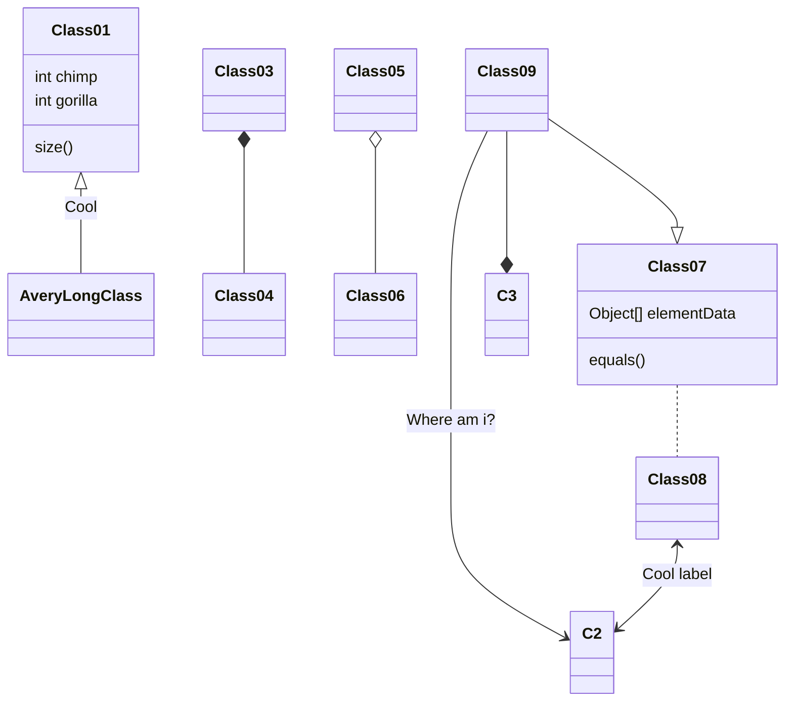

# Mark流程图语法

领域专用语言（DSL）(Domain Specific Language)

DOT语言：图形描述语言

https://github.com/dreampuf/GraphvizOnline
Graphviz绘图：一款开源图形可视化软件

https://gitlab.com/graphviz/graphviz
https://graphviz.gitlab.io/about/
Graphviz 有 6 个引擎，分别是：
1. dot - “层次”或有向图的分层绘图。如果边具有方向性，这是默认使用的工具。
2. neato - “spring model” 布局。如果图不是太大(大约 100 个节点)，而且您对它一无所知，那么这是默认的工具。Neato 试图最小化一个全局能量函数，它相当于统计多维尺度。
3. fdp - “spring model”的布局类似于neato，但它是通过减少力而不是利用能量来实现的。
4. sfdp - fdp 的多尺度版本，用于大图形的布局。
5. twopi - 径向布局，after Graham Wills 97。节点被放置在同心圆上，这取决于它们与给定根节点的距离。
6. circo - 圆形布局，after Six and Tollis 99, Kauffman and Wiese 02。这适用于多个循环结构的某些图，例如某些电信网络。

https://github.com/structurizr/dotnet
可以导出到PlantUML和 [DGML](https://github.com/MicrosoftDocs/visualstudio-docs/blob/master/docs/modeling/directed-graph-markup-language-dgml-reference.md)

  DGML是Directed Graph Markup Language的缩写，中文应该翻译为“有向图标记语言”。 DGML是微软在Visual Studio 2010中开始引入的一种完全符合XML格式语言，它主要是用来描述循环（cyclical）和非循环（acyclic）的有向图。有向图是由一系列的由边（link/edge）进行互联的节点（node）组成。

[flowchat](http://flowchart.js.org/)
[Sequence](https://bramp.github.io/js-sequence-diagrams/)
[Mermaid](https://mermaid-js.github.io/mermaid/#/)
[PlantUML](https://plantuml.com/zh/)

Diagrams： https://diagrams.mingrammer.com/
Structurizr DSL ：https://structurizr.com/dsl  https://github.com/structurizr/dsl
Asciidoctor Diagram：https://github.com/asciidoctor/asciidoctor-diagram
WebSequenceDiagrams： https://www.websequencediagrams.com/
ilograph：http://app.ilograph.com/

### flowchart.js

```flow
st=>start: 开始
e=>end: 结束
op=>operation: 操作
sub=>subroutine: 子程序
cond=>condition: 是或者不是?
io=>inputoutput: 输出

st(right)->op->cond
cond(yes)->io(right)->e
cond(no)->sub(right)->op
```

```flow
st=>start: Start
e=>end: End
op1=>operation: My Operation
op2=>operation: Stuff
sub1=>subroutine: My Subroutine
cond=>condition: Yes
or No?
c2=>condition: Good idea
io=>inputoutput: catch something...

st->op1(right)->cond
cond(yes, right)->c2
cond(no)->sub1(left)->op1
c2(yes)->io->e
c2(no)->op2->e
```
### mermaid

[在线](https://mermaid.live/)


顺序图



甘特图



类图-：实验性



### js-sequence
总结来说js-sequence模块对sequence代码的语法解析执行过程如下图


```sequence
title: 序列图sequence(示例)
participant A
participant B
participant C

note left of A: A左侧说明
note over B: 覆盖B的说明
note right of C: C右侧说明

A->A:自己到自己
A->B:实线实箭头
A-->C:虚线实箭头
B->>C:实线虚箭头
B-->>A:虚线虚箭头
```


```sequence

颜回->孔子: 吃饭了没？
note right of 孔子: 孔子思考\n如何回答
孔子-->颜回: 吃过了。你咧？
颜回->>孔子: 吃过了，吃过了！

```
