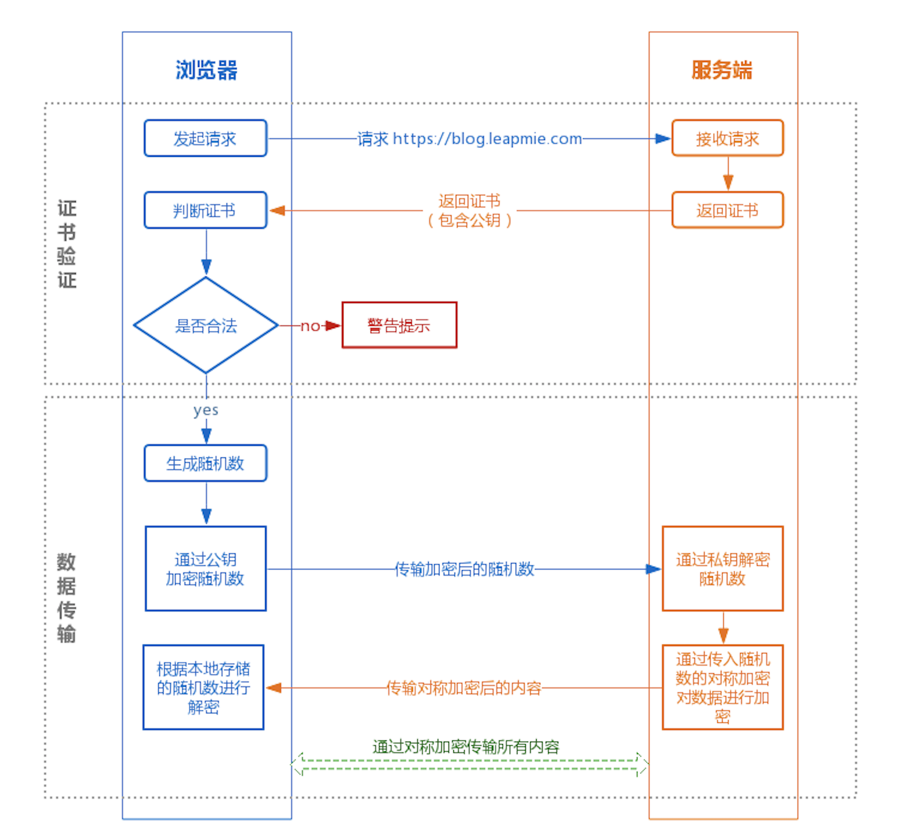
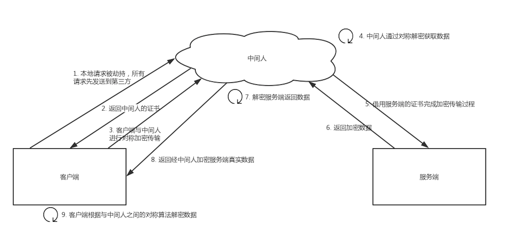
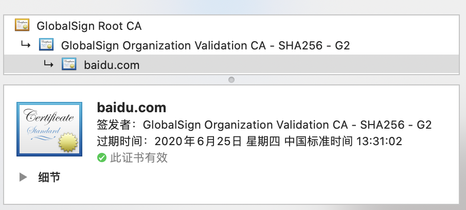
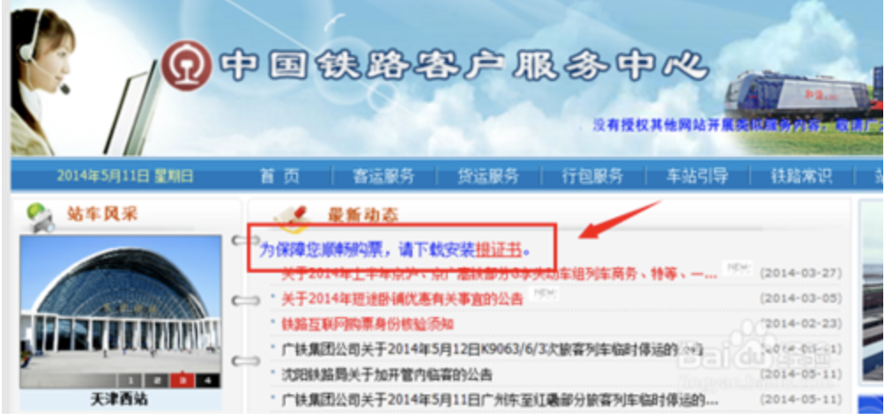
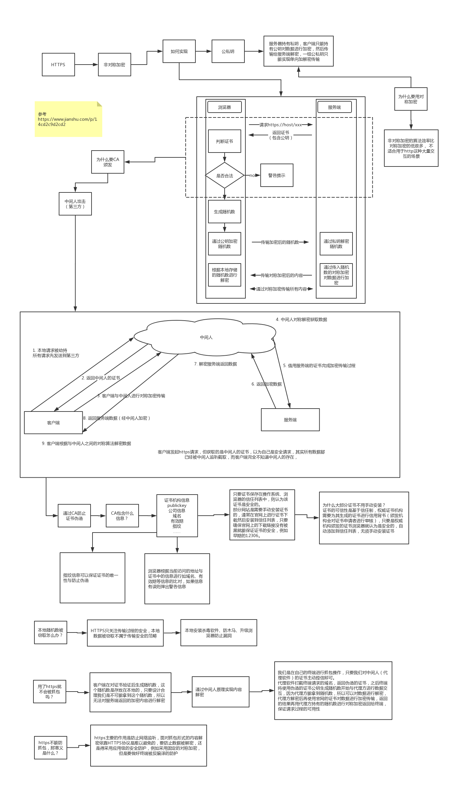

<!--toc-->
[TOC]
# HTTPS 原理分析——带着疑问层层深入

## HTTPS

随着 HTTPS 建站的成本下降，现在大部分的网站都已经开始用上 HTTPS 协议。大家都知道 HTTPS 比 HTTP 安全，也听说过与 HTTPS 协议相关的概念有 SSL 、非对称加密、 CA证书等，但对于以下灵魂三拷问可能就答不上了：

1.  为什么用了 HTTPS 就是安全的？
2.  HTTPS 的底层原理如何实现？
3.  用了 HTTPS 就一定安全吗？

本文将层层深入，从原理上把 HTTPS 的安全性讲透。

## HTTPS 的实现原理

大家可能都听说过 HTTPS 协议之所以是安全的是因为 HTTPS 协议会对传输的数据进行加密，而加密过程是使用了非对称加密实现。但其实，HTTPS 在内容传输的加密上使用的是对称加密，非对称加密只作用在证书验证阶段。

HTTPS的整体过程分为证书验证和数据传输阶段，具体的交互过程如下：

**① 证书验证阶段**

1.  浏览器发起 HTTPS 请求
2.  服务端返回 HTTPS 证书
3.  客户端验证证书是否合法，如果不合法则提示告警

**② 数据传输阶段**

1.  当证书验证合法后，在本地生成随机数
2.  通过公钥加密随机数，并把加密后的随机数传输到服务端
3.  服务端通过私钥对随机数进行解密
4.  服务端通过客户端传入的随机数构造对称加密算法，对返回结果内容进行加密后传输

### 为什么数据传输是用对称加密？

首先，非对称加密的加解密效率是非常低的，而 http 的应用场景中通常端与端之间存在大量的交互，非对称加密的效率是无法接受的；

另外，在 HTTPS 的场景中只有服务端保存了私钥，一对公私钥只能实现单向的加解密，所以 HTTPS 中内容传输加密采取的是对称加密，而不是非对称加密。

### 为什么需要 CA 认证机构颁发证书？

HTTP 协议被认为不安全是因为传输过程容易被监听者勾线监听、伪造服务器，而 HTTPS 协议主要解决的便是网络传输的安全性问题。

首先我们假设不存在认证机构，任何人都可以制作证书，这带来的安全风险便是经典的**“中间人攻击”**问题。  
“中间人攻击”的具体过程如下：

过程原理：

1.  本地请求被劫持（如DNS劫持等），所有请求均发送到中间人的服务器
2.  中间人服务器返回中间人自己的证书
3.  客户端创建随机数，通过中间人证书的公钥对随机数加密后传送给中间人，然后凭随机数构造对称加密对传输内容进行加密传输
4.  中间人因为拥有客户端的随机数，可以通过对称加密算法进行内容解密
5.  中间人以客户端的请求内容再向正规网站发起请求
6.  因为中间人与服务器的通信过程是合法的，正规网站通过建立的安全通道返回加密后的数据
7.  中间人凭借与正规网站建立的对称加密算法对内容进行解密
8.  中间人通过与客户端建立的对称加密算法对正规内容返回的数据进行加密传输
9.  客户端通过与中间人建立的对称加密算法对返回结果数据进行解密

由于缺少对证书的验证，所以客户端虽然发起的是 HTTPS 请求，但客户端完全不知道自己的网络已被拦截，传输内容被中间人全部窃取。

### 浏览器是如何确保 CA 证书的合法性？

#### 1. 证书包含什么信息？

*   颁发机构信息
*   公钥
*   公司信息
*   域名
*   有效期
*   指纹
*   ……

#### 2. 证书的合法性依据是什么？

首先，权威机构是要有认证的，不是随便一个机构都有资格颁发证书，不然也不叫做权威机构。另外，证书的可信性基于信任制，权威机构需要对其颁发的证书进行信用背书，只要是权威机构生成的证书，我们就认为是合法的。所以权威机构会对申请者的信息进行审核，不同等级的权威机构对审核的要求也不一样，于是证书也分为免费的、便宜的和贵的。

#### 3. 浏览器如何验证证书的合法性？

浏览器发起 HTTPS 请求时，服务器会返回网站的 SSL 证书，浏览器需要对证书做以下验证：

1.  验证域名、有效期等信息是否正确。证书上都有包含这些信息，比较容易完成验证；
2.  判断证书来源是否合法。每份签发证书都可以根据验证链查找到对应的根证书，操作系统、浏览器会在本地存储权威机构的根证书，利用本地根证书可以对对应机构签发证书完成来源验证；  
  
3.  判断证书是否被篡改。需要与 CA 服务器进行校验；
4.  判断证书是否已吊销。通过CRL（Certificate Revocation List 证书注销列表）和 OCSP（Online Certificate Status Protocol 在线证书状态协议）实现，其中 OCSP 可用于第3步中以减少与 CA 服务器的交互，提高验证效率

以上任意一步都满足的情况下浏览器才认为证书是合法的。

> 这里插一个我想了很久的但其实答案很简单的问题：  
> 既然证书是公开的，如果要发起中间人攻击，我在官网上下载一份证书作为我的服务器证书，那客户端肯定会认同这个证书是合法的，如何避免这种证书冒用的情况？  
> 其实这就是非加密对称中公私钥的用处，虽然中间人可以得到证书，但私钥是无法获取的，一份公钥是不可能推算出其对应的私钥，中间人即使拿到证书也无法伪装成合法服务端，因为无法对客户端传入的加密数据进行解密。

#### 4. 只有认证机构可以生成证书吗？

如果需要浏览器不提示安全风险，那只能使用认证机构签发的证书。但浏览器通常只是提示安全风险，并不限制网站不能访问，所以从技术上谁都可以生成证书，只要有证书就可以完成网站的 HTTPS 传输。例如早期的 12306 采用的便是手动安装私有证书的形式实现 HTTPS 访问。  

  

### 本地随机数被窃取怎么办？

证书验证是采用非对称加密实现，但是传输过程是采用对称加密，而其中对称加密算法中重要的随机数是由本地生成并且存储于本地的，HTTPS 如何保证随机数不会被窃取？

其实 HTTPS 并不包含对随机数的安全保证，HTTPS 保证的只是传输过程安全，而随机数存储于本地，本地的安全属于另一安全范畴，应对的措施有安装杀毒软件、反木马、浏览器升级修复漏洞等。

## 用了 HTTPS 会被抓包吗？

HTTPS 的数据是加密的，常规下抓包工具代理请求后抓到的包内容是加密状态，无法直接查看。

但是，正如前文所说，浏览器只会提示安全风险，如果用户授权仍然可以继续访问网站，完成请求。因此，只要客户端是我们自己的终端，我们授权的情况下，便可以组建中间人网络，而抓包工具便是作为中间人的代理。通常 HTTPS 抓包工具的使用方法是会生成一个证书，用户需要手动把证书安装到客户端中，然后终端发起的所有请求通过该证书完成与抓包工具的交互，然后抓包工具再转发请求到服务器，最后把服务器返回的结果在控制台输出后再返回给终端，从而完成整个请求的闭环。

既然 HTTPS 不能防抓包，那 HTTPS 有什么意义？  
HTTPS 可以防止用户在不知情的情况下通信链路被监听，对于主动授信的抓包操作是不提供防护的，因为这个场景用户是已经对风险知情。要防止被抓包，需要采用应用级的安全防护，例如采用私有的对称加密，同时做好移动端的防反编译加固，防止本地算法被破解。

## 总结

以下用简短的Q&A形式进行全文总结：

Q: HTTPS 为什么安全？  
A: 因为 HTTPS 保证了传输安全，防止传输过程被监听、防止数据被窃取，可以确认网站的真实性。

Q: HTTPS 的传输过程是怎样的？  
A: 客户端发起 HTTPS 请求，服务端返回证书，客户端对证书进行验证，验证通过后本地生成用于改造对称加密算法的随机数，通过证书中的公钥对随机数进行加密传输到服务端，服务端接收后通过私钥解密得到随机数，之后的数据交互通过对称加密算法进行加解密。

Q: 为什么需要证书？  
A: 防止”中间人“攻击，同时可以为网站提供身份证明。

Q: 使用 HTTPS 会被抓包吗？  
A: 会被抓包，HTTPS 只防止用户在不知情的情况下通信被监听，如果用户主动授信，是可以构建“中间人”网络，代理软件可以对传输内容进行解密。

顺手 po 一张学习的过程图[HTTPS学习草稿图.jpg](../img/tcp/https-5.jpg)

[HTTPS 原理分析——带着疑问层层深入](https://blog.leapmie.com/archives/418)

[重磅！图文详解HTTPS协议通信全过程，结合抓包实战分析，带你一次看透HTTPS！](https://mp.weixin.qq.com/s?__biz=MzkyMTYyOTQ5NA==&mid=2247485189&idx=1&sn=8863060e62a3f3b13e67f4fadde2b704&chksm=c059bc76f0b7a2c2a33406317ae9d93e053a113ede92ee39f2f85236e07b2008f08d6082f9eb&mpshare=1&scene=1&srcid=0927ozvGDzoRDVFfGunGrv8b&sharer_shareinfo=7ad30ab36913b9c904b469ae4718aa57&sharer_shareinfo_first=7ad30ab36913b9c904b469ae4718aa57&from=industrynews&version=4.1.28.6010&platform=win&nwr_flag=1#wechat_redirect)

## 案列分析

### How does HTTPS work?
我们以curl请求HTTPS为例, 主要步骤:

1. curl命令发送HTTP请求：curl命令使用HTTP协议向HTTPS服务器发送请求。请求中包括请求方法（GET、POST等）、请求头、请求体和URL地址等信息。

2. HTTPS服务器响应请求：HTTPS服务器接收到curl命令发送的请求后，会进行解析并返回响应结果。响应结果包括状态码、响应头和响应体等信息。

3. SSL握手过程：在发送HTTPS请求之前，curl命令会与HTTPS服务器进行SSL握手过程。该过程包括以下步骤：

   a. curl命令向HTTPS服务器发送Client Hello消息，该消息包括curl命令支持的加密算法和协议版本等信息。

   b. HTTPS服务器收到Client Hello消息后，会向curl命令发送Server Hello消息，该消息包括HTTPS服务器选择的加密算法和协议版本等信息。

   c. HTTPS服务器向curl命令发送Certificate消息，该消息包括HTTPS服务器的公钥和证书等信息。

   d. curl命令验证证书：curl命令使用证书颁发机构（CA）的公钥验证证书的合法性，并从证书中提取HTTPS服务器的公钥。

   e. curl命令生成随机数：curl命令生成一个随机数，用于生成对称密钥。

   f. curl命令使用HTTPS服务器的公钥加密随机数，并将加密后的随机数发送给HTTPS服务器。

   g. HTTPS服务器收到加密后的随机数后，使用自己的私钥解密该随机数，并使用该随机数生成对称密钥。

4. curl命令发送加密请求：在SSL握手过程完成后，curl命令使用对称密钥加密HTTP请求，并将加密后的请求发送给HTTPS服务器。

5. HTTPS服务器解密请求并返回响应：HTTPS服务器使用对称密钥解密curl命令发送的请求，并返回响应结果。响应结果同样使用对称密钥加密后发送给curl命令。

6. curl命令解密响应：curl命令使用对称密钥解密HTTPS服务器返回的响应结果，并将解密后的响应结果显示在终端上。

