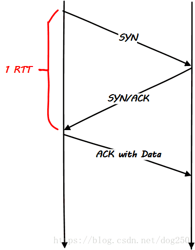
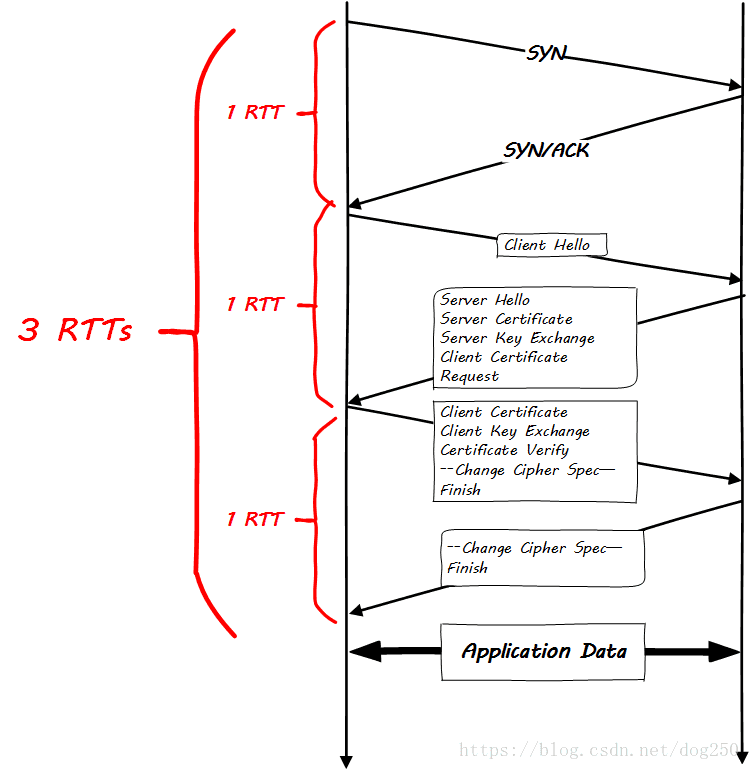

## RTT(Round Trip Time)




-|HTTP/2 OVER  TLS1.2首次连接	|HTTP/2 OVER TLS1.2连接复用	|HTTP/2 OVER TLS1.3首次连接	|HTTP/2 OVER TLS1.3连接复用
---|---|---|---|---|
DNS解析	|1-RTT	|0-RTT	|1-RTT	|0-RTT
TCP握手	|1-RTT	|0-RTT	|1-RTT	|0-RTT
TLS握手	|2-RTT	|1-RTT	|1-RTT	|0-RTT
HTTP Request	|1-RTT	|1-RTT	|1-RTT	|1-RTT
总计	|5RTT	|2-RTT	|4-RTT|	1-RTT


-|QUIC 首次连接 | QUIC 连接复用
---|---|---
QUIC握手|	1-RTT|0-RTT
HTTP Request|	1-RTT	|1-RTT
总计|3-RTT	|1-RTT
## 参考
[谷歌出品!读懂 QUIC 协议:更快、更高效的通信协议](https://developer.aliyun.com/article/1508757)

[QUIC协议是如何做到0RTT加密传输的(addons)](https://blog.csdn.net/dog250/article/details/80935534)

[TLS1.2 和 TLS1.3的简要区别](https://www.cnblogs.com/ToTigerMountain/articles/18220849)

## QUIC
**采用UDP传输层**： QUIC 使用UDP（用户数据报协议）作为传输层协议，与传统的TCP相比，UDP减少了连接建立的延迟。TCP需要经历三次握手来建立连接，这会引入1个往返时间（1-RTT）的延迟。相比之下，QUIC的UDP传输层减少了这个握手过程，从而减少了建立连接的时间。这有助于提高网络通信的效率，尤其是对于那些对延迟要求较高的应用程序。


**使用TLS 1.3协议**： QUIC集成了TLS（传输层安全性）协议的最新版本，即TLS 1.3。TLS 1.3具有改进的安全性和性能特性，其中一个显著的特点是支持1-RTT和0-RTT握手。传统的TLS握手需要多个往返时间（RTT），而QUIC协议通过TLS 1.3允许客户端在TLS握手完成之前发送应用程序数据。这意味着在第一次握手时需要1-RTT，但之后，已建立连接的客户端可以使用缓存的信息来快速恢复TLS连接，只需0-1 RTT。这显著减少了建立连接的时间，使数据能够更快地传输，特别是对于重复连接的情况。


QUIC协议的基本功能包括：

**独立的逻辑流**： QUIC允许在单个连接上并行传输多个逻辑数据流。每个数据流都是独立管理的，这意味着一个数据流的延迟或中断不会影响其他数据流的传输。这有助于提高网络效率，特别是在处理多个请求和响应时。
**一致的安全性**： QUIC提供端到端的安全性，所有数据在传输过程中都经过加密。默认情况下，QUIC使用TLS 1.3来建立安全连接，确保数据的机密性和完整性。这有助于保护通信免受窃听和篡改。
**低延迟**： QUIC旨在减少网络通信的延迟。它采用快速的连接建立过程，减少了握手时间，并通过多路复用和快速重传等机制降低了数据传输的延迟。这对于实时应用程序和减少页面加载时间非常重要。
**可靠性**： QUIC提供可靠的数据传输，确保数据的完整性和准确性。它具有丢包恢复和重传机制，以应对网络中可能发生的数据包丢失或损坏情况。这有助于防止数据损坏和丢失。
**避免HOL（Head-of-Line）阻塞**： QUIC通过允许多个数据流在单个连接上独立传输，解决了HOL阻塞问题。这意味着即使一个数据流遇到问题，其他数据流仍然可以继续传输，而不会受到影响。这有助于提高整体效率和性能。


QUIC 协议的核心特性
**0-RTT 连接建立**
- 0-RTT 是 QUIC 协议中的一项关键功能，它旨在降低连接建立时的延迟。传统的 TCP 连接需要经过三次握手（SYN，SYN-ACK，ACK）才能建立连接，而每个往返时间（Round-Trip Time，RTT）都会增加延迟。在某些情况下，这可能导致不必要的等待时间。
- QUIC 的 0-RTT 特性允许客户端在连接初始化过程中同时发送数据，而无需等待握手完成。这是通过在第一次连接中包含加密后的应用程序数据实现的。这种方式使得在建立连接后立即发送数据成为可能，从而显著减少了初始请求的延迟。这对于移动应用、网页加载速度和实时通信非常重要，因为它可以加速用户体验。

**无队头阻塞的多路复用**
- 多路复用是 QUIC 的另一个核心特性，旨在解决传统 HTTP/1.1 和 HTTP/2 中存在的队头阻塞问题。在传统的 HTTP 中，如果某个请求的响应出现延迟或丢失，它将阻塞后续请求的处理，从而导致页面加载速度变慢。
- QUIC 允许多个逻辑数据流通过单个连接并行传输。每个数据流都有其独立的流量控制和优先级，这意味着一个数据流的延迟不会影响其他数据流。这提高了网络效率，允许快速响应多个请求，从而改善了用户体验。这对于现代网站、应用程序和多媒体流式传输非常重要。


**无歧义重传**
- 无歧义重传是 QUIC 的重要特性，用于确保数据的可靠传输。在不稳定的网络环境中，数据包可能会丢失或损坏，因此需要一种机制来恢复丢失的数据而不引入重复数据。
- QUIC 使用序列号来唯一标识数据包，并在接收方接收到数据包后发送确认。如果发送方没有收到确认，它会重新发送数据包，但只会重传丢失的数据包。这种机制确保了可靠的数据传输，而不会引入不必要的重传，从而提高了效率。
- 此外，QUIC 还支持拥塞控制，它可以根据网络条件调整数据包的发送速率，以避免网络拥塞。这有助于保持网络的稳定性和性能。


### Connection ID
相较于TCP/IP使用五元组标识一条连接，QIUC在Connection层采用客户端随机产生的64位随机数作为Connection ID标识连接，这样IP或者端口发生变化时，只要ID 不变，这条连接依然维持，可以做到连接平滑迁移。
连接建立时使用UDP端口号来识别指定机器上的特定server，而一旦建立，连接通过其connection ID关联。


连接迁移  
QUIC通过连接ID实现了连接迁移。

我们经常需要在WiFi和4G之间进行切换，比如我们在家里时使用WiFi，出门在路上，切换到4G或5G，到了商场，又连上了商场的WiFi，到了餐厅，又切换到了餐厅的WiFi，所以我们的日常生活中需要经常性的切换网络，那每一次的切换网络，都将导致我们的IP地址发生变化。

传统的TCP协议是以四元组（源IP地址、源端口号、目的ID地址、目的端口号）来标识一条连接，那么一旦四元组的任何一个元素发生了改变，这条连接就会断掉，那么这条连接中正在传输的数据就会断掉，切换到新的网络后可能需要重新去建立连接，然后重新发送数据。这将会导致用户的网络会“卡”一下。    

但是，QUIC不再以四元组作为唯一标识，QUIC使用连接ID来标识一条连接，无论你的网络如何切换，只要连接ID不变，那么这条连接就不会断，这就叫连接迁移！


[一文读懂QUIC 协议：更快、更稳、更高效的网络通信](https://blog.csdn.net/feelabclihu/article/details/140061154)

在一个keepalive周期内, Connection ID是不会变的, 比如60s, 也就是连接空闲60s就会生成新的Connection ID, 或者quic server重启, quic client重启


### 4元组，5元组，7元组
4元组即用4个维度来确定唯一连接，这4个维度分别是源Ip (source IP), 源端口(source port),目标Ip (destination IP), 目标端口(destination port)。

5元组是一个通信术语，英文名称为five-tuple,或5-tuple，通常指由源Ip (source IP), 源端口(source port),目标Ip (destination IP), 目标端口(destination port),4层通信协议 (the layer 4 protocol)等5个字段来表示一个会话，是会话哦。


7元组即用7个字段来确定网络流量，即源Ip (source IP), 源端口(source port),目标Ip (destination IP), 目标端口(destination port),4层通信协议 (the layer 4 protocol),服务类型(ToS byte)，接口索引(Input logical interface (ifIndex))


## openresty支持quic
```
add_header Alt-Svc 'quic=":443"; h3-27=":443";h3-25=":443"; h3-T050=":443"; h3-Q050=":443";h3-Q049=":443";h3-Q048=":443"; h3-Q046=":443"; h3-Q043=":443"'; # Advertise that QUIC is available
```
or
```
add_header Alt-Svc 'h3=":443"; ma=86400'; # Quic或HTTP/3响应头
add_header Strict-Transport-Security "max-age=63072000; includeSubdomains; preload"; # HSTS
```

> HSTS 是 HTTP 严格传输安全（HTTP Strict Transport Security） 的缩写。 这是一种网站用来声明他们只能使用安全连接（HTTPS）访问的方法。

[Alt-Svc 全称为“Alternative-Service”](https://developer.mozilla.org/zh-CN/docs/Web/HTTP/Headers/Alt-Svc), 实际是在告诉客户端可以升级到备选服务(h3)协议上。这时再刷新页面，chrome会切换到h3协议上去。这样就实现了新旧协议的过渡升级。

**HSTS 工作原理**:
通常，当您在 Web 浏览器中输入 URL 时，您会跳过协议部分。 例如，你输入的是 www.acunetix.com，而不是 http://www.acunetix.com。 在这种情况下，浏览器假设你想使用 HTTP 协议，所以它在这个阶段发出一个 HTTP 请求 到 www.acunetix.com，同时，Web Server 会返回 301 状态码将请求重定向到 HTTPS 站点。 接下来浏览器使用 HTTPS 连接到 www.acunetix.com。 这时 HSTS 安全策略保护开始使用 HTTP 响应头：`Strict-Transport-Security: max-age=31536000; includeSubDomains; preload`
响应头的 Strict-Transport-Security 给浏览器提供了详细的说明。 从现在开始，每个连接到该网站及其子域的下一年（31536000秒）从这个头被接收的时刻起必须是一个 HTTPS 连接。 HTTP 连接是完全不允许的。 如果浏览器接收到使用 HTTP 加载资源的请求，则必须尝试使用 HTTPS 请求替代。 如果 HTTPS 不可用，则必须直接终止连接。


```
server {
    listen 443 ssl http2;              # TCP listener for HTTP/2
    listen 443 http3 reuseport;  # UDP listener for QUIC+HTTP/3
 
    ssl_protocols       TLSv1.3; # QUIC requires TLS 1.3
    ssl_certificate     ssl/www.example.com.crt;
    ssl_certificate_key ssl/www.example.com.key;
 
    add_header Alt-Svc 'quic=":443"; h3-27=":443";h3-25=":443"; h3-T050=":443"; h3-Q050=":443";h3-Q049=":443";h3-Q048=":443"; h3-Q046=":443"; h3-Q043=":443"'; # Advertise that QUIC is available
}

server {
    listen 443 ssl;  # 启用 ssl
    listen 443 quic; # 启用 HTTP/3
    http2 on;  # 启用 HTTP/2
    add_header Alt-Svc 'h3=":443"; ma=86400'; # Quic或HTTP/3响应头
    add_header Strict-Transport-Security "max-age=63072000; includeSubdomains; preload"; # HSTS

    server_name www.jansora.com;
    ssl_protocols TLSv1 TLSv1.1 TLSv1.2 TLSv1.3;  # 必须开启 TLSv1.3
    ssl_certificate     /etc/openresty/certs/jansora.com/www.jansora.com.pem;
    ssl_certificate_key /etc/openresty/certs/jansora.com/www.jansora.com.key;

    location / {
        proxy_pass_header Server;
        proxy_redirect off;
        proxy_set_header Host $host;
        proxy_set_header X-Real-IP $remote_addr;
        proxy_set_header X-Scheme $scheme;
        proxy_set_header Upgrade $http_upgrade;
        proxy_set_header Connection upgrade;
        proxy_pass http://192.168.36.100:3000;
    }

}
```


### nginx quic

```shell
docker run -d --name nginx-quic --restart always --network=host \
 -v /usr/local/nginx-quic/conf/nginx.conf:/etc/nginx/nginx.conf:rw \
 -v /usr/local/nginx-quic/conf.d:/etc/nginx/conf.d:rw \
 -v /usr/local/nginx-quic/logs:/var/log/nginx:rw \
 nginx:1.27-alpine3.19
```

/usr/local/nginx-quic/conf/nginx.conf
```shell

user  nginx;
worker_processes  auto;
worker_cpu_affinity   auto;

error_log  /var/log/nginx/error.log notice;
pid        /var/run/nginx.pid;


events {
    use epoll;
    worker_connections  32767;
}


http {
    include       /etc/nginx/mime.types;
    default_type  application/octet-stream;

    log_format  main  '$remote_addr - $remote_user [$time_local] "$request" '
                      '$status $body_bytes_sent "$http_referer" '
                      '"$http_user_agent" "$http_x_forwarded_for"';

    access_log  /var/log/nginx/access.log  main;

    sendfile        on;
    #tcp_nopush     on;

    keepalive_timeout  65;

    #gzip  on;

    include /etc/nginx/conf.d/*.conf;
}
```


/usr/local/nginx-quic/conf.d/http3.conf
```shell
server {
    listen 8313 quic reuseport;
    ssl_protocols       TLSv1.3;
    ssl_certificate     /etc/nginx/conf.d/localhost.crt;
    ssl_certificate_key /etc/nginx/conf.d/localhost.key; 
    add_header Alt-Svc 'h3=":443"; ma=86400'; 
    add_header Strict-Transport-Security "max-age=63072000; includeSubdomains; preload";

    location / {
        proxy_pass_header Server;
        proxy_redirect off;
        proxy_set_header Host $host;
        proxy_set_header X-Real-IP $remote_addr;
        proxy_set_header X-Scheme $scheme;
        proxy_set_header Upgrade $http_upgrade;
        proxy_set_header Connection upgrade;
        proxy_pass http://127.0.0.1:12346;
    }
}
```

> https://nginx.org/en/docs/quic.html
> https://nginx.org/en/docs/http/ngx_http_v3_module.html#http3_stream_buffer_size

### openresty quic

```shell
docker run -d --name openresty-quic --restart always --network=host \
 -v /usr/local/openresty-quic/conf/nginx.conf:/usr/local/openresty/nginx/conf/nginx.conf:rw \
 -v /usr/local/openresty-quic/conf.d:/etc/nginx/conf.d:rw \
 -v /usr/local/openresty-quic/logs:/var/log/nginx:rw \
 openresty/openresty:1.25.3.1-alpine-fat
```


/usr/local/openresty-quic/conf/nginx.conf
```shell
# nginx.conf  --  docker-openresty
#
# This file is installed to:
#   `/usr/local/openresty/nginx/conf/nginx.conf`
# and is the file loaded by nginx at startup,
# unless the user specifies otherwise.
#
# It tracks the upstream OpenResty's `nginx.conf`, but removes the `server`
# section and adds this directive:
#     `include /etc/nginx/conf.d/*.conf;`
#
# The `docker-openresty` file `nginx.vh.default.conf` is copied to
# `/etc/nginx/conf.d/default.conf`.  It contains the `server section
# of the upstream `nginx.conf`.
#
# See https://github.com/openresty/docker-openresty/blob/master/README.md#nginx-config-files
#

#user  nobody;
#worker_processes 1;
worker_processes  auto;
worker_cpu_affinity   auto;
worker_shutdown_timeout 1h;

# Enables the use of JIT for regular expressions to speed-up their processing.
pcre_jit on;


#error_log  logs/error.log;
#error_log  logs/error.log  notice;
#error_log  logs/error.log  info;

#pid        logs/nginx.pid;


events {
    use epoll;
    worker_connections  32767;
}


http {
    include       mime.types;
    default_type  application/octet-stream;

    # Enables or disables the use of underscores in client request header fields.
    # When the use of underscores is disabled, request header fields whose names contain underscores are marked as invalid and become subject to the ignore_invalid_headers directive.
    # underscores_in_headers off;

    #log_format  main  '$remote_addr - $remote_user [$time_local] "$request" '
    #                  '$status $body_bytes_sent "$http_referer" '
    #                  '"$http_user_agent" "$http_x_forwarded_for"';

    #access_log  logs/access.log  main;

        # Log in JSON Format
        # log_format nginxlog_json escape=json '{ "timestamp": "$time_iso8601", '
        # '"remote_addr": "$remote_addr", '
        #  '"body_bytes_sent": $body_bytes_sent, '
        #  '"request_time": $request_time, '
        #  '"response_status": $status, '
        #  '"request": "$request", '
        #  '"request_method": "$request_method", '
        #  '"host": "$host",'
        #  '"upstream_addr": "$upstream_addr",'
        #  '"http_x_forwarded_for": "$http_x_forwarded_for",'
        #  '"http_referrer": "$http_referer", '
        #  '"http_user_agent": "$http_user_agent", '
        #  '"http_version": "$server_protocol", '
        #  '"nginx_access": true }';
        # access_log /dev/stdout nginxlog_json;

    # See Move default writable paths to a dedicated directory (#119)
    # https://github.com/openresty/docker-openresty/issues/119
    client_body_temp_path /var/run/openresty/nginx-client-body;
    proxy_temp_path       /var/run/openresty/nginx-proxy;
    fastcgi_temp_path     /var/run/openresty/nginx-fastcgi;
    uwsgi_temp_path       /var/run/openresty/nginx-uwsgi;
    scgi_temp_path        /var/run/openresty/nginx-scgi;

    sendfile        on;
    #tcp_nopush     on;

    #keepalive_timeout  0;
    keepalive_timeout  65;

    #gzip  on;

    include /etc/nginx/conf.d/*.conf;

    # Don't reveal OpenResty version to clients.
    # server_tokens off;
}

```

/usr/local/openresty-quic/conf.d/http3.conf
```shell
server {
    listen 8312 quic reuseport;
    ssl_protocols       TLSv1.3;
    http3 on;
    http3_stream_buffer_size 10240k;
    ssl_certificate     /etc/nginx/conf.d/localhost.crt;
    ssl_certificate_key /etc/nginx/conf.d/localhost.key; 
    add_header Alt-Svc 'h3=":443"; ma=86400'; 
    add_header Strict-Transport-Security "max-age=63072000; includeSubdomains; preload";

    location / {
        proxy_pass_header Server;
        proxy_redirect off;
        proxy_set_header Host $host;
        proxy_set_header X-Real-IP $remote_addr;
        proxy_set_header X-Forwarded-For $remote_addr;
        proxy_set_header X-Scheme $scheme;
        proxy_set_header Upgrade $http_upgrade;
        proxy_set_header Connection upgrade;
        proxy_pass http://127.0.0.1:12346;
    }
}
```

### go-quic


> https://nginx.org/en/docs/quic.html
> https://nginx.org/en/docs/http/ngx_http_v3_module.html#http3_stream_buffer_size

设置一下缓冲区大小 对应nginx的http3_stream_buffer_size
failed to sufficiently increase receive buffer size (was: 208 kiB, wanted: 7168 kiB, got: 416 kiB). See https://github.com/quic-go/quic-go/wiki/UDP-Buffer-Sizes for details.

linux socket 缓存: 
默认的 Linux buffer size 的最大值是非常小的，tcp 的内存是基于系统的内存自动计算的，你能通过键入以下命令找到实际的值：
```
 $ cat /proc/sys/net/ipv4/tcp_mem

默认的和最大的接收数据包内存大小：
$ cat /proc/sys/net/core/rmem_default
$ cat /proc/sys/net/core/rmem_max

默认的和最大的发送数据包内存的大小：
$ cat /proc/sys/net/core/wmem_default
$ cat /proc/sys/net/core/wmem_max

最大的内存 buffers 的选项：
$ cat /proc/sys/net/core/optmem_max
```

```
sysctl -w net.core.rmem_max=7500000
sysctl -w net.core.wmem_max=7500000
```

```shell
docker run -itd \
--restart=always \
--name=quic \
--sysctl net.core.rmem_max=10240000 --sysctl net.core.wmem_max=10240000 \
--network=host \
-e env=pro \
-v /usr/local/pcdn/quic/config:/app/manifest/config/:rw \
quic:v1.0
```

### curl
```
curl --http3 https://nghttp2.org:8443/
```
检查浏览器是否支持http3协议：https://http3.is https://http3check.net/?host=http3check.net

```
Use only HTTP/3:

curl --http3-only https://example.org:4433/
Use HTTP/3 with fallback to HTTP/2 or HTTP/1.1 (see "HTTPS eyeballing" below):

curl --http3 https://example.org:4433/
Upgrade via Alt-Svc:

curl --alt-svc altsvc.cache https://curl.se/
```


### 自己编译
[使用 QuicTLS 编译 Nginx 并开启 Quic 或 HTTP/3](https://cloud.tencent.com/developer/article/2404093)


## 术语
### RTT
往返时间（Round-Trip Time，RTT）是一个网络性能指标，用于衡量数据包从发送端到接收端再返回发送端所需的时间。
### 一些相关规范草案：
0-RTT
H3-29
H3-27
H3-Q050
H3-T051
H3-T050
H3-Q046
H3-Q043
Q046
Q043