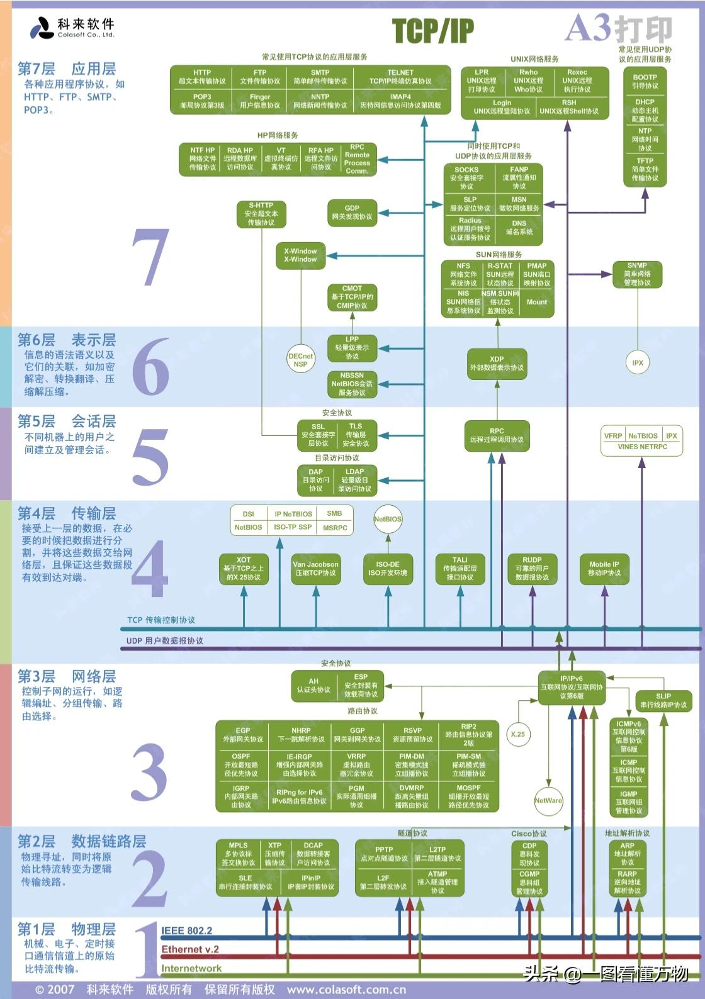
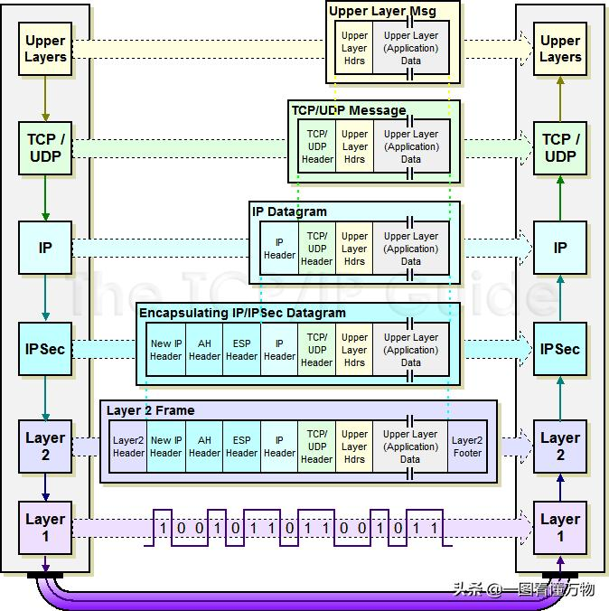
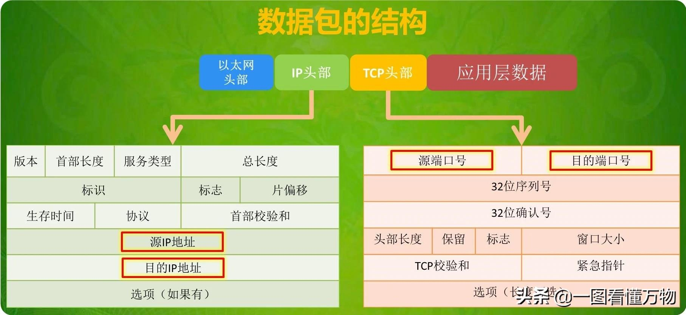
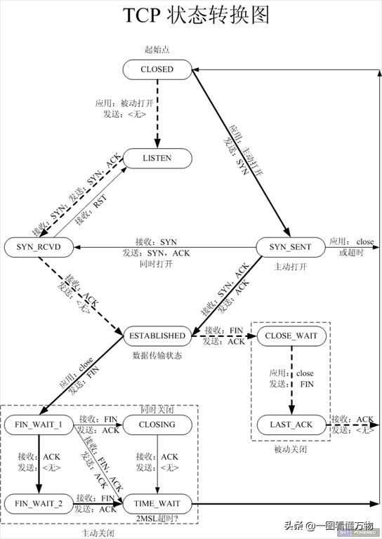
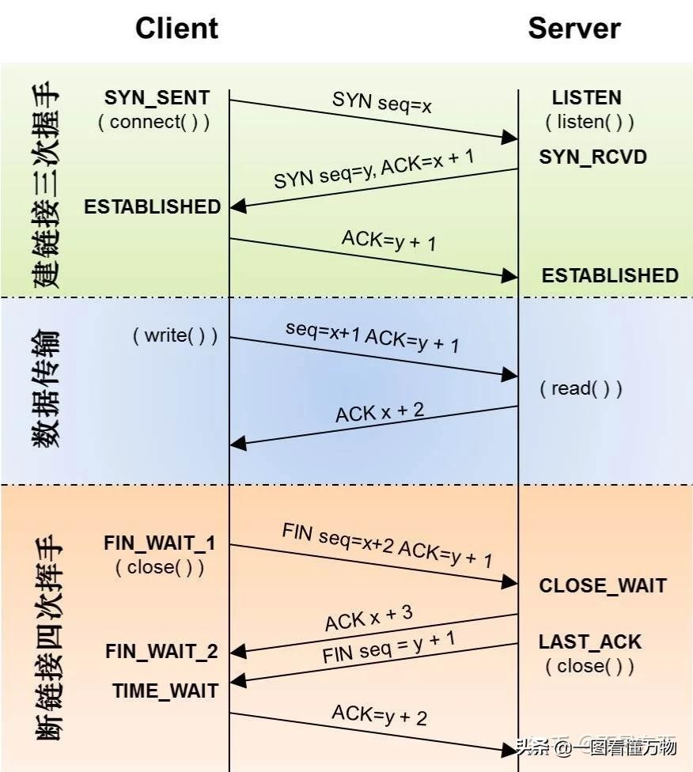
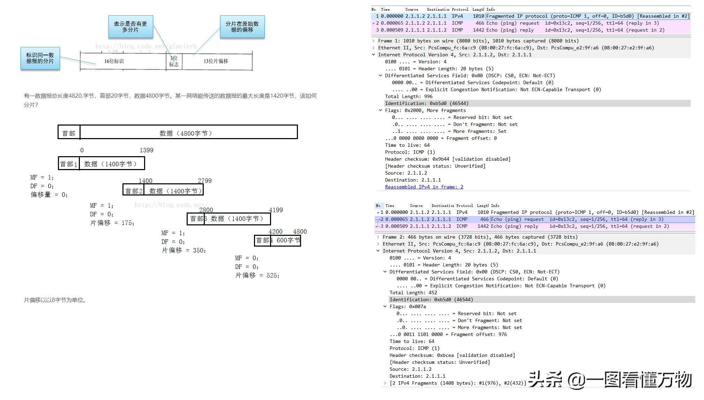
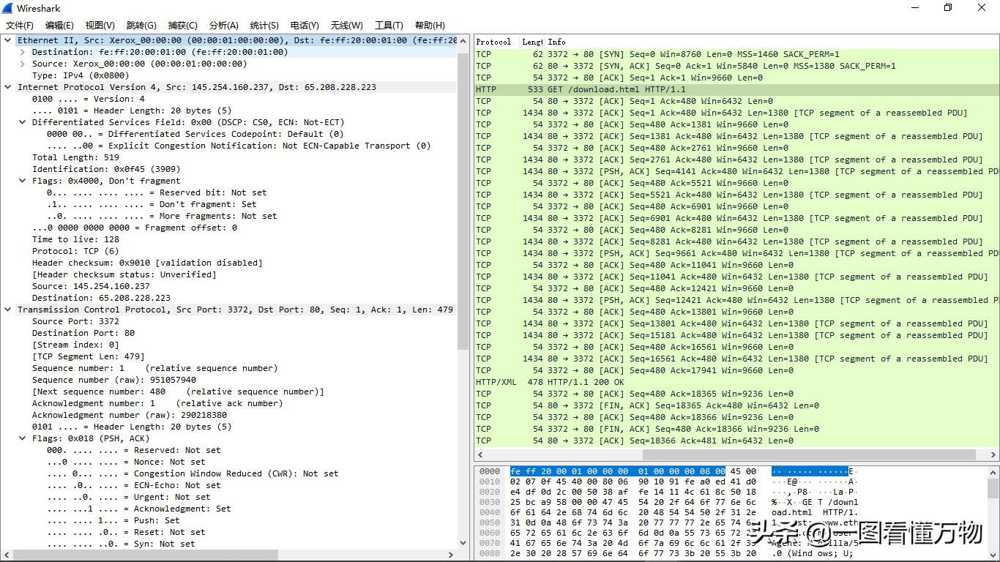
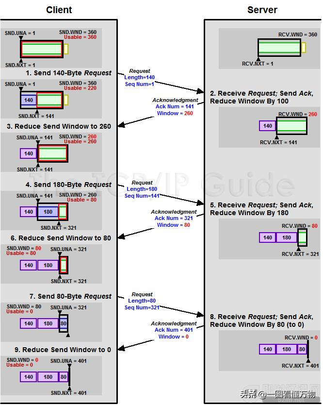
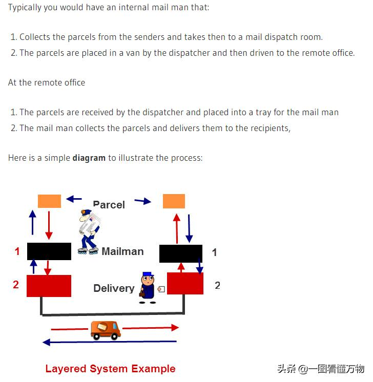

[TCP/IP协议详解（干货！）](https://blog.csdn.net/weixin_53186633/article/details/120514627)

[TCP/IP 协议](https://www.cnblogs.com/Liyuting/p/8805136.html)
[一篇文章带你熟悉 TCP/IP 协议（网络协议篇二）](https://juejin.im/post/5a069b6d51882509e5432656)
[通俗易懂-深入理解TCP协议（下）：RTT、滑动窗口、拥塞处理](http://www.52im.net/thread-515-1-1.html)
[tcp/ip 卷一 读书笔记（3）为什么既要有IP地址又要有MAC地址](https://www.cnblogs.com/zhangyufei/p/5565646.html)
[wireshark报文](https://wiki.wireshark.org/SampleCaptures)

[科来网络通讯协议图2019版](../files/tcp/科来网络通讯协议图2019版.pdf)

[接地气讲解TCP协议和网络程序设计（深度好文）](https://cloud.tencent.com/developer/article/1535959)

[接地气讲解UDP协议和网络程序设计（深度好文）](https://cloud.tencent.com/developer/article/1535962)

[3000字讲讲TCP协议，握手挥手不是你想的那么简单](https://www.toutiao.com/a6773950320000107016)

[TCP/IP、UDP、HTTP、MQTT、CoAP这五种物联网协议概述](https://www.toutiao.com/a6748413680527884813)

