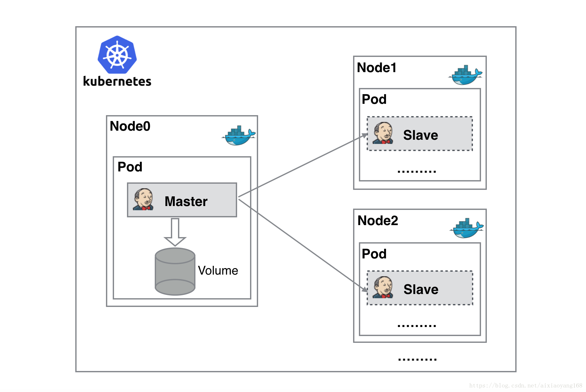

# 基于 Kubernetes 搭建 Jenkins

> 持续构建与发布是我们日常工作中必不可少的一个步骤，目前大多公司都采用 Jenkins 集群来搭建符合需求的 CI/CD 流程，然而传统的 Jenkins Slave 一主多从方式会存在一些痛点，比如：主 Master 发生单点故障时，整个流程都不可用了；每个 Slave 的配置环境不一样，来完成不同语言的编译打包等操作，但是这些差异化的配置导致管理起来非常不方便，维护起来也是比较费劲；资源分配不均衡，有的 Slave 要运行的 job 出现排队等待，而有的 Slave 处于空闲状态；最后资源有浪费，每台 Slave 可能是实体机或者 VM，当 Slave 处于空闲状态时，也不会完全释放掉资源。


工作流程大致为：当 Jenkins Master 接受到 Build 请求时，会根据配置的 Label 动态创建一个运行在 Docker Container 中的 Jenkins Slave 并注册到 Master 上，当运行完 Job 后，这个 Slave 会被注销并且 Docker Container 也会自动删除，恢复到最初状态。

好处：

- 服务高可用，当 Jenkins Master 出现故障时，Kubernetes 会自动创建一个新的 Jenkins Master 容器，并且将 Volume 分配给新创建的容器，保证数据不丢失，从而达到集群服务高可用。
- 动态伸缩，合理使用资源，每次运行 Job 时，会自动创建一个 Jenkins Slave，Job 完成后，Slave 自动注销并删除容器，资源自动释放，而且 Kubernetes 会根据每个资源的使用情况，动态分配 Slave 到空闲的节点上创建，降低出现因某节点资源利用率高，还排队等待在该节点的情况。
- 扩展性好，当 Kubernetes 集群的资源严重不足而导致 Job 排队等待时，可以很容易的添加一个 Kubernetes Node 到集群中，从而实现扩展。

## 安装nfs服务
```
yum -y install nfs-utils

mkdir -p /data/nfs

vi /etc/exports
/data/nfs 192.168.1.0/24(insecure,rw,sync,all_squash)

systemctl enable rpcbind
systemctl start rpcbind
systemctl enable nfs-server
systemctl start nfs-server

# systemctl status nfs-server.service
# systemctl daemon-reload
# service nfs restart


showmount -e or exportfs

权限问题（all_squash将任何用户都压缩为nfsnobody用户权限）
ll -d /data/nfs
chmod 777 /data/nfs
# 在服务端将该共享目录用户组与用户都设置为：nfsnobody
chown -R nfsnobody:nfsnobody /data/nfs

其它机器:
yum -y install nfs-utils
# showmount -e 192.168.110.213 查看
mkdir -p /data/nfs
mount -t nfs 192.168.110.213:/data/nfs /data/nfs


mount 重启失效
永久挂载https://www.cnblogs.com/wqs-Time/p/11687237.html
上面文章说/etc/fstab 最好不要挂载网络文件系统，可以挂载本地文件系统，实现永久挂载。

vi /etc/rc.local
/usr/bin/mount -t nfs 192.168.110.213:/data/nfs /data/nfs
or
vi /etc/fstab 
192.168.110.213:/data/nfs /data/nfs    nfs     defaults        0 0


可以做任何机器上的/data/nfs创建文件，去其它机器上查看


```


## kubernetes-plugin
https://github.com/jenkinsci/kubernetes-plugin

```
kubectl apply -f jenkins.yml

查看密码 kubectl logs jenkins-0  # b2eced072aeb462f971b24826d7c0ddf

访问：ip:30088
```
### 该Jenkins实例似乎已离线

- 1. 修改/var/lib/jenkins/updates/default.json
jenkins在下载插件之前会先检查网络连接，其会读取这个文件中的网址。默认是：
www.google.com改为www.baidu.com即可，更改完重启服务。

kubectl exec -it jenkins-0 sh 
cd /var/jenkins_home/updates/default.json
or
cat /data/nfs/jenkins/updates/default.json


- 2. 修改/var/lib/jenkins/hudson.model.UpdateCenter.xml

该文件为jenkins下载插件的源地址，改地址默认jenkins默认为：https://updates.jenkins.io/update-center.json，就是因为https的问题，此处我们将其改为http即可，之后重启jenkins服务即可。

其他国内备用地址（也可以选择使用）：

https://mirrors.tuna.tsinghua.edu.cn/jenkins/updates/update-center.json

http://mirror.esuni.jp/jenkins/updates/update-center.json

- 3. 安装插件那个页面，就是提示你offline的那个页面，不要动。然后打开一个新的tab，输入网址http://localhost:8080/jenkins/pluginManager/advanced。 这里面最底下有个【升级站点】，把其中的链接改成http的就好了，

http://updates.jenkins.io/update-center.json。 然后在服务列表中关闭jenkins，再启动，这样就能正常联网了


实测以上 3 步没用(有)，只需要第一步第二步就好了


### 安装插件
Docker kubernetes Pipeline Subversion git等
JUnit msbuild npm  golang  python 语言相关的选择安装
SonarScanner for Jenkins 


#### Pipeline
https://jenkins.io/doc/book/pipeline/
语法: https://jenkins.io/doc/book/pipeline/syntax/


### Kubernetes 插件
填写Kubernetes插件配置。
打开Jenkins UI并导航到 
管理Jenkins -> Configure System配置系统->Cloud云-> Kubernetes，
（Cloud云 迁移到http://192.168.110.213:30088/configureClouds/）
并适当地输入Kubernetes URL和Jenkins URL，除非Jenkins在Kubernetes中运行，否则默认情况下是有效的。


## 参考

[基于 Jenkins 和 Kubernetes 的持续集成测试](https://www.toutiao.com/a6815083049072460299)

[Jenkins在k8s集群的安装、slave节点在k8s内自动创建销毁，通过pipeline实现java项目的持续集成发布。](https://www.jianshu.com/p/aaa16f1566d7)


[初试 Jenkins 使用 Kubernetes Plugin 完成持续构建与发布](https://blog.csdn.net/aixiaoyang168/article/details/79767649)

[04 Jenkins Kubernetes插件动态创建slave agent](https://www.jianshu.com/p/4652bb23de6f)

