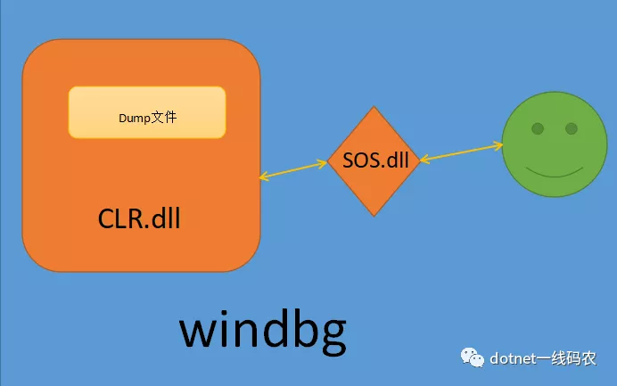

[安装](https://docs.microsoft.com/zh-cn/windows-hardware/drivers/debugger/debugger-download-tools)

bcdedit -debug on

[入门](https://docs.microsoft.com/zh-cn/windows-hardware/drivers/debugger/getting-started-with-windows-debugging)

https://blog.csdn.net/luchengtao11/article/details/82379374

## 教你配置windows上的windbg,linux上的lldb，打入clr内部这一篇就够了

### 配置微软公有符号
符号其实就是pdb文件，我们在debug模式下编译项目都会看到这个，它的作用会对dll进行打标，这样在调试时通过pdb就能看到局部变量，全局变量，行号等等其他信息，在FCL类库中的pdb文件就放在微软的公有服务器上，SRV*C:\mysymbols*http://msdl.microsoft.com/download/symbols。

File -> Settings -> debugging settings -> Default Symbol Path


### 理解sos.dll和clr.dll
很多时候大家都是事后调试，所以需要在生产上抓一个dump文件，为了将dump文件逆向到clr上的运行时状态，你必须要寻找到当时运行程序clr版本，同时也要找到对应clr版本的sos.dll，他们通常是在一起的，sos 就是 你 和 clr交互的渠道，很多人都卡在寻找正确版本的sos和clr版本上。。。如果不清楚，我可以画张图。



## windows上的 netcore 3.1 配置
```Csharp
 static void Main(string[] args)
{
    var info = "hello world!";
    Console.WriteLine(info);
    Console.ReadLine();
}
```

### 寻找clr.dll
在netcore中，clr的名字变成了 coreclr.dll，路径：C:\Program Files\dotnet\shared\Microsoft.NETCore.App\3.1.3\coreclr.dll

### 寻找sos.dll
netcore3.0开始，sos就没有放在版本号文件下了，详见 SOS_README.md 内容。
C:\Program Files\dotnet\shared\Microsoft.NETCore.App\3.1.3\SOS_README.md
```
SOS and other diagnostic tools now ship of band and work with any version of the .NET Core runtime.

SOS has moved to the diagnostics repo here: https://github.com/dotnet/diagnostics.git.

Instructions to install SOS: https://github.com/dotnet/diagnostics#installing-sos.
```
看了上面文档，大概意思就是说老版本的windbg，需要通过小工具dotnet-sos 自己生成一个sos.dll，那就按照文档来吧

```powershell
PS C:\WINDOWS\system32> dotnet tool install -g dotnet-sos
You can invoke the tool using the following command: dotnet-sos
Tool 'dotnet-sos' (version '3.1.122203') was successfully installed.
PS C:\WINDOWS\system32> dotnet-sos install
Installing SOS to C:\Users\hxc\.dotnet\sos from C:\Users\hxc\.dotnet\tools\.store\dotnet-sos\3.1.122203\dotnet-sos\3.1.122203\tools\netcoreapp2.1\any\win-x64
Installing over existing installation...
Creating installation directory...
Copying files...
Execute '.load C:\Users\hxc\.dotnet\sos\sos.dll' to load SOS in your Windows debugger.
Cleaning up...
SOS install succeeded
PS C:\WINDOWS\system32>
```
仔细看输出，sos.dll 已经生成好了，接下来在任务管理器中生成一个dump文件，然后使用 .load 命令把 coreclr 和 sos 加载进去即可。

右键进程-》创建转储文件(Create dump file)
```
.load C:\Users\hxc\.dotnet\sos\sos.dll
.load C:\Program Files\dotnet\shared\Microsoft.NETCore.App\3.1.3\coreclr.dll
```

最后我们抓一下 info 变量在堆上的分布。
```
0:000> ~0s
ntdll!ZwReadFile+0x14:
00007ff8`3228aa64 c3              ret

0:000> !clrstack -l
OS Thread Id: 0x41d4 (0)

000000246097EA40 00007FFF89C50F97 Error: Fail to initialize CoreCLR 80131022
ConsoleApp5.Program.Main(System.String[])
    LOCALS:
        0x000000246097EA68 = 0x0000021d8141aba8

0:000> !do 0x0000021d8141aba8
Name:        System.String
MethodTable: 00007fff89cd1e18
EEClass:     00007fff89cc2128
Size:        46(0x2e) bytes
File:        C:\Program Files\dotnet\shared\Microsoft.NETCore.App\3.1.3\System.Private.CoreLib.dll
String:      hello world!
Fields:
              MT    Field   Offset                 Type VT     Attr            Value Name
00007fff89c1b1e8  4000242        8         System.Int32  1 instance               12 _stringLength
00007fff89c18000  4000243        c          System.Char  1 instance               68 _firstChar
00007fff89cd1e18  4000244      110        System.String  0   static 0000021d81411360 Empty
```

## windows 上的 netframework 配置
framework程序比netcore配置要方便的多，不需要自己去生成sos了，如下代码所示：
```

64位程序加载路径

 .load C:\Windows\Microsoft.NET\Framework64\v4.0.30319\sos.dll
 .load C:\Windows\Microsoft.NET\Framework64\v4.0.30319\clr.dll

32位程序加载路径

 .load C:\Windows\Microsoft.NET\Framework\v4.0.30319\sos.dll
 .load C:\Windows\Microsoft.NET\Framework\v4.0.30319\clr.dll
```

## centos 上的 netcore 3.1 配置
### 使用netcore内置的dotnet-dump 小工具
这个工具🐮👃的地方在于，sos和clr都不需要你配置，直接使用它生成dump，然后直接调试，方便至极，下面看看怎么安装，开两个terminal，如下代码：
```
terminal 1:

[root@10-25-198-96 data]# dotnet build
[root@10-25-198-96 netcoreapp3.1]# dotnet data.dll
hello world


terminal 2:

[root@10-25-198-96 cs2]# ps -ef | grep dotnet
root     31555 31247  0 22:28 pts/0    00:00:00 dotnet cs2.dll
root     32112 31995  0 22:29 pts/2    00:00:00 grep --color=auto dotnet

[root@10-25-198-96 cs2]# dotnet tool install -g dotnet-dump
You can invoke the tool using the following command: dotnet-dump
Tool 'dotnet-dump' (version '3.1.122203') was successfully installed.
[root@10-25-198-96 cs2]# export PATH=$PATH:$HOME/.dotnet/tools
[root@10-25-198-96 cs2]# dotnet-dump collect --process-id 31555
Writing full to /cs2/core_20200508_223204
Complete
```
可以看到dump文件已经好了 /cs2/core_20200508_223204 ，接下来用 dotnet-dump 对dump文件调试。
```
[root@10-25-198-96 cs2]# dotnet-dump analyze /cs2/core_20200508_223204
Loading core dump: /cs2/core_20200508_223204 ...
Ready to process analysis commands. Type 'help' to list available commands or 'help [command]' to get detailed help on a command.
Type 'quit' or 'exit' to exit the session.
> clrstack -l
OS Thread Id: 0x7b43 (0)
        Child SP               IP Call Site
00007FFDFCABF2D0 00007fb0397af7fd [InlinedCallFrame: 00007ffdfcabf2d0] Interop+Sys.ReadStdin(Byte*, Int32)
00007FFDFCABF2D0 00007fafbebbb4db [InlinedCallFrame: 00007ffdfcabf2d0] Interop+Sys.ReadStdin(Byte*, Int32)
00007FFDFCABF2C0 00007FAFBEBBB4DB ILStubClass.IL_STUB_PInvoke(Byte*, Int32)

00007FFDFCABF9D0 00007FAFBECF844D System.Console.ReadLine()

00007FFDFCABF9E0 00007FAFBEBB037D cs2.Program.Main(System.String[]) [/cs2/Program.cs @ 13]
    LOCALS:
        0x00007FFDFCABF9F0 = 0x00007faf980081d8

00007FFDFCABFD08 00007fb037fc0f7f [GCFrame: 00007ffdfcabfd08]
00007FFDFCAC01F0 00007fb037fc0f7f [GCFrame: 00007ffdfcac01f0]
> dumpobj 0x00007faf980081d8                                                                               
Name:        System.String
MethodTable: 00007fafbec30f90
EEClass:     00007fafbeb9e1b0
Size:        44(0x2c) bytes
File:        /usr/share/dotnet/shared/Microsoft.NETCore.App/3.1.3/System.Private.CoreLib.dll
String:      hello world
Fields:
              MT    Field   Offset                 Type VT     Attr            Value Name
00007fafbec2a0e8  400022a        8         System.Int32  1 instance               11 _stringLength
00007fafbec26f00  400022b        c          System.Char  1 instance               68 _firstChar
00007fafbec30f90  400022c      108        System.String  0   static 00007faf97fff360 Empty
>
```
不过这个工具虽好，但是不能调试非托管堆，而且命令也不是太多，当然够我们平时用了。

### 使用linux专属的lldb调试器
#### 安装lldb
lldb是使用C++写的，也可以在 https://github.com/dotnet/diagnostics/blob/master/documentation/building/linux-instructions.md 寻找安装办法。
```
sudo yum install centos-release-SCL epel-release
sudo yum install cmake cmake3 gcc gcc-c++ gdb git libicu libunwind make python27 tar wget which zip
cd $HOME
git clone https://github.com/dotnet/diagnostics.git
$HOME/diagnostics/documentation/lldb/centos7/build-install-lldb.sh


[root@10-25-198-96 cs2]# lldb -v
lldb version 3.9.1 ( revision )
```
#### 寻找sos.dll
跟windbg一样，你需要生成一个sos.dll 。。。同样也是使用 dotnet-sos 生成。
```
[root@10-25-198-96 cs2]# dotnet tool install -g dotnet-sos
You can invoke the tool using the following command: dotnet-sos
Tool 'dotnet-sos' (version '3.1.122203') was successfully installed.
[root@10-25-198-96 cs2]# dotnet-sos install
Installing SOS to /root/.dotnet/sos from /root/.dotnet/tools/.store/dotnet-sos/3.1.122203/dotnet-sos/3.1.122203/tools/netcoreapp2.1/any/linux-x64
Installing over existing installation...
Creating installation directory...
Copying files...
Updating existing /root/.lldbinit file - LLDB will load SOS automatically at startup
Cleaning up...
SOS install succeeded
```
从上面信息看，sos 是安装在 /root/.dotnet/sos 目录下，同时也看到在lldb启动的时候会自动加载sos.dll 。。。

#### 使用createdump 生成dump文件
每个dotnet版本下都有一个createdump程序，可以用它生成dump文件，具体配置文档可以参见：

https://github.com/dotnet/diagnostics/blob/master/documentation/debugging-coredump.md

https://github.com/dotnet/runtime/blob/master/docs/design/coreclr/botr/xplat-minidump-generation.md#configurationpolicy
```
[root@10-25-198-96 cs2]# ps -ef | grep dotnet
root     31555 31247  0 22:28 pts/0    00:00:00 dotnet cs2.dll
root     32112 31995  0 22:29 pts/2    00:00:00 grep --color=auto dotnet

[root@10-25-198-96 cs2]# find / -name createdump
/usr/share/dotnet/shared/Microsoft.NETCore.App/3.1.3/createdump

[root@10-25-198-96 3.1.3]# ./createdump 31555  -f /lldb/test.dump
Writing minidump with heap to file /lldb/test.dump
Written 84692992 bytes (20677 pages) to core file

[root@10-25-198-96 3.1.3]# lldb --core /lldb/test.dump
(lldb) target create --core "/lldb/test.dump"
Core file '/lldb/test.dump' (x86_64) was loaded.
(lldb) clrstack -l
OS Thread Id: 0x7b43 (1)
00007FFDFCABF9E0 00007FAFBEBB037D cs2.Program.Main(System.String[]) [/cs2/Program.cs @ 13]
    LOCALS:
        0x00007FFDFCABF9F0 = 0x00007faf980081d8

00007FFDFCABFD08 00007fb037fc0f7f [GCFrame: 00007ffdfcabfd08]
00007FFDFCAC01F0 00007fb037fc0f7f [GCFrame: 00007ffdfcac01f0]
(lldb) dumpobj 0x00007faf980081d8
Name:        System.String
MethodTable: 00007fafbec30f90
EEClass:     00007fafbeb9e1b0
Size:        44(0x2c) bytes
File:        /usr/share/dotnet/shared/Microsoft.NETCore.App/3.1.3/System.Private.CoreLib.dll
String:      hello world
Fields:
              MT    Field   Offset                 Type VT     Attr            Value Name
00007fafbec2a0e8  400022a        8         System.Int32  1 instance               11 _stringLength
00007fafbec26f00  400022b        c          System.Char  1 instance               68 _firstChar
00007fafbec30f90  400022c      108        System.String  0   static 00007faf97fff360 Empty
(lldb)
```